# Examples

Here are some common, famous (and infamous!) regular expressions, showing how they are visualized as mermaid diagrams:

> [!IMPORTANT]  
> In many cases, regular expressions are NOT the best tool for validating input. Consider using dedicated libraries or built-in functions where available for complex patterns (e.g., email addresses, URLs, dates).
>
> These examples are provided for educational purposes to illustrate regex capabilities and their visualizations.

> [!TIP]
> If you are viewing this page somewhere that does not render embedded Mermaid diagrams, you can click the "view as image" links below, or view the diagrams by copy/pasting the code blocks below into the [Mermaid Live Editor](https://mermaid.live).

<!-- CONTENT:START -->

## Table of Contents

- [Comprehensive RegExp Features](#comprehensive-regexp-features)
- [Conventional Commits](#conventional-commits)
- [Cron Schedule](#cron-schedule)
- [DateTime (RFC3339)](#datetime-rfc3339)
- [Email Address](#email-address)
- [Email (RFC2822)](#email-rfc2822)
- [Emoji Support](#emoji-support)
- [HTML Tags](#html-tags)
- [IP Address](#ip-address)
- [Complex Password Requirements](#complex-password-requirements)
- [Phone Number](#phone-number)
- [Semantic Versioning](#semantic-versioning)
- [URL (RFC3987)](#url-rfc3987)
- [URL](#url)
- [UUID](#uuid)

## Comprehensive RegExp Features

Demonstrates MDN JavaScript RegExp syntax cheatsheet features including character classes (\d \D \w \W \s \S .), assertions (^ $ \b \B), lookahead/lookbehind ((?=) (?!) (?<=) (?<!)), groups (capturing, named, non-capturing), backreferences (\1 \k<name>), quantifiers (? * + {n} {n,} {n,m}), character classes ([abc] [a-z] [^xyz]), and alternation (|)

Source: <https://developer.mozilla.org/en-US/docs/Web/JavaScript/Reference/Regular_expressions>

### Pattern {#Comprehensive RegExp Features}

```regex
^(?<named>[A-Z]\w{2,5}):\s+(a|b|cd)(?:https?:\/\/)?(?<domain>[a-z0-9.-]+)(?=\.com)(?!\.org)(?<=example)(?<!test)[a-z]{1,3}\.com(?:\/\S+)?(?:\?[a-zA-Z0-9&=]+)?(?<digit>\d+)\k<digit>\1\b\B\d+\D+\w+\W+\s+\S+[^xyz]+\t\r\n|alt$
```

### Diagram

[View in Mermaid Live Editor](https://mermaid.live/edit#pako:H4sIAAAAAAACA6VYW1PbOhD-K2poOzDEEN-SOOXSxE760uGcac9MZw5JGcUWiQ_G9timECj__ejim-QLhubB2Nrdb1fSavUtTz07cFBv0ttEMNyCr9-WPgDQtv9xEw9NwLL3DW3QwwT83D8_8eEtcs4up9K_qyX-3T8pff35YELe48N9-Hv923YO9s8n2yQJ43M6fkwfB-fY2gluoeufXULpcSAZR9LqEOueEvmRHdzi93f0PYg2-P3kFD3A29BD5P1dguLkgBiunuS--pzZ7Jd8fD8kTuj3OdHEQWIvH09Xh8y5u3GTMyJ1Dg_In5vSkEwea_KYMQ3ytOjznj5_HLI5MkeXPx92jyv6kZBHRB7-b-gl75e9dPksFNsRWb4vyEcRTJAD7t1kCyKymlISSLcowsvhfJaP5KMBMSOGHz6AC7wbMXmPExgln59AvIUh3ohryXYjGzx_IrJr12-QOG78351vJ27gX63RxvWv5MlkUhrtYId8p6MVjGMUURt5f9n7ebKOzk7csxnxG9P5nhy7Z8veAQbLVamhvYXRle3hQWo59XfgLgxRZMMYMX2iIVGNwiBGSa5-H0QOHYV2gqLUswKSAOiFUwqCrSiE52JF6FGECZOnQ7wHJfOwxdI4hDZK0f_yEQgicBtEqMFFdfWVN61-N6tsQiRgWJ1QJlaxeN0s1rDYdprlOpaTA92sMcQacbZGIQkYesUC1VmM6BaQg3vcsBEsN7Kt8IJ7lhvECxmgZ5d8HAHpxd0psijzP8a4rIQ0x2gwHVyOmnXkAVZKC1WLFsk4UsJa56rWzRXPSyY5rb44JVnpMCdZpUrHLdlPNC6CpGP2-2hDaptUf9A06u28ddpa0xbn9aCy5x_B6Sv2PJ9Z5inH6XSk19C-uYrQNYqQbyNaPMrXR1bysJaUaxVQa268DlBJAeXXIxXVl4HMUgiyfZAVyHVw5zsw2jXV4QKCZcY6hfjRxThfWf1NK5ubD9OUgy8D1OZbDjRquxteEdA4D6g7UntkxtvvlOLmG_z50SwdPLJpD2AHHjuD1BQdnWZNQjmQ31J3yBZjflTVKBKQHM_3aSxz32njDylV-n63pqSV0aX0A1CSemXDMLmL8HkFl8seHQJ78rK3Iqo8_SiN0FUm3_gOZl5yVMzGyFlwGOCXKLgLwZ6SA9Zc_FUBvdnZcH51858q_6nVx-JjLDY_19-wgC4CX8qHQOUeXvG4Ov855D9HDV65dVWIV8bowZ5at7BKPUwYxG7i_kJXXhDcwC2C6ZL-nY6Dr9l4JexxQ2AkR2sQL9LxFkSjQ4xrtHX9uiCZoIIpDzqEWQbl4mwClbukgvL6VJBVIf_VLo7UNzjSKhmidUk06oreC2BP4_OMXuocBi4Kc2dT6p-AJEl1PVFTr0T1S12N2OVQebl6VLqZQoNWE6GEU2m-JHyN5C0VoSlpmInS1HdwnhS-X6hg0crUCUnlW4s_QNL4LqQjEh3lcHS-W-FkQ75P4WQjviMRd1ap9CKc9ZjvJziZwfcR_J4PhAaClwopUck3tdI18PaK0BPwUlVoBviMU4VGgLfVBGovRqZViD2PrglknEpFcl3LuOs0lVoqLZxeRWTJglwVKTAfsS6QXF46FDgsLx0JxJSXjgW6yUsNgToKFWUgskJxJ_QK0-N3UhcoXO3Ja6-QBa8TaJ6wwprI8Tr6oqNU99otE75k57Hinv6jjI7g24dOmMzVQtdlIGzueZO9xcIyhsN-nETBDcKfsqmoSt8OvCCa7A3o7xMHkUecAsyG1mg6zgEM1dRGVhtAwZczBG06sooQxvORaaovIuANTu2NxXRsTXN73RzOzEGbfbon2QoY5swwc_P50JDVcZu52D2kOPOFMTWKMOa6aqg6j5MKJQfG2DaCuwnQgc6j881sFqNm4l-BPRjiX-cYy4s9nxr4lyOZJo2rW5RpdjGGX5delJ6kxCcL3TLmU0t9RX5k7USeoAulNPWXE9TnuBcDMRdzZVEEMcRBzWdtIBnNlXLinE_HUubGK5I147YVpA572iVfuEgZRc632pKtwoGpjGbTQedQOaiFOddNq_WMvJQ10zD0dmnumMQjq1YsN4XGtC80VH2R93KJVkyi3IpmryWp0Bz2hQ6hLxJ5LpNKOLV9WjVjyp7r-rBqZjT5yFuims1u8pLb1Ozqp97z_w1IwIDcGgAA)

<details>
  <summary>Click to view as image</summary>
  <p align="center">
    
  </p>
</details>

```mermaid
graph LR
  accTitle: "Regex: ^(?<named>[A-Z]\\w{2,5}):\\s+(a|b|cd)(?:https?:\\/\\/)?(?<domain>[a-z0-9.-]+)(?=\\.com)(?!\\.org)(?<=example)(?<!test)[a-z]{1,3}\\.com(?:\\/\\S+)?(?:\\?[a-zA-Z0-9&=]+)?(?<digit>\\d+)\\k<digit>\\1\\b\\B\\d+\\D+\\w+\\W+\\s+\\S+[^xyz]+\\t\\r\\n|alt$"
  accDescr: "Generated with regex-to-mermaid@1.1.0"

  %% Nodes
  start@{ shape: f-circ };
  fin@{ shape: f-circ };
  disjunction_begin_1:::disjunction@{ shape: f-circ };
  disjunction_end_1:::disjunction@{ shape: f-circ };
  assertion_1("^<br><i>Begins with</i>"):::assertion;
  char_class_1("Any uppercase"):::char-class;
  char_set_1("Any word character<br><i>2 to 5</i>"):::char-set;
  literal_1(":"):::literal;
  char_set_2("Any whitespace<br><i>One or more</i>"):::char-set;
  disjunction_begin_2:::disjunction@{ shape: f-circ };
  disjunction_end_2:::disjunction@{ shape: f-circ };
  literal_2("a"):::literal;
  literal_3("b"):::literal;
  literal_4("cd"):::literal;
  literal_5("http"):::literal;
  literal_6("s<br><i>Optional</i>"):::literal;
  literal_7(":\/\/"):::literal;
  char_class_2("Any lowercase<br>Any digit<br>. -<br><i>One or more</i>"):::char-class;
  literal_8("\.com"):::literal;
  literal_9("\.org"):::literal;
  literal_10("example"):::literal;
  literal_11("test"):::literal;
  char_class_3("Any lowercase<br><i>1 to 3</i>"):::char-class;
  literal_12("\.com"):::literal;
  literal_13("\/"):::literal;
  char_set_3("Not whitespace<br><i>One or more</i>"):::negated-char-set;
  literal_14("\?"):::literal;
  char_class_4("Any lowercase<br>Any uppercase<br>Any digit<br>& =<br><i>One or more</i>"):::char-class;
  char_set_4("Any digit<br><i>One or more</i>"):::char-set;
  back_reference_1("\\k<digit><br><i>Back-reference</i>"):::back-reference;
  back_reference_2("\\1<br><i>Back-reference</i>"):::back-reference;
  assertion_2("\B<br><i>Not a word boundary</i>"):::assertion;
  assertion_3("\b<br><i>Word boundary</i>"):::assertion;
  char_set_5("Any digit<br><i>One or more</i>"):::char-set;
  char_set_6("Not a digit<br><i>One or more</i>"):::negated-char-set;
  char_set_7("Any word character<br><i>One or more</i>"):::char-set;
  char_set_8("Not a word character<br><i>One or more</i>"):::negated-char-set;
  char_set_9("Any whitespace<br><i>One or more</i>"):::char-set;
  char_set_10("Not whitespace<br><i>One or more</i>"):::negated-char-set;
  char_class_5("x y z<br><i>One or more</i>"):::negated-char-class;
  literal_15("\t\r\n"):::literal;
  literal_16("alt"):::literal;
  assertion_4("$<br><i>Ends with</i>"):::assertion;

  %% Subgraphs
  subgraph named_capture_1 ["named #1"]
    char_class_1
    char_set_1
  end

  subgraph standard_1 ["Group #2"]
    disjunction_begin_2
    disjunction_end_2
    literal_2
    literal_3
    literal_4
  end

  subgraph non_capturing_1 ["Non-capturing <i>Optional</i>"]
    literal_5
    literal_6
    literal_7
  end

  subgraph named_capture_2 ["domain #3"]
    char_class_2
  end

  subgraph positive_lookahead_1 ["Positive Lookahead"]
    literal_8
  end

  subgraph negative_lookahead_1 ["Negative Lookahead"]
    literal_9
  end

  subgraph positive_lookbehind_1 ["Positive Lookbehind"]
    literal_10
  end

  subgraph negative_lookbehind_1 ["Negative Lookbehind"]
    literal_11
  end

  subgraph non_capturing_2 ["Non-capturing <i>Optional</i>"]
    literal_13
    char_set_3
  end

  subgraph non_capturing_3 ["Non-capturing <i>Optional</i>"]
    literal_14
    char_class_4
  end

  subgraph named_capture_3 ["digit #4"]
    char_set_4
  end

  %% Edges
  start --- disjunction_begin_1;
  disjunction_begin_1 --- assertion_1;
  assertion_1 --- char_class_1;
  char_class_1 --- char_set_1;
  char_set_1 --- literal_1;
  literal_1 --- char_set_2;
  char_set_2 --- disjunction_begin_2;
  disjunction_begin_2 --- literal_2;
  literal_2 --- disjunction_end_2;
  disjunction_begin_2 --- literal_3;
  literal_3 --- disjunction_end_2;
  disjunction_begin_2 --- literal_4;
  literal_4 --- disjunction_end_2;
  disjunction_end_2 --- literal_5;
  literal_5 --- literal_6;
  literal_6 --- literal_7;
  literal_7 --- char_class_2;
  char_class_2 --- literal_8;
  literal_8 --- literal_9;
  literal_9 --- literal_10;
  literal_10 --- literal_11;
  literal_11 --- char_class_3;
  char_class_3 --- literal_12;
  literal_12 --- literal_13;
  literal_13 --- char_set_3;
  char_set_3 --- literal_14;
  literal_14 --- char_class_4;
  char_class_4 --- char_set_4;
  char_set_4 --- back_reference_1;
  back_reference_1 --- back_reference_2;
  back_reference_2 --- assertion_2;
  assertion_2 --- assertion_3;
  assertion_3 --- char_set_5;
  char_set_5 --- char_set_6;
  char_set_6 --- char_set_7;
  char_set_7 --- char_set_8;
  char_set_8 --- char_set_9;
  char_set_9 --- char_set_10;
  char_set_10 --- char_class_5;
  char_class_5 --- literal_15;
  literal_15 --- disjunction_end_1;
  disjunction_begin_1 --- literal_16;
  literal_16 --- assertion_4;
  assertion_4 --- disjunction_end_1;
  disjunction_end_1 --- fin;

  %% Styles
  %% Node Styling
  classDef disjunction fill:#FFD966,stroke:#F1C232,color:#000000;
  classDef assertion fill:#B6D7A8,stroke:#93C47D,color:#000000;
  classDef char-class fill:#B4A7D6,stroke:#8E7CC3,color:#000000;
  classDef char-set fill:#9FA8DA,stroke:#5C6BC0,color:#000000;
  classDef literal fill:#F9CB9C,stroke:#E69138,color:#000000;
  classDef negated-char-set fill:#EF9A9A,stroke:#E53935,color:#000000,stroke-dasharray: 5 5;
  classDef back-reference fill:#F4CCCC,stroke:#E06666,color:#000000;
  classDef negated-char-class fill:#EA9999,stroke:#CC0000,color:#000000,stroke-dasharray: 5 5;

  %% Group Styling
  classDef named-capture fill:#D9EAD3,stroke:#93C47D,color:#000000;
  classDef standard fill:#FFF2CC,stroke:#F1C232,color:#000000;
  classDef non-capturing fill:#CFE2F3,stroke:#6D9EEB,color:#000000;
  classDef positive-lookahead fill:#D9D2E9,stroke:#8E7CC3,color:#000000;
  classDef negative-lookahead fill:#F4CCCC,stroke:#E06666,color:#000000,stroke-dasharray: 5 5;
  classDef positive-lookbehind fill:#EAD1DC,stroke:#C27BA0,color:#000000;
  classDef negative-lookbehind fill:#FCE5CD,stroke:#E69138,color:#000000,stroke-dasharray: 5 5;

  %% Apply Group Classes
  class named_capture_1,named_capture_2,named_capture_3 named-capture;
  class standard_1 standard;
  class non_capturing_1,non_capturing_2,non_capturing_3 non-capturing;
  class positive_lookahead_1 positive-lookahead;
  class negative_lookahead_1 negative-lookahead;
  class positive_lookbehind_1 positive-lookbehind;
  class negative_lookbehind_1 negative-lookbehind;
```

---

## Conventional Commits

Validates a RFC3339 DateTime format

Source: <https://regex101.com/library/vcxVpP>

### Pattern {#Conventional Commits}

```regex
\A(?:(?:^(?P<type>feat|fix|ci|chore|docs|test|style|refactor|build|perf|revert)(?:\((?P<scope>[\w-]+)\))?(?P<breaking>!)?:\s(?P<subject>\b[\w#<> ./\t\\-]{3,}(?:\b|\.))$)(?:(?:(?P<BLANK_LINE>\n^$\n)(?P<body>(?:^.{3,}(?:\b|\.)$\n?){1,3}))?(?P<BLANK_LINE2>\n^$\n)(?:(?P<breaking_change>^BREAKING\sCHANGE:\s[\s\w]+(?:\b|\.)$)\n)?(?:(?P<footer>^\w+:\s[\w#-]+(?:\b|\.))))?\n?|)\Z
```

### Diagram

[View in Mermaid Live Editor](https://mermaid.live/edit#pako:H4sIAAAAAAACA-Va_W-bOBj-V1i6SY2WdMHmM6vSJWm6mzb1Ttv9tHWtCCEtuwwioNdVTf_3sw0B_BoTSKTTSRdNG7ZfP36__GLz7KnjhguvM-zcRs76Tvn0-SpQFMd1__STlTdUrjqfvVvvF3kgv_Hx2ZD8uT4---M0eVx7o6XnJJul_2vj-hv3Loy8zSJ0403ixckmTh5X3ibylo6bhNFmfu-vFpu1Fy1J399elHQJEgU9pmixGxK4b7T90P_-uksfut0zOjSPPOcvP7gdveimE2I24X7-w3OTEe2Yp_OOTkfKyRv6mFxlv_73J9x7zhaab-jfJ93uy25qB8WZfBpffrz59OFyxqCC65fsny5bOVw8jqi9JxUoqdxZ90nt4edM1QIMQbRh2ZQb984Jbr3R9eTzbPzxw-V7Ztb0t_Hl-1lqIrMoZmZ9fw1X7qagZxnqMgwTLxpdM-nXpfkPR31hMvmdpZpvGMzXq04W8HMvdiMa8Pde4EVO4i2UBz-5UyIa_34S9n960U_HX7xTT9STAZ1GJ756pVyS_Inpc5w4UfLuSYnvnDVJnWXf9SNXeX5Lx5Z-IBlZ-UR7Z3WjHhPMq_FVpzscDrNOJrDw4x_3gZv4YXAz92794EYlEqVeCXB5nhcsGs5y4pgkJ51DFbomMRud-qMJXTdmDjl9449SJXNRiZpoLzWbzdp6DREl6S4U3baVwFTC_yUX0IiA68vHdTpON7dcxCAidOfLJUwiQcuCXMIiEqxmyEVsIrItKHIpdUDEWLmpkaHBpcWoRgSx1WipqhHCLGuPRQmyxaMbd0VyhCXSOHhUHsJowfqJAV5EM6ufpdfvgaeEkfKTOLlILyrZZwj8khpbslujFI3Yi5pxGq6hROXYSwqF78hovHZcr6QREQAbBTGFJpktl2GiOKmt8_A-WDjRo2zLlHyEpD46Uk6VkfKFaqGcKG_IiyhhLyNl6zy803Xi1sR7bU3csoLgfR2TR8rM3JJ7RIxasRxNjJfZYrNgUV-u8iXovrv0HlZ-4NWB6-2qYTHR2Esru5lWZjut8gxH0K87cmmb9GImaXtlktYyk6xDMwkN2mSSvU_MkFrEbFvX1lTKWRVTq-oRQs2CzQr7XjnIyn17g3BDvVA7vXJ8umHzI6C8HOMm5TgHpRt1e5SUY2pNMEv1WdSB2ltdsRu-0MS9pO-1l_S257qDyzIy2mwmda-6jMyGyafvWQJ16Ru3Nn5Cvlk7DhNGy0zTak4C_YPSy9grvYy26WUcnF727vTKT_eDPYsuTu9bX6FEdqn7cj9nHwTSi13WoDc8agG5SynfyEUxCu_XypF61flOpSqvQOIAu-Ok3bnBfBPzTY1v6nzT4Jsm37T4ps031QFoq6DNFCMKp24R3YBKbkC5G8pH_2qAgPjBddbJfUS_BmCKchkG_bxLEcKYQRcrA02Bz1Rth-a4pDmWLlfcKJrYoQl21GQGrs6MrLt0hgaamDsM00qGafn6QFG4CBICh5oYjOQGFzulOnAgA4AQrtG6sBRaAbPXKFnFrnVwwq4k0Uu-1MWksCCeDjvA5lTtJl612qSRVp1Ggm9AIUCDJpqYlRtTVZJQwdw-AQbAxU0QCAQFQF1C6o7AGKXAGPVaAIuamG3sUY_0diqUZho7bDVLtppCEiLBl9uiXj79gzm4iRfUQZs81KvzUNgRsFCjXeZbJfMtSagrTIZvWA2kIFRDB-OaUBGFyix7x_C62c2TqdqowhNA5Ua5rKI2UTSqo2gIpoPChuwdUbRLUbRlBoupDKMCzj7IAuOGELVGMVJVuZOqdSwMa4Kv__sFBQoZQMhsk3Igo5s7RpBqdB5U_wvHCnDS-f9EB_bqsmKhVhcL8LLB_EmDXK1mi9sSX6b0-_3igMR_BGVjFQvLaDEmXyof8GYqwUMy_orTDfF3VAGL3esaIWH-InoAksYTWQcg6TzldQCSwTNjByCZPIN2AJLFM20HINk8IXcAkjoArN0hWGDjqIdgIUADNsRivTwSBlwhGy1_HRCYQn6-Bog_flQHpB8_agDKr1ibXQUB4QcqB4IMH9QcCfydpLZgGQEHVsSQOqv0ej1a8Y0AkGgNsVgv0EuDHBu_kgW4NDBbhyQaGDcgV8aj24ATA7NNSIbxMUaA8pJESJMRW2A1C1JSlV6tRyuu34CcaojFeoFeNuSu-JVUwFHxo-ClhuAbdCBQUFBCeMmCFTCglOB8JJBJ_HwNUEZ8jDFgivi5OmCG-LkaYITgHscCByTJIF1G50BbscDEVMa9Hq-4OQNOpiEW64WaaQJnw69lAm4GztcFVob3tQ64Fx7dAowKP9cAfAqMkyYwKJI4GTJeBFpjCJRGpW_r8Yq7MSA3GmKxXv7cOADURyVS_el4tzTr5ddVAXPCRpd-UKJL6H9cikv_IY710JsbDQ2Nyrm33CKQqavV8OjCnk7saS9OovAvb3g0M2wVWz03XIXR8GjAfm-56SUttxAX57Zh5BAX6hRhVAeRxzQDmBjn5tjKAWw81czzOoCCZNsiaGPzvFDBmpnTKd6JQBI5m29fjK3zcT5fnxqT6UCYn3k2_YJS5drtzS53zAWaTls4JuC-TqQg04sZusA5iHFuz2YTmWrj9Xr1mCk4pahpOqSuKq7tveLGXjzi4lErHvXi0SgezeLR6pW-L20fC7Pgx4AeuPeDNgJtC7RN0DZ68HoOOmwoAFdQVdChQwE-LG87z_8APU_HX64sAAA=)

<details>
  <summary>Click to view as image</summary>
  <p align="center">
    
  </p>
</details>

```mermaid
graph LR
  accTitle: "Regex: \\A(?:(?:^(?P<type>feat|fix|ci|chore|docs|test|style|refactor|build|perf|revert)(?:\\((?P<scope>[\\w-]+)\\))?(?P<breaking>!)?:\\s(?P<subject>\\b[\\w#<> ./\\t\\\\-]{3,}(?:\\b|\\.))$)(?:(?:(?P<BLANK_LINE>\\n^$\\n)(?P<body>(?:^.{3,}(?:\\b|\\.)$\\n?){1,3}))?(?P<BLANK_LINE2>\\n^$\\n)(?:(?P<breaking_change>^BREAKING\\sCHANGE:\\s[\\s\\w]+(?:\\b|\\.)$)\\n)?(?:(?P<footer>^\\w+:\\s[\\w#-]+(?:\\b|\\.))))?\\n?|)\\Z"
  accDescr: "Generated with regex-to-mermaid@1.1.0"

  %% Nodes
  start@{ shape: f-circ };
  fin@{ shape: f-circ };
  literal_1("\A"):::literal;
  disjunction_begin_1:::disjunction@{ shape: f-circ };
  disjunction_end_1:::disjunction@{ shape: f-circ };
  assertion_1("^<br><i>Begins with</i>"):::assertion;
  disjunction_begin_2:::disjunction@{ shape: f-circ };
  disjunction_end_2:::disjunction@{ shape: f-circ };
  literal_2("feat"):::literal;
  literal_3("fix"):::literal;
  literal_4("ci"):::literal;
  literal_5("chore"):::literal;
  literal_6("docs"):::literal;
  literal_7("test"):::literal;
  literal_8("style"):::literal;
  literal_9("refactor"):::literal;
  literal_10("build"):::literal;
  literal_11("perf"):::literal;
  literal_12("revert"):::literal;
  literal_13("\("):::literal;
  char_class_1("Any word character<br>-<br><i>One or more</i>"):::char-class;
  literal_14("\)"):::literal;
  literal_15("!"):::literal;
  literal_16(":"):::literal;
  char_set_1("Any whitespace"):::char-set;
  assertion_2("\B<br><i>Not a word boundary</i>"):::assertion;
  char_class_2("Any word character<br># < > Space . / \t \\ -<br><i>3 or more</i>"):::char-class;
  disjunction_begin_3:::disjunction@{ shape: f-circ };
  disjunction_end_3:::disjunction@{ shape: f-circ };
  assertion_3("\B<br><i>Not a word boundary</i>"):::assertion;
  literal_17("Any character"):::literal;
  assertion_4("$<br><i>Ends with</i>"):::assertion;
  literal_18("Newline"):::literal;
  assertion_5("^<br><i>Begins with</i>"):::assertion;
  assertion_6("$<br><i>Ends with</i>"):::assertion;
  literal_19("Newline"):::literal;
  assertion_7("^<br><i>Begins with</i>"):::assertion;
  char_set_2("Any character<br><i>3 or more</i>"):::char-set;
  disjunction_begin_4:::disjunction@{ shape: f-circ };
  disjunction_end_4:::disjunction@{ shape: f-circ };
  assertion_8("\B<br><i>Not a word boundary</i>"):::assertion;
  literal_20("Any character"):::literal;
  assertion_9("$<br><i>Ends with</i>"):::assertion;
  literal_21("Newline<br><i>Optional</i>"):::literal;
  literal_22("Newline"):::literal;
  assertion_10("^<br><i>Begins with</i>"):::assertion;
  assertion_11("$<br><i>Ends with</i>"):::assertion;
  literal_23("Newline"):::literal;
  assertion_12("^<br><i>Begins with</i>"):::assertion;
  literal_24("BREAKING"):::literal;
  char_set_3("Any whitespace"):::char-set;
  literal_25("CHANGE:"):::literal;
  char_set_4("Any whitespace"):::char-set;
  char_class_3("Any whitespace<br>Any word character<br><i>One or more</i>"):::char-class;
  disjunction_begin_5:::disjunction@{ shape: f-circ };
  disjunction_end_5:::disjunction@{ shape: f-circ };
  assertion_13("\B<br><i>Not a word boundary</i>"):::assertion;
  literal_26("Any character"):::literal;
  assertion_14("$<br><i>Ends with</i>"):::assertion;
  literal_27("Newline"):::literal;
  assertion_15("^<br><i>Begins with</i>"):::assertion;
  char_set_5("Any word character<br><i>One or more</i>"):::char-set;
  literal_28(":"):::literal;
  char_set_6("Any whitespace"):::char-set;
  char_class_4("Any word character<br># -<br><i>One or more</i>"):::char-class;
  disjunction_begin_6:::disjunction@{ shape: f-circ };
  disjunction_end_6:::disjunction@{ shape: f-circ };
  assertion_16("\B<br><i>Not a word boundary</i>"):::assertion;
  literal_29("Any character"):::literal;
  literal_30("Newline<br><i>Optional</i>"):::literal;
  literal_31("\Z"):::literal;

  %% Subgraphs
  subgraph standard_1 ["Group #1"]
    disjunction_begin_2
    disjunction_end_2
    literal_2
    literal_3
    literal_4
    literal_5
    literal_6
    literal_7
    literal_8
    literal_9
    literal_10
    literal_11
    literal_12
  end

  subgraph standard_2 ["Group #2"]
    char_class_1
  end

  subgraph non_capturing_3 ["Non-capturing <i>Optional</i>"]
    standard_2
    literal_13
    literal_14
  end

  subgraph standard_3 ["Group #3 <i>Optional</i>"]
    literal_15
  end

  subgraph non_capturing_4 ["Non-capturing"]
    disjunction_begin_3
    disjunction_end_3
    assertion_3
    literal_17
  end

  subgraph standard_4 ["Group #4"]
    non_capturing_4
    assertion_2
    char_class_2
  end

  subgraph non_capturing_2 ["Non-capturing"]
    standard_1
    standard_2
    non_capturing_3
    standard_3
    non_capturing_4
    standard_4
    assertion_1
    literal_16
    char_set_1
    assertion_4
  end

  subgraph standard_5 ["Group #5"]
    literal_18
    assertion_5
    assertion_6
    literal_19
  end

  subgraph non_capturing_8 ["Non-capturing"]
    disjunction_begin_4
    disjunction_end_4
    assertion_8
    literal_20
  end

  subgraph non_capturing_7 ["Non-capturing <i>1 to 3</i>"]
    non_capturing_8
    assertion_7
    char_set_2
    assertion_9
    literal_21
  end

  subgraph standard_6 ["Group #6"]
    non_capturing_8
    non_capturing_7
  end

  subgraph non_capturing_6 ["Non-capturing <i>Optional</i>"]
    standard_5
    non_capturing_8
    non_capturing_7
    standard_6
  end

  subgraph standard_7 ["Group #7"]
    literal_22
    assertion_10
    assertion_11
    literal_23
  end

  subgraph non_capturing_10 ["Non-capturing"]
    disjunction_begin_5
    disjunction_end_5
    assertion_13
    literal_26
  end

  subgraph standard_8 ["Group #8"]
    non_capturing_10
    assertion_12
    literal_24
    char_set_3
    literal_25
    char_set_4
    char_class_3
    assertion_14
  end

  subgraph non_capturing_9 ["Non-capturing <i>Optional</i>"]
    non_capturing_10
    standard_8
    literal_27
  end

  subgraph non_capturing_12 ["Non-capturing"]
    disjunction_begin_6
    disjunction_end_6
    assertion_16
    literal_29
  end

  subgraph standard_9 ["Group #9"]
    non_capturing_12
    assertion_15
    char_set_5
    literal_28
    char_set_6
    char_class_4
  end

  subgraph non_capturing_11 ["Non-capturing"]
    non_capturing_12
    standard_9
  end

  subgraph non_capturing_5 ["Non-capturing <i>Optional</i>"]
    standard_5
    non_capturing_8
    non_capturing_7
    standard_6
    non_capturing_6
    standard_7
    non_capturing_10
    standard_8
    non_capturing_9
    non_capturing_12
    standard_9
    non_capturing_11
  end

  subgraph non_capturing_1 ["Non-capturing"]
    standard_1
    standard_2
    non_capturing_3
    standard_3
    non_capturing_4
    standard_4
    non_capturing_2
    standard_5
    non_capturing_8
    non_capturing_7
    standard_6
    non_capturing_6
    standard_7
    non_capturing_10
    standard_8
    non_capturing_9
    non_capturing_12
    standard_9
    non_capturing_11
    non_capturing_5
    disjunction_begin_1
    disjunction_end_1
    literal_30
  end

  %% Edges
  start --- literal_1;
  literal_1 --- disjunction_begin_1;
  disjunction_begin_1 --- assertion_1;
  assertion_1 --- disjunction_begin_2;
  disjunction_begin_2 --- literal_2;
  literal_2 --- disjunction_end_2;
  disjunction_begin_2 --- literal_3;
  literal_3 --- disjunction_end_2;
  disjunction_begin_2 --- literal_4;
  literal_4 --- disjunction_end_2;
  disjunction_begin_2 --- literal_5;
  literal_5 --- disjunction_end_2;
  disjunction_begin_2 --- literal_6;
  literal_6 --- disjunction_end_2;
  disjunction_begin_2 --- literal_7;
  literal_7 --- disjunction_end_2;
  disjunction_begin_2 --- literal_8;
  literal_8 --- disjunction_end_2;
  disjunction_begin_2 --- literal_9;
  literal_9 --- disjunction_end_2;
  disjunction_begin_2 --- literal_10;
  literal_10 --- disjunction_end_2;
  disjunction_begin_2 --- literal_11;
  literal_11 --- disjunction_end_2;
  disjunction_begin_2 --- literal_12;
  literal_12 --- disjunction_end_2;
  disjunction_end_2 --- literal_13;
  literal_13 --- char_class_1;
  char_class_1 --- literal_14;
  literal_14 --- literal_15;
  literal_15 --- literal_16;
  literal_16 --- char_set_1;
  char_set_1 --- assertion_2;
  assertion_2 --- char_class_2;
  char_class_2 --- disjunction_begin_3;
  disjunction_begin_3 --- assertion_3;
  assertion_3 --- disjunction_end_3;
  disjunction_begin_3 --- literal_17;
  literal_17 --- disjunction_end_3;
  disjunction_end_3 --- assertion_4;
  assertion_4 --- literal_18;
  literal_18 --- assertion_5;
  assertion_5 --- assertion_6;
  assertion_6 --- literal_19;
  literal_19 --- assertion_7;
  assertion_7 --- char_set_2;
  char_set_2 --- disjunction_begin_4;
  disjunction_begin_4 --- assertion_8;
  assertion_8 --- disjunction_end_4;
  disjunction_begin_4 --- literal_20;
  literal_20 --- disjunction_end_4;
  disjunction_end_4 --- assertion_9;
  assertion_9 --- literal_21;
  literal_21 --- literal_22;
  literal_22 --- assertion_10;
  assertion_10 --- assertion_11;
  assertion_11 --- literal_23;
  literal_23 --- assertion_12;
  assertion_12 --- literal_24;
  literal_24 --- char_set_3;
  char_set_3 --- literal_25;
  literal_25 --- char_set_4;
  char_set_4 --- char_class_3;
  char_class_3 --- disjunction_begin_5;
  disjunction_begin_5 --- assertion_13;
  assertion_13 --- disjunction_end_5;
  disjunction_begin_5 --- literal_26;
  literal_26 --- disjunction_end_5;
  disjunction_end_5 --- assertion_14;
  assertion_14 --- literal_27;
  literal_27 --- assertion_15;
  assertion_15 --- char_set_5;
  char_set_5 --- literal_28;
  literal_28 --- char_set_6;
  char_set_6 --- char_class_4;
  char_class_4 --- disjunction_begin_6;
  disjunction_begin_6 --- assertion_16;
  assertion_16 --- disjunction_end_6;
  disjunction_begin_6 --- literal_29;
  literal_29 --- disjunction_end_6;
  disjunction_end_6 --- literal_30;
  literal_30 --- disjunction_end_1;
  disjunction_begin_1 --- disjunction_end_1;
  disjunction_end_1 --- literal_31;
  literal_31 --- fin;

  %% Styles
  %% Node Styling
  classDef literal fill:#F9CB9C,stroke:#E69138,color:#000000;
  classDef disjunction fill:#FFD966,stroke:#F1C232,color:#000000;
  classDef assertion fill:#B6D7A8,stroke:#93C47D,color:#000000;
  classDef char-class fill:#B4A7D6,stroke:#8E7CC3,color:#000000;
  classDef char-set fill:#9FA8DA,stroke:#5C6BC0,color:#000000;

  %% Group Styling
  classDef standard fill:#FFF2CC,stroke:#F1C232,color:#000000;
  classDef non-capturing fill:#CFE2F3,stroke:#6D9EEB,color:#000000;

  %% Apply Group Classes
  class standard_1,standard_2,standard_3,standard_4,standard_5,standard_6,standard_7,standard_8,standard_9 standard;
  class non_capturing_3,non_capturing_4,non_capturing_2,non_capturing_8,non_capturing_7,non_capturing_6,non_capturing_10,non_capturing_9,non_capturing_12,non_capturing_11,non_capturing_5,non_capturing_1 non-capturing;
```

---

## Cron Schedule

Validates CRON pattern (Quartz) and supports groups

Source: <https://regex101.com/library/vnh5SB>

### Pattern {#Cron Schedule}

```regex
^\s*($|#|\w+\s*=|(?<SECOND>(?:\?|\*|(?:(?<START_SEC>[0-5]?\d)(?:(?<DELIMITER_SEC>\-|\/|\,)(?<END_SEC>[0-6]?\d))*)))\s+(?<MINUTE>(?:\?|\*|(?:(?<START_MIN>[0-5]?\d)(?:(?<DELIMITER_MIN>\-|\/|\,)(?<END_MIN>[0-6]?\d))*)))\s+(?<HOUR>(?:\?|\*|(?:(?<START_HR>[0-2]?\d)(?:(?<DELIMITER_HR>\-|\/|\,)(?<END_HR>[0-2]?\d))*)))\s+(?<DAYOFMONTH>\?|\*|(?:(?<START_DOM>L|W|LW|[1-3]?\dW?)(?:(?<DELIMITER_DOM>\-|\/|\,)(?<END_DOM>[1-3]?\d?W?))*))\s+(?<MONTH>\*|(?:(?<START_MON>[1-9]|1[012]|JAN|FEB|MAR|APR|MAY|JUN|JUL|AUG|SEP|OCT|NOV|DEC)(?:(?<DELIMITER_MON>\-|\/|\,)(?<END_MON>[1-9]|1[012]|JAN|FEB|MAR|APR|MAY|JUN|JUL|AUG|SEP|OCT|NOV|DEC))*))\s+(?<DAYOFWEEK>\?|\*|(?:(?<START_DOW>[1-7]|SUN|MON|TUE|WED|THU|FRI|SAT)(?:(?:(?:(?<DELIMITER_DOW>\/|\,|\#)(?<END_DOW>[1-7]|SUN|MON|TUE|WED|THU|FRI|SAT))*)L?)*))(?:|\s)+(?<YEAR>(?:\*|(?:(?<START_YR>\b(?:[1-2](?:9|0)\d\d)\b)(?:(?<DELIMITER_YR>\-|\/|\,)(?<END_YR>\b(?:[1-9]|[1-9][0-9]|1[0-8][0-9]|19[0-2])\b|\b(?:[1-2](?:9|0)\d\d)\b))*))))$
```

### Diagram

[View in Mermaid Live Editor](https://mermaid.live/edit#pako:H4sIAAAAAAACA-VdC3PUOBL-K1PJUkVYsmvJetiBDTeZmfC4PKg8NsUBSw3JALkLSWoSao_a2f9-ljwvf5Lstg0sdUsVIZalr1ut7rYkyx9_rJxenY1WNlbej4fXHzo7B68uO53h6enR-e3FaKPzauVg9H70343Ob6-yPzf37v4wWZ2YX3__MS_4ZXL30cPDQW9_r79599GGKXxkK9zLbmyYe0fdg6M3WY3Nl9G6fP3I3Dtby-_1BztPd58eDQ7sfXNn3bb92f68n9V6ONjrzxqrWeO1e2tra1b8j1mN3ad7x0eDMuFZjVLh5n5Q-LRxQPiT_eODMtFPDkxjHpKc3Q4KhqZFuf3ui_3t3f29oyebIdH9_d3NncnJZOdk8pKtx1Ock0eOEqZiUAtzc6n5o6y90WRh_bkOYPP9PdMufT1hLyPGX0-edfcm24OtyW73YNJ9fpD9-2Ly7Hgv-7sz6R4_nhwOnk_2e0eTvf1fJ_1Bzx2k_bJBaiut0Cdr3JPB4J8ltj0x8vTryWEGmkmfHB0PJieD_uToyfFk--Dp5LB7lHdhwzX3yeZSF-zP1YW5KcCZtjuPjMoZtm1_s2b0fjHozp2xqO-L3M_eZmUZOn-d_ZtOItvjs9y97G3H6C9K_LOImZne_sxcNh-F9WT2e2rdOJcwIalhfX3th1cr02TUH92cjk0yejy6HI2Ht6Ozzu_ntx86Y5Ob1m-v1j-Oxh-H52f_YD-xnyLTzDS8c6ezl-W2G_P7ze1wfPuPPzo3H4bXWVp7t356Pj7t_PnA3Ht3fhm4M7y5GY1vz68u37C7r1Z-e_h2vPnwfHNr9P788sZq8PDn881XK2sbGxvzqrbh6Yfh-M3N6Na2615-7vz-4fx2dHM9PB1NQf41Gl91rsadj1fj0QLFtFvP2lmQs_Obf3-6PLXy3xqZb1hWZak0oPVyu9HlGbHVoq880_mHqZqDy7Pynl5k_RoPL2xHV_MK06KiIfjMEFfjM1s6PM1qTaXsX44qbDHHiVsYdKar0eUXV1fX3ryRvWmtZsqYDmVJxlVnVkHYCvcCtj29yMbDWj97wM3MeW3kDi_ADLZq0Zpias2z8_fntyQXjBuZJK5lEml7vB42ibIVfg5X0LbC_VKbcWszVdtmssJm84oq5KrV7u7aXTSyu6hl96TKFVOCK8YNXVHXdkXZyCSylklYVOWLjFU5I-MEbxQNvTGhemP6Jb1RNTK9qmf6yszIKKlRWsPy2oa1I1_PIXUjq-h6VqlMjqwyOzJKelRN7caoHsn4l3TJpJHxk3rGr8yQLJgiXY3TRhqntTTmxot3wvpyM1onJffNGO2clHqK8aZshVjfU-IKT5krYSqeBPHLrcyiZpPmqJ6dRVVYclkVllwRwjJpauzCVK-8uWN_Tbb_Qp78ksHNGq58WL1BTOjBy5qtDYjNlgY8tQOeekd3rritVL5CMIkg6rAOL0WKTbVn3b2wl8YmY2wPtkpqmJyx2z0oqWEj_3lZDWExXpTUMA727LhMU2VrlGS_2E46jx-X1DAucTh4XlLD2H6_d1SygDM23dv_taSGsWl_0CM5XrMVGKu3BBO8Kp-JuCqfCRHKZ55eNVvfEJstxwEjxJOQ1fHESfEkVFU8CV0VTyKpiieRVsWTjKriSbKqeJK8Kp5kXBVPUlTFk5RV8SRVVTxJHYqnxfPpi67OWbO1KKu3GJWV009ZY_rJmi3iiM2WQyW2IadLA0UZBz0scz9lHHR3v6yGcdCj40FJDTuTHPRLahgHPXpyXFLDOOj2wdOSGsa3DrtHpFFotmhk9VaNSlcla5WEkvW8Ru5bq6ReNVuNEZst-5Yg-Jau9C1d6Vu60rd0pW_pSt_Slb6lg741r2HGeqfpaqnZopTYbJF9tZN9SXmWN1vM8XqLOR1cByxekuSzn62pmfeubjvD_N3G26tPl2fD8efSV0NT57XTjHX_DMLT-WaLIF5vEaRNmKdh90rsQqLsyUrekmRpRc2FuUVTc3vM2PCtTr3XOgmrmkAnvConJzF9As2bLQuIzRYDIb_gQDSb8_P6c35VMudfrqeJ9UIe7j56ElG9kkjtTmtSJZVHdKk2saTlr7_yd4b-5LMYb9V0vBcQ-gukSrsPWSNVNpuP83rz8URVpEpdkSp5RE2VnJFTZdJ-xFL6CYDpQYvDT2_tAbL8sMX0onM5_Dg6e3M6vL79NB694Z2X2dRldhyssxq_WnltqhejYanEvqE219nY5JICyLFBLhwm66yKObrnJbZ7w76lzovni6nipSpeaopiwig2PcLWWZW-DnPosAzgZjrmqOeX7_MO711drs-LOt4jEFNxYC1foaCI5Y7YgAheT24Hu0dRhn1LZbCQh1yL-12LF50HPI3k5La_-UnLzir_9n0F61NUVouI332611nVvgCIIQBIgaWLEW_Rk5KIl_5hgRBnEVwzuOYU3ZJZ0FutUl-fBfQ5oTi8ahP02ldIEiupcabqyUWPUhRlxLdUBgtlyLuE37tE0XuS4mVK8SVr_PyEc2dVffu-gvVJeSpaRP2Tg85qFkSeCJAQAXnoVWKzYtxbfF4S99o_MhriGvMAPOsZKScxPgt8q5Z3eqOw24zi9WmbyJ8lMVSWIjihhtssc9JFo2-lFH30N9YHC5OQnym_n6EfwXOfkQLKjr750CBzqugv6S8MAikYxCIL9Pd3M9VlSZimfvOlRXNxeDxzeDxz7sSbxniDEeAxqTOymHbyDqmSDs3Gwz1WAvLhGcEhE3FF0k_NMk-umXeelaApULQmzbpZq1wkvaWkR3_-XCEFv6gr25ndkqa3LF93zj_FySwvvrJKTmkU8sDE74AwCWF4TZqVsGRpYr-fTXJZWhYLgTURc8MVAz519wcggGK8hpwQ48oLEkAMURBDAMaQwmOYOsRgwBi6IEA_QfOsFNY3xsg8KjNyYE8DE54Aewi8T3ok8Wi-xrGasTLNArNjJtzBhcET0q2C-sP4CBgfAeMjYHwkjI8EFSTIk7hJBP4jwX8k6CdpWbbVBg9LvVsDEUkyeY9nljrosp3kRXv42knfLMEmX1kbpzS40zNzVvfQISSxhBRRfHm-dJLFVFwWU4H5JlNuwIDDKnB4BeoqcHiF7cHhFW6TkmYsPMYZlely2Z4tCyzlGAS8wmtIAIr0hONiMaMympVNXlngUcsSdzDAeBoGQ8NgaBgMDYOhEQ8GQ9NmVrpNtuHe7UVO2lBmiryJWyLFiVlajpVfq9d-fZxSfKFA05q8A8b519UbrUkKKzafMZvvq7PA4t-R9k6pCIZ8YD8ZN5IkJB9J2uVgidcznYOJ4YwUWE-zFNeAJJ_jJXMC3zGVwCsQzG0wE0tI8xNe9toHtHbTr7Pr6CyKaU-HpRcbLw4yL9YVOmAf8tKl00RYQJuFw1sQq0rZWxAeejsFj5kEhirB-6QXdFzUcpvAMoF7lgmeWY52iyD2Eg-Qu77EPabEXYJw0p4tV7V6H0gouB-UwEMjoQWwJAeNa1qOb6hnJlo6nEDy1vl7MeunaUgDUaYX9itoz8BymDuRJrFAYYHGAtJrM95qCcf1l7INDgJJ96hukvUnOMya376nTl3a0YL0_7v_TmlwF5EH9rExTWraItfmIUNTkyUA9bcwKTqW30w3t0NzNOssP-TxeHz16bqzyr6LMx7Olspf_wYaMeV38UYMQdO_4j0AvqD4K7bKcPvue1_e4RLVWzf5e6YqBzc44wrthuLkCZYSeN4TJ5v4vhZu43kKZ4GLDdwlYHGL7M6dzuDs_RJpWGd9fX2ZCAyJwez9BRp84WDveowV-vwGpHGk5nLwrI1L0eaWLhJVNEBaDBIcTi7ejYGxq6AFL3643kALzyQldAq8IDkufrbtlUxDEsWPbxsgLa9Bne8BitYUwNgVsEEc4usqaC6LX4t6NachqeK3gS2QdPHzIyKSLUVbcuezgaItJTB5EUfOlhaRFFB9BUZFhNi8ChZIil8NeLWiIaVFuq4GSMsHcx1qr6INNBB4BWwgQ_RdxewUAe-WV3ciFqQ61gaLA5cXEcuWokWFw_pVtGgC3F7E8bOlRaQUyL8CY6NC_F5FG8RAzOXVi4glgMKrAdbyMVKH7guexxGyegUsoUOcXkXtJZBxebUnYimg7WqDpYHgi4hlS9GmyqECA5viJIcRx9CWAhZHTrDA-CQh2q-iHRLg6_JqRsRKgdmrAZbnpGOIDKw4S4qAxcsrm4jFgPGrDRZM33gDrOXTmQ6VGHhHjIxhRW1ioAkjamNLQzPzKMgjVpQtgP_LP5OlokngCmuHpoBXjIqWF-MoJQ4HGYySQKqxojYayMSIcWRLQZJEkrHQKAaXEMU1EU-AAMxvqQo035HHIG0YWjd1CL_8OlQgLo5MAjOYs96IXGqwVhLjCBjE2qExYBtrh8aBmawdGiwh43ZoAhjP2qFJYEdrh6aASa0dmgbWtXZoCTC0tUNLgc2tFZqIgPmtHRoDljgqWl4cyk1xkFmuKJ0DI5xfOhUtBva4dmiwBSOoaHlxyDIiyE7nZFF32yYwOhWYi6POwEDnSOQuBV07iQqY6tqhaWC1a4eWAANeO7QU2PJaockImPXaoTFg4WuHxoGxrx1aDOx-7dAEMAG2Q4OtTNkOTQHDYDs0DWyEVLS8mDoHzYthhqyQ5jCU62SQyrDYlwQoCP3aUdFSoCtshOY7Dx8kOXTyaOzyE_q1qMBcHKgHIsN2aAxID9uhcSBIbIcWA5liOzQBxIvt0CSQNLZDg9cbioqWF4e8VAdJIIvSNZA3-qVT0RIgemyHlgIpJBUtLw5ZJgkSSTrxK1wOSL8OFZiLbzCALLIdGgNiyXZoHEgo26HFQFjZDk0AuWU7NAlEmO3QFJBmUtHy4iIWvKDU1GdWXhzy-DTIwOnHr6i_dKQfqTapeHlx6B17FKTkLForASpN_zvWCrSlk_HIu-nkA-nSaob6wILMmsU-pMCI6e8DES2JgD-TipYXw-gmSLYJ91Ok2AR7CiTWDNkqeIChuEeRMKC99PeOisaBIrMdWgx0mlS0vDhkmThIwQm2lsidGUIUQYZMx9uVS27p71UNTO0SYTp1EpcEs5HcxdcYwJPpSExdokznvEfkkmS200oCj6Yjkbk8mlSJeTH4iEK-TT8a2ec0km86PXAPyQQ9XQbpNYtWU0CL6e8DFU0DiSYVLS-Gk2oRMm7CfYY8m2DPBNk1qeOTF1Offnkx8TScLQU9U6TwtPffnS9zdN5-vsgPNk7_Z1RbYr5tMBYwrtAfvVtAZI0vLjZWt1Rfd5P7N7fjq_-MNlbTuCd0__7p1cXVeGM1sn8eFABmtKTT9ul2N-l35-1lT231orL2Sz2dQmxv91Ol5hDbrMdjXgYx9Z1Z87S3lfbmzQcqZXFS2QN7NbOB6Or-QoFkoHu92EGYWjY_ve8zrT1KO_2kZDSF7qeDbj-uYd7LwhdFOUhve8C3FyAqAx1slYHMvjeYG3ib93pVBp72r3t9ffF52sueAcx9KrcXnBa-Dx8pwLWAawbXCq41XCdwLREvwgKUwFDFFCs4OjpCUEuG3WSoJ0Mp3FEUu8pRUY5SOGrKsbMcNeWOFNQ0y6cFr32wNNTFr0ruw6FyuGZwreBawrWA6xSuE7jWKA8FGl-AjxiwwNHZAUWtGarNUG-GinKUwlFTjhgcxXIUyx3zO71Ni5ljaSCXPj6a_fpg5c__Aeu6HgwZgAAA)

<details>
  <summary>Click to view as image</summary>
  <p align="center">
    
  </p>
</details>

```mermaid
graph LR
  accTitle: "Regex: ^\\s*($|#|\\w+\\s*=|(?<SECOND>(?:\\?|\\*|(?:(?<START_SEC>[0-5]?\\d)(?:(?<DELIMITER_SEC>\\-|\\/|\\,)(?<END_SEC>[0-6]?\\d))*)))\\s+(?<MINUTE>(?:\\?|\\*|(?:(?<START_MIN>[0-5]?\\d)(?:(?<DELIMITER_MIN>\\-|\\/|\\,)(?<END_MIN>[0-6]?\\d))*)))\\s+(?<HOUR>(?:\\?|\\*|(?:(?<START_HR>[0-2]?\\d)(?:(?<DELIMITER_HR>\\-|\\/|\\,)(?<END_HR>[0-2]?\\d))*)))\\s+(?<DAYOFMONTH>\\?|\\*|(?:(?<START_DOM>L|W|LW|[1-3]?\\dW?)(?:(?<DELIMITER_DOM>\\-|\\/|\\,)(?<END_DOM>[1-3]?\\d?W?))*))\\s+(?<MONTH>\\*|(?:(?<START_MON>[1-9]|1[012]|JAN|FEB|MAR|APR|MAY|JUN|JUL|AUG|SEP|OCT|NOV|DEC)(?:(?<DELIMITER_MON>\\-|\\/|\\,)(?<END_MON>[1-9]|1[012]|JAN|FEB|MAR|APR|MAY|JUN|JUL|AUG|SEP|OCT|NOV|DEC))*))\\s+(?<DAYOFWEEK>\\?|\\*|(?:(?<START_DOW>[1-7]|SUN|MON|TUE|WED|THU|FRI|SAT)(?:(?:(?:(?<DELIMITER_DOW>\\/|\\,|\\#)(?<END_DOW>[1-7]|SUN|MON|TUE|WED|THU|FRI|SAT))*)L?)*))(?:|\\s)+(?<YEAR>(?:\\*|(?:(?<START_YR>\\b(?:[1-2](?:9|0)\\d\\d)\\b)(?:(?<DELIMITER_YR>\\-|\\/|\\,)(?<END_YR>\\b(?:[1-9]|[1-9][0-9]|1[0-8][0-9]|19[0-2])\\b|\\b(?:[1-2](?:9|0)\\d\\d)\\b))*))))$"
  accDescr: "Generated with regex-to-mermaid@1.1.0"

  %% Nodes
  start@{ shape: f-circ };
  fin@{ shape: f-circ };
  assertion_1("^<br><i>Begins with</i>"):::assertion;
  char_set_1("Any whitespace<br><i>Zero or more</i>"):::char-set;
  disjunction_begin_1:::disjunction@{ shape: f-circ };
  disjunction_end_1:::disjunction@{ shape: f-circ };
  assertion_2("$<br><i>Ends with</i>"):::assertion;
  literal_1("#"):::literal;
  char_set_2("Any word character<br><i>One or more</i>"):::char-set;
  char_set_3("Any whitespace<br><i>Zero or more</i>"):::char-set;
  literal_2("="):::literal;
  disjunction_begin_2:::disjunction@{ shape: f-circ };
  disjunction_end_2:::disjunction@{ shape: f-circ };
  literal_3("\?"):::literal;
  literal_4("\*"):::literal;
  char_class_1("0-5<br><i>Optional</i>"):::char-class;
  char_set_4("Any digit"):::char-set;
  disjunction_begin_3:::disjunction@{ shape: f-circ };
  disjunction_end_3:::disjunction@{ shape: f-circ };
  literal_5("\-"):::literal;
  literal_6("\/"):::literal;
  literal_7("\,"):::literal;
  char_class_2("0-6<br><i>Optional</i>"):::char-class;
  char_set_5("Any digit"):::char-set;
  char_set_6("Any whitespace<br><i>One or more</i>"):::char-set;
  disjunction_begin_4:::disjunction@{ shape: f-circ };
  disjunction_end_4:::disjunction@{ shape: f-circ };
  literal_8("\?"):::literal;
  literal_9("\*"):::literal;
  char_class_3("0-5<br><i>Optional</i>"):::char-class;
  char_set_7("Any digit"):::char-set;
  disjunction_begin_5:::disjunction@{ shape: f-circ };
  disjunction_end_5:::disjunction@{ shape: f-circ };
  literal_10("\-"):::literal;
  literal_11("\/"):::literal;
  literal_12("\,"):::literal;
  char_class_4("0-6<br><i>Optional</i>"):::char-class;
  char_set_8("Any digit"):::char-set;
  char_set_9("Any whitespace<br><i>One or more</i>"):::char-set;
  disjunction_begin_6:::disjunction@{ shape: f-circ };
  disjunction_end_6:::disjunction@{ shape: f-circ };
  literal_13("\?"):::literal;
  literal_14("\*"):::literal;
  char_class_5("0-2<br><i>Optional</i>"):::char-class;
  char_set_10("Any digit"):::char-set;
  disjunction_begin_7:::disjunction@{ shape: f-circ };
  disjunction_end_7:::disjunction@{ shape: f-circ };
  literal_15("\-"):::literal;
  literal_16("\/"):::literal;
  literal_17("\,"):::literal;
  char_class_6("0-2<br><i>Optional</i>"):::char-class;
  char_set_11("Any digit"):::char-set;
  char_set_12("Any whitespace<br><i>One or more</i>"):::char-set;
  disjunction_begin_8:::disjunction@{ shape: f-circ };
  disjunction_end_8:::disjunction@{ shape: f-circ };
  literal_18("\?"):::literal;
  literal_19("\*"):::literal;
  disjunction_begin_9:::disjunction@{ shape: f-circ };
  disjunction_end_9:::disjunction@{ shape: f-circ };
  literal_20("L"):::literal;
  literal_21("W"):::literal;
  literal_22("LW"):::literal;
  char_class_7("1-3<br><i>Optional</i>"):::char-class;
  char_set_13("Any digit"):::char-set;
  literal_23("W<br><i>Optional</i>"):::literal;
  disjunction_begin_10:::disjunction@{ shape: f-circ };
  disjunction_end_10:::disjunction@{ shape: f-circ };
  literal_24("\-"):::literal;
  literal_25("\/"):::literal;
  literal_26("\,"):::literal;
  char_class_8("1-3<br><i>Optional</i>"):::char-class;
  char_set_14("Any digit<br><i>Optional</i>"):::char-set;
  literal_27("W<br><i>Optional</i>"):::literal;
  char_set_15("Any whitespace<br><i>One or more</i>"):::char-set;
  disjunction_begin_11:::disjunction@{ shape: f-circ };
  disjunction_end_11:::disjunction@{ shape: f-circ };
  literal_28("\*"):::literal;
  disjunction_begin_12:::disjunction@{ shape: f-circ };
  disjunction_end_12:::disjunction@{ shape: f-circ };
  char_class_9("1-9"):::char-class;
  literal_29("1"):::literal;
  char_class_10("0 1 2"):::char-class;
  literal_30("JAN"):::literal;
  literal_31("FEB"):::literal;
  literal_32("MAR"):::literal;
  literal_33("APR"):::literal;
  literal_34("MAY"):::literal;
  literal_35("JUN"):::literal;
  literal_36("JUL"):::literal;
  literal_37("AUG"):::literal;
  literal_38("SEP"):::literal;
  literal_39("OCT"):::literal;
  literal_40("NOV"):::literal;
  literal_41("DEC"):::literal;
  disjunction_begin_13:::disjunction@{ shape: f-circ };
  disjunction_end_13:::disjunction@{ shape: f-circ };
  literal_42("\-"):::literal;
  literal_43("\/"):::literal;
  literal_44("\,"):::literal;
  disjunction_begin_14:::disjunction@{ shape: f-circ };
  disjunction_end_14:::disjunction@{ shape: f-circ };
  char_class_11("1-9"):::char-class;
  literal_45("1"):::literal;
  char_class_12("0 1 2"):::char-class;
  literal_46("JAN"):::literal;
  literal_47("FEB"):::literal;
  literal_48("MAR"):::literal;
  literal_49("APR"):::literal;
  literal_50("MAY"):::literal;
  literal_51("JUN"):::literal;
  literal_52("JUL"):::literal;
  literal_53("AUG"):::literal;
  literal_54("SEP"):::literal;
  literal_55("OCT"):::literal;
  literal_56("NOV"):::literal;
  literal_57("DEC"):::literal;
  char_set_16("Any whitespace<br><i>One or more</i>"):::char-set;
  disjunction_begin_15:::disjunction@{ shape: f-circ };
  disjunction_end_15:::disjunction@{ shape: f-circ };
  literal_58("\?"):::literal;
  literal_59("\*"):::literal;
  disjunction_begin_16:::disjunction@{ shape: f-circ };
  disjunction_end_16:::disjunction@{ shape: f-circ };
  char_class_13("1-7"):::char-class;
  literal_60("SUN"):::literal;
  literal_61("MON"):::literal;
  literal_62("TUE"):::literal;
  literal_63("WED"):::literal;
  literal_64("THU"):::literal;
  literal_65("FRI"):::literal;
  literal_66("SAT"):::literal;
  disjunction_begin_17:::disjunction@{ shape: f-circ };
  disjunction_end_17:::disjunction@{ shape: f-circ };
  literal_67("\/"):::literal;
  literal_68("\,"):::literal;
  literal_69("\#"):::literal;
  disjunction_begin_18:::disjunction@{ shape: f-circ };
  disjunction_end_18:::disjunction@{ shape: f-circ };
  char_class_14("1-7"):::char-class;
  literal_70("SUN"):::literal;
  literal_71("MON"):::literal;
  literal_72("TUE"):::literal;
  literal_73("WED"):::literal;
  literal_74("THU"):::literal;
  literal_75("FRI"):::literal;
  literal_76("SAT"):::literal;
  literal_77("L<br><i>Optional</i>"):::literal;
  disjunction_begin_19:::disjunction@{ shape: f-circ };
  disjunction_end_19:::disjunction@{ shape: f-circ };
  char_set_17("Any whitespace"):::char-set;
  disjunction_begin_20:::disjunction@{ shape: f-circ };
  disjunction_end_20:::disjunction@{ shape: f-circ };
  literal_78("\*"):::literal;
  assertion_3("\B<br><i>Not a word boundary</i>"):::assertion;
  char_class_15("1-2"):::char-class;
  disjunction_begin_21:::disjunction@{ shape: f-circ };
  disjunction_end_21:::disjunction@{ shape: f-circ };
  literal_79("9"):::literal;
  literal_80("0"):::literal;
  char_set_18("Any digit"):::char-set;
  char_set_19("Any digit"):::char-set;
  assertion_4("\B<br><i>Not a word boundary</i>"):::assertion;
  disjunction_begin_22:::disjunction@{ shape: f-circ };
  disjunction_end_22:::disjunction@{ shape: f-circ };
  literal_81("\-"):::literal;
  literal_82("\/"):::literal;
  literal_83("\,"):::literal;
  disjunction_begin_23:::disjunction@{ shape: f-circ };
  disjunction_end_23:::disjunction@{ shape: f-circ };
  assertion_5("\B<br><i>Not a word boundary</i>"):::assertion;
  disjunction_begin_24:::disjunction@{ shape: f-circ };
  disjunction_end_24:::disjunction@{ shape: f-circ };
  char_class_16("1-9"):::char-class;
  char_class_17("1-9"):::char-class;
  char_class_18("Any digit"):::char-class;
  literal_84("1"):::literal;
  char_class_19("0-8"):::char-class;
  char_class_20("Any digit"):::char-class;
  literal_85("19"):::literal;
  char_class_21("0-2"):::char-class;
  assertion_6("\B<br><i>Not a word boundary</i>"):::assertion;
  assertion_7("\B<br><i>Not a word boundary</i>"):::assertion;
  char_class_22("1-2"):::char-class;
  disjunction_begin_25:::disjunction@{ shape: f-circ };
  disjunction_end_25:::disjunction@{ shape: f-circ };
  literal_86("9"):::literal;
  literal_87("0"):::literal;
  char_set_20("Any digit"):::char-set;
  char_set_21("Any digit"):::char-set;
  assertion_8("\B<br><i>Not a word boundary</i>"):::assertion;
  assertion_9("$<br><i>Ends with</i>"):::assertion;

  %% Subgraphs
  subgraph named_capture_2 ["START_SEC #3"]
    char_class_1
    char_set_4
  end

  subgraph named_capture_3 ["DELIMITER_SEC #4"]
    disjunction_begin_3
    disjunction_end_3
    literal_5
    literal_6
    literal_7
  end

  subgraph named_capture_4 ["END_SEC #5"]
    char_class_2
    char_set_5
  end

  subgraph non_capturing_3 ["Non-capturing <i>Zero or more</i>"]
    named_capture_3
    named_capture_4
  end

  subgraph non_capturing_2 ["Non-capturing"]
    named_capture_2
    named_capture_3
    named_capture_4
    non_capturing_3
  end

  subgraph non_capturing_1 ["Non-capturing"]
    named_capture_2
    named_capture_3
    named_capture_4
    non_capturing_3
    non_capturing_2
    disjunction_begin_2
    disjunction_end_2
    literal_3
    literal_4
  end

  subgraph named_capture_1 ["SECOND #2"]
    named_capture_2
    named_capture_3
    named_capture_4
    non_capturing_3
    non_capturing_2
    non_capturing_1
  end

  subgraph named_capture_6 ["START_MIN #7"]
    char_class_3
    char_set_7
  end

  subgraph named_capture_7 ["DELIMITER_MIN #8"]
    disjunction_begin_5
    disjunction_end_5
    literal_10
    literal_11
    literal_12
  end

  subgraph named_capture_8 ["END_MIN #9"]
    char_class_4
    char_set_8
  end

  subgraph non_capturing_6 ["Non-capturing <i>Zero or more</i>"]
    named_capture_7
    named_capture_8
  end

  subgraph non_capturing_5 ["Non-capturing"]
    named_capture_6
    named_capture_7
    named_capture_8
    non_capturing_6
  end

  subgraph non_capturing_4 ["Non-capturing"]
    named_capture_6
    named_capture_7
    named_capture_8
    non_capturing_6
    non_capturing_5
    disjunction_begin_4
    disjunction_end_4
    literal_8
    literal_9
  end

  subgraph named_capture_5 ["MINUTE #6"]
    named_capture_6
    named_capture_7
    named_capture_8
    non_capturing_6
    non_capturing_5
    non_capturing_4
  end

  subgraph named_capture_10 ["START_HR #11"]
    char_class_5
    char_set_10
  end

  subgraph named_capture_11 ["DELIMITER_HR #12"]
    disjunction_begin_7
    disjunction_end_7
    literal_15
    literal_16
    literal_17
  end

  subgraph named_capture_12 ["END_HR #13"]
    char_class_6
    char_set_11
  end

  subgraph non_capturing_9 ["Non-capturing <i>Zero or more</i>"]
    named_capture_11
    named_capture_12
  end

  subgraph non_capturing_8 ["Non-capturing"]
    named_capture_10
    named_capture_11
    named_capture_12
    non_capturing_9
  end

  subgraph non_capturing_7 ["Non-capturing"]
    named_capture_10
    named_capture_11
    named_capture_12
    non_capturing_9
    non_capturing_8
    disjunction_begin_6
    disjunction_end_6
    literal_13
    literal_14
  end

  subgraph named_capture_9 ["HOUR #10"]
    named_capture_10
    named_capture_11
    named_capture_12
    non_capturing_9
    non_capturing_8
    non_capturing_7
  end

  subgraph named_capture_14 ["START_DOM #15"]
    disjunction_begin_9
    disjunction_end_9
    literal_20
    literal_21
    literal_22
    char_class_7
    char_set_13
    literal_23
  end

  subgraph named_capture_15 ["DELIMITER_DOM #16"]
    disjunction_begin_10
    disjunction_end_10
    literal_24
    literal_25
    literal_26
  end

  subgraph named_capture_16 ["END_DOM #17"]
    char_class_8
    char_set_14
    literal_27
  end

  subgraph non_capturing_11 ["Non-capturing <i>Zero or more</i>"]
    named_capture_15
    named_capture_16
  end

  subgraph non_capturing_10 ["Non-capturing"]
    named_capture_14
    named_capture_15
    named_capture_16
    non_capturing_11
  end

  subgraph named_capture_13 ["DAYOFMONTH #14"]
    named_capture_14
    named_capture_15
    named_capture_16
    non_capturing_11
    non_capturing_10
    disjunction_begin_8
    disjunction_end_8
    literal_18
    literal_19
  end

  subgraph named_capture_18 ["START_MON #19"]
    disjunction_begin_12
    disjunction_end_12
    char_class_9
    literal_29
    char_class_10
    literal_30
    literal_31
    literal_32
    literal_33
    literal_34
    literal_35
    literal_36
    literal_37
    literal_38
    literal_39
    literal_40
    literal_41
  end

  subgraph named_capture_19 ["DELIMITER_MON #20"]
    disjunction_begin_13
    disjunction_end_13
    literal_42
    literal_43
    literal_44
  end

  subgraph named_capture_20 ["END_MON #21"]
    disjunction_begin_14
    disjunction_end_14
    char_class_11
    literal_45
    char_class_12
    literal_46
    literal_47
    literal_48
    literal_49
    literal_50
    literal_51
    literal_52
    literal_53
    literal_54
    literal_55
    literal_56
    literal_57
  end

  subgraph non_capturing_13 ["Non-capturing <i>Zero or more</i>"]
    named_capture_19
    named_capture_20
  end

  subgraph non_capturing_12 ["Non-capturing"]
    named_capture_18
    named_capture_19
    named_capture_20
    non_capturing_13
  end

  subgraph named_capture_17 ["MONTH #18"]
    named_capture_18
    named_capture_19
    named_capture_20
    non_capturing_13
    non_capturing_12
    disjunction_begin_11
    disjunction_end_11
    literal_28
  end

  subgraph named_capture_22 ["START_DOW #23"]
    disjunction_begin_16
    disjunction_end_16
    char_class_13
    literal_60
    literal_61
    literal_62
    literal_63
    literal_64
    literal_65
    literal_66
  end

  subgraph named_capture_23 ["DELIMITER_DOW #24"]
    disjunction_begin_17
    disjunction_end_17
    literal_67
    literal_68
    literal_69
  end

  subgraph named_capture_24 ["END_DOW #25"]
    disjunction_begin_18
    disjunction_end_18
    char_class_14
    literal_70
    literal_71
    literal_72
    literal_73
    literal_74
    literal_75
    literal_76
  end

  subgraph non_capturing_17 ["Non-capturing <i>Zero or more</i>"]
    named_capture_23
    named_capture_24
  end

  subgraph non_capturing_16 ["Non-capturing"]
    named_capture_23
    named_capture_24
    non_capturing_17
  end

  subgraph non_capturing_15 ["Non-capturing <i>Zero or more</i>"]
    named_capture_23
    named_capture_24
    non_capturing_17
    non_capturing_16
    literal_77
  end

  subgraph non_capturing_14 ["Non-capturing"]
    named_capture_22
    named_capture_23
    named_capture_24
    non_capturing_17
    non_capturing_16
    non_capturing_15
  end

  subgraph named_capture_21 ["DAYOFWEEK #22"]
    named_capture_22
    named_capture_23
    named_capture_24
    non_capturing_17
    non_capturing_16
    non_capturing_15
    non_capturing_14
    disjunction_begin_15
    disjunction_end_15
    literal_58
    literal_59
  end

  subgraph non_capturing_18 ["Non-capturing <i>One or more</i>"]
    disjunction_begin_19
    disjunction_end_19
    char_set_17
  end

  subgraph non_capturing_22 ["Non-capturing"]
    disjunction_begin_21
    disjunction_end_21
    literal_79
    literal_80
  end

  subgraph non_capturing_21 ["Non-capturing"]
    non_capturing_22
    char_class_15
    char_set_18
    char_set_19
  end

  subgraph named_capture_26 ["START_YR #27"]
    non_capturing_22
    non_capturing_21
    assertion_3
    assertion_4
  end

  subgraph named_capture_27 ["DELIMITER_YR #28"]
    disjunction_begin_22
    disjunction_end_22
    literal_81
    literal_82
    literal_83
  end

  subgraph non_capturing_24 ["Non-capturing"]
    disjunction_begin_24
    disjunction_end_24
    char_class_16
    char_class_17
    char_class_18
    literal_84
    char_class_19
    char_class_20
    literal_85
    char_class_21
  end

  subgraph non_capturing_26 ["Non-capturing"]
    disjunction_begin_25
    disjunction_end_25
    literal_86
    literal_87
  end

  subgraph non_capturing_25 ["Non-capturing"]
    non_capturing_26
    char_class_22
    char_set_20
    char_set_21
  end

  subgraph named_capture_28 ["END_YR #29"]
    non_capturing_24
    non_capturing_26
    non_capturing_25
    disjunction_begin_23
    disjunction_end_23
    assertion_5
    assertion_6
    assertion_7
    assertion_8
  end

  subgraph non_capturing_23 ["Non-capturing <i>Zero or more</i>"]
    named_capture_27
    non_capturing_24
    non_capturing_26
    non_capturing_25
    named_capture_28
  end

  subgraph non_capturing_20 ["Non-capturing"]
    non_capturing_22
    non_capturing_21
    named_capture_26
    named_capture_27
    non_capturing_24
    non_capturing_26
    non_capturing_25
    named_capture_28
    non_capturing_23
  end

  subgraph non_capturing_19 ["Non-capturing"]
    non_capturing_22
    non_capturing_21
    named_capture_26
    named_capture_27
    non_capturing_24
    non_capturing_26
    non_capturing_25
    named_capture_28
    non_capturing_23
    non_capturing_20
    disjunction_begin_20
    disjunction_end_20
    literal_78
  end

  subgraph named_capture_25 ["YEAR #26"]
    non_capturing_22
    non_capturing_21
    named_capture_26
    named_capture_27
    non_capturing_24
    non_capturing_26
    non_capturing_25
    named_capture_28
    non_capturing_23
    non_capturing_20
    non_capturing_19
  end

  subgraph standard_1 ["Group #1"]
    named_capture_2
    named_capture_3
    named_capture_4
    non_capturing_3
    non_capturing_2
    non_capturing_1
    named_capture_1
    named_capture_6
    named_capture_7
    named_capture_8
    non_capturing_6
    non_capturing_5
    non_capturing_4
    named_capture_5
    named_capture_10
    named_capture_11
    named_capture_12
    non_capturing_9
    non_capturing_8
    non_capturing_7
    named_capture_9
    named_capture_14
    named_capture_15
    named_capture_16
    non_capturing_11
    non_capturing_10
    named_capture_13
    named_capture_18
    named_capture_19
    named_capture_20
    non_capturing_13
    non_capturing_12
    named_capture_17
    named_capture_22
    named_capture_23
    named_capture_24
    non_capturing_17
    non_capturing_16
    non_capturing_15
    non_capturing_14
    named_capture_21
    non_capturing_18
    non_capturing_22
    non_capturing_21
    named_capture_26
    named_capture_27
    non_capturing_24
    non_capturing_26
    non_capturing_25
    named_capture_28
    non_capturing_23
    non_capturing_20
    non_capturing_19
    named_capture_25
    disjunction_begin_1
    disjunction_end_1
    assertion_2
    literal_1
    char_set_2
    char_set_3
    literal_2
    char_set_6
    char_set_9
    char_set_12
    char_set_15
    char_set_16
  end

  %% Edges
  start --- assertion_1;
  assertion_1 --- char_set_1;
  char_set_1 --- disjunction_begin_1;
  disjunction_begin_1 --- assertion_2;
  assertion_2 --- disjunction_end_1;
  disjunction_begin_1 --- literal_1;
  literal_1 --- disjunction_end_1;
  disjunction_begin_1 --- char_set_2;
  char_set_2 --- char_set_3;
  char_set_3 --- literal_2;
  literal_2 --- disjunction_end_1;
  disjunction_begin_1 --- disjunction_begin_2;
  disjunction_begin_2 --- literal_3;
  literal_3 --- disjunction_end_2;
  disjunction_begin_2 --- literal_4;
  literal_4 --- disjunction_end_2;
  disjunction_begin_2 --- char_class_1;
  char_class_1 --- char_set_4;
  char_set_4 --- disjunction_begin_3;
  disjunction_begin_3 --- literal_5;
  literal_5 --- disjunction_end_3;
  disjunction_begin_3 --- literal_6;
  literal_6 --- disjunction_end_3;
  disjunction_begin_3 --- literal_7;
  literal_7 --- disjunction_end_3;
  disjunction_end_3 --- char_class_2;
  char_class_2 --- char_set_5;
  char_set_5 --- disjunction_end_2;
  disjunction_end_2 --- char_set_6;
  char_set_6 --- disjunction_begin_4;
  disjunction_begin_4 --- literal_8;
  literal_8 --- disjunction_end_4;
  disjunction_begin_4 --- literal_9;
  literal_9 --- disjunction_end_4;
  disjunction_begin_4 --- char_class_3;
  char_class_3 --- char_set_7;
  char_set_7 --- disjunction_begin_5;
  disjunction_begin_5 --- literal_10;
  literal_10 --- disjunction_end_5;
  disjunction_begin_5 --- literal_11;
  literal_11 --- disjunction_end_5;
  disjunction_begin_5 --- literal_12;
  literal_12 --- disjunction_end_5;
  disjunction_end_5 --- char_class_4;
  char_class_4 --- char_set_8;
  char_set_8 --- disjunction_end_4;
  disjunction_end_4 --- char_set_9;
  char_set_9 --- disjunction_begin_6;
  disjunction_begin_6 --- literal_13;
  literal_13 --- disjunction_end_6;
  disjunction_begin_6 --- literal_14;
  literal_14 --- disjunction_end_6;
  disjunction_begin_6 --- char_class_5;
  char_class_5 --- char_set_10;
  char_set_10 --- disjunction_begin_7;
  disjunction_begin_7 --- literal_15;
  literal_15 --- disjunction_end_7;
  disjunction_begin_7 --- literal_16;
  literal_16 --- disjunction_end_7;
  disjunction_begin_7 --- literal_17;
  literal_17 --- disjunction_end_7;
  disjunction_end_7 --- char_class_6;
  char_class_6 --- char_set_11;
  char_set_11 --- disjunction_end_6;
  disjunction_end_6 --- char_set_12;
  char_set_12 --- disjunction_begin_8;
  disjunction_begin_8 --- literal_18;
  literal_18 --- disjunction_end_8;
  disjunction_begin_8 --- literal_19;
  literal_19 --- disjunction_end_8;
  disjunction_begin_8 --- disjunction_begin_9;
  disjunction_begin_9 --- literal_20;
  literal_20 --- disjunction_end_9;
  disjunction_begin_9 --- literal_21;
  literal_21 --- disjunction_end_9;
  disjunction_begin_9 --- literal_22;
  literal_22 --- disjunction_end_9;
  disjunction_begin_9 --- char_class_7;
  char_class_7 --- char_set_13;
  char_set_13 --- literal_23;
  literal_23 --- disjunction_end_9;
  disjunction_end_9 --- disjunction_begin_10;
  disjunction_begin_10 --- literal_24;
  literal_24 --- disjunction_end_10;
  disjunction_begin_10 --- literal_25;
  literal_25 --- disjunction_end_10;
  disjunction_begin_10 --- literal_26;
  literal_26 --- disjunction_end_10;
  disjunction_end_10 --- char_class_8;
  char_class_8 --- char_set_14;
  char_set_14 --- literal_27;
  literal_27 --- disjunction_end_8;
  disjunction_end_8 --- char_set_15;
  char_set_15 --- disjunction_begin_11;
  disjunction_begin_11 --- literal_28;
  literal_28 --- disjunction_end_11;
  disjunction_begin_11 --- disjunction_begin_12;
  disjunction_begin_12 --- char_class_9;
  char_class_9 --- disjunction_end_12;
  disjunction_begin_12 --- literal_29;
  literal_29 --- char_class_10;
  char_class_10 --- disjunction_end_12;
  disjunction_begin_12 --- literal_30;
  literal_30 --- disjunction_end_12;
  disjunction_begin_12 --- literal_31;
  literal_31 --- disjunction_end_12;
  disjunction_begin_12 --- literal_32;
  literal_32 --- disjunction_end_12;
  disjunction_begin_12 --- literal_33;
  literal_33 --- disjunction_end_12;
  disjunction_begin_12 --- literal_34;
  literal_34 --- disjunction_end_12;
  disjunction_begin_12 --- literal_35;
  literal_35 --- disjunction_end_12;
  disjunction_begin_12 --- literal_36;
  literal_36 --- disjunction_end_12;
  disjunction_begin_12 --- literal_37;
  literal_37 --- disjunction_end_12;
  disjunction_begin_12 --- literal_38;
  literal_38 --- disjunction_end_12;
  disjunction_begin_12 --- literal_39;
  literal_39 --- disjunction_end_12;
  disjunction_begin_12 --- literal_40;
  literal_40 --- disjunction_end_12;
  disjunction_begin_12 --- literal_41;
  literal_41 --- disjunction_end_12;
  disjunction_end_12 --- disjunction_begin_13;
  disjunction_begin_13 --- literal_42;
  literal_42 --- disjunction_end_13;
  disjunction_begin_13 --- literal_43;
  literal_43 --- disjunction_end_13;
  disjunction_begin_13 --- literal_44;
  literal_44 --- disjunction_end_13;
  disjunction_end_13 --- disjunction_begin_14;
  disjunction_begin_14 --- char_class_11;
  char_class_11 --- disjunction_end_14;
  disjunction_begin_14 --- literal_45;
  literal_45 --- char_class_12;
  char_class_12 --- disjunction_end_14;
  disjunction_begin_14 --- literal_46;
  literal_46 --- disjunction_end_14;
  disjunction_begin_14 --- literal_47;
  literal_47 --- disjunction_end_14;
  disjunction_begin_14 --- literal_48;
  literal_48 --- disjunction_end_14;
  disjunction_begin_14 --- literal_49;
  literal_49 --- disjunction_end_14;
  disjunction_begin_14 --- literal_50;
  literal_50 --- disjunction_end_14;
  disjunction_begin_14 --- literal_51;
  literal_51 --- disjunction_end_14;
  disjunction_begin_14 --- literal_52;
  literal_52 --- disjunction_end_14;
  disjunction_begin_14 --- literal_53;
  literal_53 --- disjunction_end_14;
  disjunction_begin_14 --- literal_54;
  literal_54 --- disjunction_end_14;
  disjunction_begin_14 --- literal_55;
  literal_55 --- disjunction_end_14;
  disjunction_begin_14 --- literal_56;
  literal_56 --- disjunction_end_14;
  disjunction_begin_14 --- literal_57;
  literal_57 --- disjunction_end_14;
  disjunction_end_14 --- disjunction_end_11;
  disjunction_end_11 --- char_set_16;
  char_set_16 --- disjunction_begin_15;
  disjunction_begin_15 --- literal_58;
  literal_58 --- disjunction_end_15;
  disjunction_begin_15 --- literal_59;
  literal_59 --- disjunction_end_15;
  disjunction_begin_15 --- disjunction_begin_16;
  disjunction_begin_16 --- char_class_13;
  char_class_13 --- disjunction_end_16;
  disjunction_begin_16 --- literal_60;
  literal_60 --- disjunction_end_16;
  disjunction_begin_16 --- literal_61;
  literal_61 --- disjunction_end_16;
  disjunction_begin_16 --- literal_62;
  literal_62 --- disjunction_end_16;
  disjunction_begin_16 --- literal_63;
  literal_63 --- disjunction_end_16;
  disjunction_begin_16 --- literal_64;
  literal_64 --- disjunction_end_16;
  disjunction_begin_16 --- literal_65;
  literal_65 --- disjunction_end_16;
  disjunction_begin_16 --- literal_66;
  literal_66 --- disjunction_end_16;
  disjunction_end_16 --- disjunction_begin_17;
  disjunction_begin_17 --- literal_67;
  literal_67 --- disjunction_end_17;
  disjunction_begin_17 --- literal_68;
  literal_68 --- disjunction_end_17;
  disjunction_begin_17 --- literal_69;
  literal_69 --- disjunction_end_17;
  disjunction_end_17 --- disjunction_begin_18;
  disjunction_begin_18 --- char_class_14;
  char_class_14 --- disjunction_end_18;
  disjunction_begin_18 --- literal_70;
  literal_70 --- disjunction_end_18;
  disjunction_begin_18 --- literal_71;
  literal_71 --- disjunction_end_18;
  disjunction_begin_18 --- literal_72;
  literal_72 --- disjunction_end_18;
  disjunction_begin_18 --- literal_73;
  literal_73 --- disjunction_end_18;
  disjunction_begin_18 --- literal_74;
  literal_74 --- disjunction_end_18;
  disjunction_begin_18 --- literal_75;
  literal_75 --- disjunction_end_18;
  disjunction_begin_18 --- literal_76;
  literal_76 --- disjunction_end_18;
  disjunction_end_18 --- literal_77;
  literal_77 --- disjunction_end_15;
  disjunction_end_15 --- disjunction_begin_19;
  disjunction_begin_19 --- disjunction_end_19;
  disjunction_begin_19 --- char_set_17;
  char_set_17 --- disjunction_end_19;
  disjunction_end_19 --- disjunction_begin_20;
  disjunction_begin_20 --- literal_78;
  literal_78 --- disjunction_end_20;
  disjunction_begin_20 --- assertion_3;
  assertion_3 --- char_class_15;
  char_class_15 --- disjunction_begin_21;
  disjunction_begin_21 --- literal_79;
  literal_79 --- disjunction_end_21;
  disjunction_begin_21 --- literal_80;
  literal_80 --- disjunction_end_21;
  disjunction_end_21 --- char_set_18;
  char_set_18 --- char_set_19;
  char_set_19 --- assertion_4;
  assertion_4 --- disjunction_begin_22;
  disjunction_begin_22 --- literal_81;
  literal_81 --- disjunction_end_22;
  disjunction_begin_22 --- literal_82;
  literal_82 --- disjunction_end_22;
  disjunction_begin_22 --- literal_83;
  literal_83 --- disjunction_end_22;
  disjunction_end_22 --- disjunction_begin_23;
  disjunction_begin_23 --- assertion_5;
  assertion_5 --- disjunction_begin_24;
  disjunction_begin_24 --- char_class_16;
  char_class_16 --- disjunction_end_24;
  disjunction_begin_24 --- char_class_17;
  char_class_17 --- char_class_18;
  char_class_18 --- disjunction_end_24;
  disjunction_begin_24 --- literal_84;
  literal_84 --- char_class_19;
  char_class_19 --- char_class_20;
  char_class_20 --- disjunction_end_24;
  disjunction_begin_24 --- literal_85;
  literal_85 --- char_class_21;
  char_class_21 --- disjunction_end_24;
  disjunction_end_24 --- assertion_6;
  assertion_6 --- disjunction_end_23;
  disjunction_begin_23 --- assertion_7;
  assertion_7 --- char_class_22;
  char_class_22 --- disjunction_begin_25;
  disjunction_begin_25 --- literal_86;
  literal_86 --- disjunction_end_25;
  disjunction_begin_25 --- literal_87;
  literal_87 --- disjunction_end_25;
  disjunction_end_25 --- char_set_20;
  char_set_20 --- char_set_21;
  char_set_21 --- assertion_8;
  assertion_8 --- disjunction_end_23;
  disjunction_end_23 --- disjunction_end_20;
  disjunction_end_20 --- disjunction_end_1;
  disjunction_end_1 --- assertion_9;
  assertion_9 --- fin;

  %% Styles
  %% Node Styling
  classDef assertion fill:#B6D7A8,stroke:#93C47D,color:#000000;
  classDef char-set fill:#9FA8DA,stroke:#5C6BC0,color:#000000;
  classDef disjunction fill:#FFD966,stroke:#F1C232,color:#000000;
  classDef literal fill:#F9CB9C,stroke:#E69138,color:#000000;
  classDef char-class fill:#B4A7D6,stroke:#8E7CC3,color:#000000;

  %% Group Styling
  classDef named-capture fill:#D9EAD3,stroke:#93C47D,color:#000000;
  classDef non-capturing fill:#CFE2F3,stroke:#6D9EEB,color:#000000;
  classDef standard fill:#FFF2CC,stroke:#F1C232,color:#000000;

  %% Apply Group Classes
  class named_capture_2,named_capture_3,named_capture_4,named_capture_1,named_capture_6,named_capture_7,named_capture_8,named_capture_5,named_capture_10,named_capture_11,named_capture_12,named_capture_9,named_capture_14,named_capture_15,named_capture_16,named_capture_13,named_capture_18,named_capture_19,named_capture_20,named_capture_17,named_capture_22,named_capture_23,named_capture_24,named_capture_21,named_capture_26,named_capture_27,named_capture_28,named_capture_25 named-capture;
  class non_capturing_3,non_capturing_2,non_capturing_1,non_capturing_6,non_capturing_5,non_capturing_4,non_capturing_9,non_capturing_8,non_capturing_7,non_capturing_11,non_capturing_10,non_capturing_13,non_capturing_12,non_capturing_17,non_capturing_16,non_capturing_15,non_capturing_14,non_capturing_18,non_capturing_22,non_capturing_21,non_capturing_24,non_capturing_26,non_capturing_25,non_capturing_23,non_capturing_20,non_capturing_19 non-capturing;
  class standard_1 standard;
```

---

## DateTime (RFC3339)

Validates a RFC3339 DateTime format

Source: <https://regex101.com/library/qH0sU7>

### Pattern {#DateTime (RFC3339)}

```regex
/^((?:(\d{4}-\d{2}-\d{2})T(\d{2}:\d{2}:\d{2}(?:\.\d+)?))(Z|[\+-]\d{2}:\d{2})?)$/gm
```

### Diagram

[View in Mermaid Live Editor](https://mermaid.live/edit#pako:H4sIAAAAAAACA6VWa0_bMBT9K1YAqRUNkEfzAsHatN2XiUmMT1CoQmLabCGpnFQDMf77bOd53TZlaz7ZuT7H597Y9-Rd8pMAS440J95ygb7dTGOEPN-_DbMIO2gq3eA5fnXQ6WOnc-V0pvQJ3vUPOR-o9aB72ymHztqAQtnwhM-Pu1fdbufuzz2bHcsPa6tp_PB0_jKVCi0jnPqEafmKY0y8DAfod5gtEGHS5CyRXzB58cLgi3KinJwxGAMeHaFrmlrKxmnmkezLO0oX3pJm9Sz7IfHRxzmLPYfxloiXpphkYRLPlM5Uerx4IpcX4eUQz8M45QouTsPLqdR1HKdayoH-wiOzFGccN4jfUBDOw6zAj189P4vekF6j2XqZrufgKMxokhHHynm8eAW51RZudQe3uoNb24ObYW9buPU9uBnWaeHu78Hd38Ft7MFdYlmQIjBp2cfcsM_3GKOEoJeE4C07BWH6cxX7_LQ-sRM6U-iSxtstZ7yJw3HwSVSZF9N6tyUXP6KXgp9iesuR3NDMIzBpa4_iWjs-nP0f3PXVZ1flsETFQdvFL7rOj9UTb6Z55ykmrAXFgUeCmYruaScjyWqJDtSp9MBWNVtGPq-6gBBWYVgVwhqb0--Yi6k2j2kivrfMViSM57mC6ySWq1eInbElS8OL8twe4D6GsI-5eZ8qSa2RpFaxCTIETh1uqQvhPgz3hbDxmcyVtcwrbfX3adFa5wfFaDvKoTfKoW8t9oY7vB7glxTubjZKUdw6oTgWBFhC2N4hX2nIV_armPA9hEU6EELv0jiYNxwcybLcdGXRpXm8vkmCF_Noda-g10KkKjgtQKrQSSFSE3wUIDXokxCpCy4JkDp0QYjsCx4IkH3ocRBpCA4HkAZ0MIg0Bc_i0Q3nd5s3gZ1M6ClrXPzItzI1j_6aA0HllmA8QIkFjQUibcFWPqmTvxVOriqaDI_TP9GGi2RvUX70ix9Z_oZ1LCaCZTbCzzUFBUeRczA0RubA6qUZSX5h58DWXN0c9fwkSohzcMafc0BQul6BtycDazSo8H3XGLpnbfiiVgV8YrtD263gY8NWNKsN3ihUSTEZ2YZRUUwUV9XUnRnwWVkDfWCOagZrbLqutsZQVDbvaptKWzalStdEdd1_0BUDg81J3MlYnWgViTGyx-PhNmmD5ZL-oeQCXcaaH4c81br59uoWWw_1XqN5l8Nan9ire6JNAvHn0sdfydpF7icOAAA=)

<details>
  <summary>Click to view as image</summary>
  <p align="center">
    
  </p>
</details>

```mermaid
graph LR
  accTitle: "Regex: /^((?:(\\d{4}-\\d{2}-\\d{2})T(\\d{2}:\\d{2}:\\d{2}(?:\\.\\d+)?))(Z|[\\+-]\\d{2}:\\d{2})?)$/gm"
  accDescr: "Generated with regex-to-mermaid@1.1.0"

  %% Nodes
  start@{ shape: f-circ };
  fin@{ shape: f-circ };
  assertion_1("^<br><i>Begins with</i>"):::assertion;
  char_set_1("Any digit<br><i>Exactly 4</i>"):::char-set;
  literal_1("-"):::literal;
  char_set_2("Any digit<br><i>Exactly 2</i>"):::char-set;
  literal_2("-"):::literal;
  char_set_3("Any digit<br><i>Exactly 2</i>"):::char-set;
  literal_3("T"):::literal;
  char_set_4("Any digit<br><i>Exactly 2</i>"):::char-set;
  literal_4(":"):::literal;
  char_set_5("Any digit<br><i>Exactly 2</i>"):::char-set;
  literal_5(":"):::literal;
  char_set_6("Any digit<br><i>Exactly 2</i>"):::char-set;
  literal_6("Any character"):::literal;
  char_set_7("Any digit<br><i>One or more</i>"):::char-set;
  disjunction_begin_1:::disjunction@{ shape: f-circ };
  disjunction_end_1:::disjunction@{ shape: f-circ };
  literal_7("Z"):::literal;
  char_class_1("\+ -"):::char-class;
  char_set_8("Any digit<br><i>Exactly 2</i>"):::char-set;
  literal_8(":"):::literal;
  char_set_9("Any digit<br><i>Exactly 2</i>"):::char-set;
  assertion_2("$<br><i>Ends with</i>"):::assertion;

  %% Subgraphs
  subgraph standard_2 ["Group #2"]
    char_set_1
    literal_1
    char_set_2
    literal_2
    char_set_3
  end

  subgraph non_capturing_2 ["Non-capturing <i>Optional</i>"]
    literal_6
    char_set_7
  end

  subgraph standard_3 ["Group #3"]
    non_capturing_2
    char_set_4
    literal_4
    char_set_5
    literal_5
    char_set_6
  end

  subgraph non_capturing_1 ["Non-capturing"]
    standard_2
    non_capturing_2
    standard_3
    literal_3
  end

  subgraph standard_4 ["Group #4 <i>Optional</i>"]
    disjunction_begin_1
    disjunction_end_1
    literal_7
    char_class_1
    char_set_8
    literal_8
    char_set_9
  end

  subgraph standard_1 ["Group #1"]
    standard_2
    non_capturing_2
    standard_3
    non_capturing_1
    standard_4
  end

  %% Edges
  start --- assertion_1;
  assertion_1 --- char_set_1;
  char_set_1 --- literal_1;
  literal_1 --- char_set_2;
  char_set_2 --- literal_2;
  literal_2 --- char_set_3;
  char_set_3 --- literal_3;
  literal_3 --- char_set_4;
  char_set_4 --- literal_4;
  literal_4 --- char_set_5;
  char_set_5 --- literal_5;
  literal_5 --- char_set_6;
  char_set_6 --- literal_6;
  literal_6 --- char_set_7;
  char_set_7 --- disjunction_begin_1;
  disjunction_begin_1 --- literal_7;
  literal_7 --- disjunction_end_1;
  disjunction_begin_1 --- char_class_1;
  char_class_1 --- char_set_8;
  char_set_8 --- literal_8;
  literal_8 --- char_set_9;
  char_set_9 --- disjunction_end_1;
  disjunction_end_1 --- assertion_2;
  assertion_2 --- fin;

  %% Styles
  %% Node Styling
  classDef assertion fill:#B6D7A8,stroke:#93C47D,color:#000000;
  classDef char-set fill:#9FA8DA,stroke:#5C6BC0,color:#000000;
  classDef literal fill:#F9CB9C,stroke:#E69138,color:#000000;
  classDef disjunction fill:#FFD966,stroke:#F1C232,color:#000000;
  classDef char-class fill:#B4A7D6,stroke:#8E7CC3,color:#000000;

  %% Group Styling
  classDef standard fill:#FFF2CC,stroke:#F1C232,color:#000000;
  classDef non-capturing fill:#CFE2F3,stroke:#6D9EEB,color:#000000;

  %% Apply Group Classes
  class standard_2,standard_3,standard_4,standard_1 standard;
  class non_capturing_2,non_capturing_1 non-capturing;
```

---

## Email Address

Common email address format

### Pattern {#Email Address}

```regex
^([a-zA-Z0-9._%-]+@[a-zA-Z0-9.-]+\.[a-zA-Z]{2,6})*$
```

### Diagram

[View in Mermaid Live Editor](https://mermaid.live/edit#pako:H4sIAAAAAAACA51TXW_aMBT9K1YoUrthRpKKj4AQNMBepk3q9tSGIjcxwVqII8eoZYj_PtsxIR8DTc2TfXzPuce-JwfDpwE2HCNkKNmAb49eDADy_V-ER9gBnvGIQ_zugJfbZwT_TOFTBw7aqyZcfp4UALH1xNfW0PJgtbrHu083nqHlZjj1mZT7imPMEMcBeCN8A5hUh5zCLWZbRIKJ2TbbHUmTxGYTfBfuUrlOOWJ8cgDpBiXC2Br6hPngOJRnaxJfOEFpihknNF6Zt57xMnpl4xEZP-CQxKlyMPpCxp5x5zhOXqqI_gaxlR8JUDGn8R5E9A0zH6VYqkhglyRlICAh4XLTBivQBFC3-xFjQBnYUobP7WQDqBqofhHh4l0i1WySVWioasf6iJ2PWDk1ksfIF9hVW_Z_2RIWLMAp6F7sfp6Y7H-jSfM4uDYvHZafu1cV4ywweiOTEweIBSsTPIsAMrpLQMMEQvUJM1p-jqVklqefIfl8agVWucCqFdgSwXGQ25wHYSHTAEJYzGk1t-q8aKiWT1WRGyzHqcq2anEqsa1yAqpsuzb1inurOkN1Lv7PwpD4Psqur39vhZA4VNJSdYbXZwlBjiKn8dCd9ab9VsoZ_Y2dxsB273uzlk8jypxGR33DksA5VieF-2lv1s0V-vOe69rXFPQraPpi4D4M3Jw-7w5Mu1-j62tlIfvXvU5hPKkuFpZ7Vl2YrmVbl1SnSRLttbYrBbNnzC5ZSPlpOTSOfwHKhVzh3wUAAA==)

<details>
  <summary>Click to view as image</summary>
  <p align="center">
    
  </p>
</details>

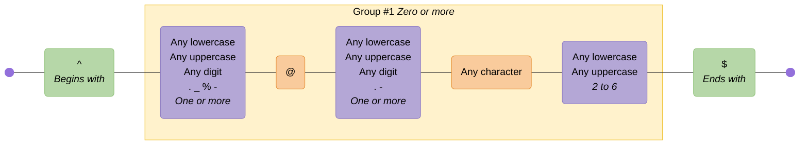

---

## Email (RFC2822)

Email address compliant with RFC2822

Source: <https://regex101.com/library/sI6yF5>

### Pattern {#Email (RFC2822)}

```regex
^([^\x00-\x20\x22\x28\x29\x2c\x2e\x3a-\x3c\x3e\x40\x5b-\x5d\x7f-\xff]+|\x22([^\x0d\x22\x5c\x80-\xff]|\x5c[\x00-\x7f])*\x22)(\x2e([^\x00-\x20\x22\x28\x29\x2c\x2e\x3a-\x3c\x3e\x40\x5b-\x5d\x7f-\xff]+|\x22([^\x0d\x22\x5c\x80-\xff]|\x5c[\x00-\x7f])*\x22))*\x40([^\x00-\x20\x22\x28\x29\x2c\x2e\x3a-\x3c\x3e\x40\x5b-\x5d\x7f-\xff]+|\x5b([^\x0d\x5b-\x5d\x80-\xff]|\x5c[\x00-\x7f])*\x5d)(\x2e([^\x00-\x20\x22\x28\x29\x2c\x2e\x3a-\x3c\x3e\x40\x5b-\x5d\x7f-\xff]+|\x5b([^\x0d\x5b-\x5d\x80-\xff]|\x5c[\x00-\x7f])*\x5d))*$
```

### Diagram

[View in Mermaid Live Editor](https://mermaid.live/edit#pako:H4sIAAAAAAACA92Z72-jNhjH_xUrvZPaW3MDjDGkVXUtSfdm2qTbXq1pKwIkZUtJRVLtqrv732dsA_6BCUSVTl1fBGPs5_n468fYD_06ijdJOpqMVkX09AB-_TzPAYji-M9st04nYD76nK7SLxNwd3xzNyd_XyxrTK-OxS4Ou_jsErBLzC4pvcCI9YCsFrJal_VHC_YQJfSCl-x2ubz96Rt3UHtORI-IWfOtusM3Xn8jceLl7ckH3vHkmHP9LwbDS671o0aDFspolB4DhoOSHz43rzuakw_v5iO-lqbpNi7KtfRLmqdFtEsT8G-2ewBFubTGu834MS0eoyz5ZH-0P1plt7Lj-_fgN7I0t2V5u4uK3aevYPsQPZFVuRzHWRGD72fls2WWG55E221a7LJNfm8fz0d354vi4jy7uEpXWb6lBOc_Zxfz0clkMqmb0o5Jtv37OY9p10XZ_N4mbYRag0OxX5onPXvFD1FxH68JAuWsFCUTXxJX80pmld_SeSEa81s6k2RW-K3jABom9DegvzH9TQGNCUBDgmvxe56CTQEeN0XaaJGnq3KOxiXXmHJRzHW2I5O3rhhJPNLWvNqgm3OQbs5Q3RzGREO0kcJKQC0IecP0GRw3VLUWBye4g-I04SVra7AIzXJVTVzeJO2jKDxIUThUUfcNRCIaEonuQbq5Q3VDrxWJXq9I9AZEIt4fiT5rQraMHoqigxRFQxXFbyASAz5Ziz66eQfp5g3Vza-YJGW0wOz3zrd6RWMwIBptvo-gxByOtjPkzYgP0hUP3qOtt7BJwyER6R-knD9YOfs1Q9LtFZJVCPWLSWSOyeYwWVp8x-dmliddR0l-jv3jeUHTS3aW5TfloTZPooIcd8ANORsXm-cncOQAYvWvtNjIU35b9mw9YOkP6AmKVYtHJFZTH3S0BrCsIX0ZtU5pC5R2TdQMwkRotxPaGoAtEyq3-_CQgIcGiui2I7oaIpKZPK2Bt4fSFShdXURkIoTthFADcGVCBRjvwYMCHuwUUUVuRih7dPd4xIJHPHDavHZR9FnxlciytBbBHkxPwPR0EbAJEbUjIg0Ay4iBQmzvW5yWuDqtgUL67ZS-vkTVNaovEdvZgxoIpIEuZTU5Lft7OyXWESyFEir3aA-iLyD6_ZZB5bMZpuJTloVsCrNkJXzcAOPxWPxgoX7AoM9bXq6m7xW0vaiJtjFqFulbudNePRh51zSwOaZvAiqbo6XzrWzd9uqNTc7nVV9Qy-V7-qK1kico5_k99aS1kh1X_hhgUBOavgeoI3S1VL6VrNtevX_ICbeBzTXl3Cob0tLlVrZue_XuK-fLqi9Py5V7-qK1kics59E99aS1kh1fTrYNaiJTvq2OEGupcitZt716x5ETWgObZ8ppVTZfS0db2brtNRu2ko2q3gItE-3pjdbKvpSXm91TU1orW3KUZNagKTbls9o73NJz0Va6bovNtqikjAY-35Q1anz6JtOuXrfF5nChJHyaP0fP9nr6o7WyN6Skgj2VpbXK7u2oGSN9vszElHD3smbbP_8_B63J8hUdUTmYabpsTJDO6_Xk6Mqb4kv_dLsrNv-kk6MAhi6ensab9aaYHFn070wyIJByE9fX08DzahPXduhAp8uEnodzS7PLgPzVlsKw7Ctb4g_HSbQlvYvoZQIQQLJ9rniFF4RXQVgbnXmBDf0uPA3ryr3E02aA_gyHIdQscOXZIa9N-uogV8t27YThPtm41cunp_ULtx2WBtlMM8omYz5tTo9NETVFtynCpoiboidYsJpycCqcZKvi2ej7fws4c_jsHgAA)

<details>
  <summary>Click to view as image</summary>
  <p align="center">
    
  </p>
</details>


---

## Emoji Support

Demonstrates support for extended character classes using the unicodeSets mode, enabled using the v flag

Source: <https://v8.dev/features/regexp-v-flag>

### Pattern {#Emoji Support}

```regex
/👍🚀❇️🇺🇸🌎🇨🇦🇬🇧🏴󠁧󠁢󠁥󠁮󠁧󠁿(\p{Emoji}){2}/v
```

### Diagram

[View in Mermaid Live Editor](https://mermaid.live/edit#pako:H4sIAAAAAAACA61RQW_TMBj9K5arSZu0rE0mptWdpnVpwwXtMLiRqTKO2xrcJHI82FRVgtMuwMQVCQVN2sYBceIwceG_8AeIxB_gs5O0HbAblp5i-8t73_uep5glEccEjxRNx-jBYRgjRBl7JLTkBIX4kI_4CUHNIn_3psjfv_zx4eznzXmRn30D3BT567fw_QS4AnwGXBf5-ddfH19dAy4Al4Av1fn7aggrnfYnyVMxW5t6s-bzEFctezxjyrS8z2OuqOYReiH0GCnjwNGJM-FqQkW05264Gy1DM8SVFXQAE2Rmn2mq9N4UZWOagvmhw4RiaNYxtaGI76hIoaGdHLirIf4_U4Z4jRBS6doebEzVIOPaNrHTl_-YewfuO_NhHh4_sU9RDlQdzGRxRFU0cNFjCEglxylquGhH7PZPKNPyFHk7TbEb4iNDW-5nzjyO5vr9aLQUFnIcZxHA7ThsbSH0xxy2CqEuOdenspSu3sTeiHhkiZJmWY8Pa3mgSkkaQdvfb_vrmVbJM04a_a22u7m9zhKZKNJo2dW5Ra8Dq_jtoLvd68759_ytfb_1F7_yVMb2L1N1vLWrIPD8havA9b1N7y7VbppC_KW2bwTLDKz28rvV2w6e_QYp7OLAdQMAAA==)

<details>
  <summary>Click to view as image</summary>
  <p align="center">
    
  </p>
</details>

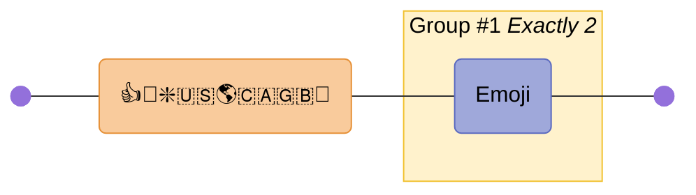

---

## HTML Tags

Naive html tags. Note: do not use regex for parsing HTML!

Source: <https://digitalfortress.tech/tips/top-15-commonly-used-regex/>

### Pattern {#HTML Tags}

```regex
<\/?[\w\s]*>|<.+[\W]>
```

### Diagram

[View in Mermaid Live Editor](https://mermaid.live/edit#pako:H4sIAAAAAAACA42TbW-bMBSF_4pFVWkvJQ2QpIEi1gSSfZk6qZs0aaOKXOOAN2JHtqes6vrfZ3ssxCTpwocE7vVzOPa5PDmIFdiJnJLDdQU-3OUUAIjQZyJrHIHcucMl_hWBOFfX5btv-m-jf8T9m-R33HtrKl_uk9xpyAwLxDX5HlPMocQF2BBZAa6FXMncFeYrSIobr-f1-hrT4Pk5uFVGhL4XEnJ58wREBdfKw9JFhCPwfK17S0KPdAoivv-kSBJGFw-4JHThRVG0Uz2Bw7Q4kaqJVJurF96r3Ilz57WCmpLV9lVbnVv8wJOYJB_XWhHW8SVJ9hlUQb5ANRTCqE7oI9gwXpg6RGqdVjHVSlFiDRFudL9izgDjYMU4brU15xo9y1KgtJPjjgeHN2TMCSy31ixXem8UH7GgqO7-9LHcMglgZ4cvGh8eMt7Mzqwod2YHuK57aB6OzYlZv03Uztfq-Xa4prcb216OFh3YOey5NNN3kseBHVnrwyTUCazr0t9Lw9Ie2od-oktTNWvVF9rm8kk-1n-DaT5wUyG0NBb02zO83BVSeF1HZ_N5Fo5GF0Jy9gOrRy_1A_8CsZrx6KxvrmtLovH7Dw_TaZhu8dko9ILxS3g7co3CdDC5yloD49lVmgb_VVDn3fDhfDLOJlt-mI6mab_DO89_AJQZVxB-BQAA)

<details>
  <summary>Click to view as image</summary>
  <p align="center">
    
  </p>
</details>

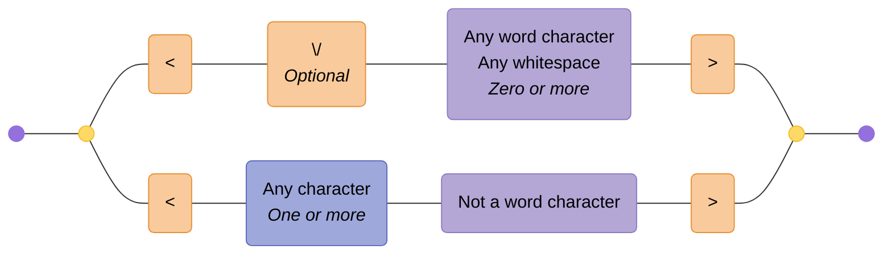

---

## IP Address

Handling both IPv4 and IPv6 addresses

Source: <https://digitalfortress.tech/tips/top-15-commonly-used-regex/>

### Pattern {#IP Address}

```regex
((^\s*((([0-9]|[1-9][0-9]|1[0-9]{2}|2[0-4][0-9]|25[0-5])\.){3}([0-9]|[1-9][0-9]|1[0-9]{2}|2[0-4][0-9]|25[0-5]))\s*$)|(^\s*((([0-9A-Fa-f]{1,4}:){7}([0-9A-Fa-f]{1,4}|:))|(([0-9A-Fa-f]{1,4}:){6}(:[0-9A-Fa-f]{1,4}|((25[0-5]|2[0-4]\d|1\d\d|[1-9]?\d)(\.(25[0-5]|2[0-4]\d|1\d\d|[1-9]?\d)){3})|:))|(([0-9A-Fa-f]{1,4}:){5}(((:[0-9A-Fa-f]{1,4}){1,2})|:((25[0-5]|2[0-4]\d|1\d\d|[1-9]?\d)(\.(25[0-5]|2[0-4]\d|1\d\d|[1-9]?\d)){3})|:))|(([0-9A-Fa-f]{1,4}:){4}(((:[0-9A-Fa-f]{1,4}){1,3})|((:[0-9A-Fa-f]{1,4})?:((25[0-5]|2[0-4]\d|1\d\d|[1-9]?\d)(\.(25[0-5]|2[0-4]\d|1\d\d|[1-9]?\d)){3}))|:))|(([0-9A-Fa-f]{1,4}:){3}(((:[0-9A-Fa-f]{1,4}){1,4})|((:[0-9A-Fa-f]{1,4}){0,2}:((25[0-5]|2[0-4]\d|1\d\d|[1-9]?\d)(\.(25[0-5]|2[0-4]\d|1\d\d|[1-9]?\d)){3}))|:))|(([0-9A-Fa-f]{1,4}:){2}(((:[0-9A-Fa-f]{1,4}){1,5})|((:[0-9A-Fa-f]{1,4}){0,3}:((25[0-5]|2[0-4]\d|1\d\d|[1-9]?\d)(\.(25[0-5]|2[0-4]\d|1\d\d|[1-9]?\d)){3}))|:))|(([0-9A-Fa-f]{1,4}:){1}(((:[0-9A-Fa-f]{1,4}){1,6})|((:[0-9A-Fa-f]{1,4}){0,4}:((25[0-5]|2[0-4]\d|1\d\d|[1-9]?\d)(\.(25[0-5]|2[0-4]\d|1\d\d|[1-9]?\d)){3}))|:))|(:(((:[0-9A-Fa-f]{1,4}){1,7})|((:[0-9A-Fa-f]{1,4}){0,5}:((25[0-5]|2[0-4]\d|1\d\d|[1-9]?\d)(\.(25[0-5]|2[0-4]\d|1\d\d|[1-9]?\d)){3}))|:)))(%.+)?\s*$))
```

### Diagram

[View in Mermaid Live Editor](https://mermaid.live/edit#pako:H4sIAAAAAAACA-1dbXMbR3L-Kyj5VEVeRGfnfZZ22SdT1n1JXaou-RTL56JJSGJCkyqQrjuXpP-exS4I9Dw9g2kMIJ2cSB9EYHa3u6e3X6Z7B_u8fXRxezl_dPro1eL8zevZv_31xc1sdn5x8Z9X99fz09mLR3-dv5r_43R2dPS3F8O_uz8eHR390J30P777QQ3_Tx_V-Oetfv9OD5_salS74a_78Xh53ZfHb837XS88njj-4fgdMH968vz85OWPb9UT-_70-G14z0bfnR4PV-VO9u-PTtnZR0crnis5ltwu36nxz_R5FPrb8fPx0TijnS5ZTv-4LJR7P8yMiXU8_K-Xl_2zxbNF8ZaX5Q59-5Fk3iK0KQptC0K_7QZ1__MF10XBXVlw8wkIroqC-7Lg9iMLflqSMZRldB9VxuOjx1_-y_G3D8Hv-MWjVUx-Nr-7WCxj8p_nN_PF-f38cvb3q_vXs8UyRJ_c3578Ml_8cn51-Sf1pfqyW162vPDx49lfhhB_t_x8d3--uP_T29nd6_M3Q3R_eXJxtbiYvf9qeezl1U3hyOXV3X__enNxf3V789PP81dXNz-p09NTMiq4bn5zKbzq_O5uvhivUUcvHv3t658X33x99c13S75343y__terb148Oh6IrU8dL7x4fb746W5-P1739Oa32d9fX93P796cX8xXRP5rvrid3S5mv9wu5hsqy-tOhusKc9VNc5VdNYp8cT3MYy305dWrq3si2HgUT9bDyYPt1E4zVZrXg4YW59cjdzWdsRpCWpbSWunz-3-cX9xf_zbToExOfymw3krfDWcMXlKbkhdPaTl57bbyDCNPt5XMw7yXh4fZzhecIrcZ02QzZlebibvYTC-zGdWJNeyqRqPUXlbjq1ajtMxslNwVQt1ulN1iOOswpPcIQ5sguKTyhwfN3VxuD4Gby0xj7DQHjZ22yQ_szrHToZkNGXz5Z8jiK_HV7P52ZqsWt_SoU4mHu6aZuZ1n5g81sz4_M8orHIrXGENEavRNapRdtZZG1ace9506n1pomlrYbWpaEKx6QZYb4-P2UKu7Wqhdxg9biLMPMWLN0G5JHktCrkJofaKXnLiagppy4OqW_vubpYrPr4s3dc0jSGflWlYLsclS4m6W4uuWorXEUkLdUozEUqJUp7FiKb3UUopLm5yp2EZTUUo6r3pE1gfLa1ockfsmY-x3MkZdj8j6YIlvtGrR1FXXVtZ2u01eUJhoSWUymmjFE6PEE5UWmqx2FVcsLrO5L9odfLFv9UUnnZhviduqsQ2idrMXQUFiOom9xKq9GCWyFy9Va1-zlyC2lyi3F6Nb7aUXTsx01QBmzKECmFHiANbWqxJetpZH1ydvDzZ5U2d2sCw5ii3TdFuHR3jZWh4ncH0vcH1T76SYIHF93Uk9JFRcXyup62u9g-vHRtfXRjqx2JQq2johwsvWsvUCe5GUg7ar2osVlYNaWg9aVbMXcUGod6gIbWtFqKUloa1HS6sPFcCsEQewtgaW8LK1PLY--YPlSevqzA6Wl6wXa7qtx6V2a3JZwSrROonr11eJ1otcX1rg29oqUYsrfLNDhT9qrMX1jbTCd11TqmhrHKrdOodOCewlCuzF1R_t2V5iL0ZahTpTsRcjrkLNDlXoeDeb7EVahbp6tHTqUAHMOXEAa-tPqt0alM7XJ3-wPOlCndnB8pITP1RSbc03tVv3zQlWic4KXN_XV4nOiVxf2lDwtVWiETcUzA4NhdE2m1xf2lDwuiVV6LaGpd6tYekFDUsnaVj6esPSiRqWVlqF-lrD0oqrULtDFepaG5ZWWoX6erT03aECmA_SAKbbOqJ6t46oj_XJHyxP-vpjGn-wvBTEj2l047a03Vp9QbBK9Ebg-qG-SvRW5PrShkKorRKtuKFgd2goTBGnxfWlDYXQtCNNtzUs9W4NyyBoWHpJwzLUG5Ze1LC00io01BqWVlyFuh2qUN_asHTSKjQUouX6eC-OOW1NTL1bEzPWn634_mD7vepPosPB8mgUP4nWbd05vVt3Lkq2yCqBt8b6wi5oibc6aQ8g1hZ2TtwDcDv0AKak0uKt0h5AbHoSrdt6jHq3HmMU9BiDpHCM9R5jEBWOTlo4xlqP0YkLR7dD4RhaC0cnLRz7bnt075f--3jLxD1rUj4IezOv7Pfd0FAH2eps5VudVz9s-Y9ffx5_tzj9uGX1Zfkrl5vL88XlT272w4tHf17c_vpm9sVgkT8uz8q6Dz8wusc0TPdSshF-jplG1tu82Ak2PYFTcGzEp5cYdkJYjgwyT5rhmrBEE3ZGNuGbSb8r1Ww0lzK0FfKekPdbFG3yiubziWyk5zejS4XkalMqPcPzMzL3GG5g4GfU1GGIOkxRuZubA999hbwm5HUjefJ9NV_yuysy43FbDHzXeIGuCKw6IvHwhdhfSOwv2dOf3oZY46EoD7XFCF3eCDPmA27XV0ToiQQ9vy8P9kpErs2JGtLwhejNF_UWIP50NSbUedU27w15xSHDjEv1cAp3eN2BkUGUVBaOO_jOfVuj3daCpIpUE3GLJmJeExFkzsik4RQeXbQBsZFqhOM9umvHaaL26qYXqC6CIGUolNPVWND0rFyGoi-wIFLWeNDEN9hQMw864Epm4fNmAWFE8SUB010t1CiaA1QmCTy42CEmSrRZy0w00Osk0LtSwNIQ6HUtYGkaFfUYFccCXCccNnvNOcdqgk0ybEa7k49uo0BtW29bez54K99VDvPIxEyIvImXP2wAR8eHAKQxjioMPypDlYWcmq9rGk4GubfoQxX0AWs5zSOnQZXxVaRhaxtwTj61gAMZqhrPqfmvpkl3-FIPr-xmV42Yhj6dCX3aFVgQKWs86KJLq5Kj0AHdKAUdsCXj6fO2A8sPTMKmukSiKzuVWdrp7mPOm6i_dn-o4MMXYma2FI8N1D-mxsTQaDl8eYjHJhuPTaZirtZT1MxMxsxMrQIx1BnMWAGnzRiUkkdbU4txhvq02baQVoU6GEtPw2sSg60AvsY0GLE0xEV-AqvwMjcJM0k1Bxq6nDbbltPKFvQBRYDhTQADvm354tdiaaGBrGXTx6SouZb5RbW1qKE50EiW1AaWhaZWBBu67DCZJbXxBRZEyhqPpLuRaW8Y28iUDsCisB4i6MpzCOiFEEEH1AeUm2iraPSFriOu0GwttmnqZzpmslP_aemC3LRa25LeVduVXSbZTQ_6q8UpSw3abuoJm80Mli-H6xxohrSZeqJOgTr28GWQsSvXPJbnDVtzIEujk926Qi-UubiUtnyFbrGvzNfS1mNchSBocYXOluwmkwMw5VVXNZYunWy_TR-Fvhh24lzmUQDMzfG8y6ZrwL4dFmyGDXCTdZgTq6sbS6PM8KWevSykZlf1drqAsj5DMRRYEClrPJInIZmqyLpGpnQAPaFWR1m6wLWqFCDogP6AchNtFY2-0EXHtr2rJm7qZyZTW9nu09IFuWmVqTl6V4cv_N1XPHs5aHO4ml86atDOrrOXy2YGxxeyrra-cDQ_utzzrNo9dtSxnV9nr3yF6HjecLX86Gh0cltrjUKPAJ9ROF5rOKgbPM8zDisHrNc8lg2sGDM8JzrMiabWX_J04eS7bc--C_1HLBo9r4gdJDifyTNYNVokiwpjdZXNPCDHnFhdPzkaZVwvyF4eBa26CV1AuZBxk1hgQaSs8Uh2NGTqO-cbmdIBXLfUcqqjy1unSwGCDpgPKDfRVjEIFB7g4XMYX0vcjvqZy5SdTn1auiA3rRZC6F31mrqMKmUv5jS1ZoKnBu3dOnv5bGbwPDT6WhL2ND_6zILP1zKsp47twzp75etDz_NGNXR4Gp38tlpDl7YqQVEQeK3hcV8Lj6seHxNbyHgBSwvLwjdfYPAQX7OKQBdOYdteDl3opGqcbGZPFWTmkJEcczPWa4GdgJnJ8TWCx5zoajYcaJQJnSB7BVhGhuoOLrqA8pkmku8LLIiUNR7JNrFMfedDI1N6Cd6iqlR0eetNKUDQAfsB5SbaKhp94RGpxpteS9ye-pnPlJ1ef1q6IDet5jI0sYRNYgnZoB0zXlpbiwWaWEImsYRaYgk0sYRNYsmXbpGH9KptB5pYwtbEUqjncXdGzOw9BbOLvAwI-IDcQb6KmCNYV8tlqLJzahqP1ODj1sRSaHJqyBqRF6sBkmbkq5bApotkWR7BTOMyVLFMrNYTkSaWKEksEW92bYUcaGIJmcQS-gILImWNB00sIZNYQmhkSi-BxBJrq7pAE0swpQBBB-wHlJtoq2j0heew-MC0r94QWjsE_clNndwjSJlVj6EOI97jSwb6j7dRjw7oT2nHChWs_309rKSSxt9Xp5rOpf99tSnoQPf7WqPSAfWJR0ESv0spopAhauVlpAkh6ur-qx67wL6acmjG-RyYPwfmz4H5c2D-PxuYN0TxO_txHtsNgpFV4RW1YJ780u5gvz_cuO_n0P05dH8O3Z9D9__T0L25ovj4uvD0Oonbjx_Pvr98RXA_ZycnJzlipZdRjueTX4UjOud4fPOTJ4BSKHDTpTeYbKitfhLJcKwYxbE1JaWnGaoInmHYq9IbOK5_wZli_SAvy96RuwcvnYJuIC_HXk-IZ3j2gqU9pDHpK-mRV2DvSBHyGkcTTjZ9jXTB4kwJoxMliwxeMyuZmF7PEDiZjXccfbOB53qjTvqaV8aNu5Tag5tPX5PIuGmO1cnOMRyncw-JQvpeM8bNchxPIbdxNI13Gt5RDtFSI4xnlpM09hpE90xlMfDW2YIn2BJKJ9OU4wibiaZj-nKlAj9Xws5k_DzHvczqazvFdfMofQOSkNI4mj1XrrfAMTXTrNABTmZBc74El5lSgyTDsoyKHOgyO8Pt_DJvAilhXqbyaQCrZPL1HKwyK5-QnwFMS7YG6DioZepJFt75uI80FgAvU04OXviVHvXwgq0GOZI3oXAkzJRfALxLIb9xNJ21A0DMggXFEhZmSs0DiCWbGV_W5SOtkF8ArEvGz3Cwy1STEVAu95EmAhBmyqkHGExYj3cIftkgSfIKGQ6RCRyxBFBCjuNoQ1zavC0FgDWFtMbR_SK-dhyzM12bd4DDWfCHvgTHmVJTgKPJ5PEcSDM7QyE_KC10qYbsipCaKT0DUJhM_sChMPMrJylHC5iZjGPkoJlg1xrhMveTyAGmJnAzCKkJxy0CaTZJk7zNhQNuAk-HuJpSntNwOn8P0JslmyoujlVKLwBcJqvrOw6XmZdfyjECribjqDiwJmjUI6TmfhL1gLsJ3ALCbsLxiGCbTdIkb8ThoJzAs0fsTSnPaXiPqGY6APMU0hpH98sXhjeZ0hrWKMD-LHmHLmKApvQ0YHcyiSwH78zfCSlHaACxGG8cR_BMKVhA5SzpwBTROVN6DlA1mUSeo2rmdSDl6AF-k3EMHH8T-gsdIm_uJ1EAeE7gphCdE45ju0M3SZO8T4ZjdwJPgxCdUp7TcDr_CCieJZuyRQTPlF4PyJtsfj1H3szLL-RoO4DoZD3ljmN0gkYtonPuJ5ECCE_g5hDBE457xO1skiZ5Jw_H9wSeAWE8pTyn4b0io9WADCqlNg3vl3ms5rCjqXQGoERLHuKKkKIpPWjPc4kMxwLNa0TK0QEeKOPIH7uARXsA-SzpwBfBPlN6AUA6mUSOg3TmdSDlGAHNk3H0HM4TfCQikOd-EvWA9gncegT7hN52hxCfTdIk74LhUKDAUyHip5TnNJw-lekAFLRkU6EICJrSUwDkyeYXOZBnXn4pRw2In4xjzyE_QaMawT73k8gAIihwwwcieNwiDGiTNMn7dDhcKPB0iAoq5TkN7xUZnQWgUSm1aXi_zOMURzFNpYMHl6WesYpFhNKUngdkUSaR5tCieY1IOQaAF2UcDccXTSlEwAwt6aAvYoem9HrA_GQSWY75mdeBkKPvAByUceQbEWBFaDzigu4nkQLwUOAWEDsUjkdEDG2SJnmPC0cWBZ49AohKeU7D6fw1YIyW9uR0RXzRlJ4BXFA2v8BxQfO7O6QcLQCIMo6RI4jCE70OsUP3k8gBwChwU4gvCsc1ooo2SZO8C4ejjwJPgyCjUp7T8F6R0cM2ES-lNg3vl3l8x0FRU-kCAJ2WPEQVAU9TehGASplEiiOV5u-GlGMPaKWMo-ZwpemumQ4gSEs6KG7_AnoKIESZRIZDiOZ1IOWoAWuUcbQcbBR8BB_82_0kMoBFCtwcQpHCcY8ApE3SJO9g4UClwDMgHqmU5zSczt8CZGnJpkwRrjSl5wBmlM2Pb2Es6EzK0QMeKeMYOCApaDQiFOl-EsH2NuTWI1wp7DfpEKS0SZrkPTYczBR4KsQslfKchveKjCECDKqU2jTckHk2PyIHgNWS9dsi0Gq6264DgFR2J3qOkJqfrZSjApRUtou34zCpKQUN0KclHbgiBGpKzwB0KZNIcejSvA6kHC1gnDKOmoOcgv1rhDfdTyIHGKjAzSAEKhy3CHzaJE3yAhYOkAo8cZubk_KchtP5e4BKLdmUL8KkpvQCwJuy-VkOb5qXX8oRNs6y9WFwHAgVNOoRAnU_iXrASQVuAWFS4XhEcNQmaZKX2HAQVeDZI1aqlOc0vFdk7DuAX5VSm4aFWWUcTfkqgHWF_aIdorrCcYWIrbDD3CIWq3C_-jg6nvvyigKz3v92Pf30aPjyl9vL-ThydfNqlGJ5W5_NX1JCw-XX16dfPH_-rPf-yd394vZ_5sNXdaaNfnJxe327OP2iG_99lZBYS7wi8J1_Fp7GNYHenNnwbBuBByza1fX986fx2dP19e7Mf3fWVa8fvz1IYJ-GZ5spxO_D2ZnZRmF1Tx800J9915-tL__e98pEdvlKs9OPcHOqffgR2Vqvz_XZWU2vK6pP37y5_m1F-2xJcLqT0yQ3Pxp8svkt5Oaj33w0m4_6Cfk1L_msNp97MkyuVISgiuRzIJ-JKIrIoghbTdhqKhk9h9DRhL4mMmhCXxPxFZFfk8-G0DfkfEPoGKo0MkdDZDBENkPkN3Re5FpLxi053xJ5LL2FhJcl8ltKk8hpifyWzotc68i4I-c7Io8jNB3h5Yn8jtIkcjoivyPzcuRaT8Y9Od9TmyU0PeEViPyB0qRyEvk9mZen1xK-gfANhG8gfCO5NhK-gfANhG8gfAOZLzk9kmHqOWt3_urR-_8Ft2YEFQu0AAA=)

<details>
  <summary>Click to view as image</summary>
  <p align="center">
    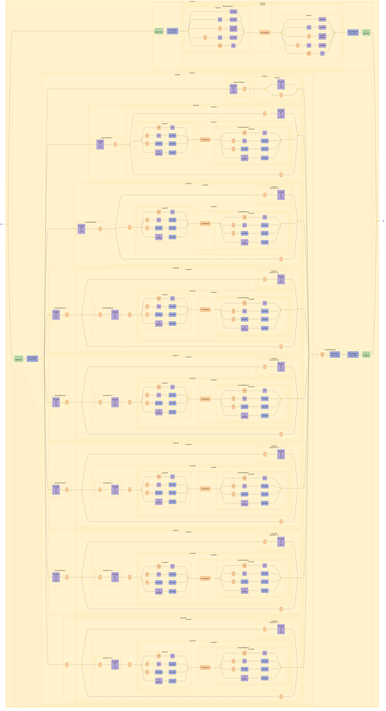
  </p>
</details>

```mermaid
graph LR
  accTitle: "Regex: ((^\\s*((([0-9]|[1-9][0-9]|1[0-9]{2}|2[0-4][0-9]|25[0-5])\\.){3}([0-9]|[1-9][0-9]|1[0-9]{2}|2[0-4][0-9]|25[0-5]))\\s*$)|(^\\s*((([0-9A-Fa-f]{1,4}:){7}([0-9A-Fa-f]{1,4}|:))|(([0-9A-Fa-f]{1,4}:){6}(:[0-9A-Fa-f]{1,4}|((25[0-5]|2[0-4]\\d|1\\d\\d|[1-9]?\\d)(\\.(25[0-5]|2[0-4]\\d|1\\d\\d|[1-9]?\\d)){3})|:))|(([0-9A-Fa-f]{1,4}:){5}(((:[0-9A-Fa-f]{1,4}){1,2})|:((25[0-5]|2[0-4]\\d|1\\d\\d|[1-9]?\\d)(\\.(25[0-5]|2[0-4]\\d|1\\d\\d|[1-9]?\\d)){3})|:))|(([0-9A-Fa-f]{1,4}:){4}(((:[0-9A-Fa-f]{1,4}){1,3})|((:[0-9A-Fa-f]{1,4})?:((25[0-5]|2[0-4]\\d|1\\d\\d|[1-9]?\\d)(\\.(25[0-5]|2[0-4]\\d|1\\d\\d|[1-9]?\\d)){3}))|:))|(([0-9A-Fa-f]{1,4}:){3}(((:[0-9A-Fa-f]{1,4}){1,4})|((:[0-9A-Fa-f]{1,4}){0,2}:((25[0-5]|2[0-4]\\d|1\\d\\d|[1-9]?\\d)(\\.(25[0-5]|2[0-4]\\d|1\\d\\d|[1-9]?\\d)){3}))|:))|(([0-9A-Fa-f]{1,4}:){2}(((:[0-9A-Fa-f]{1,4}){1,5})|((:[0-9A-Fa-f]{1,4}){0,3}:((25[0-5]|2[0-4]\\d|1\\d\\d|[1-9]?\\d)(\\.(25[0-5]|2[0-4]\\d|1\\d\\d|[1-9]?\\d)){3}))|:))|(([0-9A-Fa-f]{1,4}:){1}(((:[0-9A-Fa-f]{1,4}){1,6})|((:[0-9A-Fa-f]{1,4}){0,4}:((25[0-5]|2[0-4]\\d|1\\d\\d|[1-9]?\\d)(\\.(25[0-5]|2[0-4]\\d|1\\d\\d|[1-9]?\\d)){3}))|:))|(:(((:[0-9A-Fa-f]{1,4}){1,7})|((:[0-9A-Fa-f]{1,4}){0,5}:((25[0-5]|2[0-4]\\d|1\\d\\d|[1-9]?\\d)(\\.(25[0-5]|2[0-4]\\d|1\\d\\d|[1-9]?\\d)){3}))|:)))(%.+)?\\s*$))"
  accDescr: "Generated with regex-to-mermaid@1.1.0"

  %% Nodes
  start@{ shape: f-circ };
  fin@{ shape: f-circ };
  disjunction_begin_1:::disjunction@{ shape: f-circ };
  disjunction_end_1:::disjunction@{ shape: f-circ };
  assertion_1("^<br><i>Begins with</i>"):::assertion;
  char_set_1("Any whitespace<br><i>Zero or more</i>"):::char-set;
  disjunction_begin_2:::disjunction@{ shape: f-circ };
  disjunction_end_2:::disjunction@{ shape: f-circ };
  char_class_1("Any digit"):::char-class;
  char_class_2("1-9"):::char-class;
  char_class_3("Any digit"):::char-class;
  literal_1("1"):::literal;
  char_class_4("Any digit<br><i>Exactly 2</i>"):::char-class;
  literal_2("2"):::literal;
  char_class_5("0-4"):::char-class;
  char_class_6("Any digit"):::char-class;
  literal_3("25"):::literal;
  char_class_7("0-5"):::char-class;
  literal_4("Any character"):::literal;
  disjunction_begin_3:::disjunction@{ shape: f-circ };
  disjunction_end_3:::disjunction@{ shape: f-circ };
  char_class_8("Any digit"):::char-class;
  char_class_9("1-9"):::char-class;
  char_class_10("Any digit"):::char-class;
  literal_5("1"):::literal;
  char_class_11("Any digit<br><i>Exactly 2</i>"):::char-class;
  literal_6("2"):::literal;
  char_class_12("0-4"):::char-class;
  char_class_13("Any digit"):::char-class;
  literal_7("25"):::literal;
  char_class_14("0-5"):::char-class;
  char_set_2("Any whitespace<br><i>Zero or more</i>"):::char-set;
  assertion_2("$<br><i>Ends with</i>"):::assertion;
  assertion_3("^<br><i>Begins with</i>"):::assertion;
  char_set_3("Any whitespace<br><i>Zero or more</i>"):::char-set;
  disjunction_begin_4:::disjunction@{ shape: f-circ };
  disjunction_end_4:::disjunction@{ shape: f-circ };
  char_class_15("Any digit<br>A-F<br>a-f<br><i>1 to 4</i>"):::char-class;
  literal_8(":"):::literal;
  disjunction_begin_5:::disjunction@{ shape: f-circ };
  disjunction_end_5:::disjunction@{ shape: f-circ };
  char_class_16("Any digit<br>A-F<br>a-f<br><i>1 to 4</i>"):::char-class;
  literal_9(":"):::literal;
  char_class_17("Any digit<br>A-F<br>a-f<br><i>1 to 4</i>"):::char-class;
  literal_10(":"):::literal;
  disjunction_begin_6:::disjunction@{ shape: f-circ };
  disjunction_end_6:::disjunction@{ shape: f-circ };
  literal_11(":"):::literal;
  char_class_18("Any digit<br>A-F<br>a-f<br><i>1 to 4</i>"):::char-class;
  disjunction_begin_7:::disjunction@{ shape: f-circ };
  disjunction_end_7:::disjunction@{ shape: f-circ };
  literal_12("25"):::literal;
  char_class_19("0-5"):::char-class;
  literal_13("2"):::literal;
  char_class_20("0-4"):::char-class;
  char_set_4("Any digit"):::char-set;
  literal_14("1"):::literal;
  char_set_5("Any digit"):::char-set;
  char_set_6("Any digit"):::char-set;
  char_class_21("1-9<br><i>Optional</i>"):::char-class;
  char_set_7("Any digit"):::char-set;
  literal_15("Any character"):::literal;
  disjunction_begin_8:::disjunction@{ shape: f-circ };
  disjunction_end_8:::disjunction@{ shape: f-circ };
  literal_16("25"):::literal;
  char_class_22("0-5"):::char-class;
  literal_17("2"):::literal;
  char_class_23("0-4"):::char-class;
  char_set_8("Any digit"):::char-set;
  literal_18("1"):::literal;
  char_set_9("Any digit"):::char-set;
  char_set_10("Any digit"):::char-set;
  char_class_24("1-9<br><i>Optional</i>"):::char-class;
  char_set_11("Any digit"):::char-set;
  literal_19(":"):::literal;
  char_class_25("Any digit<br>A-F<br>a-f<br><i>1 to 4</i>"):::char-class;
  literal_20(":"):::literal;
  disjunction_begin_9:::disjunction@{ shape: f-circ };
  disjunction_end_9:::disjunction@{ shape: f-circ };
  literal_21(":"):::literal;
  char_class_26("Any digit<br>A-F<br>a-f<br><i>1 to 4</i>"):::char-class;
  literal_22(":"):::literal;
  disjunction_begin_10:::disjunction@{ shape: f-circ };
  disjunction_end_10:::disjunction@{ shape: f-circ };
  literal_23("25"):::literal;
  char_class_27("0-5"):::char-class;
  literal_24("2"):::literal;
  char_class_28("0-4"):::char-class;
  char_set_12("Any digit"):::char-set;
  literal_25("1"):::literal;
  char_set_13("Any digit"):::char-set;
  char_set_14("Any digit"):::char-set;
  char_class_29("1-9<br><i>Optional</i>"):::char-class;
  char_set_15("Any digit"):::char-set;
  literal_26("Any character"):::literal;
  disjunction_begin_11:::disjunction@{ shape: f-circ };
  disjunction_end_11:::disjunction@{ shape: f-circ };
  literal_27("25"):::literal;
  char_class_30("0-5"):::char-class;
  literal_28("2"):::literal;
  char_class_31("0-4"):::char-class;
  char_set_16("Any digit"):::char-set;
  literal_29("1"):::literal;
  char_set_17("Any digit"):::char-set;
  char_set_18("Any digit"):::char-set;
  char_class_32("1-9<br><i>Optional</i>"):::char-class;
  char_set_19("Any digit"):::char-set;
  literal_30(":"):::literal;
  char_class_33("Any digit<br>A-F<br>a-f<br><i>1 to 4</i>"):::char-class;
  literal_31(":"):::literal;
  disjunction_begin_12:::disjunction@{ shape: f-circ };
  disjunction_end_12:::disjunction@{ shape: f-circ };
  literal_32(":"):::literal;
  char_class_34("Any digit<br>A-F<br>a-f<br><i>1 to 4</i>"):::char-class;
  literal_33(":"):::literal;
  char_class_35("Any digit<br>A-F<br>a-f<br><i>1 to 4</i>"):::char-class;
  literal_34(":"):::literal;
  disjunction_begin_13:::disjunction@{ shape: f-circ };
  disjunction_end_13:::disjunction@{ shape: f-circ };
  literal_35("25"):::literal;
  char_class_36("0-5"):::char-class;
  literal_36("2"):::literal;
  char_class_37("0-4"):::char-class;
  char_set_20("Any digit"):::char-set;
  literal_37("1"):::literal;
  char_set_21("Any digit"):::char-set;
  char_set_22("Any digit"):::char-set;
  char_class_38("1-9<br><i>Optional</i>"):::char-class;
  char_set_23("Any digit"):::char-set;
  literal_38("Any character"):::literal;
  disjunction_begin_14:::disjunction@{ shape: f-circ };
  disjunction_end_14:::disjunction@{ shape: f-circ };
  literal_39("25"):::literal;
  char_class_39("0-5"):::char-class;
  literal_40("2"):::literal;
  char_class_40("0-4"):::char-class;
  char_set_24("Any digit"):::char-set;
  literal_41("1"):::literal;
  char_set_25("Any digit"):::char-set;
  char_set_26("Any digit"):::char-set;
  char_class_41("1-9<br><i>Optional</i>"):::char-class;
  char_set_27("Any digit"):::char-set;
  literal_42(":"):::literal;
  char_class_42("Any digit<br>A-F<br>a-f<br><i>1 to 4</i>"):::char-class;
  literal_43(":"):::literal;
  disjunction_begin_15:::disjunction@{ shape: f-circ };
  disjunction_end_15:::disjunction@{ shape: f-circ };
  literal_44(":"):::literal;
  char_class_43("Any digit<br>A-F<br>a-f<br><i>1 to 4</i>"):::char-class;
  literal_45(":"):::literal;
  char_class_44("Any digit<br>A-F<br>a-f<br><i>1 to 4</i>"):::char-class;
  literal_46(":"):::literal;
  disjunction_begin_16:::disjunction@{ shape: f-circ };
  disjunction_end_16:::disjunction@{ shape: f-circ };
  literal_47("25"):::literal;
  char_class_45("0-5"):::char-class;
  literal_48("2"):::literal;
  char_class_46("0-4"):::char-class;
  char_set_28("Any digit"):::char-set;
  literal_49("1"):::literal;
  char_set_29("Any digit"):::char-set;
  char_set_30("Any digit"):::char-set;
  char_class_47("1-9<br><i>Optional</i>"):::char-class;
  char_set_31("Any digit"):::char-set;
  literal_50("Any character"):::literal;
  disjunction_begin_17:::disjunction@{ shape: f-circ };
  disjunction_end_17:::disjunction@{ shape: f-circ };
  literal_51("25"):::literal;
  char_class_48("0-5"):::char-class;
  literal_52("2"):::literal;
  char_class_49("0-4"):::char-class;
  char_set_32("Any digit"):::char-set;
  literal_53("1"):::literal;
  char_set_33("Any digit"):::char-set;
  char_set_34("Any digit"):::char-set;
  char_class_50("1-9<br><i>Optional</i>"):::char-class;
  char_set_35("Any digit"):::char-set;
  literal_54(":"):::literal;
  char_class_51("Any digit<br>A-F<br>a-f<br><i>1 to 4</i>"):::char-class;
  literal_55(":"):::literal;
  disjunction_begin_18:::disjunction@{ shape: f-circ };
  disjunction_end_18:::disjunction@{ shape: f-circ };
  literal_56(":"):::literal;
  char_class_52("Any digit<br>A-F<br>a-f<br><i>1 to 4</i>"):::char-class;
  literal_57(":"):::literal;
  char_class_53("Any digit<br>A-F<br>a-f<br><i>1 to 4</i>"):::char-class;
  literal_58(":"):::literal;
  disjunction_begin_19:::disjunction@{ shape: f-circ };
  disjunction_end_19:::disjunction@{ shape: f-circ };
  literal_59("25"):::literal;
  char_class_54("0-5"):::char-class;
  literal_60("2"):::literal;
  char_class_55("0-4"):::char-class;
  char_set_36("Any digit"):::char-set;
  literal_61("1"):::literal;
  char_set_37("Any digit"):::char-set;
  char_set_38("Any digit"):::char-set;
  char_class_56("1-9<br><i>Optional</i>"):::char-class;
  char_set_39("Any digit"):::char-set;
  literal_62("Any character"):::literal;
  disjunction_begin_20:::disjunction@{ shape: f-circ };
  disjunction_end_20:::disjunction@{ shape: f-circ };
  literal_63("25"):::literal;
  char_class_57("0-5"):::char-class;
  literal_64("2"):::literal;
  char_class_58("0-4"):::char-class;
  char_set_40("Any digit"):::char-set;
  literal_65("1"):::literal;
  char_set_41("Any digit"):::char-set;
  char_set_42("Any digit"):::char-set;
  char_class_59("1-9<br><i>Optional</i>"):::char-class;
  char_set_43("Any digit"):::char-set;
  literal_66(":"):::literal;
  char_class_60("Any digit<br>A-F<br>a-f<br><i>1 to 4</i>"):::char-class;
  literal_67(":"):::literal;
  disjunction_begin_21:::disjunction@{ shape: f-circ };
  disjunction_end_21:::disjunction@{ shape: f-circ };
  literal_68(":"):::literal;
  char_class_61("Any digit<br>A-F<br>a-f<br><i>1 to 4</i>"):::char-class;
  literal_69(":"):::literal;
  char_class_62("Any digit<br>A-F<br>a-f<br><i>1 to 4</i>"):::char-class;
  literal_70(":"):::literal;
  disjunction_begin_22:::disjunction@{ shape: f-circ };
  disjunction_end_22:::disjunction@{ shape: f-circ };
  literal_71("25"):::literal;
  char_class_63("0-5"):::char-class;
  literal_72("2"):::literal;
  char_class_64("0-4"):::char-class;
  char_set_44("Any digit"):::char-set;
  literal_73("1"):::literal;
  char_set_45("Any digit"):::char-set;
  char_set_46("Any digit"):::char-set;
  char_class_65("1-9<br><i>Optional</i>"):::char-class;
  char_set_47("Any digit"):::char-set;
  literal_74("Any character"):::literal;
  disjunction_begin_23:::disjunction@{ shape: f-circ };
  disjunction_end_23:::disjunction@{ shape: f-circ };
  literal_75("25"):::literal;
  char_class_66("0-5"):::char-class;
  literal_76("2"):::literal;
  char_class_67("0-4"):::char-class;
  char_set_48("Any digit"):::char-set;
  literal_77("1"):::literal;
  char_set_49("Any digit"):::char-set;
  char_set_50("Any digit"):::char-set;
  char_class_68("1-9<br><i>Optional</i>"):::char-class;
  char_set_51("Any digit"):::char-set;
  literal_78(":"):::literal;
  literal_79(":"):::literal;
  disjunction_begin_24:::disjunction@{ shape: f-circ };
  disjunction_end_24:::disjunction@{ shape: f-circ };
  literal_80(":"):::literal;
  char_class_69("Any digit<br>A-F<br>a-f<br><i>1 to 4</i>"):::char-class;
  literal_81(":"):::literal;
  char_class_70("Any digit<br>A-F<br>a-f<br><i>1 to 4</i>"):::char-class;
  literal_82(":"):::literal;
  disjunction_begin_25:::disjunction@{ shape: f-circ };
  disjunction_end_25:::disjunction@{ shape: f-circ };
  literal_83("25"):::literal;
  char_class_71("0-5"):::char-class;
  literal_84("2"):::literal;
  char_class_72("0-4"):::char-class;
  char_set_52("Any digit"):::char-set;
  literal_85("1"):::literal;
  char_set_53("Any digit"):::char-set;
  char_set_54("Any digit"):::char-set;
  char_class_73("1-9<br><i>Optional</i>"):::char-class;
  char_set_55("Any digit"):::char-set;
  literal_86("Any character"):::literal;
  disjunction_begin_26:::disjunction@{ shape: f-circ };
  disjunction_end_26:::disjunction@{ shape: f-circ };
  literal_87("25"):::literal;
  char_class_74("0-5"):::char-class;
  literal_88("2"):::literal;
  char_class_75("0-4"):::char-class;
  char_set_56("Any digit"):::char-set;
  literal_89("1"):::literal;
  char_set_57("Any digit"):::char-set;
  char_set_58("Any digit"):::char-set;
  char_class_76("1-9<br><i>Optional</i>"):::char-class;
  char_set_59("Any digit"):::char-set;
  literal_90(":"):::literal;
  literal_91("%"):::literal;
  char_set_60("Any character<br><i>One or more</i>"):::char-set;
  char_set_61("Any whitespace<br><i>Zero or more</i>"):::char-set;
  assertion_4("$<br><i>Ends with</i>"):::assertion;

  %% Subgraphs
  subgraph standard_5 ["Group #5"]
    disjunction_begin_2
    disjunction_end_2
    char_class_1
    char_class_2
    char_class_3
    literal_1
    char_class_4
    literal_2
    char_class_5
    char_class_6
    literal_3
    char_class_7
  end

  subgraph standard_4 ["Group #4 <i>Exactly 3</i>"]
    standard_5
    literal_4
  end

  subgraph standard_6 ["Group #6"]
    disjunction_begin_3
    disjunction_end_3
    char_class_8
    char_class_9
    char_class_10
    literal_5
    char_class_11
    literal_6
    char_class_12
    char_class_13
    literal_7
    char_class_14
  end

  subgraph standard_3 ["Group #3"]
    standard_5
    standard_4
    standard_6
  end

  subgraph standard_2 ["Group #2"]
    standard_5
    standard_4
    standard_6
    standard_3
    assertion_1
    char_set_1
    char_set_2
    assertion_2
  end

  subgraph standard_10 ["Group #10 <i>Exactly 7</i>"]
    char_class_15
    literal_8
  end

  subgraph standard_11 ["Group #11"]
    disjunction_begin_5
    disjunction_end_5
    char_class_16
    literal_9
  end

  subgraph standard_9 ["Group #9"]
    standard_10
    standard_11
  end

  subgraph standard_13 ["Group #13 <i>Exactly 6</i>"]
    char_class_17
    literal_10
  end

  subgraph standard_16 ["Group #16"]
    disjunction_begin_7
    disjunction_end_7
    literal_12
    char_class_19
    literal_13
    char_class_20
    char_set_4
    literal_14
    char_set_5
    char_set_6
    char_class_21
    char_set_7
  end

  subgraph standard_18 ["Group #18"]
    disjunction_begin_8
    disjunction_end_8
    literal_16
    char_class_22
    literal_17
    char_class_23
    char_set_8
    literal_18
    char_set_9
    char_set_10
    char_class_24
    char_set_11
  end

  subgraph standard_17 ["Group #17 <i>Exactly 3</i>"]
    standard_18
    literal_15
  end

  subgraph standard_15 ["Group #15"]
    standard_16
    standard_18
    standard_17
  end

  subgraph standard_14 ["Group #14"]
    standard_16
    standard_18
    standard_17
    standard_15
    disjunction_begin_6
    disjunction_end_6
    literal_11
    char_class_18
    literal_19
  end

  subgraph standard_12 ["Group #12"]
    standard_13
    standard_16
    standard_18
    standard_17
    standard_15
    standard_14
  end

  subgraph standard_20 ["Group #20 <i>Exactly 5</i>"]
    char_class_25
    literal_20
  end

  subgraph standard_23 ["Group #23 <i>1 to 2</i>"]
    literal_21
    char_class_26
  end

  subgraph standard_22 ["Group #22"]
    standard_23
  end

  subgraph standard_25 ["Group #25"]
    disjunction_begin_10
    disjunction_end_10
    literal_23
    char_class_27
    literal_24
    char_class_28
    char_set_12
    literal_25
    char_set_13
    char_set_14
    char_class_29
    char_set_15
  end

  subgraph standard_27 ["Group #27"]
    disjunction_begin_11
    disjunction_end_11
    literal_27
    char_class_30
    literal_28
    char_class_31
    char_set_16
    literal_29
    char_set_17
    char_set_18
    char_class_32
    char_set_19
  end

  subgraph standard_26 ["Group #26 <i>Exactly 3</i>"]
    standard_27
    literal_26
  end

  subgraph standard_24 ["Group #24"]
    standard_25
    standard_27
    standard_26
  end

  subgraph standard_21 ["Group #21"]
    standard_23
    standard_22
    standard_25
    standard_27
    standard_26
    standard_24
    disjunction_begin_9
    disjunction_end_9
    literal_22
    literal_30
  end

  subgraph standard_19 ["Group #19"]
    standard_20
    standard_23
    standard_22
    standard_25
    standard_27
    standard_26
    standard_24
    standard_21
  end

  subgraph standard_29 ["Group #29 <i>Exactly 4</i>"]
    char_class_33
    literal_31
  end

  subgraph standard_32 ["Group #32 <i>1 to 3</i>"]
    literal_32
    char_class_34
  end

  subgraph standard_31 ["Group #31"]
    standard_32
  end

  subgraph standard_34 ["Group #34 <i>Optional</i>"]
    literal_33
    char_class_35
  end

  subgraph standard_36 ["Group #36"]
    disjunction_begin_13
    disjunction_end_13
    literal_35
    char_class_36
    literal_36
    char_class_37
    char_set_20
    literal_37
    char_set_21
    char_set_22
    char_class_38
    char_set_23
  end

  subgraph standard_38 ["Group #38"]
    disjunction_begin_14
    disjunction_end_14
    literal_39
    char_class_39
    literal_40
    char_class_40
    char_set_24
    literal_41
    char_set_25
    char_set_26
    char_class_41
    char_set_27
  end

  subgraph standard_37 ["Group #37 <i>Exactly 3</i>"]
    standard_38
    literal_38
  end

  subgraph standard_35 ["Group #35"]
    standard_36
    standard_38
    standard_37
  end

  subgraph standard_33 ["Group #33"]
    standard_34
    standard_36
    standard_38
    standard_37
    standard_35
    literal_34
  end

  subgraph standard_30 ["Group #30"]
    standard_32
    standard_31
    standard_34
    standard_36
    standard_38
    standard_37
    standard_35
    standard_33
    disjunction_begin_12
    disjunction_end_12
    literal_42
  end

  subgraph standard_28 ["Group #28"]
    standard_29
    standard_32
    standard_31
    standard_34
    standard_36
    standard_38
    standard_37
    standard_35
    standard_33
    standard_30
  end

  subgraph standard_40 ["Group #40 <i>Exactly 3</i>"]
    char_class_42
    literal_43
  end

  subgraph standard_43 ["Group #43 <i>1 to 4</i>"]
    literal_44
    char_class_43
  end

  subgraph standard_42 ["Group #42"]
    standard_43
  end

  subgraph standard_45 ["Group #45 <i>0 to 2</i>"]
    literal_45
    char_class_44
  end

  subgraph standard_47 ["Group #47"]
    disjunction_begin_16
    disjunction_end_16
    literal_47
    char_class_45
    literal_48
    char_class_46
    char_set_28
    literal_49
    char_set_29
    char_set_30
    char_class_47
    char_set_31
  end

  subgraph standard_49 ["Group #49"]
    disjunction_begin_17
    disjunction_end_17
    literal_51
    char_class_48
    literal_52
    char_class_49
    char_set_32
    literal_53
    char_set_33
    char_set_34
    char_class_50
    char_set_35
  end

  subgraph standard_48 ["Group #48 <i>Exactly 3</i>"]
    standard_49
    literal_50
  end

  subgraph standard_46 ["Group #46"]
    standard_47
    standard_49
    standard_48
  end

  subgraph standard_44 ["Group #44"]
    standard_45
    standard_47
    standard_49
    standard_48
    standard_46
    literal_46
  end

  subgraph standard_41 ["Group #41"]
    standard_43
    standard_42
    standard_45
    standard_47
    standard_49
    standard_48
    standard_46
    standard_44
    disjunction_begin_15
    disjunction_end_15
    literal_54
  end

  subgraph standard_39 ["Group #39"]
    standard_40
    standard_43
    standard_42
    standard_45
    standard_47
    standard_49
    standard_48
    standard_46
    standard_44
    standard_41
  end

  subgraph standard_51 ["Group #51 <i>Exactly 2</i>"]
    char_class_51
    literal_55
  end

  subgraph standard_54 ["Group #54 <i>1 to 5</i>"]
    literal_56
    char_class_52
  end

  subgraph standard_53 ["Group #53"]
    standard_54
  end

  subgraph standard_56 ["Group #56 <i>0 to 3</i>"]
    literal_57
    char_class_53
  end

  subgraph standard_58 ["Group #58"]
    disjunction_begin_19
    disjunction_end_19
    literal_59
    char_class_54
    literal_60
    char_class_55
    char_set_36
    literal_61
    char_set_37
    char_set_38
    char_class_56
    char_set_39
  end

  subgraph standard_60 ["Group #60"]
    disjunction_begin_20
    disjunction_end_20
    literal_63
    char_class_57
    literal_64
    char_class_58
    char_set_40
    literal_65
    char_set_41
    char_set_42
    char_class_59
    char_set_43
  end

  subgraph standard_59 ["Group #59 <i>Exactly 3</i>"]
    standard_60
    literal_62
  end

  subgraph standard_57 ["Group #57"]
    standard_58
    standard_60
    standard_59
  end

  subgraph standard_55 ["Group #55"]
    standard_56
    standard_58
    standard_60
    standard_59
    standard_57
    literal_58
  end

  subgraph standard_52 ["Group #52"]
    standard_54
    standard_53
    standard_56
    standard_58
    standard_60
    standard_59
    standard_57
    standard_55
    disjunction_begin_18
    disjunction_end_18
    literal_66
  end

  subgraph standard_50 ["Group #50"]
    standard_51
    standard_54
    standard_53
    standard_56
    standard_58
    standard_60
    standard_59
    standard_57
    standard_55
    standard_52
  end

  subgraph standard_62 ["Group #62 <i>Exactly 1</i>"]
    char_class_60
    literal_67
  end

  subgraph standard_65 ["Group #65 <i>1 to 6</i>"]
    literal_68
    char_class_61
  end

  subgraph standard_64 ["Group #64"]
    standard_65
  end

  subgraph standard_67 ["Group #67 <i>0 to 4</i>"]
    literal_69
    char_class_62
  end

  subgraph standard_69 ["Group #69"]
    disjunction_begin_22
    disjunction_end_22
    literal_71
    char_class_63
    literal_72
    char_class_64
    char_set_44
    literal_73
    char_set_45
    char_set_46
    char_class_65
    char_set_47
  end

  subgraph standard_71 ["Group #71"]
    disjunction_begin_23
    disjunction_end_23
    literal_75
    char_class_66
    literal_76
    char_class_67
    char_set_48
    literal_77
    char_set_49
    char_set_50
    char_class_68
    char_set_51
  end

  subgraph standard_70 ["Group #70 <i>Exactly 3</i>"]
    standard_71
    literal_74
  end

  subgraph standard_68 ["Group #68"]
    standard_69
    standard_71
    standard_70
  end

  subgraph standard_66 ["Group #66"]
    standard_67
    standard_69
    standard_71
    standard_70
    standard_68
    literal_70
  end

  subgraph standard_63 ["Group #63"]
    standard_65
    standard_64
    standard_67
    standard_69
    standard_71
    standard_70
    standard_68
    standard_66
    disjunction_begin_21
    disjunction_end_21
    literal_78
  end

  subgraph standard_61 ["Group #61"]
    standard_62
    standard_65
    standard_64
    standard_67
    standard_69
    standard_71
    standard_70
    standard_68
    standard_66
    standard_63
  end

  subgraph standard_75 ["Group #75 <i>1 to 7</i>"]
    literal_80
    char_class_69
  end

  subgraph standard_74 ["Group #74"]
    standard_75
  end

  subgraph standard_77 ["Group #77 <i>0 to 5</i>"]
    literal_81
    char_class_70
  end

  subgraph standard_79 ["Group #79"]
    disjunction_begin_25
    disjunction_end_25
    literal_83
    char_class_71
    literal_84
    char_class_72
    char_set_52
    literal_85
    char_set_53
    char_set_54
    char_class_73
    char_set_55
  end

  subgraph standard_81 ["Group #81"]
    disjunction_begin_26
    disjunction_end_26
    literal_87
    char_class_74
    literal_88
    char_class_75
    char_set_56
    literal_89
    char_set_57
    char_set_58
    char_class_76
    char_set_59
  end

  subgraph standard_80 ["Group #80 <i>Exactly 3</i>"]
    standard_81
    literal_86
  end

  subgraph standard_78 ["Group #78"]
    standard_79
    standard_81
    standard_80
  end

  subgraph standard_76 ["Group #76"]
    standard_77
    standard_79
    standard_81
    standard_80
    standard_78
    literal_82
  end

  subgraph standard_73 ["Group #73"]
    standard_75
    standard_74
    standard_77
    standard_79
    standard_81
    standard_80
    standard_78
    standard_76
    disjunction_begin_24
    disjunction_end_24
    literal_90
  end

  subgraph standard_72 ["Group #72"]
    standard_75
    standard_74
    standard_77
    standard_79
    standard_81
    standard_80
    standard_78
    standard_76
    standard_73
    literal_79
  end

  subgraph standard_8 ["Group #8"]
    standard_10
    standard_11
    standard_9
    standard_13
    standard_16
    standard_18
    standard_17
    standard_15
    standard_14
    standard_12
    standard_20
    standard_23
    standard_22
    standard_25
    standard_27
    standard_26
    standard_24
    standard_21
    standard_19
    standard_29
    standard_32
    standard_31
    standard_34
    standard_36
    standard_38
    standard_37
    standard_35
    standard_33
    standard_30
    standard_28
    standard_40
    standard_43
    standard_42
    standard_45
    standard_47
    standard_49
    standard_48
    standard_46
    standard_44
    standard_41
    standard_39
    standard_51
    standard_54
    standard_53
    standard_56
    standard_58
    standard_60
    standard_59
    standard_57
    standard_55
    standard_52
    standard_50
    standard_62
    standard_65
    standard_64
    standard_67
    standard_69
    standard_71
    standard_70
    standard_68
    standard_66
    standard_63
    standard_61
    standard_75
    standard_74
    standard_77
    standard_79
    standard_81
    standard_80
    standard_78
    standard_76
    standard_73
    standard_72
    disjunction_begin_4
    disjunction_end_4
  end

  subgraph standard_82 ["Group #82 <i>Optional</i>"]
    literal_91
    char_set_60
  end

  subgraph standard_7 ["Group #7"]
    standard_10
    standard_11
    standard_9
    standard_13
    standard_16
    standard_18
    standard_17
    standard_15
    standard_14
    standard_12
    standard_20
    standard_23
    standard_22
    standard_25
    standard_27
    standard_26
    standard_24
    standard_21
    standard_19
    standard_29
    standard_32
    standard_31
    standard_34
    standard_36
    standard_38
    standard_37
    standard_35
    standard_33
    standard_30
    standard_28
    standard_40
    standard_43
    standard_42
    standard_45
    standard_47
    standard_49
    standard_48
    standard_46
    standard_44
    standard_41
    standard_39
    standard_51
    standard_54
    standard_53
    standard_56
    standard_58
    standard_60
    standard_59
    standard_57
    standard_55
    standard_52
    standard_50
    standard_62
    standard_65
    standard_64
    standard_67
    standard_69
    standard_71
    standard_70
    standard_68
    standard_66
    standard_63
    standard_61
    standard_75
    standard_74
    standard_77
    standard_79
    standard_81
    standard_80
    standard_78
    standard_76
    standard_73
    standard_72
    standard_8
    standard_82
    assertion_3
    char_set_3
    char_set_61
    assertion_4
  end

  subgraph standard_1 ["Group #1"]
    standard_5
    standard_4
    standard_6
    standard_3
    standard_2
    standard_10
    standard_11
    standard_9
    standard_13
    standard_16
    standard_18
    standard_17
    standard_15
    standard_14
    standard_12
    standard_20
    standard_23
    standard_22
    standard_25
    standard_27
    standard_26
    standard_24
    standard_21
    standard_19
    standard_29
    standard_32
    standard_31
    standard_34
    standard_36
    standard_38
    standard_37
    standard_35
    standard_33
    standard_30
    standard_28
    standard_40
    standard_43
    standard_42
    standard_45
    standard_47
    standard_49
    standard_48
    standard_46
    standard_44
    standard_41
    standard_39
    standard_51
    standard_54
    standard_53
    standard_56
    standard_58
    standard_60
    standard_59
    standard_57
    standard_55
    standard_52
    standard_50
    standard_62
    standard_65
    standard_64
    standard_67
    standard_69
    standard_71
    standard_70
    standard_68
    standard_66
    standard_63
    standard_61
    standard_75
    standard_74
    standard_77
    standard_79
    standard_81
    standard_80
    standard_78
    standard_76
    standard_73
    standard_72
    standard_8
    standard_82
    standard_7
    disjunction_begin_1
    disjunction_end_1
  end

  %% Edges
  start --- disjunction_begin_1;
  disjunction_begin_1 --- assertion_1;
  assertion_1 --- char_set_1;
  char_set_1 --- disjunction_begin_2;
  disjunction_begin_2 --- char_class_1;
  char_class_1 --- disjunction_end_2;
  disjunction_begin_2 --- char_class_2;
  char_class_2 --- char_class_3;
  char_class_3 --- disjunction_end_2;
  disjunction_begin_2 --- literal_1;
  literal_1 --- char_class_4;
  char_class_4 --- disjunction_end_2;
  disjunction_begin_2 --- literal_2;
  literal_2 --- char_class_5;
  char_class_5 --- char_class_6;
  char_class_6 --- disjunction_end_2;
  disjunction_begin_2 --- literal_3;
  literal_3 --- char_class_7;
  char_class_7 --- disjunction_end_2;
  disjunction_end_2 --- literal_4;
  literal_4 --- disjunction_begin_3;
  disjunction_begin_3 --- char_class_8;
  char_class_8 --- disjunction_end_3;
  disjunction_begin_3 --- char_class_9;
  char_class_9 --- char_class_10;
  char_class_10 --- disjunction_end_3;
  disjunction_begin_3 --- literal_5;
  literal_5 --- char_class_11;
  char_class_11 --- disjunction_end_3;
  disjunction_begin_3 --- literal_6;
  literal_6 --- char_class_12;
  char_class_12 --- char_class_13;
  char_class_13 --- disjunction_end_3;
  disjunction_begin_3 --- literal_7;
  literal_7 --- char_class_14;
  char_class_14 --- disjunction_end_3;
  disjunction_end_3 --- char_set_2;
  char_set_2 --- assertion_2;
  assertion_2 --- disjunction_end_1;
  disjunction_begin_1 --- assertion_3;
  assertion_3 --- char_set_3;
  char_set_3 --- disjunction_begin_4;
  disjunction_begin_4 --- char_class_15;
  char_class_15 --- literal_8;
  literal_8 --- disjunction_begin_5;
  disjunction_begin_5 --- char_class_16;
  char_class_16 --- disjunction_end_5;
  disjunction_begin_5 --- literal_9;
  literal_9 --- disjunction_end_5;
  disjunction_end_5 --- disjunction_end_4;
  disjunction_begin_4 --- char_class_17;
  char_class_17 --- literal_10;
  literal_10 --- disjunction_begin_6;
  disjunction_begin_6 --- literal_11;
  literal_11 --- char_class_18;
  char_class_18 --- disjunction_end_6;
  disjunction_begin_6 --- disjunction_begin_7;
  disjunction_begin_7 --- literal_12;
  literal_12 --- char_class_19;
  char_class_19 --- disjunction_end_7;
  disjunction_begin_7 --- literal_13;
  literal_13 --- char_class_20;
  char_class_20 --- char_set_4;
  char_set_4 --- disjunction_end_7;
  disjunction_begin_7 --- literal_14;
  literal_14 --- char_set_5;
  char_set_5 --- char_set_6;
  char_set_6 --- disjunction_end_7;
  disjunction_begin_7 --- char_class_21;
  char_class_21 --- char_set_7;
  char_set_7 --- disjunction_end_7;
  disjunction_end_7 --- literal_15;
  literal_15 --- disjunction_begin_8;
  disjunction_begin_8 --- literal_16;
  literal_16 --- char_class_22;
  char_class_22 --- disjunction_end_8;
  disjunction_begin_8 --- literal_17;
  literal_17 --- char_class_23;
  char_class_23 --- char_set_8;
  char_set_8 --- disjunction_end_8;
  disjunction_begin_8 --- literal_18;
  literal_18 --- char_set_9;
  char_set_9 --- char_set_10;
  char_set_10 --- disjunction_end_8;
  disjunction_begin_8 --- char_class_24;
  char_class_24 --- char_set_11;
  char_set_11 --- disjunction_end_8;
  disjunction_end_8 --- disjunction_end_6;
  disjunction_begin_6 --- literal_19;
  literal_19 --- disjunction_end_6;
  disjunction_end_6 --- disjunction_end_4;
  disjunction_begin_4 --- char_class_25;
  char_class_25 --- literal_20;
  literal_20 --- disjunction_begin_9;
  disjunction_begin_9 --- literal_21;
  literal_21 --- char_class_26;
  char_class_26 --- disjunction_end_9;
  disjunction_begin_9 --- literal_22;
  literal_22 --- disjunction_begin_10;
  disjunction_begin_10 --- literal_23;
  literal_23 --- char_class_27;
  char_class_27 --- disjunction_end_10;
  disjunction_begin_10 --- literal_24;
  literal_24 --- char_class_28;
  char_class_28 --- char_set_12;
  char_set_12 --- disjunction_end_10;
  disjunction_begin_10 --- literal_25;
  literal_25 --- char_set_13;
  char_set_13 --- char_set_14;
  char_set_14 --- disjunction_end_10;
  disjunction_begin_10 --- char_class_29;
  char_class_29 --- char_set_15;
  char_set_15 --- disjunction_end_10;
  disjunction_end_10 --- literal_26;
  literal_26 --- disjunction_begin_11;
  disjunction_begin_11 --- literal_27;
  literal_27 --- char_class_30;
  char_class_30 --- disjunction_end_11;
  disjunction_begin_11 --- literal_28;
  literal_28 --- char_class_31;
  char_class_31 --- char_set_16;
  char_set_16 --- disjunction_end_11;
  disjunction_begin_11 --- literal_29;
  literal_29 --- char_set_17;
  char_set_17 --- char_set_18;
  char_set_18 --- disjunction_end_11;
  disjunction_begin_11 --- char_class_32;
  char_class_32 --- char_set_19;
  char_set_19 --- disjunction_end_11;
  disjunction_end_11 --- disjunction_end_9;
  disjunction_begin_9 --- literal_30;
  literal_30 --- disjunction_end_9;
  disjunction_end_9 --- disjunction_end_4;
  disjunction_begin_4 --- char_class_33;
  char_class_33 --- literal_31;
  literal_31 --- disjunction_begin_12;
  disjunction_begin_12 --- literal_32;
  literal_32 --- char_class_34;
  char_class_34 --- disjunction_end_12;
  disjunction_begin_12 --- literal_33;
  literal_33 --- char_class_35;
  char_class_35 --- literal_34;
  literal_34 --- disjunction_begin_13;
  disjunction_begin_13 --- literal_35;
  literal_35 --- char_class_36;
  char_class_36 --- disjunction_end_13;
  disjunction_begin_13 --- literal_36;
  literal_36 --- char_class_37;
  char_class_37 --- char_set_20;
  char_set_20 --- disjunction_end_13;
  disjunction_begin_13 --- literal_37;
  literal_37 --- char_set_21;
  char_set_21 --- char_set_22;
  char_set_22 --- disjunction_end_13;
  disjunction_begin_13 --- char_class_38;
  char_class_38 --- char_set_23;
  char_set_23 --- disjunction_end_13;
  disjunction_end_13 --- literal_38;
  literal_38 --- disjunction_begin_14;
  disjunction_begin_14 --- literal_39;
  literal_39 --- char_class_39;
  char_class_39 --- disjunction_end_14;
  disjunction_begin_14 --- literal_40;
  literal_40 --- char_class_40;
  char_class_40 --- char_set_24;
  char_set_24 --- disjunction_end_14;
  disjunction_begin_14 --- literal_41;
  literal_41 --- char_set_25;
  char_set_25 --- char_set_26;
  char_set_26 --- disjunction_end_14;
  disjunction_begin_14 --- char_class_41;
  char_class_41 --- char_set_27;
  char_set_27 --- disjunction_end_14;
  disjunction_end_14 --- disjunction_end_12;
  disjunction_begin_12 --- literal_42;
  literal_42 --- disjunction_end_12;
  disjunction_end_12 --- disjunction_end_4;
  disjunction_begin_4 --- char_class_42;
  char_class_42 --- literal_43;
  literal_43 --- disjunction_begin_15;
  disjunction_begin_15 --- literal_44;
  literal_44 --- char_class_43;
  char_class_43 --- disjunction_end_15;
  disjunction_begin_15 --- literal_45;
  literal_45 --- char_class_44;
  char_class_44 --- literal_46;
  literal_46 --- disjunction_begin_16;
  disjunction_begin_16 --- literal_47;
  literal_47 --- char_class_45;
  char_class_45 --- disjunction_end_16;
  disjunction_begin_16 --- literal_48;
  literal_48 --- char_class_46;
  char_class_46 --- char_set_28;
  char_set_28 --- disjunction_end_16;
  disjunction_begin_16 --- literal_49;
  literal_49 --- char_set_29;
  char_set_29 --- char_set_30;
  char_set_30 --- disjunction_end_16;
  disjunction_begin_16 --- char_class_47;
  char_class_47 --- char_set_31;
  char_set_31 --- disjunction_end_16;
  disjunction_end_16 --- literal_50;
  literal_50 --- disjunction_begin_17;
  disjunction_begin_17 --- literal_51;
  literal_51 --- char_class_48;
  char_class_48 --- disjunction_end_17;
  disjunction_begin_17 --- literal_52;
  literal_52 --- char_class_49;
  char_class_49 --- char_set_32;
  char_set_32 --- disjunction_end_17;
  disjunction_begin_17 --- literal_53;
  literal_53 --- char_set_33;
  char_set_33 --- char_set_34;
  char_set_34 --- disjunction_end_17;
  disjunction_begin_17 --- char_class_50;
  char_class_50 --- char_set_35;
  char_set_35 --- disjunction_end_17;
  disjunction_end_17 --- disjunction_end_15;
  disjunction_begin_15 --- literal_54;
  literal_54 --- disjunction_end_15;
  disjunction_end_15 --- disjunction_end_4;
  disjunction_begin_4 --- char_class_51;
  char_class_51 --- literal_55;
  literal_55 --- disjunction_begin_18;
  disjunction_begin_18 --- literal_56;
  literal_56 --- char_class_52;
  char_class_52 --- disjunction_end_18;
  disjunction_begin_18 --- literal_57;
  literal_57 --- char_class_53;
  char_class_53 --- literal_58;
  literal_58 --- disjunction_begin_19;
  disjunction_begin_19 --- literal_59;
  literal_59 --- char_class_54;
  char_class_54 --- disjunction_end_19;
  disjunction_begin_19 --- literal_60;
  literal_60 --- char_class_55;
  char_class_55 --- char_set_36;
  char_set_36 --- disjunction_end_19;
  disjunction_begin_19 --- literal_61;
  literal_61 --- char_set_37;
  char_set_37 --- char_set_38;
  char_set_38 --- disjunction_end_19;
  disjunction_begin_19 --- char_class_56;
  char_class_56 --- char_set_39;
  char_set_39 --- disjunction_end_19;
  disjunction_end_19 --- literal_62;
  literal_62 --- disjunction_begin_20;
  disjunction_begin_20 --- literal_63;
  literal_63 --- char_class_57;
  char_class_57 --- disjunction_end_20;
  disjunction_begin_20 --- literal_64;
  literal_64 --- char_class_58;
  char_class_58 --- char_set_40;
  char_set_40 --- disjunction_end_20;
  disjunction_begin_20 --- literal_65;
  literal_65 --- char_set_41;
  char_set_41 --- char_set_42;
  char_set_42 --- disjunction_end_20;
  disjunction_begin_20 --- char_class_59;
  char_class_59 --- char_set_43;
  char_set_43 --- disjunction_end_20;
  disjunction_end_20 --- disjunction_end_18;
  disjunction_begin_18 --- literal_66;
  literal_66 --- disjunction_end_18;
  disjunction_end_18 --- disjunction_end_4;
  disjunction_begin_4 --- char_class_60;
  char_class_60 --- literal_67;
  literal_67 --- disjunction_begin_21;
  disjunction_begin_21 --- literal_68;
  literal_68 --- char_class_61;
  char_class_61 --- disjunction_end_21;
  disjunction_begin_21 --- literal_69;
  literal_69 --- char_class_62;
  char_class_62 --- literal_70;
  literal_70 --- disjunction_begin_22;
  disjunction_begin_22 --- literal_71;
  literal_71 --- char_class_63;
  char_class_63 --- disjunction_end_22;
  disjunction_begin_22 --- literal_72;
  literal_72 --- char_class_64;
  char_class_64 --- char_set_44;
  char_set_44 --- disjunction_end_22;
  disjunction_begin_22 --- literal_73;
  literal_73 --- char_set_45;
  char_set_45 --- char_set_46;
  char_set_46 --- disjunction_end_22;
  disjunction_begin_22 --- char_class_65;
  char_class_65 --- char_set_47;
  char_set_47 --- disjunction_end_22;
  disjunction_end_22 --- literal_74;
  literal_74 --- disjunction_begin_23;
  disjunction_begin_23 --- literal_75;
  literal_75 --- char_class_66;
  char_class_66 --- disjunction_end_23;
  disjunction_begin_23 --- literal_76;
  literal_76 --- char_class_67;
  char_class_67 --- char_set_48;
  char_set_48 --- disjunction_end_23;
  disjunction_begin_23 --- literal_77;
  literal_77 --- char_set_49;
  char_set_49 --- char_set_50;
  char_set_50 --- disjunction_end_23;
  disjunction_begin_23 --- char_class_68;
  char_class_68 --- char_set_51;
  char_set_51 --- disjunction_end_23;
  disjunction_end_23 --- disjunction_end_21;
  disjunction_begin_21 --- literal_78;
  literal_78 --- disjunction_end_21;
  disjunction_end_21 --- disjunction_end_4;
  disjunction_begin_4 --- literal_79;
  literal_79 --- disjunction_begin_24;
  disjunction_begin_24 --- literal_80;
  literal_80 --- char_class_69;
  char_class_69 --- disjunction_end_24;
  disjunction_begin_24 --- literal_81;
  literal_81 --- char_class_70;
  char_class_70 --- literal_82;
  literal_82 --- disjunction_begin_25;
  disjunction_begin_25 --- literal_83;
  literal_83 --- char_class_71;
  char_class_71 --- disjunction_end_25;
  disjunction_begin_25 --- literal_84;
  literal_84 --- char_class_72;
  char_class_72 --- char_set_52;
  char_set_52 --- disjunction_end_25;
  disjunction_begin_25 --- literal_85;
  literal_85 --- char_set_53;
  char_set_53 --- char_set_54;
  char_set_54 --- disjunction_end_25;
  disjunction_begin_25 --- char_class_73;
  char_class_73 --- char_set_55;
  char_set_55 --- disjunction_end_25;
  disjunction_end_25 --- literal_86;
  literal_86 --- disjunction_begin_26;
  disjunction_begin_26 --- literal_87;
  literal_87 --- char_class_74;
  char_class_74 --- disjunction_end_26;
  disjunction_begin_26 --- literal_88;
  literal_88 --- char_class_75;
  char_class_75 --- char_set_56;
  char_set_56 --- disjunction_end_26;
  disjunction_begin_26 --- literal_89;
  literal_89 --- char_set_57;
  char_set_57 --- char_set_58;
  char_set_58 --- disjunction_end_26;
  disjunction_begin_26 --- char_class_76;
  char_class_76 --- char_set_59;
  char_set_59 --- disjunction_end_26;
  disjunction_end_26 --- disjunction_end_24;
  disjunction_begin_24 --- literal_90;
  literal_90 --- disjunction_end_24;
  disjunction_end_24 --- disjunction_end_4;
  disjunction_end_4 --- literal_91;
  literal_91 --- char_set_60;
  char_set_60 --- char_set_61;
  char_set_61 --- assertion_4;
  assertion_4 --- disjunction_end_1;
  disjunction_end_1 --- fin;

  %% Styles
  %% Node Styling
  classDef disjunction fill:#FFD966,stroke:#F1C232,color:#000000;
  classDef assertion fill:#B6D7A8,stroke:#93C47D,color:#000000;
  classDef char-set fill:#9FA8DA,stroke:#5C6BC0,color:#000000;
  classDef char-class fill:#B4A7D6,stroke:#8E7CC3,color:#000000;
  classDef literal fill:#F9CB9C,stroke:#E69138,color:#000000;

  %% Group Styling
  classDef standard fill:#FFF2CC,stroke:#F1C232,color:#000000;

  %% Apply Group Classes
  class standard_5,standard_4,standard_6,standard_3,standard_2,standard_10,standard_11,standard_9,standard_13,standard_16,standard_18,standard_17,standard_15,standard_14,standard_12,standard_20,standard_23,standard_22,standard_25,standard_27,standard_26,standard_24,standard_21,standard_19,standard_29,standard_32,standard_31,standard_34,standard_36,standard_38,standard_37,standard_35,standard_33,standard_30,standard_28,standard_40,standard_43,standard_42,standard_45,standard_47,standard_49,standard_48,standard_46,standard_44,standard_41,standard_39,standard_51,standard_54,standard_53,standard_56,standard_58,standard_60,standard_59,standard_57,standard_55,standard_52,standard_50,standard_62,standard_65,standard_64,standard_67,standard_69,standard_71,standard_70,standard_68,standard_66,standard_63,standard_61,standard_75,standard_74,standard_77,standard_79,standard_81,standard_80,standard_78,standard_76,standard_73,standard_72,standard_8,standard_82,standard_7,standard_1 standard;
```

---

## Complex Password Requirements

Uses positive lookaheads to ensure passwords have 1 lowercase letter, 1 uppercase letter, 1 number, 1 special character and be at least 8 characters long. Note: Do not rely on regex for validating passwords!

Source: <https://digitalfortress.tech/tips/top-15-commonly-used-regex/>

### Pattern {#Complex Password Requirements}

```regex
(?=(.*[0-9]))(?=.*[\!@#$%^&*()\\[\]{}\-_+=~`|:;"'<>,./?])(?=.*[a-z])(?=(.*[A-Z]))(?=(.*)).{8,}
```

### Diagram

[View in Mermaid Live Editor](https://mermaid.live/edit#pako:H4sIAAAAAAACA61VYVeiQBT9K28xSwtMAU3RTMPcL509e9r9VJgRTMqJgB1w29bst-8MDIJgxjnbfJmZN3PvuzO8uSw5wzURp3AzrHtzuLzSHADdMH5agY0U0LgrNEN_FKicnVZqhzd1oTOpVsmEjDXSvgxKe-Xb_cNKVWMtDE-WK9oJ06PTt7tXpUvG3EGvz9eOzyYMrQt_wyFlHQrXESuZVKu1ZZtfaRwTMkK-gamQr8hBWA-QCc9WMAdMdQmBKzwh_KRb5qBRa9TqFEaB5TJ8I-fy6dgPdBwMluDPdY8c6UEwLGzAqkvXHiznnRVjruOpj4Jpo6JxQ-clDOhGgHDvHvd7Vv8aYRdcDE8uRr1jq69xVUVR6C6BwBIOw9Z9f81iWjMrSG0NVzcTip-SkLKQ7wMDKMEelOEW9uEQKlAF-mXghnQTWMKK9AJM4QhO4Q3u4BUU6ELp18INunAAPegDDzU4hrPdoqVPER2z2O4zwobuo91J5U9JGrMsPK9I0uZ_JqUcrXc42jsJWGH_WNyHjzUqbjahVe6YOjanDbghjwW7Cw9KDY2b0F3pck7NWWnSCHLMKMGa0HN9K7B-o6ntuo_6HOmM-juLw2UcXydJNBSmFD-gTF5FTrdYOIlUNImUSyJtT7I-qZi6bTFPKOcI5cKq5aK3LX6gUUpplPIam4UVNYsq2rw1UrMX5ixlxiAIQqoiM36brLL6zHnpJl7M2GcWL-ascRMvZZwsi5dyLrWJlzOmlMXLOcPZxDcz_rK52so4R7hKflspPwhe7Ohy2V8vjFjOLATSjCP0ALGPEKxtK6XOeNgeDXk_wO4jUkpNtXWu1nnDtV2slOph6-bx4YwxnMvDk1FrzdC-OFFVKcfAZEXVt01XXDOMdTwei6q6Zh03VFESd-mKy1RYlyljGnVG4kWnoL6h59kvTKVKqaMLjc6b2BqfvDk-9bziYaJsq3vy2_xvW1DaFpT5rS8yf_4ut_oHlBPL-tYJAAA=)

<details>
  <summary>Click to view as image</summary>
  <p align="center">
    
  </p>
</details>

```mermaid
graph LR
  accTitle: "Regex: (?=(.*[0-9]))(?=.*[\\!@#$%^&*()\\\\[\\]{}\\-_+=~`|:;\"'<>,./?])(?=.*[a-z])(?=(.*[A-Z]))(?=(.*)).{8,}"
  accDescr: "Generated with regex-to-mermaid@1.1.0"

  %% Nodes
  start@{ shape: f-circ };
  fin@{ shape: f-circ };
  char_set_1("Any character<br><i>Zero or more</i>"):::char-set;
  char_class_1("Any digit"):::char-class;
  char_set_2("Any character<br><i>Zero or more</i>"):::char-set;
  char_class_2("\! @ # $ % ^ & * ( ) \\ [ \] { } \- _ + = ~ ` | : ; #quot; ' < > , . / ?"):::char-class;
  char_set_3("Any character<br><i>Zero or more</i>"):::char-set;
  char_class_3("Any lowercase"):::char-class;
  char_set_4("Any character<br><i>Zero or more</i>"):::char-set;
  char_class_4("Any uppercase"):::char-class;
  char_set_5("Any character<br><i>Zero or more</i>"):::char-set;
  char_set_6("Any character<br><i>8 or more</i>"):::char-set;

  %% Subgraphs
  subgraph standard_1 ["Group #1"]
    char_set_1
    char_class_1
  end

  subgraph positive_lookahead_1 ["Positive Lookahead"]
    standard_1
  end

  subgraph positive_lookahead_2 ["Positive Lookahead"]
    char_set_2
    char_class_2
  end

  subgraph positive_lookahead_3 ["Positive Lookahead"]
    char_set_3
    char_class_3
  end

  subgraph standard_2 ["Group #2"]
    char_set_4
    char_class_4
  end

  subgraph positive_lookahead_4 ["Positive Lookahead"]
    standard_2
  end

  subgraph standard_3 ["Group #3"]
    char_set_5
  end

  subgraph positive_lookahead_5 ["Positive Lookahead"]
    standard_3
  end

  %% Edges
  start --- char_set_1;
  char_set_1 --- char_class_1;
  char_class_1 --- char_set_2;
  char_set_2 --- char_class_2;
  char_class_2 --- char_set_3;
  char_set_3 --- char_class_3;
  char_class_3 --- char_set_4;
  char_set_4 --- char_class_4;
  char_class_4 --- char_set_5;
  char_set_5 --- char_set_6;
  char_set_6 --- fin;

  %% Styles
  %% Node Styling
  classDef char-set fill:#9FA8DA,stroke:#5C6BC0,color:#000000;
  classDef char-class fill:#B4A7D6,stroke:#8E7CC3,color:#000000;

  %% Group Styling
  classDef standard fill:#FFF2CC,stroke:#F1C232,color:#000000;
  classDef positive-lookahead fill:#D9D2E9,stroke:#8E7CC3,color:#000000;

  %% Apply Group Classes
  class standard_1,standard_2,standard_3 standard;
  class positive_lookahead_1,positive_lookahead_2,positive_lookahead_3,positive_lookahead_4,positive_lookahead_5 positive-lookahead;
```

---

## Phone Number

Phone Numbers with optional country code/extension. Note: do not use regex for validating phone numbers!

Source: <https://digitalfortress.tech/tips/top-15-commonly-used-regex/>

### Pattern {#Phone Number}

```regex
^(?:(?:\(?(?:00|\+)([1-4]\d\d|[1-9]\d?)\)?)?[\-\.\ \\\/]?)?((?:\(?\d{1,}\)?[\-\.\ \\\/]?){0,})(?:[\-\.\ \\\/]?(?:#|ext\.?|extension|x)[\-\.\ \\\/]?(\d+))?$
```

### Diagram

[View in Mermaid Live Editor](https://mermaid.live/edit#pako:H4sIAAAAAAACA61YbW-bOhT-KxbZpKCGFjCQQKtmCUn25WqTtvvplq6i4KbcSyECqrVq-9-vbQhg8xKaLlozv5yX5xwfHz_ti-DFPhIsYZu4u3vw1w8nAsD1vL-DLEQWcIQfaIueLPBrPLfwPwd_xnM8kOVXMj4Rx1eKpF2TsU-_XvHczOdzkfwnzsX5FRlI5OuUfAGn9jm7xgLj0jbVfFEmb7nuIc0XefImYuUDclhi9IqeMiowJyMUpUEcvT6JhzQpoBNRnH9yhCI5K5R6CUnOVxShxM2QD34H2T1ISK6kLJYeUPLgBv4X5VQ5lYkaUfz8GXzDuU7JOM3cJPvyAtJ7d4fTfCd5QeKBt3OydxdEHTtumqIkw7BvlLEj_Lq4TS4vgssl2gZRShFcnAWXjiBallWKUsUwyDDOkKrhJBeK33dEwA0rrUKO6vhB-u9j5FF3t8TFjYIlaqsdIOt6KPIHau0RqhihLDfR7PchjeBkCFz1KLjDtLx7N7nxQpxlmlN8BXJEZF2i65VYijIqtIiesbdtkNVE8R4rqA4RzB2r1LHZ7xjW7XWeO-Nin2qNplocVCw1WPkJSfgeneIfAIpLddbvvIK-d6-_o1bLcLW2cCME4gQ8xAk6ELFxXMTaByOumdI_aKp5C-BRtwC-69JOMepR952d4W3SezsFzOLUSDCuh9cGnUDZ1OTcft7Re-TIJXzqPUnjT5wkqUP9qDqs-ju5258KvXXk93X34mn5-XhLn_D8eSkmIMK2PHeXPSZBtL2B4MoRvsWRVC45wjWRb-32zQ3azvPlsl-zU0imWCyHVcLAz13kuwnWJgi-JvHjDoyUHudqu_Niud59ayu00XLzpobKSXRAZjOnNjIHGvVQBMOlPF-sEsDmi5tqQ7AofxgLF2kjYYMSpLWC-gclMVvz12zAOncYGrttNMBoBwpMrRWY2pGHQVk23nNXYHu5QjaaKTudsVOTqwyZmysHIoe1yGGJtepIQ4LWjy0tgyst2Dg4vbFiMIhwC1v72xo7BpIk1Rkvz4DpfpkdttPTvZaW1kVsGVsqS0gbtmgXHGQJstR1oCW62hGB2sV1qXy9LzZoaiVB-yTHT9ldlSOlrcgHY1EbzJX1BjnKOtAbXWXyrbH8lccBG1SV0dZZ-sli1DieyWgaLIvk_WoNwshL6A0e2HH-sIvlMXimLDtrzecwSzOWyDF7JsvhPuBFkTlC9xFbXCtQBtqiq_y5GA2CyFaFzrE-rmepPKuj-_j3-xpty57DvOkVfx6gK-S1IYaJzxW6q0xg5TC0RktjNV3MJmmWxP8ha2RCW5uuJl4cxok1kunnnDFQpKNQ35j20rRL9bVhKnDWp15L1N7EZmUaRmlio9gqVPtMVEx5H4O2mK4qC7P11LbhQQs4zYW-uVnMVotSX7eNpS039IvM5u9iW2oj5rXLTdubtbqBpWljZa7Xyz5o-3evTM5Gte1DySmgLXa78LkAaBODeTnkqeII3ITjatxc4eYaNzcm_HPPRF_FVOOIk4paTWpcYz88F97-B8SAdupDFAAA)

<details>
  <summary>Click to view as image</summary>
  <p align="center">
    
  </p>
</details>

```mermaid
graph LR
  accTitle: "Regex: ^(?:(?:\\(?(?:00|\\+)([1-4]\\d\\d|[1-9]\\d?)\\)?)?[\\-\\.\\ \\\\\\/]?)?((?:\\(?\\d{1,}\\)?[\\-\\.\\ \\\\\\/]?){0,})(?:[\\-\\.\\ \\\\\\/]?(?:#|ext\\.?|extension|x)[\\-\\.\\ \\\\\\/]?(\\d+))?$"
  accDescr: "Generated with regex-to-mermaid@1.1.0"

  %% Nodes
  start@{ shape: f-circ };
  fin@{ shape: f-circ };
  assertion_1("^<br><i>Begins with</i>"):::assertion;
  literal_1("\(<br><i>Optional</i>"):::literal;
  disjunction_begin_1:::disjunction@{ shape: f-circ };
  disjunction_end_1:::disjunction@{ shape: f-circ };
  literal_2("00"):::literal;
  literal_3("\+"):::literal;
  disjunction_begin_2:::disjunction@{ shape: f-circ };
  disjunction_end_2:::disjunction@{ shape: f-circ };
  char_class_1("1-4"):::char-class;
  char_set_1("Any digit"):::char-set;
  char_set_2("Any digit"):::char-set;
  char_class_2("1-9"):::char-class;
  char_set_3("Any digit<br><i>Optional</i>"):::char-set;
  literal_4("\)<br><i>Optional</i>"):::literal;
  char_class_3("\- \. \  \\ \/<br><i>Optional</i>"):::char-class;
  literal_5("\(<br><i>Optional</i>"):::literal;
  char_set_4("Any digit<br><i>One or more</i>"):::char-set;
  literal_6("\)<br><i>Optional</i>"):::literal;
  char_class_4("\- \. \  \\ \/<br><i>Optional</i>"):::char-class;
  char_class_5("\- \. \  \\ \/<br><i>Optional</i>"):::char-class;
  disjunction_begin_3:::disjunction@{ shape: f-circ };
  disjunction_end_3:::disjunction@{ shape: f-circ };
  literal_7("#"):::literal;
  literal_8("ext"):::literal;
  literal_9("Any character<br><i>Optional</i>"):::literal;
  literal_10("extension"):::literal;
  literal_11("x"):::literal;
  char_class_6("\- \. \  \\ \/<br><i>Optional</i>"):::char-class;
  char_set_5("Any digit<br><i>One or more</i>"):::char-set;
  assertion_2("$<br><i>Ends with</i>"):::assertion;

  %% Subgraphs
  subgraph non_capturing_3 ["Non-capturing"]
    disjunction_begin_1
    disjunction_end_1
    literal_2
    literal_3
  end

  subgraph standard_1 ["Group #1"]
    disjunction_begin_2
    disjunction_end_2
    char_class_1
    char_set_1
    char_set_2
    char_class_2
    char_set_3
  end

  subgraph non_capturing_2 ["Non-capturing <i>Optional</i>"]
    non_capturing_3
    standard_1
    literal_1
    literal_4
  end

  subgraph non_capturing_1 ["Non-capturing <i>Optional</i>"]
    non_capturing_3
    standard_1
    non_capturing_2
    char_class_3
  end

  subgraph non_capturing_4 ["Non-capturing <i>Zero or more</i>"]
    literal_5
    char_set_4
    literal_6
    char_class_4
  end

  subgraph standard_2 ["Group #2"]
    non_capturing_4
  end

  subgraph non_capturing_6 ["Non-capturing"]
    disjunction_begin_3
    disjunction_end_3
    literal_7
    literal_8
    literal_9
    literal_10
    literal_11
  end

  subgraph standard_3 ["Group #3"]
    char_set_5
  end

  subgraph non_capturing_5 ["Non-capturing <i>Optional</i>"]
    non_capturing_6
    standard_3
    char_class_5
    char_class_6
  end

  %% Edges
  start --- assertion_1;
  assertion_1 --- literal_1;
  literal_1 --- disjunction_begin_1;
  disjunction_begin_1 --- literal_2;
  literal_2 --- disjunction_end_1;
  disjunction_begin_1 --- literal_3;
  literal_3 --- disjunction_end_1;
  disjunction_end_1 --- disjunction_begin_2;
  disjunction_begin_2 --- char_class_1;
  char_class_1 --- char_set_1;
  char_set_1 --- char_set_2;
  char_set_2 --- disjunction_end_2;
  disjunction_begin_2 --- char_class_2;
  char_class_2 --- char_set_3;
  char_set_3 --- disjunction_end_2;
  disjunction_end_2 --- literal_4;
  literal_4 --- char_class_3;
  char_class_3 --- literal_5;
  literal_5 --- char_set_4;
  char_set_4 --- literal_6;
  literal_6 --- char_class_4;
  char_class_4 --- char_class_5;
  char_class_5 --- disjunction_begin_3;
  disjunction_begin_3 --- literal_7;
  literal_7 --- disjunction_end_3;
  disjunction_begin_3 --- literal_8;
  literal_8 --- literal_9;
  literal_9 --- disjunction_end_3;
  disjunction_begin_3 --- literal_10;
  literal_10 --- disjunction_end_3;
  disjunction_begin_3 --- literal_11;
  literal_11 --- disjunction_end_3;
  disjunction_end_3 --- char_class_6;
  char_class_6 --- char_set_5;
  char_set_5 --- assertion_2;
  assertion_2 --- fin;

  %% Styles
  %% Node Styling
  classDef assertion fill:#B6D7A8,stroke:#93C47D,color:#000000;
  classDef literal fill:#F9CB9C,stroke:#E69138,color:#000000;
  classDef disjunction fill:#FFD966,stroke:#F1C232,color:#000000;
  classDef char-class fill:#B4A7D6,stroke:#8E7CC3,color:#000000;
  classDef char-set fill:#9FA8DA,stroke:#5C6BC0,color:#000000;

  %% Group Styling
  classDef non-capturing fill:#CFE2F3,stroke:#6D9EEB,color:#000000;
  classDef standard fill:#FFF2CC,stroke:#F1C232,color:#000000;

  %% Apply Group Classes
  class non_capturing_3,non_capturing_2,non_capturing_1,non_capturing_4,non_capturing_6,non_capturing_5 non-capturing;
  class standard_1,standard_2,standard_3 standard;
```

---

## Semantic Versioning

Semantic versioning v2.0.0

Source: <https://semver.org>

### Pattern {#Semantic Versioning}

```regex
^(?<major>0|[1-9]\d*)\.(?<minor>0|[1-9]\d*)\.(?<patch>0|[1-9]\d*)(?:-(?<prerelease>(?:0|[1-9]\d*|\d*[a-zA-Z-][0-9a-zA-Z-]*)(?:\.(?:0|[1-9]\d*|\d*[a-zA-Z-][0-9a-zA-Z-]*))*))?(?:\+(?<buildmetadata>[0-9a-zA-Z-]+(?:\.[0-9a-zA-Z-]+)*))?$
```

### Diagram

[View in Mermaid Live Editor](https://mermaid.live/edit#pako:H4sIAAAAAAACA71YXXObOBT9Kxq7nUm2JgsIsHEyTh1_9GWnnWn3qXGaIaA4dDF4BJ5utu1_rySwQRJgmeyuJzO2rnSPzj2W0T353vOTAPXGvTX2tk_gj4-rGADP9_8MswiNwar3Ea3R32Pw5ez6auN9TfBE_3FraO7diryC387p2wWdC-PGua2X-U_C3Nn1WKNTGGEUIS9FExLhlvzI32497Z-p9lm7u9U1d_-Z5Rfwp2Sdk7_rIvUN2f5hF0bBBmVe4GXepLr2zX4DLsjyX616hUhzlPqYivQOxQh7GQrAtzB7AphqpmWJtkF444XBW-PCuNBpGk18_Rq8J5qn9HOaeTh7-x2kT96WyP2o-SH2wc9LOvcYxg0zXpoinIVJfG-crXpfrh7w5Cqc3KB1GKeMwdXv4WTVOx-Px4elLDEI06-72GepD3T5vUHWVKING1bzUBwoZkVhRlSJGEk9p1OE2LT_5OF7PyIM2QryHeZraFxj8XJZijK2aBo_EzLrMCtq_oxwAhIMNglGZdEMgaRwLMwinU56PonJjGR5zE7ymCfJA4_KY6rIY75MHquLPLCTPPAkeeyj8kAVeeDL5HFIuqYiidVJEuskSYZHJbFUJLG6SXLIt1-Qn9PcI0TJN4R9cgtQFBrYbbdlQGsuI4dxRCIKmMf5llvtdR91-Y3YnQ6EfdKBcI8eiKHKgXBeeCCGLz4Qo3_nQLj_04EwdLIRaSXaLze9O5sPMVInYxw_nlVaxn9Lq2xS6M30qshcxEFbi1L0R592D6wfzXukYgBib4OCe9_bZjuM7g1wu-qxlhT0jVXvji6t7XDkCdbC5OGDePmwqk8lwtoPOiaZOckGUiYjRXth0DdbSJn1pEyeFJRImQIpU4UUpKRYEw76sIUUrCcFeVK2RAoKpGADKYKXUwrjda7U-yTWDqEWZlY9M4tnNpSYWQIzcSzXIkcclWqsU6qx66ux-WpciclQYO8IY7n-kRRxVaqBUjWg9slYVChIwZcxUjmhTL7SC4K-1QButuwo1KBSqFFb6Ict_U68qKXIE3kAsV5eI6Uj5pz2pZS3gvxkU3qU2XQ_ziCDvt0ghyPvoavUZHfV36lTVfgBCRTItbII1hXbDTRNq1pp0Vqz-Zr7pMlJs_WHzfmrWcJiV1ArUlVM6e4uV7CrSTDKiruxKMfa5B1zgwJmk1nmsCBvcms5tSNV7z3JEvMKmIIXVtyNRTnWFm-KGxSATX6Yw7J5H1vLqR2peslKrpdXAAp2V3E3FuVYO7zvbVDAarK_HNaQt621nNqRqpe5ZHJ5BSzB3XbdjTUGgtMVudiSkxVXOJJJVeTDopyKI96ENnwjdpP_5LBc3jfWcmpHqjYkksvkVXQEe9l1N9bcCFZT5DKSrKS4wpVcoiIfFuWf7rpgA6Unti67QB5BuCDkZ7780DeEG8sUfRabfwyrRip7jvIrr_ivM4vQ9pRiU9g5eiwhSHIUjfs3znw4HQ3SDCd_oXHfhTNrOB_4SZTgcV9nr0sOoKJWAbFczl3HOUAsjZkJzTaIQol9uju7cWeH9IXjGnDUll6az30N1nQ4LwmMFsPZDB5FIEeryHeX09F8esi3Z87NTJfyC2Xf4WS3rZWWdShFe4MK6Lm7mM7hCfLGXIeUg8yWC3NZgjgEdHHTxG-63UbPBcsZRc3PRK6XYKsHgqMVxlAYWwOxbeRKvqzsw3fQA6F5FsZQGBvC2BmIrSSn0mXv5y9oZWjr2xoAAA==)

<details>
  <summary>Click to view as image</summary>
  <p align="center">
    
  </p>
</details>


---

## URL (RFC3987)

Absolute IRIs (internationalized)

Source: <https://stackoverflow.com/a/190405>

### Pattern {#URL (RFC3987)}

```regex
/^(?:(?:(?:https?|ftp):)?\/\/)(?:\S+(?::\S*)?@)?(?:(?!(?:10|127)(?:\.\d{1,3}){3})(?!(?:169\.254|192\.168)(?:\.\d{1,3}){2})(?!172\.(?:1[6-9]|2\d|3[0-1])(?:\.\d{1,3}){2})(?:[1-9]\d?|1\d\d|2[01]\d|22[0-3])(?:\.(?:1?\d{1,2}|2[0-4]\d|25[0-5])){2}(?:\.(?:[1-9]\d?|1\d\d|2[0-4]\d|25[0-4]))|(?:(?:[a-z0-9\u00a1-\uffff][a-z0-9\u00a1-\uffff_-]{0,62})?[a-z0-9\u00a1-\uffff]\.)+(?:[a-z\u00a1-\uffff]{2,}\.?))(?::\d{2,5})?(?:[/?#]\S*)?$/i
```

### Diagram

[View in Mermaid Live Editor](https://mermaid.live/edit#pako:H4sIAAAAAAACA61aW2_bNhT-K5rTAvVqJSIp6uIUdRPb6UvRAe2elqSBaiuJVtc2ZKVtluS_j6RkyzwkZcqpsWUSee7n8HL07aEzWUzTTr9zkyfLW-fDp4u54ySTyd9ZMUv7zkXnU3qT_uo7R19eDfrlP7dFsVwNHq-LZbffHVyw35H402Vz_OHza_ZQPv3ZHbzrDgTbH-wv8h4RDtd0h_zP9AH1yFP3gf1b0QSxmMTUf0QxFs8oiLRMWDChsKTizOeBG18-ivfpIzn3XHRp5uyfI0YthgePSPy3ZMTnHrqsHtmzS2ohXMlgLQk_cVLXX9NS9kIvu1z8Fn2DFpnVZ6yPZYzPE_c_zxWRuPO8BLni6Zr9Ls1TV-7lg9cLmG-DBn5hVvd1pURH8YB7T4Jq0O2uUzllg_RJ5PL8aHBwuU7vi6PsolPVzChdTXJeM-_TeZonRTp1fmbFrZPzEnKLhfs9zb8n2fQdOkSHHmfjjC9fOh9ZCa7486pI8uLdg7O6TZas-q7dSZZPnKdjPnedzQ0zyWqV5kW2mF-hVxedL2--5m_fZG9P05tsvhIWvDnK3l50uv1-f0MqGKfZ6t-7-USwfuXkV4jRbI0aFG7zpfOpJdcsK1hUZsJIvoZKi6pRiQIzilXlxl9LLjKZ1T7oOAjjuG4S6TOCvnmasmmxjo9Umsltkl-t0kIY_nFROD9v2exqmUzStY3z1FnkzvdFntZmztMbXgIuZ3cZu6Qv0JuzUYVNqv5J80VLXSGT9U7VpSYf75X89lylNrKXNtKq1CLmOvLMaY_5PA7NBMhjFCfze5GZZMIGG5JGKtppdpMVVb6QUywcUmdKypAaFH-voPjt1h-vY3HM8EOmwXdehOII4gdQAx1pESO_bYw2WjinOOoObWqZ7hVI2i6QfNdABmcnM7bXii2DHclbfolxWQzfDHBDzOh2zJpCxFc6abSHp5RdCprtiVrkM3h-zQd7pcqOa8t1XqXIkIqNO6HGHfUE0kc_bqgGLjvakcYNYWyZb-w1FE7pNF80noOand5scjsV8nLGzRqpqDDSWGEY764wtU7CveokbLWksagSq6tHHT5kWgN4R8lgf2cCAxFOf0cCsW0CeXYwbdQYCo20OYHBPgmM9kpg1HahRzYLHZH9VzoOd6x05NsudWS7t-NoZ6nEVqUS2CqMd5eK2DgaVVZ06xUyW_xM80myErdZKfp1FyZ6sJ0ScVuJfOjKcatMe3x5BnB96lWR32L8plOxvVFW2n2ddo1vzCmsNgYmIxA0ol23hXe0L0h3jmIec2pYW9su8zVx5Aycgx2lHP2GJqnunblPLyoB4_m0qXOu2vbPd1_FV6Oyda9enDmTNUmWxV2ezW-uiHPOjZy7m6GLziWn13bf6oRor8vhzUVDfsXyK-GvjKu00mAVVqxylORXVgJ3ZGW-jTJkDoFWODBV1khtNFJ79zYNeflaN-A2evx9w0iBNpDS0EZ52KayiL6yQDoj-TW2MSPSxmD8i-0qs_t1FwCCzVpy2X9T0fIVm_1Ir2aLxbfkNk2mVTFV486H9bghzqFuMLJxK24TXV8fXR94DdexVY0hrzHAWB9gAgLsWwcYtwpwrBss07vTMdQmxFQfYgr83l5Y1WkCKOBChxJCRYJdmvA-aYqAMYF1mkirNK1LD9oMzLHbzlsdaYE-b4ESZVixIbAtBvMwdDE4FT1Fgw83XQ-wIIXF6rRBtE1AQn1AgLsYhgNuHthXjIWVDdOL1cVhddAgv0Vpw9AAE-zWUqujLdIHNFKchRWDwOmHQ0igVAx0R1UCy3S939RtlbpD2W2Xge01CsFaCqzkx_aXGam1U4fskqy_OChQit5FTRRBNolVVLFnjqrUhQHhyEa4dcbM1xRHewdqeRJrheD254TuGNLSk6a9AG4uTSUMl0BTLcDy0jYTnmkXwfpdxKqUMWrfbxAMNwqrvRjj_Vap0nDIl2DWzI6nN1sYtOO67jauDHFmMa9pYE2wsqDfnOXyd3NpDssfoRQ9oh-20kLkTxaWksSoJMeXcWRpjsogspirYww-V0icgQwHy5wYgMESZyiDu4ZMYBPGa6AnJpRW0h3J6Ko2pnaSYhmHtZQkRuVa8gBeK0eSAITW4L1vgmNlXaBwkdZqS1kYYK2WssSoLIkANFaOgA_wV5nXBxirIT7UhLLK0iiAR2tLqm1I-dSn9dpSWwBQVNlvCjDU52gKAcwK_cIKzGqpTYzKuiKAxcpeBQB9NeQrMEGt0HKioKSyvhDAo1q_mrXVHRyAS2VNEQBL5dkYIKTPsAN7AESFMfEVEBXs6x6ET59jDQIIK7SGKgCrpTYxKusCh6vpLAhNAKwsjQDkFEQJHn_6tW6pywe4KYxSoOCmwBoMEdPnWEMBqAqtCRVM1VKbGJV1BQB4NeQsMmGu0LZIgUtBpAgESrW2N-urW2oAnAJdPsRNwTyFaOlzbIkAoAojEyuAKrAmgFDqc6yJAdqqnJWeirZa6hOjWtrmW6HU1qsYrkKDVVRWoSEqnCrf0j2AjioSfBUSlSUgAG1aei5GZUkYoJwg_yEEORVbqYplAhkRxDBBp4UhKinmr7Nt2LG4n5WtWvW_DosR_nWBS-ZqR-l1LYIxz2b9g9NgFJ5EvVWRL76l_YOYDP1w1JssZou8f-CJ37EkYCtWlYizs1EcBBsRZ2iICW4SUUVyzR4PT-Phhn0cxIhETewQsK3kjM_ik_iklkNJTKgsp5p0p8mK8ebJfd-hDpWlA6nx2Uk0qqXSYXA69Jqsq2HpdYT9k3BUhycah8MhUSRUeXufL-6W2sTNpea-FD08G-MzshEdjOLx-HRn6LIfqbv5VLNOgj9kvzp4XsB-lsGrTD9ZLmf3lQNDrrAsxjIUANHtgc8X4B2BdwreffAegvcIvMdQvgcHoEakmARtRtAoBK1C0CwUwAHFMGg5hpZCERhazq5vUqkcbyVB882wp_sG2NMiS2rxHHee_gd2JMlpKTMAAA==)

<details>
  <summary>Click to view as image</summary>
  <p align="center">
    
  </p>
</details>

```mermaid
graph LR
  accTitle: "Regex: /^(?:(?:(?:https?|ftp):)?\\/\\/)(?:\\S+(?::\\S*)?@)?(?:(?!(?:10|127)(?:\\.\\d{1,3}){3})(?!(?:169\\.254|192\\.168)(?:\\.\\d{1,3}){2})(?!172\\.(?:1[6-9]|2\\d|3[0-1])(?:\\.\\d{1,3}){2})(?:[1-9]\\d?|1\\d\\d|2[01]\\d|22[0-3])(?:\\.(?:1?\\d{1,2}|2[0-4]\\d|25[0-5])){2}(?:\\.(?:[1-9]\\d?|1\\d\\d|2[0-4]\\d|25[0-4]))|(?:(?:[a-z0-9\\u00a1-\\uffff][a-z0-9\\u00a1-\\uffff_-]{0,62})?[a-z0-9\\u00a1-\\uffff]\\.)+(?:[a-z\\u00a1-\\uffff]{2,}\\.?))(?::\\d{2,5})?(?:[/?#]\\S*)?$/i"
  accDescr: "Generated with regex-to-mermaid@1.1.0"

  %% Nodes
  start@{ shape: f-circ };
  fin@{ shape: f-circ };
  assertion_1("^<br><i>Begins with</i>"):::assertion;
  disjunction_begin_1:::disjunction@{ shape: f-circ };
  disjunction_end_1:::disjunction@{ shape: f-circ };
  literal_1("http"):::literal;
  literal_2("s<br><i>Optional</i>"):::literal;
  literal_3("ftp"):::literal;
  literal_4(":"):::literal;
  literal_5("\/\/"):::literal;
  char_set_1("Not whitespace<br><i>One or more</i>"):::negated-char-set;
  literal_6(":"):::literal;
  char_set_2("Not whitespace<br><i>Zero or more</i>"):::negated-char-set;
  literal_7("@"):::literal;
  disjunction_begin_2:::disjunction@{ shape: f-circ };
  disjunction_end_2:::disjunction@{ shape: f-circ };
  disjunction_begin_3:::disjunction@{ shape: f-circ };
  disjunction_end_3:::disjunction@{ shape: f-circ };
  literal_8("10"):::literal;
  literal_9("127"):::literal;
  literal_10("Any character"):::literal;
  char_set_3("Any digit<br><i>1 to 3</i>"):::char-set;
  disjunction_begin_4:::disjunction@{ shape: f-circ };
  disjunction_end_4:::disjunction@{ shape: f-circ };
  literal_11("169\.254"):::literal;
  literal_12("192\.168"):::literal;
  literal_13("Any character"):::literal;
  char_set_4("Any digit<br><i>1 to 3</i>"):::char-set;
  literal_14("172\."):::literal;
  disjunction_begin_5:::disjunction@{ shape: f-circ };
  disjunction_end_5:::disjunction@{ shape: f-circ };
  literal_15("1"):::literal;
  char_class_1("6-9"):::char-class;
  literal_16("2"):::literal;
  char_set_5("Any digit"):::char-set;
  literal_17("3"):::literal;
  char_class_2("0-1"):::char-class;
  literal_18("Any character"):::literal;
  char_set_6("Any digit<br><i>1 to 3</i>"):::char-set;
  disjunction_begin_6:::disjunction@{ shape: f-circ };
  disjunction_end_6:::disjunction@{ shape: f-circ };
  char_class_3("1-9"):::char-class;
  char_set_7("Any digit<br><i>Optional</i>"):::char-set;
  literal_19("1"):::literal;
  char_set_8("Any digit"):::char-set;
  char_set_9("Any digit"):::char-set;
  literal_20("2"):::literal;
  char_class_4("0 1"):::char-class;
  char_set_10("Any digit"):::char-set;
  literal_21("22"):::literal;
  char_class_5("0-3"):::char-class;
  literal_22("Any character"):::literal;
  disjunction_begin_7:::disjunction@{ shape: f-circ };
  disjunction_end_7:::disjunction@{ shape: f-circ };
  literal_23("1<br><i>Optional</i>"):::literal;
  char_set_11("Any digit<br><i>1 to 2</i>"):::char-set;
  literal_24("2"):::literal;
  char_class_6("0-4"):::char-class;
  char_set_12("Any digit"):::char-set;
  literal_25("25"):::literal;
  char_class_7("0-5"):::char-class;
  literal_26("Any character"):::literal;
  disjunction_begin_8:::disjunction@{ shape: f-circ };
  disjunction_end_8:::disjunction@{ shape: f-circ };
  char_class_8("1-9"):::char-class;
  char_set_13("Any digit<br><i>Optional</i>"):::char-set;
  literal_27("1"):::literal;
  char_set_14("Any digit"):::char-set;
  char_set_15("Any digit"):::char-set;
  literal_28("2"):::literal;
  char_class_9("0-4"):::char-class;
  char_set_16("Any digit"):::char-set;
  literal_29("25"):::literal;
  char_class_10("0-4"):::char-class;
  char_class_11("Any lowercase<br>Any digit<br>\u00a1-\uffff"):::char-class;
  char_class_12("Any lowercase<br>Any digit<br>\u00a1-\uffff<br>_ -<br><i>0 to 62</i>"):::char-class;
  char_class_13("Any lowercase<br>Any digit<br>\u00a1-\uffff"):::char-class;
  literal_30("Any character"):::literal;
  char_class_14("Any lowercase<br>\u00a1-\uffff<br><i>2 or more</i>"):::char-class;
  literal_31("Any character<br><i>Optional</i>"):::literal;
  literal_32(":"):::literal;
  char_set_17("Any digit<br><i>2 to 5</i>"):::char-set;
  char_class_15("/ ? #"):::char-class;
  char_set_18("Not whitespace<br><i>Zero or more</i>"):::negated-char-set;
  assertion_2("$<br><i>Ends with</i>"):::assertion;

  %% Subgraphs
  subgraph non_capturing_3 ["Non-capturing"]
    disjunction_begin_1
    disjunction_end_1
    literal_1
    literal_2
    literal_3
  end

  subgraph non_capturing_2 ["Non-capturing <i>Optional</i>"]
    non_capturing_3
    literal_4
  end

  subgraph non_capturing_1 ["Non-capturing"]
    non_capturing_3
    non_capturing_2
    literal_5
  end

  subgraph non_capturing_5 ["Non-capturing <i>Optional</i>"]
    literal_6
    char_set_2
  end

  subgraph non_capturing_4 ["Non-capturing <i>Optional</i>"]
    non_capturing_5
    char_set_1
    literal_7
  end

  subgraph non_capturing_7 ["Non-capturing"]
    disjunction_begin_3
    disjunction_end_3
    literal_8
    literal_9
  end

  subgraph non_capturing_8 ["Non-capturing <i>Exactly 3</i>"]
    literal_10
    char_set_3
  end

  subgraph negative_lookahead_1 ["Negative Lookahead"]
    non_capturing_7
    non_capturing_8
  end

  subgraph non_capturing_9 ["Non-capturing"]
    disjunction_begin_4
    disjunction_end_4
    literal_11
    literal_12
  end

  subgraph non_capturing_10 ["Non-capturing <i>Exactly 2</i>"]
    literal_13
    char_set_4
  end

  subgraph negative_lookahead_2 ["Negative Lookahead"]
    non_capturing_9
    non_capturing_10
  end

  subgraph non_capturing_11 ["Non-capturing"]
    disjunction_begin_5
    disjunction_end_5
    literal_15
    char_class_1
    literal_16
    char_set_5
    literal_17
    char_class_2
  end

  subgraph non_capturing_12 ["Non-capturing <i>Exactly 2</i>"]
    literal_18
    char_set_6
  end

  subgraph negative_lookahead_3 ["Negative Lookahead"]
    non_capturing_11
    non_capturing_12
    literal_14
  end

  subgraph non_capturing_13 ["Non-capturing"]
    disjunction_begin_6
    disjunction_end_6
    char_class_3
    char_set_7
    literal_19
    char_set_8
    char_set_9
    literal_20
    char_class_4
    char_set_10
    literal_21
    char_class_5
  end

  subgraph non_capturing_15 ["Non-capturing"]
    disjunction_begin_7
    disjunction_end_7
    literal_23
    char_set_11
    literal_24
    char_class_6
    char_set_12
    literal_25
    char_class_7
  end

  subgraph non_capturing_14 ["Non-capturing <i>Exactly 2</i>"]
    non_capturing_15
    literal_22
  end

  subgraph non_capturing_17 ["Non-capturing"]
    disjunction_begin_8
    disjunction_end_8
    char_class_8
    char_set_13
    literal_27
    char_set_14
    char_set_15
    literal_28
    char_class_9
    char_set_16
    literal_29
    char_class_10
  end

  subgraph non_capturing_16 ["Non-capturing"]
    non_capturing_17
    literal_26
  end

  subgraph non_capturing_19 ["Non-capturing <i>Optional</i>"]
    char_class_11
    char_class_12
  end

  subgraph non_capturing_18 ["Non-capturing <i>One or more</i>"]
    non_capturing_19
    char_class_13
    literal_30
  end

  subgraph non_capturing_20 ["Non-capturing"]
    char_class_14
    literal_31
  end

  subgraph non_capturing_6 ["Non-capturing"]
    non_capturing_7
    non_capturing_8
    negative_lookahead_1
    non_capturing_9
    non_capturing_10
    negative_lookahead_2
    non_capturing_11
    non_capturing_12
    negative_lookahead_3
    non_capturing_13
    non_capturing_15
    non_capturing_14
    non_capturing_17
    non_capturing_16
    non_capturing_19
    non_capturing_18
    non_capturing_20
    disjunction_begin_2
    disjunction_end_2
  end

  subgraph non_capturing_21 ["Non-capturing <i>Optional</i>"]
    literal_32
    char_set_17
  end

  subgraph non_capturing_22 ["Non-capturing <i>Optional</i>"]
    char_class_15
    char_set_18
  end

  %% Edges
  start --- assertion_1;
  assertion_1 --- disjunction_begin_1;
  disjunction_begin_1 --- literal_1;
  literal_1 --- literal_2;
  literal_2 --- disjunction_end_1;
  disjunction_begin_1 --- literal_3;
  literal_3 --- disjunction_end_1;
  disjunction_end_1 --- literal_4;
  literal_4 --- literal_5;
  literal_5 --- char_set_1;
  char_set_1 --- literal_6;
  literal_6 --- char_set_2;
  char_set_2 --- literal_7;
  literal_7 --- disjunction_begin_2;
  disjunction_begin_2 --- disjunction_begin_3;
  disjunction_begin_3 --- literal_8;
  literal_8 --- disjunction_end_3;
  disjunction_begin_3 --- literal_9;
  literal_9 --- disjunction_end_3;
  disjunction_end_3 --- literal_10;
  literal_10 --- char_set_3;
  char_set_3 --- disjunction_begin_4;
  disjunction_begin_4 --- literal_11;
  literal_11 --- disjunction_end_4;
  disjunction_begin_4 --- literal_12;
  literal_12 --- disjunction_end_4;
  disjunction_end_4 --- literal_13;
  literal_13 --- char_set_4;
  char_set_4 --- literal_14;
  literal_14 --- disjunction_begin_5;
  disjunction_begin_5 --- literal_15;
  literal_15 --- char_class_1;
  char_class_1 --- disjunction_end_5;
  disjunction_begin_5 --- literal_16;
  literal_16 --- char_set_5;
  char_set_5 --- disjunction_end_5;
  disjunction_begin_5 --- literal_17;
  literal_17 --- char_class_2;
  char_class_2 --- disjunction_end_5;
  disjunction_end_5 --- literal_18;
  literal_18 --- char_set_6;
  char_set_6 --- disjunction_begin_6;
  disjunction_begin_6 --- char_class_3;
  char_class_3 --- char_set_7;
  char_set_7 --- disjunction_end_6;
  disjunction_begin_6 --- literal_19;
  literal_19 --- char_set_8;
  char_set_8 --- char_set_9;
  char_set_9 --- disjunction_end_6;
  disjunction_begin_6 --- literal_20;
  literal_20 --- char_class_4;
  char_class_4 --- char_set_10;
  char_set_10 --- disjunction_end_6;
  disjunction_begin_6 --- literal_21;
  literal_21 --- char_class_5;
  char_class_5 --- disjunction_end_6;
  disjunction_end_6 --- literal_22;
  literal_22 --- disjunction_begin_7;
  disjunction_begin_7 --- literal_23;
  literal_23 --- char_set_11;
  char_set_11 --- disjunction_end_7;
  disjunction_begin_7 --- literal_24;
  literal_24 --- char_class_6;
  char_class_6 --- char_set_12;
  char_set_12 --- disjunction_end_7;
  disjunction_begin_7 --- literal_25;
  literal_25 --- char_class_7;
  char_class_7 --- disjunction_end_7;
  disjunction_end_7 --- literal_26;
  literal_26 --- disjunction_begin_8;
  disjunction_begin_8 --- char_class_8;
  char_class_8 --- char_set_13;
  char_set_13 --- disjunction_end_8;
  disjunction_begin_8 --- literal_27;
  literal_27 --- char_set_14;
  char_set_14 --- char_set_15;
  char_set_15 --- disjunction_end_8;
  disjunction_begin_8 --- literal_28;
  literal_28 --- char_class_9;
  char_class_9 --- char_set_16;
  char_set_16 --- disjunction_end_8;
  disjunction_begin_8 --- literal_29;
  literal_29 --- char_class_10;
  char_class_10 --- disjunction_end_8;
  disjunction_end_8 --- disjunction_end_2;
  disjunction_begin_2 --- char_class_11;
  char_class_11 --- char_class_12;
  char_class_12 --- char_class_13;
  char_class_13 --- literal_30;
  literal_30 --- char_class_14;
  char_class_14 --- literal_31;
  literal_31 --- disjunction_end_2;
  disjunction_end_2 --- literal_32;
  literal_32 --- char_set_17;
  char_set_17 --- char_class_15;
  char_class_15 --- char_set_18;
  char_set_18 --- assertion_2;
  assertion_2 --- fin;

  %% Styles
  %% Node Styling
  classDef assertion fill:#B6D7A8,stroke:#93C47D,color:#000000;
  classDef disjunction fill:#FFD966,stroke:#F1C232,color:#000000;
  classDef literal fill:#F9CB9C,stroke:#E69138,color:#000000;
  classDef negated-char-set fill:#EF9A9A,stroke:#E53935,color:#000000,stroke-dasharray: 5 5;
  classDef char-set fill:#9FA8DA,stroke:#5C6BC0,color:#000000;
  classDef char-class fill:#B4A7D6,stroke:#8E7CC3,color:#000000;

  %% Group Styling
  classDef non-capturing fill:#CFE2F3,stroke:#6D9EEB,color:#000000;
  classDef negative-lookahead fill:#F4CCCC,stroke:#E06666,color:#000000,stroke-dasharray: 5 5;

  %% Apply Group Classes
  class non_capturing_3,non_capturing_2,non_capturing_1,non_capturing_5,non_capturing_4,non_capturing_7,non_capturing_8,non_capturing_9,non_capturing_10,non_capturing_11,non_capturing_12,non_capturing_13,non_capturing_15,non_capturing_14,non_capturing_17,non_capturing_16,non_capturing_19,non_capturing_18,non_capturing_20,non_capturing_6,non_capturing_21,non_capturing_22 non-capturing;
  class negative_lookahead_1,negative_lookahead_2,negative_lookahead_3 negative-lookahead;
```

---

## URL

A simplified URL

### Pattern {#URL}

```regex
^(?<protocol>https?:\/\/)?(?<domain>[a-zA-Z0-9.-]+\.[a-zA-Z]{2,})(?<path>\/.*)?$
```

### Diagram

[View in Mermaid Live Editor](https://mermaid.live/edit#pako:H4sIAAAAAAACA41U7W-iMBj_VxrcknknTsE3mNEhuH253CW7-7SxmQ46bQ4pKTXbbtn_fm3pkOLU8cHYPv299OH58WZEJEaGaywpzFbgx02YAgCj6A9mCXJBaNygJXpxwcPZdJxRwkhEksmKsSyfuiF_zuVPc8rLMVlDnE7uoPnPM287ptM277-Lcltt3b9ZrfemIIJsNZHA9rfm9CQ0lGiA8ogK0WuUIgoZisEzZitAhQeTEXONKNeIL7vtbrsjYAJ4egp-8jvk4n_OIGWXbyBfwYzbfzIjTCPwfiFqTzjdU4F5jijDJF10z0LjYfxIJ2M8maElTnPpYHyOJ6HRdF23PCqBCWbcZyJhoinFGbWrnbD4iVwR_8oEAUy2rJ8hbI5wZYPPdw9FK0gXUcLdSG0vfQUJeUY0gjkSKmJjk2X6RoyXmIlFG5gfVlIECAVrQtHWjSA3JblmqKeERBlGfO-gLetLtrgF68sG-pxyfzdyxMpelBaVxi2iZI8Mh9VmQDg_UcB5Gh-aADV-vzePMj7FCKoFSOEaxYsIZmxD0aIL7kLjI0Gg0QU7g3Av0JWZ0peWvrTFEqVx4WGPpiU0i1iChlUqVIdHZ-3tHLC-omPLu_FQg4Z99F79ioZ8Z5oC7-Y8XlbCDEzTrAa0HlhZL3ump1KrWXoetZqtJ0_Wql3ayZyG7ukxqaOtnWho6L4-41u0bE5tvmvdsOqjK-v8Q1eZTfaaFO1U30m5g9OlJBZ-AvS0peDgJHEbs0Ew9EatnFHyF7kNx_Z7w6DFJ5dQt9GRz4VGoPwr-JXjzxy_hM8HTtceHYJvE_9hoOcNg0HJMJoPfd8-ysB7pPDOlTcKvBLf9wczv7ODV225pmSTfdoXOeemmnNFHThzL7CP9UZRe1mWvCoBX7AW76K4au0L0aqlt1VPmebmwnj_DzbSd9q9BwAA)

<details>
  <summary>Click to view as image</summary>
  <p align="center">
    
  </p>
</details>

```mermaid
graph LR
  accTitle: "Regex: ^(?<protocol>https?:\\/\\/)?(?<domain>[a-zA-Z0-9.-]+\\.[a-zA-Z]{2,})(?<path>\\/.*)?$"
  accDescr: "Generated with regex-to-mermaid@1.1.0"

  %% Nodes
  start@{ shape: f-circ };
  fin@{ shape: f-circ };
  assertion_1("^<br><i>Begins with</i>"):::assertion;
  literal_1("http"):::literal;
  literal_2("s<br><i>Optional</i>"):::literal;
  literal_3(":\/\/"):::literal;
  char_class_1("Any lowercase<br>Any uppercase<br>Any digit<br>. -<br><i>One or more</i>"):::char-class;
  literal_4("Any character"):::literal;
  char_class_2("Any lowercase<br>Any uppercase<br><i>2 or more</i>"):::char-class;
  literal_5("\/"):::literal;
  char_set_1("Any character<br><i>Zero or more</i>"):::char-set;
  assertion_2("$<br><i>Ends with</i>"):::assertion;

  %% Subgraphs
  subgraph named_capture_1 ["protocol #1 <i>Optional</i>"]
    literal_1
    literal_2
    literal_3
  end

  subgraph named_capture_2 ["domain #2"]
    char_class_1
    literal_4
    char_class_2
  end

  subgraph named_capture_3 ["path #3 <i>Optional</i>"]
    literal_5
    char_set_1
  end

  %% Edges
  start --- assertion_1;
  assertion_1 --- literal_1;
  literal_1 --- literal_2;
  literal_2 --- literal_3;
  literal_3 --- char_class_1;
  char_class_1 --- literal_4;
  literal_4 --- char_class_2;
  char_class_2 --- literal_5;
  literal_5 --- char_set_1;
  char_set_1 --- assertion_2;
  assertion_2 --- fin;

  %% Styles
  %% Node Styling
  classDef assertion fill:#B6D7A8,stroke:#93C47D,color:#000000;
  classDef literal fill:#F9CB9C,stroke:#E69138,color:#000000;
  classDef char-class fill:#B4A7D6,stroke:#8E7CC3,color:#000000;
  classDef char-set fill:#9FA8DA,stroke:#5C6BC0,color:#000000;

  %% Group Styling
  classDef named-capture fill:#D9EAD3,stroke:#93C47D,color:#000000;

  %% Apply Group Classes
  class named_capture_1,named_capture_2,named_capture_3 named-capture;
```

---

## UUID

Universal Unique Identifier

Source: <https://regex101.com/library/lL7hC7>

### Pattern {#UUID}

```regex
[0-9a-fA-F]{8}-[0-9a-fA-F]{4}-[0-9a-fA-F]{4}-[0-9a-fA-F]{4}-[0-9a-fA-F]{12}
```

### Diagram

[View in Mermaid Live Editor](https://mermaid.live/edit#pako:H4sIAAAAAAACA62TW2vCMBSA_0qoCBsszl7UNop438vYg9vbOiRL0xoWW0kDU8T_vqYWNS2iA_uS5vLlO5xzsjNIElADGZHA6yV4nfsxAJiQDyY5RcA35jSiGwQ-m9DDMBzC2dfO3cPzqfOfqWntfaNwTGhKhHK80JgKLGkAfplcAqGUUCZwRcUKs2BgNsxGU2EKrNfBWxZyqv5TiYUc7EC6xOss2hASJgjYd9VeyOILO2SJxYJwnKYL88E3hvEWBCxisvct-lmcashiVUOP9acbTCTfArf3zPq-8YgQUjzM-fw6zmQWPc_vgocTxVLZZt1sc67arKs2-442-6rNuaPNuWpr3WwzrQu6opemQXTWSwBCqPVHpWHyE8eS6w1Qpq1KA2i0pRe0TNuVgmq0rReoTDuVAmm0oye8TLcqCc9PZG_qlLl3ueWH1BVPMl9hcZSjiprQEJxyntGco9rIGXYm7adUiuSHopo77YzH9hNJeCJQrZl_Xe2GIsgCn3njkTc-4tO2Z9puCTf2fxQaTJfXBAAA)

<details>
  <summary>Click to view as image</summary>
  <p align="center">
    
  </p>
</details>

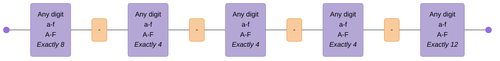

<!-- CONTENT:END -->
