# Examples

Here are some common regular expressions, showing how they are visualized as mermaid diagrams:

> [!TIP]
> If you are viewing this page somewhere that does not render embedded Mermaid diagrams, you can click the "view as image" links below, or view the diagrams by copy/pasting the code blocks below into the [Mermaid Live Editor](https://mermaid.live).

<!-- CONTENT:START -->

## Table of Contents

- [All Possible Tokens](#all-possible-tokens)
- [Comprehensive RegExp Features](#comprehensive-regexp-features)
- [Conventional Commits](#conventional-commits)
- [Cron Schedule](#cron-schedule)
- [Date (ISO 8601)](#date-iso-8601)
- [DateTime (RFC3339)](#datetime-rfc3339)
- [Email Address](#email-address)
- [Email (RFC2822)](#email-rfc2822)
- [HTML Tags](#html-tags)
- [Complex Password Requirements](#complex-password-requirements)
- [Phone Number](#phone-number)
- [Semver](#semver)
- [Stocks](#stocks)
- [URL (RFC3987)](#url-rfc3987)
- [URL](#url)
- [UUID](#uuid)

## All Possible Tokens

An example of all possible token types

### Pattern

```regex
^(?<protocol>https?):\/\/(?:www\.)?([a-z0-9\-]+)\.(?:com|org|net)(?:\/[^\s]*)?(?=query)\1\d{3,5}\w+\s*\S+[^abc](?!neg)(?<!back)$|alt\b\B.
```

### Diagram

<details>
<summary>Click to view as image</summary>
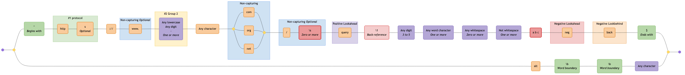
</details>


---

## Comprehensive RegExp Features

Demonstrates MDN JavaScript RegExp syntax cheatsheet features including character classes (\d \D \w \W \s \S .), assertions (^ $ \b \B), lookahead/lookbehind ((?=) (?!) (?<=) (?<!)), groups (capturing, named, non-capturing), backreferences (\1 \k<name>), quantifiers (? \* + {n} {n,} {n,m}), character classes ([abc] [a-z] [^xyz]), and alternation (|)

### Pattern

```regex
^(?<named>[A-Z]\w{2,5}):\s+(a|b|cd)(?:https?:\/\/)?(?<domain>[a-z0-9.-]+)(?=\.com)(?!\.org)(?<=example)(?<!test)[a-z]{1,3}\.com(?:\/\S+)?(?:\?[a-zA-Z0-9&=]+)?(?<digit>\d+)\k<digit>\1\b\B\d+\D+\w+\W+\s+\S+[^xyz]+\t\r\n|alt$
```

### Diagram

<details>
<summary>Click to view as image</summary>
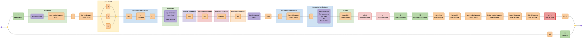
</details>

```mermaid
graph LR
  accTitle: "Regex: ^(?<named>[A-Z]\\w{2,5}):\\s+(a|b|cd)(?:https?:\\/\\/)?(?<domain>[a-z0-9.-]+)(?=\\.com)(?!\\.org)(?<=example)(?<!test)[a-z]{1,3}\\.com(?:\\/\\S+)?(?:\\?[a-zA-Z0-9&=]+)?(?<digit>\\d+)\\k<digit>\\1\\b\\B\\d+\\D+\\w+\\W+\\s+\\S+[^xyz]+\\t\\r\\n|alt$"
  accDescr: "Generated with regex-to-mermaid@1.0.3"

  %% Nodes
  start@{ shape: f-circ };
  fin@{ shape: f-circ };
  disjunction_begin_1:::disjunction@{ shape: f-circ };
  disjunction_end_1:::disjunction@{ shape: f-circ };
  assertion_1("^<br><i><small>Begins with</small></i>"):::assertion;
  char_class_1("Any uppercase"):::char-class;
  literal_1("Any word character<br><i><small>2 to 5</small></i>"):::literal;
  literal_2(":"):::literal;
  literal_3("Any whitespace<br><i><small>One or more</small></i>"):::literal;
  disjunction_begin_2:::disjunction@{ shape: f-circ };
  disjunction_end_2:::disjunction@{ shape: f-circ };
  literal_4("a"):::literal;
  literal_5("b"):::literal;
  literal_6("cd"):::literal;
  literal_7("http"):::literal;
  literal_8("s<br><i><small>Optional</small></i>"):::literal;
  literal_9("://"):::literal;
  char_class_2("Any lowercase<br>Any digit<br>. -<br><i><small>One or more</small></i>"):::char-class;
  literal_10(".com"):::literal;
  literal_11(".org"):::literal;
  literal_12("example"):::literal;
  literal_13("test"):::literal;
  char_class_3("Any lowercase<br><i><small>1 to 3</small></i>"):::char-class;
  literal_14(".com"):::literal;
  literal_15("/"):::literal;
  literal_16("Not whitespace<br><i><small>One or more</small></i>"):::literal;
  literal_17("?"):::literal;
  char_class_4("Any lowercase<br>Any uppercase<br>Any digit<br>& =<br><i><small>One or more</small></i>"):::char-class;
  literal_18("Any digit<br><i><small>One or more</small></i>"):::literal;
  back_reference_1("\digit<br><i><small>Back-reference</small></i>"):::back-reference;
  back_reference_2("\1<br><i><small>Back-reference</small></i>"):::back-reference;
  assertion_2("\b<br><i><small>Word boundary</small></i>"):::assertion;
  assertion_3("\B<br><i><small>Non-word boundary</small></i>"):::assertion;
  literal_19("Any digit<br><i><small>One or more</small></i>"):::literal;
  literal_20("Not a digit<br><i><small>One or more</small></i>"):::literal;
  literal_21("Any word character<br><i><small>One or more</small></i>"):::literal;
  literal_22("Not a word character<br><i><small>One or more</small></i>"):::literal;
  literal_23("Any whitespace<br><i><small>One or more</small></i>"):::literal;
  literal_24("Not whitespace<br><i><small>One or more</small></i>"):::literal;
  negated_char_class_1("x y z<br><i><small>One or more</small></i>"):::negated-char-class;
  literal_25("\t\r\n"):::literal;
  literal_26("alt"):::literal;
  assertion_4("$<br><i><small>Ends with</small></i>"):::assertion;

  %% Subgraphs
  subgraph named_capture_1 ["<small>#1</small> named"]
    char_class_1
    literal_1
  end

  subgraph standard_1 ["<small>#2</small> Group 2"]
    disjunction_begin_2
    disjunction_end_2
    literal_4
    literal_5
    literal_6
  end

  subgraph non_capturing_1 ["Non-capturing <small><i>Optional</i></small>"]
    literal_7
    literal_8
    literal_9
  end

  subgraph named_capture_2 ["<small>#3</small> domain"]
    char_class_2
  end

  subgraph positive_lookahead_1 ["Positive Lookahead"]
    literal_10
  end

  subgraph negative_lookahead_1 ["Negative Lookahead"]
    literal_11
  end

  subgraph positive_lookbehind_1 ["Positive Lookbehind"]
    literal_12
  end

  subgraph negative_lookbehind_1 ["Negative Lookbehind"]
    literal_13
  end

  subgraph non_capturing_2 ["Non-capturing <small><i>Optional</i></small>"]
    literal_15
    literal_16
  end

  subgraph non_capturing_3 ["Non-capturing <small><i>Optional</i></small>"]
    literal_17
    char_class_4
  end

  subgraph named_capture_3 ["<small>#4</small> digit"]
    literal_18
  end

  %% Edges
  start --- disjunction_begin_1;
  disjunction_begin_1 --- assertion_1;
  assertion_1 --- char_class_1;
  char_class_1 --- literal_1;
  literal_1 --- literal_2;
  literal_2 --- literal_3;
  literal_3 --- disjunction_begin_2;
  disjunction_begin_2 --- literal_4;
  literal_4 --- disjunction_end_2;
  disjunction_begin_2 --- literal_5;
  literal_5 --- disjunction_end_2;
  disjunction_begin_2 --- literal_6;
  literal_6 --- disjunction_end_2;
  disjunction_end_2 --- literal_7;
  literal_7 --- literal_8;
  literal_8 --- literal_9;
  literal_9 --- char_class_2;
  char_class_2 --- literal_10;
  literal_10 --- literal_11;
  literal_11 --- literal_12;
  literal_12 --- literal_13;
  literal_13 --- char_class_3;
  char_class_3 --- literal_14;
  literal_14 --- literal_15;
  literal_15 --- literal_16;
  literal_16 --- literal_17;
  literal_17 --- char_class_4;
  char_class_4 --- literal_18;
  literal_18 --- back_reference_1;
  back_reference_1 --- back_reference_2;
  back_reference_2 --- assertion_2;
  assertion_2 --- assertion_3;
  assertion_3 --- literal_19;
  literal_19 --- literal_20;
  literal_20 --- literal_21;
  literal_21 --- literal_22;
  literal_22 --- literal_23;
  literal_23 --- literal_24;
  literal_24 --- negated_char_class_1;
  negated_char_class_1 --- literal_25;
  literal_25 --- disjunction_end_1;
  disjunction_begin_1 --- literal_26;
  literal_26 --- assertion_4;
  assertion_4 --- disjunction_end_1;
  disjunction_end_1 --- fin;

  %% Styles
  %% Node Styling
  classDef disjunction fill:#FFD966,stroke:#F1C232,color:#000000;
  classDef assertion fill:#B6D7A8,stroke:#93C47D,color:#000000;
  classDef char-class fill:#B4A7D6,stroke:#8E7CC3,color:#000000;
  classDef literal fill:#F9CB9C,stroke:#E69138,color:#000000;
  classDef back-reference fill:#F4CCCC,stroke:#E06666,color:#000000;
  classDef negated-char-class fill:#EA9999,stroke:#CC0000,color:#000000;

  %% Group Styling
  classDef named-capture fill:#D9EAD3,stroke:#93C47D,color:#000000;
  classDef standard fill:#FFF2CC,stroke:#F1C232,color:#000000;
  classDef non-capturing fill:#CFE2F3,stroke:#6D9EEB,color:#000000;
  classDef positive-lookahead fill:#D9D2E9,stroke:#8E7CC3,color:#000000;
  classDef negative-lookahead fill:#F4CCCC,stroke:#E06666,color:#000000;
  classDef positive-lookbehind fill:#EAD1DC,stroke:#C27BA0,color:#000000;
  classDef negative-lookbehind fill:#FCE5CD,stroke:#E69138,color:#000000;

  %% Apply Group Classes
  class named_capture_1,named_capture_2,named_capture_3 named-capture;
  class standard_1 standard;
  class non_capturing_1,non_capturing_2,non_capturing_3 non-capturing;
  class positive_lookahead_1 positive-lookahead;
  class negative_lookahead_1 negative-lookahead;
  class positive_lookbehind_1 positive-lookbehind;
  class negative_lookbehind_1 negative-lookbehind;
```

---

## Conventional Commits

Validates a RFC3339 DateTime format

### Pattern

```regex
\A(?:(?:^(?P<type>feat|fix|ci|chore|docs|test|style|refactor|build|perf|revert)(?:\((?P<scope>[\w-]+)\))?(?P<breaking>!)?:\s(?P<subject>\b[\w#<> ./\t\\-]{3,}(?:\b|\.))$)(?:(?:(?P<BLANK_LINE>\n^$\n)(?P<body>(?:^.{3,}(?:\b|\.)$\n?){1,3}))?(?P<BLANK_LINE2>\n^$\n)(?:(?P<breaking_change>^BREAKING\sCHANGE:\s[\s\w]+(?:\b|\.)$)\n)?(?:(?P<footer>^\w+:\s[\w#-]+(?:\b|\.))))?\n?|)\Z
```

### Diagram

<details>
<summary>Click to view as image</summary>
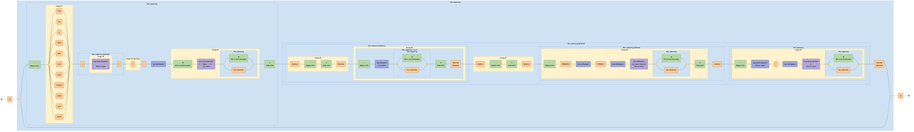
</details>

```mermaid
graph LR
  accTitle: "Regex: \\A(?:(?:^(?P<type>feat|fix|ci|chore|docs|test|style|refactor|build|perf|revert)(?:\\((?P<scope>[\\w-]+)\\))?(?P<breaking>!)?:\\s(?P<subject>\\b[\\w#<> ./\\t\\\\-]{3,}(?:\\b|\\.))$)(?:(?:(?P<BLANK_LINE>\\n^$\\n)(?P<body>(?:^.{3,}(?:\\b|\\.)$\\n?){1,3}))?(?P<BLANK_LINE2>\\n^$\\n)(?:(?P<breaking_change>^BREAKING\\sCHANGE:\\s[\\s\\w]+(?:\\b|\\.)$)\\n)?(?:(?P<footer>^\\w+:\\s[\\w#-]+(?:\\b|\\.))))?\\n?|)\\Z"
  accDescr: "Generated with regex-to-mermaid@1.0.3"

  %% Nodes
  start@{ shape: f-circ };
  fin@{ shape: f-circ };
  literal_1("A"):::literal;
  disjunction_begin_1:::disjunction@{ shape: f-circ };
  disjunction_end_1:::disjunction@{ shape: f-circ };
  assertion_1("^<br><i><small>Begins with</small></i>"):::assertion;
  disjunction_begin_2:::disjunction@{ shape: f-circ };
  disjunction_end_2:::disjunction@{ shape: f-circ };
  literal_2("feat"):::literal;
  literal_3("fix"):::literal;
  literal_4("ci"):::literal;
  literal_5("chore"):::literal;
  literal_6("docs"):::literal;
  literal_7("test"):::literal;
  literal_8("style"):::literal;
  literal_9("refactor"):::literal;
  literal_10("build"):::literal;
  literal_11("perf"):::literal;
  literal_12("revert"):::literal;
  literal_13("("):::literal;
  char_class_1("\w -<br><i><small>One or more</small></i>"):::char-class;
  literal_14(")"):::literal;
  literal_15("!"):::literal;
  literal_16(":\s"):::literal;
  assertion_2("\b<br><i><small>Word boundary</small></i>"):::assertion;
  char_class_2("\w # < > Space . / \t \ -<br><i><small>3 or more</small></i>"):::char-class;
  disjunction_begin_3:::disjunction@{ shape: f-circ };
  disjunction_end_3:::disjunction@{ shape: f-circ };
  assertion_3("\b<br><i><small>Word boundary</small></i>"):::assertion;
  literal_17("Any character"):::literal;
  assertion_4("$<br><i><small>Ends with</small></i>"):::assertion;
  literal_18("Newline"):::literal;
  assertion_5("^<br><i><small>Begins with</small></i>"):::assertion;
  assertion_6("$<br><i><small>Ends with</small></i>"):::assertion;
  literal_19("Newline"):::literal;
  assertion_7("^<br><i><small>Begins with</small></i>"):::assertion;
  literal_20("Any character<br><i><small>3 or more</small></i>"):::literal;
  disjunction_begin_4:::disjunction@{ shape: f-circ };
  disjunction_end_4:::disjunction@{ shape: f-circ };
  assertion_8("\b<br><i><small>Word boundary</small></i>"):::assertion;
  literal_21("Any character"):::literal;
  assertion_9("$<br><i><small>Ends with</small></i>"):::assertion;
  literal_22("Newline<br><i><small>Optional</small></i>"):::literal;
  literal_23("Newline"):::literal;
  assertion_10("^<br><i><small>Begins with</small></i>"):::assertion;
  assertion_11("$<br><i><small>Ends with</small></i>"):::assertion;
  literal_24("Newline"):::literal;
  assertion_12("^<br><i><small>Begins with</small></i>"):::assertion;
  literal_25("BREAKING\sCHANGE:\s"):::literal;
  char_class_3("\s \w<br><i><small>One or more</small></i>"):::char-class;
  disjunction_begin_5:::disjunction@{ shape: f-circ };
  disjunction_end_5:::disjunction@{ shape: f-circ };
  assertion_13("\b<br><i><small>Word boundary</small></i>"):::assertion;
  literal_26("Any character"):::literal;
  assertion_14("$<br><i><small>Ends with</small></i>"):::assertion;
  literal_27("Newline"):::literal;
  assertion_15("^<br><i><small>Begins with</small></i>"):::assertion;
  literal_28("Any word character<br><i><small>One or more</small></i>"):::literal;
  literal_29(":\s"):::literal;
  char_class_4("\w # -<br><i><small>One or more</small></i>"):::char-class;
  disjunction_begin_6:::disjunction@{ shape: f-circ };
  disjunction_end_6:::disjunction@{ shape: f-circ };
  assertion_16("\b<br><i><small>Word boundary</small></i>"):::assertion;
  literal_30("Any character"):::literal;
  literal_31("Newline<br><i><small>Optional</small></i>"):::literal;
  literal_32("Z"):::literal;

  %% Subgraphs
  subgraph standard_1 ["<small>#1</small> Group 1"]
    disjunction_begin_2
    disjunction_end_2
    literal_2
    literal_3
    literal_4
    literal_5
    literal_6
    literal_7
    literal_8
    literal_9
    literal_10
    literal_11
    literal_12
  end

  subgraph standard_2 ["<small>#2</small> Group 2"]
    char_class_1
  end

  subgraph non_capturing_3 ["Non-capturing <small><i>Optional</i></small>"]
    standard_2
    literal_13
    literal_14
  end

  subgraph standard_3 ["<small>#3</small> Group 3 <small><i>Optional</i></small>"]
    literal_15
  end

  subgraph non_capturing_4 ["Non-capturing"]
    disjunction_begin_3
    disjunction_end_3
    assertion_3
    literal_17
  end

  subgraph standard_4 ["<small>#4</small> Group 4"]
    non_capturing_4
    assertion_2
    char_class_2
  end

  subgraph non_capturing_2 ["Non-capturing"]
    standard_1
    standard_2
    non_capturing_3
    standard_3
    non_capturing_4
    standard_4
    assertion_1
    literal_16
    assertion_4
  end

  subgraph standard_5 ["<small>#5</small> Group 5"]
    literal_18
    assertion_5
    assertion_6
    literal_19
  end

  subgraph non_capturing_8 ["Non-capturing"]
    disjunction_begin_4
    disjunction_end_4
    assertion_8
    literal_21
  end

  subgraph non_capturing_7 ["Non-capturing <small><i>1 to 3</i></small>"]
    non_capturing_8
    assertion_7
    literal_20
    assertion_9
    literal_22
  end

  subgraph standard_6 ["<small>#6</small> Group 6"]
    non_capturing_8
    non_capturing_7
  end

  subgraph non_capturing_6 ["Non-capturing <small><i>Optional</i></small>"]
    standard_5
    non_capturing_8
    non_capturing_7
    standard_6
  end

  subgraph standard_7 ["<small>#7</small> Group 7"]
    literal_23
    assertion_10
    assertion_11
    literal_24
  end

  subgraph non_capturing_10 ["Non-capturing"]
    disjunction_begin_5
    disjunction_end_5
    assertion_13
    literal_26
  end

  subgraph standard_8 ["<small>#8</small> Group 8"]
    non_capturing_10
    assertion_12
    literal_25
    char_class_3
    assertion_14
  end

  subgraph non_capturing_9 ["Non-capturing <small><i>Optional</i></small>"]
    non_capturing_10
    standard_8
    literal_27
  end

  subgraph non_capturing_12 ["Non-capturing"]
    disjunction_begin_6
    disjunction_end_6
    assertion_16
    literal_30
  end

  subgraph standard_9 ["<small>#9</small> Group 9"]
    non_capturing_12
    assertion_15
    literal_28
    literal_29
    char_class_4
  end

  subgraph non_capturing_11 ["Non-capturing"]
    non_capturing_12
    standard_9
  end

  subgraph non_capturing_5 ["Non-capturing <small><i>Optional</i></small>"]
    standard_5
    non_capturing_8
    non_capturing_7
    standard_6
    non_capturing_6
    standard_7
    non_capturing_10
    standard_8
    non_capturing_9
    non_capturing_12
    standard_9
    non_capturing_11
  end

  subgraph non_capturing_1 ["Non-capturing"]
    standard_1
    standard_2
    non_capturing_3
    standard_3
    non_capturing_4
    standard_4
    non_capturing_2
    standard_5
    non_capturing_8
    non_capturing_7
    standard_6
    non_capturing_6
    standard_7
    non_capturing_10
    standard_8
    non_capturing_9
    non_capturing_12
    standard_9
    non_capturing_11
    non_capturing_5
    disjunction_begin_1
    disjunction_end_1
    literal_31
  end

  %% Edges
  start --- literal_1;
  literal_1 --- disjunction_begin_1;
  disjunction_begin_1 --- assertion_1;
  assertion_1 --- disjunction_begin_2;
  disjunction_begin_2 --- literal_2;
  literal_2 --- disjunction_end_2;
  disjunction_begin_2 --- literal_3;
  literal_3 --- disjunction_end_2;
  disjunction_begin_2 --- literal_4;
  literal_4 --- disjunction_end_2;
  disjunction_begin_2 --- literal_5;
  literal_5 --- disjunction_end_2;
  disjunction_begin_2 --- literal_6;
  literal_6 --- disjunction_end_2;
  disjunction_begin_2 --- literal_7;
  literal_7 --- disjunction_end_2;
  disjunction_begin_2 --- literal_8;
  literal_8 --- disjunction_end_2;
  disjunction_begin_2 --- literal_9;
  literal_9 --- disjunction_end_2;
  disjunction_begin_2 --- literal_10;
  literal_10 --- disjunction_end_2;
  disjunction_begin_2 --- literal_11;
  literal_11 --- disjunction_end_2;
  disjunction_begin_2 --- literal_12;
  literal_12 --- disjunction_end_2;
  disjunction_end_2 --- literal_13;
  literal_13 --- char_class_1;
  char_class_1 --- literal_14;
  literal_14 --- literal_15;
  literal_15 --- literal_16;
  literal_16 --- assertion_2;
  assertion_2 --- char_class_2;
  char_class_2 --- disjunction_begin_3;
  disjunction_begin_3 --- assertion_3;
  assertion_3 --- disjunction_end_3;
  disjunction_begin_3 --- literal_17;
  literal_17 --- disjunction_end_3;
  disjunction_end_3 --- assertion_4;
  assertion_4 --- literal_18;
  literal_18 --- assertion_5;
  assertion_5 --- assertion_6;
  assertion_6 --- literal_19;
  literal_19 --- assertion_7;
  assertion_7 --- literal_20;
  literal_20 --- disjunction_begin_4;
  disjunction_begin_4 --- assertion_8;
  assertion_8 --- disjunction_end_4;
  disjunction_begin_4 --- literal_21;
  literal_21 --- disjunction_end_4;
  disjunction_end_4 --- assertion_9;
  assertion_9 --- literal_22;
  literal_22 --- literal_23;
  literal_23 --- assertion_10;
  assertion_10 --- assertion_11;
  assertion_11 --- literal_24;
  literal_24 --- assertion_12;
  assertion_12 --- literal_25;
  literal_25 --- char_class_3;
  char_class_3 --- disjunction_begin_5;
  disjunction_begin_5 --- assertion_13;
  assertion_13 --- disjunction_end_5;
  disjunction_begin_5 --- literal_26;
  literal_26 --- disjunction_end_5;
  disjunction_end_5 --- assertion_14;
  assertion_14 --- literal_27;
  literal_27 --- assertion_15;
  assertion_15 --- literal_28;
  literal_28 --- literal_29;
  literal_29 --- char_class_4;
  char_class_4 --- disjunction_begin_6;
  disjunction_begin_6 --- assertion_16;
  assertion_16 --- disjunction_end_6;
  disjunction_begin_6 --- literal_30;
  literal_30 --- disjunction_end_6;
  disjunction_end_6 --- literal_31;
  literal_31 --- disjunction_end_1;
  disjunction_end_1 --- literal_32;
  literal_32 --- fin;

  %% Styles
  %% Node Styling
  classDef literal fill:#F9CB9C,stroke:#E69138,color:#000000;
  classDef disjunction fill:#FFD966,stroke:#F1C232,color:#000000;
  classDef assertion fill:#B6D7A8,stroke:#93C47D,color:#000000;
  classDef char-class fill:#B4A7D6,stroke:#8E7CC3,color:#000000;

  %% Group Styling
  classDef standard fill:#FFF2CC,stroke:#F1C232,color:#000000;
  classDef non-capturing fill:#CFE2F3,stroke:#6D9EEB,color:#000000;

  %% Apply Group Classes
  class standard_1,standard_2,standard_3,standard_4,standard_5,standard_6,standard_7,standard_8,standard_9 standard;
  class non_capturing_3,non_capturing_4,non_capturing_2,non_capturing_8,non_capturing_7,non_capturing_6,non_capturing_10,non_capturing_9,non_capturing_12,non_capturing_11,non_capturing_5,non_capturing_1 non-capturing;
```

---

## Cron Schedule

Validates CRON pattern (Quartz) and supports groups

### Pattern

```regex
^\s*($|#|\w+\s*=|(?<SECOND>(?:\?|\*|(?:(?<START_SEC>[0-5]?\d)(?:(?<DELIMITER_SEC>\-|\/|\,)(?<END_SEC>[0-6]?\d))*)))\s+(?<MINUTE>(?:\?|\*|(?:(?<START_MIN>[0-5]?\d)(?:(?<DELIMITER_MIN>\-|\/|\,)(?<END_MIN>[0-6]?\d))*)))\s+(?<HOUR>(?:\?|\*|(?:(?<START_HR>[0-2]?\d)(?:(?<DELIMITER_HR>\-|\/|\,)(?<END_HR>[0-2]?\d))*)))\s+(?<DAYOFMONTH>\?|\*|(?:(?<START_DOM>L|W|LW|[1-3]?\dW?)(?:(?<DELIMITER_DOM>\-|\/|\,)(?<END_DOM>[1-3]?\d?W?))*))\s+(?<MONTH>\*|(?:(?<START_MON>[1-9]|1[012]|JAN|FEB|MAR|APR|MAY|JUN|JUL|AUG|SEP|OCT|NOV|DEC)(?:(?<DELIMITER_MON>\-|\/|\,)(?<END_MON>[1-9]|1[012]|JAN|FEB|MAR|APR|MAY|JUN|JUL|AUG|SEP|OCT|NOV|DEC))*))\s+(?<DAYOFWEEK>\?|\*|(?:(?<START_DOW>[1-7]|SUN|MON|TUE|WED|THU|FRI|SAT)(?:(?:(?:(?<DELIMITER_DOW>\/|\,|\#)(?<END_DOW>[1-7]|SUN|MON|TUE|WED|THU|FRI|SAT))*)L?)*))(?:|\s)+(?<YEAR>(?:\*|(?:(?<START_YR>\b(?:[1-2](?:9|0)\d\d)\b)(?:(?<DELIMITER_YR>\-|\/|\,)(?<END_YR>\b(?:[1-9]|[1-9][0-9]|1[0-8][0-9]|19[0-2])\b|\b(?:[1-2](?:9|0)\d\d)\b))*))))$
```

### Diagram

<details>
<summary>Click to view as image</summary>
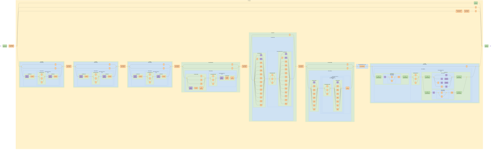
</details>

```mermaid
graph LR
  accTitle: "Regex: ^\\s*($|#|\\w+\\s*=|(?<SECOND>(?:\\?|\\*|(?:(?<START_SEC>[0-5]?\\d)(?:(?<DELIMITER_SEC>\\-|\\/|\\,)(?<END_SEC>[0-6]?\\d))*)))\\s+(?<MINUTE>(?:\\?|\\*|(?:(?<START_MIN>[0-5]?\\d)(?:(?<DELIMITER_MIN>\\-|\\/|\\,)(?<END_MIN>[0-6]?\\d))*)))\\s+(?<HOUR>(?:\\?|\\*|(?:(?<START_HR>[0-2]?\\d)(?:(?<DELIMITER_HR>\\-|\\/|\\,)(?<END_HR>[0-2]?\\d))*)))\\s+(?<DAYOFMONTH>\\?|\\*|(?:(?<START_DOM>L|W|LW|[1-3]?\\dW?)(?:(?<DELIMITER_DOM>\\-|\\/|\\,)(?<END_DOM>[1-3]?\\d?W?))*))\\s+(?<MONTH>\\*|(?:(?<START_MON>[1-9]|1[012]|JAN|FEB|MAR|APR|MAY|JUN|JUL|AUG|SEP|OCT|NOV|DEC)(?:(?<DELIMITER_MON>\\-|\\/|\\,)(?<END_MON>[1-9]|1[012]|JAN|FEB|MAR|APR|MAY|JUN|JUL|AUG|SEP|OCT|NOV|DEC))*))\\s+(?<DAYOFWEEK>\\?|\\*|(?:(?<START_DOW>[1-7]|SUN|MON|TUE|WED|THU|FRI|SAT)(?:(?:(?:(?<DELIMITER_DOW>\\/|\\,|\\#)(?<END_DOW>[1-7]|SUN|MON|TUE|WED|THU|FRI|SAT))*)L?)*))(?:|\\s)+(?<YEAR>(?:\\*|(?:(?<START_YR>\\b(?:[1-2](?:9|0)\\d\\d)\\b)(?:(?<DELIMITER_YR>\\-|\\/|\\,)(?<END_YR>\\b(?:[1-9]|[1-9][0-9]|1[0-8][0-9]|19[0-2])\\b|\\b(?:[1-2](?:9|0)\\d\\d)\\b))*))))$"
  accDescr: "Generated with regex-to-mermaid@1.0.3"

  %% Nodes
  start@{ shape: f-circ };
  fin@{ shape: f-circ };
  assertion_1("^<br><i><small>Begins with</small></i>"):::assertion;
  literal_1("Any whitespace<br><i><small>Zero or more</small></i>"):::literal;
  disjunction_begin_1:::disjunction@{ shape: f-circ };
  disjunction_end_1:::disjunction@{ shape: f-circ };
  assertion_2("$<br><i><small>Ends with</small></i>"):::assertion;
  literal_2("#"):::literal;
  literal_3("Any word character<br><i><small>One or more</small></i>"):::literal;
  literal_4("Any whitespace<br><i><small>Zero or more</small></i>"):::literal;
  literal_5("="):::literal;
  disjunction_begin_2:::disjunction@{ shape: f-circ };
  disjunction_end_2:::disjunction@{ shape: f-circ };
  literal_6("?"):::literal;
  literal_7("*"):::literal;
  char_class_1("0-5<br><i><small>Optional</small></i>"):::char-class;
  literal_8("Any digit"):::literal;
  disjunction_begin_3:::disjunction@{ shape: f-circ };
  disjunction_end_3:::disjunction@{ shape: f-circ };
  literal_9("-"):::literal;
  literal_10("/"):::literal;
  literal_11(","):::literal;
  char_class_2("0-6<br><i><small>Optional</small></i>"):::char-class;
  literal_12("Any digit"):::literal;
  literal_13("Any whitespace<br><i><small>One or more</small></i>"):::literal;
  disjunction_begin_4:::disjunction@{ shape: f-circ };
  disjunction_end_4:::disjunction@{ shape: f-circ };
  literal_14("?"):::literal;
  literal_15("*"):::literal;
  char_class_3("0-5<br><i><small>Optional</small></i>"):::char-class;
  literal_16("Any digit"):::literal;
  disjunction_begin_5:::disjunction@{ shape: f-circ };
  disjunction_end_5:::disjunction@{ shape: f-circ };
  literal_17("-"):::literal;
  literal_18("/"):::literal;
  literal_19(","):::literal;
  char_class_4("0-6<br><i><small>Optional</small></i>"):::char-class;
  literal_20("Any digit"):::literal;
  literal_21("Any whitespace<br><i><small>One or more</small></i>"):::literal;
  disjunction_begin_6:::disjunction@{ shape: f-circ };
  disjunction_end_6:::disjunction@{ shape: f-circ };
  literal_22("?"):::literal;
  literal_23("*"):::literal;
  char_class_5("0-2<br><i><small>Optional</small></i>"):::char-class;
  literal_24("Any digit"):::literal;
  disjunction_begin_7:::disjunction@{ shape: f-circ };
  disjunction_end_7:::disjunction@{ shape: f-circ };
  literal_25("-"):::literal;
  literal_26("/"):::literal;
  literal_27(","):::literal;
  char_class_6("0-2<br><i><small>Optional</small></i>"):::char-class;
  literal_28("Any digit"):::literal;
  literal_29("Any whitespace<br><i><small>One or more</small></i>"):::literal;
  disjunction_begin_8:::disjunction@{ shape: f-circ };
  disjunction_end_8:::disjunction@{ shape: f-circ };
  literal_30("?"):::literal;
  literal_31("*"):::literal;
  disjunction_begin_9:::disjunction@{ shape: f-circ };
  disjunction_end_9:::disjunction@{ shape: f-circ };
  literal_32("L"):::literal;
  literal_33("W"):::literal;
  literal_34("LW"):::literal;
  char_class_7("1-3<br><i><small>Optional</small></i>"):::char-class;
  literal_35("Any digit"):::literal;
  literal_36("W<br><i><small>Optional</small></i>"):::literal;
  disjunction_begin_10:::disjunction@{ shape: f-circ };
  disjunction_end_10:::disjunction@{ shape: f-circ };
  literal_37("-"):::literal;
  literal_38("/"):::literal;
  literal_39(","):::literal;
  char_class_8("1-3<br><i><small>Optional</small></i>"):::char-class;
  literal_40("Any digit<br><i><small>Optional</small></i>"):::literal;
  literal_41("W<br><i><small>Optional</small></i>"):::literal;
  literal_42("Any whitespace<br><i><small>One or more</small></i>"):::literal;
  disjunction_begin_11:::disjunction@{ shape: f-circ };
  disjunction_end_11:::disjunction@{ shape: f-circ };
  literal_43("*"):::literal;
  disjunction_begin_12:::disjunction@{ shape: f-circ };
  disjunction_end_12:::disjunction@{ shape: f-circ };
  char_class_9("1-9"):::char-class;
  literal_44("1"):::literal;
  char_class_10("0 1 2"):::char-class;
  literal_45("JAN"):::literal;
  literal_46("FEB"):::literal;
  literal_47("MAR"):::literal;
  literal_48("APR"):::literal;
  literal_49("MAY"):::literal;
  literal_50("JUN"):::literal;
  literal_51("JUL"):::literal;
  literal_52("AUG"):::literal;
  literal_53("SEP"):::literal;
  literal_54("OCT"):::literal;
  literal_55("NOV"):::literal;
  literal_56("DEC"):::literal;
  disjunction_begin_13:::disjunction@{ shape: f-circ };
  disjunction_end_13:::disjunction@{ shape: f-circ };
  literal_57("-"):::literal;
  literal_58("/"):::literal;
  literal_59(","):::literal;
  disjunction_begin_14:::disjunction@{ shape: f-circ };
  disjunction_end_14:::disjunction@{ shape: f-circ };
  char_class_11("1-9"):::char-class;
  literal_60("1"):::literal;
  char_class_12("0 1 2"):::char-class;
  literal_61("JAN"):::literal;
  literal_62("FEB"):::literal;
  literal_63("MAR"):::literal;
  literal_64("APR"):::literal;
  literal_65("MAY"):::literal;
  literal_66("JUN"):::literal;
  literal_67("JUL"):::literal;
  literal_68("AUG"):::literal;
  literal_69("SEP"):::literal;
  literal_70("OCT"):::literal;
  literal_71("NOV"):::literal;
  literal_72("DEC"):::literal;
  literal_73("Any whitespace<br><i><small>One or more</small></i>"):::literal;
  disjunction_begin_15:::disjunction@{ shape: f-circ };
  disjunction_end_15:::disjunction@{ shape: f-circ };
  literal_74("?"):::literal;
  literal_75("*"):::literal;
  disjunction_begin_16:::disjunction@{ shape: f-circ };
  disjunction_end_16:::disjunction@{ shape: f-circ };
  char_class_13("1-7"):::char-class;
  literal_76("SUN"):::literal;
  literal_77("MON"):::literal;
  literal_78("TUE"):::literal;
  literal_79("WED"):::literal;
  literal_80("THU"):::literal;
  literal_81("FRI"):::literal;
  literal_82("SAT"):::literal;
  disjunction_begin_17:::disjunction@{ shape: f-circ };
  disjunction_end_17:::disjunction@{ shape: f-circ };
  literal_83("/"):::literal;
  literal_84(","):::literal;
  literal_85("#"):::literal;
  disjunction_begin_18:::disjunction@{ shape: f-circ };
  disjunction_end_18:::disjunction@{ shape: f-circ };
  char_class_14("1-7"):::char-class;
  literal_86("SUN"):::literal;
  literal_87("MON"):::literal;
  literal_88("TUE"):::literal;
  literal_89("WED"):::literal;
  literal_90("THU"):::literal;
  literal_91("FRI"):::literal;
  literal_92("SAT"):::literal;
  literal_93("L<br><i><small>Optional</small></i>"):::literal;
  disjunction_begin_19:::disjunction@{ shape: f-circ };
  disjunction_end_19:::disjunction@{ shape: f-circ };
  literal_94("Any whitespace"):::literal;
  disjunction_begin_20:::disjunction@{ shape: f-circ };
  disjunction_end_20:::disjunction@{ shape: f-circ };
  literal_95("*"):::literal;
  assertion_3("\b<br><i><small>Word boundary</small></i>"):::assertion;
  char_class_15("1-2"):::char-class;
  disjunction_begin_21:::disjunction@{ shape: f-circ };
  disjunction_end_21:::disjunction@{ shape: f-circ };
  literal_96("9"):::literal;
  literal_97("0"):::literal;
  literal_98("\d\d"):::literal;
  assertion_4("\b<br><i><small>Word boundary</small></i>"):::assertion;
  disjunction_begin_22:::disjunction@{ shape: f-circ };
  disjunction_end_22:::disjunction@{ shape: f-circ };
  literal_99("-"):::literal;
  literal_100("/"):::literal;
  literal_101(","):::literal;
  disjunction_begin_23:::disjunction@{ shape: f-circ };
  disjunction_end_23:::disjunction@{ shape: f-circ };
  assertion_5("\b<br><i><small>Word boundary</small></i>"):::assertion;
  disjunction_begin_24:::disjunction@{ shape: f-circ };
  disjunction_end_24:::disjunction@{ shape: f-circ };
  char_class_16("1-9"):::char-class;
  char_class_17("1-9"):::char-class;
  char_class_18("Any digit"):::char-class;
  literal_102("1"):::literal;
  char_class_19("0-8"):::char-class;
  char_class_20("Any digit"):::char-class;
  literal_103("19"):::literal;
  char_class_21("0-2"):::char-class;
  assertion_6("\b<br><i><small>Word boundary</small></i>"):::assertion;
  assertion_7("\b<br><i><small>Word boundary</small></i>"):::assertion;
  char_class_22("1-2"):::char-class;
  disjunction_begin_25:::disjunction@{ shape: f-circ };
  disjunction_end_25:::disjunction@{ shape: f-circ };
  literal_104("9"):::literal;
  literal_105("0"):::literal;
  literal_106("\d\d"):::literal;
  assertion_8("\b<br><i><small>Word boundary</small></i>"):::assertion;
  assertion_9("$<br><i><small>Ends with</small></i>"):::assertion;

  %% Subgraphs
  subgraph named_capture_2 ["<small>#3</small> START_SEC"]
    char_class_1
    literal_8
  end

  subgraph named_capture_3 ["<small>#4</small> DELIMITER_SEC"]
    disjunction_begin_3
    disjunction_end_3
    literal_9
    literal_10
    literal_11
  end

  subgraph named_capture_4 ["<small>#5</small> END_SEC"]
    char_class_2
    literal_12
  end

  subgraph non_capturing_3 ["Non-capturing <small><i>Zero or more</i></small>"]
    named_capture_3
    named_capture_4
  end

  subgraph non_capturing_2 ["Non-capturing"]
    named_capture_2
    named_capture_3
    named_capture_4
    non_capturing_3
  end

  subgraph non_capturing_1 ["Non-capturing"]
    named_capture_2
    named_capture_3
    named_capture_4
    non_capturing_3
    non_capturing_2
    disjunction_begin_2
    disjunction_end_2
    literal_6
    literal_7
  end

  subgraph named_capture_1 ["<small>#2</small> SECOND"]
    named_capture_2
    named_capture_3
    named_capture_4
    non_capturing_3
    non_capturing_2
    non_capturing_1
  end

  subgraph named_capture_6 ["<small>#7</small> START_MIN"]
    char_class_3
    literal_16
  end

  subgraph named_capture_7 ["<small>#8</small> DELIMITER_MIN"]
    disjunction_begin_5
    disjunction_end_5
    literal_17
    literal_18
    literal_19
  end

  subgraph named_capture_8 ["<small>#9</small> END_MIN"]
    char_class_4
    literal_20
  end

  subgraph non_capturing_6 ["Non-capturing <small><i>Zero or more</i></small>"]
    named_capture_7
    named_capture_8
  end

  subgraph non_capturing_5 ["Non-capturing"]
    named_capture_6
    named_capture_7
    named_capture_8
    non_capturing_6
  end

  subgraph non_capturing_4 ["Non-capturing"]
    named_capture_6
    named_capture_7
    named_capture_8
    non_capturing_6
    non_capturing_5
    disjunction_begin_4
    disjunction_end_4
    literal_14
    literal_15
  end

  subgraph named_capture_5 ["<small>#6</small> MINUTE"]
    named_capture_6
    named_capture_7
    named_capture_8
    non_capturing_6
    non_capturing_5
    non_capturing_4
  end

  subgraph named_capture_10 ["<small>#11</small> START_HR"]
    char_class_5
    literal_24
  end

  subgraph named_capture_11 ["<small>#12</small> DELIMITER_HR"]
    disjunction_begin_7
    disjunction_end_7
    literal_25
    literal_26
    literal_27
  end

  subgraph named_capture_12 ["<small>#13</small> END_HR"]
    char_class_6
    literal_28
  end

  subgraph non_capturing_9 ["Non-capturing <small><i>Zero or more</i></small>"]
    named_capture_11
    named_capture_12
  end

  subgraph non_capturing_8 ["Non-capturing"]
    named_capture_10
    named_capture_11
    named_capture_12
    non_capturing_9
  end

  subgraph non_capturing_7 ["Non-capturing"]
    named_capture_10
    named_capture_11
    named_capture_12
    non_capturing_9
    non_capturing_8
    disjunction_begin_6
    disjunction_end_6
    literal_22
    literal_23
  end

  subgraph named_capture_9 ["<small>#10</small> HOUR"]
    named_capture_10
    named_capture_11
    named_capture_12
    non_capturing_9
    non_capturing_8
    non_capturing_7
  end

  subgraph named_capture_14 ["<small>#15</small> START_DOM"]
    disjunction_begin_9
    disjunction_end_9
    literal_32
    literal_33
    literal_34
    char_class_7
    literal_35
    literal_36
  end

  subgraph named_capture_15 ["<small>#16</small> DELIMITER_DOM"]
    disjunction_begin_10
    disjunction_end_10
    literal_37
    literal_38
    literal_39
  end

  subgraph named_capture_16 ["<small>#17</small> END_DOM"]
    char_class_8
    literal_40
    literal_41
  end

  subgraph non_capturing_11 ["Non-capturing <small><i>Zero or more</i></small>"]
    named_capture_15
    named_capture_16
  end

  subgraph non_capturing_10 ["Non-capturing"]
    named_capture_14
    named_capture_15
    named_capture_16
    non_capturing_11
  end

  subgraph named_capture_13 ["<small>#14</small> DAYOFMONTH"]
    named_capture_14
    named_capture_15
    named_capture_16
    non_capturing_11
    non_capturing_10
    disjunction_begin_8
    disjunction_end_8
    literal_30
    literal_31
  end

  subgraph named_capture_18 ["<small>#19</small> START_MON"]
    disjunction_begin_12
    disjunction_end_12
    char_class_9
    literal_44
    char_class_10
    literal_45
    literal_46
    literal_47
    literal_48
    literal_49
    literal_50
    literal_51
    literal_52
    literal_53
    literal_54
    literal_55
    literal_56
  end

  subgraph named_capture_19 ["<small>#20</small> DELIMITER_MON"]
    disjunction_begin_13
    disjunction_end_13
    literal_57
    literal_58
    literal_59
  end

  subgraph named_capture_20 ["<small>#21</small> END_MON"]
    disjunction_begin_14
    disjunction_end_14
    char_class_11
    literal_60
    char_class_12
    literal_61
    literal_62
    literal_63
    literal_64
    literal_65
    literal_66
    literal_67
    literal_68
    literal_69
    literal_70
    literal_71
    literal_72
  end

  subgraph non_capturing_13 ["Non-capturing <small><i>Zero or more</i></small>"]
    named_capture_19
    named_capture_20
  end

  subgraph non_capturing_12 ["Non-capturing"]
    named_capture_18
    named_capture_19
    named_capture_20
    non_capturing_13
  end

  subgraph named_capture_17 ["<small>#18</small> MONTH"]
    named_capture_18
    named_capture_19
    named_capture_20
    non_capturing_13
    non_capturing_12
    disjunction_begin_11
    disjunction_end_11
    literal_43
  end

  subgraph named_capture_22 ["<small>#23</small> START_DOW"]
    disjunction_begin_16
    disjunction_end_16
    char_class_13
    literal_76
    literal_77
    literal_78
    literal_79
    literal_80
    literal_81
    literal_82
  end

  subgraph named_capture_23 ["<small>#24</small> DELIMITER_DOW"]
    disjunction_begin_17
    disjunction_end_17
    literal_83
    literal_84
    literal_85
  end

  subgraph named_capture_24 ["<small>#25</small> END_DOW"]
    disjunction_begin_18
    disjunction_end_18
    char_class_14
    literal_86
    literal_87
    literal_88
    literal_89
    literal_90
    literal_91
    literal_92
  end

  subgraph non_capturing_17 ["Non-capturing <small><i>Zero or more</i></small>"]
    named_capture_23
    named_capture_24
  end

  subgraph non_capturing_16 ["Non-capturing"]
    named_capture_23
    named_capture_24
    non_capturing_17
  end

  subgraph non_capturing_15 ["Non-capturing <small><i>Zero or more</i></small>"]
    named_capture_23
    named_capture_24
    non_capturing_17
    non_capturing_16
    literal_93
  end

  subgraph non_capturing_14 ["Non-capturing"]
    named_capture_22
    named_capture_23
    named_capture_24
    non_capturing_17
    non_capturing_16
    non_capturing_15
  end

  subgraph named_capture_21 ["<small>#22</small> DAYOFWEEK"]
    named_capture_22
    named_capture_23
    named_capture_24
    non_capturing_17
    non_capturing_16
    non_capturing_15
    non_capturing_14
    disjunction_begin_15
    disjunction_end_15
    literal_74
    literal_75
  end

  subgraph non_capturing_18 ["Non-capturing <small><i>One or more</i></small>"]
    disjunction_begin_19
    disjunction_end_19
    literal_94
  end

  subgraph non_capturing_22 ["Non-capturing"]
    disjunction_begin_21
    disjunction_end_21
    literal_96
    literal_97
  end

  subgraph non_capturing_21 ["Non-capturing"]
    non_capturing_22
    char_class_15
    literal_98
  end

  subgraph named_capture_26 ["<small>#27</small> START_YR"]
    non_capturing_22
    non_capturing_21
    assertion_3
    assertion_4
  end

  subgraph named_capture_27 ["<small>#28</small> DELIMITER_YR"]
    disjunction_begin_22
    disjunction_end_22
    literal_99
    literal_100
    literal_101
  end

  subgraph non_capturing_24 ["Non-capturing"]
    disjunction_begin_24
    disjunction_end_24
    char_class_16
    char_class_17
    char_class_18
    literal_102
    char_class_19
    char_class_20
    literal_103
    char_class_21
  end

  subgraph non_capturing_26 ["Non-capturing"]
    disjunction_begin_25
    disjunction_end_25
    literal_104
    literal_105
  end

  subgraph non_capturing_25 ["Non-capturing"]
    non_capturing_26
    char_class_22
    literal_106
  end

  subgraph named_capture_28 ["<small>#29</small> END_YR"]
    non_capturing_24
    non_capturing_26
    non_capturing_25
    disjunction_begin_23
    disjunction_end_23
    assertion_5
    assertion_6
    assertion_7
    assertion_8
  end

  subgraph non_capturing_23 ["Non-capturing <small><i>Zero or more</i></small>"]
    named_capture_27
    non_capturing_24
    non_capturing_26
    non_capturing_25
    named_capture_28
  end

  subgraph non_capturing_20 ["Non-capturing"]
    non_capturing_22
    non_capturing_21
    named_capture_26
    named_capture_27
    non_capturing_24
    non_capturing_26
    non_capturing_25
    named_capture_28
    non_capturing_23
  end

  subgraph non_capturing_19 ["Non-capturing"]
    non_capturing_22
    non_capturing_21
    named_capture_26
    named_capture_27
    non_capturing_24
    non_capturing_26
    non_capturing_25
    named_capture_28
    non_capturing_23
    non_capturing_20
    disjunction_begin_20
    disjunction_end_20
    literal_95
  end

  subgraph named_capture_25 ["<small>#26</small> YEAR"]
    non_capturing_22
    non_capturing_21
    named_capture_26
    named_capture_27
    non_capturing_24
    non_capturing_26
    non_capturing_25
    named_capture_28
    non_capturing_23
    non_capturing_20
    non_capturing_19
  end

  subgraph standard_1 ["<small>#1</small> Group 1"]
    named_capture_2
    named_capture_3
    named_capture_4
    non_capturing_3
    non_capturing_2
    non_capturing_1
    named_capture_1
    named_capture_6
    named_capture_7
    named_capture_8
    non_capturing_6
    non_capturing_5
    non_capturing_4
    named_capture_5
    named_capture_10
    named_capture_11
    named_capture_12
    non_capturing_9
    non_capturing_8
    non_capturing_7
    named_capture_9
    named_capture_14
    named_capture_15
    named_capture_16
    non_capturing_11
    non_capturing_10
    named_capture_13
    named_capture_18
    named_capture_19
    named_capture_20
    non_capturing_13
    non_capturing_12
    named_capture_17
    named_capture_22
    named_capture_23
    named_capture_24
    non_capturing_17
    non_capturing_16
    non_capturing_15
    non_capturing_14
    named_capture_21
    non_capturing_18
    non_capturing_22
    non_capturing_21
    named_capture_26
    named_capture_27
    non_capturing_24
    non_capturing_26
    non_capturing_25
    named_capture_28
    non_capturing_23
    non_capturing_20
    non_capturing_19
    named_capture_25
    disjunction_begin_1
    disjunction_end_1
    assertion_2
    literal_2
    literal_3
    literal_4
    literal_5
    literal_13
    literal_21
    literal_29
    literal_42
    literal_73
  end

  %% Edges
  start --- assertion_1;
  assertion_1 --- literal_1;
  literal_1 --- disjunction_begin_1;
  disjunction_begin_1 --- assertion_2;
  assertion_2 --- disjunction_end_1;
  disjunction_begin_1 --- literal_2;
  literal_2 --- disjunction_end_1;
  disjunction_begin_1 --- literal_3;
  literal_3 --- literal_4;
  literal_4 --- literal_5;
  literal_5 --- disjunction_end_1;
  disjunction_begin_1 --- disjunction_begin_2;
  disjunction_begin_2 --- literal_6;
  literal_6 --- disjunction_end_2;
  disjunction_begin_2 --- literal_7;
  literal_7 --- disjunction_end_2;
  disjunction_begin_2 --- char_class_1;
  char_class_1 --- literal_8;
  literal_8 --- disjunction_begin_3;
  disjunction_begin_3 --- literal_9;
  literal_9 --- disjunction_end_3;
  disjunction_begin_3 --- literal_10;
  literal_10 --- disjunction_end_3;
  disjunction_begin_3 --- literal_11;
  literal_11 --- disjunction_end_3;
  disjunction_end_3 --- char_class_2;
  char_class_2 --- literal_12;
  literal_12 --- disjunction_end_2;
  disjunction_end_2 --- literal_13;
  literal_13 --- disjunction_begin_4;
  disjunction_begin_4 --- literal_14;
  literal_14 --- disjunction_end_4;
  disjunction_begin_4 --- literal_15;
  literal_15 --- disjunction_end_4;
  disjunction_begin_4 --- char_class_3;
  char_class_3 --- literal_16;
  literal_16 --- disjunction_begin_5;
  disjunction_begin_5 --- literal_17;
  literal_17 --- disjunction_end_5;
  disjunction_begin_5 --- literal_18;
  literal_18 --- disjunction_end_5;
  disjunction_begin_5 --- literal_19;
  literal_19 --- disjunction_end_5;
  disjunction_end_5 --- char_class_4;
  char_class_4 --- literal_20;
  literal_20 --- disjunction_end_4;
  disjunction_end_4 --- literal_21;
  literal_21 --- disjunction_begin_6;
  disjunction_begin_6 --- literal_22;
  literal_22 --- disjunction_end_6;
  disjunction_begin_6 --- literal_23;
  literal_23 --- disjunction_end_6;
  disjunction_begin_6 --- char_class_5;
  char_class_5 --- literal_24;
  literal_24 --- disjunction_begin_7;
  disjunction_begin_7 --- literal_25;
  literal_25 --- disjunction_end_7;
  disjunction_begin_7 --- literal_26;
  literal_26 --- disjunction_end_7;
  disjunction_begin_7 --- literal_27;
  literal_27 --- disjunction_end_7;
  disjunction_end_7 --- char_class_6;
  char_class_6 --- literal_28;
  literal_28 --- disjunction_end_6;
  disjunction_end_6 --- literal_29;
  literal_29 --- disjunction_begin_8;
  disjunction_begin_8 --- literal_30;
  literal_30 --- disjunction_end_8;
  disjunction_begin_8 --- literal_31;
  literal_31 --- disjunction_end_8;
  disjunction_begin_8 --- disjunction_begin_9;
  disjunction_begin_9 --- literal_32;
  literal_32 --- disjunction_end_9;
  disjunction_begin_9 --- literal_33;
  literal_33 --- disjunction_end_9;
  disjunction_begin_9 --- literal_34;
  literal_34 --- disjunction_end_9;
  disjunction_begin_9 --- char_class_7;
  char_class_7 --- literal_35;
  literal_35 --- literal_36;
  literal_36 --- disjunction_end_9;
  disjunction_end_9 --- disjunction_begin_10;
  disjunction_begin_10 --- literal_37;
  literal_37 --- disjunction_end_10;
  disjunction_begin_10 --- literal_38;
  literal_38 --- disjunction_end_10;
  disjunction_begin_10 --- literal_39;
  literal_39 --- disjunction_end_10;
  disjunction_end_10 --- char_class_8;
  char_class_8 --- literal_40;
  literal_40 --- literal_41;
  literal_41 --- disjunction_end_8;
  disjunction_end_8 --- literal_42;
  literal_42 --- disjunction_begin_11;
  disjunction_begin_11 --- literal_43;
  literal_43 --- disjunction_end_11;
  disjunction_begin_11 --- disjunction_begin_12;
  disjunction_begin_12 --- char_class_9;
  char_class_9 --- disjunction_end_12;
  disjunction_begin_12 --- literal_44;
  literal_44 --- char_class_10;
  char_class_10 --- disjunction_end_12;
  disjunction_begin_12 --- literal_45;
  literal_45 --- disjunction_end_12;
  disjunction_begin_12 --- literal_46;
  literal_46 --- disjunction_end_12;
  disjunction_begin_12 --- literal_47;
  literal_47 --- disjunction_end_12;
  disjunction_begin_12 --- literal_48;
  literal_48 --- disjunction_end_12;
  disjunction_begin_12 --- literal_49;
  literal_49 --- disjunction_end_12;
  disjunction_begin_12 --- literal_50;
  literal_50 --- disjunction_end_12;
  disjunction_begin_12 --- literal_51;
  literal_51 --- disjunction_end_12;
  disjunction_begin_12 --- literal_52;
  literal_52 --- disjunction_end_12;
  disjunction_begin_12 --- literal_53;
  literal_53 --- disjunction_end_12;
  disjunction_begin_12 --- literal_54;
  literal_54 --- disjunction_end_12;
  disjunction_begin_12 --- literal_55;
  literal_55 --- disjunction_end_12;
  disjunction_begin_12 --- literal_56;
  literal_56 --- disjunction_end_12;
  disjunction_end_12 --- disjunction_begin_13;
  disjunction_begin_13 --- literal_57;
  literal_57 --- disjunction_end_13;
  disjunction_begin_13 --- literal_58;
  literal_58 --- disjunction_end_13;
  disjunction_begin_13 --- literal_59;
  literal_59 --- disjunction_end_13;
  disjunction_end_13 --- disjunction_begin_14;
  disjunction_begin_14 --- char_class_11;
  char_class_11 --- disjunction_end_14;
  disjunction_begin_14 --- literal_60;
  literal_60 --- char_class_12;
  char_class_12 --- disjunction_end_14;
  disjunction_begin_14 --- literal_61;
  literal_61 --- disjunction_end_14;
  disjunction_begin_14 --- literal_62;
  literal_62 --- disjunction_end_14;
  disjunction_begin_14 --- literal_63;
  literal_63 --- disjunction_end_14;
  disjunction_begin_14 --- literal_64;
  literal_64 --- disjunction_end_14;
  disjunction_begin_14 --- literal_65;
  literal_65 --- disjunction_end_14;
  disjunction_begin_14 --- literal_66;
  literal_66 --- disjunction_end_14;
  disjunction_begin_14 --- literal_67;
  literal_67 --- disjunction_end_14;
  disjunction_begin_14 --- literal_68;
  literal_68 --- disjunction_end_14;
  disjunction_begin_14 --- literal_69;
  literal_69 --- disjunction_end_14;
  disjunction_begin_14 --- literal_70;
  literal_70 --- disjunction_end_14;
  disjunction_begin_14 --- literal_71;
  literal_71 --- disjunction_end_14;
  disjunction_begin_14 --- literal_72;
  literal_72 --- disjunction_end_14;
  disjunction_end_14 --- disjunction_end_11;
  disjunction_end_11 --- literal_73;
  literal_73 --- disjunction_begin_15;
  disjunction_begin_15 --- literal_74;
  literal_74 --- disjunction_end_15;
  disjunction_begin_15 --- literal_75;
  literal_75 --- disjunction_end_15;
  disjunction_begin_15 --- disjunction_begin_16;
  disjunction_begin_16 --- char_class_13;
  char_class_13 --- disjunction_end_16;
  disjunction_begin_16 --- literal_76;
  literal_76 --- disjunction_end_16;
  disjunction_begin_16 --- literal_77;
  literal_77 --- disjunction_end_16;
  disjunction_begin_16 --- literal_78;
  literal_78 --- disjunction_end_16;
  disjunction_begin_16 --- literal_79;
  literal_79 --- disjunction_end_16;
  disjunction_begin_16 --- literal_80;
  literal_80 --- disjunction_end_16;
  disjunction_begin_16 --- literal_81;
  literal_81 --- disjunction_end_16;
  disjunction_begin_16 --- literal_82;
  literal_82 --- disjunction_end_16;
  disjunction_end_16 --- disjunction_begin_17;
  disjunction_begin_17 --- literal_83;
  literal_83 --- disjunction_end_17;
  disjunction_begin_17 --- literal_84;
  literal_84 --- disjunction_end_17;
  disjunction_begin_17 --- literal_85;
  literal_85 --- disjunction_end_17;
  disjunction_end_17 --- disjunction_begin_18;
  disjunction_begin_18 --- char_class_14;
  char_class_14 --- disjunction_end_18;
  disjunction_begin_18 --- literal_86;
  literal_86 --- disjunction_end_18;
  disjunction_begin_18 --- literal_87;
  literal_87 --- disjunction_end_18;
  disjunction_begin_18 --- literal_88;
  literal_88 --- disjunction_end_18;
  disjunction_begin_18 --- literal_89;
  literal_89 --- disjunction_end_18;
  disjunction_begin_18 --- literal_90;
  literal_90 --- disjunction_end_18;
  disjunction_begin_18 --- literal_91;
  literal_91 --- disjunction_end_18;
  disjunction_begin_18 --- literal_92;
  literal_92 --- disjunction_end_18;
  disjunction_end_18 --- literal_93;
  literal_93 --- disjunction_end_15;
  disjunction_end_15 --- disjunction_begin_19;
  disjunction_begin_19 --- literal_94;
  literal_94 --- disjunction_end_19;
  disjunction_end_19 --- disjunction_begin_20;
  disjunction_begin_20 --- literal_95;
  literal_95 --- disjunction_end_20;
  disjunction_begin_20 --- assertion_3;
  assertion_3 --- char_class_15;
  char_class_15 --- disjunction_begin_21;
  disjunction_begin_21 --- literal_96;
  literal_96 --- disjunction_end_21;
  disjunction_begin_21 --- literal_97;
  literal_97 --- disjunction_end_21;
  disjunction_end_21 --- literal_98;
  literal_98 --- assertion_4;
  assertion_4 --- disjunction_begin_22;
  disjunction_begin_22 --- literal_99;
  literal_99 --- disjunction_end_22;
  disjunction_begin_22 --- literal_100;
  literal_100 --- disjunction_end_22;
  disjunction_begin_22 --- literal_101;
  literal_101 --- disjunction_end_22;
  disjunction_end_22 --- disjunction_begin_23;
  disjunction_begin_23 --- assertion_5;
  assertion_5 --- disjunction_begin_24;
  disjunction_begin_24 --- char_class_16;
  char_class_16 --- disjunction_end_24;
  disjunction_begin_24 --- char_class_17;
  char_class_17 --- char_class_18;
  char_class_18 --- disjunction_end_24;
  disjunction_begin_24 --- literal_102;
  literal_102 --- char_class_19;
  char_class_19 --- char_class_20;
  char_class_20 --- disjunction_end_24;
  disjunction_begin_24 --- literal_103;
  literal_103 --- char_class_21;
  char_class_21 --- disjunction_end_24;
  disjunction_end_24 --- assertion_6;
  assertion_6 --- disjunction_end_23;
  disjunction_begin_23 --- assertion_7;
  assertion_7 --- char_class_22;
  char_class_22 --- disjunction_begin_25;
  disjunction_begin_25 --- literal_104;
  literal_104 --- disjunction_end_25;
  disjunction_begin_25 --- literal_105;
  literal_105 --- disjunction_end_25;
  disjunction_end_25 --- literal_106;
  literal_106 --- assertion_8;
  assertion_8 --- disjunction_end_23;
  disjunction_end_23 --- disjunction_end_20;
  disjunction_end_20 --- disjunction_end_1;
  disjunction_end_1 --- assertion_9;
  assertion_9 --- fin;

  %% Styles
  %% Node Styling
  classDef assertion fill:#B6D7A8,stroke:#93C47D,color:#000000;
  classDef literal fill:#F9CB9C,stroke:#E69138,color:#000000;
  classDef disjunction fill:#FFD966,stroke:#F1C232,color:#000000;
  classDef char-class fill:#B4A7D6,stroke:#8E7CC3,color:#000000;

  %% Group Styling
  classDef named-capture fill:#D9EAD3,stroke:#93C47D,color:#000000;
  classDef non-capturing fill:#CFE2F3,stroke:#6D9EEB,color:#000000;
  classDef standard fill:#FFF2CC,stroke:#F1C232,color:#000000;

  %% Apply Group Classes
  class named_capture_2,named_capture_3,named_capture_4,named_capture_1,named_capture_6,named_capture_7,named_capture_8,named_capture_5,named_capture_10,named_capture_11,named_capture_12,named_capture_9,named_capture_14,named_capture_15,named_capture_16,named_capture_13,named_capture_18,named_capture_19,named_capture_20,named_capture_17,named_capture_22,named_capture_23,named_capture_24,named_capture_21,named_capture_26,named_capture_27,named_capture_28,named_capture_25 named-capture;
  class non_capturing_3,non_capturing_2,non_capturing_1,non_capturing_6,non_capturing_5,non_capturing_4,non_capturing_9,non_capturing_8,non_capturing_7,non_capturing_11,non_capturing_10,non_capturing_13,non_capturing_12,non_capturing_17,non_capturing_16,non_capturing_15,non_capturing_14,non_capturing_18,non_capturing_22,non_capturing_21,non_capturing_24,non_capturing_26,non_capturing_25,non_capturing_23,non_capturing_20,non_capturing_19 non-capturing;
  class standard_1 standard;
```

---

## Date (ISO 8601)

A date in YYYY-MM-DD format

### Pattern

```regex
^(19|20)\d\d([- /.])(0[1-9]|1[012])\2(0[1-9]|[12][0-9]|3[01])$
```

### Diagram

<details>
<summary>Click to view as image</summary>
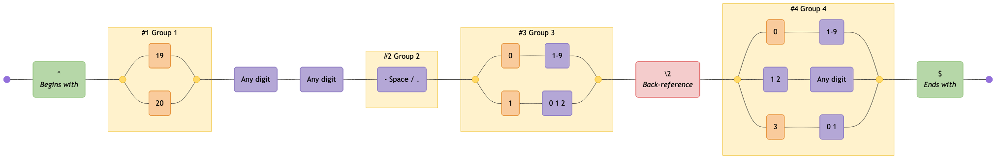
</details>

```mermaid
%% Regex: ^(19|20)\d\d([- /.])(0[1-9]|1[012])\2(0[1-9]|[12][0-9]|3[01])$

graph LR
  %% Nodes
  start@{ shape: f-circ };
  fin@{ shape: f-circ };
  assertion_1("^<br><i><small>Begins with</small></i>"):::assertion;
  disjunction_begin_1:::disjunction@{ shape: f-circ };
  disjunction_end_1:::disjunction@{ shape: f-circ };
  literal_1("19"):::literal;
  literal_2("20"):::literal;
  literal_3("\d\d"):::literal;
  char_class_1("- Space / ."):::char-class;
  disjunction_begin_2:::disjunction@{ shape: f-circ };
  disjunction_end_2:::disjunction@{ shape: f-circ };
  literal_4("0"):::literal;
  char_class_2("1-9"):::char-class;
  literal_5("1"):::literal;
  char_class_3("0 1 2"):::char-class;
  back_reference_1("\2<br><i><small>Back-reference</small></i>"):::back-reference;
  disjunction_begin_3:::disjunction@{ shape: f-circ };
  disjunction_end_3:::disjunction@{ shape: f-circ };
  literal_6("0"):::literal;
  char_class_4("1-9"):::char-class;
  char_class_5("1 2"):::char-class;
  char_class_6("Any digit"):::char-class;
  literal_7("3"):::literal;
  char_class_7("0 1"):::char-class;
  assertion_2("$<br><i><small>Ends with</small></i>"):::assertion;

  %% Subgraphs
  subgraph standard_1 ["<small>#1</small> Group 1"]
    disjunction_begin_1
    disjunction_end_1
    literal_1
    literal_2
  end

  subgraph standard_2 ["<small>#2</small> Group 2"]
    char_class_1
  end

  subgraph standard_3 ["<small>#3</small> Group 3"]
    disjunction_begin_2
    disjunction_end_2
    literal_4
    char_class_2
    literal_5
    char_class_3
  end

  subgraph standard_4 ["<small>#4</small> Group 4"]
    disjunction_begin_3
    disjunction_end_3
    literal_6
    char_class_4
    char_class_5
    char_class_6
    literal_7
    char_class_7
  end

  %% Edges
  start --- assertion_1;
  assertion_1 --- disjunction_begin_1;
  disjunction_begin_1 --- literal_1;
  literal_1 --- disjunction_end_1;
  disjunction_begin_1 --- literal_2;
  literal_2 --- disjunction_end_1;
  disjunction_end_1 --- literal_3;
  literal_3 --- char_class_1;
  char_class_1 --- disjunction_begin_2;
  disjunction_begin_2 --- literal_4;
  literal_4 --- char_class_2;
  char_class_2 --- disjunction_end_2;
  disjunction_begin_2 --- literal_5;
  literal_5 --- char_class_3;
  char_class_3 --- disjunction_end_2;
  disjunction_end_2 --- back_reference_1;
  back_reference_1 --- disjunction_begin_3;
  disjunction_begin_3 --- literal_6;
  literal_6 --- char_class_4;
  char_class_4 --- disjunction_end_3;
  disjunction_begin_3 --- char_class_5;
  char_class_5 --- char_class_6;
  char_class_6 --- disjunction_end_3;
  disjunction_begin_3 --- literal_7;
  literal_7 --- char_class_7;
  char_class_7 --- disjunction_end_3;
  disjunction_end_3 --- assertion_2;
  assertion_2 --- fin;

  %% Styles
  %% Node Styling
  classDef assertion fill:#B6D7A8,stroke:#93C47D,color:#000000;
  classDef disjunction fill:#FFD966,stroke:#F1C232,color:#000000;
  classDef literal fill:#F9CB9C,stroke:#E69138,color:#000000;
  classDef char-class fill:#B4A7D6,stroke:#8E7CC3,color:#000000;
  classDef back-reference fill:#F4CCCC,stroke:#E06666,color:#000000;

  %% Group Styling
  classDef standard fill:#FFF2CC,stroke:#F1C232,color:#000000;

  %% Apply Group Classes
  class standard_1,standard_2,standard_3,standard_4 standard;

%% Generated with regex-to-mermaid@1.0.0
```

---

## DateTime (RFC3339)

Validates a RFC3339 DateTime format

### Pattern

```regex
/^((?:(\d{4}-\d{2}-\d{2})T(\d{2}:\d{2}:\d{2}(?:\.\d+)?))(Z|[\+-]\d{2}:\d{2})?)$/gm
```

### Diagram

<details>
<summary>Click to view as image</summary>
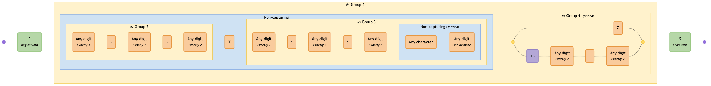
</details>

```mermaid
graph LR
  accTitle: "Regex: /^((?:(\\d{4}-\\d{2}-\\d{2})T(\\d{2}:\\d{2}:\\d{2}(?:\\.\\d+)?))(Z|[\\+-]\\d{2}:\\d{2})?)$/gm"
  accDescr: "Generated with regex-to-mermaid@1.0.3"

  %% Nodes
  start@{ shape: f-circ };
  fin@{ shape: f-circ };
  assertion_1("^<br><i><small>Begins with</small></i>"):::assertion;
  literal_1("Any digit<br><i><small>Exactly 4</small></i>"):::literal;
  literal_2("-"):::literal;
  literal_3("Any digit<br><i><small>Exactly 2</small></i>"):::literal;
  literal_4("-"):::literal;
  literal_5("Any digit<br><i><small>Exactly 2</small></i>"):::literal;
  literal_6("T"):::literal;
  literal_7("Any digit<br><i><small>Exactly 2</small></i>"):::literal;
  literal_8(":"):::literal;
  literal_9("Any digit<br><i><small>Exactly 2</small></i>"):::literal;
  literal_10(":"):::literal;
  literal_11("Any digit<br><i><small>Exactly 2</small></i>"):::literal;
  literal_12("Any character"):::literal;
  literal_13("Any digit<br><i><small>One or more</small></i>"):::literal;
  disjunction_begin_1:::disjunction@{ shape: f-circ };
  disjunction_end_1:::disjunction@{ shape: f-circ };
  literal_14("Z"):::literal;
  char_class_1("+ -"):::char-class;
  literal_15("Any digit<br><i><small>Exactly 2</small></i>"):::literal;
  literal_16(":"):::literal;
  literal_17("Any digit<br><i><small>Exactly 2</small></i>"):::literal;
  assertion_2("$<br><i><small>Ends with</small></i>"):::assertion;

  %% Subgraphs
  subgraph standard_2 ["<small>#2</small> Group 2"]
    literal_1
    literal_2
    literal_3
    literal_4
    literal_5
  end

  subgraph non_capturing_2 ["Non-capturing <small><i>Optional</i></small>"]
    literal_12
    literal_13
  end

  subgraph standard_3 ["<small>#3</small> Group 3"]
    non_capturing_2
    literal_7
    literal_8
    literal_9
    literal_10
    literal_11
  end

  subgraph non_capturing_1 ["Non-capturing"]
    standard_2
    non_capturing_2
    standard_3
    literal_6
  end

  subgraph standard_4 ["<small>#4</small> Group 4 <small><i>Optional</i></small>"]
    disjunction_begin_1
    disjunction_end_1
    literal_14
    char_class_1
    literal_15
    literal_16
    literal_17
  end

  subgraph standard_1 ["<small>#1</small> Group 1"]
    standard_2
    non_capturing_2
    standard_3
    non_capturing_1
    standard_4
  end

  %% Edges
  start --- assertion_1;
  assertion_1 --- literal_1;
  literal_1 --- literal_2;
  literal_2 --- literal_3;
  literal_3 --- literal_4;
  literal_4 --- literal_5;
  literal_5 --- literal_6;
  literal_6 --- literal_7;
  literal_7 --- literal_8;
  literal_8 --- literal_9;
  literal_9 --- literal_10;
  literal_10 --- literal_11;
  literal_11 --- literal_12;
  literal_12 --- literal_13;
  literal_13 --- disjunction_begin_1;
  disjunction_begin_1 --- literal_14;
  literal_14 --- disjunction_end_1;
  disjunction_begin_1 --- char_class_1;
  char_class_1 --- literal_15;
  literal_15 --- literal_16;
  literal_16 --- literal_17;
  literal_17 --- disjunction_end_1;
  disjunction_end_1 --- assertion_2;
  assertion_2 --- fin;

  %% Styles
  %% Node Styling
  classDef assertion fill:#B6D7A8,stroke:#93C47D,color:#000000;
  classDef literal fill:#F9CB9C,stroke:#E69138,color:#000000;
  classDef disjunction fill:#FFD966,stroke:#F1C232,color:#000000;
  classDef char-class fill:#B4A7D6,stroke:#8E7CC3,color:#000000;

  %% Group Styling
  classDef standard fill:#FFF2CC,stroke:#F1C232,color:#000000;
  classDef non-capturing fill:#CFE2F3,stroke:#6D9EEB,color:#000000;

  %% Apply Group Classes
  class standard_2,standard_3,standard_4,standard_1 standard;
  class non_capturing_2,non_capturing_1 non-capturing;
```

---

## Email Address

Standard email address

### Pattern

```regex
^([a-zA-Z0-9._%-]+@[a-zA-Z0-9.-]+\.[a-zA-Z]{2,6})*$
```

### Diagram

<details>
<summary>Click to view as image</summary>
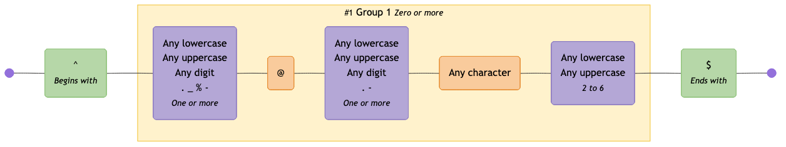
</details>

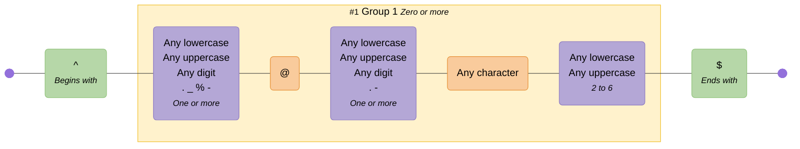

---

## Email (RFC2822)

Email address compliant with RFC2822

### Pattern

```regex
^([^\x00-\x20\x22\x28\x29\x2c\x2e\x3a-\x3c\x3e\x40\x5b-\x5d\x7f-\xff]+|\x22([^\x0d\x22\x5c\x80-\xff]|\x5c[\x00-\x7f])*\x22)(\x2e([^\x00-\x20\x22\x28\x29\x2c\x2e\x3a-\x3c\x3e\x40\x5b-\x5d\x7f-\xff]+|\x22([^\x0d\x22\x5c\x80-\xff]|\x5c[\x00-\x7f])*\x22))*\x40([^\x00-\x20\x22\x28\x29\x2c\x2e\x3a-\x3c\x3e\x40\x5b-\x5d\x7f-\xff]+|\x5b([^\x0d\x5b-\x5d\x80-\xff]|\x5c[\x00-\x7f])*\x5d)(\x2e([^\x00-\x20\x22\x28\x29\x2c\x2e\x3a-\x3c\x3e\x40\x5b-\x5d\x7f-\xff]+|\x5b([^\x0d\x5b-\x5d\x80-\xff]|\x5c[\x00-\x7f])*\x5d))*$
```

### Diagram

<details>
<summary>Click to view as image</summary>
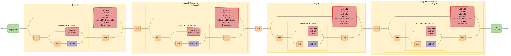
</details>

```mermaid
graph LR
  accTitle: "Regex: ^([^\\x00-\\x20\\x22\\x28\\x29\\x2c\\x2e\\x3a-\\x3c\\x3e\\x40\\x5b-\\x5d\\x7f-\\xff]+|\\x22([^\\x0d\\x22\\x5c\\x80-\\xff]|\\x5c[\\x00-\\x7f])*\\x22)(\\x2e([^\\x00-\\x20\\x22\\x28\\x29\\x2c\\x2e\\x3a-\\x3c\\x3e\\x40\\x5b-\\x5d\\x7f-\\xff]+|\\x22([^\\x0d\\x22\\x5c\\x80-\\xff]|\\x5c[\\x00-\\x7f])*\\x22))*\\x40([^\\x00-\\x20\\x22\\x28\\x29\\x2c\\x2e\\x3a-\\x3c\\x3e\\x40\\x5b-\\x5d\\x7f-\\xff]+|\\x5b([^\\x0d\\x5b-\\x5d\\x80-\\xff]|\\x5c[\\x00-\\x7f])*\\x5d)(\\x2e([^\\x00-\\x20\\x22\\x28\\x29\\x2c\\x2e\\x3a-\\x3c\\x3e\\x40\\x5b-\\x5d\\x7f-\\xff]+|\\x5b([^\\x0d\\x5b-\\x5d\\x80-\\xff]|\\x5c[\\x00-\\x7f])*\\x5d))*$"
  accDescr: "Generated with regex-to-mermaid@1.0.3"

  %% Nodes
  start@{ shape: f-circ };
  fin@{ shape: f-circ };
  assertion_1("^<br><i><small>Begins with</small></i>"):::assertion;
  disjunction_begin_1:::disjunction@{ shape: f-circ };
  disjunction_end_1:::disjunction@{ shape: f-circ };
  negated_char_class_1("\x00-\x20<br>\x3a-\x3c<br>\x5b-\x5d<br>\x7f-\xff<br>\x22 \x28 \x29 \x2c \x2e \x3e \x40<br><i><small>One or more</small></i>"):::negated-char-class;
  literal_1("\x22"):::literal;
  disjunction_begin_2:::disjunction@{ shape: f-circ };
  disjunction_end_2:::disjunction@{ shape: f-circ };
  negated_char_class_2("\x80-\xff<br>\x0d \x22 \x5c"):::negated-char-class;
  literal_2("\x5c"):::literal;
  char_class_1("\x00-\x7f"):::char-class;
  literal_3("\x22"):::literal;
  literal_4("\x2e"):::literal;
  disjunction_begin_3:::disjunction@{ shape: f-circ };
  disjunction_end_3:::disjunction@{ shape: f-circ };
  negated_char_class_3("\x00-\x20<br>\x3a-\x3c<br>\x5b-\x5d<br>\x7f-\xff<br>\x22 \x28 \x29 \x2c \x2e \x3e \x40<br><i><small>One or more</small></i>"):::negated-char-class;
  literal_5("\x22"):::literal;
  disjunction_begin_4:::disjunction@{ shape: f-circ };
  disjunction_end_4:::disjunction@{ shape: f-circ };
  negated_char_class_4("\x80-\xff<br>\x0d \x22 \x5c"):::negated-char-class;
  literal_6("\x5c"):::literal;
  char_class_2("\x00-\x7f"):::char-class;
  literal_7("\x22"):::literal;
  literal_8("\x40"):::literal;
  disjunction_begin_5:::disjunction@{ shape: f-circ };
  disjunction_end_5:::disjunction@{ shape: f-circ };
  negated_char_class_5("\x00-\x20<br>\x3a-\x3c<br>\x5b-\x5d<br>\x7f-\xff<br>\x22 \x28 \x29 \x2c \x2e \x3e \x40<br><i><small>One or more</small></i>"):::negated-char-class;
  literal_9("\x5b"):::literal;
  disjunction_begin_6:::disjunction@{ shape: f-circ };
  disjunction_end_6:::disjunction@{ shape: f-circ };
  negated_char_class_6("\x5b-\x5d<br>\x80-\xff<br>\x0d"):::negated-char-class;
  literal_10("\x5c"):::literal;
  char_class_3("\x00-\x7f"):::char-class;
  literal_11("\x5d"):::literal;
  literal_12("\x2e"):::literal;
  disjunction_begin_7:::disjunction@{ shape: f-circ };
  disjunction_end_7:::disjunction@{ shape: f-circ };
  negated_char_class_7("\x00-\x20<br>\x3a-\x3c<br>\x5b-\x5d<br>\x7f-\xff<br>\x22 \x28 \x29 \x2c \x2e \x3e \x40<br><i><small>One or more</small></i>"):::negated-char-class;
  literal_13("\x5b"):::literal;
  disjunction_begin_8:::disjunction@{ shape: f-circ };
  disjunction_end_8:::disjunction@{ shape: f-circ };
  negated_char_class_8("\x5b-\x5d<br>\x80-\xff<br>\x0d"):::negated-char-class;
  literal_14("\x5c"):::literal;
  char_class_4("\x00-\x7f"):::char-class;
  literal_15("\x5d"):::literal;
  assertion_2("$<br><i><small>Ends with</small></i>"):::assertion;

  %% Subgraphs
  subgraph standard_2 ["<small>#2</small> Group 2 <small><i>Zero or more</i></small>"]
    disjunction_begin_2
    disjunction_end_2
    negated_char_class_2
    literal_2
    char_class_1
  end

  subgraph standard_1 ["<small>#1</small> Group 1"]
    standard_2
    disjunction_begin_1
    disjunction_end_1
    negated_char_class_1
    literal_1
    literal_3
  end

  subgraph standard_5 ["<small>#5</small> Group 5 <small><i>Zero or more</i></small>"]
    disjunction_begin_4
    disjunction_end_4
    negated_char_class_4
    literal_6
    char_class_2
  end

  subgraph standard_4 ["<small>#4</small> Group 4"]
    standard_5
    disjunction_begin_3
    disjunction_end_3
    negated_char_class_3
    literal_5
    literal_7
  end

  subgraph standard_3 ["<small>#3</small> Group 3 <small><i>Zero or more</i></small>"]
    standard_5
    standard_4
    literal_4
  end

  subgraph standard_7 ["<small>#7</small> Group 7 <small><i>Zero or more</i></small>"]
    disjunction_begin_6
    disjunction_end_6
    negated_char_class_6
    literal_10
    char_class_3
  end

  subgraph standard_6 ["<small>#6</small> Group 6"]
    standard_7
    disjunction_begin_5
    disjunction_end_5
    negated_char_class_5
    literal_9
    literal_11
  end

  subgraph standard_10 ["<small>#10</small> Group 10 <small><i>Zero or more</i></small>"]
    disjunction_begin_8
    disjunction_end_8
    negated_char_class_8
    literal_14
    char_class_4
  end

  subgraph standard_9 ["<small>#9</small> Group 9"]
    standard_10
    disjunction_begin_7
    disjunction_end_7
    negated_char_class_7
    literal_13
    literal_15
  end

  subgraph standard_8 ["<small>#8</small> Group 8 <small><i>Zero or more</i></small>"]
    standard_10
    standard_9
    literal_12
  end

  %% Edges
  start --- assertion_1;
  assertion_1 --- disjunction_begin_1;
  disjunction_begin_1 --- negated_char_class_1;
  negated_char_class_1 --- disjunction_end_1;
  disjunction_begin_1 --- literal_1;
  literal_1 --- disjunction_begin_2;
  disjunction_begin_2 --- negated_char_class_2;
  negated_char_class_2 --- disjunction_end_2;
  disjunction_begin_2 --- literal_2;
  literal_2 --- char_class_1;
  char_class_1 --- disjunction_end_2;
  disjunction_end_2 --- literal_3;
  literal_3 --- disjunction_end_1;
  disjunction_end_1 --- literal_4;
  literal_4 --- disjunction_begin_3;
  disjunction_begin_3 --- negated_char_class_3;
  negated_char_class_3 --- disjunction_end_3;
  disjunction_begin_3 --- literal_5;
  literal_5 --- disjunction_begin_4;
  disjunction_begin_4 --- negated_char_class_4;
  negated_char_class_4 --- disjunction_end_4;
  disjunction_begin_4 --- literal_6;
  literal_6 --- char_class_2;
  char_class_2 --- disjunction_end_4;
  disjunction_end_4 --- literal_7;
  literal_7 --- disjunction_end_3;
  disjunction_end_3 --- literal_8;
  literal_8 --- disjunction_begin_5;
  disjunction_begin_5 --- negated_char_class_5;
  negated_char_class_5 --- disjunction_end_5;
  disjunction_begin_5 --- literal_9;
  literal_9 --- disjunction_begin_6;
  disjunction_begin_6 --- negated_char_class_6;
  negated_char_class_6 --- disjunction_end_6;
  disjunction_begin_6 --- literal_10;
  literal_10 --- char_class_3;
  char_class_3 --- disjunction_end_6;
  disjunction_end_6 --- literal_11;
  literal_11 --- disjunction_end_5;
  disjunction_end_5 --- literal_12;
  literal_12 --- disjunction_begin_7;
  disjunction_begin_7 --- negated_char_class_7;
  negated_char_class_7 --- disjunction_end_7;
  disjunction_begin_7 --- literal_13;
  literal_13 --- disjunction_begin_8;
  disjunction_begin_8 --- negated_char_class_8;
  negated_char_class_8 --- disjunction_end_8;
  disjunction_begin_8 --- literal_14;
  literal_14 --- char_class_4;
  char_class_4 --- disjunction_end_8;
  disjunction_end_8 --- literal_15;
  literal_15 --- disjunction_end_7;
  disjunction_end_7 --- assertion_2;
  assertion_2 --- fin;

  %% Styles
  %% Node Styling
  classDef assertion fill:#B6D7A8,stroke:#93C47D,color:#000000;
  classDef disjunction fill:#FFD966,stroke:#F1C232,color:#000000;
  classDef negated-char-class fill:#EA9999,stroke:#CC0000,color:#000000;
  classDef literal fill:#F9CB9C,stroke:#E69138,color:#000000;
  classDef char-class fill:#B4A7D6,stroke:#8E7CC3,color:#000000;

  %% Group Styling
  classDef standard fill:#FFF2CC,stroke:#F1C232,color:#000000;

  %% Apply Group Classes
  class standard_2,standard_1,standard_5,standard_4,standard_3,standard_7,standard_6,standard_10,standard_9,standard_8 standard;
```

---

## HTML Tags

Naive html tags

### Pattern

```regex
<\/?[\w\s]*>|<.+[\W]>
```

### Diagram

<details>
<summary>Click to view as image</summary>
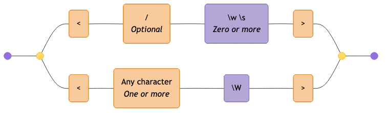
</details>

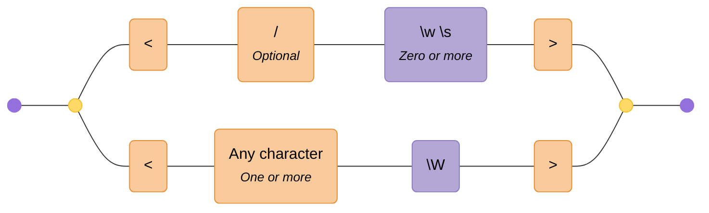

---

## Complex Password Requirements

Should have 1 lowercase letter, 1 uppercase letter, 1 number, 1 special character and be at least 8 characters long

### Pattern

```regex
(?=(.*[0-9]))(?=.*[\!@#$%^&*()\\[\]{}\-_+=~`|:;"'<>,./?])(?=.*[a-z])(?=(.*[A-Z]))(?=(.*)).{8,}
```

### Diagram

<details>
<summary>Click to view as image</summary>
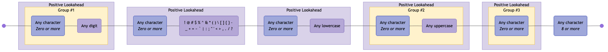
</details>

```mermaid
%% Regex: /(?=(.*[0-9]))(?=.*[\!@#$%^&*()\\[\]{}\-_+=~`|:;"'<>,./?])(?=.*[a-z])(?=(.*[A-Z]))(?=(.*)).{8,}/

graph LR
  %% Nodes
  start@{ shape: f-circ };
  fin@{ shape: f-circ };
  literal_1("Any character<br><i><small>Zero or more</small></i>"):::literal;
  char_class_1("Any digit"):::char-class;
  literal_2("Any character<br><i><small>Zero or more</small></i>"):::literal;
  char_class_2("! @ # $ % ^ & * ( ) \ [ ] { } - _ + = ~ ` | : ; #quot; ' < > , . / ?"):::char-class;
  literal_3("Any character<br><i><small>Zero or more</small></i>"):::literal;
  char_class_3("Any lowercase"):::char-class;
  literal_4("Any character<br><i><small>Zero or more</small></i>"):::literal;
  char_class_4("Any uppercase"):::char-class;
  literal_5("Any character<br><i><small>Zero or more</small></i>"):::literal;
  literal_6("Any character<br><i><small>8 or more</small></i>"):::literal;

  %% Subgraphs
  subgraph standard_1 ["<small>#1</small> Group 1"]
    literal_1
    char_class_1
  end

  subgraph positive_lookahead_1 ["Positive Lookahead"]
    standard_1
  end

  subgraph positive_lookahead_2 ["Positive Lookahead"]
    literal_2
    char_class_2
  end

  subgraph positive_lookahead_3 ["Positive Lookahead"]
    literal_3
    char_class_3
  end

  subgraph standard_2 ["<small>#2</small> Group 2"]
    literal_4
    char_class_4
  end

  subgraph positive_lookahead_4 ["Positive Lookahead"]
    standard_2
  end

  subgraph standard_3 ["<small>#3</small> Group 3"]
    literal_5
  end

  subgraph positive_lookahead_5 ["Positive Lookahead"]
    standard_3
  end

  %% Edges
  start --- literal_1;
  literal_1 --- char_class_1;
  char_class_1 --- literal_2;
  literal_2 --- char_class_2;
  char_class_2 --- literal_3;
  literal_3 --- char_class_3;
  char_class_3 --- literal_4;
  literal_4 --- char_class_4;
  char_class_4 --- literal_5;
  literal_5 --- literal_6;
  literal_6 --- fin;

  %% Styles
  %% Node Styling
  classDef literal fill:#F9CB9C,stroke:#E69138,color:#000000;
  classDef char-class fill:#B4A7D6,stroke:#8E7CC3,color:#000000;

  %% Group Styling
  classDef standard fill:#FFF2CC,stroke:#F1C232,color:#000000;
  classDef positive-lookahead fill:#D9D2E9,stroke:#8E7CC3,color:#000000;

  %% Apply Group Classes
  class standard_1,standard_2,standard_3 standard;
  class positive_lookahead_1,positive_lookahead_2,positive_lookahead_3,positive_lookahead_4,positive_lookahead_5 positive-lookahead;

%% Generated with regex-to-mermaid@1.0.0
```

---

## Phone Number

US and International phone numbers

### Pattern

```regex
^(\+\d{1,2}\s)?\(?\d{3}\)?[\s.-]\d{3}[\s.-]\d{4}$
```

### Diagram

<details>
<summary>Click to view as image</summary>
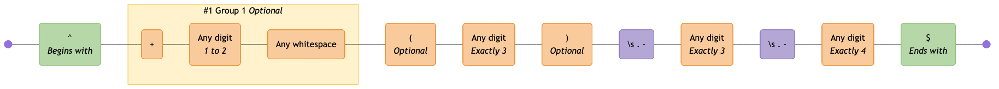
</details>

```mermaid
%% Regex: ^(\+\d{1,2}\s)?\(?\d{3}\)?[\s.-]\d{3}[\s.-]\d{4}$

graph LR
  %% Nodes
  start@{ shape: f-circ };
  fin@{ shape: f-circ };
  assertion_1("^<br><i><small>Begins with</small></i>"):::assertion;
  literal_1("+"):::literal;
  literal_2("Any digit<br><i><small>1 to 2</small></i>"):::literal;
  literal_3("Any whitespace"):::literal;
  literal_4("(<br><i><small>Optional</small></i>"):::literal;
  literal_5("Any digit<br><i><small>Exactly 3</small></i>"):::literal;
  literal_6(")<br><i><small>Optional</small></i>"):::literal;
  char_class_1("\s . -"):::char-class;
  literal_7("Any digit<br><i><small>Exactly 3</small></i>"):::literal;
  char_class_2("\s . -"):::char-class;
  literal_8("Any digit<br><i><small>Exactly 4</small></i>"):::literal;
  assertion_2("$<br><i><small>Ends with</small></i>"):::assertion;

  %% Subgraphs
  subgraph standard_1 ["<small>#1</small> Group 1 <small><i>Optional</i></small>"]
    literal_1
    literal_2
    literal_3
  end

  %% Edges
  start --- assertion_1;
  assertion_1 --- literal_1;
  literal_1 --- literal_2;
  literal_2 --- literal_3;
  literal_3 --- literal_4;
  literal_4 --- literal_5;
  literal_5 --- literal_6;
  literal_6 --- char_class_1;
  char_class_1 --- literal_7;
  literal_7 --- char_class_2;
  char_class_2 --- literal_8;
  literal_8 --- assertion_2;
  assertion_2 --- fin;

  %% Styles
  %% Node Styling
  classDef assertion fill:#B6D7A8,stroke:#93C47D,color:#000000;
  classDef literal fill:#F9CB9C,stroke:#E69138,color:#000000;
  classDef char-class fill:#B4A7D6,stroke:#8E7CC3,color:#000000;

  %% Group Styling
  classDef standard fill:#FFF2CC,stroke:#F1C232,color:#000000;

  %% Apply Group Classes
  class standard_1 standard;

%% Generated with regex-to-mermaid@1.0.0
```

---

## Semver

Semantic versioning v2.0.0

### Pattern

```regex
^(?<major>0|[1-9]\d*)\.(?<minor>0|[1-9]\d*)\.(?<patch>0|[1-9]\d*)(?:-(?<prerelease>(?:0|[1-9]\d*|\d*[a-zA-Z-][0-9a-zA-Z-]*)(?:\.(?:0|[1-9]\d*|\d*[a-zA-Z-][0-9a-zA-Z-]*))*))?(?:\+(?<buildmetadata>[0-9a-zA-Z-]+(?:\.[0-9a-zA-Z-]+)*))?$
```

### Diagram

<details>
<summary>Click to view as image</summary>
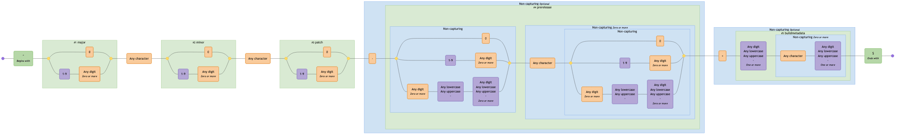
</details>

```mermaid
%% Regex: ^(?<major>0|[1-9]\d*)\.(?<minor>0|[1-9]\d*)\.(?<patch>0|[1-9]\d*)(?:-(?<prerelease>(?:0|[1-9]\d*|\d*[a-zA-Z-][0-9a-zA-Z-]*)(?:\.(?:0|[1-9]\d*|\d*[a-zA-Z-][0-9a-zA-Z-]*))*))?(?:\+(?<buildmetadata>[0-9a-zA-Z-]+(?:\.[0-9a-zA-Z-]+)*))?$

graph LR
  %% Nodes
  start@{ shape: f-circ };
  fin@{ shape: f-circ };
  assertion_1("^<br><i><small>Begins with</small></i>"):::assertion;
  disjunction_begin_1:::disjunction@{ shape: f-circ };
  disjunction_end_1:::disjunction@{ shape: f-circ };
  literal_1("0"):::literal;
  char_class_1("1-9"):::char-class;
  literal_2("Any digit<br><i><small>Zero or more</small></i>"):::literal;
  literal_3("Any character"):::literal;
  disjunction_begin_2:::disjunction@{ shape: f-circ };
  disjunction_end_2:::disjunction@{ shape: f-circ };
  literal_4("0"):::literal;
  char_class_2("1-9"):::char-class;
  literal_5("Any digit<br><i><small>Zero or more</small></i>"):::literal;
  literal_6("Any character"):::literal;
  disjunction_begin_3:::disjunction@{ shape: f-circ };
  disjunction_end_3:::disjunction@{ shape: f-circ };
  literal_7("0"):::literal;
  char_class_3("1-9"):::char-class;
  literal_8("Any digit<br><i><small>Zero or more</small></i>"):::literal;
  literal_9("-"):::literal;
  disjunction_begin_4:::disjunction@{ shape: f-circ };
  disjunction_end_4:::disjunction@{ shape: f-circ };
  literal_10("0"):::literal;
  char_class_4("1-9"):::char-class;
  literal_11("Any digit<br><i><small>Zero or more</small></i>"):::literal;
  literal_12("Any digit<br><i><small>Zero or more</small></i>"):::literal;
  char_class_5("Any lowercase<br>Any uppercase<br>-"):::char-class;
  char_class_6("Any digit<br>Any lowercase<br>Any uppercase<br>-<br><i><small>Zero or more</small></i>"):::char-class;
  literal_13("Any character"):::literal;
  disjunction_begin_5:::disjunction@{ shape: f-circ };
  disjunction_end_5:::disjunction@{ shape: f-circ };
  literal_14("0"):::literal;
  char_class_7("1-9"):::char-class;
  literal_15("Any digit<br><i><small>Zero or more</small></i>"):::literal;
  literal_16("Any digit<br><i><small>Zero or more</small></i>"):::literal;
  char_class_8("Any lowercase<br>Any uppercase<br>-"):::char-class;
  char_class_9("Any digit<br>Any lowercase<br>Any uppercase<br>-<br><i><small>Zero or more</small></i>"):::char-class;
  literal_17("+"):::literal;
  char_class_10("Any digit<br>Any lowercase<br>Any uppercase<br>-<br><i><small>One or more</small></i>"):::char-class;
  literal_18("Any character"):::literal;
  char_class_11("Any digit<br>Any lowercase<br>Any uppercase<br>-<br><i><small>One or more</small></i>"):::char-class;
  assertion_2("$<br><i><small>Ends with</small></i>"):::assertion;

  %% Subgraphs
  subgraph named_capture_1 ["<small>#1</small> major"]
    disjunction_begin_1
    disjunction_end_1
    literal_1
    char_class_1
    literal_2
  end

  subgraph named_capture_2 ["<small>#2</small> minor"]
    disjunction_begin_2
    disjunction_end_2
    literal_4
    char_class_2
    literal_5
  end

  subgraph named_capture_3 ["<small>#3</small> patch"]
    disjunction_begin_3
    disjunction_end_3
    literal_7
    char_class_3
    literal_8
  end

  subgraph non_capturing_2 ["Non-capturing"]
    disjunction_begin_4
    disjunction_end_4
    literal_10
    char_class_4
    literal_11
    literal_12
    char_class_5
    char_class_6
  end

  subgraph non_capturing_4 ["Non-capturing"]
    disjunction_begin_5
    disjunction_end_5
    literal_14
    char_class_7
    literal_15
    literal_16
    char_class_8
    char_class_9
  end

  subgraph non_capturing_3 ["Non-capturing <small><i>Zero or more</i></small>"]
    non_capturing_4
    literal_13
  end

  subgraph named_capture_4 ["<small>#4</small> prerelease"]
    non_capturing_2
    non_capturing_4
    non_capturing_3
  end

  subgraph non_capturing_1 ["Non-capturing <small><i>Optional</i></small>"]
    non_capturing_2
    non_capturing_4
    non_capturing_3
    named_capture_4
    literal_9
  end

  subgraph non_capturing_6 ["Non-capturing <small><i>Zero or more</i></small>"]
    literal_18
    char_class_11
  end

  subgraph named_capture_5 ["<small>#5</small> buildmetadata"]
    non_capturing_6
    char_class_10
  end

  subgraph non_capturing_5 ["Non-capturing <small><i>Optional</i></small>"]
    non_capturing_6
    named_capture_5
    literal_17
  end

  %% Edges
  start --- assertion_1;
  assertion_1 --- disjunction_begin_1;
  disjunction_begin_1 --- literal_1;
  literal_1 --- disjunction_end_1;
  disjunction_begin_1 --- char_class_1;
  char_class_1 --- literal_2;
  literal_2 --- disjunction_end_1;
  disjunction_end_1 --- literal_3;
  literal_3 --- disjunction_begin_2;
  disjunction_begin_2 --- literal_4;
  literal_4 --- disjunction_end_2;
  disjunction_begin_2 --- char_class_2;
  char_class_2 --- literal_5;
  literal_5 --- disjunction_end_2;
  disjunction_end_2 --- literal_6;
  literal_6 --- disjunction_begin_3;
  disjunction_begin_3 --- literal_7;
  literal_7 --- disjunction_end_3;
  disjunction_begin_3 --- char_class_3;
  char_class_3 --- literal_8;
  literal_8 --- disjunction_end_3;
  disjunction_end_3 --- literal_9;
  literal_9 --- disjunction_begin_4;
  disjunction_begin_4 --- literal_10;
  literal_10 --- disjunction_end_4;
  disjunction_begin_4 --- char_class_4;
  char_class_4 --- literal_11;
  literal_11 --- disjunction_end_4;
  disjunction_begin_4 --- literal_12;
  literal_12 --- char_class_5;
  char_class_5 --- char_class_6;
  char_class_6 --- disjunction_end_4;
  disjunction_end_4 --- literal_13;
  literal_13 --- disjunction_begin_5;
  disjunction_begin_5 --- literal_14;
  literal_14 --- disjunction_end_5;
  disjunction_begin_5 --- char_class_7;
  char_class_7 --- literal_15;
  literal_15 --- disjunction_end_5;
  disjunction_begin_5 --- literal_16;
  literal_16 --- char_class_8;
  char_class_8 --- char_class_9;
  char_class_9 --- disjunction_end_5;
  disjunction_end_5 --- literal_17;
  literal_17 --- char_class_10;
  char_class_10 --- literal_18;
  literal_18 --- char_class_11;
  char_class_11 --- assertion_2;
  assertion_2 --- fin;

  %% Styles
  %% Node Styling
  classDef assertion fill:#B6D7A8,stroke:#93C47D,color:#000000;
  classDef disjunction fill:#FFD966,stroke:#F1C232,color:#000000;
  classDef literal fill:#F9CB9C,stroke:#E69138,color:#000000;
  classDef char-class fill:#B4A7D6,stroke:#8E7CC3,color:#000000;

  %% Group Styling
  classDef named-capture fill:#D9EAD3,stroke:#93C47D,color:#000000;
  classDef non-capturing fill:#CFE2F3,stroke:#6D9EEB,color:#000000;

  %% Apply Group Classes
  class named_capture_1,named_capture_2,named_capture_3,named_capture_4,named_capture_5 named-capture;
  class non_capturing_2,non_capturing_4,non_capturing_3,non_capturing_1,non_capturing_6,non_capturing_5 non-capturing;

%% Generated with regex-to-mermaid@1.0.0
```

---

## Stocks

undefined

### Pattern

```regex
/(\W|^)stock\s{0,3}tip(s){0,1}(\W|$)/gim
```

### Diagram

<details>
<summary>Click to view as image</summary>
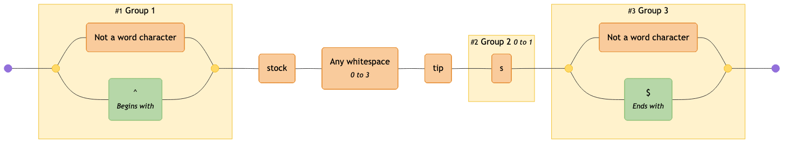
</details>

```mermaid
%% Regex: /(\W|^)stock\s{0,3}tip(s){0,1}(\W|$)/gim

graph LR
  %% Nodes
  start@{ shape: f-circ };
  fin@{ shape: f-circ };
  disjunction_begin_1:::disjunction@{ shape: f-circ };
  disjunction_end_1:::disjunction@{ shape: f-circ };
  literal_1("Not a word character"):::literal;
  assertion_1("^<br><i><small>Begins with</small></i>"):::assertion;
  literal_2("stock"):::literal;
  literal_3("Any whitespace<br><i><small>0 to 3</small></i>"):::literal;
  literal_4("tip"):::literal;
  literal_5("s"):::literal;
  disjunction_begin_2:::disjunction@{ shape: f-circ };
  disjunction_end_2:::disjunction@{ shape: f-circ };
  literal_6("Not a word character"):::literal;
  assertion_2("$<br><i><small>Ends with</small></i>"):::assertion;

  %% Subgraphs
  subgraph standard_1 ["<small>#1</small> Group 1"]
    disjunction_begin_1
    disjunction_end_1
    literal_1
    assertion_1
  end

  subgraph standard_2 ["<small>#2</small> Group 2 <small><i>0 to 1</i></small>"]
    literal_5
  end

  subgraph standard_3 ["<small>#3</small> Group 3"]
    disjunction_begin_2
    disjunction_end_2
    literal_6
    assertion_2
  end

  %% Edges
  start --- disjunction_begin_1;
  disjunction_begin_1 --- literal_1;
  literal_1 --- disjunction_end_1;
  disjunction_begin_1 --- assertion_1;
  assertion_1 --- disjunction_end_1;
  disjunction_end_1 --- literal_2;
  literal_2 --- literal_3;
  literal_3 --- literal_4;
  literal_4 --- literal_5;
  literal_5 --- disjunction_begin_2;
  disjunction_begin_2 --- literal_6;
  literal_6 --- disjunction_end_2;
  disjunction_begin_2 --- assertion_2;
  assertion_2 --- disjunction_end_2;
  disjunction_end_2 --- fin;

  %% Styles
  %% Node Styling
  classDef disjunction fill:#FFD966,stroke:#F1C232,color:#000000;
  classDef literal fill:#F9CB9C,stroke:#E69138,color:#000000;
  classDef assertion fill:#B6D7A8,stroke:#93C47D,color:#000000;

  %% Group Styling
  classDef standard fill:#FFF2CC,stroke:#F1C232,color:#000000;

  %% Apply Group Classes
  class standard_1,standard_2,standard_3 standard;

%% Generated with regex-to-mermaid@1.0.0
```

---

## URL (RFC3987)

Absolute IRIs (internationalized)

### Pattern

```regex
/^(?:(?:(?:https?|ftp):)?\/\/)(?:\S+(?::\S*)?@)?(?:(?!(?:10|127)(?:\.\d{1,3}){3})(?!(?:169\.254|192\.168)(?:\.\d{1,3}){2})(?!172\.(?:1[6-9]|2\d|3[0-1])(?:\.\d{1,3}){2})(?:[1-9]\d?|1\d\d|2[01]\d|22[0-3])(?:\.(?:1?\d{1,2}|2[0-4]\d|25[0-5])){2}(?:\.(?:[1-9]\d?|1\d\d|2[0-4]\d|25[0-4]))|(?:(?:[a-z0-9\u00a1-\uffff][a-z0-9\u00a1-\uffff_-]{0,62})?[a-z0-9\u00a1-\uffff]\.)+(?:[a-z\u00a1-\uffff]{2,}\.?))(?::\d{2,5})?(?:[/?#]\S*)?$/i
```

### Diagram

<details>
<summary>Click to view as image</summary>
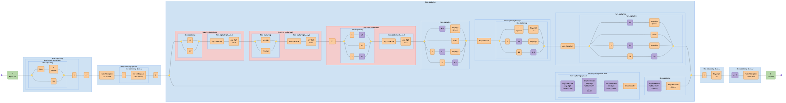
</details>


---

## URL

A simplified URL

### Pattern

```regex
^(?<protocol>https?:\/\/)?(?<domain>[a-zA-Z0-9.-]+\.[a-zA-Z]{2,})(?<path>\/.*)?$
```

### Diagram

<details>
<summary>Click to view as image</summary>
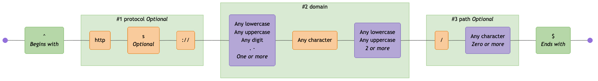
</details>

```mermaid
%% Regex: /^(?<protocol>https?:\/\/)?(?<domain>[a-zA-Z0-9.-]+\.[a-zA-Z]{2,})(?<path>\/.*)?$/

graph LR
  %% Nodes
  start@{ shape: f-circ };
  fin@{ shape: f-circ };
  assertion_1("^<br><i><small>Begins with</small></i>"):::assertion;
  literal_1("http"):::literal;
  literal_2("s<br><i><small>Optional</small></i>"):::literal;
  literal_3("://"):::literal;
  char_class_1("Any lowercase<br>Any uppercase<br>Any digit<br>. -<br><i><small>One or more</small></i>"):::char-class;
  literal_4("Any character"):::literal;
  char_class_2("Any lowercase<br>Any uppercase<br><i><small>2 or more</small></i>"):::char-class;
  literal_5("/"):::literal;
  literal_6("Any character<br><i><small>Zero or more</small></i>"):::literal;
  assertion_2("$<br><i><small>Ends with</small></i>"):::assertion;

  %% Subgraphs
  subgraph named_capture_1 ["<small>#1</small> protocol <small><i>Optional</i></small>"]
    literal_1
    literal_2
    literal_3
  end

  subgraph named_capture_2 ["<small>#2</small> domain"]
    char_class_1
    literal_4
    char_class_2
  end

  subgraph named_capture_3 ["<small>#3</small> path <small><i>Optional</i></small>"]
    literal_5
    literal_6
  end

  %% Edges
  start --- assertion_1;
  assertion_1 --- literal_1;
  literal_1 --- literal_2;
  literal_2 --- literal_3;
  literal_3 --- char_class_1;
  char_class_1 --- literal_4;
  literal_4 --- char_class_2;
  char_class_2 --- literal_5;
  literal_5 --- literal_6;
  literal_6 --- assertion_2;
  assertion_2 --- fin;

  %% Styles
  %% Node Styling
  classDef assertion fill:#B6D7A8,stroke:#93C47D,color:#000000;
  classDef literal fill:#F9CB9C,stroke:#E69138,color:#000000;
  classDef char-class fill:#B4A7D6,stroke:#8E7CC3,color:#000000;

  %% Group Styling
  classDef named-capture fill:#D9EAD3,stroke:#93C47D,color:#000000;

  %% Apply Group Classes
  class named_capture_1,named_capture_2,named_capture_3 named-capture;

%% Generated with regex-to-mermaid@1.0.0
```

---

## UUID

Universal Unique Identifier

### Pattern

```regex
[0-9a-fA-F]{8}-[0-9a-fA-F]{4}-[0-9a-fA-F]{4}-[0-9a-fA-F]{4}-[0-9a-fA-F]{12}
```

### Diagram

<details>
<summary>Click to view as image</summary>
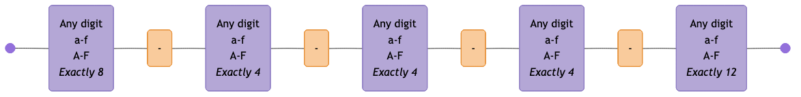
</details>

```mermaid
graph LR
  accTitle: "Regex: [0-9a-fA-F]{8}-[0-9a-fA-F]{4}-[0-9a-fA-F]{4}-[0-9a-fA-F]{4}-[0-9a-fA-F]{12}"
  accDescr: "Generated with regex-to-mermaid@1.0.3"

  %% Nodes
  start@{ shape: f-circ };
  fin@{ shape: f-circ };
  char_class_1("Any digit<br>a-f<br>A-F<br><i><small>Exactly 8</small></i>"):::char-class;
  literal_1("-"):::literal;
  char_class_2("Any digit<br>a-f<br>A-F<br><i><small>Exactly 4</small></i>"):::char-class;
  literal_2("-"):::literal;
  char_class_3("Any digit<br>a-f<br>A-F<br><i><small>Exactly 4</small></i>"):::char-class;
  literal_3("-"):::literal;
  char_class_4("Any digit<br>a-f<br>A-F<br><i><small>Exactly 4</small></i>"):::char-class;
  literal_4("-"):::literal;
  char_class_5("Any digit<br>a-f<br>A-F<br><i><small>Exactly 12</small></i>"):::char-class;

  %% Edges
  start --- char_class_1;
  char_class_1 --- literal_1;
  literal_1 --- char_class_2;
  char_class_2 --- literal_2;
  literal_2 --- char_class_3;
  char_class_3 --- literal_3;
  literal_3 --- char_class_4;
  char_class_4 --- literal_4;
  literal_4 --- char_class_5;
  char_class_5 --- fin;

  %% Styles
  %% Node Styling
  classDef char-class fill:#B4A7D6,stroke:#8E7CC3,color:#000000;
  classDef literal fill:#F9CB9C,stroke:#E69138,color:#000000;
```

<!-- CONTENT:END -->
