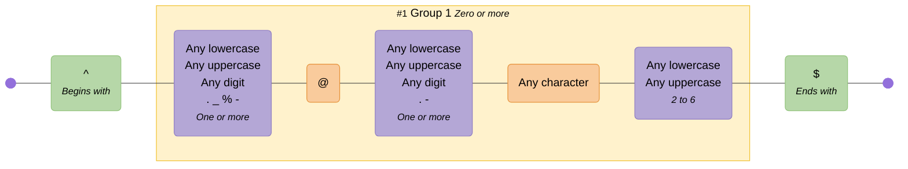
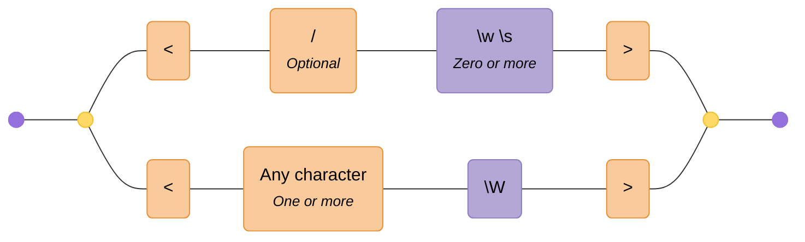

```mermaid
%% Regex: ^(?<named>[A-Z]\w{2,5}):\s+(?:https?:\/\/)?(?<domain>[a-z0-9.-]+)(?=\.com)(?!\.org)(?<=example)(?<!test)[a-z]{1,3}\.com(?:\/\S+)?(?:\?[a-zA-Z0-9&=]+)?(?<digit>\d+)\k<digit>\1\b\B\d+\D+\w+\W+\s+\S+[^xyz]+\t\r\n|alt$

graph LR
  %% Nodes
  start@{ shape: f-circ };
  fin@{ shape: f-circ };
  disjunction_begin_1:::disjunction@{ shape: f-circ };
  disjunction_end_1:::disjunction@{ shape: f-circ };
  assertion_1("^<br><i><small>Begins with</small></i>"):::assertion;
  char_class_1("Any uppercase"):::char-class;
  literal_1("Any word character<br><i><small>2 to 5</small></i>"):::literal;
  literal_2(":"):::literal;
  literal_3("Any whitespace<br><i><small>One or more</small></i>"):::literal;
  literal_4("http"):::literal;
  literal_5("s<br><i><small>Optional</small></i>"):::literal;
  literal_6("://"):::literal;
  char_class_2("Any lowercase<br>Any digit<br>. -<br><i><small>One or more</small></i>"):::char-class;
  literal_7(".com"):::literal;
  literal_8(".org"):::literal;
  literal_9("example"):::literal;
  literal_10("test"):::literal;
  char_class_3("Any lowercase<br><i><small>1 to 3</small></i>"):::char-class;
  literal_11(".com"):::literal;
  literal_12("/"):::literal;
  literal_13("Not whitespace<br><i><small>One or more</small></i>"):::literal;
  literal_14("?"):::literal;
  char_class_4("Any lowercase<br>Any uppercase<br>Any digit<br>& =<br><i><small>One or more</small></i>"):::char-class;
  literal_15("Any digit<br><i><small>One or more</small></i>"):::literal;
  back_reference_1("\digit<br><i><small>Back-reference</small></i>"):::back-reference;
  back_reference_2("\1<br><i><small>Back-reference</small></i>"):::back-reference;
  assertion_2("\b<br><i><small>Word boundary</small></i>"):::assertion;
  assertion_3("\B<br><i><small>Non-word boundary</small></i>"):::assertion;
  literal_16("Any digit<br><i><small>One or more</small></i>"):::literal;
  literal_17("Not a digit<br><i><small>One or more</small></i>"):::literal;
  literal_18("Any word character<br><i><small>One or more</small></i>"):::literal;
  literal_19("Not a word character<br><i><small>One or more</small></i>"):::literal;
  literal_20("Any whitespace<br><i><small>One or more</small></i>"):::literal;
  literal_21("Not whitespace<br><i><small>One or more</small></i>"):::literal;
  negated_char_class_1("x y z<br><i><small>One or more</small></i>"):::negated-char-class;
  literal_22("\t\r\n"):::literal;
  literal_23("alt"):::literal;
  assertion_4("$<br><i><small>Ends with</small></i>"):::assertion;

  %% Subgraphs
  subgraph named_capture_1 ["<small>#1</small> named"]
    char_class_1
    literal_1
  end

  subgraph non_capturing_1 ["Non-capturing <small><i>Optional</i></small>"]
    literal_4
    literal_5
    literal_6
  end

  subgraph named_capture_2 ["<small>#2</small> domain"]
    char_class_2
  end

  subgraph positive_lookahead_1 ["Positive Lookahead"]
    literal_7
  end

  subgraph negative_lookahead_1 ["Negative Lookahead"]
    literal_8
  end

  subgraph positive_lookbehind_1 ["Positive Lookbehind"]
    literal_9
  end

  subgraph negative_lookbehind_1 ["Negative Lookbehind"]
    literal_10
  end

  subgraph non_capturing_2 ["Non-capturing <small><i>Optional</i></small>"]
    literal_12
    literal_13
  end

  subgraph non_capturing_3 ["Non-capturing <small><i>Optional</i></small>"]
    literal_14
    char_class_4
  end

  subgraph named_capture_3 ["<small>#3</small> digit"]
    literal_15
  end

  %% Edges
  start --- disjunction_begin_1;
  disjunction_begin_1 --- assertion_1;
  assertion_1 --- char_class_1;
  char_class_1 --- literal_1;
  literal_1 --- literal_2;
  literal_2 --- literal_3;
  literal_3 --- literal_4;
  literal_4 --- literal_5;
  literal_5 --- literal_6;
  literal_6 --- char_class_2;
  char_class_2 --- literal_7;
  literal_7 --- literal_8;
  literal_8 --- literal_9;
  literal_9 --- literal_10;
  literal_10 --- char_class_3;
  char_class_3 --- literal_11;
  literal_11 --- literal_12;
  literal_12 --- literal_13;
  literal_13 --- literal_14;
  literal_14 --- char_class_4;
  char_class_4 --- literal_15;
  literal_15 --- back_reference_1;
  back_reference_1 --- back_reference_2;
  back_reference_2 --- assertion_2;
  assertion_2 --- assertion_3;
  assertion_3 --- literal_16;
  literal_16 --- literal_17;
  literal_17 --- literal_18;
  literal_18 --- literal_19;
  literal_19 --- literal_20;
  literal_20 --- literal_21;
  literal_21 --- negated_char_class_1;
  negated_char_class_1 --- literal_22;
  literal_22 --- disjunction_end_1;
  disjunction_begin_1 --- literal_23;
  literal_23 --- assertion_4;
  assertion_4 --- disjunction_end_1;
  disjunction_end_1 --- fin;

  %% Styles
  %% Node Styling
  classDef disjunction fill:#FFD966,stroke:#F1C232,color:#000000;
  classDef assertion fill:#B6D7A8,stroke:#93C47D,color:#000000;
  classDef char-class fill:#B4A7D6,stroke:#8E7CC3,color:#000000;
  classDef literal fill:#F9CB9C,stroke:#E69138,color:#000000;
  classDef back-reference fill:#F4CCCC,stroke:#E06666,color:#000000;
  classDef negated-char-class fill:#EA9999,stroke:#CC0000,color:#000000;

  %% Group Styling
  classDef named-capture fill:#D9EAD3,stroke:#93C47D,color:#000000;
  classDef non-capturing fill:#CFE2F3,stroke:#6D9EEB,color:#000000;
  classDef positive-lookahead fill:#D9D2E9,stroke:#8E7CC3,color:#000000;
  classDef negative-lookahead fill:#F4CCCC,stroke:#E06666,color:#000000;
  classDef positive-lookbehind fill:#EAD1DC,stroke:#C27BA0,color:#000000;
  classDef negative-lookbehind fill:#FCE5CD,stroke:#E69138,color:#000000;

  %% Apply Group Classes
  class named_capture_1,named_capture_2,named_capture_3 named-capture;
  class non_capturing_1,non_capturing_2,non_capturing_3 non-capturing;
  class positive_lookahead_1 positive-lookahead;
  class negative_lookahead_1 negative-lookahead;
  class positive_lookbehind_1 positive-lookbehind;
  class negative_lookbehind_1 negative-lookbehind;

%% Generated with regex-to-mermaid@1.0.0
```

```mermaid
%% Regex: /^(?<protocol>https?:\/\/)?(?<domain>[a-zA-Z0-9.-]+\.[a-zA-Z]{2,})(?<path>\/.*)?$/

graph LR
  %% Nodes
  start@{ shape: f-circ };
  fin@{ shape: f-circ };
  assertion_1("^<br><i><small>Begins with</small></i>"):::assertion;
  literal_1("http"):::literal;
  literal_2("s<br><i><small>Optional</small></i>"):::literal;
  literal_3("://"):::literal;
  char_class_1("Any lowercase<br>Any uppercase<br>Any digit<br>. -<br><i><small>One or more</small></i>"):::char-class;
  literal_4("Any character"):::literal;
  char_class_2("Any lowercase<br>Any uppercase<br><i><small>2 or more</small></i>"):::char-class;
  literal_5("/"):::literal;
  literal_6("Any character<br><i><small>Zero or more</small></i>"):::literal;
  assertion_2("$<br><i><small>Ends with</small></i>"):::assertion;

  %% Subgraphs
  subgraph named_capture_1 ["<small>#1</small> protocol <small><i>Optional</i></small>"]
    literal_1
    literal_2
    literal_3
  end

  subgraph named_capture_2 ["<small>#2</small> domain"]
    char_class_1
    literal_4
    char_class_2
  end

  subgraph named_capture_3 ["<small>#3</small> path <small><i>Optional</i></small>"]
    literal_5
    literal_6
  end

  %% Edges
  start --- assertion_1;
  assertion_1 --- literal_1;
  literal_1 --- literal_2;
  literal_2 --- literal_3;
  literal_3 --- char_class_1;
  char_class_1 --- literal_4;
  literal_4 --- char_class_2;
  char_class_2 --- literal_5;
  literal_5 --- literal_6;
  literal_6 --- assertion_2;
  assertion_2 --- fin;

  %% Styles
  %% Node Styling
  classDef assertion fill:#B6D7A8,stroke:#93C47D,color:#000000;
  classDef literal fill:#F9CB9C,stroke:#E69138,color:#000000;
  classDef char-class fill:#B4A7D6,stroke:#8E7CC3,color:#000000;

  %% Group Styling
  classDef named-capture fill:#D9EAD3,stroke:#93C47D,color:#000000;

  %% Apply Group Classes
  class named_capture_1,named_capture_2,named_capture_3 named-capture;

%% Generated with regex-to-mermaid@1.0.0
```

```mermaid
%% Regex: /(\W|^)stock\s{0,3}tip(s){0,1}(\W|$)/gim

graph LR
  %% Nodes
  start@{ shape: f-circ };
  fin@{ shape: f-circ };
  disjunction_begin_1:::disjunction@{ shape: f-circ };
  disjunction_end_1:::disjunction@{ shape: f-circ };
  literal_1("Not a word character"):::literal;
  assertion_1("^<br><i><small>Begins with</small></i>"):::assertion;
  literal_2("stock"):::literal;
  literal_3("Any whitespace<br><i><small>0 to 3</small></i>"):::literal;
  literal_4("tip"):::literal;
  literal_5("s"):::literal;
  disjunction_begin_2:::disjunction@{ shape: f-circ };
  disjunction_end_2:::disjunction@{ shape: f-circ };
  literal_6("Not a word character"):::literal;
  assertion_2("$<br><i><small>Ends with</small></i>"):::assertion;

  %% Subgraphs
  subgraph standard_1 ["<small>#1</small> Group 1"]
    disjunction_begin_1
    disjunction_end_1
    literal_1
    assertion_1
  end

  subgraph standard_2 ["<small>#2</small> Group 2 <small><i>0 to 1</i></small>"]
    literal_5
  end

  subgraph standard_3 ["<small>#3</small> Group 3"]
    disjunction_begin_2
    disjunction_end_2
    literal_6
    assertion_2
  end

  %% Edges
  start --- disjunction_begin_1;
  disjunction_begin_1 --- literal_1;
  literal_1 --- disjunction_end_1;
  disjunction_begin_1 --- assertion_1;
  assertion_1 --- disjunction_end_1;
  disjunction_end_1 --- literal_2;
  literal_2 --- literal_3;
  literal_3 --- literal_4;
  literal_4 --- literal_5;
  literal_5 --- disjunction_begin_2;
  disjunction_begin_2 --- literal_6;
  literal_6 --- disjunction_end_2;
  disjunction_begin_2 --- assertion_2;
  assertion_2 --- disjunction_end_2;
  disjunction_end_2 --- fin;

  %% Styles
  %% Node Styling
  classDef disjunction fill:#FFD966,stroke:#F1C232,color:#000000;
  classDef literal fill:#F9CB9C,stroke:#E69138,color:#000000;
  classDef assertion fill:#B6D7A8,stroke:#93C47D,color:#000000;

  %% Group Styling
  classDef standard fill:#FFF2CC,stroke:#F1C232,color:#000000;

  %% Apply Group Classes
  class standard_1,standard_2,standard_3 standard;

%% Generated with regex-to-mermaid@1.0.0
```

```mermaid
%% Regex: ^(19|20)\d\d([- /.])(0[1-9]|1[012])\2(0[1-9]|[12][0-9]|3[01])$

graph LR
  %% Nodes
  start@{ shape: f-circ };
  fin@{ shape: f-circ };
  assertion_1("^<br><i><small>Begins with</small></i>"):::assertion;
  disjunction_begin_1:::disjunction@{ shape: f-circ };
  disjunction_end_1:::disjunction@{ shape: f-circ };
  literal_1("19"):::literal;
  literal_2("20"):::literal;
  literal_3("\d\d"):::literal;
  char_class_1("- Space / ."):::char-class;
  disjunction_begin_2:::disjunction@{ shape: f-circ };
  disjunction_end_2:::disjunction@{ shape: f-circ };
  literal_4("0"):::literal;
  char_class_2("1-9"):::char-class;
  literal_5("1"):::literal;
  char_class_3("0 1 2"):::char-class;
  back_reference_1("\2<br><i><small>Back-reference</small></i>"):::back-reference;
  disjunction_begin_3:::disjunction@{ shape: f-circ };
  disjunction_end_3:::disjunction@{ shape: f-circ };
  literal_6("0"):::literal;
  char_class_4("1-9"):::char-class;
  char_class_5("1 2"):::char-class;
  char_class_6("Any digit"):::char-class;
  literal_7("3"):::literal;
  char_class_7("0 1"):::char-class;
  assertion_2("$<br><i><small>Ends with</small></i>"):::assertion;

  %% Subgraphs
  subgraph standard_1 ["<small>#1</small> Group 1"]
    disjunction_begin_1
    disjunction_end_1
    literal_1
    literal_2
  end

  subgraph standard_2 ["<small>#2</small> Group 2"]
    char_class_1
  end

  subgraph standard_3 ["<small>#3</small> Group 3"]
    disjunction_begin_2
    disjunction_end_2
    literal_4
    char_class_2
    literal_5
    char_class_3
  end

  subgraph standard_4 ["<small>#4</small> Group 4"]
    disjunction_begin_3
    disjunction_end_3
    literal_6
    char_class_4
    char_class_5
    char_class_6
    literal_7
    char_class_7
  end

  %% Edges
  start --- assertion_1;
  assertion_1 --- disjunction_begin_1;
  disjunction_begin_1 --- literal_1;
  literal_1 --- disjunction_end_1;
  disjunction_begin_1 --- literal_2;
  literal_2 --- disjunction_end_1;
  disjunction_end_1 --- literal_3;
  literal_3 --- char_class_1;
  char_class_1 --- disjunction_begin_2;
  disjunction_begin_2 --- literal_4;
  literal_4 --- char_class_2;
  char_class_2 --- disjunction_end_2;
  disjunction_begin_2 --- literal_5;
  literal_5 --- char_class_3;
  char_class_3 --- disjunction_end_2;
  disjunction_end_2 --- back_reference_1;
  back_reference_1 --- disjunction_begin_3;
  disjunction_begin_3 --- literal_6;
  literal_6 --- char_class_4;
  char_class_4 --- disjunction_end_3;
  disjunction_begin_3 --- char_class_5;
  char_class_5 --- char_class_6;
  char_class_6 --- disjunction_end_3;
  disjunction_begin_3 --- literal_7;
  literal_7 --- char_class_7;
  char_class_7 --- disjunction_end_3;
  disjunction_end_3 --- assertion_2;
  assertion_2 --- fin;

  %% Styles
  %% Node Styling
  classDef assertion fill:#B6D7A8,stroke:#93C47D,color:#000000;
  classDef disjunction fill:#FFD966,stroke:#F1C232,color:#000000;
  classDef literal fill:#F9CB9C,stroke:#E69138,color:#000000;
  classDef char-class fill:#B4A7D6,stroke:#8E7CC3,color:#000000;
  classDef back-reference fill:#F4CCCC,stroke:#E06666,color:#000000;

  %% Group Styling
  classDef standard fill:#FFF2CC,stroke:#F1C232,color:#000000;

  %% Apply Group Classes
  class standard_1,standard_2,standard_3,standard_4 standard;

%% Generated with regex-to-mermaid@1.0.0
```

```mermaid
%% Regex: ^(\+\d{1,2}\s)?\(?\d{3}\)?[\s.-]\d{3}[\s.-]\d{4}$

graph LR
  %% Nodes
  start@{ shape: f-circ };
  fin@{ shape: f-circ };
  assertion_1("^<br><i><small>Begins with</small></i>"):::assertion;
  literal_1("+"):::literal;
  literal_2("Any digit<br><i><small>1 to 2</small></i>"):::literal;
  literal_3("Any whitespace"):::literal;
  literal_4("(<br><i><small>Optional</small></i>"):::literal;
  literal_5("Any digit<br><i><small>Exactly 3</small></i>"):::literal;
  literal_6(")<br><i><small>Optional</small></i>"):::literal;
  char_class_1("\s . -"):::char-class;
  literal_7("Any digit<br><i><small>Exactly 3</small></i>"):::literal;
  char_class_2("\s . -"):::char-class;
  literal_8("Any digit<br><i><small>Exactly 4</small></i>"):::literal;
  assertion_2("$<br><i><small>Ends with</small></i>"):::assertion;

  %% Subgraphs
  subgraph standard_1 ["<small>#1</small> Group 1 <small><i>Optional</i></small>"]
    literal_1
    literal_2
    literal_3
  end

  %% Edges
  start --- assertion_1;
  assertion_1 --- literal_1;
  literal_1 --- literal_2;
  literal_2 --- literal_3;
  literal_3 --- literal_4;
  literal_4 --- literal_5;
  literal_5 --- literal_6;
  literal_6 --- char_class_1;
  char_class_1 --- literal_7;
  literal_7 --- char_class_2;
  char_class_2 --- literal_8;
  literal_8 --- assertion_2;
  assertion_2 --- fin;

  %% Styles
  %% Node Styling
  classDef assertion fill:#B6D7A8,stroke:#93C47D,color:#000000;
  classDef literal fill:#F9CB9C,stroke:#E69138,color:#000000;
  classDef char-class fill:#B4A7D6,stroke:#8E7CC3,color:#000000;

  %% Group Styling
  classDef standard fill:#FFF2CC,stroke:#F1C232,color:#000000;

  %% Apply Group Classes
  class standard_1 standard;

%% Generated with regex-to-mermaid@1.0.0
```

```mermaid
%% Regex: /(?=(.*[0-9]))(?=.*[\!@#$%^&*()\\[\]{}\-_+=~`|:;"'<>,./?])(?=.*[a-z])(?=(.*[A-Z]))(?=(.*)).{8,}/

graph LR
  %% Nodes
  start@{ shape: f-circ };
  fin@{ shape: f-circ };
  literal_1("Any character<br><i><small>Zero or more</small></i>"):::literal;
  char_class_1("Any digit"):::char-class;
  literal_2("Any character<br><i><small>Zero or more</small></i>"):::literal;
  char_class_2("! @ # $ % ^ & * ( ) \ [ ] { } - _ + = ~ ` | : ; #quot; ' < > , . / ?"):::char-class;
  literal_3("Any character<br><i><small>Zero or more</small></i>"):::literal;
  char_class_3("Any lowercase"):::char-class;
  literal_4("Any character<br><i><small>Zero or more</small></i>"):::literal;
  char_class_4("Any uppercase"):::char-class;
  literal_5("Any character<br><i><small>Zero or more</small></i>"):::literal;
  literal_6("Any character<br><i><small>8 or more</small></i>"):::literal;

  %% Subgraphs
  subgraph standard_1 ["<small>#1</small> Group 1"]
    literal_1
    char_class_1
  end

  subgraph positive_lookahead_1 ["Positive Lookahead"]
    standard_1
  end

  subgraph positive_lookahead_2 ["Positive Lookahead"]
    literal_2
    char_class_2
  end

  subgraph positive_lookahead_3 ["Positive Lookahead"]
    literal_3
    char_class_3
  end

  subgraph standard_2 ["<small>#2</small> Group 2"]
    literal_4
    char_class_4
  end

  subgraph positive_lookahead_4 ["Positive Lookahead"]
    standard_2
  end

  subgraph standard_3 ["<small>#3</small> Group 3"]
    literal_5
  end

  subgraph positive_lookahead_5 ["Positive Lookahead"]
    standard_3
  end

  %% Edges
  start --- literal_1;
  literal_1 --- char_class_1;
  char_class_1 --- literal_2;
  literal_2 --- char_class_2;
  char_class_2 --- literal_3;
  literal_3 --- char_class_3;
  char_class_3 --- literal_4;
  literal_4 --- char_class_4;
  char_class_4 --- literal_5;
  literal_5 --- literal_6;
  literal_6 --- fin;

  %% Styles
  %% Node Styling
  classDef literal fill:#F9CB9C,stroke:#E69138,color:#000000;
  classDef char-class fill:#B4A7D6,stroke:#8E7CC3,color:#000000;

  %% Group Styling
  classDef standard fill:#FFF2CC,stroke:#F1C232,color:#000000;
  classDef positive-lookahead fill:#D9D2E9,stroke:#8E7CC3,color:#000000;

  %% Apply Group Classes
  class standard_1,standard_2,standard_3 standard;
  class positive_lookahead_1,positive_lookahead_2,positive_lookahead_3,positive_lookahead_4,positive_lookahead_5 positive-lookahead;

%% Generated with regex-to-mermaid@1.0.0
```

```mermaid
%% Regex: ^(?<major>0|[1-9]\d*)\.(?<minor>0|[1-9]\d*)\.(?<patch>0|[1-9]\d*)(?:-(?<prerelease>(?:0|[1-9]\d*|\d*[a-zA-Z-][0-9a-zA-Z-]*)(?:\.(?:0|[1-9]\d*|\d*[a-zA-Z-][0-9a-zA-Z-]*))*))?(?:\+(?<buildmetadata>[0-9a-zA-Z-]+(?:\.[0-9a-zA-Z-]+)*))?$

graph LR
  %% Nodes
  start@{ shape: f-circ };
  fin@{ shape: f-circ };
  assertion_1("^<br><i><small>Begins with</small></i>"):::assertion;
  disjunction_begin_1:::disjunction@{ shape: f-circ };
  disjunction_end_1:::disjunction@{ shape: f-circ };
  literal_1("0"):::literal;
  char_class_1("1-9"):::char-class;
  literal_2("Any digit<br><i><small>Zero or more</small></i>"):::literal;
  literal_3("Any character"):::literal;
  disjunction_begin_2:::disjunction@{ shape: f-circ };
  disjunction_end_2:::disjunction@{ shape: f-circ };
  literal_4("0"):::literal;
  char_class_2("1-9"):::char-class;
  literal_5("Any digit<br><i><small>Zero or more</small></i>"):::literal;
  literal_6("Any character"):::literal;
  disjunction_begin_3:::disjunction@{ shape: f-circ };
  disjunction_end_3:::disjunction@{ shape: f-circ };
  literal_7("0"):::literal;
  char_class_3("1-9"):::char-class;
  literal_8("Any digit<br><i><small>Zero or more</small></i>"):::literal;
  literal_9("-"):::literal;
  disjunction_begin_4:::disjunction@{ shape: f-circ };
  disjunction_end_4:::disjunction@{ shape: f-circ };
  literal_10("0"):::literal;
  char_class_4("1-9"):::char-class;
  literal_11("Any digit<br><i><small>Zero or more</small></i>"):::literal;
  literal_12("Any digit<br><i><small>Zero or more</small></i>"):::literal;
  char_class_5("Any lowercase<br>Any uppercase<br>-"):::char-class;
  char_class_6("Any digit<br>Any lowercase<br>Any uppercase<br>-<br><i><small>Zero or more</small></i>"):::char-class;
  literal_13("Any character"):::literal;
  disjunction_begin_5:::disjunction@{ shape: f-circ };
  disjunction_end_5:::disjunction@{ shape: f-circ };
  literal_14("0"):::literal;
  char_class_7("1-9"):::char-class;
  literal_15("Any digit<br><i><small>Zero or more</small></i>"):::literal;
  literal_16("Any digit<br><i><small>Zero or more</small></i>"):::literal;
  char_class_8("Any lowercase<br>Any uppercase<br>-"):::char-class;
  char_class_9("Any digit<br>Any lowercase<br>Any uppercase<br>-<br><i><small>Zero or more</small></i>"):::char-class;
  literal_17("+"):::literal;
  char_class_10("Any digit<br>Any lowercase<br>Any uppercase<br>-<br><i><small>One or more</small></i>"):::char-class;
  literal_18("Any character"):::literal;
  char_class_11("Any digit<br>Any lowercase<br>Any uppercase<br>-<br><i><small>One or more</small></i>"):::char-class;
  assertion_2("$<br><i><small>Ends with</small></i>"):::assertion;

  %% Subgraphs
  subgraph named_capture_1 ["<small>#1</small> major"]
    disjunction_begin_1
    disjunction_end_1
    literal_1
    char_class_1
    literal_2
  end

  subgraph named_capture_2 ["<small>#2</small> minor"]
    disjunction_begin_2
    disjunction_end_2
    literal_4
    char_class_2
    literal_5
  end

  subgraph named_capture_3 ["<small>#3</small> patch"]
    disjunction_begin_3
    disjunction_end_3
    literal_7
    char_class_3
    literal_8
  end

  subgraph non_capturing_2 ["Non-capturing"]
    disjunction_begin_4
    disjunction_end_4
    literal_10
    char_class_4
    literal_11
    literal_12
    char_class_5
    char_class_6
  end

  subgraph non_capturing_4 ["Non-capturing"]
    disjunction_begin_5
    disjunction_end_5
    literal_14
    char_class_7
    literal_15
    literal_16
    char_class_8
    char_class_9
  end

  subgraph non_capturing_3 ["Non-capturing <small><i>Zero or more</i></small>"]
    non_capturing_4
    literal_13
  end

  subgraph named_capture_4 ["<small>#4</small> prerelease"]
    non_capturing_2
    non_capturing_4
    non_capturing_3
  end

  subgraph non_capturing_1 ["Non-capturing <small><i>Optional</i></small>"]
    non_capturing_2
    non_capturing_4
    non_capturing_3
    named_capture_4
    literal_9
  end

  subgraph non_capturing_6 ["Non-capturing <small><i>Zero or more</i></small>"]
    literal_18
    char_class_11
  end

  subgraph named_capture_5 ["<small>#5</small> buildmetadata"]
    non_capturing_6
    char_class_10
  end

  subgraph non_capturing_5 ["Non-capturing <small><i>Optional</i></small>"]
    non_capturing_6
    named_capture_5
    literal_17
  end

  %% Edges
  start --- assertion_1;
  assertion_1 --- disjunction_begin_1;
  disjunction_begin_1 --- literal_1;
  literal_1 --- disjunction_end_1;
  disjunction_begin_1 --- char_class_1;
  char_class_1 --- literal_2;
  literal_2 --- disjunction_end_1;
  disjunction_end_1 --- literal_3;
  literal_3 --- disjunction_begin_2;
  disjunction_begin_2 --- literal_4;
  literal_4 --- disjunction_end_2;
  disjunction_begin_2 --- char_class_2;
  char_class_2 --- literal_5;
  literal_5 --- disjunction_end_2;
  disjunction_end_2 --- literal_6;
  literal_6 --- disjunction_begin_3;
  disjunction_begin_3 --- literal_7;
  literal_7 --- disjunction_end_3;
  disjunction_begin_3 --- char_class_3;
  char_class_3 --- literal_8;
  literal_8 --- disjunction_end_3;
  disjunction_end_3 --- literal_9;
  literal_9 --- disjunction_begin_4;
  disjunction_begin_4 --- literal_10;
  literal_10 --- disjunction_end_4;
  disjunction_begin_4 --- char_class_4;
  char_class_4 --- literal_11;
  literal_11 --- disjunction_end_4;
  disjunction_begin_4 --- literal_12;
  literal_12 --- char_class_5;
  char_class_5 --- char_class_6;
  char_class_6 --- disjunction_end_4;
  disjunction_end_4 --- literal_13;
  literal_13 --- disjunction_begin_5;
  disjunction_begin_5 --- literal_14;
  literal_14 --- disjunction_end_5;
  disjunction_begin_5 --- char_class_7;
  char_class_7 --- literal_15;
  literal_15 --- disjunction_end_5;
  disjunction_begin_5 --- literal_16;
  literal_16 --- char_class_8;
  char_class_8 --- char_class_9;
  char_class_9 --- disjunction_end_5;
  disjunction_end_5 --- literal_17;
  literal_17 --- char_class_10;
  char_class_10 --- literal_18;
  literal_18 --- char_class_11;
  char_class_11 --- assertion_2;
  assertion_2 --- fin;

  %% Styles
  %% Node Styling
  classDef assertion fill:#B6D7A8,stroke:#93C47D,color:#000000;
  classDef disjunction fill:#FFD966,stroke:#F1C232,color:#000000;
  classDef literal fill:#F9CB9C,stroke:#E69138,color:#000000;
  classDef char-class fill:#B4A7D6,stroke:#8E7CC3,color:#000000;

  %% Group Styling
  classDef named-capture fill:#D9EAD3,stroke:#93C47D,color:#000000;
  classDef non-capturing fill:#CFE2F3,stroke:#6D9EEB,color:#000000;

  %% Apply Group Classes
  class named_capture_1,named_capture_2,named_capture_3,named_capture_4,named_capture_5 named-capture;
  class non_capturing_2,non_capturing_4,non_capturing_3,non_capturing_1,non_capturing_6,non_capturing_5 non-capturing;

%% Generated with regex-to-mermaid@1.0.0
```

# Examples

Here are some example diagrams generated by the tool:

<!-- CONTENT:START -->

## Table of Contents

- [All Possible Tokens](#all-possible-tokens)
- [Comprehensive RegExp Features](#comprehensive-regexp-features)
- [URL](#url)
- [Stocks](#stocks)
- [Email Address](#email-address)
- [ISO8601 Date](#iso8601-date)
- [Phone Number](#phone-number)
- [Complex Password Requirements](#complex-password-requirements)
- [HTML Tags](#html-tags)
- [Semver](#semver)

## All Possible Tokens

An example of all possible token types

**Pattern:**

```regex
^(?<protocol>https?):\/\/(?:www\.)?([a-z0-9\-]+)\.(?:com|org|net)(?:\/[^\s]*)?(?=query)\1\d{3,5}\w+\s*\S+[^abc](?!neg)(?<!back)$|alt\b\B.
```

**Diagram:**


---

## Comprehensive RegExp Features

Demonstrates MDN JavaScript RegExp syntax cheatsheet features including character classes (\d \D \w \W \s \S .), assertions (^ $ \b \B), lookahead/lookbehind ((?=) (?!) (?<=) (?<!)), groups (capturing, named, non-capturing), backreferences (\1 \k<name>), quantifiers (? * + {n} {n,} {n,m}), character classes ([abc] [a-z] [^xyz]), and alternation (|)

**Pattern:**

```regex
^(?<named>[A-Z]\w{2,5}):\s+(?:https?:\/\/)?(?<domain>[a-z0-9.-]+)(?=\.com)(?!\.org)(?<=example)(?<!test)[a-z]{1,3}\.com(?:\/\S+)?(?:\?[a-zA-Z0-9&=]+)?(?<digit>\d+)\k<digit>\1\b\B\d+\D+\w+\W+\s+\S+[^xyz]+\t\r\n|alt$
```

**Diagram:**



---

## URL

A simplified URL

**Pattern:**

```regex
/^(?<protocol>https?:\/\/)?(?<domain>[a-zA-Z0-9.-]+\.[a-zA-Z]{2,})(?<path>\/.*)?$/
```

**Diagram:**



---

## Stocks

**Pattern:**

```regex
/(\W|^)stock\s{0,3}tip(s){0,1}(\W|$)/gim
```

**Diagram:**



---

## Email Address

Standard email address

**Pattern:**

```regex
/^([a-zA-Z0-9._%-]+@[a-zA-Z0-9.-]+\.[a-zA-Z]{2,6})*$/
```

**Diagram:**



---

## ISO8601 Date

A date in YYYY-MM-DD format

**Pattern:**

```regex
^(19|20)\d\d([- /.])(0[1-9]|1[012])\2(0[1-9]|[12][0-9]|3[01])$
```

**Diagram:**



---

## Phone Number

US and International phone numbers

**Pattern:**

```regex
^(\+\d{1,2}\s)?\(?\d{3}\)?[\s.-]\d{3}[\s.-]\d{4}$
```

**Diagram:**



---

## Complex Password Requirements

Should have 1 lowercase letter, 1 uppercase letter, 1 number, 1 special character and be at least 8 characters long

**Pattern:**

```regex
/(?=(.*[0-9]))(?=.*[\!@#$%^&*()\\[\]{}\-_+=~`|:;"'<>,./?])(?=.*[a-z])(?=(.*[A-Z]))(?=(.*)).{8,}/
```

**Diagram:**



---

## HTML Tags

Naive html tags

**Pattern:**

```regex
/<\/?[\w\s]*>|<.+[\W]>/
```

**Diagram:**



---

## Semver

Semantic versioning v2.0.0

**Pattern:**

```regex
^(?<major>0|[1-9]\d*)\.(?<minor>0|[1-9]\d*)\.(?<patch>0|[1-9]\d*)(?:-(?<prerelease>(?:0|[1-9]\d*|\d*[a-zA-Z-][0-9a-zA-Z-]*)(?:\.(?:0|[1-9]\d*|\d*[a-zA-Z-][0-9a-zA-Z-]*))*))?(?:\+(?<buildmetadata>[0-9a-zA-Z-]+(?:\.[0-9a-zA-Z-]+)*))?$
```

**Diagram:**



---

<!-- CONTENT:END -->
