# Examples

Here are some common, famous (and infamous!) regular expressions, showing how they are visualized as mermaid diagrams:

> [!IMPORTANT]  
> In many cases, regular expressions are NOT the best tool for validating input. Consider using dedicated libraries or built-in functions where available for complex patterns (e.g., email addresses, URLs, dates).
>
> These examples are provided for educational purposes to illustrate regex capabilities and their visualizations.

> [!TIP]
> If you are viewing this page somewhere that does not render embedded Mermaid diagrams, you can click the "view as image" links below, or view the diagrams by copy/pasting the code blocks below into the [Mermaid Live Editor](https://mermaid.live).

<!-- CONTENT:START -->

## Table of Contents

- [Comprehensive RegExp Features](#comprehensive-regexp-features)
- [Conventional Commits](#conventional-commits)
- [Cron Schedule](#cron-schedule)
- [DateTime (RFC3339)](#datetime-rfc3339)
- [Email Address](#email-address)
- [Email (RFC2822)](#email-rfc2822)
- [Emoji Support](#emoji-support)
- [HTML Tags](#html-tags)
- [IP Address](#ip-address)
- [Complex Password Requirements](#complex-password-requirements)
- [Phone Number](#phone-number)
- [Semantic Versioning](#semantic-versioning)
- [URL (RFC3987)](#url-rfc3987)
- [URL](#url)
- [UUID](#uuid)

## Comprehensive RegExp Features

Demonstrates MDN JavaScript RegExp syntax cheatsheet features including character classes (\d \D \w \W \s \S .), assertions (^ $ \b \B), lookahead/lookbehind ((?=) (?!) (?<=) (?<!)), groups (capturing, named, non-capturing), backreferences (\1 \k<name>), quantifiers (? * + {n} {n,} {n,m}), character classes ([abc] [a-z] [^xyz]), and alternation (|)

Source: <https://developer.mozilla.org/en-US/docs/Web/JavaScript/Reference/Regular_expressions>

### Pattern {#Comprehensive RegExp Features}

```regex
^(?<named>[A-Z]\w{2,5}):\s+(a|b|cd)(?:https?:\/\/)?(?<domain>[a-z0-9.-]+)(?=\.com)(?!\.org)(?<=example)(?<!test)[a-z]{1,3}\.com(?:\/\S+)?(?:\?[a-zA-Z0-9&=]+)?(?<digit>\d+)\k<digit>\1\b\B\d+\D+\w+\W+\s+\S+[^xyz]+\t\r\n|alt$
```

### Diagram

[View in Mermaid Live Editor](https://mermaid.live/edit#pako:H4sIAAAAAAACA6VYW1PbOhD-K2poOzDEEN-SOOXSxE760uGcac9MZw5JGcUWiQ_G9timECj__ejim-QLhubB2Nrdb1fSavUtTz07cFBv0ttEMNyCr9-WPgDQtv9xEw9NwLL3DW3QwwT83D8_8eEtcs4up9K_qyX-3T8pff35YELe48N9-Hv923YO9s8n2yQJ43M6fkwfB-fY2gluoeufXULpcSAZR9LqEOueEvmRHdzi93f0PYg2-P3kFD3A29BD5P1dguLkgBiunuS--pzZ7Jd8fD8kTuj3OdHEQWIvH09Xh8y5u3GTMyJ1Dg_In5vSkEwea_KYMQ3ytOjznj5_HLI5MkeXPx92jyv6kZBHRB7-b-gl75e9dPksFNsRWb4vyEcRTJAD7t1kCyKymlISSLcowsvhfFaOBkcDYkYMP3wAF3g3YvIeJzBKPj-BeAtDvBHXku1GNnj-RGTXrt8gcdz4vzvfTtzAv1qjjetfyZPJpDTawQ75TkcrGMcoojby_rL382QdnZ24ZzPiN6bzPTl2z5a9AwyWq1JDewujK9vDg9Ry6u_AXRiiyIYxYvpEQ6IahUGMklz9PogcOgrtBEWpZwUkAdALpxQEW1EIz8WK0KMIEyZPh3gPSuZhi6VxCG2Uov_lIxBE4DaIUIOL6uorb1r9blbZhEjAsDqhTKxi8bpZrGGx7TTLdSwnB7pZY4g14myNQhIw9IoFqrMY0S0gB_e4YSNYbmRb4QX3LDeIFzJAzy75OALSi7tTZFHmf4xxWQlpjtFgOrgcNevIA6yUFqoWLZJxpIS1zlWtmyuel0xyWn1xSrLSYU6ySpWOW7KfaFwEScfs99GG1Dap_qBp1Nt567S1pi3O60Flzz-C01fseT6zzFOO0-lIr6F9cxWhaxQh30a0eJSvj6zkYS0p1yqg1tx4HaCSAsqvRyqqLwOZpRBk-yArkOvgzndgtGuqwwUEy4x1CvGji3G-svqbVjY3H6YpB18GqM23HGjUdje8IqBxHlB3pPbIjLffKcXNN_jzo1k6eGTTHsAOPHYGqSk6Os2ahHIgv6XukC3G_KiqUSQgOZ7v01jmvtPGH1Kq9P1uTUkro0vpB6Ak9cqGYXIX4fMKLpc9OgT25GVvRVR5-lEaoatMvvEdzLzkqJiNkbPgMMAvUXAXgj0lB6y5-KsCerOz4fzq5j9V_lOrj8XHWGx-rr9hAV0EvpQPgco9vOJxdf5zyH-OGrxy66oQr4zRgz21bmGVepgwiN3E_YWuvCC4gVsE0yX9Ox0HX7PxStjjhsBIjtYgXqTjLYhGhxjXaOv6dUEyQQVTHnQIswzKxdkEKndJBeX1qSCrQv6rXRypb3CkVTJE65Jo1BW9F8CexucZvdQ5DFwU5s6m1D8BSZLqeqKmXonql7oascuh8nL1qHQzhQatJkIJp9J8SfgayVsqQlPSMBOlqe_gPCl8v1DBopWpE5LKtxZ_gKTxXUhHJDrK4eh8t8LJhnyfwslGfEci7qxS6UU46zHfT3Ayg-8j-D0fCA0ELxVSopJvaqVr4O0VoSfgparQDPAZpwqNAG-rCdRejEyrEHseXRPIOJWK5LqWcddpKrVUWji9isiSBbkqUmA-Yl0gubx0KHBYXjoSiCkvHQt0k5caAnUUKspAZIXiTugVpsfvpC5QuNqT114hC14n0DxhhTWR43X0RUep7rVbJnzJzmPFPf1HGR3Btw-dMJmrha7LQNjc8yZ7i4VlDIf9OImCG4Q_ZVNRlb4deEE02RvQ3ycOIo84BZgNrdF0nAMYqqmNrDaAgi9nCNp0ZBUhjOcj01RfRMAbnNobi-nYmub2ujmcmYM2-3RPshUwzJlh5ubzoSGr4zZzsXtIceYLY2oUYcx11VB1HicVSg6MsW0EdxOgA51H55vZLEbNxL8CezDEv84xlhd7PjXwL0cyTRpXtyjT7GIMvy69KD1JiU8WumXMp5b6ivzI2ok8QRdKaeovJ6jPcS8GYi7myqIIYoiDms_aQDKaK-XEOZ-OpcyNVyRrxm0rSB32tEu-cJEyipxvtSVbhQNTGc2mg86hclALc66bVusZeSlrpmHo7dLcMYlHVq1YbgqNaV9oqPoi7-USrZhEuRXNXktSoTnsCx1CXyTyXCaVcGr7tGrGlD3X9WHVzGjykbdENZvd5CW3qdnVT73n_wGNFs3y3BoAAA==)

<details>
  <summary>Click to view as image</summary>
  <p align="center">
    
  </p>
</details>

```mermaid
graph LR
  accTitle: "Regex: ^(?<named>[A-Z]\\w{2,5}):\\s+(a|b|cd)(?:https?:\\/\\/)?(?<domain>[a-z0-9.-]+)(?=\\.com)(?!\\.org)(?<=example)(?<!test)[a-z]{1,3}\\.com(?:\\/\\S+)?(?:\\?[a-zA-Z0-9&=]+)?(?<digit>\\d+)\\k<digit>\\1\\b\\B\\d+\\D+\\w+\\W+\\s+\\S+[^xyz]+\\t\\r\\n|alt$"
  accDescr: "Generated with regex-to-mermaid@1.1.0"

  %% Nodes
  start@{ shape: f-circ };
  fin@{ shape: f-circ };
  disjunction_begin_1:::disjunction@{ shape: f-circ };
  disjunction_end_1:::disjunction@{ shape: f-circ };
  assertion_1("^<br><i>Begins with</i>"):::assertion;
  char_class_1("Any uppercase"):::char-class;
  char_set_1("Any word character<br><i>2 to 5</i>"):::char-set;
  literal_1(":"):::literal;
  char_set_2("Any whitespace<br><i>One or more</i>"):::char-set;
  disjunction_begin_2:::disjunction@{ shape: f-circ };
  disjunction_end_2:::disjunction@{ shape: f-circ };
  literal_2("a"):::literal;
  literal_3("b"):::literal;
  literal_4("cd"):::literal;
  literal_5("http"):::literal;
  literal_6("s<br><i>Optional</i>"):::literal;
  literal_7(":\/\/"):::literal;
  char_class_2("Any lowercase<br>Any digit<br>. -<br><i>One or more</i>"):::char-class;
  literal_8("\.com"):::literal;
  literal_9("\.org"):::literal;
  literal_10("example"):::literal;
  literal_11("test"):::literal;
  char_class_3("Any lowercase<br><i>1 to 3</i>"):::char-class;
  literal_12("\.com"):::literal;
  literal_13("\/"):::literal;
  char_set_3("Not whitespace<br><i>One or more</i>"):::negated-char-set;
  literal_14("\?"):::literal;
  char_class_4("Any lowercase<br>Any uppercase<br>Any digit<br>& =<br><i>One or more</i>"):::char-class;
  char_set_4("Any digit<br><i>One or more</i>"):::char-set;
  back_reference_1("\\k<digit><br><i>Back-reference</i>"):::back-reference;
  back_reference_2("\\1<br><i>Back-reference</i>"):::back-reference;
  assertion_2("\B<br><i>Not a word boundary</i>"):::assertion;
  assertion_3("\b<br><i>Word boundary</i>"):::assertion;
  char_set_5("Any digit<br><i>One or more</i>"):::char-set;
  char_set_6("Not a digit<br><i>One or more</i>"):::negated-char-set;
  char_set_7("Any word character<br><i>One or more</i>"):::char-set;
  char_set_8("Not a word character<br><i>One or more</i>"):::negated-char-set;
  char_set_9("Any whitespace<br><i>One or more</i>"):::char-set;
  char_set_10("Not whitespace<br><i>One or more</i>"):::negated-char-set;
  char_class_5("x y z<br><i>One or more</i>"):::negated-char-class;
  literal_15("\t\r\n"):::literal;
  literal_16("alt"):::literal;
  assertion_4("$<br><i>Ends with</i>"):::assertion;

  %% Subgraphs
  subgraph named_capture_1 ["named #1"]
    char_class_1
    char_set_1
  end

  subgraph standard_1 ["Group #2"]
    disjunction_begin_2
    disjunction_end_2
    literal_2
    literal_3
    literal_4
  end

  subgraph non_capturing_1 ["Non-capturing <i>Optional</i>"]
    literal_5
    literal_6
    literal_7
  end

  subgraph named_capture_2 ["domain #3"]
    char_class_2
  end

  subgraph positive_lookahead_1 ["Positive Lookahead"]
    literal_8
  end

  subgraph negative_lookahead_1 ["Negative Lookahead"]
    literal_9
  end

  subgraph positive_lookbehind_1 ["Positive Lookbehind"]
    literal_10
  end

  subgraph negative_lookbehind_1 ["Negative Lookbehind"]
    literal_11
  end

  subgraph non_capturing_2 ["Non-capturing <i>Optional</i>"]
    literal_13
    char_set_3
  end

  subgraph non_capturing_3 ["Non-capturing <i>Optional</i>"]
    literal_14
    char_class_4
  end

  subgraph named_capture_3 ["digit #4"]
    char_set_4
  end

  %% Edges
  start --- disjunction_begin_1;
  disjunction_begin_1 --- assertion_1;
  assertion_1 --- char_class_1;
  char_class_1 --- char_set_1;
  char_set_1 --- literal_1;
  literal_1 --- char_set_2;
  char_set_2 --- disjunction_begin_2;
  disjunction_begin_2 --- literal_2;
  literal_2 --- disjunction_end_2;
  disjunction_begin_2 --- literal_3;
  literal_3 --- disjunction_end_2;
  disjunction_begin_2 --- literal_4;
  literal_4 --- disjunction_end_2;
  disjunction_end_2 --- literal_5;
  literal_5 --- literal_6;
  literal_6 --- literal_7;
  literal_7 --- char_class_2;
  char_class_2 --- literal_8;
  literal_8 --- literal_9;
  literal_9 --- literal_10;
  literal_10 --- literal_11;
  literal_11 --- char_class_3;
  char_class_3 --- literal_12;
  literal_12 --- literal_13;
  literal_13 --- char_set_3;
  char_set_3 --- literal_14;
  literal_14 --- char_class_4;
  char_class_4 --- char_set_4;
  char_set_4 --- back_reference_1;
  back_reference_1 --- back_reference_2;
  back_reference_2 --- assertion_2;
  assertion_2 --- assertion_3;
  assertion_3 --- char_set_5;
  char_set_5 --- char_set_6;
  char_set_6 --- char_set_7;
  char_set_7 --- char_set_8;
  char_set_8 --- char_set_9;
  char_set_9 --- char_set_10;
  char_set_10 --- char_class_5;
  char_class_5 --- literal_15;
  literal_15 --- disjunction_end_1;
  disjunction_begin_1 --- literal_16;
  literal_16 --- assertion_4;
  assertion_4 --- disjunction_end_1;
  disjunction_end_1 --- fin;

  %% Styles
  %% Node Styling
  classDef disjunction fill:#FFD966,stroke:#F1C232,color:#000000;
  classDef assertion fill:#B6D7A8,stroke:#93C47D,color:#000000;
  classDef char-class fill:#B4A7D6,stroke:#8E7CC3,color:#000000;
  classDef char-set fill:#9FA8DA,stroke:#5C6BC0,color:#000000;
  classDef literal fill:#F9CB9C,stroke:#E69138,color:#000000;
  classDef negated-char-set fill:#EF9A9A,stroke:#E53935,color:#000000,stroke-dasharray: 5 5;
  classDef back-reference fill:#F4CCCC,stroke:#E06666,color:#000000;
  classDef negated-char-class fill:#EA9999,stroke:#CC0000,color:#000000,stroke-dasharray: 5 5;

  %% Group Styling
  classDef named-capture fill:#D9EAD3,stroke:#93C47D,color:#000000;
  classDef standard fill:#FFF2CC,stroke:#F1C232,color:#000000;
  classDef non-capturing fill:#CFE2F3,stroke:#6D9EEB,color:#000000;
  classDef positive-lookahead fill:#D9D2E9,stroke:#8E7CC3,color:#000000;
  classDef negative-lookahead fill:#F4CCCC,stroke:#E06666,color:#000000,stroke-dasharray: 5 5;
  classDef positive-lookbehind fill:#EAD1DC,stroke:#C27BA0,color:#000000;
  classDef negative-lookbehind fill:#FCE5CD,stroke:#E69138,color:#000000,stroke-dasharray: 5 5;

  %% Apply Group Classes
  class named_capture_1,named_capture_2,named_capture_3 named-capture;
  class standard_1 standard;
  class non_capturing_1,non_capturing_2,non_capturing_3 non-capturing;
  class positive_lookahead_1 positive-lookahead;
  class negative_lookahead_1 negative-lookahead;
  class positive_lookbehind_1 positive-lookbehind;
  class negative_lookbehind_1 negative-lookbehind;
```

---

## Conventional Commits

Validates a RFC3339 DateTime format

Source: <https://regex101.com/library/vcxVpP>

### Pattern {#Conventional Commits}

```regex
\A(?:(?:^(?P<type>feat|fix|ci|chore|docs|test|style|refactor|build|perf|revert)(?:\((?P<scope>[\w-]+)\))?(?P<breaking>!)?:\s(?P<subject>\b[\w#<> ./\t\\-]{3,}(?:\b|\.))$)(?:(?:(?P<BLANK_LINE>\n^$\n)(?P<body>(?:^.{3,}(?:\b|\.)$\n?){1,3}))?(?P<BLANK_LINE2>\n^$\n)(?:(?P<breaking_change>^BREAKING\sCHANGE:\s[\s\w]+(?:\b|\.)$)\n)?(?:(?P<footer>^\w+:\s[\w#-]+(?:\b|\.))))?\n?|)\Z
```

### Diagram

[View in Mermaid Live Editor](https://mermaid.live/edit#pako:H4sIAAAAAAACA-Va_W-bOBj-V1i6SY2WdMHmM6vSJWm6mzb1Ttv9tHWtCCEtuwwioNdVTf_3sw0B_BoTSKTTSRdNG7ZfP36__GLz7KnjhguvM-zcRs76Tvn0-SpQFMd1__STlTdUrjqfvVvvF3kgv_Hx2ZD8uT4---M0eVx7o6XnJJul_2vj-hv3Loy8zSJ0403ixckmTh5X3ibylo6bhNFmfu-vFpu1Fy1J399elHQJEgU9pmixGxK4b7T90P_-uksfut0zOjSPPOcvP7gdveimE2I24X7-w3OTEe2Yp_OOTkfKyRv6mFxlv_73J9x7zhaab-jfJ93uy25qB8WZfBpffrz59OFyxqCC65fsny5bOVw8jqi9JxUoqdxZ90nt4edM1QIMQbRh2ZQb984Jbr3R9eTzbPzxw-V7Ztb0t_Hl-1lqIrMoZmZ9fw1X7qagZxnqMgwTLxpdM-nXpfkPR31hMvmdpZpvGMzXq04W8HMvdiMa8Pde4EVO4i2UBz-5UyIa_34S9n960U_HX7xDJ4OTAZ1GJ756pVyS_Inpc5w4UfLuSYnvnDVJnWXf9SNXeX5Lx5Z-IBlZ-UR7Z3WjHhPMq_FVpzscDrNOJrDw4x_3gZv4YXAz92794EYlEqVeCXB5nhcsGs5y4pgkJ51DFbomMRud-qMJXTdmDjl9449SJXNRiZpoLzWbzdp6DREl6S4U3baVwFTC_yUX0IiA68vHdTpON7dcxCAidOfLJUwiQcuCXMIiEqxmyEVsIrItKHIpdUDEWLmpkaHBpcWoRgSx1WipqhHCLGuPRQmyxaMbd0VyhCXSOHhUHsJowfqJAV5EM6ufpdfvgaeEkfKTOLlILyrZZwj8khpbslujFI3Yi5pxGq6hROXYSwqF78hovHZcr6QREQAbBTGFJpktl2GiOKmt8_A-WDjRo2zLlHyEpD46Uk6VkfKFaqGcKG_IiyhhLyNl6zy803Xi1sR7bU3csoLgfR2TR8rM3JJ7RIxasRxNjJfZYrNgUV-u8iXovrv0HlZ-4NWB6-2qYTHR2Esru5lWZjut8gxH0K87cmmb9GImaXtlktYyk6xDMwkN2mSSvU_MkFrEbFvX1lTKWRVTq-oRQs2CzQr7XjnIyn17g3BDvVA7vXJ8umHzI6C8HOMm5TgHpRt1e5SUY2pNMEv1WdSB2ltdsRu-0MS9pO-1l_S257qDyzIy2mwmda-6jMyGyafvWQJ16Ru3Nn5Cvlk7DhNGy0zTak4C_YPSy9grvYy26WUcnF727vTKT_eDPYsuTu9bX6FEdqn7cj9nHwTSi13WoDc8agG5SynfyEUxCu_XypF61flOpSqvQOIAu-Ok3bnBfBPzTY1v6nzT4Jsm37T4ps031QFoq6DNFCMKp24R3YBKbkC5G8pH_2qAgPjBddbJfUS_BmCKchkG_bxLEcKYQRcrA02Bz1Rth-a4pDmWLlfcKJrYoQl21GQGrs6MrLt0hgaamDsM00qGafn6QFG4CBICh5oYjOQGFzulOnAgA4AQrtG6sBRaAbPXKFnFrnVwwq4k0Uu-1MWksCCeDjvA5lTtJl612qSRVp1Ggm9AIUCDJpqYlRtTVZJQwdw-AQbAxU0QCAQFQF1C6o7AGKXAGPVaAIuamG3sUY_0diqUZho7bDVLtppCEiLBl9uiXj79gzm4iRfUQZs81KvzUNgRsFCjXeZbJfMtSagrTIZvWA2kIFRDB-OaUBGFyix7x_C62c2TqdqowhNA5Ua5rKI2UTSqo2gIpoPChuwdUbRLUbRlBoupDKMCzj7IAuOGELVGMVJVuZOqdSwMa4Kv__sFBQoZQMhsk3Igo5s7RpBqdB5U_wvHCnDS-f9EB_bqsmKhVhcL8LLB_EmDXK1mi9sSX6b0-_3igMR_BGVjFQvLaDEmXyof8GYqwUMy_orTDfF3VAGL3esaIWH-InoAksYTWQcg6TzldQCSwTNjByCZPIN2AJLFM20HINk8IXcAkjoArN0hWGDjqIdgIUADNsRivTwSBlwhGy1_HRCYQn6-Bog_flQHpB8_agDKr1ibXQUB4QcqB4IMH9QcCfydpLZgGQEHVsSQOqv0ej1a8Y0AkGgNsVgv0EuDHBu_kgW4NDBbhyQaGDcgV8aj24ATA7NNSIbxMUaA8pJESJMRW2A1C1JSlV6tRyuu34CcaojFeoFeNuSu-JVUwFHxo-ClhuAbdCBQUFBCeMmCFTCglOB8JJBJ_HwNUEZ8jDFgivi5OmCG-LkaYITgHscCByTJIF1G50BbscDEVMa9Hq-4OQNOpiEW64WaaQJnw69lAm4GztcFVob3tQ64Fx7dAowKP9cAfAqMkyYwKJI4GTJeBFpjCJRGpW_r8Yq7MSA3GmKxXv7cOADURyVS_el4tzTr5ddVAXPCRpd-UKJL6H9cikv_IY710JsbDQ2Nyrm33CKQqavV8OjCnk7saS9OovAvb3g0M2wVWz03XIXR8GjAfm-56SUttxAX57Zh5BAX6hRhVAeRxzQDmBjn5tjKAWw81czzOoCCZNsiaGPzvFDBmpnTKd6JQBI5m29fjK3zcT5fnxqT6UCYn3k2_YJS5drtzS53zAWaTls4JuC-TqQg04sZusA5iHFuz2YTmWrj9Xr1mCk4pahpOqSuKq7tveLGXjzi4lErHvXi0SgezeLR6pW-L20fC7Pgx4AeuPeDNgJtC7RN0DZ68HoOOmwoAFdQVdChQwE-LG87z_8Aph3xga4sAAA=)

<details>
  <summary>Click to view as image</summary>
  <p align="center">
    
  </p>
</details>

```mermaid
graph LR
  accTitle: "Regex: \\A(?:(?:^(?P<type>feat|fix|ci|chore|docs|test|style|refactor|build|perf|revert)(?:\\((?P<scope>[\\w-]+)\\))?(?P<breaking>!)?:\\s(?P<subject>\\b[\\w#<> ./\\t\\\\-]{3,}(?:\\b|\\.))$)(?:(?:(?P<BLANK_LINE>\\n^$\\n)(?P<body>(?:^.{3,}(?:\\b|\\.)$\\n?){1,3}))?(?P<BLANK_LINE2>\\n^$\\n)(?:(?P<breaking_change>^BREAKING\\sCHANGE:\\s[\\s\\w]+(?:\\b|\\.)$)\\n)?(?:(?P<footer>^\\w+:\\s[\\w#-]+(?:\\b|\\.))))?\\n?|)\\Z"
  accDescr: "Generated with regex-to-mermaid@1.1.0"

  %% Nodes
  start@{ shape: f-circ };
  fin@{ shape: f-circ };
  literal_1("\A"):::literal;
  disjunction_begin_1:::disjunction@{ shape: f-circ };
  disjunction_end_1:::disjunction@{ shape: f-circ };
  assertion_1("^<br><i>Begins with</i>"):::assertion;
  disjunction_begin_2:::disjunction@{ shape: f-circ };
  disjunction_end_2:::disjunction@{ shape: f-circ };
  literal_2("feat"):::literal;
  literal_3("fix"):::literal;
  literal_4("ci"):::literal;
  literal_5("chore"):::literal;
  literal_6("docs"):::literal;
  literal_7("test"):::literal;
  literal_8("style"):::literal;
  literal_9("refactor"):::literal;
  literal_10("build"):::literal;
  literal_11("perf"):::literal;
  literal_12("revert"):::literal;
  literal_13("\("):::literal;
  char_class_1("Any word character<br>-<br><i>One or more</i>"):::char-class;
  literal_14("\)"):::literal;
  literal_15("!"):::literal;
  literal_16(":"):::literal;
  char_set_1("Any whitespace"):::char-set;
  assertion_2("\B<br><i>Not a word boundary</i>"):::assertion;
  char_class_2("Any word character<br># < > Space . / \t \\ -<br><i>3 or more</i>"):::char-class;
  disjunction_begin_3:::disjunction@{ shape: f-circ };
  disjunction_end_3:::disjunction@{ shape: f-circ };
  assertion_3("\B<br><i>Not a word boundary</i>"):::assertion;
  literal_17("Any character"):::literal;
  assertion_4("$<br><i>Ends with</i>"):::assertion;
  literal_18("Newline"):::literal;
  assertion_5("^<br><i>Begins with</i>"):::assertion;
  assertion_6("$<br><i>Ends with</i>"):::assertion;
  literal_19("Newline"):::literal;
  assertion_7("^<br><i>Begins with</i>"):::assertion;
  char_set_2("Any character<br><i>3 or more</i>"):::char-set;
  disjunction_begin_4:::disjunction@{ shape: f-circ };
  disjunction_end_4:::disjunction@{ shape: f-circ };
  assertion_8("\B<br><i>Not a word boundary</i>"):::assertion;
  literal_20("Any character"):::literal;
  assertion_9("$<br><i>Ends with</i>"):::assertion;
  literal_21("Newline<br><i>Optional</i>"):::literal;
  literal_22("Newline"):::literal;
  assertion_10("^<br><i>Begins with</i>"):::assertion;
  assertion_11("$<br><i>Ends with</i>"):::assertion;
  literal_23("Newline"):::literal;
  assertion_12("^<br><i>Begins with</i>"):::assertion;
  literal_24("BREAKING"):::literal;
  char_set_3("Any whitespace"):::char-set;
  literal_25("CHANGE:"):::literal;
  char_set_4("Any whitespace"):::char-set;
  char_class_3("Any whitespace<br>Any word character<br><i>One or more</i>"):::char-class;
  disjunction_begin_5:::disjunction@{ shape: f-circ };
  disjunction_end_5:::disjunction@{ shape: f-circ };
  assertion_13("\B<br><i>Not a word boundary</i>"):::assertion;
  literal_26("Any character"):::literal;
  assertion_14("$<br><i>Ends with</i>"):::assertion;
  literal_27("Newline"):::literal;
  assertion_15("^<br><i>Begins with</i>"):::assertion;
  char_set_5("Any word character<br><i>One or more</i>"):::char-set;
  literal_28(":"):::literal;
  char_set_6("Any whitespace"):::char-set;
  char_class_4("Any word character<br># -<br><i>One or more</i>"):::char-class;
  disjunction_begin_6:::disjunction@{ shape: f-circ };
  disjunction_end_6:::disjunction@{ shape: f-circ };
  assertion_16("\B<br><i>Not a word boundary</i>"):::assertion;
  literal_29("Any character"):::literal;
  literal_30("Newline<br><i>Optional</i>"):::literal;
  literal_31("\Z"):::literal;

  %% Subgraphs
  subgraph standard_1 ["Group #1"]
    disjunction_begin_2
    disjunction_end_2
    literal_2
    literal_3
    literal_4
    literal_5
    literal_6
    literal_7
    literal_8
    literal_9
    literal_10
    literal_11
    literal_12
  end

  subgraph standard_2 ["Group #2"]
    char_class_1
  end

  subgraph non_capturing_3 ["Non-capturing <i>Optional</i>"]
    standard_2
    literal_13
    literal_14
  end

  subgraph standard_3 ["Group #3 <i>Optional</i>"]
    literal_15
  end

  subgraph non_capturing_4 ["Non-capturing"]
    disjunction_begin_3
    disjunction_end_3
    assertion_3
    literal_17
  end

  subgraph standard_4 ["Group #4"]
    non_capturing_4
    assertion_2
    char_class_2
  end

  subgraph non_capturing_2 ["Non-capturing"]
    standard_1
    standard_2
    non_capturing_3
    standard_3
    non_capturing_4
    standard_4
    assertion_1
    literal_16
    char_set_1
    assertion_4
  end

  subgraph standard_5 ["Group #5"]
    literal_18
    assertion_5
    assertion_6
    literal_19
  end

  subgraph non_capturing_8 ["Non-capturing"]
    disjunction_begin_4
    disjunction_end_4
    assertion_8
    literal_20
  end

  subgraph non_capturing_7 ["Non-capturing <i>1 to 3</i>"]
    non_capturing_8
    assertion_7
    char_set_2
    assertion_9
    literal_21
  end

  subgraph standard_6 ["Group #6"]
    non_capturing_8
    non_capturing_7
  end

  subgraph non_capturing_6 ["Non-capturing <i>Optional</i>"]
    standard_5
    non_capturing_8
    non_capturing_7
    standard_6
  end

  subgraph standard_7 ["Group #7"]
    literal_22
    assertion_10
    assertion_11
    literal_23
  end

  subgraph non_capturing_10 ["Non-capturing"]
    disjunction_begin_5
    disjunction_end_5
    assertion_13
    literal_26
  end

  subgraph standard_8 ["Group #8"]
    non_capturing_10
    assertion_12
    literal_24
    char_set_3
    literal_25
    char_set_4
    char_class_3
    assertion_14
  end

  subgraph non_capturing_9 ["Non-capturing <i>Optional</i>"]
    non_capturing_10
    standard_8
    literal_27
  end

  subgraph non_capturing_12 ["Non-capturing"]
    disjunction_begin_6
    disjunction_end_6
    assertion_16
    literal_29
  end

  subgraph standard_9 ["Group #9"]
    non_capturing_12
    assertion_15
    char_set_5
    literal_28
    char_set_6
    char_class_4
  end

  subgraph non_capturing_11 ["Non-capturing"]
    non_capturing_12
    standard_9
  end

  subgraph non_capturing_5 ["Non-capturing <i>Optional</i>"]
    standard_5
    non_capturing_8
    non_capturing_7
    standard_6
    non_capturing_6
    standard_7
    non_capturing_10
    standard_8
    non_capturing_9
    non_capturing_12
    standard_9
    non_capturing_11
  end

  subgraph non_capturing_1 ["Non-capturing"]
    standard_1
    standard_2
    non_capturing_3
    standard_3
    non_capturing_4
    standard_4
    non_capturing_2
    standard_5
    non_capturing_8
    non_capturing_7
    standard_6
    non_capturing_6
    standard_7
    non_capturing_10
    standard_8
    non_capturing_9
    non_capturing_12
    standard_9
    non_capturing_11
    non_capturing_5
    disjunction_begin_1
    disjunction_end_1
    literal_30
  end

  %% Edges
  start --- literal_1;
  literal_1 --- disjunction_begin_1;
  disjunction_begin_1 --- assertion_1;
  assertion_1 --- disjunction_begin_2;
  disjunction_begin_2 --- literal_2;
  literal_2 --- disjunction_end_2;
  disjunction_begin_2 --- literal_3;
  literal_3 --- disjunction_end_2;
  disjunction_begin_2 --- literal_4;
  literal_4 --- disjunction_end_2;
  disjunction_begin_2 --- literal_5;
  literal_5 --- disjunction_end_2;
  disjunction_begin_2 --- literal_6;
  literal_6 --- disjunction_end_2;
  disjunction_begin_2 --- literal_7;
  literal_7 --- disjunction_end_2;
  disjunction_begin_2 --- literal_8;
  literal_8 --- disjunction_end_2;
  disjunction_begin_2 --- literal_9;
  literal_9 --- disjunction_end_2;
  disjunction_begin_2 --- literal_10;
  literal_10 --- disjunction_end_2;
  disjunction_begin_2 --- literal_11;
  literal_11 --- disjunction_end_2;
  disjunction_begin_2 --- literal_12;
  literal_12 --- disjunction_end_2;
  disjunction_end_2 --- literal_13;
  literal_13 --- char_class_1;
  char_class_1 --- literal_14;
  literal_14 --- literal_15;
  literal_15 --- literal_16;
  literal_16 --- char_set_1;
  char_set_1 --- assertion_2;
  assertion_2 --- char_class_2;
  char_class_2 --- disjunction_begin_3;
  disjunction_begin_3 --- assertion_3;
  assertion_3 --- disjunction_end_3;
  disjunction_begin_3 --- literal_17;
  literal_17 --- disjunction_end_3;
  disjunction_end_3 --- assertion_4;
  assertion_4 --- literal_18;
  literal_18 --- assertion_5;
  assertion_5 --- assertion_6;
  assertion_6 --- literal_19;
  literal_19 --- assertion_7;
  assertion_7 --- char_set_2;
  char_set_2 --- disjunction_begin_4;
  disjunction_begin_4 --- assertion_8;
  assertion_8 --- disjunction_end_4;
  disjunction_begin_4 --- literal_20;
  literal_20 --- disjunction_end_4;
  disjunction_end_4 --- assertion_9;
  assertion_9 --- literal_21;
  literal_21 --- literal_22;
  literal_22 --- assertion_10;
  assertion_10 --- assertion_11;
  assertion_11 --- literal_23;
  literal_23 --- assertion_12;
  assertion_12 --- literal_24;
  literal_24 --- char_set_3;
  char_set_3 --- literal_25;
  literal_25 --- char_set_4;
  char_set_4 --- char_class_3;
  char_class_3 --- disjunction_begin_5;
  disjunction_begin_5 --- assertion_13;
  assertion_13 --- disjunction_end_5;
  disjunction_begin_5 --- literal_26;
  literal_26 --- disjunction_end_5;
  disjunction_end_5 --- assertion_14;
  assertion_14 --- literal_27;
  literal_27 --- assertion_15;
  assertion_15 --- char_set_5;
  char_set_5 --- literal_28;
  literal_28 --- char_set_6;
  char_set_6 --- char_class_4;
  char_class_4 --- disjunction_begin_6;
  disjunction_begin_6 --- assertion_16;
  assertion_16 --- disjunction_end_6;
  disjunction_begin_6 --- literal_29;
  literal_29 --- disjunction_end_6;
  disjunction_end_6 --- literal_30;
  literal_30 --- disjunction_end_1;
  disjunction_begin_1 --- disjunction_end_1;
  disjunction_end_1 --- literal_31;
  literal_31 --- fin;

  %% Styles
  %% Node Styling
  classDef literal fill:#F9CB9C,stroke:#E69138,color:#000000;
  classDef disjunction fill:#FFD966,stroke:#F1C232,color:#000000;
  classDef assertion fill:#B6D7A8,stroke:#93C47D,color:#000000;
  classDef char-class fill:#B4A7D6,stroke:#8E7CC3,color:#000000;
  classDef char-set fill:#9FA8DA,stroke:#5C6BC0,color:#000000;

  %% Group Styling
  classDef standard fill:#FFF2CC,stroke:#F1C232,color:#000000;
  classDef non-capturing fill:#CFE2F3,stroke:#6D9EEB,color:#000000;

  %% Apply Group Classes
  class standard_1,standard_2,standard_3,standard_4,standard_5,standard_6,standard_7,standard_8,standard_9 standard;
  class non_capturing_3,non_capturing_4,non_capturing_2,non_capturing_8,non_capturing_7,non_capturing_6,non_capturing_10,non_capturing_9,non_capturing_12,non_capturing_11,non_capturing_5,non_capturing_1 non-capturing;
```

---

## Cron Schedule

Validates CRON pattern (Quartz) and supports groups

Source: <https://regex101.com/library/vnh5SB>

### Pattern {#Cron Schedule}

```regex
^\s*($|#|\w+\s*=|(?<SECOND>(?:\?|\*|(?:(?<START_SEC>[0-5]?\d)(?:(?<DELIMITER_SEC>\-|\/|\,)(?<END_SEC>[0-6]?\d))*)))\s+(?<MINUTE>(?:\?|\*|(?:(?<START_MIN>[0-5]?\d)(?:(?<DELIMITER_MIN>\-|\/|\,)(?<END_MIN>[0-6]?\d))*)))\s+(?<HOUR>(?:\?|\*|(?:(?<START_HR>[0-2]?\d)(?:(?<DELIMITER_HR>\-|\/|\,)(?<END_HR>[0-2]?\d))*)))\s+(?<DAYOFMONTH>\?|\*|(?:(?<START_DOM>L|W|LW|[1-3]?\dW?)(?:(?<DELIMITER_DOM>\-|\/|\,)(?<END_DOM>[1-3]?\d?W?))*))\s+(?<MONTH>\*|(?:(?<START_MON>[1-9]|1[012]|JAN|FEB|MAR|APR|MAY|JUN|JUL|AUG|SEP|OCT|NOV|DEC)(?:(?<DELIMITER_MON>\-|\/|\,)(?<END_MON>[1-9]|1[012]|JAN|FEB|MAR|APR|MAY|JUN|JUL|AUG|SEP|OCT|NOV|DEC))*))\s+(?<DAYOFWEEK>\?|\*|(?:(?<START_DOW>[1-7]|SUN|MON|TUE|WED|THU|FRI|SAT)(?:(?:(?:(?<DELIMITER_DOW>\/|\,|\#)(?<END_DOW>[1-7]|SUN|MON|TUE|WED|THU|FRI|SAT))*)L?)*))(?:|\s)+(?<YEAR>(?:\*|(?:(?<START_YR>\b(?:[1-2](?:9|0)\d\d)\b)(?:(?<DELIMITER_YR>\-|\/|\,)(?<END_YR>\b(?:[1-9]|[1-9][0-9]|1[0-8][0-9]|19[0-2])\b|\b(?:[1-2](?:9|0)\d\d)\b))*))))$
```

### Diagram

[View in Mermaid Live Editor](https://mermaid.live/edit#pako:H4sIAAAAAAACA-VdC3PUOBL-K1PJUkVYsmvJetiBDTeZmfC4PKg8NsUBSw3JALkLSWoSao_a2f9-ljwvf5Lstg0sdUsVIZalr1ut7rYkyx9_rJxenY1WNlbej4fXHzo7B68uO53h6enR-e3FaKPzauVg9H70343Ob6-yPzf37v4wWZ2YX3__MS_4ZXL30cPDQW9_r79599GGKXxkK9zLbmyYe0fdg6M3WY3Nl9G6fP3I3Dtby-_1BztPd58eDQ7sfXNn3bb92f68n9V6ONjrzxqrWeO1e2tra1b8j1mN3ad7x0eDMuFZjVLh5n5Q-LRxQPiT_eODMtFPDkxjHpKc3Q4KhqZFuf3ui_3t3f29oyebIdH9_d3NncnJZOdk8pKtx1Ock0eOEqZiUAtzc6n5o6y90WRh_bkOYPP9PdMufT1hLyPGX0-edfcm24OtyW73YNJ9fpD9-2Ly7Hgv-7sz6R4_nhwOnk_2e0eTvf1fJ_1Bzx2k_bJBaiut0Cdr3JPB4J8ltj0x8vTryWEGmkmfHB0PJieD_uToyfFk--Dp5LB7lHdhwzX3yeZSF-zP1YW5KcCZtjuPjMoZtm1_s2b0fjHozp2xqO-L3M_eZmUZOn-d_ZtOItvjs9y97G3H6C9K_LOImZne_sxcNh-F9WT2e2rdOJcwIalhfX3th1cr02TUH92cjk0yejy6HI2Ht6Ozzu_ntx86Y5Ob1m-v1j-Oxh-H52f_4D9FP0WmmWl4505nL8ttN-b3m9vh-PYff3RuPgyvs7T2bv30fHza-fOBuffu_DJwZ3hzMxrfnl9dvmF3X6389vDtePPh-ebW6P355Y3V4OHP55uvVtY2NjbmVW3D0w_D8Zub0a1t17383Pn9w_nt6OZ6eDqagvxrNL7qXI07H6_GowWKabeetbMgZ-c3__50eWrlvzUy37CsylJpQOvldqPLM2KrRV95pvMPUzUHl2flPb3I-jUeXtiOruYVpkVFQ_CZIa7GZ7Z0eJrVmkrZvxxV2GKOE7cw6ExXo8svrq6uvXkje9NazZQxHcqSjKvOrIKwFe4FbHt6kY2HtX72gJuZ89rIHV6AGWzVojXF1Jpn5-_Pb0kuGDcySVzLJNL2eD1sEmUr_ByuoG2F-6U249ZmqrbNZIXN5hVVyFWr3d21u2hkd1HL7kmVK6YEV4wbuqKu7YqykUlkLZOwqMoXGatyRsYJ3igaemNC9cb0S3qjamR6Vc_0lZmRUVKjtIbltQ1rR76eQ-pGVtH1rFKZHFlldmSU9Kia2o1RPZLxL-mSSSPjJ_WMX5khWTBFuhqnjTROa2nMjRfvhPXlZrROSu6bMdo5KfUU403ZCrG-p8QVnjJXwlQ8CeKXW5lFzSbNUT07i6qw5LIqLLkihGXS1NiFqV55c8f-mmz_hTz5JYObNVz5sHqDmNCDlzVbGxCbLQ14agc89Y7uXHFbqXyFYBJB1GEdXooUm2rPunthL41NxtgebJXUMDljt3tQUsNG_vOyGsJivCipYRzs2XGZpsrWKMl-sZ10Hj8uqWFc4nDwvKSGsf1-76hkAWdsurf_a0kNY9P-oEdyvGYrMFZvCSZ4VT4TcVU-EyKUzzy9ara-ITZbjgNGiCchq-OJk-JJqKp4EroqnkRSFU8irYonGVXFk2RV8SR5VTzJuCqepKiKJymr4kmqqniSOhRPi-fTF12ds2ZrUVZvMSorp5-yxvSTNVvEEZsth0psQ06XBooyDnpY5n7KOOjuflkN46BHx4OSGnYmOeiX1DAOevTkuKSGcdDtg6clNYxvHXaPSKPQbNHI6q0ala5K1ioJJet5jdy3Vkm9arYaIzZb9i1B8C1d6Vu60rd0pW_pSt_Slb6lK31LB31rXsOM9U7T1VKzRSmx2SL7aif7kvIsb7aY4_UWczq4Dli8JMlnP1tTM-9d3XaG-buNt1efLs-G48-lr4amzmunGev-GYSn880WQbzeIkibME_D7pXYhUTZk5W8JcnSipoLc4um5vaYseFbnXqvdRJWNYFOeFVOTmL6BJo3WxYQmy0GQn7BgWg25-f15_yqZM6_XE8T64U83H30JKJ6JZHandakSiqP6FJtYknLX3_l7wz9yWcx3qrpeC8g9BdIlXYfskaqbDYf5_Xm44mqSJW6IlXyiJoqOSOnyqT9iKX0EwDTgxaHn97aA2T5YYvpRedy-HF09uZ0eH37aTx6wzsvs6nL7DhYZzV-tfLaVC9Gw1KJfUNtrrOxySUFkGODXDhM1lkVc3TPS2z3hn1LnRfPF1PFS1W81BTFhFFseoStsyp9HebQYRnAzXTMUc8v3-cd3ru6XJ8XdbxHIKbiwFq-QkERyx2xARG8ntwOdo-iDPuWymAhD7kW97sWLzoPeBrJyW1_85OWnVX-7fsK1qeorBYRv_t0r7OqfQEQQwCQAksXI96iJyURL_3DAiHOIrhmcM0puiWzoLdapb4-C-hzQnF41Sbota-QJFZS40zVk4sepSjKiG-pDBbKkHcJv3eJovckxcuU4kvW-PkJ586q-vZ9BeuT8lS0iPonB53VLIg8ESAhAvLQq8Rmxbi3-Lwk7rV_ZDTENeYBeNYzUk5ifBb4Vi3v9EZhtxnF69M2kT9LYqgsRXBCDbdZ5qSLRt9KKfrob6wPFiYhP1N-P0M_guc-IwWUHX3zoUHmVNFf0l8YBFIwiEUW6O_vZqrLkjBN_eZLi-bi8Hjm8Hjm3Ik3jfEGI8BjUmdkMe3kHVIlHZqNh3usBOTDM4JDJuKKpJ-aZZ5cM-88K0FToGhNmnWzVrlIektJj_78uUIKflFXtjO7JU1vWb7unH-Kk1lefGWVnNIo5IGJ3wFhEsLwmjQrYcnSxH4_m-SytCwWAmsi5oYrBnzq7g9AAMV4DTkhxpUXJIAYoiCGAIwhhccwdYjBgDF0QYB-guZZKaxvjJF5VGbkwJ4GJjwB9hB4n_RI4tF8jWM1Y2WaBWbHTLiDC4MnpFsF9YfxETA-AsZHwPhIGB8JKkiQJ3GTCPxHgv9I0E_SsmyrDR6WercGIpJk8h7PLHXQZTvJi_bwtZO-WYJNvrI2Tmlwp2fmrO6hQ0hiCSmi-PJ86SSLqbgspgLzTabcgAGHVeDwCtRV4PAK24PDK9wmJc1YeIwzKtPlsj1bFljKMQh4hdeQABTpCcfFYkZlNCubvLLAo5Yl7mCA8TQMhobB0DAYGgZDIx4MhqbNrHSbbMO924uctKHMFHkTt0SKE7O0HCu_Vq_9-jil-EKBpjV5B4zzr6s3WpMUVmw-YzbfV2eBxb8j7Z1SEQz5wH4ybiRJSD6StMvBEq9nOgcTwxkpsJ5mKa4BST7HS-YEvmMqgVcgmNtgJpaQ5ie87LUPaO2mX2fX0VkU054OSy82XhxkXqwrdMA-5KVLp4mwgDYLh7cgVpWytyA89HYKHjMJDFWC90kv6Lio5TaBZQL3LBM8sxztFkHsJR4gd32Je0yJuwThpD1brmr1PpBQcD8ogYdGQgtgSQ4a17Qc31DPTLR0OIHkrfP3YtZP05AGokwv7FfQnoHlMHciTWKBwgKNBaTXZrzVEo7rL2UbHASS7lHdJOtPcJg1v31Pnbq0owXp_3f_ndLgLiIP7GNjmtS0Ra7NQ4amJksA6m9hUnQsv5lubofmaNZZfsjj8fjq03VnlX0XZzycLZW__g00Ysrv4o0YgqZ_xXsAfEHxV2yV4fbd9768wyWqt27y90xVDm5wxhXaDcXJEywl8LwnTjbxfS3cxvMUzgIXG7hLwOIW2Z07ncHZ-yXSsM76-voyERgSg9n7CzT4wsHe9Rgr9PkNSONIzeXgWRuXos0tXSSqaIC0GCQ4nFy8GwNjV0ELXvxwvYEWnklK6BR4QXJc_GzbK5mGJIof3zZAWl6DOt8DFK0pgLErYIM4xNdV0FwWvxb1ak5DUsVvA1sg6eLnR0QkW4q25M5nA0VbSmDyIo6cLS0iKaD6CoyKCLF5FSyQFL8a8GpFQ0qLdF0NkJYP5jrUXkUbaCDwCthAhui7itkpAt4tr-5ELEh1rA0WBy4vIpYtRYsKh_WraNEEuL2I42dLi0gpkH8FxkaF-L2KNoiBmMurFxFLAIVXA6zlY6QO3Rc8jyNk9QpYQoc4vYraSyDj8mpPxFJA29UGSwPBFxHLlqJNlUMFBjbFSQ4jjqEtBSyOnGCB8UlCtF9FOyTA1-XVjIiVArNXAyzPSccQGVhxlhQBi5dXNhGLAeNXGyyYvvEGWMunMx0qMfCOGBnDitrEQBNG1MaWhmbmUZBHrChbAP-XfyZLRZPAFdYOTQGvGBUtL8ZRShwOMhglgVRjRW00kIkR48iWgiSJJGOhUQwuIYprIp4AAZjfUhVoviOPQdowtG7qEH75dahAXByZBGYwZ70RudRgrSTGETCItUNjwDbWDo0DM1k7NFhCxu3QBDCetUOTwI7WDk0Bk1o7NA2sa-3QEmBoa4eWAptbKzQRAfNbOzQGLHFUtLw4lJviILNcUToHRji_dCpaDOxx7dBgC0ZQ0fLikGVEkJ3OyaLutk1gdCowF0edgYHOkchdCrp2EhUw1bVD08Bq1w4tAQa8dmgpsOW1QpMRMOu1Q2PAwtcOjQNjXzu0GNj92qEJYAJshwZbmbIdmgKGwXZoGtgIqWh5MXUOmhfDDFkhzWEo18kglWGxLwlQEPq1o6KlQFfYCM13Hj5Icujk0djlJ_RrUYG5OFAPRIbt0BiQHrZD40CQ2A4tBjLFdmgCiBfboUkgaWyHBq83FBUtLw55qQ6SQBalayBv9EunoiVA9NgOLQVSSCpaXhyyTBIkknTiV7gckH4dKjAX32AAWWQ7NAbEku3QOJBQtkOLgbCyHZoAcst2aBKIMNuhKSDNpKLlxUUseEGpqc-svDjk8WmQgdOPX1F_6Ug_Um1S8fLi0Dv2KEjJWbRWAlSa_nesFWhLJ-ORd9PJB9Kl1Qz1gQWZNYt9SIER098HIloSAX8mFS0vhtFNkGwT7qdIsQn2FEisGbJV8ABDcY8iYUB76e8dFY0DRWY7tBjoNKloeXHIMnGQghNsLZE7M4QoggyZjrcrl9zS36samNolwnTqJC4JZiO5i68xgCfTkZi6RJnOeY_IJclsp5UEHk1HInN5NKkS82LwEYV8m340ss9pJN90euAekgl6ugzSaxatpoAW098HKpoGEk0qWl4MJ9UiZNyE-wx5NsGeCbJrUscnL6Y-_fJi4mk4Wwp6pkjhae-_O1_m6Lz9fJEfbJz-z6i2xHzbYCxgXKE_ereAyBpfXGysbqm-7ib3b27HV_8ZbaymcU_o_v3Tq4ur8cZqZP88KADMaEmn7dPtbtLvztvLntrqRWXtl3o6hdje7qdKzSG2WY_HvAxi6juz5mlvK-3Nmw9UyuKksgf2amYD0dX9hQLJQPd6sYMwtWx-et9nWnuUdvpJyWgK3U8H3X5cw7yXhS-KcpDe9oBvL0BUBjrYKgOZfW8wN_A27_WqDDztX_f6-uLztJc9A5j7VG4vOC18Hz5SgGsB1wyuFVxruE7gWiJehAUogaGKKVZwdHSEoJYMu8lQT4ZSuKModpWjohylcNSUY2c5asodKahplk8LXvtgaaiLX5Xch0PlcM3gWsG1hGsB1ylcJ3CtUR4KNL4AHzFggaOzA4paM1Sbod4MFeUohaOmHDE4iuUoljvmd3qbFjPH0kAufXw0-_XByp__Az5UxNUZgAAA)

<details>
  <summary>Click to view as image</summary>
  <p align="center">
    
  </p>
</details>

```mermaid
graph LR
  accTitle: "Regex: ^\\s*($|#|\\w+\\s*=|(?<SECOND>(?:\\?|\\*|(?:(?<START_SEC>[0-5]?\\d)(?:(?<DELIMITER_SEC>\\-|\\/|\\,)(?<END_SEC>[0-6]?\\d))*)))\\s+(?<MINUTE>(?:\\?|\\*|(?:(?<START_MIN>[0-5]?\\d)(?:(?<DELIMITER_MIN>\\-|\\/|\\,)(?<END_MIN>[0-6]?\\d))*)))\\s+(?<HOUR>(?:\\?|\\*|(?:(?<START_HR>[0-2]?\\d)(?:(?<DELIMITER_HR>\\-|\\/|\\,)(?<END_HR>[0-2]?\\d))*)))\\s+(?<DAYOFMONTH>\\?|\\*|(?:(?<START_DOM>L|W|LW|[1-3]?\\dW?)(?:(?<DELIMITER_DOM>\\-|\\/|\\,)(?<END_DOM>[1-3]?\\d?W?))*))\\s+(?<MONTH>\\*|(?:(?<START_MON>[1-9]|1[012]|JAN|FEB|MAR|APR|MAY|JUN|JUL|AUG|SEP|OCT|NOV|DEC)(?:(?<DELIMITER_MON>\\-|\\/|\\,)(?<END_MON>[1-9]|1[012]|JAN|FEB|MAR|APR|MAY|JUN|JUL|AUG|SEP|OCT|NOV|DEC))*))\\s+(?<DAYOFWEEK>\\?|\\*|(?:(?<START_DOW>[1-7]|SUN|MON|TUE|WED|THU|FRI|SAT)(?:(?:(?:(?<DELIMITER_DOW>\\/|\\,|\\#)(?<END_DOW>[1-7]|SUN|MON|TUE|WED|THU|FRI|SAT))*)L?)*))(?:|\\s)+(?<YEAR>(?:\\*|(?:(?<START_YR>\\b(?:[1-2](?:9|0)\\d\\d)\\b)(?:(?<DELIMITER_YR>\\-|\\/|\\,)(?<END_YR>\\b(?:[1-9]|[1-9][0-9]|1[0-8][0-9]|19[0-2])\\b|\\b(?:[1-2](?:9|0)\\d\\d)\\b))*))))$"
  accDescr: "Generated with regex-to-mermaid@2.0.0"

  %% Nodes
  start@{ shape: f-circ };
  fin@{ shape: f-circ };
  assertion_1("^<br><i>Begins with</i>"):::assertion;
  char_set_1("Any whitespace<br><i>Zero or more</i>"):::char-set;
  disjunction_begin_1:::disjunction@{ shape: f-circ };
  disjunction_end_1:::disjunction@{ shape: f-circ };
  assertion_2("$<br><i>Ends with</i>"):::assertion;
  literal_1("#"):::literal;
  char_set_2("Any word character<br><i>One or more</i>"):::char-set;
  char_set_3("Any whitespace<br><i>Zero or more</i>"):::char-set;
  literal_2("="):::literal;
  disjunction_begin_2:::disjunction@{ shape: f-circ };
  disjunction_end_2:::disjunction@{ shape: f-circ };
  literal_3("\?"):::literal;
  literal_4("\*"):::literal;
  char_class_1("0-5<br><i>Optional</i>"):::char-class;
  char_set_4("Any digit"):::char-set;
  disjunction_begin_3:::disjunction@{ shape: f-circ };
  disjunction_end_3:::disjunction@{ shape: f-circ };
  literal_5("\-"):::literal;
  literal_6("\/"):::literal;
  literal_7("\,"):::literal;
  char_class_2("0-6<br><i>Optional</i>"):::char-class;
  char_set_5("Any digit"):::char-set;
  char_set_6("Any whitespace<br><i>One or more</i>"):::char-set;
  disjunction_begin_4:::disjunction@{ shape: f-circ };
  disjunction_end_4:::disjunction@{ shape: f-circ };
  literal_8("\?"):::literal;
  literal_9("\*"):::literal;
  char_class_3("0-5<br><i>Optional</i>"):::char-class;
  char_set_7("Any digit"):::char-set;
  disjunction_begin_5:::disjunction@{ shape: f-circ };
  disjunction_end_5:::disjunction@{ shape: f-circ };
  literal_10("\-"):::literal;
  literal_11("\/"):::literal;
  literal_12("\,"):::literal;
  char_class_4("0-6<br><i>Optional</i>"):::char-class;
  char_set_8("Any digit"):::char-set;
  char_set_9("Any whitespace<br><i>One or more</i>"):::char-set;
  disjunction_begin_6:::disjunction@{ shape: f-circ };
  disjunction_end_6:::disjunction@{ shape: f-circ };
  literal_13("\?"):::literal;
  literal_14("\*"):::literal;
  char_class_5("0-2<br><i>Optional</i>"):::char-class;
  char_set_10("Any digit"):::char-set;
  disjunction_begin_7:::disjunction@{ shape: f-circ };
  disjunction_end_7:::disjunction@{ shape: f-circ };
  literal_15("\-"):::literal;
  literal_16("\/"):::literal;
  literal_17("\,"):::literal;
  char_class_6("0-2<br><i>Optional</i>"):::char-class;
  char_set_11("Any digit"):::char-set;
  char_set_12("Any whitespace<br><i>One or more</i>"):::char-set;
  disjunction_begin_8:::disjunction@{ shape: f-circ };
  disjunction_end_8:::disjunction@{ shape: f-circ };
  literal_18("\?"):::literal;
  literal_19("\*"):::literal;
  disjunction_begin_9:::disjunction@{ shape: f-circ };
  disjunction_end_9:::disjunction@{ shape: f-circ };
  literal_20("L"):::literal;
  literal_21("W"):::literal;
  literal_22("LW"):::literal;
  char_class_7("1-3<br><i>Optional</i>"):::char-class;
  char_set_13("Any digit"):::char-set;
  literal_23("W<br><i>Optional</i>"):::literal;
  disjunction_begin_10:::disjunction@{ shape: f-circ };
  disjunction_end_10:::disjunction@{ shape: f-circ };
  literal_24("\-"):::literal;
  literal_25("\/"):::literal;
  literal_26("\,"):::literal;
  char_class_8("1-3<br><i>Optional</i>"):::char-class;
  char_set_14("Any digit<br><i>Optional</i>"):::char-set;
  literal_27("W<br><i>Optional</i>"):::literal;
  char_set_15("Any whitespace<br><i>One or more</i>"):::char-set;
  disjunction_begin_11:::disjunction@{ shape: f-circ };
  disjunction_end_11:::disjunction@{ shape: f-circ };
  literal_28("\*"):::literal;
  disjunction_begin_12:::disjunction@{ shape: f-circ };
  disjunction_end_12:::disjunction@{ shape: f-circ };
  char_class_9("1-9"):::char-class;
  literal_29("1"):::literal;
  char_class_10("0 1 2"):::char-class;
  literal_30("JAN"):::literal;
  literal_31("FEB"):::literal;
  literal_32("MAR"):::literal;
  literal_33("APR"):::literal;
  literal_34("MAY"):::literal;
  literal_35("JUN"):::literal;
  literal_36("JUL"):::literal;
  literal_37("AUG"):::literal;
  literal_38("SEP"):::literal;
  literal_39("OCT"):::literal;
  literal_40("NOV"):::literal;
  literal_41("DEC"):::literal;
  disjunction_begin_13:::disjunction@{ shape: f-circ };
  disjunction_end_13:::disjunction@{ shape: f-circ };
  literal_42("\-"):::literal;
  literal_43("\/"):::literal;
  literal_44("\,"):::literal;
  disjunction_begin_14:::disjunction@{ shape: f-circ };
  disjunction_end_14:::disjunction@{ shape: f-circ };
  char_class_11("1-9"):::char-class;
  literal_45("1"):::literal;
  char_class_12("0 1 2"):::char-class;
  literal_46("JAN"):::literal;
  literal_47("FEB"):::literal;
  literal_48("MAR"):::literal;
  literal_49("APR"):::literal;
  literal_50("MAY"):::literal;
  literal_51("JUN"):::literal;
  literal_52("JUL"):::literal;
  literal_53("AUG"):::literal;
  literal_54("SEP"):::literal;
  literal_55("OCT"):::literal;
  literal_56("NOV"):::literal;
  literal_57("DEC"):::literal;
  char_set_16("Any whitespace<br><i>One or more</i>"):::char-set;
  disjunction_begin_15:::disjunction@{ shape: f-circ };
  disjunction_end_15:::disjunction@{ shape: f-circ };
  literal_58("\?"):::literal;
  literal_59("\*"):::literal;
  disjunction_begin_16:::disjunction@{ shape: f-circ };
  disjunction_end_16:::disjunction@{ shape: f-circ };
  char_class_13("1-7"):::char-class;
  literal_60("SUN"):::literal;
  literal_61("MON"):::literal;
  literal_62("TUE"):::literal;
  literal_63("WED"):::literal;
  literal_64("THU"):::literal;
  literal_65("FRI"):::literal;
  literal_66("SAT"):::literal;
  disjunction_begin_17:::disjunction@{ shape: f-circ };
  disjunction_end_17:::disjunction@{ shape: f-circ };
  literal_67("\/"):::literal;
  literal_68("\,"):::literal;
  literal_69("\#"):::literal;
  disjunction_begin_18:::disjunction@{ shape: f-circ };
  disjunction_end_18:::disjunction@{ shape: f-circ };
  char_class_14("1-7"):::char-class;
  literal_70("SUN"):::literal;
  literal_71("MON"):::literal;
  literal_72("TUE"):::literal;
  literal_73("WED"):::literal;
  literal_74("THU"):::literal;
  literal_75("FRI"):::literal;
  literal_76("SAT"):::literal;
  literal_77("L<br><i>Optional</i>"):::literal;
  disjunction_begin_19:::disjunction@{ shape: f-circ };
  disjunction_end_19:::disjunction@{ shape: f-circ };
  char_set_17("Any whitespace"):::char-set;
  disjunction_begin_20:::disjunction@{ shape: f-circ };
  disjunction_end_20:::disjunction@{ shape: f-circ };
  literal_78("\*"):::literal;
  assertion_3("\B<br><i>Not a word boundary</i>"):::assertion;
  char_class_15("1-2"):::char-class;
  disjunction_begin_21:::disjunction@{ shape: f-circ };
  disjunction_end_21:::disjunction@{ shape: f-circ };
  literal_79("9"):::literal;
  literal_80("0"):::literal;
  char_set_18("Any digit"):::char-set;
  char_set_19("Any digit"):::char-set;
  assertion_4("\B<br><i>Not a word boundary</i>"):::assertion;
  disjunction_begin_22:::disjunction@{ shape: f-circ };
  disjunction_end_22:::disjunction@{ shape: f-circ };
  literal_81("\-"):::literal;
  literal_82("\/"):::literal;
  literal_83("\,"):::literal;
  disjunction_begin_23:::disjunction@{ shape: f-circ };
  disjunction_end_23:::disjunction@{ shape: f-circ };
  assertion_5("\B<br><i>Not a word boundary</i>"):::assertion;
  disjunction_begin_24:::disjunction@{ shape: f-circ };
  disjunction_end_24:::disjunction@{ shape: f-circ };
  char_class_16("1-9"):::char-class;
  char_class_17("1-9"):::char-class;
  char_class_18("Any digit"):::char-class;
  literal_84("1"):::literal;
  char_class_19("0-8"):::char-class;
  char_class_20("Any digit"):::char-class;
  literal_85("19"):::literal;
  char_class_21("0-2"):::char-class;
  assertion_6("\B<br><i>Not a word boundary</i>"):::assertion;
  assertion_7("\B<br><i>Not a word boundary</i>"):::assertion;
  char_class_22("1-2"):::char-class;
  disjunction_begin_25:::disjunction@{ shape: f-circ };
  disjunction_end_25:::disjunction@{ shape: f-circ };
  literal_86("9"):::literal;
  literal_87("0"):::literal;
  char_set_20("Any digit"):::char-set;
  char_set_21("Any digit"):::char-set;
  assertion_8("\B<br><i>Not a word boundary</i>"):::assertion;
  assertion_9("$<br><i>Ends with</i>"):::assertion;

  %% Subgraphs
  subgraph named_capture_2 ["START_SEC #3"]
    char_class_1
    char_set_4
  end

  subgraph named_capture_3 ["DELIMITER_SEC #4"]
    disjunction_begin_3
    disjunction_end_3
    literal_5
    literal_6
    literal_7
  end

  subgraph named_capture_4 ["END_SEC #5"]
    char_class_2
    char_set_5
  end

  subgraph non_capturing_3 ["Non-capturing <i>Zero or more</i>"]
    named_capture_3
    named_capture_4
  end

  subgraph non_capturing_2 ["Non-capturing"]
    named_capture_2
    named_capture_3
    named_capture_4
    non_capturing_3
  end

  subgraph non_capturing_1 ["Non-capturing"]
    named_capture_2
    named_capture_3
    named_capture_4
    non_capturing_3
    non_capturing_2
    disjunction_begin_2
    disjunction_end_2
    literal_3
    literal_4
  end

  subgraph named_capture_1 ["SECOND #2"]
    named_capture_2
    named_capture_3
    named_capture_4
    non_capturing_3
    non_capturing_2
    non_capturing_1
  end

  subgraph named_capture_6 ["START_MIN #7"]
    char_class_3
    char_set_7
  end

  subgraph named_capture_7 ["DELIMITER_MIN #8"]
    disjunction_begin_5
    disjunction_end_5
    literal_10
    literal_11
    literal_12
  end

  subgraph named_capture_8 ["END_MIN #9"]
    char_class_4
    char_set_8
  end

  subgraph non_capturing_6 ["Non-capturing <i>Zero or more</i>"]
    named_capture_7
    named_capture_8
  end

  subgraph non_capturing_5 ["Non-capturing"]
    named_capture_6
    named_capture_7
    named_capture_8
    non_capturing_6
  end

  subgraph non_capturing_4 ["Non-capturing"]
    named_capture_6
    named_capture_7
    named_capture_8
    non_capturing_6
    non_capturing_5
    disjunction_begin_4
    disjunction_end_4
    literal_8
    literal_9
  end

  subgraph named_capture_5 ["MINUTE #6"]
    named_capture_6
    named_capture_7
    named_capture_8
    non_capturing_6
    non_capturing_5
    non_capturing_4
  end

  subgraph named_capture_10 ["START_HR #11"]
    char_class_5
    char_set_10
  end

  subgraph named_capture_11 ["DELIMITER_HR #12"]
    disjunction_begin_7
    disjunction_end_7
    literal_15
    literal_16
    literal_17
  end

  subgraph named_capture_12 ["END_HR #13"]
    char_class_6
    char_set_11
  end

  subgraph non_capturing_9 ["Non-capturing <i>Zero or more</i>"]
    named_capture_11
    named_capture_12
  end

  subgraph non_capturing_8 ["Non-capturing"]
    named_capture_10
    named_capture_11
    named_capture_12
    non_capturing_9
  end

  subgraph non_capturing_7 ["Non-capturing"]
    named_capture_10
    named_capture_11
    named_capture_12
    non_capturing_9
    non_capturing_8
    disjunction_begin_6
    disjunction_end_6
    literal_13
    literal_14
  end

  subgraph named_capture_9 ["HOUR #10"]
    named_capture_10
    named_capture_11
    named_capture_12
    non_capturing_9
    non_capturing_8
    non_capturing_7
  end

  subgraph named_capture_14 ["START_DOM #15"]
    disjunction_begin_9
    disjunction_end_9
    literal_20
    literal_21
    literal_22
    char_class_7
    char_set_13
    literal_23
  end

  subgraph named_capture_15 ["DELIMITER_DOM #16"]
    disjunction_begin_10
    disjunction_end_10
    literal_24
    literal_25
    literal_26
  end

  subgraph named_capture_16 ["END_DOM #17"]
    char_class_8
    char_set_14
    literal_27
  end

  subgraph non_capturing_11 ["Non-capturing <i>Zero or more</i>"]
    named_capture_15
    named_capture_16
  end

  subgraph non_capturing_10 ["Non-capturing"]
    named_capture_14
    named_capture_15
    named_capture_16
    non_capturing_11
  end

  subgraph named_capture_13 ["DAYOFMONTH #14"]
    named_capture_14
    named_capture_15
    named_capture_16
    non_capturing_11
    non_capturing_10
    disjunction_begin_8
    disjunction_end_8
    literal_18
    literal_19
  end

  subgraph named_capture_18 ["START_MON #19"]
    disjunction_begin_12
    disjunction_end_12
    char_class_9
    literal_29
    char_class_10
    literal_30
    literal_31
    literal_32
    literal_33
    literal_34
    literal_35
    literal_36
    literal_37
    literal_38
    literal_39
    literal_40
    literal_41
  end

  subgraph named_capture_19 ["DELIMITER_MON #20"]
    disjunction_begin_13
    disjunction_end_13
    literal_42
    literal_43
    literal_44
  end

  subgraph named_capture_20 ["END_MON #21"]
    disjunction_begin_14
    disjunction_end_14
    char_class_11
    literal_45
    char_class_12
    literal_46
    literal_47
    literal_48
    literal_49
    literal_50
    literal_51
    literal_52
    literal_53
    literal_54
    literal_55
    literal_56
    literal_57
  end

  subgraph non_capturing_13 ["Non-capturing <i>Zero or more</i>"]
    named_capture_19
    named_capture_20
  end

  subgraph non_capturing_12 ["Non-capturing"]
    named_capture_18
    named_capture_19
    named_capture_20
    non_capturing_13
  end

  subgraph named_capture_17 ["MONTH #18"]
    named_capture_18
    named_capture_19
    named_capture_20
    non_capturing_13
    non_capturing_12
    disjunction_begin_11
    disjunction_end_11
    literal_28
  end

  subgraph named_capture_22 ["START_DOW #23"]
    disjunction_begin_16
    disjunction_end_16
    char_class_13
    literal_60
    literal_61
    literal_62
    literal_63
    literal_64
    literal_65
    literal_66
  end

  subgraph named_capture_23 ["DELIMITER_DOW #24"]
    disjunction_begin_17
    disjunction_end_17
    literal_67
    literal_68
    literal_69
  end

  subgraph named_capture_24 ["END_DOW #25"]
    disjunction_begin_18
    disjunction_end_18
    char_class_14
    literal_70
    literal_71
    literal_72
    literal_73
    literal_74
    literal_75
    literal_76
  end

  subgraph non_capturing_17 ["Non-capturing <i>Zero or more</i>"]
    named_capture_23
    named_capture_24
  end

  subgraph non_capturing_16 ["Non-capturing"]
    named_capture_23
    named_capture_24
    non_capturing_17
  end

  subgraph non_capturing_15 ["Non-capturing <i>Zero or more</i>"]
    named_capture_23
    named_capture_24
    non_capturing_17
    non_capturing_16
    literal_77
  end

  subgraph non_capturing_14 ["Non-capturing"]
    named_capture_22
    named_capture_23
    named_capture_24
    non_capturing_17
    non_capturing_16
    non_capturing_15
  end

  subgraph named_capture_21 ["DAYOFWEEK #22"]
    named_capture_22
    named_capture_23
    named_capture_24
    non_capturing_17
    non_capturing_16
    non_capturing_15
    non_capturing_14
    disjunction_begin_15
    disjunction_end_15
    literal_58
    literal_59
  end

  subgraph non_capturing_18 ["Non-capturing <i>One or more</i>"]
    disjunction_begin_19
    disjunction_end_19
    char_set_17
  end

  subgraph non_capturing_22 ["Non-capturing"]
    disjunction_begin_21
    disjunction_end_21
    literal_79
    literal_80
  end

  subgraph non_capturing_21 ["Non-capturing"]
    non_capturing_22
    char_class_15
    char_set_18
    char_set_19
  end

  subgraph named_capture_26 ["START_YR #27"]
    non_capturing_22
    non_capturing_21
    assertion_3
    assertion_4
  end

  subgraph named_capture_27 ["DELIMITER_YR #28"]
    disjunction_begin_22
    disjunction_end_22
    literal_81
    literal_82
    literal_83
  end

  subgraph non_capturing_24 ["Non-capturing"]
    disjunction_begin_24
    disjunction_end_24
    char_class_16
    char_class_17
    char_class_18
    literal_84
    char_class_19
    char_class_20
    literal_85
    char_class_21
  end

  subgraph non_capturing_26 ["Non-capturing"]
    disjunction_begin_25
    disjunction_end_25
    literal_86
    literal_87
  end

  subgraph non_capturing_25 ["Non-capturing"]
    non_capturing_26
    char_class_22
    char_set_20
    char_set_21
  end

  subgraph named_capture_28 ["END_YR #29"]
    non_capturing_24
    non_capturing_26
    non_capturing_25
    disjunction_begin_23
    disjunction_end_23
    assertion_5
    assertion_6
    assertion_7
    assertion_8
  end

  subgraph non_capturing_23 ["Non-capturing <i>Zero or more</i>"]
    named_capture_27
    non_capturing_24
    non_capturing_26
    non_capturing_25
    named_capture_28
  end

  subgraph non_capturing_20 ["Non-capturing"]
    non_capturing_22
    non_capturing_21
    named_capture_26
    named_capture_27
    non_capturing_24
    non_capturing_26
    non_capturing_25
    named_capture_28
    non_capturing_23
  end

  subgraph non_capturing_19 ["Non-capturing"]
    non_capturing_22
    non_capturing_21
    named_capture_26
    named_capture_27
    non_capturing_24
    non_capturing_26
    non_capturing_25
    named_capture_28
    non_capturing_23
    non_capturing_20
    disjunction_begin_20
    disjunction_end_20
    literal_78
  end

  subgraph named_capture_25 ["YEAR #26"]
    non_capturing_22
    non_capturing_21
    named_capture_26
    named_capture_27
    non_capturing_24
    non_capturing_26
    non_capturing_25
    named_capture_28
    non_capturing_23
    non_capturing_20
    non_capturing_19
  end

  subgraph standard_1 ["Group #1"]
    named_capture_2
    named_capture_3
    named_capture_4
    non_capturing_3
    non_capturing_2
    non_capturing_1
    named_capture_1
    named_capture_6
    named_capture_7
    named_capture_8
    non_capturing_6
    non_capturing_5
    non_capturing_4
    named_capture_5
    named_capture_10
    named_capture_11
    named_capture_12
    non_capturing_9
    non_capturing_8
    non_capturing_7
    named_capture_9
    named_capture_14
    named_capture_15
    named_capture_16
    non_capturing_11
    non_capturing_10
    named_capture_13
    named_capture_18
    named_capture_19
    named_capture_20
    non_capturing_13
    non_capturing_12
    named_capture_17
    named_capture_22
    named_capture_23
    named_capture_24
    non_capturing_17
    non_capturing_16
    non_capturing_15
    non_capturing_14
    named_capture_21
    non_capturing_18
    non_capturing_22
    non_capturing_21
    named_capture_26
    named_capture_27
    non_capturing_24
    non_capturing_26
    non_capturing_25
    named_capture_28
    non_capturing_23
    non_capturing_20
    non_capturing_19
    named_capture_25
    disjunction_begin_1
    disjunction_end_1
    assertion_2
    literal_1
    char_set_2
    char_set_3
    literal_2
    char_set_6
    char_set_9
    char_set_12
    char_set_15
    char_set_16
  end

  %% Edges
  start --- assertion_1;
  assertion_1 --- char_set_1;
  char_set_1 --- disjunction_begin_1;
  disjunction_begin_1 --- assertion_2;
  assertion_2 --- disjunction_end_1;
  disjunction_begin_1 --- literal_1;
  literal_1 --- disjunction_end_1;
  disjunction_begin_1 --- char_set_2;
  char_set_2 --- char_set_3;
  char_set_3 --- literal_2;
  literal_2 --- disjunction_end_1;
  disjunction_begin_1 --- disjunction_begin_2;
  disjunction_begin_2 --- literal_3;
  literal_3 --- disjunction_end_2;
  disjunction_begin_2 --- literal_4;
  literal_4 --- disjunction_end_2;
  disjunction_begin_2 --- char_class_1;
  char_class_1 --- char_set_4;
  char_set_4 --- disjunction_begin_3;
  disjunction_begin_3 --- literal_5;
  literal_5 --- disjunction_end_3;
  disjunction_begin_3 --- literal_6;
  literal_6 --- disjunction_end_3;
  disjunction_begin_3 --- literal_7;
  literal_7 --- disjunction_end_3;
  disjunction_end_3 --- char_class_2;
  char_class_2 --- char_set_5;
  char_set_5 --- disjunction_end_2;
  disjunction_end_2 --- char_set_6;
  char_set_6 --- disjunction_begin_4;
  disjunction_begin_4 --- literal_8;
  literal_8 --- disjunction_end_4;
  disjunction_begin_4 --- literal_9;
  literal_9 --- disjunction_end_4;
  disjunction_begin_4 --- char_class_3;
  char_class_3 --- char_set_7;
  char_set_7 --- disjunction_begin_5;
  disjunction_begin_5 --- literal_10;
  literal_10 --- disjunction_end_5;
  disjunction_begin_5 --- literal_11;
  literal_11 --- disjunction_end_5;
  disjunction_begin_5 --- literal_12;
  literal_12 --- disjunction_end_5;
  disjunction_end_5 --- char_class_4;
  char_class_4 --- char_set_8;
  char_set_8 --- disjunction_end_4;
  disjunction_end_4 --- char_set_9;
  char_set_9 --- disjunction_begin_6;
  disjunction_begin_6 --- literal_13;
  literal_13 --- disjunction_end_6;
  disjunction_begin_6 --- literal_14;
  literal_14 --- disjunction_end_6;
  disjunction_begin_6 --- char_class_5;
  char_class_5 --- char_set_10;
  char_set_10 --- disjunction_begin_7;
  disjunction_begin_7 --- literal_15;
  literal_15 --- disjunction_end_7;
  disjunction_begin_7 --- literal_16;
  literal_16 --- disjunction_end_7;
  disjunction_begin_7 --- literal_17;
  literal_17 --- disjunction_end_7;
  disjunction_end_7 --- char_class_6;
  char_class_6 --- char_set_11;
  char_set_11 --- disjunction_end_6;
  disjunction_end_6 --- char_set_12;
  char_set_12 --- disjunction_begin_8;
  disjunction_begin_8 --- literal_18;
  literal_18 --- disjunction_end_8;
  disjunction_begin_8 --- literal_19;
  literal_19 --- disjunction_end_8;
  disjunction_begin_8 --- disjunction_begin_9;
  disjunction_begin_9 --- literal_20;
  literal_20 --- disjunction_end_9;
  disjunction_begin_9 --- literal_21;
  literal_21 --- disjunction_end_9;
  disjunction_begin_9 --- literal_22;
  literal_22 --- disjunction_end_9;
  disjunction_begin_9 --- char_class_7;
  char_class_7 --- char_set_13;
  char_set_13 --- literal_23;
  literal_23 --- disjunction_end_9;
  disjunction_end_9 --- disjunction_begin_10;
  disjunction_begin_10 --- literal_24;
  literal_24 --- disjunction_end_10;
  disjunction_begin_10 --- literal_25;
  literal_25 --- disjunction_end_10;
  disjunction_begin_10 --- literal_26;
  literal_26 --- disjunction_end_10;
  disjunction_end_10 --- char_class_8;
  char_class_8 --- char_set_14;
  char_set_14 --- literal_27;
  literal_27 --- disjunction_end_8;
  disjunction_end_8 --- char_set_15;
  char_set_15 --- disjunction_begin_11;
  disjunction_begin_11 --- literal_28;
  literal_28 --- disjunction_end_11;
  disjunction_begin_11 --- disjunction_begin_12;
  disjunction_begin_12 --- char_class_9;
  char_class_9 --- disjunction_end_12;
  disjunction_begin_12 --- literal_29;
  literal_29 --- char_class_10;
  char_class_10 --- disjunction_end_12;
  disjunction_begin_12 --- literal_30;
  literal_30 --- disjunction_end_12;
  disjunction_begin_12 --- literal_31;
  literal_31 --- disjunction_end_12;
  disjunction_begin_12 --- literal_32;
  literal_32 --- disjunction_end_12;
  disjunction_begin_12 --- literal_33;
  literal_33 --- disjunction_end_12;
  disjunction_begin_12 --- literal_34;
  literal_34 --- disjunction_end_12;
  disjunction_begin_12 --- literal_35;
  literal_35 --- disjunction_end_12;
  disjunction_begin_12 --- literal_36;
  literal_36 --- disjunction_end_12;
  disjunction_begin_12 --- literal_37;
  literal_37 --- disjunction_end_12;
  disjunction_begin_12 --- literal_38;
  literal_38 --- disjunction_end_12;
  disjunction_begin_12 --- literal_39;
  literal_39 --- disjunction_end_12;
  disjunction_begin_12 --- literal_40;
  literal_40 --- disjunction_end_12;
  disjunction_begin_12 --- literal_41;
  literal_41 --- disjunction_end_12;
  disjunction_end_12 --- disjunction_begin_13;
  disjunction_begin_13 --- literal_42;
  literal_42 --- disjunction_end_13;
  disjunction_begin_13 --- literal_43;
  literal_43 --- disjunction_end_13;
  disjunction_begin_13 --- literal_44;
  literal_44 --- disjunction_end_13;
  disjunction_end_13 --- disjunction_begin_14;
  disjunction_begin_14 --- char_class_11;
  char_class_11 --- disjunction_end_14;
  disjunction_begin_14 --- literal_45;
  literal_45 --- char_class_12;
  char_class_12 --- disjunction_end_14;
  disjunction_begin_14 --- literal_46;
  literal_46 --- disjunction_end_14;
  disjunction_begin_14 --- literal_47;
  literal_47 --- disjunction_end_14;
  disjunction_begin_14 --- literal_48;
  literal_48 --- disjunction_end_14;
  disjunction_begin_14 --- literal_49;
  literal_49 --- disjunction_end_14;
  disjunction_begin_14 --- literal_50;
  literal_50 --- disjunction_end_14;
  disjunction_begin_14 --- literal_51;
  literal_51 --- disjunction_end_14;
  disjunction_begin_14 --- literal_52;
  literal_52 --- disjunction_end_14;
  disjunction_begin_14 --- literal_53;
  literal_53 --- disjunction_end_14;
  disjunction_begin_14 --- literal_54;
  literal_54 --- disjunction_end_14;
  disjunction_begin_14 --- literal_55;
  literal_55 --- disjunction_end_14;
  disjunction_begin_14 --- literal_56;
  literal_56 --- disjunction_end_14;
  disjunction_begin_14 --- literal_57;
  literal_57 --- disjunction_end_14;
  disjunction_end_14 --- disjunction_end_11;
  disjunction_end_11 --- char_set_16;
  char_set_16 --- disjunction_begin_15;
  disjunction_begin_15 --- literal_58;
  literal_58 --- disjunction_end_15;
  disjunction_begin_15 --- literal_59;
  literal_59 --- disjunction_end_15;
  disjunction_begin_15 --- disjunction_begin_16;
  disjunction_begin_16 --- char_class_13;
  char_class_13 --- disjunction_end_16;
  disjunction_begin_16 --- literal_60;
  literal_60 --- disjunction_end_16;
  disjunction_begin_16 --- literal_61;
  literal_61 --- disjunction_end_16;
  disjunction_begin_16 --- literal_62;
  literal_62 --- disjunction_end_16;
  disjunction_begin_16 --- literal_63;
  literal_63 --- disjunction_end_16;
  disjunction_begin_16 --- literal_64;
  literal_64 --- disjunction_end_16;
  disjunction_begin_16 --- literal_65;
  literal_65 --- disjunction_end_16;
  disjunction_begin_16 --- literal_66;
  literal_66 --- disjunction_end_16;
  disjunction_end_16 --- disjunction_begin_17;
  disjunction_begin_17 --- literal_67;
  literal_67 --- disjunction_end_17;
  disjunction_begin_17 --- literal_68;
  literal_68 --- disjunction_end_17;
  disjunction_begin_17 --- literal_69;
  literal_69 --- disjunction_end_17;
  disjunction_end_17 --- disjunction_begin_18;
  disjunction_begin_18 --- char_class_14;
  char_class_14 --- disjunction_end_18;
  disjunction_begin_18 --- literal_70;
  literal_70 --- disjunction_end_18;
  disjunction_begin_18 --- literal_71;
  literal_71 --- disjunction_end_18;
  disjunction_begin_18 --- literal_72;
  literal_72 --- disjunction_end_18;
  disjunction_begin_18 --- literal_73;
  literal_73 --- disjunction_end_18;
  disjunction_begin_18 --- literal_74;
  literal_74 --- disjunction_end_18;
  disjunction_begin_18 --- literal_75;
  literal_75 --- disjunction_end_18;
  disjunction_begin_18 --- literal_76;
  literal_76 --- disjunction_end_18;
  disjunction_end_18 --- literal_77;
  literal_77 --- disjunction_end_15;
  disjunction_end_15 --- disjunction_begin_19;
  disjunction_begin_19 --- disjunction_end_19;
  disjunction_begin_19 --- char_set_17;
  char_set_17 --- disjunction_end_19;
  disjunction_end_19 --- disjunction_begin_20;
  disjunction_begin_20 --- literal_78;
  literal_78 --- disjunction_end_20;
  disjunction_begin_20 --- assertion_3;
  assertion_3 --- char_class_15;
  char_class_15 --- disjunction_begin_21;
  disjunction_begin_21 --- literal_79;
  literal_79 --- disjunction_end_21;
  disjunction_begin_21 --- literal_80;
  literal_80 --- disjunction_end_21;
  disjunction_end_21 --- char_set_18;
  char_set_18 --- char_set_19;
  char_set_19 --- assertion_4;
  assertion_4 --- disjunction_begin_22;
  disjunction_begin_22 --- literal_81;
  literal_81 --- disjunction_end_22;
  disjunction_begin_22 --- literal_82;
  literal_82 --- disjunction_end_22;
  disjunction_begin_22 --- literal_83;
  literal_83 --- disjunction_end_22;
  disjunction_end_22 --- disjunction_begin_23;
  disjunction_begin_23 --- assertion_5;
  assertion_5 --- disjunction_begin_24;
  disjunction_begin_24 --- char_class_16;
  char_class_16 --- disjunction_end_24;
  disjunction_begin_24 --- char_class_17;
  char_class_17 --- char_class_18;
  char_class_18 --- disjunction_end_24;
  disjunction_begin_24 --- literal_84;
  literal_84 --- char_class_19;
  char_class_19 --- char_class_20;
  char_class_20 --- disjunction_end_24;
  disjunction_begin_24 --- literal_85;
  literal_85 --- char_class_21;
  char_class_21 --- disjunction_end_24;
  disjunction_end_24 --- assertion_6;
  assertion_6 --- disjunction_end_23;
  disjunction_begin_23 --- assertion_7;
  assertion_7 --- char_class_22;
  char_class_22 --- disjunction_begin_25;
  disjunction_begin_25 --- literal_86;
  literal_86 --- disjunction_end_25;
  disjunction_begin_25 --- literal_87;
  literal_87 --- disjunction_end_25;
  disjunction_end_25 --- char_set_20;
  char_set_20 --- char_set_21;
  char_set_21 --- assertion_8;
  assertion_8 --- disjunction_end_23;
  disjunction_end_23 --- disjunction_end_20;
  disjunction_end_20 --- disjunction_end_1;
  disjunction_end_1 --- assertion_9;
  assertion_9 --- fin;

  %% Styles
  %% Node Styling
  classDef assertion fill:#B6D7A8,stroke:#93C47D,color:#000000;
  classDef char-set fill:#9FA8DA,stroke:#5C6BC0,color:#000000;
  classDef disjunction fill:#FFD966,stroke:#F1C232,color:#000000;
  classDef literal fill:#F9CB9C,stroke:#E69138,color:#000000;
  classDef char-class fill:#B4A7D6,stroke:#8E7CC3,color:#000000;

  %% Group Styling
  classDef named-capture fill:#D9EAD3,stroke:#93C47D,color:#000000;
  classDef non-capturing fill:#CFE2F3,stroke:#6D9EEB,color:#000000;
  classDef standard fill:#FFF2CC,stroke:#F1C232,color:#000000;

  %% Apply Group Classes
  class named_capture_2,named_capture_3,named_capture_4,named_capture_1,named_capture_6,named_capture_7,named_capture_8,named_capture_5,named_capture_10,named_capture_11,named_capture_12,named_capture_9,named_capture_14,named_capture_15,named_capture_16,named_capture_13,named_capture_18,named_capture_19,named_capture_20,named_capture_17,named_capture_22,named_capture_23,named_capture_24,named_capture_21,named_capture_26,named_capture_27,named_capture_28,named_capture_25 named-capture;
  class non_capturing_3,non_capturing_2,non_capturing_1,non_capturing_6,non_capturing_5,non_capturing_4,non_capturing_9,non_capturing_8,non_capturing_7,non_capturing_11,non_capturing_10,non_capturing_13,non_capturing_12,non_capturing_17,non_capturing_16,non_capturing_15,non_capturing_14,non_capturing_18,non_capturing_22,non_capturing_21,non_capturing_24,non_capturing_26,non_capturing_25,non_capturing_23,non_capturing_20,non_capturing_19 non-capturing;
  class standard_1 standard;
```

---

## DateTime (RFC3339)

Validates a RFC3339 DateTime format

Source: <https://regex101.com/library/qH0sU7>

### Pattern {#DateTime (RFC3339)}

```regex
/^((?:(\d{4}-\d{2}-\d{2})T(\d{2}:\d{2}:\d{2}(?:\.\d+)?))(Z|[\+-]\d{2}:\d{2})?)$/gm
```

### Diagram

[View in Mermaid Live Editor](https://mermaid.live/edit#pako:H4sIAAAAAAACA6VWXU_bMBT9K1YKUisaaJM0XyBYm7Z7mZjEeIJCFRLTZgtJ5aQaiPHfZzuf121TtubJzvU5PvfGvifvkhf7WLKlBXFXS_TtZhYh5HrebZCG2EYz6QYv8KuNzh7b7Su7PaOP_659yNlAqQad23YxtDcGFMqGp3x-0rnqdNp3f-7Z7ER-2FhN40dni5eZlGsZ48QjTMtXHGHipthHv4N0iQiTJqex_ILJixv4X5TT3mmPwRjw-Bhd09QSNk5Sl6Rf3lGydFc0q2fZC4iHPs5Z7DmIdkTcJMEkDeJo3m_PpMeLJ3J5EVyO8CKIEq7g4iy4nEkd27bLpRzoLV0yT3DKccPoDfnBIkhz_OTV9dLwDWkVmq2X6XoODoOUJhlyrJzF81eQW2ngVvZwK3u41QO4Gfa2gVs7gJth7QbuwQHcgz3c-gHcBZYFKQKThn2MLft8jzCKCXqJCd6xkx8kP9eRx0_rEzuh8z5dUnu744zXcTjyP4kq8mJa73bk4oX0UvBTTG85kmuaeQQmbR5QXHPPh7P-g7u6-uyqHBWoyG-6-HnX-bF-4s006zz5hLWgyHeJP1fQPe1kJF6vUEuZSQ9sVb1lZPOyCwhhBYYVIayyOf2OmZhy84gm4rmrdE2CaJEpuI4juXyF2BlbsTTcMMvtAe6jC_sY2_cpk1RrSaolmyBD4NTglpoQHsDwQAjrn8m8v5F5qa36Pg1aq_ygGHVPObRaObSdxd5yhzcD_JLC3Y1aKfJbJxTHhABTCFt75Pdr8vuHVUz4HsIiDQihd2niL2oOjmRZrruy6NI8Xt0kwYt5tLxX0GshUhGcFiAV6KQQqQo-CpAq9EmI1ASXBEgNuiBEDgQPBMgB9DiI1AWHA0gdOhhEGoJn8eiW87vLm8BOBvSUDS5-5BuZ6kd_w4GgclMwHqDEhMYCkZZgK5_Uyd8KJ1cRTYbH6Z9ozUXStzA7-vmPLH_DOhYTwTIb4-eKgoLD0G6N9LExNLtJSuJf2G5ZqqMZ464XhzGxWz3-nAOCwvVyvDUdmuNhiR84-sjpNeHzWuXwqeWMLKeET3Srr5pN8FqhCorp2NL1kmLadxRV2ZsBnxU10IbGuGIwJ4bjqBsMeWWzrrattEVTKnVNFcf5B10RMNiMxJlOlKlakuhjazIZ7ZI2XK3oH0om0GGs2XHIUq2ab7dqsdVQ69aadzGs9Im9uivaJBB_Ln38BdQlfwknDgAA)

<details>
  <summary>Click to view as image</summary>
  <p align="center">
    
  </p>
</details>

```mermaid
graph LR
  accTitle: "Regex: /^((?:(\\d{4}-\\d{2}-\\d{2})T(\\d{2}:\\d{2}:\\d{2}(?:\\.\\d+)?))(Z|[\\+-]\\d{2}:\\d{2})?)$/gm"
  accDescr: "Generated with regex-to-mermaid@1.1.0"

  %% Nodes
  start@{ shape: f-circ };
  fin@{ shape: f-circ };
  assertion_1("^<br><i>Begins with</i>"):::assertion;
  char_set_1("Any digit<br><i>Exactly 4</i>"):::char-set;
  literal_1("-"):::literal;
  char_set_2("Any digit<br><i>Exactly 2</i>"):::char-set;
  literal_2("-"):::literal;
  char_set_3("Any digit<br><i>Exactly 2</i>"):::char-set;
  literal_3("T"):::literal;
  char_set_4("Any digit<br><i>Exactly 2</i>"):::char-set;
  literal_4(":"):::literal;
  char_set_5("Any digit<br><i>Exactly 2</i>"):::char-set;
  literal_5(":"):::literal;
  char_set_6("Any digit<br><i>Exactly 2</i>"):::char-set;
  literal_6("Any character"):::literal;
  char_set_7("Any digit<br><i>One or more</i>"):::char-set;
  disjunction_begin_1:::disjunction@{ shape: f-circ };
  disjunction_end_1:::disjunction@{ shape: f-circ };
  literal_7("Z"):::literal;
  char_class_1("\+ -"):::char-class;
  char_set_8("Any digit<br><i>Exactly 2</i>"):::char-set;
  literal_8(":"):::literal;
  char_set_9("Any digit<br><i>Exactly 2</i>"):::char-set;
  assertion_2("$<br><i>Ends with</i>"):::assertion;

  %% Subgraphs
  subgraph standard_2 ["Group #2"]
    char_set_1
    literal_1
    char_set_2
    literal_2
    char_set_3
  end

  subgraph non_capturing_2 ["Non-capturing <i>Optional</i>"]
    literal_6
    char_set_7
  end

  subgraph standard_3 ["Group #3"]
    non_capturing_2
    char_set_4
    literal_4
    char_set_5
    literal_5
    char_set_6
  end

  subgraph non_capturing_1 ["Non-capturing"]
    standard_2
    non_capturing_2
    standard_3
    literal_3
  end

  subgraph standard_4 ["Group #4 <i>Optional</i>"]
    disjunction_begin_1
    disjunction_end_1
    literal_7
    char_class_1
    char_set_8
    literal_8
    char_set_9
  end

  subgraph standard_1 ["Group #1"]
    standard_2
    non_capturing_2
    standard_3
    non_capturing_1
    standard_4
  end

  %% Edges
  start --- assertion_1;
  assertion_1 --- char_set_1;
  char_set_1 --- literal_1;
  literal_1 --- char_set_2;
  char_set_2 --- literal_2;
  literal_2 --- char_set_3;
  char_set_3 --- literal_3;
  literal_3 --- char_set_4;
  char_set_4 --- literal_4;
  literal_4 --- char_set_5;
  char_set_5 --- literal_5;
  literal_5 --- char_set_6;
  char_set_6 --- literal_6;
  literal_6 --- char_set_7;
  char_set_7 --- disjunction_begin_1;
  disjunction_begin_1 --- literal_7;
  literal_7 --- disjunction_end_1;
  disjunction_begin_1 --- char_class_1;
  char_class_1 --- char_set_8;
  char_set_8 --- literal_8;
  literal_8 --- char_set_9;
  char_set_9 --- disjunction_end_1;
  disjunction_end_1 --- assertion_2;
  assertion_2 --- fin;

  %% Styles
  %% Node Styling
  classDef assertion fill:#B6D7A8,stroke:#93C47D,color:#000000;
  classDef char-set fill:#9FA8DA,stroke:#5C6BC0,color:#000000;
  classDef literal fill:#F9CB9C,stroke:#E69138,color:#000000;
  classDef disjunction fill:#FFD966,stroke:#F1C232,color:#000000;
  classDef char-class fill:#B4A7D6,stroke:#8E7CC3,color:#000000;

  %% Group Styling
  classDef standard fill:#FFF2CC,stroke:#F1C232,color:#000000;
  classDef non-capturing fill:#CFE2F3,stroke:#6D9EEB,color:#000000;

  %% Apply Group Classes
  class standard_2,standard_3,standard_4,standard_1 standard;
  class non_capturing_2,non_capturing_1 non-capturing;
```

---

## Email Address

Common email address format

### Pattern {#Email Address}

```regex
^([a-zA-Z0-9._%-]+@[a-zA-Z0-9.-]+\.[a-zA-Z]{2,6})*$
```

### Diagram

[View in Mermaid Live Editor](https://mermaid.live/edit#pako:H4sIAAAAAAACA51TXW_aMBT9K1YoUrthBk7FR0AIGmAv0yZ1e2pDkZuYYC3EkWPUMsR_n-2YQJKBpubJPr7n3GPfk73ls4BYjhVynKzBt0cvBgD7_i8qIuIAz3okIXl3wMvtM4Z_JvCpBfvNZR0uPo_PALn15Nc00GKPGp3D3acbzzJyU5L6XMl9JTHhWJAAvFGxBlypQ8HghvANpsEYNVvNlqIpYr0Ovkt3qVqnAnMx3oN0jRNpbAV9yn1wGKizFY0vnOA0JVxQFi_bt571MnzloyEdPZCQxql2MPxCR5515zhOXqqJ_hrzpR9JUDMn8Q5E7I1wH6dEqShgmyRFIKAhFWrTBEtQB9C0-xETwDjYME5O7VQDqBvofhEV8l0i3WycVRiobAd9xM5HrBwbqWPsS-yqLfu_bEkLCAgGOhe7nyam-t8Y0iwOrs3LhOXn9lXHOAuM2ajkxAHmwbINnmUAOdsmoNYGUvWJcFZ8joViFqefIfl8KgWoWIAqBbZCSBzkNmdBeJZpACE8z2k5t_r83FAln7oiN1iMU5mNKnEqsFExAWW2XZl6yT0qz1Cfy__zbEhiF2XXN7-3RmgcammlOiWrk4QkR5FTe-hMu5NeIxWc_SZOrW-7991pw2cR406tpb9BQeAUq6PC_aQ77eQKvVnXde1rCuYVDH3edx_6bk6fdfptu1ehm2tlIfvXvY5hPKrO58g9qc7bLrLRJdVJkkQ7o-0qwewZs0uepfy4HFiHv3LRvwHfBQAA)

<details>
  <summary>Click to view as image</summary>
  <p align="center">
    
  </p>
</details>

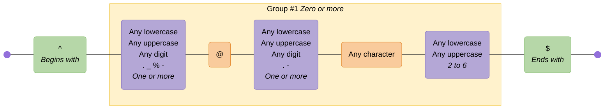

---

## Email (RFC2822)

Email address compliant with RFC2822

Source: <https://regex101.com/library/sI6yF5>

### Pattern {#Email (RFC2822)}

```regex
^([^\x00-\x20\x22\x28\x29\x2c\x2e\x3a-\x3c\x3e\x40\x5b-\x5d\x7f-\xff]+|\x22([^\x0d\x22\x5c\x80-\xff]|\x5c[\x00-\x7f])*\x22)(\x2e([^\x00-\x20\x22\x28\x29\x2c\x2e\x3a-\x3c\x3e\x40\x5b-\x5d\x7f-\xff]+|\x22([^\x0d\x22\x5c\x80-\xff]|\x5c[\x00-\x7f])*\x22))*\x40([^\x00-\x20\x22\x28\x29\x2c\x2e\x3a-\x3c\x3e\x40\x5b-\x5d\x7f-\xff]+|\x5b([^\x0d\x5b-\x5d\x80-\xff]|\x5c[\x00-\x7f])*\x5d)(\x2e([^\x00-\x20\x22\x28\x29\x2c\x2e\x3a-\x3c\x3e\x40\x5b-\x5d\x7f-\xff]+|\x5b([^\x0d\x5b-\x5d\x80-\xff]|\x5c[\x00-\x7f])*\x5d))*$
```

### Diagram

[View in Mermaid Live Editor](https://mermaid.live/edit#pako:H4sIAAAAAAACA92Z72-jNhjH_xUrvZPaW3MDjPmRVtW1JN2baZNue7WmrQg4KVtKKpJqV93d_z5jG_APTCCqdOr6IhhjP8_HXz_GfujXUbJJ8WgyWhXx0wP49fM8ByBOkj-z3RpPwHz0Ga_wlwm4O765m5O_L5Y1plfHYheHXQJ2CdklYRdMLzBmPSCrhazWZf3Rgj1EKb34S3a7XN7-9I07qD2nokfErAVW3eEbr7-ROP3l7ckH3vHkmHP9LwbDS671o0aDFspolB4DhoPSHz43rzuakw_v5iO-lqZ4mxTlWvoF57iIdzgF_2a7B1CUS2u824wfcfEYZ-kn56P10Sq7lR3fvwe_kaW5LcvbXVzsPn0F24f4iazK5TjJigR8PyufLbPc8CTebnGxyzb5vX08H92dL4qL8-ziCq-yfEsJzn_OLuajk8lkUjelHdNs-_dzntCui7L5vU3aCLUGh2I_nKc9eyUPcXGfrAkC5awUJRNfElfzSmaV39J5IRrzWzqTZFb4reMAGib0N6S_Cf3FgMYEoCHBtfg9x2BTgMdNgRstcrwq52hcco0pF8VcZzsyeeuKkcQjbc2rDbo5B-nmDNXNYUw0RBsprBTUgpA3TJ_BcUNVa3FwgjsoTpO_ZG0NFqFZrqqJy5vgPorCgxSFQxV130AkoiGR6B6kmztUN_Rakej1ikRvQCT6-yMxYE3IltFDUXSQomioov4biMSQT9aij27eQbp5Q3ULKiZJGS0w-73zrV7RGA6IRpvvIyg1h6PtDHkz-gfp6g_eo623sEnDIREZHKRcMFg5-zVD0u0VklUI9YtJZI7J5jBZWnzH52aWp11HSX6O_eN5QdNLdpblN-WhNk_jghx3wA05Gxeb5ydw5ABi9S9cbOQpvy17th6w9Af0BMWqxSMSq6kPOloDWNaQvoxap7QFSrsmagZhIrTbCW0NwJYJldt9eEjAQwNFdNsRXQ0RyUye1sDbQ-kKlK4uIjIRwnZCqAG4MqEC7O_BgwIe7BRRRW5GKHt093j0BY_-wGnz2kXRZyVQIsvSWoR7MD0B09NF8E2IqB0RaQC-jBgqxPa-xWmJq9MaKGTQThnoS1Rdo_oSsZ09qKFAGupSVpPTsr-3U_o6gqVQQuUe7UEMBMSg3zKofDbDVHzKspBNYZauhI8bYDweix8s1A8Y9HnLy9X0vYK2FzXRNkbNIn0rd9qrByPvmgY2x_RNQGVztHS-la3bXr2xyfm86gtquXxPX7RW8gTlPL-nnrRWsuPKHwMMakLT9wB1hK6WyreSddur9w854TawuaacW2VDWrrcytZtr9595XxZ9eVpuXJPX7RW8uTLeXRPPWmtZCeQk22DmsiUb6sj9LVUuZWs216948gJrYHNM-W0KlugpaOtbN32mg1byUZVb6GWifb0RmtlX8rLze6pKa2VLTlKMmvQ1Dfls9o73NJz0Va6bovNtqikjAa-wJQ1anz6JtOuXrfF5nChJHyaP0fP9nr6o7WyN6Skgj2VpbXK7u2oGSN9vszElHD3smbbP_8_B63J8hUdUTmYKV42Jkjn9XpydOVN_cvgdLsrNv_gyVEII9efniab9aaYHFn070wyIJByE9fX09DzahPXduRAp8uEnodzS7PLkPzVlqKo7Ctb4g_HabwlvYv4ZQIQQLJ9rniFF0ZXYVQbnXmhDYMuPA3ryr30p80Ag5kfRVCzwJVnh7w26auDXC3btRNF-2TjVi-fntYv3HZUGmQzzSibjPm0OT02RdQU3aYIm6LfFD3BgtWUw1PhJFsVz0bf_wOV0kUL7B4AAA==)

<details>
  <summary>Click to view as image</summary>
  <p align="center">
    
  </p>
</details>


---

## Emoji Support

Demonstrates support for extended character classes using the unicodeSets mode, enabled using the v flag

Source: <https://v8.dev/features/regexp-v-flag>

### Pattern {#Emoji Support}

```regex
/👍🚀❇️🇺🇸🌎🇨🇦🇬🇧🏴󠁧󠁢󠁥󠁮󠁧󠁿(\p{Emoji}){2}/v
```

### Diagram

[View in Mermaid Live Editor](https://mermaid.live/edit#pako:H4sIAAAAAAACA61RQW_TMBj9K5arSZu0rE0mptWdpnVpwwXtMLgRVBnHbQ1uEjkebKoqwWkXYOKKNGVCgu0wceIwceG_8AeIxB_gs5O0HbAblp5i-8t73_uep5glEccEjxRNx-jBYRgjRBl7JLTkBIX4kI_4MUHNIn__tsg_vPpxfvrz5qzIT78Bbor8zTv4XgE-A64Bl0V-9vXXxetLwEfAJ8CX6vx9NYSVTvuT5JmYrU29WfNFiKuWPZ4xZVre5zFXVPMIvRR6jJRx4OjEmXA1oSLa8zZaGy1DM8SVFXQAE2Rmn2mq9N4UZWOagvmhw4RiaNYxtaGI76hIoaGdHLirIf4_U4Z4jRBS6doebEzVIOPaNrHTl_-YewfuO_NhHh49tU9RDlQdzGRxRFU0cNFjCEglRylquGhH7PaPKdPyBHk7TbEb4ieGttzPnHkczfX70WgpLOQ4ziKA23HY2kLojzlsFUJdcq5PZCldvYm9EfHIEiXNsh4f1vJAlZI0gra_3_bXM62S55w0-lttd3N7nSUyUaTRsqtzi14HVvHbQXe7153z7_lb-37rL37lqYztX6bqeGtXQeD5C1eB63ub3l2q3TSF-Ett3wiWGVjt5Xertx08-w2PblAidQMAAA==)

<details>
  <summary>Click to view as image</summary>
  <p align="center">
    
  </p>
</details>

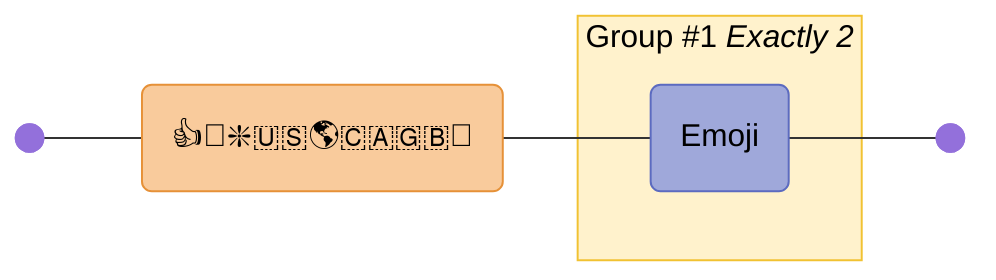

---

## HTML Tags

Naive html tags. Note: do not use regex for parsing HTML!

Source: <https://digitalfortress.tech/tips/top-15-commonly-used-regex/>

### Pattern {#HTML Tags}

```regex
<\/?[\w\s]*>|<.+[\W]>
```

### Diagram

[View in Mermaid Live Editor](https://mermaid.live/edit#pako:H4sIAAAAAAACA42TUW_aMBSF_4qVqtK2NhQSoCSNskICfZk6qZs0aU2FXMck3oKNbE-s6vrfZ3sZwQFa8gDJvf5Ojn1unh3EcuyETsHhqgSf7jIKAEToK5EVDkHm3OEC_w5BlKnr4uO9_lvrH_HwIf4Tdc5M5dtDnDk1mWKBuCZvMMUcSpyDNZEl4FrIlcxdYr6EJL_2Ot1OV2MaPD0Ft8qI0PdCQi6vn4Eo4Up5WLiIcARernRvQeiBTk7Ej18UScLo_BEXhM57YRhuVY_gMM2PpCoi1eaqee9d5kSZ815Bdclqe6qtzi165HFE4s8rrQir6ILEuwwqIZ-jCgphVMf0CawZz00dIrVOq5hqqSixggjXut8xZ4BxsGQcN9qac42eZclX2vFhx_39GzLmBJYba5YrvTeKD1hQVHt_-lhumQSwtcNXjQ_2Ga9nZ5oXW7MDXNfdNw-H5sSs3yRq52v1PDtc09uObSdHi_btHHZcmuk7ymPfjqzxYRJqBdZ26e2kYWkP7EM_0qWpmrXqC21y-SKfqn_B1B-4qRBaGAv67SlebAspvKrCk9ksDYbDcyE5-4nVYy_xfO8csYrx8KRrritLovb7Hw-SSZBs8Okw6Pmj1_Bm5GqFSX98mTYGRtPLJPHfVFDnXfPBbDxKxxt-kAwnSbfFOy9_AfXqP2J-BQAA)

<details>
  <summary>Click to view as image</summary>
  <p align="center">
    
  </p>
</details>

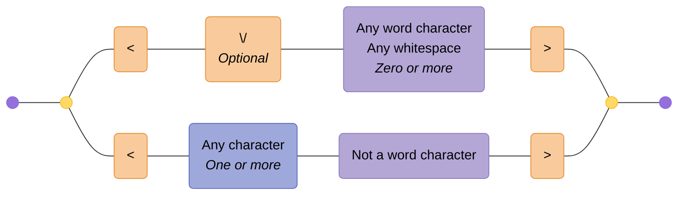

---

## IP Address

Handling both IPv4 and IPv6 addresses

Source: <https://digitalfortress.tech/tips/top-15-commonly-used-regex/>

### Pattern {#IP Address}

```regex
((^\s*((([0-9]|[1-9][0-9]|1[0-9]{2}|2[0-4][0-9]|25[0-5])\.){3}([0-9]|[1-9][0-9]|1[0-9]{2}|2[0-4][0-9]|25[0-5]))\s*$)|(^\s*((([0-9A-Fa-f]{1,4}:){7}([0-9A-Fa-f]{1,4}|:))|(([0-9A-Fa-f]{1,4}:){6}(:[0-9A-Fa-f]{1,4}|((25[0-5]|2[0-4]\d|1\d\d|[1-9]?\d)(\.(25[0-5]|2[0-4]\d|1\d\d|[1-9]?\d)){3})|:))|(([0-9A-Fa-f]{1,4}:){5}(((:[0-9A-Fa-f]{1,4}){1,2})|:((25[0-5]|2[0-4]\d|1\d\d|[1-9]?\d)(\.(25[0-5]|2[0-4]\d|1\d\d|[1-9]?\d)){3})|:))|(([0-9A-Fa-f]{1,4}:){4}(((:[0-9A-Fa-f]{1,4}){1,3})|((:[0-9A-Fa-f]{1,4})?:((25[0-5]|2[0-4]\d|1\d\d|[1-9]?\d)(\.(25[0-5]|2[0-4]\d|1\d\d|[1-9]?\d)){3}))|:))|(([0-9A-Fa-f]{1,4}:){3}(((:[0-9A-Fa-f]{1,4}){1,4})|((:[0-9A-Fa-f]{1,4}){0,2}:((25[0-5]|2[0-4]\d|1\d\d|[1-9]?\d)(\.(25[0-5]|2[0-4]\d|1\d\d|[1-9]?\d)){3}))|:))|(([0-9A-Fa-f]{1,4}:){2}(((:[0-9A-Fa-f]{1,4}){1,5})|((:[0-9A-Fa-f]{1,4}){0,3}:((25[0-5]|2[0-4]\d|1\d\d|[1-9]?\d)(\.(25[0-5]|2[0-4]\d|1\d\d|[1-9]?\d)){3}))|:))|(([0-9A-Fa-f]{1,4}:){1}(((:[0-9A-Fa-f]{1,4}){1,6})|((:[0-9A-Fa-f]{1,4}){0,4}:((25[0-5]|2[0-4]\d|1\d\d|[1-9]?\d)(\.(25[0-5]|2[0-4]\d|1\d\d|[1-9]?\d)){3}))|:))|(:(((:[0-9A-Fa-f]{1,4}){1,7})|((:[0-9A-Fa-f]{1,4}){0,5}:((25[0-5]|2[0-4]\d|1\d\d|[1-9]?\d)(\.(25[0-5]|2[0-4]\d|1\d\d|[1-9]?\d)){3}))|:)))(%.+)?\s*$))
```

### Diagram

[View in Mermaid Live Editor](https://mermaid.live/edit#pako:H4sIAAAAAAACA-1dbXMbR3L-Kyj5VEVeRGfnfZZ22SdT1n1JXaou-RTL56JJSGJCkyqQrjuXpP-exS4I9Dw9g2kMIJ2cSB9EYHa3u6e3X6Z7B_u8fXRxezl_dPro1eL8zevZv_31xc1sdn5x8Z9X99fz09mLR3-dv5r_43R2dPS3F8O_uz8eHR390J30P777QQ3_Tx_V-Oetfv9OD5_salS74a_78Xh53ZfHb837XS88njj-4fgdMH968vz85OWPb9UT-_70-G14z0bfnR4PV-VO9u-PTtnZR0crnis5ltwu36nxz_R5FPrb8fPx0TijnS5ZTv-4LJR7P8yMiXU8_K-Xl_2zxbNF8ZaX5Q59-5Fk3iK0KQptC0K_7QZ1__MF10XBXVlw8wkIroqC-7Lg9iMLflqSMZRldB9VxuOjx1_-y_G3D8Hv-MWjVUx-Nr-7WCxj8p_nN_PF-f38cvb3q_vXs8UyRJ_c3578Ml_8cn51-Sf9Zfdlt7xseeHjx7O_DCH-bvn57v58cf-nt7O71-dvhuj-8uTianExe__V8tjLq5vCkcuru__-9ebi_ur25qef56-ubn5Sp6enZFRw3fzmUnjV-d3dfDFeo45ePPrb1z8vvvn66pvvlnzvxvl-_a9X37x4dDwQW586Xnjx-nzx0938frzu6c1vs7-_vrqf3705v5iviPzXfHE7u13MfrldzDdUltedDNcV5qqb5iq7ahT54nqYx1roy6tXV_dEsPEonqyHkwfbqZ1mqjSvBw0tzq9H7mo6YzWEtCyltdLn9_84v7i__m2mQZmc_lJgvZW-G84YvKQ2JS-e0nLy2m3lGUaebiuZh3kvDw-znS84RW4zpslmzK42E3exmV5mM6oTa9hVjUapvazGV61GaZnZKLkrhLrdKLvFcNZhSO8RhjZBcEnlDw-au7ncHgI3l5nG2GkOGjttkx_YnWOnQzMbMvjyz5DFV-Kr2f3tzFYtbulRpxIPd00zczvPzB9qZn1-ZpRXOBSvMYaI1Oib1Ci7ai2Nqk897jt1PrXQNLWw29S0IFj1giw3xsftoVZ3tVC7jB-2EGcfYsSaod2SPJaEXIXQ-kQvOXE1BTXlwNUt_fc3SxWfXxdv6ppHkM7KtawWYpOlxN0sxdctRWuJpYS6pRiJpUSpTmPFUnqppRSXNjlTsY2mopR0XvWIrA-W17Q4IvdNxtjvZIy6HpH1wRLfaNWiqauuraztdpu8oDDRkspkNNGKJ0aJJyotNFntKq5YXGZzX7Q7-GLf6otOOjHfErdVYxtE7WYvgoLEdBJ7iVV7MUpkL16q1r5mL0FsL1FuL0a32ksvnJjpqgHMmEMFMKPEAaytVyW8bC2Prk_eHmzyps7sYFlyFFum6bYOj_CytTxO4Ppe4Pqm3kkxQeL6upN6SKi4vlZS19d6B9ePja6vjXRisSlVtHVChJetZesF9iIpB21XtRcrKge1tB60qmYv4oJQ71AR2taKUEtLQluPllYfKoBZIw5gbQ0s4WVreWx98gfLk9bVmR0sL1kv1nRbj0vt1uSyglWidRLXr68SrRe5vrTAt7VVohZX-GaHCn_UWIvrG2mF77qmVNHWOFS7dQ6dEthLFNiLqz_as73EXoy0CnWmYi9GXIWaHarQ8W422Yu0CnX1aOnUoQKYc-IA1tafVLs1KJ2vT_5gedKFOrOD5SUnfqik2ppvarfumxOsEp0VuL6vrxKdE7m-tKHga6tEI24omB0aCqNtNrm-tKHgdUuq0G0NS71bw9ILGpZO0rD09YalEzUsrbQK9bWGpRVXoXaHKtS1NiyttAr19Wjpu0MFMB-kAUy3dUT1bh1RH-uTP1ie9PXHNP5geSmIH9Poxm1pu7X6gmCV6I3A9UN9leityPWlDYVQWyVacUPB7tBQmCJOi-tLGwqhaUeabmtY6t0alkHQsPSShmWoNyy9qGFppVVoqDUsrbgKdTtUob61YemkVWgoRMv18V4cc9qamHq3JmasP1vx_cH2e9WfRIeD5dEofhKt27pzerfuXJRskVUCb431hV3QEm910h5ArC3snLgH4HboAUxJpcVbpT2A2PQkWrf1GPVuPcYo6DEGSeEY6z3GICocnbRwjLUeoxMXjm6HwjG0Fo5OWjj23fbo3i_99_GWiXvWpHwQ9mZe2e-7oaEOstXZyrc6r37Y8h-__jz-bnH6ccvqy_JXLjeX54vLn9zshxeP_ry4_fXN7IvBIn9cnpV1H35gdI9pmO6lZCP8HDONrLd5sRNsegKn4NiITy8x7ISwHBlknjTDNWGJJuyMbMI3k35XqtloLmVoK-Q9Ie-3KNrkFc3nE9lIz29GlwrJ1aZUeobnZ2TuMdzAwM-oqcMQdZiicjc3B777CnlNyOtG8uT7ar7kd1dkxuO2GPiu8QJdEVh1ROLhC7G_kNhfsqc_vQ2xxkNRHmqLEbq8EWbMB9yur4jQEwl6fl8e7JWIXJsTNaThC9GbL-otQPzpakyo86pt3hvyikOGGZfq4RTu8LoDI4MoqSwcd_Cd-7ZGu60FSRWpJuIWTcS8JiLInJFJwyk8umgDYiPVCMd7dNeO00Tt1U0vUF0EQcpQKKersaDpWbkMRV9gQaSs8aCJb7ChZh50wJXMwufNAsKI4ksCprtaqFE0B6hMEnhwsUNMlGizlplooNdJoHelgKUh0OtawNI0KuoxKo4FuE44bPaac47VBJtk2Ix2Jx_dRoHatt629nzwVr6rHOaRiZkQeRMvf9gAjo4PAUhjHFUYflSGKgs5NV_XNJwMcm_RhyroA9ZymkdOgyrjq0jD1jbgnHxqAQcyVDWeU_NfTZPu8KUeXtnNrhoxDX06E_q0K7AgUtZ40EWXViVHoQO6UQo6YEvG0-dtB5YfmIRNdYlEV3Yqs7TT3cecN1F_7f5QwYcvxMxsKR4bqH9MjYmh0XL48hCPTTYem0zFXK2nqJmZjJmZWgViqDOYsQJOmzEoJY-2phbjDPVps20hrQp1MJaehtckBlsBfI1pMGJpiIv8BFbhZW4SZpJqDjR0OW22LaeVLegDigDDmwAGfNvyxa_F0kIDWcumj0lRcy3zi2prUUNzoJEsqQ0sC02tCDZ02WEyS2rjCyyIlDUeSXcj094wtpEpHYBFYT1E0JXnENALIYIOqA8oN9FW0egLXUdcodlabNPUz3TMZKf-09IFuWm1tiW9q7Yru0yymx70V4tTlhq03dQTNpsZLF8O1znQDGkz9USdAnXs4csgY1eueSzPG7bmQJZGJ7t1hV4oc3EpbfkK3WJfma-lrce4CkHQ4gqdLdlNJgdgyquuaixdOtl-mz4KfTHsxLnMowCYm-N5l03XgH07LNgMG-Am6zAnVlc3lkaZ4Us9e1lIza7q7XQBZX2GYiiwIFLWeCRPQjJVkXWNTOkAekKtjrJ0gWtVKUDQAf0B5SbaKhp9oYuObXtXTdzUz0ymtrLdp6ULctMqU3P0rg5f-LuvePZy0OZwNb901KCdXWcvl80Mji9kXW194Wh-dLnnWbV77KhjO7_OXvkK0fG84Wr50dHo5LbWGoUeAT6jcLzWcFA3eJ5nHFYOWK95LBtYMWZ4TnSYE02tv-Tpwsl32559F_qPWDR6XhE7SHA-k2ewarRIFhXG6iqbeUCOObG6fnI0yrhekL08Clp1E7qAciHjJrHAgkhZ45HsaMjUd843MqUDuG6p5VRHl7dOlwIEHTAfUG6irWIQKDzAw-cwvpa4HfUzlyk7nfq0dEFuWi2E0LvqNXUZVcpezGlqzQRPDdq7dfby2czgeWj0tSTsaX70mQWfr2VYTx3bh3X2yteHnueNaujwNDr5bbWGLm1VgqIg8FrD474WHlc9Pia2kPEClhaWhW--wOAhvmYVgS6cwra9HLrQSdU42cyeKsjMISM55mas1wI7ATOT42sEjznR1Ww40CgTOkH2CrCMDNUdXHQB5TNNJN8XWBApazySbWKZ-s6HRqb0ErxFVano8tabUoCgA_YDyk20VTT6wiNSjTe9lrg99TOfKTu9_rR0QW5azWVoYgmbxBKyQTtmvLS2Fgs0sYRMYgm1xBJoYgmbxJIv3SIP6VXbDjSxhK2JpVDP4-6MmNl7CmYXeRkQ8AG5g3wVMUewrpbLUGXn1DQeqcHHrYml0OTUkDUiL1YDJM3IVy2BTRfJsjyCmcZlqGKZWK0nIk0sUZJYIt7s2go50MQSMokl9AUWRMoaD5pYQiaxhNDIlF4CiSXWVnWBJpZgSgGCDtgPKDfRVtHoC89h8YFpX70htHYI-pObOrlHkDKrHkMdRrzHlwz0H2-jHh3Qn9KOFSpY__t6WEkljb-vTjWdS__7alPQge73tUalA-oTj4IkfpdSRCFD1MrLSBNC1NX9Vz12gX015dCM8zkwfw7MnwPz58D8fzYwb4jid_bjPLYbBCOrwitqwTz5pd3Bfn-4cd_Poftz6P4cuj-H7v-noXtzRfHxdeHpdRK3Hz-efX_5iuB-zk5OTnLESi-jHM8nvwpHdM7x-OYnTwClUOCmS28w2VBb_SSS4VgximNrSkpPM1QRPMOwV6U3cFz_gjPF-kFelr0jdw9eOgXdQF6OvZ4Qz_DsBUt7SGPSV9Ijr8DekSLkNY4mnGz6GumCxZkSRidKFhm8ZlYyMb2eIXAyG-84-mYDz_VGnfQ1r4wbdym1BzefviaRcdMcq5OdYzhO5x4ShfS9Zoyb5TieQm7jaBrvNLyjHKKlRhjPLCdp7DWI7pnKYuCtswVPsCWUTqYpxxE2E03H9OVKBX6uhJ3J-HmOe5nV13aK6-ZR-gYkIaVxNHuuXG-BY2qmWaEDnMyC5nwJLjOlBkmGZRkVOdBldobb-WXeBFLCvEzl0wBWyeTrOVhlVj4hPwOYlmwN0HFQy9STLLzzcR9pLABeppwcvPArPerhBVsNciRvQuFImCm_AHiXQn7jaDprB4CYBQuKJSzMlJoHEEs2M76sy0daIb8AWJeMn-Fgl6kmI6Bc7iNNBCDMlFMPMJiwHu8Q_LJBkuQVMhwiEzhiCaCEHMfRhri0eVsKAGsKaY2j-0V87ThmZ7o27wCHs-APfQmOM6WmAEeTyeM5kGZ2hkJ-UFroUg3ZFSE1U3oGoDCZ_IFDYeZXTlKOFjAzGcfIQTPBrjXCZe4nkQNMTeBmEFITjlsE0mySJnmbCwfcBJ4OcTWlPKfhdP4eoDdLNlVcHKuUXgC4TFbXdxwuMy-_lGMEXE3GUXFgTdCoR0jN_STqAXcTuAWE3YTjEcE2m6RJ3ojDQTmBZ4_Ym1Ke0_AeUc10AOYppDWO7pcvDG8ypTWsUYD9WfIOXcQATelpwO5kElkO3pm_E1KO0ABiMd44juCZUrCAylnSgSmic6b0HKBqMok8R9XM60DK0QP8JuMYOP4m9Bc6RN7cT6IA8JzATSE6JxzHdodukiZ5nwzH7gSeBiE6pTyn4XT-EVA8SzZliwieKb0ekDfZ_HqOvJmXX8jRdgDRyXrKHcfoBI1aROfcTyIFEJ7AzSGCJxz3iNvZJE3yTh6O7wk8A8J4SnlOw3tFRqsBGVRKbRreL_NYzWFHU-kMQImWPMQVIUVTetCe5xIZjgWa14iUowM8UMaRP3YBi_YA8lnSgS-Cfab0AoB0MokcB-nM60DKMQKaJ-PoOZwn-EhEIM_9JOoB7RO49Qj2Cb3tDiE-m6RJ3gXDoUCBp0LETynPaTh9KtMBKGjJpkIREDSlpwDIk80vciDPvPxSjhoQPxnHnkN-gkY1gn3uJ5EBRFDghg9E8LhFGNAmaZL36XC4UODpEBVUynMa3isyOgtAo1Jq0_B-mccpjmKaSgcPLks9YxWLCKUpPQ_IokwizaFF8xqRcgwAL8o4Go4vmlKIgBla0kFfxA5N6fWA-ckkshzzM68DIUffATgo48g3IsCK0HjEBd1PIgXgocAtIHYoHI-IGNokTfIeF44sCjx7BBCV8pyG0_lrwBgt7cnpiviiKT0DuKBsfoHjguZ3d0g5WgAQZRwjRxCFJ3odYofuJ5EDgFHgphBfFI5rRBVtkiZ5Fw5HHwWeBkFGpTyn4b0io4dtIl5KbRreL_P4joOiptIFADoteYgqAp6m9CIAlTKJFEcqzd8NKcce0EoZR83hStNdMx1AkJZ0UNz-BfQUQIgyiQyHEM3rQMpRA9Yo42g52Cj4CD74t_tJZACLFLg5hCKF4x4BSJukSd7BwoFKgWdAPFIpz2k4nb8FyNKSTZkiXGlKzwHMKJsf38JY0JmUowc8UsYxcEBS0GhEKNL9JILtbcitR7hS2G_SIUhpkzTJe2w4mCnwVIhZKuU5De8VGUMEGFQptWm4IfNsfkQOAKsl67dFoNV0t10HAKnsTvQcITU_WylHBSipbBdvx2FSUwoaoE9LOnBFCNSUngHoUiaR4tCleR1IOVrAOGUcNQc5BfvXCG-6n0QOMFCBm0EIVDhuEfi0SZrkBSwcIBV44jY3J-U5Dafz9wCVWrIpX4RJTekFgDdl87Mc3jQvv5QjbJxl68PgOBAqaNQjBOp-EvWAkwrcAsKkwvGI4KhN0iQvseEgqsCzR6xUKc9peK_I2HcAvyqlNg0Ls8o4mvJVAOsK-0U7RHWF4woRW2GHuUUsVuF-9XF0PPflFQVmvf_tevrp0fDlL7eX83Hk6ubVKMXytj6bv6SEhsuvr0-_eP78We_9k7v7xe3_zIev6kwb_eTi9vp2cfpFN_77KiGxlnhF4Dv_LDyNawK9ObPh2TYCD1i0q-v750_js6fr692Z_-6sq14_fnuQwD4NzzZTiN-HszOzjcLqnj5ooD_7rj9bX_6975WJ7PKVZqcf4eZU-_AjsrVen-uzs5peV1Sfvnlz_duK9tmS4HQnp0lufjT4ZPNbyM1Hv_loNh_1E_JrXvJZbT73ZJhcqQhBFcnnQD4TURSRRRG2mrDVVDJ6DqGjCX1NZNCEvibiKyK_Jp8NoW_I-YbQMVRpZI6GyGCIbIbIb-i8yLWWjFtyviXyWHoLCS9L5LeUJpHTEvktnRe51pFxR853RB5HaDrCyxP5HaVJ5HREfkfm5ci1nox7cr6nNktoesIrEPkDpUnlJPJ7Mi9PryV8A-EbCN9A-EZybSR8A-EbCN9A-AYyX3J6JMPUc9bu_NWj9_8LnSOX3gu0AAA=)

<details>
  <summary>Click to view as image</summary>
  <p align="center">
    
  </p>
</details>

```mermaid
graph LR
  accTitle: "Regex: ((^\\s*((([0-9]|[1-9][0-9]|1[0-9]{2}|2[0-4][0-9]|25[0-5])\\.){3}([0-9]|[1-9][0-9]|1[0-9]{2}|2[0-4][0-9]|25[0-5]))\\s*$)|(^\\s*((([0-9A-Fa-f]{1,4}:){7}([0-9A-Fa-f]{1,4}|:))|(([0-9A-Fa-f]{1,4}:){6}(:[0-9A-Fa-f]{1,4}|((25[0-5]|2[0-4]\\d|1\\d\\d|[1-9]?\\d)(\\.(25[0-5]|2[0-4]\\d|1\\d\\d|[1-9]?\\d)){3})|:))|(([0-9A-Fa-f]{1,4}:){5}(((:[0-9A-Fa-f]{1,4}){1,2})|:((25[0-5]|2[0-4]\\d|1\\d\\d|[1-9]?\\d)(\\.(25[0-5]|2[0-4]\\d|1\\d\\d|[1-9]?\\d)){3})|:))|(([0-9A-Fa-f]{1,4}:){4}(((:[0-9A-Fa-f]{1,4}){1,3})|((:[0-9A-Fa-f]{1,4})?:((25[0-5]|2[0-4]\\d|1\\d\\d|[1-9]?\\d)(\\.(25[0-5]|2[0-4]\\d|1\\d\\d|[1-9]?\\d)){3}))|:))|(([0-9A-Fa-f]{1,4}:){3}(((:[0-9A-Fa-f]{1,4}){1,4})|((:[0-9A-Fa-f]{1,4}){0,2}:((25[0-5]|2[0-4]\\d|1\\d\\d|[1-9]?\\d)(\\.(25[0-5]|2[0-4]\\d|1\\d\\d|[1-9]?\\d)){3}))|:))|(([0-9A-Fa-f]{1,4}:){2}(((:[0-9A-Fa-f]{1,4}){1,5})|((:[0-9A-Fa-f]{1,4}){0,3}:((25[0-5]|2[0-4]\\d|1\\d\\d|[1-9]?\\d)(\\.(25[0-5]|2[0-4]\\d|1\\d\\d|[1-9]?\\d)){3}))|:))|(([0-9A-Fa-f]{1,4}:){1}(((:[0-9A-Fa-f]{1,4}){1,6})|((:[0-9A-Fa-f]{1,4}){0,4}:((25[0-5]|2[0-4]\\d|1\\d\\d|[1-9]?\\d)(\\.(25[0-5]|2[0-4]\\d|1\\d\\d|[1-9]?\\d)){3}))|:))|(:(((:[0-9A-Fa-f]{1,4}){1,7})|((:[0-9A-Fa-f]{1,4}){0,5}:((25[0-5]|2[0-4]\\d|1\\d\\d|[1-9]?\\d)(\\.(25[0-5]|2[0-4]\\d|1\\d\\d|[1-9]?\\d)){3}))|:)))(%.+)?\\s*$))"
  accDescr: "Generated with regex-to-mermaid@2.0.0"

  %% Nodes
  start@{ shape: f-circ };
  fin@{ shape: f-circ };
  disjunction_begin_1:::disjunction@{ shape: f-circ };
  disjunction_end_1:::disjunction@{ shape: f-circ };
  assertion_1("^<br><i>Begins with</i>"):::assertion;
  char_set_1("Any whitespace<br><i>Zero or more</i>"):::char-set;
  disjunction_begin_2:::disjunction@{ shape: f-circ };
  disjunction_end_2:::disjunction@{ shape: f-circ };
  char_class_1("Any digit"):::char-class;
  char_class_2("1-9"):::char-class;
  char_class_3("Any digit"):::char-class;
  literal_1("1"):::literal;
  char_class_4("Any digit<br><i>Exactly 2</i>"):::char-class;
  literal_2("2"):::literal;
  char_class_5("0-4"):::char-class;
  char_class_6("Any digit"):::char-class;
  literal_3("25"):::literal;
  char_class_7("0-5"):::char-class;
  literal_4("Any character"):::literal;
  disjunction_begin_3:::disjunction@{ shape: f-circ };
  disjunction_end_3:::disjunction@{ shape: f-circ };
  char_class_8("Any digit"):::char-class;
  char_class_9("1-9"):::char-class;
  char_class_10("Any digit"):::char-class;
  literal_5("1"):::literal;
  char_class_11("Any digit<br><i>Exactly 2</i>"):::char-class;
  literal_6("2"):::literal;
  char_class_12("0-4"):::char-class;
  char_class_13("Any digit"):::char-class;
  literal_7("25"):::literal;
  char_class_14("0-5"):::char-class;
  char_set_2("Any whitespace<br><i>Zero or more</i>"):::char-set;
  assertion_2("$<br><i>Ends with</i>"):::assertion;
  assertion_3("^<br><i>Begins with</i>"):::assertion;
  char_set_3("Any whitespace<br><i>Zero or more</i>"):::char-set;
  disjunction_begin_4:::disjunction@{ shape: f-circ };
  disjunction_end_4:::disjunction@{ shape: f-circ };
  char_class_15("Any digit<br>A-F<br>a-f<br><i>1 to 4</i>"):::char-class;
  literal_8(":"):::literal;
  disjunction_begin_5:::disjunction@{ shape: f-circ };
  disjunction_end_5:::disjunction@{ shape: f-circ };
  char_class_16("Any digit<br>A-F<br>a-f<br><i>1 to 4</i>"):::char-class;
  literal_9(":"):::literal;
  char_class_17("Any digit<br>A-F<br>a-f<br><i>1 to 4</i>"):::char-class;
  literal_10(":"):::literal;
  disjunction_begin_6:::disjunction@{ shape: f-circ };
  disjunction_end_6:::disjunction@{ shape: f-circ };
  literal_11(":"):::literal;
  char_class_18("Any digit<br>A-F<br>a-f<br><i>1 to 4</i>"):::char-class;
  disjunction_begin_7:::disjunction@{ shape: f-circ };
  disjunction_end_7:::disjunction@{ shape: f-circ };
  literal_12("25"):::literal;
  char_class_19("0-5"):::char-class;
  literal_13("2"):::literal;
  char_class_20("0-4"):::char-class;
  char_set_4("Any digit"):::char-set;
  literal_14("1"):::literal;
  char_set_5("Any digit"):::char-set;
  char_set_6("Any digit"):::char-set;
  char_class_21("1-9<br><i>Optional</i>"):::char-class;
  char_set_7("Any digit"):::char-set;
  literal_15("Any character"):::literal;
  disjunction_begin_8:::disjunction@{ shape: f-circ };
  disjunction_end_8:::disjunction@{ shape: f-circ };
  literal_16("25"):::literal;
  char_class_22("0-5"):::char-class;
  literal_17("2"):::literal;
  char_class_23("0-4"):::char-class;
  char_set_8("Any digit"):::char-set;
  literal_18("1"):::literal;
  char_set_9("Any digit"):::char-set;
  char_set_10("Any digit"):::char-set;
  char_class_24("1-9<br><i>Optional</i>"):::char-class;
  char_set_11("Any digit"):::char-set;
  literal_19(":"):::literal;
  char_class_25("Any digit<br>A-F<br>a-f<br><i>1 to 4</i>"):::char-class;
  literal_20(":"):::literal;
  disjunction_begin_9:::disjunction@{ shape: f-circ };
  disjunction_end_9:::disjunction@{ shape: f-circ };
  literal_21(":"):::literal;
  char_class_26("Any digit<br>A-F<br>a-f<br><i>1 to 4</i>"):::char-class;
  literal_22(":"):::literal;
  disjunction_begin_10:::disjunction@{ shape: f-circ };
  disjunction_end_10:::disjunction@{ shape: f-circ };
  literal_23("25"):::literal;
  char_class_27("0-5"):::char-class;
  literal_24("2"):::literal;
  char_class_28("0-4"):::char-class;
  char_set_12("Any digit"):::char-set;
  literal_25("1"):::literal;
  char_set_13("Any digit"):::char-set;
  char_set_14("Any digit"):::char-set;
  char_class_29("1-9<br><i>Optional</i>"):::char-class;
  char_set_15("Any digit"):::char-set;
  literal_26("Any character"):::literal;
  disjunction_begin_11:::disjunction@{ shape: f-circ };
  disjunction_end_11:::disjunction@{ shape: f-circ };
  literal_27("25"):::literal;
  char_class_30("0-5"):::char-class;
  literal_28("2"):::literal;
  char_class_31("0-4"):::char-class;
  char_set_16("Any digit"):::char-set;
  literal_29("1"):::literal;
  char_set_17("Any digit"):::char-set;
  char_set_18("Any digit"):::char-set;
  char_class_32("1-9<br><i>Optional</i>"):::char-class;
  char_set_19("Any digit"):::char-set;
  literal_30(":"):::literal;
  char_class_33("Any digit<br>A-F<br>a-f<br><i>1 to 4</i>"):::char-class;
  literal_31(":"):::literal;
  disjunction_begin_12:::disjunction@{ shape: f-circ };
  disjunction_end_12:::disjunction@{ shape: f-circ };
  literal_32(":"):::literal;
  char_class_34("Any digit<br>A-F<br>a-f<br><i>1 to 4</i>"):::char-class;
  literal_33(":"):::literal;
  char_class_35("Any digit<br>A-F<br>a-f<br><i>1 to 4</i>"):::char-class;
  literal_34(":"):::literal;
  disjunction_begin_13:::disjunction@{ shape: f-circ };
  disjunction_end_13:::disjunction@{ shape: f-circ };
  literal_35("25"):::literal;
  char_class_36("0-5"):::char-class;
  literal_36("2"):::literal;
  char_class_37("0-4"):::char-class;
  char_set_20("Any digit"):::char-set;
  literal_37("1"):::literal;
  char_set_21("Any digit"):::char-set;
  char_set_22("Any digit"):::char-set;
  char_class_38("1-9<br><i>Optional</i>"):::char-class;
  char_set_23("Any digit"):::char-set;
  literal_38("Any character"):::literal;
  disjunction_begin_14:::disjunction@{ shape: f-circ };
  disjunction_end_14:::disjunction@{ shape: f-circ };
  literal_39("25"):::literal;
  char_class_39("0-5"):::char-class;
  literal_40("2"):::literal;
  char_class_40("0-4"):::char-class;
  char_set_24("Any digit"):::char-set;
  literal_41("1"):::literal;
  char_set_25("Any digit"):::char-set;
  char_set_26("Any digit"):::char-set;
  char_class_41("1-9<br><i>Optional</i>"):::char-class;
  char_set_27("Any digit"):::char-set;
  literal_42(":"):::literal;
  char_class_42("Any digit<br>A-F<br>a-f<br><i>1 to 4</i>"):::char-class;
  literal_43(":"):::literal;
  disjunction_begin_15:::disjunction@{ shape: f-circ };
  disjunction_end_15:::disjunction@{ shape: f-circ };
  literal_44(":"):::literal;
  char_class_43("Any digit<br>A-F<br>a-f<br><i>1 to 4</i>"):::char-class;
  literal_45(":"):::literal;
  char_class_44("Any digit<br>A-F<br>a-f<br><i>1 to 4</i>"):::char-class;
  literal_46(":"):::literal;
  disjunction_begin_16:::disjunction@{ shape: f-circ };
  disjunction_end_16:::disjunction@{ shape: f-circ };
  literal_47("25"):::literal;
  char_class_45("0-5"):::char-class;
  literal_48("2"):::literal;
  char_class_46("0-4"):::char-class;
  char_set_28("Any digit"):::char-set;
  literal_49("1"):::literal;
  char_set_29("Any digit"):::char-set;
  char_set_30("Any digit"):::char-set;
  char_class_47("1-9<br><i>Optional</i>"):::char-class;
  char_set_31("Any digit"):::char-set;
  literal_50("Any character"):::literal;
  disjunction_begin_17:::disjunction@{ shape: f-circ };
  disjunction_end_17:::disjunction@{ shape: f-circ };
  literal_51("25"):::literal;
  char_class_48("0-5"):::char-class;
  literal_52("2"):::literal;
  char_class_49("0-4"):::char-class;
  char_set_32("Any digit"):::char-set;
  literal_53("1"):::literal;
  char_set_33("Any digit"):::char-set;
  char_set_34("Any digit"):::char-set;
  char_class_50("1-9<br><i>Optional</i>"):::char-class;
  char_set_35("Any digit"):::char-set;
  literal_54(":"):::literal;
  char_class_51("Any digit<br>A-F<br>a-f<br><i>1 to 4</i>"):::char-class;
  literal_55(":"):::literal;
  disjunction_begin_18:::disjunction@{ shape: f-circ };
  disjunction_end_18:::disjunction@{ shape: f-circ };
  literal_56(":"):::literal;
  char_class_52("Any digit<br>A-F<br>a-f<br><i>1 to 4</i>"):::char-class;
  literal_57(":"):::literal;
  char_class_53("Any digit<br>A-F<br>a-f<br><i>1 to 4</i>"):::char-class;
  literal_58(":"):::literal;
  disjunction_begin_19:::disjunction@{ shape: f-circ };
  disjunction_end_19:::disjunction@{ shape: f-circ };
  literal_59("25"):::literal;
  char_class_54("0-5"):::char-class;
  literal_60("2"):::literal;
  char_class_55("0-4"):::char-class;
  char_set_36("Any digit"):::char-set;
  literal_61("1"):::literal;
  char_set_37("Any digit"):::char-set;
  char_set_38("Any digit"):::char-set;
  char_class_56("1-9<br><i>Optional</i>"):::char-class;
  char_set_39("Any digit"):::char-set;
  literal_62("Any character"):::literal;
  disjunction_begin_20:::disjunction@{ shape: f-circ };
  disjunction_end_20:::disjunction@{ shape: f-circ };
  literal_63("25"):::literal;
  char_class_57("0-5"):::char-class;
  literal_64("2"):::literal;
  char_class_58("0-4"):::char-class;
  char_set_40("Any digit"):::char-set;
  literal_65("1"):::literal;
  char_set_41("Any digit"):::char-set;
  char_set_42("Any digit"):::char-set;
  char_class_59("1-9<br><i>Optional</i>"):::char-class;
  char_set_43("Any digit"):::char-set;
  literal_66(":"):::literal;
  char_class_60("Any digit<br>A-F<br>a-f<br><i>1 to 4</i>"):::char-class;
  literal_67(":"):::literal;
  disjunction_begin_21:::disjunction@{ shape: f-circ };
  disjunction_end_21:::disjunction@{ shape: f-circ };
  literal_68(":"):::literal;
  char_class_61("Any digit<br>A-F<br>a-f<br><i>1 to 4</i>"):::char-class;
  literal_69(":"):::literal;
  char_class_62("Any digit<br>A-F<br>a-f<br><i>1 to 4</i>"):::char-class;
  literal_70(":"):::literal;
  disjunction_begin_22:::disjunction@{ shape: f-circ };
  disjunction_end_22:::disjunction@{ shape: f-circ };
  literal_71("25"):::literal;
  char_class_63("0-5"):::char-class;
  literal_72("2"):::literal;
  char_class_64("0-4"):::char-class;
  char_set_44("Any digit"):::char-set;
  literal_73("1"):::literal;
  char_set_45("Any digit"):::char-set;
  char_set_46("Any digit"):::char-set;
  char_class_65("1-9<br><i>Optional</i>"):::char-class;
  char_set_47("Any digit"):::char-set;
  literal_74("Any character"):::literal;
  disjunction_begin_23:::disjunction@{ shape: f-circ };
  disjunction_end_23:::disjunction@{ shape: f-circ };
  literal_75("25"):::literal;
  char_class_66("0-5"):::char-class;
  literal_76("2"):::literal;
  char_class_67("0-4"):::char-class;
  char_set_48("Any digit"):::char-set;
  literal_77("1"):::literal;
  char_set_49("Any digit"):::char-set;
  char_set_50("Any digit"):::char-set;
  char_class_68("1-9<br><i>Optional</i>"):::char-class;
  char_set_51("Any digit"):::char-set;
  literal_78(":"):::literal;
  literal_79(":"):::literal;
  disjunction_begin_24:::disjunction@{ shape: f-circ };
  disjunction_end_24:::disjunction@{ shape: f-circ };
  literal_80(":"):::literal;
  char_class_69("Any digit<br>A-F<br>a-f<br><i>1 to 4</i>"):::char-class;
  literal_81(":"):::literal;
  char_class_70("Any digit<br>A-F<br>a-f<br><i>1 to 4</i>"):::char-class;
  literal_82(":"):::literal;
  disjunction_begin_25:::disjunction@{ shape: f-circ };
  disjunction_end_25:::disjunction@{ shape: f-circ };
  literal_83("25"):::literal;
  char_class_71("0-5"):::char-class;
  literal_84("2"):::literal;
  char_class_72("0-4"):::char-class;
  char_set_52("Any digit"):::char-set;
  literal_85("1"):::literal;
  char_set_53("Any digit"):::char-set;
  char_set_54("Any digit"):::char-set;
  char_class_73("1-9<br><i>Optional</i>"):::char-class;
  char_set_55("Any digit"):::char-set;
  literal_86("Any character"):::literal;
  disjunction_begin_26:::disjunction@{ shape: f-circ };
  disjunction_end_26:::disjunction@{ shape: f-circ };
  literal_87("25"):::literal;
  char_class_74("0-5"):::char-class;
  literal_88("2"):::literal;
  char_class_75("0-4"):::char-class;
  char_set_56("Any digit"):::char-set;
  literal_89("1"):::literal;
  char_set_57("Any digit"):::char-set;
  char_set_58("Any digit"):::char-set;
  char_class_76("1-9<br><i>Optional</i>"):::char-class;
  char_set_59("Any digit"):::char-set;
  literal_90(":"):::literal;
  literal_91("%"):::literal;
  char_set_60("Any character<br><i>One or more</i>"):::char-set;
  char_set_61("Any whitespace<br><i>Zero or more</i>"):::char-set;
  assertion_4("$<br><i>Ends with</i>"):::assertion;

  %% Subgraphs
  subgraph standard_5 ["Group #5"]
    disjunction_begin_2
    disjunction_end_2
    char_class_1
    char_class_2
    char_class_3
    literal_1
    char_class_4
    literal_2
    char_class_5
    char_class_6
    literal_3
    char_class_7
  end

  subgraph standard_4 ["Group #4 <i>Exactly 3</i>"]
    standard_5
    literal_4
  end

  subgraph standard_6 ["Group #6"]
    disjunction_begin_3
    disjunction_end_3
    char_class_8
    char_class_9
    char_class_10
    literal_5
    char_class_11
    literal_6
    char_class_12
    char_class_13
    literal_7
    char_class_14
  end

  subgraph standard_3 ["Group #3"]
    standard_5
    standard_4
    standard_6
  end

  subgraph standard_2 ["Group #2"]
    standard_5
    standard_4
    standard_6
    standard_3
    assertion_1
    char_set_1
    char_set_2
    assertion_2
  end

  subgraph standard_10 ["Group #10 <i>Exactly 7</i>"]
    char_class_15
    literal_8
  end

  subgraph standard_11 ["Group #11"]
    disjunction_begin_5
    disjunction_end_5
    char_class_16
    literal_9
  end

  subgraph standard_9 ["Group #9"]
    standard_10
    standard_11
  end

  subgraph standard_13 ["Group #13 <i>Exactly 6</i>"]
    char_class_17
    literal_10
  end

  subgraph standard_16 ["Group #16"]
    disjunction_begin_7
    disjunction_end_7
    literal_12
    char_class_19
    literal_13
    char_class_20
    char_set_4
    literal_14
    char_set_5
    char_set_6
    char_class_21
    char_set_7
  end

  subgraph standard_18 ["Group #18"]
    disjunction_begin_8
    disjunction_end_8
    literal_16
    char_class_22
    literal_17
    char_class_23
    char_set_8
    literal_18
    char_set_9
    char_set_10
    char_class_24
    char_set_11
  end

  subgraph standard_17 ["Group #17 <i>Exactly 3</i>"]
    standard_18
    literal_15
  end

  subgraph standard_15 ["Group #15"]
    standard_16
    standard_18
    standard_17
  end

  subgraph standard_14 ["Group #14"]
    standard_16
    standard_18
    standard_17
    standard_15
    disjunction_begin_6
    disjunction_end_6
    literal_11
    char_class_18
    literal_19
  end

  subgraph standard_12 ["Group #12"]
    standard_13
    standard_16
    standard_18
    standard_17
    standard_15
    standard_14
  end

  subgraph standard_20 ["Group #20 <i>Exactly 5</i>"]
    char_class_25
    literal_20
  end

  subgraph standard_23 ["Group #23 <i>1 to 2</i>"]
    literal_21
    char_class_26
  end

  subgraph standard_22 ["Group #22"]
    standard_23
  end

  subgraph standard_25 ["Group #25"]
    disjunction_begin_10
    disjunction_end_10
    literal_23
    char_class_27
    literal_24
    char_class_28
    char_set_12
    literal_25
    char_set_13
    char_set_14
    char_class_29
    char_set_15
  end

  subgraph standard_27 ["Group #27"]
    disjunction_begin_11
    disjunction_end_11
    literal_27
    char_class_30
    literal_28
    char_class_31
    char_set_16
    literal_29
    char_set_17
    char_set_18
    char_class_32
    char_set_19
  end

  subgraph standard_26 ["Group #26 <i>Exactly 3</i>"]
    standard_27
    literal_26
  end

  subgraph standard_24 ["Group #24"]
    standard_25
    standard_27
    standard_26
  end

  subgraph standard_21 ["Group #21"]
    standard_23
    standard_22
    standard_25
    standard_27
    standard_26
    standard_24
    disjunction_begin_9
    disjunction_end_9
    literal_22
    literal_30
  end

  subgraph standard_19 ["Group #19"]
    standard_20
    standard_23
    standard_22
    standard_25
    standard_27
    standard_26
    standard_24
    standard_21
  end

  subgraph standard_29 ["Group #29 <i>Exactly 4</i>"]
    char_class_33
    literal_31
  end

  subgraph standard_32 ["Group #32 <i>1 to 3</i>"]
    literal_32
    char_class_34
  end

  subgraph standard_31 ["Group #31"]
    standard_32
  end

  subgraph standard_34 ["Group #34 <i>Optional</i>"]
    literal_33
    char_class_35
  end

  subgraph standard_36 ["Group #36"]
    disjunction_begin_13
    disjunction_end_13
    literal_35
    char_class_36
    literal_36
    char_class_37
    char_set_20
    literal_37
    char_set_21
    char_set_22
    char_class_38
    char_set_23
  end

  subgraph standard_38 ["Group #38"]
    disjunction_begin_14
    disjunction_end_14
    literal_39
    char_class_39
    literal_40
    char_class_40
    char_set_24
    literal_41
    char_set_25
    char_set_26
    char_class_41
    char_set_27
  end

  subgraph standard_37 ["Group #37 <i>Exactly 3</i>"]
    standard_38
    literal_38
  end

  subgraph standard_35 ["Group #35"]
    standard_36
    standard_38
    standard_37
  end

  subgraph standard_33 ["Group #33"]
    standard_34
    standard_36
    standard_38
    standard_37
    standard_35
    literal_34
  end

  subgraph standard_30 ["Group #30"]
    standard_32
    standard_31
    standard_34
    standard_36
    standard_38
    standard_37
    standard_35
    standard_33
    disjunction_begin_12
    disjunction_end_12
    literal_42
  end

  subgraph standard_28 ["Group #28"]
    standard_29
    standard_32
    standard_31
    standard_34
    standard_36
    standard_38
    standard_37
    standard_35
    standard_33
    standard_30
  end

  subgraph standard_40 ["Group #40 <i>Exactly 3</i>"]
    char_class_42
    literal_43
  end

  subgraph standard_43 ["Group #43 <i>1 to 4</i>"]
    literal_44
    char_class_43
  end

  subgraph standard_42 ["Group #42"]
    standard_43
  end

  subgraph standard_45 ["Group #45 <i>0 to 2</i>"]
    literal_45
    char_class_44
  end

  subgraph standard_47 ["Group #47"]
    disjunction_begin_16
    disjunction_end_16
    literal_47
    char_class_45
    literal_48
    char_class_46
    char_set_28
    literal_49
    char_set_29
    char_set_30
    char_class_47
    char_set_31
  end

  subgraph standard_49 ["Group #49"]
    disjunction_begin_17
    disjunction_end_17
    literal_51
    char_class_48
    literal_52
    char_class_49
    char_set_32
    literal_53
    char_set_33
    char_set_34
    char_class_50
    char_set_35
  end

  subgraph standard_48 ["Group #48 <i>Exactly 3</i>"]
    standard_49
    literal_50
  end

  subgraph standard_46 ["Group #46"]
    standard_47
    standard_49
    standard_48
  end

  subgraph standard_44 ["Group #44"]
    standard_45
    standard_47
    standard_49
    standard_48
    standard_46
    literal_46
  end

  subgraph standard_41 ["Group #41"]
    standard_43
    standard_42
    standard_45
    standard_47
    standard_49
    standard_48
    standard_46
    standard_44
    disjunction_begin_15
    disjunction_end_15
    literal_54
  end

  subgraph standard_39 ["Group #39"]
    standard_40
    standard_43
    standard_42
    standard_45
    standard_47
    standard_49
    standard_48
    standard_46
    standard_44
    standard_41
  end

  subgraph standard_51 ["Group #51 <i>Exactly 2</i>"]
    char_class_51
    literal_55
  end

  subgraph standard_54 ["Group #54 <i>1 to 5</i>"]
    literal_56
    char_class_52
  end

  subgraph standard_53 ["Group #53"]
    standard_54
  end

  subgraph standard_56 ["Group #56 <i>0 to 3</i>"]
    literal_57
    char_class_53
  end

  subgraph standard_58 ["Group #58"]
    disjunction_begin_19
    disjunction_end_19
    literal_59
    char_class_54
    literal_60
    char_class_55
    char_set_36
    literal_61
    char_set_37
    char_set_38
    char_class_56
    char_set_39
  end

  subgraph standard_60 ["Group #60"]
    disjunction_begin_20
    disjunction_end_20
    literal_63
    char_class_57
    literal_64
    char_class_58
    char_set_40
    literal_65
    char_set_41
    char_set_42
    char_class_59
    char_set_43
  end

  subgraph standard_59 ["Group #59 <i>Exactly 3</i>"]
    standard_60
    literal_62
  end

  subgraph standard_57 ["Group #57"]
    standard_58
    standard_60
    standard_59
  end

  subgraph standard_55 ["Group #55"]
    standard_56
    standard_58
    standard_60
    standard_59
    standard_57
    literal_58
  end

  subgraph standard_52 ["Group #52"]
    standard_54
    standard_53
    standard_56
    standard_58
    standard_60
    standard_59
    standard_57
    standard_55
    disjunction_begin_18
    disjunction_end_18
    literal_66
  end

  subgraph standard_50 ["Group #50"]
    standard_51
    standard_54
    standard_53
    standard_56
    standard_58
    standard_60
    standard_59
    standard_57
    standard_55
    standard_52
  end

  subgraph standard_62 ["Group #62 <i>Exactly 1</i>"]
    char_class_60
    literal_67
  end

  subgraph standard_65 ["Group #65 <i>1 to 6</i>"]
    literal_68
    char_class_61
  end

  subgraph standard_64 ["Group #64"]
    standard_65
  end

  subgraph standard_67 ["Group #67 <i>0 to 4</i>"]
    literal_69
    char_class_62
  end

  subgraph standard_69 ["Group #69"]
    disjunction_begin_22
    disjunction_end_22
    literal_71
    char_class_63
    literal_72
    char_class_64
    char_set_44
    literal_73
    char_set_45
    char_set_46
    char_class_65
    char_set_47
  end

  subgraph standard_71 ["Group #71"]
    disjunction_begin_23
    disjunction_end_23
    literal_75
    char_class_66
    literal_76
    char_class_67
    char_set_48
    literal_77
    char_set_49
    char_set_50
    char_class_68
    char_set_51
  end

  subgraph standard_70 ["Group #70 <i>Exactly 3</i>"]
    standard_71
    literal_74
  end

  subgraph standard_68 ["Group #68"]
    standard_69
    standard_71
    standard_70
  end

  subgraph standard_66 ["Group #66"]
    standard_67
    standard_69
    standard_71
    standard_70
    standard_68
    literal_70
  end

  subgraph standard_63 ["Group #63"]
    standard_65
    standard_64
    standard_67
    standard_69
    standard_71
    standard_70
    standard_68
    standard_66
    disjunction_begin_21
    disjunction_end_21
    literal_78
  end

  subgraph standard_61 ["Group #61"]
    standard_62
    standard_65
    standard_64
    standard_67
    standard_69
    standard_71
    standard_70
    standard_68
    standard_66
    standard_63
  end

  subgraph standard_75 ["Group #75 <i>1 to 7</i>"]
    literal_80
    char_class_69
  end

  subgraph standard_74 ["Group #74"]
    standard_75
  end

  subgraph standard_77 ["Group #77 <i>0 to 5</i>"]
    literal_81
    char_class_70
  end

  subgraph standard_79 ["Group #79"]
    disjunction_begin_25
    disjunction_end_25
    literal_83
    char_class_71
    literal_84
    char_class_72
    char_set_52
    literal_85
    char_set_53
    char_set_54
    char_class_73
    char_set_55
  end

  subgraph standard_81 ["Group #81"]
    disjunction_begin_26
    disjunction_end_26
    literal_87
    char_class_74
    literal_88
    char_class_75
    char_set_56
    literal_89
    char_set_57
    char_set_58
    char_class_76
    char_set_59
  end

  subgraph standard_80 ["Group #80 <i>Exactly 3</i>"]
    standard_81
    literal_86
  end

  subgraph standard_78 ["Group #78"]
    standard_79
    standard_81
    standard_80
  end

  subgraph standard_76 ["Group #76"]
    standard_77
    standard_79
    standard_81
    standard_80
    standard_78
    literal_82
  end

  subgraph standard_73 ["Group #73"]
    standard_75
    standard_74
    standard_77
    standard_79
    standard_81
    standard_80
    standard_78
    standard_76
    disjunction_begin_24
    disjunction_end_24
    literal_90
  end

  subgraph standard_72 ["Group #72"]
    standard_75
    standard_74
    standard_77
    standard_79
    standard_81
    standard_80
    standard_78
    standard_76
    standard_73
    literal_79
  end

  subgraph standard_8 ["Group #8"]
    standard_10
    standard_11
    standard_9
    standard_13
    standard_16
    standard_18
    standard_17
    standard_15
    standard_14
    standard_12
    standard_20
    standard_23
    standard_22
    standard_25
    standard_27
    standard_26
    standard_24
    standard_21
    standard_19
    standard_29
    standard_32
    standard_31
    standard_34
    standard_36
    standard_38
    standard_37
    standard_35
    standard_33
    standard_30
    standard_28
    standard_40
    standard_43
    standard_42
    standard_45
    standard_47
    standard_49
    standard_48
    standard_46
    standard_44
    standard_41
    standard_39
    standard_51
    standard_54
    standard_53
    standard_56
    standard_58
    standard_60
    standard_59
    standard_57
    standard_55
    standard_52
    standard_50
    standard_62
    standard_65
    standard_64
    standard_67
    standard_69
    standard_71
    standard_70
    standard_68
    standard_66
    standard_63
    standard_61
    standard_75
    standard_74
    standard_77
    standard_79
    standard_81
    standard_80
    standard_78
    standard_76
    standard_73
    standard_72
    disjunction_begin_4
    disjunction_end_4
  end

  subgraph standard_82 ["Group #82 <i>Optional</i>"]
    literal_91
    char_set_60
  end

  subgraph standard_7 ["Group #7"]
    standard_10
    standard_11
    standard_9
    standard_13
    standard_16
    standard_18
    standard_17
    standard_15
    standard_14
    standard_12
    standard_20
    standard_23
    standard_22
    standard_25
    standard_27
    standard_26
    standard_24
    standard_21
    standard_19
    standard_29
    standard_32
    standard_31
    standard_34
    standard_36
    standard_38
    standard_37
    standard_35
    standard_33
    standard_30
    standard_28
    standard_40
    standard_43
    standard_42
    standard_45
    standard_47
    standard_49
    standard_48
    standard_46
    standard_44
    standard_41
    standard_39
    standard_51
    standard_54
    standard_53
    standard_56
    standard_58
    standard_60
    standard_59
    standard_57
    standard_55
    standard_52
    standard_50
    standard_62
    standard_65
    standard_64
    standard_67
    standard_69
    standard_71
    standard_70
    standard_68
    standard_66
    standard_63
    standard_61
    standard_75
    standard_74
    standard_77
    standard_79
    standard_81
    standard_80
    standard_78
    standard_76
    standard_73
    standard_72
    standard_8
    standard_82
    assertion_3
    char_set_3
    char_set_61
    assertion_4
  end

  subgraph standard_1 ["Group #1"]
    standard_5
    standard_4
    standard_6
    standard_3
    standard_2
    standard_10
    standard_11
    standard_9
    standard_13
    standard_16
    standard_18
    standard_17
    standard_15
    standard_14
    standard_12
    standard_20
    standard_23
    standard_22
    standard_25
    standard_27
    standard_26
    standard_24
    standard_21
    standard_19
    standard_29
    standard_32
    standard_31
    standard_34
    standard_36
    standard_38
    standard_37
    standard_35
    standard_33
    standard_30
    standard_28
    standard_40
    standard_43
    standard_42
    standard_45
    standard_47
    standard_49
    standard_48
    standard_46
    standard_44
    standard_41
    standard_39
    standard_51
    standard_54
    standard_53
    standard_56
    standard_58
    standard_60
    standard_59
    standard_57
    standard_55
    standard_52
    standard_50
    standard_62
    standard_65
    standard_64
    standard_67
    standard_69
    standard_71
    standard_70
    standard_68
    standard_66
    standard_63
    standard_61
    standard_75
    standard_74
    standard_77
    standard_79
    standard_81
    standard_80
    standard_78
    standard_76
    standard_73
    standard_72
    standard_8
    standard_82
    standard_7
    disjunction_begin_1
    disjunction_end_1
  end

  %% Edges
  start --- disjunction_begin_1;
  disjunction_begin_1 --- assertion_1;
  assertion_1 --- char_set_1;
  char_set_1 --- disjunction_begin_2;
  disjunction_begin_2 --- char_class_1;
  char_class_1 --- disjunction_end_2;
  disjunction_begin_2 --- char_class_2;
  char_class_2 --- char_class_3;
  char_class_3 --- disjunction_end_2;
  disjunction_begin_2 --- literal_1;
  literal_1 --- char_class_4;
  char_class_4 --- disjunction_end_2;
  disjunction_begin_2 --- literal_2;
  literal_2 --- char_class_5;
  char_class_5 --- char_class_6;
  char_class_6 --- disjunction_end_2;
  disjunction_begin_2 --- literal_3;
  literal_3 --- char_class_7;
  char_class_7 --- disjunction_end_2;
  disjunction_end_2 --- literal_4;
  literal_4 --- disjunction_begin_3;
  disjunction_begin_3 --- char_class_8;
  char_class_8 --- disjunction_end_3;
  disjunction_begin_3 --- char_class_9;
  char_class_9 --- char_class_10;
  char_class_10 --- disjunction_end_3;
  disjunction_begin_3 --- literal_5;
  literal_5 --- char_class_11;
  char_class_11 --- disjunction_end_3;
  disjunction_begin_3 --- literal_6;
  literal_6 --- char_class_12;
  char_class_12 --- char_class_13;
  char_class_13 --- disjunction_end_3;
  disjunction_begin_3 --- literal_7;
  literal_7 --- char_class_14;
  char_class_14 --- disjunction_end_3;
  disjunction_end_3 --- char_set_2;
  char_set_2 --- assertion_2;
  assertion_2 --- disjunction_end_1;
  disjunction_begin_1 --- assertion_3;
  assertion_3 --- char_set_3;
  char_set_3 --- disjunction_begin_4;
  disjunction_begin_4 --- char_class_15;
  char_class_15 --- literal_8;
  literal_8 --- disjunction_begin_5;
  disjunction_begin_5 --- char_class_16;
  char_class_16 --- disjunction_end_5;
  disjunction_begin_5 --- literal_9;
  literal_9 --- disjunction_end_5;
  disjunction_end_5 --- disjunction_end_4;
  disjunction_begin_4 --- char_class_17;
  char_class_17 --- literal_10;
  literal_10 --- disjunction_begin_6;
  disjunction_begin_6 --- literal_11;
  literal_11 --- char_class_18;
  char_class_18 --- disjunction_end_6;
  disjunction_begin_6 --- disjunction_begin_7;
  disjunction_begin_7 --- literal_12;
  literal_12 --- char_class_19;
  char_class_19 --- disjunction_end_7;
  disjunction_begin_7 --- literal_13;
  literal_13 --- char_class_20;
  char_class_20 --- char_set_4;
  char_set_4 --- disjunction_end_7;
  disjunction_begin_7 --- literal_14;
  literal_14 --- char_set_5;
  char_set_5 --- char_set_6;
  char_set_6 --- disjunction_end_7;
  disjunction_begin_7 --- char_class_21;
  char_class_21 --- char_set_7;
  char_set_7 --- disjunction_end_7;
  disjunction_end_7 --- literal_15;
  literal_15 --- disjunction_begin_8;
  disjunction_begin_8 --- literal_16;
  literal_16 --- char_class_22;
  char_class_22 --- disjunction_end_8;
  disjunction_begin_8 --- literal_17;
  literal_17 --- char_class_23;
  char_class_23 --- char_set_8;
  char_set_8 --- disjunction_end_8;
  disjunction_begin_8 --- literal_18;
  literal_18 --- char_set_9;
  char_set_9 --- char_set_10;
  char_set_10 --- disjunction_end_8;
  disjunction_begin_8 --- char_class_24;
  char_class_24 --- char_set_11;
  char_set_11 --- disjunction_end_8;
  disjunction_end_8 --- disjunction_end_6;
  disjunction_begin_6 --- literal_19;
  literal_19 --- disjunction_end_6;
  disjunction_end_6 --- disjunction_end_4;
  disjunction_begin_4 --- char_class_25;
  char_class_25 --- literal_20;
  literal_20 --- disjunction_begin_9;
  disjunction_begin_9 --- literal_21;
  literal_21 --- char_class_26;
  char_class_26 --- disjunction_end_9;
  disjunction_begin_9 --- literal_22;
  literal_22 --- disjunction_begin_10;
  disjunction_begin_10 --- literal_23;
  literal_23 --- char_class_27;
  char_class_27 --- disjunction_end_10;
  disjunction_begin_10 --- literal_24;
  literal_24 --- char_class_28;
  char_class_28 --- char_set_12;
  char_set_12 --- disjunction_end_10;
  disjunction_begin_10 --- literal_25;
  literal_25 --- char_set_13;
  char_set_13 --- char_set_14;
  char_set_14 --- disjunction_end_10;
  disjunction_begin_10 --- char_class_29;
  char_class_29 --- char_set_15;
  char_set_15 --- disjunction_end_10;
  disjunction_end_10 --- literal_26;
  literal_26 --- disjunction_begin_11;
  disjunction_begin_11 --- literal_27;
  literal_27 --- char_class_30;
  char_class_30 --- disjunction_end_11;
  disjunction_begin_11 --- literal_28;
  literal_28 --- char_class_31;
  char_class_31 --- char_set_16;
  char_set_16 --- disjunction_end_11;
  disjunction_begin_11 --- literal_29;
  literal_29 --- char_set_17;
  char_set_17 --- char_set_18;
  char_set_18 --- disjunction_end_11;
  disjunction_begin_11 --- char_class_32;
  char_class_32 --- char_set_19;
  char_set_19 --- disjunction_end_11;
  disjunction_end_11 --- disjunction_end_9;
  disjunction_begin_9 --- literal_30;
  literal_30 --- disjunction_end_9;
  disjunction_end_9 --- disjunction_end_4;
  disjunction_begin_4 --- char_class_33;
  char_class_33 --- literal_31;
  literal_31 --- disjunction_begin_12;
  disjunction_begin_12 --- literal_32;
  literal_32 --- char_class_34;
  char_class_34 --- disjunction_end_12;
  disjunction_begin_12 --- literal_33;
  literal_33 --- char_class_35;
  char_class_35 --- literal_34;
  literal_34 --- disjunction_begin_13;
  disjunction_begin_13 --- literal_35;
  literal_35 --- char_class_36;
  char_class_36 --- disjunction_end_13;
  disjunction_begin_13 --- literal_36;
  literal_36 --- char_class_37;
  char_class_37 --- char_set_20;
  char_set_20 --- disjunction_end_13;
  disjunction_begin_13 --- literal_37;
  literal_37 --- char_set_21;
  char_set_21 --- char_set_22;
  char_set_22 --- disjunction_end_13;
  disjunction_begin_13 --- char_class_38;
  char_class_38 --- char_set_23;
  char_set_23 --- disjunction_end_13;
  disjunction_end_13 --- literal_38;
  literal_38 --- disjunction_begin_14;
  disjunction_begin_14 --- literal_39;
  literal_39 --- char_class_39;
  char_class_39 --- disjunction_end_14;
  disjunction_begin_14 --- literal_40;
  literal_40 --- char_class_40;
  char_class_40 --- char_set_24;
  char_set_24 --- disjunction_end_14;
  disjunction_begin_14 --- literal_41;
  literal_41 --- char_set_25;
  char_set_25 --- char_set_26;
  char_set_26 --- disjunction_end_14;
  disjunction_begin_14 --- char_class_41;
  char_class_41 --- char_set_27;
  char_set_27 --- disjunction_end_14;
  disjunction_end_14 --- disjunction_end_12;
  disjunction_begin_12 --- literal_42;
  literal_42 --- disjunction_end_12;
  disjunction_end_12 --- disjunction_end_4;
  disjunction_begin_4 --- char_class_42;
  char_class_42 --- literal_43;
  literal_43 --- disjunction_begin_15;
  disjunction_begin_15 --- literal_44;
  literal_44 --- char_class_43;
  char_class_43 --- disjunction_end_15;
  disjunction_begin_15 --- literal_45;
  literal_45 --- char_class_44;
  char_class_44 --- literal_46;
  literal_46 --- disjunction_begin_16;
  disjunction_begin_16 --- literal_47;
  literal_47 --- char_class_45;
  char_class_45 --- disjunction_end_16;
  disjunction_begin_16 --- literal_48;
  literal_48 --- char_class_46;
  char_class_46 --- char_set_28;
  char_set_28 --- disjunction_end_16;
  disjunction_begin_16 --- literal_49;
  literal_49 --- char_set_29;
  char_set_29 --- char_set_30;
  char_set_30 --- disjunction_end_16;
  disjunction_begin_16 --- char_class_47;
  char_class_47 --- char_set_31;
  char_set_31 --- disjunction_end_16;
  disjunction_end_16 --- literal_50;
  literal_50 --- disjunction_begin_17;
  disjunction_begin_17 --- literal_51;
  literal_51 --- char_class_48;
  char_class_48 --- disjunction_end_17;
  disjunction_begin_17 --- literal_52;
  literal_52 --- char_class_49;
  char_class_49 --- char_set_32;
  char_set_32 --- disjunction_end_17;
  disjunction_begin_17 --- literal_53;
  literal_53 --- char_set_33;
  char_set_33 --- char_set_34;
  char_set_34 --- disjunction_end_17;
  disjunction_begin_17 --- char_class_50;
  char_class_50 --- char_set_35;
  char_set_35 --- disjunction_end_17;
  disjunction_end_17 --- disjunction_end_15;
  disjunction_begin_15 --- literal_54;
  literal_54 --- disjunction_end_15;
  disjunction_end_15 --- disjunction_end_4;
  disjunction_begin_4 --- char_class_51;
  char_class_51 --- literal_55;
  literal_55 --- disjunction_begin_18;
  disjunction_begin_18 --- literal_56;
  literal_56 --- char_class_52;
  char_class_52 --- disjunction_end_18;
  disjunction_begin_18 --- literal_57;
  literal_57 --- char_class_53;
  char_class_53 --- literal_58;
  literal_58 --- disjunction_begin_19;
  disjunction_begin_19 --- literal_59;
  literal_59 --- char_class_54;
  char_class_54 --- disjunction_end_19;
  disjunction_begin_19 --- literal_60;
  literal_60 --- char_class_55;
  char_class_55 --- char_set_36;
  char_set_36 --- disjunction_end_19;
  disjunction_begin_19 --- literal_61;
  literal_61 --- char_set_37;
  char_set_37 --- char_set_38;
  char_set_38 --- disjunction_end_19;
  disjunction_begin_19 --- char_class_56;
  char_class_56 --- char_set_39;
  char_set_39 --- disjunction_end_19;
  disjunction_end_19 --- literal_62;
  literal_62 --- disjunction_begin_20;
  disjunction_begin_20 --- literal_63;
  literal_63 --- char_class_57;
  char_class_57 --- disjunction_end_20;
  disjunction_begin_20 --- literal_64;
  literal_64 --- char_class_58;
  char_class_58 --- char_set_40;
  char_set_40 --- disjunction_end_20;
  disjunction_begin_20 --- literal_65;
  literal_65 --- char_set_41;
  char_set_41 --- char_set_42;
  char_set_42 --- disjunction_end_20;
  disjunction_begin_20 --- char_class_59;
  char_class_59 --- char_set_43;
  char_set_43 --- disjunction_end_20;
  disjunction_end_20 --- disjunction_end_18;
  disjunction_begin_18 --- literal_66;
  literal_66 --- disjunction_end_18;
  disjunction_end_18 --- disjunction_end_4;
  disjunction_begin_4 --- char_class_60;
  char_class_60 --- literal_67;
  literal_67 --- disjunction_begin_21;
  disjunction_begin_21 --- literal_68;
  literal_68 --- char_class_61;
  char_class_61 --- disjunction_end_21;
  disjunction_begin_21 --- literal_69;
  literal_69 --- char_class_62;
  char_class_62 --- literal_70;
  literal_70 --- disjunction_begin_22;
  disjunction_begin_22 --- literal_71;
  literal_71 --- char_class_63;
  char_class_63 --- disjunction_end_22;
  disjunction_begin_22 --- literal_72;
  literal_72 --- char_class_64;
  char_class_64 --- char_set_44;
  char_set_44 --- disjunction_end_22;
  disjunction_begin_22 --- literal_73;
  literal_73 --- char_set_45;
  char_set_45 --- char_set_46;
  char_set_46 --- disjunction_end_22;
  disjunction_begin_22 --- char_class_65;
  char_class_65 --- char_set_47;
  char_set_47 --- disjunction_end_22;
  disjunction_end_22 --- literal_74;
  literal_74 --- disjunction_begin_23;
  disjunction_begin_23 --- literal_75;
  literal_75 --- char_class_66;
  char_class_66 --- disjunction_end_23;
  disjunction_begin_23 --- literal_76;
  literal_76 --- char_class_67;
  char_class_67 --- char_set_48;
  char_set_48 --- disjunction_end_23;
  disjunction_begin_23 --- literal_77;
  literal_77 --- char_set_49;
  char_set_49 --- char_set_50;
  char_set_50 --- disjunction_end_23;
  disjunction_begin_23 --- char_class_68;
  char_class_68 --- char_set_51;
  char_set_51 --- disjunction_end_23;
  disjunction_end_23 --- disjunction_end_21;
  disjunction_begin_21 --- literal_78;
  literal_78 --- disjunction_end_21;
  disjunction_end_21 --- disjunction_end_4;
  disjunction_begin_4 --- literal_79;
  literal_79 --- disjunction_begin_24;
  disjunction_begin_24 --- literal_80;
  literal_80 --- char_class_69;
  char_class_69 --- disjunction_end_24;
  disjunction_begin_24 --- literal_81;
  literal_81 --- char_class_70;
  char_class_70 --- literal_82;
  literal_82 --- disjunction_begin_25;
  disjunction_begin_25 --- literal_83;
  literal_83 --- char_class_71;
  char_class_71 --- disjunction_end_25;
  disjunction_begin_25 --- literal_84;
  literal_84 --- char_class_72;
  char_class_72 --- char_set_52;
  char_set_52 --- disjunction_end_25;
  disjunction_begin_25 --- literal_85;
  literal_85 --- char_set_53;
  char_set_53 --- char_set_54;
  char_set_54 --- disjunction_end_25;
  disjunction_begin_25 --- char_class_73;
  char_class_73 --- char_set_55;
  char_set_55 --- disjunction_end_25;
  disjunction_end_25 --- literal_86;
  literal_86 --- disjunction_begin_26;
  disjunction_begin_26 --- literal_87;
  literal_87 --- char_class_74;
  char_class_74 --- disjunction_end_26;
  disjunction_begin_26 --- literal_88;
  literal_88 --- char_class_75;
  char_class_75 --- char_set_56;
  char_set_56 --- disjunction_end_26;
  disjunction_begin_26 --- literal_89;
  literal_89 --- char_set_57;
  char_set_57 --- char_set_58;
  char_set_58 --- disjunction_end_26;
  disjunction_begin_26 --- char_class_76;
  char_class_76 --- char_set_59;
  char_set_59 --- disjunction_end_26;
  disjunction_end_26 --- disjunction_end_24;
  disjunction_begin_24 --- literal_90;
  literal_90 --- disjunction_end_24;
  disjunction_end_24 --- disjunction_end_4;
  disjunction_end_4 --- literal_91;
  literal_91 --- char_set_60;
  char_set_60 --- char_set_61;
  char_set_61 --- assertion_4;
  assertion_4 --- disjunction_end_1;
  disjunction_end_1 --- fin;

  %% Styles
  %% Node Styling
  classDef disjunction fill:#FFD966,stroke:#F1C232,color:#000000;
  classDef assertion fill:#B6D7A8,stroke:#93C47D,color:#000000;
  classDef char-set fill:#9FA8DA,stroke:#5C6BC0,color:#000000;
  classDef char-class fill:#B4A7D6,stroke:#8E7CC3,color:#000000;
  classDef literal fill:#F9CB9C,stroke:#E69138,color:#000000;

  %% Group Styling
  classDef standard fill:#FFF2CC,stroke:#F1C232,color:#000000;

  %% Apply Group Classes
  class standard_5,standard_4,standard_6,standard_3,standard_2,standard_10,standard_11,standard_9,standard_13,standard_16,standard_18,standard_17,standard_15,standard_14,standard_12,standard_20,standard_23,standard_22,standard_25,standard_27,standard_26,standard_24,standard_21,standard_19,standard_29,standard_32,standard_31,standard_34,standard_36,standard_38,standard_37,standard_35,standard_33,standard_30,standard_28,standard_40,standard_43,standard_42,standard_45,standard_47,standard_49,standard_48,standard_46,standard_44,standard_41,standard_39,standard_51,standard_54,standard_53,standard_56,standard_58,standard_60,standard_59,standard_57,standard_55,standard_52,standard_50,standard_62,standard_65,standard_64,standard_67,standard_69,standard_71,standard_70,standard_68,standard_66,standard_63,standard_61,standard_75,standard_74,standard_77,standard_79,standard_81,standard_80,standard_78,standard_76,standard_73,standard_72,standard_8,standard_82,standard_7,standard_1 standard;
```

---

## Complex Password Requirements

Uses positive lookaheads to ensure passwords have 1 lowercase letter, 1 uppercase letter, 1 number, 1 special character and be at least 8 characters long. Note: Do not rely on regex for validating passwords!

Source: <https://digitalfortress.tech/tips/top-15-commonly-used-regex/>

### Pattern {#Complex Password Requirements}

```regex
(?=(.*[0-9]))(?=.*[\!@#$%^&*()\\[\]{}\-_+=~`|:;"'<>,./?])(?=.*[a-z])(?=(.*[A-Z]))(?=(.*)).{8,}
```

### Diagram

[View in Mermaid Live Editor](https://mermaid.live/edit#pako:H4sIAAAAAAACA61VYVeiQBT9K28xSwtMAU3RTMPcL509e9r9VJgRTMqJgB1w29bst-8MDIJgxjnbfJmZN3PvuzO8uSw5wzURp3AzrHtzuLzSHADdMH5agY0U0LgrNEN_FKicnVZqhzd1oTOpVsmEjDXSvgxKe-Xb_cNKVWMtDE-WK9oJ06PTt7tXpUvG3EGvz9eOzyYMrQt_wyFlHQrXESuZVKu1ZZtfaRwTMkK-gamQr8hBWA-QCc9WMAdMdQmBKzwh_KRb5kCs1Wt1CqPAchm-kXP5dOwHOg4GS_DnukeO9CAYFjZg1aVrD5bzzoox1_HUR8G0UdG4ofMSBnQjQLh3j_s9q3-NsAsuhicXo96x1de4qqIodJdAYAmHYeu-v2YxrZkVpLaGq5sJxU9JSFnI94EBlGAPynAL-3AIFagC_TJwQ7oJLGFFegGmcASn8AZ38AoKdKH0a-EGXTiAHvSBhxocw9lu0dKniI5ZbPcZYUP30e6k8qckjVkWnlckafM_k1KO1jsc7Z0ErLB_LO7DxxoVN5vQKndMHZvTBtyQx4LdhQelhsZN6K50OafmrDRpBDlmlGBN6Lm-FVi_0dR23Ud9jnRG_Z3F4TKOr5MkGgpTih9QJq8ip1ssnEQqmkTKJZG2J1mfVEzdtpgnlHOEcmHVctHbFj_QKKU0SnmNzcKKmkUVbd4aqdkLc5YyYxAEIVWRGb9NVll95rx0Ey9m7DOLF3PWuImXMk6WxUs5l9rEyxlTyuLlnOFs4psZf9lcbWWcI1wlv62UHwQvdnS57K8XRixnFgJpxhF6gNhHCNa2lVJnPGyPhrwfYPcRKaWm2jpX67zh2i5WSvWwdfP4cMYYzuXhyai1ZmhfnKiqlGNgsqLq26YrrhnGOh6PRVVds44bqiiJu3TFZSqsy5QxjToj8aJTUN_Q8-wXplKl1NGFRudNbI1P3hyfel7xMFG21T35bf63LShtC8r81heZP3-XW_0DlHn5AtYJAAA=)

<details>
  <summary>Click to view as image</summary>
  <p align="center">
    
  </p>
</details>

```mermaid
graph LR
  accTitle: "Regex: (?=(.*[0-9]))(?=.*[\\!@#$%^&*()\\\\[\\]{}\\-_+=~`|:;\"'<>,./?])(?=.*[a-z])(?=(.*[A-Z]))(?=(.*)).{8,}"
  accDescr: "Generated with regex-to-mermaid@1.1.0"

  %% Nodes
  start@{ shape: f-circ };
  fin@{ shape: f-circ };
  char_set_1("Any character<br><i>Zero or more</i>"):::char-set;
  char_class_1("Any digit"):::char-class;
  char_set_2("Any character<br><i>Zero or more</i>"):::char-set;
  char_class_2("\! @ # $ % ^ & * ( ) \\ [ \] { } \- _ + = ~ ` | : ; #quot; ' < > , . / ?"):::char-class;
  char_set_3("Any character<br><i>Zero or more</i>"):::char-set;
  char_class_3("Any lowercase"):::char-class;
  char_set_4("Any character<br><i>Zero or more</i>"):::char-set;
  char_class_4("Any uppercase"):::char-class;
  char_set_5("Any character<br><i>Zero or more</i>"):::char-set;
  char_set_6("Any character<br><i>8 or more</i>"):::char-set;

  %% Subgraphs
  subgraph standard_1 ["Group #1"]
    char_set_1
    char_class_1
  end

  subgraph positive_lookahead_1 ["Positive Lookahead"]
    standard_1
  end

  subgraph positive_lookahead_2 ["Positive Lookahead"]
    char_set_2
    char_class_2
  end

  subgraph positive_lookahead_3 ["Positive Lookahead"]
    char_set_3
    char_class_3
  end

  subgraph standard_2 ["Group #2"]
    char_set_4
    char_class_4
  end

  subgraph positive_lookahead_4 ["Positive Lookahead"]
    standard_2
  end

  subgraph standard_3 ["Group #3"]
    char_set_5
  end

  subgraph positive_lookahead_5 ["Positive Lookahead"]
    standard_3
  end

  %% Edges
  start --- char_set_1;
  char_set_1 --- char_class_1;
  char_class_1 --- char_set_2;
  char_set_2 --- char_class_2;
  char_class_2 --- char_set_3;
  char_set_3 --- char_class_3;
  char_class_3 --- char_set_4;
  char_set_4 --- char_class_4;
  char_class_4 --- char_set_5;
  char_set_5 --- char_set_6;
  char_set_6 --- fin;

  %% Styles
  %% Node Styling
  classDef char-set fill:#9FA8DA,stroke:#5C6BC0,color:#000000;
  classDef char-class fill:#B4A7D6,stroke:#8E7CC3,color:#000000;

  %% Group Styling
  classDef standard fill:#FFF2CC,stroke:#F1C232,color:#000000;
  classDef positive-lookahead fill:#D9D2E9,stroke:#8E7CC3,color:#000000;

  %% Apply Group Classes
  class standard_1,standard_2,standard_3 standard;
  class positive_lookahead_1,positive_lookahead_2,positive_lookahead_3,positive_lookahead_4,positive_lookahead_5 positive-lookahead;
```

---

## Phone Number

Phone Numbers with optional country code/extension. Note: do not use regex for validating phone numbers!

Source: <https://digitalfortress.tech/tips/top-15-commonly-used-regex/>

### Pattern {#Phone Number}

```regex
^(?:(?:\(?(?:00|\+)([1-4]\d\d|[1-9]\d?)\)?)?[\-\.\ \\\/]?)?((?:\(?\d{1,}\)?[\-\.\ \\\/]?){0,})(?:[\-\.\ \\\/]?(?:#|ext\.?|extension|x)[\-\.\ \\\/]?(\d+))?$
```

### Diagram

[View in Mermaid Live Editor](https://mermaid.live/edit#pako:H4sIAAAAAAACA61YbW-bOhT-KxbZpKCGFmwggVbNEpLsy9UmbffTLV1FwU25l0IEVGvV9r9f2xDAJiQ0XbRmfjkvzzk-Pn7aF8lPAizZ0jr1Nvfgrx9uDIDn-3-HeYRt4Eo_8Bo_2eDXcGqTfy75DKdkoKqvdHwiD680Rb-m44B9vZK5VcynMv1PnsrTKzpQ6Ncp_QJu43N2TQSGlW2m-aKN3grdQ5ov6uhNJsoH5IjE4BU_5UxgSkc4zsIkfn2SD2kyQCeyPP3kSmVyFjjzU5qcrzjGqZfjAPwO83uQ0lwpeaI84PTBC4Mv8FQ9VakaVfz8GXwjuc7oOMu9NP_yArJ7b0PSfKf4YeqDt3O6dxfGHTteluE0J7BvtKEr_bq4TS8vwss5XodxxhBcnIWXriTbtl2JMsUozAnOiKmRJJeK3zdUwItqrVKO6QRh9u9j7DN3t9TFjUYkGqsdIJt6OA56am0RQoJQVdtotvuIRXDSBy48Cm4_Lf_eS2_8iGSZ5ZRcgQIRXVfYei2W4ZwJzeJn4m0d5g1RsscLwj6ChWPIHFv7HaOmvc5z51xsU62zVMu9iqUBqzghhdyjU_IDQHmpzvY7r6Fv3RvvqNUqXH1XuDEGSQoekhQfiNg8LmL9gxE3TBkfNNW-BeioW4DedWnHBPWg-85OyDbtvZ0CVnlqNBjPJ2u9TqBqamphv-joe-ToJXzae5LmnzhJWofGUXVY93d6tz-Vess42Nfdy6fl5-Mte8KL56WcgJjY8r1N_piG8foGgStX-pbESrXkStdUfme3b2-wdl4sV_2anyI6JWIFrAoGee7iwEuJNkXwNU0eN2Cg7XEOdzsvl5vdt7HCGq0wb2tAQaIDMp852MocaNVDGYyQ8mKxTgCfL2Gq98Gi_WEsQqSthPVKkL4T1D84Tfiav-YDNoTD0PltswVGP1BgsFFgsCMPvbJsvueuoN3livhoxvx0wk8toTJUYa4diBw1IkcV1roj9QnaOLa0TKG0UOvgjNaKySEiLWwZrBvsGCiK0mS8IgNm-1V2-E7P9na0tC5iy9mCPCFt2WJdsJclxFPXnpbYakcEsIvrMvlmX2zR1FqC9UmBn_K7UCClO5H3xgJbzJX3hgTK2tMbW-XyrfP8VcSBWlSV0zZ4-slj1AWeyWmaPIsU_eotwihKGC0e2HH-qIvlcXjGPDvbmc9-liY8keP2LJ7DfcCLpgqE7iO2hFag9bTFVsVzMVsEka8KQ2B9Qs-CIqtj--T3-wZty5-joumVfx5gK_S1oYapzwW-q00Q5SiyB3NzMZ5NRlmeJv9he2AhRx8vRn4SJak9UNnnnDNQpqNUX1nO3HIq9aVpaWiyT72RqK2J1cIyzcrESnMggvtM1Ex5G4M-Gy9qC5Pl2HHQQQskzaW-tZpNFrNK33DMuaO29MvMFu_irtTG3GtXmHZWS7hClWlzYS2X833Qtu9elZwVdJxDySmhzTab6LkE6FCDRTkUqRII3EjgasJcE-a6MDdH4nPPRV_H1OCIo5pajRpcYzs8l97-BzZRft1DFAAA)

<details>
  <summary>Click to view as image</summary>
  <p align="center">
    
  </p>
</details>

```mermaid
graph LR
  accTitle: "Regex: ^(?:(?:\\(?(?:00|\\+)([1-4]\\d\\d|[1-9]\\d?)\\)?)?[\\-\\.\\ \\\\\\/]?)?((?:\\(?\\d{1,}\\)?[\\-\\.\\ \\\\\\/]?){0,})(?:[\\-\\.\\ \\\\\\/]?(?:#|ext\\.?|extension|x)[\\-\\.\\ \\\\\\/]?(\\d+))?$"
  accDescr: "Generated with regex-to-mermaid@1.1.0"

  %% Nodes
  start@{ shape: f-circ };
  fin@{ shape: f-circ };
  assertion_1("^<br><i>Begins with</i>"):::assertion;
  literal_1("\(<br><i>Optional</i>"):::literal;
  disjunction_begin_1:::disjunction@{ shape: f-circ };
  disjunction_end_1:::disjunction@{ shape: f-circ };
  literal_2("00"):::literal;
  literal_3("\+"):::literal;
  disjunction_begin_2:::disjunction@{ shape: f-circ };
  disjunction_end_2:::disjunction@{ shape: f-circ };
  char_class_1("1-4"):::char-class;
  char_set_1("Any digit"):::char-set;
  char_set_2("Any digit"):::char-set;
  char_class_2("1-9"):::char-class;
  char_set_3("Any digit<br><i>Optional</i>"):::char-set;
  literal_4("\)<br><i>Optional</i>"):::literal;
  char_class_3("\- \. \  \\ \/<br><i>Optional</i>"):::char-class;
  literal_5("\(<br><i>Optional</i>"):::literal;
  char_set_4("Any digit<br><i>One or more</i>"):::char-set;
  literal_6("\)<br><i>Optional</i>"):::literal;
  char_class_4("\- \. \  \\ \/<br><i>Optional</i>"):::char-class;
  char_class_5("\- \. \  \\ \/<br><i>Optional</i>"):::char-class;
  disjunction_begin_3:::disjunction@{ shape: f-circ };
  disjunction_end_3:::disjunction@{ shape: f-circ };
  literal_7("#"):::literal;
  literal_8("ext"):::literal;
  literal_9("Any character<br><i>Optional</i>"):::literal;
  literal_10("extension"):::literal;
  literal_11("x"):::literal;
  char_class_6("\- \. \  \\ \/<br><i>Optional</i>"):::char-class;
  char_set_5("Any digit<br><i>One or more</i>"):::char-set;
  assertion_2("$<br><i>Ends with</i>"):::assertion;

  %% Subgraphs
  subgraph non_capturing_3 ["Non-capturing"]
    disjunction_begin_1
    disjunction_end_1
    literal_2
    literal_3
  end

  subgraph standard_1 ["Group #1"]
    disjunction_begin_2
    disjunction_end_2
    char_class_1
    char_set_1
    char_set_2
    char_class_2
    char_set_3
  end

  subgraph non_capturing_2 ["Non-capturing <i>Optional</i>"]
    non_capturing_3
    standard_1
    literal_1
    literal_4
  end

  subgraph non_capturing_1 ["Non-capturing <i>Optional</i>"]
    non_capturing_3
    standard_1
    non_capturing_2
    char_class_3
  end

  subgraph non_capturing_4 ["Non-capturing <i>Zero or more</i>"]
    literal_5
    char_set_4
    literal_6
    char_class_4
  end

  subgraph standard_2 ["Group #2"]
    non_capturing_4
  end

  subgraph non_capturing_6 ["Non-capturing"]
    disjunction_begin_3
    disjunction_end_3
    literal_7
    literal_8
    literal_9
    literal_10
    literal_11
  end

  subgraph standard_3 ["Group #3"]
    char_set_5
  end

  subgraph non_capturing_5 ["Non-capturing <i>Optional</i>"]
    non_capturing_6
    standard_3
    char_class_5
    char_class_6
  end

  %% Edges
  start --- assertion_1;
  assertion_1 --- literal_1;
  literal_1 --- disjunction_begin_1;
  disjunction_begin_1 --- literal_2;
  literal_2 --- disjunction_end_1;
  disjunction_begin_1 --- literal_3;
  literal_3 --- disjunction_end_1;
  disjunction_end_1 --- disjunction_begin_2;
  disjunction_begin_2 --- char_class_1;
  char_class_1 --- char_set_1;
  char_set_1 --- char_set_2;
  char_set_2 --- disjunction_end_2;
  disjunction_begin_2 --- char_class_2;
  char_class_2 --- char_set_3;
  char_set_3 --- disjunction_end_2;
  disjunction_end_2 --- literal_4;
  literal_4 --- char_class_3;
  char_class_3 --- literal_5;
  literal_5 --- char_set_4;
  char_set_4 --- literal_6;
  literal_6 --- char_class_4;
  char_class_4 --- char_class_5;
  char_class_5 --- disjunction_begin_3;
  disjunction_begin_3 --- literal_7;
  literal_7 --- disjunction_end_3;
  disjunction_begin_3 --- literal_8;
  literal_8 --- literal_9;
  literal_9 --- disjunction_end_3;
  disjunction_begin_3 --- literal_10;
  literal_10 --- disjunction_end_3;
  disjunction_begin_3 --- literal_11;
  literal_11 --- disjunction_end_3;
  disjunction_end_3 --- char_class_6;
  char_class_6 --- char_set_5;
  char_set_5 --- assertion_2;
  assertion_2 --- fin;

  %% Styles
  %% Node Styling
  classDef assertion fill:#B6D7A8,stroke:#93C47D,color:#000000;
  classDef literal fill:#F9CB9C,stroke:#E69138,color:#000000;
  classDef disjunction fill:#FFD966,stroke:#F1C232,color:#000000;
  classDef char-class fill:#B4A7D6,stroke:#8E7CC3,color:#000000;
  classDef char-set fill:#9FA8DA,stroke:#5C6BC0,color:#000000;

  %% Group Styling
  classDef non-capturing fill:#CFE2F3,stroke:#6D9EEB,color:#000000;
  classDef standard fill:#FFF2CC,stroke:#F1C232,color:#000000;

  %% Apply Group Classes
  class non_capturing_3,non_capturing_2,non_capturing_1,non_capturing_4,non_capturing_6,non_capturing_5 non-capturing;
  class standard_1,standard_2,standard_3 standard;
```

---

## Semantic Versioning

Semantic versioning v2.0.0

Source: <https://semver.org>

### Pattern {#Semantic Versioning}

```regex
^(?<major>0|[1-9]\d*)\.(?<minor>0|[1-9]\d*)\.(?<patch>0|[1-9]\d*)(?:-(?<prerelease>(?:0|[1-9]\d*|\d*[a-zA-Z-][0-9a-zA-Z-]*)(?:\.(?:0|[1-9]\d*|\d*[a-zA-Z-][0-9a-zA-Z-]*))*))?(?:\+(?<buildmetadata>[0-9a-zA-Z-]+(?:\.[0-9a-zA-Z-]+)*))?$
```

### Diagram

[View in Mermaid Live Editor](https://mermaid.live/edit#pako:H4sIAAAAAAACA71YXXObOBT9Kxq7nUm2JgsIsHEyTh1_9GWnnWn3qXGaIaA4dDF4BJ5utu1_rySwQRJgmeyuJzO2rnSPzj2W0T353vOTAPXGvTX2tk_gj4-rGADP9_8MswiNwar3Ea3R32Pw5ez6auN9TfBE_3FraO7diryC387p2wWdC-PGua2X-U_C3Nn1WKNTGGEUIS9FExLhlvzI32497Z-p9lm7u9U1d_-Z5Rfwp2Sdk7_rIvUN2f5hF0bBBmVe4GXepLr2zX4DLsjyX616hUhzlPqYivQOxQh7GQrAtzB7AphqpmWJtkF444XBW_NCv9BpGk18_Rq8J5qn9HOaeTh7-x2kT96WyP2o-SH2wc9LOvcYxg0zXpoinIVJfG-crXpfrh7w5Cqc3KB1GKeMwdXv4WTVOx-Px4elLDEI06-72GepD3T5vUHWVKING1bzUBwoZkVhRlSJGEk9p1OE2LT_5OF7PyIM2QryHeZraFxj8XJZijK2aBo_EzLrMCtq_oxwAhIMNglGZdEMgaRwLMwinU56PonJjGR5zE7ymCfJA4_KY6rIY75MHquLPLCTPPAkeeyj8kAVeeDL5HFIuqYiidVJEuskSYZHJbFUJLG6SXLIt1-Qn9PcI0TJN4R9cgtQFBrYbbdlQGsuI4dxRCIKmMf5llvtdR91-Y3YnQ6EfdKBcI8eiKHKgXBeeCCGLz4Qo3_nQLj_04EwdLIRaSXaLze9O5sPMVInYxw_nlVaxn9Lq2xS6M30qshcxEFbi1L0R592D6wfzXukYgBib4OCe9_bZjuM7g1wu-qxlhT0jVXvji6t7XDkCdbC5OGDePmwqk8lwtoPOiaZOckGUiYjRXth0DdbSJn1pEyeFJRImQIpU4UUpKRYEw76sIUUrCcFeVK2RAoKpGADKYKXUwrjda7U-yTWDqEWZlY9M4tnNpSYWQIzcSzXIkcclWqsU6qx66ux-WpciclQYO8IY7n-kRRxVaqBUjWg9slYVChIwZcxUjmhTL7SC4K-1QButuwo1KBSqFFb6Ict_U68qKXIE3kAsV5eI6Uj5pz2pZS3gvxkU3qU2XQ_ziCDvt0ghyPvoavUZHfV36lTVfgBCRTItbII1hXbDTRNq1pp0Vqz-Zr7pMlJs_WHzfmrWcJiV1ArUlVM6e4uV7CrSTDKiruxKMfa5B1zgwJmk1nmsCBvcms5tSNV7z3JEvMKmIIXVtyNRTnWFm-KGxSATX6Yw7J5H1vLqR2peslKrpdXAAp2V3E3FuVYO7zvbVDAarK_HNaQt621nNqRqpe5ZHJ5BSzB3XbdjTUGgtMVudiSkxVXOJJJVeTDopyKI96ENnwjdpP_5LBc3jfWcmpHqjYkksvkVXQEe9l1N9bcCFZT5DKSrKS4wpVcoiIfFuWf7rpgA6Unti67QB5BuCDkZ7780DeEG8sUfRabfwyrRip7jvIrr_ivM4vQ9pRiU9g5eiwhSHIUjfs3znw4HQ3SDCd_oXHfhTNrOB_4SZTgcV9nr0sOoKJWAbFczl3HOUAsjZkJzTaIQol9uju7cWeH9IXjGnDUll6az30N1nQ4LwmMFsPZDB5FIEeryHeX09F8esi3Z87NTJfyC2Xf4WS3rZWWdShFe4MK6Lm7mM7hCfLGXIeUg8yWC3NZgjgEdHHTxG-63UbPBcsZRc3PRK6XYKsHgqMVxlAYWwOxbeRKvqzsw3fQA6F5FsZQGBvC2BmIrSSn0mXv5y8ZhSUj2xoAAA==)

<details>
  <summary>Click to view as image</summary>
  <p align="center">
    
  </p>
</details>


---

## URL (RFC3987)

Absolute IRIs (internationalized)

Source: <https://stackoverflow.com/a/190405>

### Pattern {#URL (RFC3987)}

```regex
/^(?:(?:(?:https?|ftp):)?\/\/)(?:\S+(?::\S*)?@)?(?:(?!(?:10|127)(?:\.\d{1,3}){3})(?!(?:169\.254|192\.168)(?:\.\d{1,3}){2})(?!172\.(?:1[6-9]|2\d|3[0-1])(?:\.\d{1,3}){2})(?:[1-9]\d?|1\d\d|2[01]\d|22[0-3])(?:\.(?:1?\d{1,2}|2[0-4]\d|25[0-5])){2}(?:\.(?:[1-9]\d?|1\d\d|2[0-4]\d|25[0-4]))|(?:(?:[a-z0-9\u00a1-\uffff][a-z0-9\u00a1-\uffff_-]{0,62})?[a-z0-9\u00a1-\uffff]\.)+(?:[a-z\u00a1-\uffff]{2,}\.?))(?::\d{2,5})?(?:[/?#]\S*)?$/i
```

### Diagram

[View in Mermaid Live Editor](https://mermaid.live/edit#pako:H4sIAAAAAAACA61aW2_bNhT-K5rTAvVqJSIp6uIUdRPb6UvRAe2elqSBaiuJVtc2ZKVtluS_j6RkyzwkZcqpsWUSee7n8HL07aEzWUzTTr9zkyfLW-fDp4u54ySTyd9ZMUv7zkXnU3qT_uo7R19eDfrlP7dFsVwNHq-LZbffHVyw35H402Vz_OHza_ZQPv3ZHbzrDgTbH-wv8h4RDtd0h_zP9AH1yFP3gf1b0QSxmMTUf0QxFs8oiLRMWDChsKTizOeBG18-ivfpIzn3XHRp5uyfI0YthgePSPy3ZMTnHrqsHtmzS2ohXMlgLQk_cVLXX9NS9kIvu1z8Fn2DFpnVZ6yPZYzPE_c_zxWRuPO8BLni6Zr9Ls1TV-7lg9cLmG-DBn5hVvd1pURH8YB7T4Jq0O2uUzllg_RJ5PL8aHBwuU7vi6PsolPVzChdTXJeM-_TeZonRTp1fmbFrZPzEnKLhfs9zb8n2fQdPvQOPc7GGV--dD6yElzx51WR5MW7B2d1myxZ9V27kyyfOE_HfO46mxtmktUqzYtsMb9Cry46X958zd--yd6epjfZfCUseHOUvb3odPv9_oZUME6z1b9384lg_crJrxCj2Ro1KNzmS-dTS65ZVrCozISRfA2VFlWjEgVmFKvKjb-WXGQyq33QcRDGcd0k0mcEffM0ZdNiHR-pNJPbJL9apYUw_OOicH7estnVMpmkaxvnqbPIne-LPK3NnKc3vARczu4ydklfoDdnowqbVP2T5ouWukIm652qS00-3iv57blKbWQvbaRVqUXMdeSZ0x7zeRyaCZDHKE7m9yIzyYQNNiSNVLTT7CYrqnwhp1g4pM6UlCE1KP5eQfHbrT9ex-KY4YdMg--8CMURxA-gBjrSIkZ-2xhttHBOcdQd2tQy3SuQtF0g-a6BDM5OZmyvFVsGO5K3_BLjshi-GeCGmNHtmDWFiK900mgPTym7FDTbE7XIZ_D8mg_2SpUd15brvEqRIRUbd0KNO-oJpI9-3FANXHa0I40bwtgy39hrKJzSab5oPAc1O73Z5HYq5OWMmzVSUWGkscIw3l1hap2Ee9VJ2GpJY1ElVlePOnzItAbwjpLB_s4EBiKc_o4EYtsE8uxg2qgxFBppcwKDfRIY7ZXAqO1Cj2wWOiL7r3Qc7ljpyLdd6sh2b8fRzlKJrUolsFUY7y4VsXE0qqzo1itktviZ5pNkJW6zUvTrLkz0YDsl4rYS-dCV41aZ9vjyDOD61Ksiv8X4Tadie6OstPs67RrfmFNYbQxMRiBoRLtuC-9oX5DuHMU85tSwtrZd5mviyBk4BztKOfoNTVLdO3OfXlQCxvNpU-dcte2f776Kr0Zl6169OHMma5Isi7s8m99cEeecGzl3N0MXnUtOr-2-1QnRXpfDm4uG_IrlV8JfGVdppcEqrFjlKMmvrATuyMp8G2XIHAKtcGCqrJHaaKT27m0a8vK1bsBt9Pj7hpECbSCloY3ysE1lEX1lgXRG8mtsY0akjcH4F9tVZvfrLgAEm7Xksv-mouUrNvuRXs0Wi2_JbZpMq2Kqxp0P63FDnEPdYGTjVtwmur4-uj7wGq5jqxpDXmOAsT7ABATYtw4wbhXgWDdYpnenY6hNiKk-xBT4vb2wqtMEUMCFDiWEigS7NOF90hQBYwLrNJFWaVqXHrQZmGO3nbc60gJ93gIlyrBiQ2BbDOZh6GJwKnqKBh9uuh5gQQqL1WmDaJuAhPqAAHcxDAfcPLCvGAsrG6YXq4vD6qBBfovShqEBJtitpVZHW6QPaKQ4CysGgdMPh5BAqRjojqoElul6v6nbKnWHstsuA9trFIK1FFjJj-0vM1Jrpw7ZJVl_cVCgFL2LmiiCbBKrqGLPHFWpCwPCkY1w64yZrymO9g7U8iTWCsHtzwndMaSlJ017AdxcmkoYLoGmWoDlpW0mPNMugvW7iFUpY9S-3yAYbhRWezHG-61SpeGQL8GsmR1Pb7YwaMd13W1cGeLMYl7TwJpgZUG_Ocvl7-bSHJY_Qil6RD9spYXInywsJYlRSY4v48jSHJVBZDFXxxh8rpA4AxkOljkxAIMlzlAGdw2ZwCaM10BPTCitpDuS0VVtTO0kxTIOaylJjMq15AG8Vo4kAQitwXvfBMfKukDhIq3VlrIwwFotZYlRWRIBaKwcAR_grzKvDzBWQ3yoCWWVpVEAj9aWVNuQ8qlP67WltgCgqLLfFGCoz9EUApgV-oUVmNVSmxiVdUUAi5W9CgD6ashXYIJaoeVEQUllfSGAR7V-NWurOzgAl8qaIgCWyrMxQEifYQf2AIgKY-IrICrY1z0Inz7HGgQQVmgNVQBWS21iVNYFDlfTWRCaAFhZGgHIKYgSPP70a91Slw9wUxilQMFNgTUYIqbPsYYCUBVaEyqYqqU2MSrrCgDwashZZMJcoW2RApeCSBEIlGptb9ZXt9QAOAW6fIibgnkK0dLn2BIBQBVGJlYAVWBNAKHU51gTA7RVOSs9FW211CdGtbTNt0KprVcxXIUGq6isQkNUOFW-pXsAHVUk-CokKktAANq09FyMypIwQDlB_kMIciq2UhXLBDIiiGGCTgtDVFLMX2fbsGNxPytbtep_HRYj_OsCl8zVjtLrWgRjns36B6fBKDyJeqsiX3xL-wcxGfrhqDdZzBZ5_8ATv2NJwFasKhFnZ6M4CDYiztAQE9wkoorkmj0ensbDDfs4iBGJmtghYFvJGZ_FJ_FJLYeSmFBZTjXpTpMV482T-75DHSpLB1Ljs5NoVEulw-B06DVZV8PS6wj7J-GoDk80DodDokio8vY-X9wttYmbS819KXp4NsZnZCM6GMXj8enO0GU_UnfzqWadBH_IfnXwvID9LINXmX6yXM7uKweGXGFZjGUoAKLbA58vwDsC7xS8--A9BO8ReI-hfA8OQI1IMQnajKBRCFqFoFkogAOKYdByDC2FIjC0nF3fpFI53kqC5pthT_cNsKdFltTiOe48_Q--vA0hKTMAAA==)

<details>
  <summary>Click to view as image</summary>
  <p align="center">
    
  </p>
</details>

```mermaid
graph LR
  accTitle: "Regex: /^(?:(?:(?:https?|ftp):)?\\/\\/)(?:\\S+(?::\\S*)?@)?(?:(?!(?:10|127)(?:\\.\\d{1,3}){3})(?!(?:169\\.254|192\\.168)(?:\\.\\d{1,3}){2})(?!172\\.(?:1[6-9]|2\\d|3[0-1])(?:\\.\\d{1,3}){2})(?:[1-9]\\d?|1\\d\\d|2[01]\\d|22[0-3])(?:\\.(?:1?\\d{1,2}|2[0-4]\\d|25[0-5])){2}(?:\\.(?:[1-9]\\d?|1\\d\\d|2[0-4]\\d|25[0-4]))|(?:(?:[a-z0-9\\u00a1-\\uffff][a-z0-9\\u00a1-\\uffff_-]{0,62})?[a-z0-9\\u00a1-\\uffff]\\.)+(?:[a-z\\u00a1-\\uffff]{2,}\\.?))(?::\\d{2,5})?(?:[/?#]\\S*)?$/i"
  accDescr: "Generated with regex-to-mermaid@1.1.0"

  %% Nodes
  start@{ shape: f-circ };
  fin@{ shape: f-circ };
  assertion_1("^<br><i>Begins with</i>"):::assertion;
  disjunction_begin_1:::disjunction@{ shape: f-circ };
  disjunction_end_1:::disjunction@{ shape: f-circ };
  literal_1("http"):::literal;
  literal_2("s<br><i>Optional</i>"):::literal;
  literal_3("ftp"):::literal;
  literal_4(":"):::literal;
  literal_5("\/\/"):::literal;
  char_set_1("Not whitespace<br><i>One or more</i>"):::negated-char-set;
  literal_6(":"):::literal;
  char_set_2("Not whitespace<br><i>Zero or more</i>"):::negated-char-set;
  literal_7("@"):::literal;
  disjunction_begin_2:::disjunction@{ shape: f-circ };
  disjunction_end_2:::disjunction@{ shape: f-circ };
  disjunction_begin_3:::disjunction@{ shape: f-circ };
  disjunction_end_3:::disjunction@{ shape: f-circ };
  literal_8("10"):::literal;
  literal_9("127"):::literal;
  literal_10("Any character"):::literal;
  char_set_3("Any digit<br><i>1 to 3</i>"):::char-set;
  disjunction_begin_4:::disjunction@{ shape: f-circ };
  disjunction_end_4:::disjunction@{ shape: f-circ };
  literal_11("169\.254"):::literal;
  literal_12("192\.168"):::literal;
  literal_13("Any character"):::literal;
  char_set_4("Any digit<br><i>1 to 3</i>"):::char-set;
  literal_14("172\."):::literal;
  disjunction_begin_5:::disjunction@{ shape: f-circ };
  disjunction_end_5:::disjunction@{ shape: f-circ };
  literal_15("1"):::literal;
  char_class_1("6-9"):::char-class;
  literal_16("2"):::literal;
  char_set_5("Any digit"):::char-set;
  literal_17("3"):::literal;
  char_class_2("0-1"):::char-class;
  literal_18("Any character"):::literal;
  char_set_6("Any digit<br><i>1 to 3</i>"):::char-set;
  disjunction_begin_6:::disjunction@{ shape: f-circ };
  disjunction_end_6:::disjunction@{ shape: f-circ };
  char_class_3("1-9"):::char-class;
  char_set_7("Any digit<br><i>Optional</i>"):::char-set;
  literal_19("1"):::literal;
  char_set_8("Any digit"):::char-set;
  char_set_9("Any digit"):::char-set;
  literal_20("2"):::literal;
  char_class_4("0 1"):::char-class;
  char_set_10("Any digit"):::char-set;
  literal_21("22"):::literal;
  char_class_5("0-3"):::char-class;
  literal_22("Any character"):::literal;
  disjunction_begin_7:::disjunction@{ shape: f-circ };
  disjunction_end_7:::disjunction@{ shape: f-circ };
  literal_23("1<br><i>Optional</i>"):::literal;
  char_set_11("Any digit<br><i>1 to 2</i>"):::char-set;
  literal_24("2"):::literal;
  char_class_6("0-4"):::char-class;
  char_set_12("Any digit"):::char-set;
  literal_25("25"):::literal;
  char_class_7("0-5"):::char-class;
  literal_26("Any character"):::literal;
  disjunction_begin_8:::disjunction@{ shape: f-circ };
  disjunction_end_8:::disjunction@{ shape: f-circ };
  char_class_8("1-9"):::char-class;
  char_set_13("Any digit<br><i>Optional</i>"):::char-set;
  literal_27("1"):::literal;
  char_set_14("Any digit"):::char-set;
  char_set_15("Any digit"):::char-set;
  literal_28("2"):::literal;
  char_class_9("0-4"):::char-class;
  char_set_16("Any digit"):::char-set;
  literal_29("25"):::literal;
  char_class_10("0-4"):::char-class;
  char_class_11("Any lowercase<br>Any digit<br>\u00a1-\uffff"):::char-class;
  char_class_12("Any lowercase<br>Any digit<br>\u00a1-\uffff<br>_ -<br><i>0 to 62</i>"):::char-class;
  char_class_13("Any lowercase<br>Any digit<br>\u00a1-\uffff"):::char-class;
  literal_30("Any character"):::literal;
  char_class_14("Any lowercase<br>\u00a1-\uffff<br><i>2 or more</i>"):::char-class;
  literal_31("Any character<br><i>Optional</i>"):::literal;
  literal_32(":"):::literal;
  char_set_17("Any digit<br><i>2 to 5</i>"):::char-set;
  char_class_15("/ ? #"):::char-class;
  char_set_18("Not whitespace<br><i>Zero or more</i>"):::negated-char-set;
  assertion_2("$<br><i>Ends with</i>"):::assertion;

  %% Subgraphs
  subgraph non_capturing_3 ["Non-capturing"]
    disjunction_begin_1
    disjunction_end_1
    literal_1
    literal_2
    literal_3
  end

  subgraph non_capturing_2 ["Non-capturing <i>Optional</i>"]
    non_capturing_3
    literal_4
  end

  subgraph non_capturing_1 ["Non-capturing"]
    non_capturing_3
    non_capturing_2
    literal_5
  end

  subgraph non_capturing_5 ["Non-capturing <i>Optional</i>"]
    literal_6
    char_set_2
  end

  subgraph non_capturing_4 ["Non-capturing <i>Optional</i>"]
    non_capturing_5
    char_set_1
    literal_7
  end

  subgraph non_capturing_7 ["Non-capturing"]
    disjunction_begin_3
    disjunction_end_3
    literal_8
    literal_9
  end

  subgraph non_capturing_8 ["Non-capturing <i>Exactly 3</i>"]
    literal_10
    char_set_3
  end

  subgraph negative_lookahead_1 ["Negative Lookahead"]
    non_capturing_7
    non_capturing_8
  end

  subgraph non_capturing_9 ["Non-capturing"]
    disjunction_begin_4
    disjunction_end_4
    literal_11
    literal_12
  end

  subgraph non_capturing_10 ["Non-capturing <i>Exactly 2</i>"]
    literal_13
    char_set_4
  end

  subgraph negative_lookahead_2 ["Negative Lookahead"]
    non_capturing_9
    non_capturing_10
  end

  subgraph non_capturing_11 ["Non-capturing"]
    disjunction_begin_5
    disjunction_end_5
    literal_15
    char_class_1
    literal_16
    char_set_5
    literal_17
    char_class_2
  end

  subgraph non_capturing_12 ["Non-capturing <i>Exactly 2</i>"]
    literal_18
    char_set_6
  end

  subgraph negative_lookahead_3 ["Negative Lookahead"]
    non_capturing_11
    non_capturing_12
    literal_14
  end

  subgraph non_capturing_13 ["Non-capturing"]
    disjunction_begin_6
    disjunction_end_6
    char_class_3
    char_set_7
    literal_19
    char_set_8
    char_set_9
    literal_20
    char_class_4
    char_set_10
    literal_21
    char_class_5
  end

  subgraph non_capturing_15 ["Non-capturing"]
    disjunction_begin_7
    disjunction_end_7
    literal_23
    char_set_11
    literal_24
    char_class_6
    char_set_12
    literal_25
    char_class_7
  end

  subgraph non_capturing_14 ["Non-capturing <i>Exactly 2</i>"]
    non_capturing_15
    literal_22
  end

  subgraph non_capturing_17 ["Non-capturing"]
    disjunction_begin_8
    disjunction_end_8
    char_class_8
    char_set_13
    literal_27
    char_set_14
    char_set_15
    literal_28
    char_class_9
    char_set_16
    literal_29
    char_class_10
  end

  subgraph non_capturing_16 ["Non-capturing"]
    non_capturing_17
    literal_26
  end

  subgraph non_capturing_19 ["Non-capturing <i>Optional</i>"]
    char_class_11
    char_class_12
  end

  subgraph non_capturing_18 ["Non-capturing <i>One or more</i>"]
    non_capturing_19
    char_class_13
    literal_30
  end

  subgraph non_capturing_20 ["Non-capturing"]
    char_class_14
    literal_31
  end

  subgraph non_capturing_6 ["Non-capturing"]
    non_capturing_7
    non_capturing_8
    negative_lookahead_1
    non_capturing_9
    non_capturing_10
    negative_lookahead_2
    non_capturing_11
    non_capturing_12
    negative_lookahead_3
    non_capturing_13
    non_capturing_15
    non_capturing_14
    non_capturing_17
    non_capturing_16
    non_capturing_19
    non_capturing_18
    non_capturing_20
    disjunction_begin_2
    disjunction_end_2
  end

  subgraph non_capturing_21 ["Non-capturing <i>Optional</i>"]
    literal_32
    char_set_17
  end

  subgraph non_capturing_22 ["Non-capturing <i>Optional</i>"]
    char_class_15
    char_set_18
  end

  %% Edges
  start --- assertion_1;
  assertion_1 --- disjunction_begin_1;
  disjunction_begin_1 --- literal_1;
  literal_1 --- literal_2;
  literal_2 --- disjunction_end_1;
  disjunction_begin_1 --- literal_3;
  literal_3 --- disjunction_end_1;
  disjunction_end_1 --- literal_4;
  literal_4 --- literal_5;
  literal_5 --- char_set_1;
  char_set_1 --- literal_6;
  literal_6 --- char_set_2;
  char_set_2 --- literal_7;
  literal_7 --- disjunction_begin_2;
  disjunction_begin_2 --- disjunction_begin_3;
  disjunction_begin_3 --- literal_8;
  literal_8 --- disjunction_end_3;
  disjunction_begin_3 --- literal_9;
  literal_9 --- disjunction_end_3;
  disjunction_end_3 --- literal_10;
  literal_10 --- char_set_3;
  char_set_3 --- disjunction_begin_4;
  disjunction_begin_4 --- literal_11;
  literal_11 --- disjunction_end_4;
  disjunction_begin_4 --- literal_12;
  literal_12 --- disjunction_end_4;
  disjunction_end_4 --- literal_13;
  literal_13 --- char_set_4;
  char_set_4 --- literal_14;
  literal_14 --- disjunction_begin_5;
  disjunction_begin_5 --- literal_15;
  literal_15 --- char_class_1;
  char_class_1 --- disjunction_end_5;
  disjunction_begin_5 --- literal_16;
  literal_16 --- char_set_5;
  char_set_5 --- disjunction_end_5;
  disjunction_begin_5 --- literal_17;
  literal_17 --- char_class_2;
  char_class_2 --- disjunction_end_5;
  disjunction_end_5 --- literal_18;
  literal_18 --- char_set_6;
  char_set_6 --- disjunction_begin_6;
  disjunction_begin_6 --- char_class_3;
  char_class_3 --- char_set_7;
  char_set_7 --- disjunction_end_6;
  disjunction_begin_6 --- literal_19;
  literal_19 --- char_set_8;
  char_set_8 --- char_set_9;
  char_set_9 --- disjunction_end_6;
  disjunction_begin_6 --- literal_20;
  literal_20 --- char_class_4;
  char_class_4 --- char_set_10;
  char_set_10 --- disjunction_end_6;
  disjunction_begin_6 --- literal_21;
  literal_21 --- char_class_5;
  char_class_5 --- disjunction_end_6;
  disjunction_end_6 --- literal_22;
  literal_22 --- disjunction_begin_7;
  disjunction_begin_7 --- literal_23;
  literal_23 --- char_set_11;
  char_set_11 --- disjunction_end_7;
  disjunction_begin_7 --- literal_24;
  literal_24 --- char_class_6;
  char_class_6 --- char_set_12;
  char_set_12 --- disjunction_end_7;
  disjunction_begin_7 --- literal_25;
  literal_25 --- char_class_7;
  char_class_7 --- disjunction_end_7;
  disjunction_end_7 --- literal_26;
  literal_26 --- disjunction_begin_8;
  disjunction_begin_8 --- char_class_8;
  char_class_8 --- char_set_13;
  char_set_13 --- disjunction_end_8;
  disjunction_begin_8 --- literal_27;
  literal_27 --- char_set_14;
  char_set_14 --- char_set_15;
  char_set_15 --- disjunction_end_8;
  disjunction_begin_8 --- literal_28;
  literal_28 --- char_class_9;
  char_class_9 --- char_set_16;
  char_set_16 --- disjunction_end_8;
  disjunction_begin_8 --- literal_29;
  literal_29 --- char_class_10;
  char_class_10 --- disjunction_end_8;
  disjunction_end_8 --- disjunction_end_2;
  disjunction_begin_2 --- char_class_11;
  char_class_11 --- char_class_12;
  char_class_12 --- char_class_13;
  char_class_13 --- literal_30;
  literal_30 --- char_class_14;
  char_class_14 --- literal_31;
  literal_31 --- disjunction_end_2;
  disjunction_end_2 --- literal_32;
  literal_32 --- char_set_17;
  char_set_17 --- char_class_15;
  char_class_15 --- char_set_18;
  char_set_18 --- assertion_2;
  assertion_2 --- fin;

  %% Styles
  %% Node Styling
  classDef assertion fill:#B6D7A8,stroke:#93C47D,color:#000000;
  classDef disjunction fill:#FFD966,stroke:#F1C232,color:#000000;
  classDef literal fill:#F9CB9C,stroke:#E69138,color:#000000;
  classDef negated-char-set fill:#EF9A9A,stroke:#E53935,color:#000000,stroke-dasharray: 5 5;
  classDef char-set fill:#9FA8DA,stroke:#5C6BC0,color:#000000;
  classDef char-class fill:#B4A7D6,stroke:#8E7CC3,color:#000000;

  %% Group Styling
  classDef non-capturing fill:#CFE2F3,stroke:#6D9EEB,color:#000000;
  classDef negative-lookahead fill:#F4CCCC,stroke:#E06666,color:#000000,stroke-dasharray: 5 5;

  %% Apply Group Classes
  class non_capturing_3,non_capturing_2,non_capturing_1,non_capturing_5,non_capturing_4,non_capturing_7,non_capturing_8,non_capturing_9,non_capturing_10,non_capturing_11,non_capturing_12,non_capturing_13,non_capturing_15,non_capturing_14,non_capturing_17,non_capturing_16,non_capturing_19,non_capturing_18,non_capturing_20,non_capturing_6,non_capturing_21,non_capturing_22 non-capturing;
  class negative_lookahead_1,negative_lookahead_2,negative_lookahead_3 negative-lookahead;
```

---

## URL

A simplified URL

### Pattern {#URL}

```regex
^(?<protocol>https?:\/\/)?(?<domain>[a-zA-Z0-9.-]+\.[a-zA-Z]{2,})(?<path>\/.*)?$
```

### Diagram

[View in Mermaid Live Editor](https://mermaid.live/edit#pako:H4sIAAAAAAACA41U7W-iMBj_VxrcknknTsE3mNEhuH253CW7-7SxmQ46bQ4pKTXbbtn_fm3pkOLU8cHYPv299OH58WZEJEaGaywpzFbgx02YAgCj6A9mCXJBaNygJXpxwcPZdJxRwkhEksmKsSyfuiF_zuVPc8rLMVlDnE7uoPnPM287ptM277-Lcltt3b9ZrfemIIJsNZHA9rfm9CQ0lGiA8ogK0WuUIgoZisEzZitAhQeTEXONKNeIL612p90RMAE8PQU_-R1y8T9nkLLLN5CvYMbtP5kRphF4vxC1J5zuqcA8R5Rhki66Z6HxMH6kkzGezNASp7l0MD7Hk9Bouq5bHpXABDPuM5Ew0ZTijNrVTlj8RK6If2WCACZb1s8QNke4ssHnu4eiFaSLKOFupLaXvoKEPCMawRwJFbGxyTJ9I8ZLzMSiDcwPKykChII1oWjrRpCbklwz1FNCogwjvnfQlvUlW9yC9WUDfU65vxs5YmUvSotK4xZRskeGw2ozIJyfKOA8jQ9NgBq_35tHGZ9iBNUCpHCN4kUEM7ahaNEFd6HxkSDQ6IKdQbgX6MpM6UtLX9piidK48LBH0xKaRSxBwyoVqsOjs_Z2Dlhf0bHl3XioQcM-eq9-RUO-M02Bd3MeLythBqZpVgNaD6yslz3TU6nVLD2PWs3Wkydr1S7tZE5D9_SY1NHWTjQ0dF-f8S1aNqc237VuWPXRlXX-oavMJntNinaq76TcwelSEgs_AXraUnBwkriN2SAYeqNWzij5i9yGY_u9YdDik0uo2-jI50IjUP4V_MrxZ45fwucDp2uPDsG3if8w0POGwaBkGM2Hvm8fZeA9UnjnyhsFXonv-4OZ39nBq7ZcU7LJPu2LnHNTzbmiDpy5F9jHeqOovSxLXpWAL1iLd1FctfaFaNXS26qnTHNzYbz_B7Jd6Hu9BwAA)

<details>
  <summary>Click to view as image</summary>
  <p align="center">
    
  </p>
</details>

```mermaid
graph LR
  accTitle: "Regex: ^(?<protocol>https?:\\/\\/)?(?<domain>[a-zA-Z0-9.-]+\\.[a-zA-Z]{2,})(?<path>\\/.*)?$"
  accDescr: "Generated with regex-to-mermaid@1.1.0"

  %% Nodes
  start@{ shape: f-circ };
  fin@{ shape: f-circ };
  assertion_1("^<br><i>Begins with</i>"):::assertion;
  literal_1("http"):::literal;
  literal_2("s<br><i>Optional</i>"):::literal;
  literal_3(":\/\/"):::literal;
  char_class_1("Any lowercase<br>Any uppercase<br>Any digit<br>. -<br><i>One or more</i>"):::char-class;
  literal_4("Any character"):::literal;
  char_class_2("Any lowercase<br>Any uppercase<br><i>2 or more</i>"):::char-class;
  literal_5("\/"):::literal;
  char_set_1("Any character<br><i>Zero or more</i>"):::char-set;
  assertion_2("$<br><i>Ends with</i>"):::assertion;

  %% Subgraphs
  subgraph named_capture_1 ["protocol #1 <i>Optional</i>"]
    literal_1
    literal_2
    literal_3
  end

  subgraph named_capture_2 ["domain #2"]
    char_class_1
    literal_4
    char_class_2
  end

  subgraph named_capture_3 ["path #3 <i>Optional</i>"]
    literal_5
    char_set_1
  end

  %% Edges
  start --- assertion_1;
  assertion_1 --- literal_1;
  literal_1 --- literal_2;
  literal_2 --- literal_3;
  literal_3 --- char_class_1;
  char_class_1 --- literal_4;
  literal_4 --- char_class_2;
  char_class_2 --- literal_5;
  literal_5 --- char_set_1;
  char_set_1 --- assertion_2;
  assertion_2 --- fin;

  %% Styles
  %% Node Styling
  classDef assertion fill:#B6D7A8,stroke:#93C47D,color:#000000;
  classDef literal fill:#F9CB9C,stroke:#E69138,color:#000000;
  classDef char-class fill:#B4A7D6,stroke:#8E7CC3,color:#000000;
  classDef char-set fill:#9FA8DA,stroke:#5C6BC0,color:#000000;

  %% Group Styling
  classDef named-capture fill:#D9EAD3,stroke:#93C47D,color:#000000;

  %% Apply Group Classes
  class named_capture_1,named_capture_2,named_capture_3 named-capture;
```

---

## UUID

Universal Unique Identifier

Source: <https://regex101.com/library/lL7hC7>

### Pattern {#UUID}

```regex
[0-9a-fA-F]{8}-[0-9a-fA-F]{4}-[0-9a-fA-F]{4}-[0-9a-fA-F]{4}-[0-9a-fA-F]{12}
```

### Diagram

[View in Mermaid Live Editor](https://mermaid.live/edit#pako:H4sIAAAAAAACA62TW2vCMBSA_0qoCBsszl68RRHvexl7cHtbh2RpbMNiK2lgivjf18SipkV0YF_SXL58h3NOdhZJAmohKxR4HYHXuR8DgAn5YJJTBHxrTkO6QeCzDjsYLodw9rVr7-H51PvP1Hb2vpU7JjQlQjleaEwFljQAv0xGQCgllAlcUbHCLBg4tXqtrjAFVqvgLQs5Vf-pxEIOdiCN8DqLdgkJEwTsu2pvyeILOyTCYkE4TtOF_eBbw3gLAhYy2fsW_SxONWSxqqHH-tMNJpJvQbv3zPq-9YgQUjzUvL6OM5lFz_Vd8HAiXyranJtt3lWbc9Xm3tHmXrV5d7R5V22Nm222c0GX99I0CM96CUAIjf4oNYw-cSy52QBF2ik1gEE7ZkGLtFsqqEG7ZoGKtFcqkEF7ZsKLdKOUcH0ie1OnzL3LLT-kLn-SeoXFoUYVNaFLcMp5RnOOKiNv2Jo0n1Ipkh-KKu1pazx2n0jCE4Eqdf11jRvyIHN81hmPOuMjPm12bLddwK39H3DGRZDXBAAA)

<details>
  <summary>Click to view as image</summary>
  <p align="center">
    
  </p>
</details>

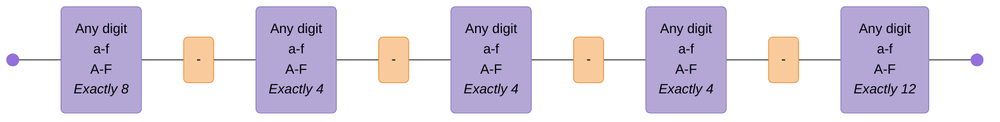

<!-- CONTENT:END -->
