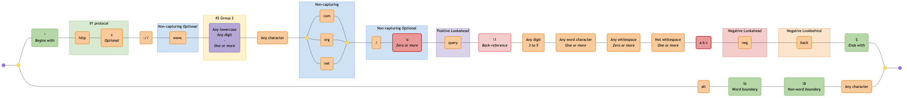
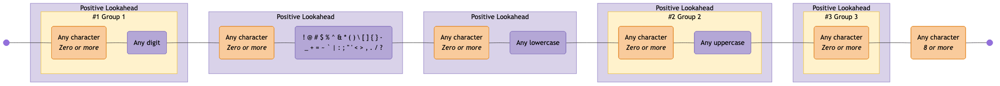
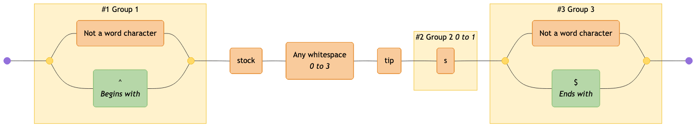

# Examples

Here are some common regular expressions, showing how they are visualized as mermaid diagrams:

> [!TIP]
> If you are viewing this page somewhere that does not render embedded Mermaid diagrams, you can click the "view as image" links below, or view the diagrams by copy/pasting the code blocks below into the [Mermaid Live Editor](https://mermaid.live).

<!-- CONTENT:START -->

## Table of Contents

- [All Possible Tokens](#all-possible-tokens)
- [Comprehensive RegExp Features](#comprehensive-regexp-features)
- [Conventional Commits](#conventional-commits)
- [Cron Schedule](#cron-schedule)
- [Date (ISO 8601)](#date-iso-8601)
- [DateTime (RFC3339)](#datetime-rfc3339)
- [Email Address](#email-address)
- [Email (RFC2822)](#email-rfc2822)
- [HTML Tags](#html-tags)
- [Complex Password Requirements](#complex-password-requirements)
- [Phone Number](#phone-number)
- [Semver](#semver)
- [Stocks](#stocks)
- [URL (RFC3987)](#url-rfc3987)
- [URL](#url)
- [UUID](#uuid)

## All Possible Tokens

An example of all possible token types

### Pattern

```regex
^(?<protocol>https?):\/\/(?:www\.)?([a-z0-9\-]+)\.(?:com|org|net)(?:\/[^\s]*)?(?=query)\1\d{3,5}\w+\s*\S+[^abc](?!neg)(?<!back)$|alt\b\B.
```

### Diagram

[View in Mermaid Live Editor](https://mermaid.live/edit#pako:H4sIAAAAAAACA6VXbVPjNhD-K7pwN0MODLGdNxtKLnHCfbmhnbvOdKYEMn4RiYtjpbLTlAL_vZIsv0h-wbT5ECLt7qNd7a724bnjIg92zM4a27sN-PZ9GQJgu-6vfhxAEyw73-Ea_m2C--PJ5Q6jGLkouNrE8S6adM0l-Zyzr-OJeTgc6M-z7uT41lb-6SkGXSp3J122TTRctH1BeP0SwrhLlszw9p7-ie4-E7PJT3_uIX5i-ir98p7108Er_XU4YWqf6fePk9t723HvjicfQrgmSJcfHNt97H58sYOYKjj0a3a27PBY5jByMY3lKwwhtmPogYMfbwCmoSkxUrYQb23f-6Ke9c761IwafvoEbsjVRPR3FNs4_vIMoo29I7fyoLg-dsHrBZU9-GGNxPOjP_ahG_soXDlw7Ycr1TTNwm4LOxh6La3sKIKY2ajHy879pYOvLv2rGT03YvFenvtXy06XgGWqzDDwY3IrATOjmU10-K6goRGNiAP_vKMAdpCjVlnoxMI8P69X6BMFUjlnZQ13Y-OVGxBfmWfT8AkE6ACxa0eQ-kA3PH_tx3ShpF6FECAMtgjD3DGKpDAk4egBR6Vi2yV7ZR_KGdT-UwbbWaWODYljpFfqL21EFEgj1SuMiQLpsnoFgyhUZIX0E22PlXT3pPP4_f4OMSpfMDdTai5a7REM1trlE2nnrjB8gBiGLuSnqWnxEqGSCfPzHGFfPCutlaw0CI4OYgQGzZWqatzwgLCX10RTXVXC6CnMhuxEO9uFjVdXiUGb4gbFZYw33ahIII3LBg5w2-VqwEqnobZUWp40A2WV_Amih37kTi9Cr-UDROuavuENwDorEIdD_0Zz5aB96Nn4qQ4-N-4z4xk3vkGhcmgDkPk3fuvF4HPjx95h4zSZHXwBQntLM2Pv4j0mlQ5ul50jFaRDddm5o9qF08SlRpfkLUkOyUFJWAmkH64TUBpXtgVKT7V0TL8al0w8eice91MDXzHa74CW2RefiDauaSXXMqiKV7YsYM-o6PpQXI7E5biNV_r7L8xIllVPZfWJOxT5sf8XXAUIPdobaPNL_YXvg2_pfrkGejVB0MMrIG_4fhPkoAWkAzd-WIWZCMqgQwGUtMDCWxeoE1AUpYoO1dEkpl8gNDLBYfLscLFJBZkm8hdBpotMRZD1RZLCZMVMlxiKYD0QeUZN9FodxRCwhiI1KGGxvmiFNBI5xP9AGotkoyUS2xVwDJGTMFlVX9VyE7EOehLrYFKZYFSyDhFHKihJqkm0QZTqEhsQpX1pztdFrNUOcxFvIM1uUTqU5rbUVZo8syvz2Nyj-eiWJrl0li6PcUnelye1iD6W5nBLT9ku0yX_pBXGc_wUJI8T_x-P7dCJRJua3vMcPhSBiHkQmEfX13NjODyNYoweIVmqlqZrp2R2I2we9djnQoDI4uEAs-F8NB1nAIZu9UfzJgAecXq-Yc0MKzNfDA1VHzeZ5xwvdaA_Hc3zCMaLkWXpTQhltsiRFlODfDIky6K2TUgiZ08j6lvkk0fUG5JPCYVnKmEgValizIqP8BR6biymc_0ddx0KLCABsa4X2nUOMiSgi1kTSEqbsoq51grxvV0xKVdQssGehTPXFsZ7M1eF1O7O65ASApBCWYuBNX-rIHn6prtd8MSTaFHspAWTopK5sZDRi4KeSHdPJY55KrM7IakFnAK9TX8WpJWMrZyaol9VhKycgjqLjG9V3PVF5_VfEm8ttKUTAAA=)

<details>
  <summary>Click to view as image</summary>
  <p align="center">
    
  </p>
</details>


---

## Comprehensive RegExp Features

Demonstrates MDN JavaScript RegExp syntax cheatsheet features including character classes (\d \D \w \W \s \S .), assertions (^ $ \b \B), lookahead/lookbehind ((?=) (?!) (?<=) (?<!)), groups (capturing, named, non-capturing), backreferences (\1 \k<name>), quantifiers (? * + {n} {n,} {n,m}), character classes ([abc] [a-z] [^xyz]), and alternation (|)

### Pattern

```regex
^(?<named>[A-Z]\w{2,5}):\s+(a|b|cd)(?:https?:\/\/)?(?<domain>[a-z0-9.-]+)(?=\.com)(?!\.org)(?<=example)(?<!test)[a-z]{1,3}\.com(?:\/\S+)?(?:\?[a-zA-Z0-9&=]+)?(?<digit>\d+)\k<digit>\1\b\B\d+\D+\w+\W+\s+\S+[^xyz]+\t\r\n|alt$
```

### Diagram

[View in Mermaid Live Editor](https://mermaid.live/edit#pako:H4sIAAAAAAACA6VYW3ObOhD-K6rTdpKJSYzAF9xcaoPTl07OmfbMdObErgeDYnNCgAHS3Jr_fiQhZCQuIa4fCGh3v11pV9K3ee44oYs64846tqMN-PptHgBgO84_XuqjMZh3vqE1ehiDn_vnJ4F9i9yzq4ny72KOf_fPsNt_ORiT9-Rw3_69-u24B_vn402aRsk5HT-mj4NzbO2Gt7YXnF3ZylNPMY6UxSHWPSXyIye8xe_v6HsYr_H7ySl6sG8jH5H3dylK0gNiuHhWu9pLbrNf8PH9kDih3-dEEweJvXw8XRxmzr21l54RqXt4QP7cFIZU8liRxzTTIE-LPu_p88dhNsfM0dXPh8enBf1IySMmj-C37afv5x22fBZKnJgs3xcUoNhOkQvuvXQDYrKaShoqtyjGy-F-Vo96RzoxI4YfPoBLnI2EvCepHaefn0GysSOciGvF8WIHvHwismsvqJG4XvLfXeCkXhgsV2jtBUt1PB4XRlvYocBtaWUnCYqpjbo_7_w8WcVnJ97ZlPhN6HxPjr2zeecAg3FVauhs7Hjp-HiQWk6CR3AXRSh27ARl-kRDoRrUwPdSvIw-174PY5ei2A4WMMcQpCHob30yIwEAYoBxvVjL8Td4IIlsBzHsvwIEwhjchjGqdlBeebjTyrezyuPVcbx2_XT6WLyqFw-w2HHr5UMsJ5u5XmOENZJ8iSISsO03J8AgCTg-LisUagKyLPjhfVYTxAMZoHuWfBwBpSkxddXTw8Dk5KgPTyUVRg6hBhUSHjueGrRIKZGDq3GmWtVM8axUUsra6xPSX58QqYHjBjkpgssw3aHkOQSpk_PGeep1GeXbvpTij-B0lxSPmCeO02YmK9u5WcboGsUocBA9ZfA9UECYYgWFK2xBVsJ4FRakWOrbcbaHawaxYhA_yNG3Cu8C144f6w7YrbFGjafM-DIMlPs2AHw9jV3Wk5-2PVZc9o72jed9exjIw_hDoN3vBw6h77zfArQmTGIp3Z4P4BE8NWEwO6Vmy8A-LZGUMpmgIXJyUmCWU9bYVhuZ3HsWyyxwm1gAIzzf71aUemakh30ASjWXjh2ldzHej-Bq3tlTs9F5Z0FURRKRjfCiJZ_4Ms2ccFBMqUjNuwwPgi9xeBcByBEr7vCygF7Soj9d_OyLn4PqaAKMlU3QC9ZZSGR38iFQulIXIu5Q_ByJn0aNV2FhIV0IDWTcvGplYTVMFCZe6v1CSz8Mb-wNstmi_s3Gwdd8vBS22quJjFRpBeQlG2-CVFtEuUIbL6gKMxOUQWGLOIugQqB1oFqbYoBvLwZVKjq1VdVpOzgalmpEb1Nq1NWent0DZdSRgIHPhZm7LjRCQFGUquamrumh-oX2RG5XqLx4gJTaEqrBwxPvREEGxUNSkGlic1EzC1jXQAhYukj8S1j0XGqF1Bd7hD9AGojtREskOirgDMW2Q5CNxIZDkBliayFnFZYaCzGrPak7EKVS0qWKgFJPIEo1qReQI9NKjYBor0s0X5T2JYYvSgcSvxelQ4m6y5HpJeou2o8kuk2lMn-uJNVVmrCSMku7F8p8WJJrMuUVIzYkQivu3p5EWEWpKtFRUSptfbEGoCZRR1GqS6yQSqsYXi31E_H6Eqer3IvN5-WW6Em8T1pvXSZ9LX3RUap77RUZYProZ0c9-_8XHcF3ES1EMlcLXReBsLnvj_cuLixjMOgmaRzeIPypmlCDXSf0w3i816O_TwIEj5gBTAfWcDLiAIZm6kOrCWBLoHMEfTK0tiGMZkPT1JoQ2JrmMzDMqWFy89nAULVRk7nYJuYouol_W5TeAP-aUMr9AEOaTQz840imSWxLSCxTGXmuShW9-BmlyIO0jNnE0t6w1jlZ58m-gIVJvp7sQGA1GYh5MYMX2yAGOKjZtAkkJ5AK56R8OhacGW9IfM4aS0hvzp4QU0Yzefos1dpCmXA4nfRaByVAXZizvmm9VpmsEiZR5D-yejAJdrabs8qSOrmu1IB0ZZYoFM823GLzlr8WpFIz1ZX4dFemvUJ1FHAq-5pyFRQ9V7Ut5WzX-eANREVa67xwm4r8feq8_A-UOxlU0xkAAA==)

<details>
  <summary>Click to view as image</summary>
  <p align="center">
    
  </p>
</details>


---

## Conventional Commits

Validates a RFC3339 DateTime format

### Pattern

```regex
\A(?:(?:^(?P<type>feat|fix|ci|chore|docs|test|style|refactor|build|perf|revert)(?:\((?P<scope>[\w-]+)\))?(?P<breaking>!)?:\s(?P<subject>\b[\w#<> ./\t\\-]{3,}(?:\b|\.))$)(?:(?:(?P<BLANK_LINE>\n^$\n)(?P<body>(?:^.{3,}(?:\b|\.)$\n?){1,3}))?(?P<BLANK_LINE2>\n^$\n)(?:(?P<breaking_change>^BREAKING\sCHANGE:\s[\s\w]+(?:\b|\.)$)\n)?(?:(?P<footer>^\w+:\s[\w#-]+(?:\b|\.))))?\n?|)\Z
```

### Diagram

[View in Mermaid Live Editor](https://mermaid.live/edit#pako:H4sIAAAAAAACA-VaDW-bOBj-KyzZpEZLumDzmVXp0jTtTZt6p-2kk7asFSGkZcsgAnpd1fS_n20I4NdAgEinky7aB7ZfP36__GLnyVPH9pdOZ9S5DazNnfTx09yTJMu2_3SjtTOS5p1Pzq3zizyQz-TodET-XB-d_nESPW6c8cqxou3K_bW13a195wfOdunb4TZywmgbRo9rZxs4K8uO_GC7uHfXy-3GCVak728niHoEiYIeUbTQ9gncV9p-GHx73aMPvd4pHVoEjvXD9W7HL3rxhJBNuF98d-xoTDsW8bzuyVg6fkMfo3nyGXx7wv3nZKHFlv573Ou97MV2UJyzj5OrDzcf31_NGJR3_ZL912Mr-8vHMbX3uAAlljvtPcl9_JyomoEhiDbKm3Jj31nerTO-Pvs0m3x4f3XJzJr-Nrm6nMUmMotCZta313DlXgx6mqCufD9ygvE1k36dm__QHQiTyec01nzLYL7MO0nAz53QDmjALx3PCazIWUoPbnQnBTT-g8gf_HSCn5a7fCcfD48VOo1OfPVKuiL5E9LnMLKC6N2TFN5ZG5I6q4HtBrb0_JaOrVyvZGTtEu2t9Y18NO9M5p3eaDRKutjw0g2_33t25PrezcK5db0bmUjkektg8_Mcb1lzlhWGJDXpHKrONYnY-MQdn9F1Q-aOkzfuOFYyFS1RE7VSs96snc8QUZLuQdFtOwlMJdxf5QIKEbDd8nGVjtOtXS6iERG678sldCJBi0K5hEEkWMUoFzGJyK6clEvJQyLGik2FDA0uLUUVIoitRgtVhRD17pE4TrZ3cGOvSYawNCI7URokqfS750h-IP0kDs1SicoPmDwPT2PTq1iexuZFxTgNzIjWEUEky3PEFFwk6v3lB0tp4d97Syt4LMv1nHkoMa8rnUhj6fPGsh3pWHpD3hYR-ZtajffaLO4f3Gr_4IbbHDc3P3UvzeqJ98j8QbLSCar8TGP5Mllm5i2rq0m6BN0WV87D2vWcKnC1WbHKJmqttDLraaU30yotakPo1_Isqn5TKK1SSGmYQkb7FEJykxQy2wQLoSxYuxq0oVLWutiN6URcL8qs4LZKPlaGmxuk1NQLtUw_upmyg1l2LAsrC31cSEJS9R4alHoxZ9VWOas2Pd0cUPeQ1iRp5VaFD-k1g6y2DLKR2PBALYeFpjByhXvELH3D5lJDSV-Sg4NSQ2uVGlrT1NDapwYe7k-NVFZuWZgw3dhf4HhyGfl8v2AX2fhCkjTozYTqT24B0td5pytLl4F_v5HkeecblSs8vosD7Hwed6cJwDcx31T4pso3Nb6p802Db5p8Ux6CtgzaTDGicOwY0RGIOQIljkCpI_JH12IIj3jCtjbRfUBvspjiXPneIO2ShEAm0NnaQFfgNVnZoztbs4sT3XHpgtk5uY4limBJRXbg4uxIunPHS6CJvsc0pkRXSUxTUg2AqnAZJAQP1TEZlZuc7Zji4IEsAEK4QuvMVmgFzGENCuxLDJV5T028p4qJYEBEFXaATSmbdfxoNEkdpTh1BG-AAoBqbUe9cDvKUuRLmNsbwAC4OChGaAgFQD1C--qNxkKjJaHRqvUANtUxXGtRh9RmKuRmanusZWHo6om1upCISCgUsuBhWNKRUscP8rBJLqrFuSjsClii0T4HsB3RNRIHGCXhLjAavl9VobKJrqvlGLN-ghQrmdkGVKyVnzJqEhetOC5CQZRBucLDPXFhXuiaSVzMMpORsBA4uyDoBFOIU710lcvdUqxTZkodfPXfLwtQSANCepMkAzlc3zGCVK3Xh_xfOBCAM8r_JzqwVy0rD3JxeQAvDMyHnFyOZsvbHFMjDQaD7KDDf8PHxgoWLqNkmHyuXMA7ZQkeKuNOON0Qf-cWsNi9rBYS5i-SByApPIlyAJLK0y0HIGk8K3MAks6zNwcgGTzLcwCSyZNBByDJQ8AYHYIFNo58CBYCFFRNLNbLI2HAU7HR_N1e4Kn4-QogovhRFdBQ_KgGSChQGxAkoKBuSCCZSqoHLmOOwIoYcj6Ffq1Gy27wgAOqicV6gV4KpIj4lQxABYHZKuSAwLgGqR4e3QSUDpitQy6Hr8hDwNiUREgpI2bAagakVAq9Wo2WXZQBxVITi_UCvUzIwPArgRcTeGthQKfAd-RQIFKghPAa5XcpUgAxAucjgRLh56uA-IA7EQskR0mc1TIyA2qEBR6iMDrVeNktFPASNbFYL9RMEXgLfi0d8BNwviowE_x8A_AP_KgJaAUYCUXgFEoioZVxB1BfTfjav9B71XjZvRPQADWxWC-PJAOSoBBJLv6JD4-EAGvARleulyML6A9OwtzPmFgPvfVQZ1M_nzurHQKZul6Puhfm9Myc9sMo8H84o-5MM2Vs9G1_7Qej7pB93nLTc1ruIC7OTU1LIS7kKcKoCiKNUgJwpp3rEyMFMPFU0c-rADJqaYegTPTzTAVjpk-nWEBIPBN_WVDkmt2tJjXsAk2nDQzzuJt5DDK9mKELnIJo5-Zsdlam2mSzWT8mCk4pahzO2NTsytrPbqvZI84elexRzR617FHPHo1-7tuU3WNmFrwI98GdF7QRaBugrYO21odXU9BhQgG4giyDDhUK8GF523n-B1WiZoMkKgAA)

<details>
  <summary>Click to view as image</summary>
  <p align="center">
    
  </p>
</details>


---

## Cron Schedule

Validates CRON pattern (Quartz) and supports groups

### Pattern

```regex
^\s*($|#|\w+\s*=|(?<SECOND>(?:\?|\*|(?:(?<START_SEC>[0-5]?\d)(?:(?<DELIMITER_SEC>\-|\/|\,)(?<END_SEC>[0-6]?\d))*)))\s+(?<MINUTE>(?:\?|\*|(?:(?<START_MIN>[0-5]?\d)(?:(?<DELIMITER_MIN>\-|\/|\,)(?<END_MIN>[0-6]?\d))*)))\s+(?<HOUR>(?:\?|\*|(?:(?<START_HR>[0-2]?\d)(?:(?<DELIMITER_HR>\-|\/|\,)(?<END_HR>[0-2]?\d))*)))\s+(?<DAYOFMONTH>\?|\*|(?:(?<START_DOM>L|W|LW|[1-3]?\dW?)(?:(?<DELIMITER_DOM>\-|\/|\,)(?<END_DOM>[1-3]?\d?W?))*))\s+(?<MONTH>\*|(?:(?<START_MON>[1-9]|1[012]|JAN|FEB|MAR|APR|MAY|JUN|JUL|AUG|SEP|OCT|NOV|DEC)(?:(?<DELIMITER_MON>\-|\/|\,)(?<END_MON>[1-9]|1[012]|JAN|FEB|MAR|APR|MAY|JUN|JUL|AUG|SEP|OCT|NOV|DEC))*))\s+(?<DAYOFWEEK>\?|\*|(?:(?<START_DOW>[1-7]|SUN|MON|TUE|WED|THU|FRI|SAT)(?:(?:(?:(?<DELIMITER_DOW>\/|\,|\#)(?<END_DOW>[1-7]|SUN|MON|TUE|WED|THU|FRI|SAT))*)L?)*))(?:|\s)+(?<YEAR>(?:\*|(?:(?<START_YR>\b(?:[1-2](?:9|0)\d\d)\b)(?:(?<DELIMITER_YR>\-|\/|\,)(?<END_YR>\b(?:[1-9]|[1-9][0-9]|1[0-8][0-9]|19[0-2])\b|\b(?:[1-2](?:9|0)\d\d)\b))*))))$
```

### Diagram

[View in Mermaid Live Editor](https://mermaid.live/edit#pako:H4sIAAAAAAACA-VdCXPURhb-KyoTqjDBibqlbqkNsXfwjDnW2JSPuLyYUMYewLvGdo1NZalM_vuqpbn660NPEgFqQxFj9fG916_fa_WlL38snV6dDZdWl96PTq4_RFu7x5dRdHJ6un9-ezFcjY6Xdofvh_9djX47Lv7c3L_3w_jOWP_6-49Vwi_je-uP9gYbO9v9tXvrqzpxvSxwv8hY1Xn7vd39N0WJtVfxini9rvPOlqu8_mDr2Ytn-4PdMl_nrJR1fy5_PihKPRps96eV5bTy8v3l5eVS_I9FiRfPtg_2ByHhRYmgcJ3vFT6p7BH-dOdgNyT66a6uzH2Si2yvYKhqyu33jnY2X-xs7z9d84nu77xY2xofjrcOx6_YSjLBOVy3lNAFvVrozIXq60V9rcnc-jMdwOY727qeej1mr2LGX4-f97bHm4PH4xe93XHv5W7x79H4-cF28d_WuHfwZLw3eDne2dgfb-_8Ou4PNuxO2gl1UldpRptK4x4OBv8M2PZQy8tej_cK0EL6eP9gMD4c9Mf7Tw_Gm7vPxnu9_aoJq7a5D9cWmlD-vDM3NwW40HZrXatcYJf1b5a13keD3swZTX2PKj97W6QV6Px18a8ax2WLzyr3KrMtox8F_NPELExf_ixctuqFlXz6uyrduJIwJqlR-vryD8dLk8GoP7w5HenB6Mnwcjg6uR2eRb-f336IRnpsWrm9Wvk4HH08OT_7B_sp_inV1XTFu3ej7WJsu9G_39yejG7_8Ud08-HkuhjW3q2cno9Ooz8f6rx355eenJObm-Ho9vzq8g27d7z026O3o7VH52uPh-_PL29KDR79fL52vLS8uro6K1pWvDi_LfS8KKv1Lj9Hv38oEm6uT06HE4x_DUdX0dUo-ng1Gs5BJtVKiLPzm39_ujwtpb_VEt-wosRCqkfnxXrDyzNirXlLeaHyDxMtB5dntHbqSnfsNkyzk6kZrkZn0emHk9HJaZExEbJzOQxbYoqStjfmFEIUEL9QbM1b2ZpWa6qMLJRZ9-uaFdn37WxtvjenF0U_lN5VvNamdrzWMk8u5hbQRVfKogZwPrHj2fn781uKMZJWxkgaGUMVSq34jcHiIv_nQL62xYOgtXhpLdnUWoyHzTUrl_jcs9bBbYunrSyeNrI4S8P-x0StAybtHJDJph4oWtlDNLNHVuOCeY0LqloXTNu5II9pLsjZF3RB2crkspHJOQ-7IE9qXVCUJuWNTZo2dcGslT2yZvYQYRfkMuyCPKt1QdnSXjnRBdUXdMG8lcnzRiZP4rALJsztgra2qpW2qpm2OmC2AtrqgDkM5Gu33zoMeoj2oWLB19RDEkHzkER74KEXvWYKHLebA8fNrFzzJkhq3gRJ_Zsgb2fk1HgTkIw4q8rIdp9V4V8wmFnL5Qtr1HVpQg1X1m6KT6y20NWq7GoV7lcdlyw82dddH0cs4mEkHYbPe9uBXtUBuDl4HCih_f9FbzdQonwdvAyVUCXGUWAtphv0_CCgqWBlicB4J0oPPXgSKKEdYm_wMlBC235nYz9QQtt0e-fXQAlt0_5gg-R47ZZTrNl6StSMYaJmDBOeMczRnnaLFWK1xQhghEiScX0kcVIkSVYXSZLXRZJM6iJJpnWRJEVdJElZF0kyq4skmddFklR1kZTFdZGUsbpIyrgvkmYlvuRCm7VbWbJmS8usZqmdCfJbq92yjFhtMUiSMtiyYIhk2vH2Qo6Xla-SnVAJ7Xj7B4NACe14h4O-v0SuHW__6UGghHa8zd1ngRLa8fZ6-6ReaLcYZM1Wg3kSHqLz1D1Ez_KFe1fW0Z52Ky1itUWvSgleldd6VV7rVXmtV-W1XqVqvUrVepXyetWshO7lrbbroXaLTtZs1ansnXfSHnq7xRpvtlhTnrFzfqKhDXx8_HZi4kN9BvH26tPl2cnos-9cY9FlRemy7rmCo9Htljm82TJH6RBRAafSARIH8vPSJmf6b8ByaXPLOSzS8iyl2WGKqj1AqDtBiBl1xsvbzeCJ1ebmF1_E_O2m57z59FwGpueL5TJiOceWo-9AIeb1s35V7nzmdWJdm-1eseUkSYWPnapTOvf4Me9r2byv55WzTiNcuQvfYIRrN2XmDU9j4jQ8xLFYhMc4FkvSIJd3sbyin5ZPriTsfXpbXrWqriVMHqLLk4_DszenJ9e3n0bDNzx6Vczckmh2d-p46bUubjp0lTKbz-jHwtCVIA9wUgKnkXHxagbuOPm1M8qjXVO0Mh9ZDM-MolpaqiaiyYUvV4s54HIPbqFlhXp--b5q8vbV5cosKXJeGZiIA3u5ElOKWG6J9YjgzeRG2DyKMuxrKoOJ3Odc3O1c0MvSfMwovlS29w6PqnuJX7-tYH2KyrJUOYtmNxZdAQBxxyQFOSuR88i47xiIeeHuFgGyM3jO4VlRdMtL3VQ0uWjpanNq4vKY4vCyS9BnrsScIlZQ40w2k4seJSnKpF9TGUwUPu9K3d4FvczwWVC8qTT_HRlVN4K_fmvB_qSRKi51Ziya3hd2xQDEHqdBV6Mg49HifeNA4GfuroFA56gMDNCcNkJXUxyWRNVVZ1erEZgUgqpL5DPmTCXNM3JquE2nR3TR6FmKok_2lfXBxNznZtLtZtjbMA3gCcWtVOVVcaTv5X-T9kInkGKhmvoyEc0u7geiVLnNB3PwBMyXwNQhSa1wgzhPIM4T0mSDVWMwk5HxfUGgPdPusO9sgHzUDyYcCWnCwap5FsuiyccNroEHkFPQJGWkOTfrNBIJZyrpxV-9U0ihnzaVbc1tSZNbVq07C0eff7fyF6tkpcY-B8zd_ofuhe5Ia3g1wWUqmn0VEwoFz4pomr54qQRc0g5njJ8U4jmFATeF-EoxCkCkAHwB-xECRiABI5CAKZ4A_QRtvKlGfB5HxpdCISN79jQY6gf2EGAPQRpveDW_4yyafKYU0swzN2aOzgVjy9gugutorIL50H4J_SOhfyT4jwR7SbCXBP_JwH8y0C8jzbpYp-0dppwbA6QlJiPv8EyXxnTZ1uBFmvywaqVfjDnBAfYLaWOlevd5ps5qX-2DEYbUSl6tHHgymy0dhmLKM9ucphs3HsABcecJHDwDB8_AwXNw8Bw3bDmpudWrk6fGhCrYZM86DndscmhvDgGfk9bcvJq8cjGZUAU187xqp-nGRQFQBjojx8ZAZ-TQGQo6Q0FnKNpok3UZbbhzc5GTtpOZJG_hBqRYMZuRZIu_qtVufaxU6HtF2_Mm739x_tfqjdYkhdVkC5tHs4-RvyPtrdTUG_Ke3WQGs4kM4j0TpD7OnZ5p3QP0j0ie1TTD4YN25hOYErhuinjOP3BoQvcnBS0PnfmA1vboC72jSIeLvFpb8-khxtFujUTUuEpduLiDCaR9T15Ng_jiicdRaN-T-w6iYIasrHNOPOiMSTsDPG3kJp5VAXesChyTmsxOwpOa2OEAyj58tRqb2GVo7ZeN2u8ZQXAfmsV4ZhCTxhAuyIFimxddhMWkVSuvtgV4dfDlj5M0pAY2w2tAz4KXW-ElMEFiQoYJpD153mmRxrMvZRvsBJLucdNx1D2q4VD59VtqlaVNo9T_d_utVO8-IfdsVOPAqGgTvGqjvBgLNWvL38Kk6FhuM93cnui7V2eTSxwsejK6-nQdse_iFoe1bfLtT5gRU3wXZ14Iqr7FXj8eQnyL7TDcovvel3C4DHWWzf-eg5WF651z-XY8cfqEh9xwxgT7o3AAAVNPKI3LSI5HRiAsM6cDd-9Gg7P3C-RZ0crKyiIhFhJklfkzZcybuGWew0q-r1pAFkeKKguvNG4QbWYGk66iA1JifvNv5KXmt9BGnjC_s22hgWNu4rurbUiW5vecTsk0pMz8QK8F0uJi07qqb8jKzc-2PBZIfNxVBpYyvxlx6k1DYjFcNu-CBeHCiFhlKlqTW9f7TVkc2K2IfVemmkgJ8F95eib1cVyZaCmQUzn1ImIJILJqgbV469aivTKlSSC38thB-LitTLQMSKmcuhOxciCw6oKlgOyKiFWmokVTixjLHKNjoL8i9l-ZaiIxIMjy9I30kWCZaPDycMcOESsBpqsWWIs3RC1eLFNaCuxXHjtkPvIrE00Aa5VTdyKWBIarLlgZsGERscpUtKi0mLNMWTnwYxH7r0w1kRQwaHn6JvexZJmzkhjorZx6EbEYUGG1wHJcYPTxZ5myORBfOWUTsWCqlnTBSoFQqwXW4qVLi33LlCaAY8vMlcCsRdSlTPXNyWMv9ZYpOwPKLPc8loqWA8FWNzQFdFxUtCoZ-yi3yLvMuX4MFF1mLgMWLmIMlakmEgdyLl8PehcP5rw6TYA5y22lGjTXLUYv4xZaVllcWW4dahDntyCBVMtaacQ2q1Y3iQLIt7qhSSDq6oaWAalXN7QcCMC6oSkgC-uEJmIgFuuGxoCErBsaB8KybmgJkJt1Q0uBCK0bGmxsdIsFIYFgjYpWJfvGpsRLymZKz4BMzS2dipYD9Vo3NAVEbVS0KtlnmdRL72aNovaGjSdGajDnt5eBws2SyG0Ot24SGVC9dUPjQAvXDS0BCrluaCnQzXVDE0BN1w0NNiRlN7QMKO-6oeVAj9cNTQGVXie0LAbavW5oDCj6uqFxoPOjolXJ1DlolWxKToAm0DfSCS8XoImXAoefWzcqmgDGv1ZorgvuXqZAaxRNbJI_txY1mPMb8sAG2A0NDhWybmg5sAx2Q1PASNgJLY-BvbAbGgOmw25oHFgRqWhVss9LMy-Toik9AQZEt3QqWgp8id3QBLArUtGqZJ9lci8noxW_qU2n6NahBnP-UQXwLnZDy4CjsRsaHPvl3dAUcD92QlMx8ER2Q2PAKdkNjQP_JBWtSjaxEmCqpL6zqmSfxysvmaUpPQUSSrd05WG49J2Ux162SlO6AJZJ9zlpDdrCXXYkpbSiW9jMk742MC_5pNkGCaSR7jZQ0TKgmKSiVckmVg50lGCtFIkofZbwXjIwdxMUHPy745-KxmI8_I874jGkoqTiVck-6yReAkuwt0DmSR9i6mWZtPxZ2gSR7lY1wMxsMkmrTG4TSbaSu_B9BJJNWjKVzTZp3cuIbabJjnolyEZpyWQ2GyVVZpUMfiKRtdKNRva7DIksrRbY11m83i68hJVgtxSZJt2tIOMJJKak4lXJgCaRxRJsliN_JbUPqmTqe6xKJt5OK1NBT4VUmWX-u_NFLszbzxfVFcPJ_6uzTNGfGOg-193dH76bQxSVLy5W7zyW_ayXP7i5HV39Z7h6RyUbadZ_cHp1cTVavROXfx4aABNbTqpvqo3HamNWfSAVS_JQ9YWGTiE2-0rKGcQm2-AJD0HMSVWnbUh7WX-OkA-yjY3EQphYproB7zJNeR918mXGcALdV4NeP2lgnkvjw5wKZGNzwDfnILIAHTwOgUyv7c8stMk3NuosNGlf7_r64vOklRsasPKJyl5w5fYB3PSH5xSeGTxLeM7gOYdngXgxJqAEhioqLGDpaAlBLRk2k6GeDKVwS1FsKkdFOUrhqCnHxnLUlFtSUNNivDO89uFCV5ufZjyAm9nwzOBZwrOA5xSeFTzn8JyhPBSofQG-BMAES2cLFLVmqDZDvRkqylEKR005YnAUy1Est8xvtVaZI8dCRy58wzP99eHSn_8DCekCumt-AAA=)

<details>
  <summary>Click to view as image</summary>
  <p align="center">
    
  </p>
</details>

```mermaid
graph LR
  accTitle: "Regex: ^\\s*($|#|\\w+\\s*=|(?<SECOND>(?:\\?|\\*|(?:(?<START_SEC>[0-5]?\\d)(?:(?<DELIMITER_SEC>\\-|\\/|\\,)(?<END_SEC>[0-6]?\\d))*)))\\s+(?<MINUTE>(?:\\?|\\*|(?:(?<START_MIN>[0-5]?\\d)(?:(?<DELIMITER_MIN>\\-|\\/|\\,)(?<END_MIN>[0-6]?\\d))*)))\\s+(?<HOUR>(?:\\?|\\*|(?:(?<START_HR>[0-2]?\\d)(?:(?<DELIMITER_HR>\\-|\\/|\\,)(?<END_HR>[0-2]?\\d))*)))\\s+(?<DAYOFMONTH>\\?|\\*|(?:(?<START_DOM>L|W|LW|[1-3]?\\dW?)(?:(?<DELIMITER_DOM>\\-|\\/|\\,)(?<END_DOM>[1-3]?\\d?W?))*))\\s+(?<MONTH>\\*|(?:(?<START_MON>[1-9]|1[012]|JAN|FEB|MAR|APR|MAY|JUN|JUL|AUG|SEP|OCT|NOV|DEC)(?:(?<DELIMITER_MON>\\-|\\/|\\,)(?<END_MON>[1-9]|1[012]|JAN|FEB|MAR|APR|MAY|JUN|JUL|AUG|SEP|OCT|NOV|DEC))*))\\s+(?<DAYOFWEEK>\\?|\\*|(?:(?<START_DOW>[1-7]|SUN|MON|TUE|WED|THU|FRI|SAT)(?:(?:(?:(?<DELIMITER_DOW>\\/|\\,|\\#)(?<END_DOW>[1-7]|SUN|MON|TUE|WED|THU|FRI|SAT))*)L?)*))(?:|\\s)+(?<YEAR>(?:\\*|(?:(?<START_YR>\\b(?:[1-2](?:9|0)\\d\\d)\\b)(?:(?<DELIMITER_YR>\\-|\\/|\\,)(?<END_YR>\\b(?:[1-9]|[1-9][0-9]|1[0-8][0-9]|19[0-2])\\b|\\b(?:[1-2](?:9|0)\\d\\d)\\b))*))))$"
  accDescr: "Generated with regex-to-mermaid@1.0.4"

  %% Nodes
  start@{ shape: f-circ };
  fin@{ shape: f-circ };
  assertion_1("^<br><i>Begins with</i>"):::assertion;
  literal_1("Any whitespace<br><i>Zero or more</i>"):::literal;
  disjunction_begin_1:::disjunction@{ shape: f-circ };
  disjunction_end_1:::disjunction@{ shape: f-circ };
  assertion_2("$<br><i>Ends with</i>"):::assertion;
  literal_2("#"):::literal;
  literal_3("Any word character<br><i>One or more</i>"):::literal;
  literal_4("Any whitespace<br><i>Zero or more</i>"):::literal;
  literal_5("="):::literal;
  disjunction_begin_2:::disjunction@{ shape: f-circ };
  disjunction_end_2:::disjunction@{ shape: f-circ };
  literal_6("?"):::literal;
  literal_7("*"):::literal;
  char_class_1("0-5<br><i>Optional</i>"):::char-class;
  literal_8("Any digit"):::literal;
  disjunction_begin_3:::disjunction@{ shape: f-circ };
  disjunction_end_3:::disjunction@{ shape: f-circ };
  literal_9("-"):::literal;
  literal_10("/"):::literal;
  literal_11(","):::literal;
  char_class_2("0-6<br><i>Optional</i>"):::char-class;
  literal_12("Any digit"):::literal;
  literal_13("Any whitespace<br><i>One or more</i>"):::literal;
  disjunction_begin_4:::disjunction@{ shape: f-circ };
  disjunction_end_4:::disjunction@{ shape: f-circ };
  literal_14("?"):::literal;
  literal_15("*"):::literal;
  char_class_3("0-5<br><i>Optional</i>"):::char-class;
  literal_16("Any digit"):::literal;
  disjunction_begin_5:::disjunction@{ shape: f-circ };
  disjunction_end_5:::disjunction@{ shape: f-circ };
  literal_17("-"):::literal;
  literal_18("/"):::literal;
  literal_19(","):::literal;
  char_class_4("0-6<br><i>Optional</i>"):::char-class;
  literal_20("Any digit"):::literal;
  literal_21("Any whitespace<br><i>One or more</i>"):::literal;
  disjunction_begin_6:::disjunction@{ shape: f-circ };
  disjunction_end_6:::disjunction@{ shape: f-circ };
  literal_22("?"):::literal;
  literal_23("*"):::literal;
  char_class_5("0-2<br><i>Optional</i>"):::char-class;
  literal_24("Any digit"):::literal;
  disjunction_begin_7:::disjunction@{ shape: f-circ };
  disjunction_end_7:::disjunction@{ shape: f-circ };
  literal_25("-"):::literal;
  literal_26("/"):::literal;
  literal_27(","):::literal;
  char_class_6("0-2<br><i>Optional</i>"):::char-class;
  literal_28("Any digit"):::literal;
  literal_29("Any whitespace<br><i>One or more</i>"):::literal;
  disjunction_begin_8:::disjunction@{ shape: f-circ };
  disjunction_end_8:::disjunction@{ shape: f-circ };
  literal_30("?"):::literal;
  literal_31("*"):::literal;
  disjunction_begin_9:::disjunction@{ shape: f-circ };
  disjunction_end_9:::disjunction@{ shape: f-circ };
  literal_32("L"):::literal;
  literal_33("W"):::literal;
  literal_34("LW"):::literal;
  char_class_7("1-3<br><i>Optional</i>"):::char-class;
  literal_35("Any digit"):::literal;
  literal_36("W<br><i>Optional</i>"):::literal;
  disjunction_begin_10:::disjunction@{ shape: f-circ };
  disjunction_end_10:::disjunction@{ shape: f-circ };
  literal_37("-"):::literal;
  literal_38("/"):::literal;
  literal_39(","):::literal;
  char_class_8("1-3<br><i>Optional</i>"):::char-class;
  literal_40("Any digit<br><i>Optional</i>"):::literal;
  literal_41("W<br><i>Optional</i>"):::literal;
  literal_42("Any whitespace<br><i>One or more</i>"):::literal;
  disjunction_begin_11:::disjunction@{ shape: f-circ };
  disjunction_end_11:::disjunction@{ shape: f-circ };
  literal_43("*"):::literal;
  disjunction_begin_12:::disjunction@{ shape: f-circ };
  disjunction_end_12:::disjunction@{ shape: f-circ };
  char_class_9("1-9"):::char-class;
  literal_44("1"):::literal;
  char_class_10("0 1 2"):::char-class;
  literal_45("JAN"):::literal;
  literal_46("FEB"):::literal;
  literal_47("MAR"):::literal;
  literal_48("APR"):::literal;
  literal_49("MAY"):::literal;
  literal_50("JUN"):::literal;
  literal_51("JUL"):::literal;
  literal_52("AUG"):::literal;
  literal_53("SEP"):::literal;
  literal_54("OCT"):::literal;
  literal_55("NOV"):::literal;
  literal_56("DEC"):::literal;
  disjunction_begin_13:::disjunction@{ shape: f-circ };
  disjunction_end_13:::disjunction@{ shape: f-circ };
  literal_57("-"):::literal;
  literal_58("/"):::literal;
  literal_59(","):::literal;
  disjunction_begin_14:::disjunction@{ shape: f-circ };
  disjunction_end_14:::disjunction@{ shape: f-circ };
  char_class_11("1-9"):::char-class;
  literal_60("1"):::literal;
  char_class_12("0 1 2"):::char-class;
  literal_61("JAN"):::literal;
  literal_62("FEB"):::literal;
  literal_63("MAR"):::literal;
  literal_64("APR"):::literal;
  literal_65("MAY"):::literal;
  literal_66("JUN"):::literal;
  literal_67("JUL"):::literal;
  literal_68("AUG"):::literal;
  literal_69("SEP"):::literal;
  literal_70("OCT"):::literal;
  literal_71("NOV"):::literal;
  literal_72("DEC"):::literal;
  literal_73("Any whitespace<br><i>One or more</i>"):::literal;
  disjunction_begin_15:::disjunction@{ shape: f-circ };
  disjunction_end_15:::disjunction@{ shape: f-circ };
  literal_74("?"):::literal;
  literal_75("*"):::literal;
  disjunction_begin_16:::disjunction@{ shape: f-circ };
  disjunction_end_16:::disjunction@{ shape: f-circ };
  char_class_13("1-7"):::char-class;
  literal_76("SUN"):::literal;
  literal_77("MON"):::literal;
  literal_78("TUE"):::literal;
  literal_79("WED"):::literal;
  literal_80("THU"):::literal;
  literal_81("FRI"):::literal;
  literal_82("SAT"):::literal;
  disjunction_begin_17:::disjunction@{ shape: f-circ };
  disjunction_end_17:::disjunction@{ shape: f-circ };
  literal_83("/"):::literal;
  literal_84(","):::literal;
  literal_85("#"):::literal;
  disjunction_begin_18:::disjunction@{ shape: f-circ };
  disjunction_end_18:::disjunction@{ shape: f-circ };
  char_class_14("1-7"):::char-class;
  literal_86("SUN"):::literal;
  literal_87("MON"):::literal;
  literal_88("TUE"):::literal;
  literal_89("WED"):::literal;
  literal_90("THU"):::literal;
  literal_91("FRI"):::literal;
  literal_92("SAT"):::literal;
  literal_93("L<br><i>Optional</i>"):::literal;
  disjunction_begin_19:::disjunction@{ shape: f-circ };
  disjunction_end_19:::disjunction@{ shape: f-circ };
  literal_94("Any whitespace"):::literal;
  disjunction_begin_20:::disjunction@{ shape: f-circ };
  disjunction_end_20:::disjunction@{ shape: f-circ };
  literal_95("*"):::literal;
  assertion_3("\b<br><i>Word boundary</i>"):::assertion;
  char_class_15("1-2"):::char-class;
  disjunction_begin_21:::disjunction@{ shape: f-circ };
  disjunction_end_21:::disjunction@{ shape: f-circ };
  literal_96("9"):::literal;
  literal_97("0"):::literal;
  literal_98("\d\d"):::literal;
  assertion_4("\b<br><i>Word boundary</i>"):::assertion;
  disjunction_begin_22:::disjunction@{ shape: f-circ };
  disjunction_end_22:::disjunction@{ shape: f-circ };
  literal_99("-"):::literal;
  literal_100("/"):::literal;
  literal_101(","):::literal;
  disjunction_begin_23:::disjunction@{ shape: f-circ };
  disjunction_end_23:::disjunction@{ shape: f-circ };
  assertion_5("\b<br><i>Word boundary</i>"):::assertion;
  disjunction_begin_24:::disjunction@{ shape: f-circ };
  disjunction_end_24:::disjunction@{ shape: f-circ };
  char_class_16("1-9"):::char-class;
  char_class_17("1-9"):::char-class;
  char_class_18("Any digit"):::char-class;
  literal_102("1"):::literal;
  char_class_19("0-8"):::char-class;
  char_class_20("Any digit"):::char-class;
  literal_103("19"):::literal;
  char_class_21("0-2"):::char-class;
  assertion_6("\b<br><i>Word boundary</i>"):::assertion;
  assertion_7("\b<br><i>Word boundary</i>"):::assertion;
  char_class_22("1-2"):::char-class;
  disjunction_begin_25:::disjunction@{ shape: f-circ };
  disjunction_end_25:::disjunction@{ shape: f-circ };
  literal_104("9"):::literal;
  literal_105("0"):::literal;
  literal_106("\d\d"):::literal;
  assertion_8("\b<br><i>Word boundary</i>"):::assertion;
  assertion_9("$<br><i>Ends with</i>"):::assertion;

  %% Subgraphs
  subgraph named_capture_2 ["#3 START_SEC"]
    char_class_1
    literal_8
  end

  subgraph named_capture_3 ["#4 DELIMITER_SEC"]
    disjunction_begin_3
    disjunction_end_3
    literal_9
    literal_10
    literal_11
  end

  subgraph named_capture_4 ["#5 END_SEC"]
    char_class_2
    literal_12
  end

  subgraph non_capturing_3 ["Non-capturing <i>Zero or more</i>"]
    named_capture_3
    named_capture_4
  end

  subgraph non_capturing_2 ["Non-capturing"]
    named_capture_2
    named_capture_3
    named_capture_4
    non_capturing_3
  end

  subgraph non_capturing_1 ["Non-capturing"]
    named_capture_2
    named_capture_3
    named_capture_4
    non_capturing_3
    non_capturing_2
    disjunction_begin_2
    disjunction_end_2
    literal_6
    literal_7
  end

  subgraph named_capture_1 ["#2 SECOND"]
    named_capture_2
    named_capture_3
    named_capture_4
    non_capturing_3
    non_capturing_2
    non_capturing_1
  end

  subgraph named_capture_6 ["#7 START_MIN"]
    char_class_3
    literal_16
  end

  subgraph named_capture_7 ["#8 DELIMITER_MIN"]
    disjunction_begin_5
    disjunction_end_5
    literal_17
    literal_18
    literal_19
  end

  subgraph named_capture_8 ["#9 END_MIN"]
    char_class_4
    literal_20
  end

  subgraph non_capturing_6 ["Non-capturing <i>Zero or more</i>"]
    named_capture_7
    named_capture_8
  end

  subgraph non_capturing_5 ["Non-capturing"]
    named_capture_6
    named_capture_7
    named_capture_8
    non_capturing_6
  end

  subgraph non_capturing_4 ["Non-capturing"]
    named_capture_6
    named_capture_7
    named_capture_8
    non_capturing_6
    non_capturing_5
    disjunction_begin_4
    disjunction_end_4
    literal_14
    literal_15
  end

  subgraph named_capture_5 ["#6 MINUTE"]
    named_capture_6
    named_capture_7
    named_capture_8
    non_capturing_6
    non_capturing_5
    non_capturing_4
  end

  subgraph named_capture_10 ["#11 START_HR"]
    char_class_5
    literal_24
  end

  subgraph named_capture_11 ["#12 DELIMITER_HR"]
    disjunction_begin_7
    disjunction_end_7
    literal_25
    literal_26
    literal_27
  end

  subgraph named_capture_12 ["#13 END_HR"]
    char_class_6
    literal_28
  end

  subgraph non_capturing_9 ["Non-capturing <i>Zero or more</i>"]
    named_capture_11
    named_capture_12
  end

  subgraph non_capturing_8 ["Non-capturing"]
    named_capture_10
    named_capture_11
    named_capture_12
    non_capturing_9
  end

  subgraph non_capturing_7 ["Non-capturing"]
    named_capture_10
    named_capture_11
    named_capture_12
    non_capturing_9
    non_capturing_8
    disjunction_begin_6
    disjunction_end_6
    literal_22
    literal_23
  end

  subgraph named_capture_9 ["#10 HOUR"]
    named_capture_10
    named_capture_11
    named_capture_12
    non_capturing_9
    non_capturing_8
    non_capturing_7
  end

  subgraph named_capture_14 ["#15 START_DOM"]
    disjunction_begin_9
    disjunction_end_9
    literal_32
    literal_33
    literal_34
    char_class_7
    literal_35
    literal_36
  end

  subgraph named_capture_15 ["#16 DELIMITER_DOM"]
    disjunction_begin_10
    disjunction_end_10
    literal_37
    literal_38
    literal_39
  end

  subgraph named_capture_16 ["#17 END_DOM"]
    char_class_8
    literal_40
    literal_41
  end

  subgraph non_capturing_11 ["Non-capturing <i>Zero or more</i>"]
    named_capture_15
    named_capture_16
  end

  subgraph non_capturing_10 ["Non-capturing"]
    named_capture_14
    named_capture_15
    named_capture_16
    non_capturing_11
  end

  subgraph named_capture_13 ["#14 DAYOFMONTH"]
    named_capture_14
    named_capture_15
    named_capture_16
    non_capturing_11
    non_capturing_10
    disjunction_begin_8
    disjunction_end_8
    literal_30
    literal_31
  end

  subgraph named_capture_18 ["#19 START_MON"]
    disjunction_begin_12
    disjunction_end_12
    char_class_9
    literal_44
    char_class_10
    literal_45
    literal_46
    literal_47
    literal_48
    literal_49
    literal_50
    literal_51
    literal_52
    literal_53
    literal_54
    literal_55
    literal_56
  end

  subgraph named_capture_19 ["#20 DELIMITER_MON"]
    disjunction_begin_13
    disjunction_end_13
    literal_57
    literal_58
    literal_59
  end

  subgraph named_capture_20 ["#21 END_MON"]
    disjunction_begin_14
    disjunction_end_14
    char_class_11
    literal_60
    char_class_12
    literal_61
    literal_62
    literal_63
    literal_64
    literal_65
    literal_66
    literal_67
    literal_68
    literal_69
    literal_70
    literal_71
    literal_72
  end

  subgraph non_capturing_13 ["Non-capturing <i>Zero or more</i>"]
    named_capture_19
    named_capture_20
  end

  subgraph non_capturing_12 ["Non-capturing"]
    named_capture_18
    named_capture_19
    named_capture_20
    non_capturing_13
  end

  subgraph named_capture_17 ["#18 MONTH"]
    named_capture_18
    named_capture_19
    named_capture_20
    non_capturing_13
    non_capturing_12
    disjunction_begin_11
    disjunction_end_11
    literal_43
  end

  subgraph named_capture_22 ["#23 START_DOW"]
    disjunction_begin_16
    disjunction_end_16
    char_class_13
    literal_76
    literal_77
    literal_78
    literal_79
    literal_80
    literal_81
    literal_82
  end

  subgraph named_capture_23 ["#24 DELIMITER_DOW"]
    disjunction_begin_17
    disjunction_end_17
    literal_83
    literal_84
    literal_85
  end

  subgraph named_capture_24 ["#25 END_DOW"]
    disjunction_begin_18
    disjunction_end_18
    char_class_14
    literal_86
    literal_87
    literal_88
    literal_89
    literal_90
    literal_91
    literal_92
  end

  subgraph non_capturing_17 ["Non-capturing <i>Zero or more</i>"]
    named_capture_23
    named_capture_24
  end

  subgraph non_capturing_16 ["Non-capturing"]
    named_capture_23
    named_capture_24
    non_capturing_17
  end

  subgraph non_capturing_15 ["Non-capturing <i>Zero or more</i>"]
    named_capture_23
    named_capture_24
    non_capturing_17
    non_capturing_16
    literal_93
  end

  subgraph non_capturing_14 ["Non-capturing"]
    named_capture_22
    named_capture_23
    named_capture_24
    non_capturing_17
    non_capturing_16
    non_capturing_15
  end

  subgraph named_capture_21 ["#22 DAYOFWEEK"]
    named_capture_22
    named_capture_23
    named_capture_24
    non_capturing_17
    non_capturing_16
    non_capturing_15
    non_capturing_14
    disjunction_begin_15
    disjunction_end_15
    literal_74
    literal_75
  end

  subgraph non_capturing_18 ["Non-capturing <i>One or more</i>"]
    disjunction_begin_19
    disjunction_end_19
    literal_94
  end

  subgraph non_capturing_22 ["Non-capturing"]
    disjunction_begin_21
    disjunction_end_21
    literal_96
    literal_97
  end

  subgraph non_capturing_21 ["Non-capturing"]
    non_capturing_22
    char_class_15
    literal_98
  end

  subgraph named_capture_26 ["#27 START_YR"]
    non_capturing_22
    non_capturing_21
    assertion_3
    assertion_4
  end

  subgraph named_capture_27 ["#28 DELIMITER_YR"]
    disjunction_begin_22
    disjunction_end_22
    literal_99
    literal_100
    literal_101
  end

  subgraph non_capturing_24 ["Non-capturing"]
    disjunction_begin_24
    disjunction_end_24
    char_class_16
    char_class_17
    char_class_18
    literal_102
    char_class_19
    char_class_20
    literal_103
    char_class_21
  end

  subgraph non_capturing_26 ["Non-capturing"]
    disjunction_begin_25
    disjunction_end_25
    literal_104
    literal_105
  end

  subgraph non_capturing_25 ["Non-capturing"]
    non_capturing_26
    char_class_22
    literal_106
  end

  subgraph named_capture_28 ["#29 END_YR"]
    non_capturing_24
    non_capturing_26
    non_capturing_25
    disjunction_begin_23
    disjunction_end_23
    assertion_5
    assertion_6
    assertion_7
    assertion_8
  end

  subgraph non_capturing_23 ["Non-capturing <i>Zero or more</i>"]
    named_capture_27
    non_capturing_24
    non_capturing_26
    non_capturing_25
    named_capture_28
  end

  subgraph non_capturing_20 ["Non-capturing"]
    non_capturing_22
    non_capturing_21
    named_capture_26
    named_capture_27
    non_capturing_24
    non_capturing_26
    non_capturing_25
    named_capture_28
    non_capturing_23
  end

  subgraph non_capturing_19 ["Non-capturing"]
    non_capturing_22
    non_capturing_21
    named_capture_26
    named_capture_27
    non_capturing_24
    non_capturing_26
    non_capturing_25
    named_capture_28
    non_capturing_23
    non_capturing_20
    disjunction_begin_20
    disjunction_end_20
    literal_95
  end

  subgraph named_capture_25 ["#26 YEAR"]
    non_capturing_22
    non_capturing_21
    named_capture_26
    named_capture_27
    non_capturing_24
    non_capturing_26
    non_capturing_25
    named_capture_28
    non_capturing_23
    non_capturing_20
    non_capturing_19
  end

  subgraph standard_1 ["#1 Group 1"]
    named_capture_2
    named_capture_3
    named_capture_4
    non_capturing_3
    non_capturing_2
    non_capturing_1
    named_capture_1
    named_capture_6
    named_capture_7
    named_capture_8
    non_capturing_6
    non_capturing_5
    non_capturing_4
    named_capture_5
    named_capture_10
    named_capture_11
    named_capture_12
    non_capturing_9
    non_capturing_8
    non_capturing_7
    named_capture_9
    named_capture_14
    named_capture_15
    named_capture_16
    non_capturing_11
    non_capturing_10
    named_capture_13
    named_capture_18
    named_capture_19
    named_capture_20
    non_capturing_13
    non_capturing_12
    named_capture_17
    named_capture_22
    named_capture_23
    named_capture_24
    non_capturing_17
    non_capturing_16
    non_capturing_15
    non_capturing_14
    named_capture_21
    non_capturing_18
    non_capturing_22
    non_capturing_21
    named_capture_26
    named_capture_27
    non_capturing_24
    non_capturing_26
    non_capturing_25
    named_capture_28
    non_capturing_23
    non_capturing_20
    non_capturing_19
    named_capture_25
    disjunction_begin_1
    disjunction_end_1
    assertion_2
    literal_2
    literal_3
    literal_4
    literal_5
    literal_13
    literal_21
    literal_29
    literal_42
    literal_73
  end

  %% Edges
  start --- assertion_1;
  assertion_1 --- literal_1;
  literal_1 --- disjunction_begin_1;
  disjunction_begin_1 --- assertion_2;
  assertion_2 --- disjunction_end_1;
  disjunction_begin_1 --- literal_2;
  literal_2 --- disjunction_end_1;
  disjunction_begin_1 --- literal_3;
  literal_3 --- literal_4;
  literal_4 --- literal_5;
  literal_5 --- disjunction_end_1;
  disjunction_begin_1 --- disjunction_begin_2;
  disjunction_begin_2 --- literal_6;
  literal_6 --- disjunction_end_2;
  disjunction_begin_2 --- literal_7;
  literal_7 --- disjunction_end_2;
  disjunction_begin_2 --- char_class_1;
  char_class_1 --- literal_8;
  literal_8 --- disjunction_begin_3;
  disjunction_begin_3 --- literal_9;
  literal_9 --- disjunction_end_3;
  disjunction_begin_3 --- literal_10;
  literal_10 --- disjunction_end_3;
  disjunction_begin_3 --- literal_11;
  literal_11 --- disjunction_end_3;
  disjunction_end_3 --- char_class_2;
  char_class_2 --- literal_12;
  literal_12 --- disjunction_end_2;
  disjunction_end_2 --- literal_13;
  literal_13 --- disjunction_begin_4;
  disjunction_begin_4 --- literal_14;
  literal_14 --- disjunction_end_4;
  disjunction_begin_4 --- literal_15;
  literal_15 --- disjunction_end_4;
  disjunction_begin_4 --- char_class_3;
  char_class_3 --- literal_16;
  literal_16 --- disjunction_begin_5;
  disjunction_begin_5 --- literal_17;
  literal_17 --- disjunction_end_5;
  disjunction_begin_5 --- literal_18;
  literal_18 --- disjunction_end_5;
  disjunction_begin_5 --- literal_19;
  literal_19 --- disjunction_end_5;
  disjunction_end_5 --- char_class_4;
  char_class_4 --- literal_20;
  literal_20 --- disjunction_end_4;
  disjunction_end_4 --- literal_21;
  literal_21 --- disjunction_begin_6;
  disjunction_begin_6 --- literal_22;
  literal_22 --- disjunction_end_6;
  disjunction_begin_6 --- literal_23;
  literal_23 --- disjunction_end_6;
  disjunction_begin_6 --- char_class_5;
  char_class_5 --- literal_24;
  literal_24 --- disjunction_begin_7;
  disjunction_begin_7 --- literal_25;
  literal_25 --- disjunction_end_7;
  disjunction_begin_7 --- literal_26;
  literal_26 --- disjunction_end_7;
  disjunction_begin_7 --- literal_27;
  literal_27 --- disjunction_end_7;
  disjunction_end_7 --- char_class_6;
  char_class_6 --- literal_28;
  literal_28 --- disjunction_end_6;
  disjunction_end_6 --- literal_29;
  literal_29 --- disjunction_begin_8;
  disjunction_begin_8 --- literal_30;
  literal_30 --- disjunction_end_8;
  disjunction_begin_8 --- literal_31;
  literal_31 --- disjunction_end_8;
  disjunction_begin_8 --- disjunction_begin_9;
  disjunction_begin_9 --- literal_32;
  literal_32 --- disjunction_end_9;
  disjunction_begin_9 --- literal_33;
  literal_33 --- disjunction_end_9;
  disjunction_begin_9 --- literal_34;
  literal_34 --- disjunction_end_9;
  disjunction_begin_9 --- char_class_7;
  char_class_7 --- literal_35;
  literal_35 --- literal_36;
  literal_36 --- disjunction_end_9;
  disjunction_end_9 --- disjunction_begin_10;
  disjunction_begin_10 --- literal_37;
  literal_37 --- disjunction_end_10;
  disjunction_begin_10 --- literal_38;
  literal_38 --- disjunction_end_10;
  disjunction_begin_10 --- literal_39;
  literal_39 --- disjunction_end_10;
  disjunction_end_10 --- char_class_8;
  char_class_8 --- literal_40;
  literal_40 --- literal_41;
  literal_41 --- disjunction_end_8;
  disjunction_end_8 --- literal_42;
  literal_42 --- disjunction_begin_11;
  disjunction_begin_11 --- literal_43;
  literal_43 --- disjunction_end_11;
  disjunction_begin_11 --- disjunction_begin_12;
  disjunction_begin_12 --- char_class_9;
  char_class_9 --- disjunction_end_12;
  disjunction_begin_12 --- literal_44;
  literal_44 --- char_class_10;
  char_class_10 --- disjunction_end_12;
  disjunction_begin_12 --- literal_45;
  literal_45 --- disjunction_end_12;
  disjunction_begin_12 --- literal_46;
  literal_46 --- disjunction_end_12;
  disjunction_begin_12 --- literal_47;
  literal_47 --- disjunction_end_12;
  disjunction_begin_12 --- literal_48;
  literal_48 --- disjunction_end_12;
  disjunction_begin_12 --- literal_49;
  literal_49 --- disjunction_end_12;
  disjunction_begin_12 --- literal_50;
  literal_50 --- disjunction_end_12;
  disjunction_begin_12 --- literal_51;
  literal_51 --- disjunction_end_12;
  disjunction_begin_12 --- literal_52;
  literal_52 --- disjunction_end_12;
  disjunction_begin_12 --- literal_53;
  literal_53 --- disjunction_end_12;
  disjunction_begin_12 --- literal_54;
  literal_54 --- disjunction_end_12;
  disjunction_begin_12 --- literal_55;
  literal_55 --- disjunction_end_12;
  disjunction_begin_12 --- literal_56;
  literal_56 --- disjunction_end_12;
  disjunction_end_12 --- disjunction_begin_13;
  disjunction_begin_13 --- literal_57;
  literal_57 --- disjunction_end_13;
  disjunction_begin_13 --- literal_58;
  literal_58 --- disjunction_end_13;
  disjunction_begin_13 --- literal_59;
  literal_59 --- disjunction_end_13;
  disjunction_end_13 --- disjunction_begin_14;
  disjunction_begin_14 --- char_class_11;
  char_class_11 --- disjunction_end_14;
  disjunction_begin_14 --- literal_60;
  literal_60 --- char_class_12;
  char_class_12 --- disjunction_end_14;
  disjunction_begin_14 --- literal_61;
  literal_61 --- disjunction_end_14;
  disjunction_begin_14 --- literal_62;
  literal_62 --- disjunction_end_14;
  disjunction_begin_14 --- literal_63;
  literal_63 --- disjunction_end_14;
  disjunction_begin_14 --- literal_64;
  literal_64 --- disjunction_end_14;
  disjunction_begin_14 --- literal_65;
  literal_65 --- disjunction_end_14;
  disjunction_begin_14 --- literal_66;
  literal_66 --- disjunction_end_14;
  disjunction_begin_14 --- literal_67;
  literal_67 --- disjunction_end_14;
  disjunction_begin_14 --- literal_68;
  literal_68 --- disjunction_end_14;
  disjunction_begin_14 --- literal_69;
  literal_69 --- disjunction_end_14;
  disjunction_begin_14 --- literal_70;
  literal_70 --- disjunction_end_14;
  disjunction_begin_14 --- literal_71;
  literal_71 --- disjunction_end_14;
  disjunction_begin_14 --- literal_72;
  literal_72 --- disjunction_end_14;
  disjunction_end_14 --- disjunction_end_11;
  disjunction_end_11 --- literal_73;
  literal_73 --- disjunction_begin_15;
  disjunction_begin_15 --- literal_74;
  literal_74 --- disjunction_end_15;
  disjunction_begin_15 --- literal_75;
  literal_75 --- disjunction_end_15;
  disjunction_begin_15 --- disjunction_begin_16;
  disjunction_begin_16 --- char_class_13;
  char_class_13 --- disjunction_end_16;
  disjunction_begin_16 --- literal_76;
  literal_76 --- disjunction_end_16;
  disjunction_begin_16 --- literal_77;
  literal_77 --- disjunction_end_16;
  disjunction_begin_16 --- literal_78;
  literal_78 --- disjunction_end_16;
  disjunction_begin_16 --- literal_79;
  literal_79 --- disjunction_end_16;
  disjunction_begin_16 --- literal_80;
  literal_80 --- disjunction_end_16;
  disjunction_begin_16 --- literal_81;
  literal_81 --- disjunction_end_16;
  disjunction_begin_16 --- literal_82;
  literal_82 --- disjunction_end_16;
  disjunction_end_16 --- disjunction_begin_17;
  disjunction_begin_17 --- literal_83;
  literal_83 --- disjunction_end_17;
  disjunction_begin_17 --- literal_84;
  literal_84 --- disjunction_end_17;
  disjunction_begin_17 --- literal_85;
  literal_85 --- disjunction_end_17;
  disjunction_end_17 --- disjunction_begin_18;
  disjunction_begin_18 --- char_class_14;
  char_class_14 --- disjunction_end_18;
  disjunction_begin_18 --- literal_86;
  literal_86 --- disjunction_end_18;
  disjunction_begin_18 --- literal_87;
  literal_87 --- disjunction_end_18;
  disjunction_begin_18 --- literal_88;
  literal_88 --- disjunction_end_18;
  disjunction_begin_18 --- literal_89;
  literal_89 --- disjunction_end_18;
  disjunction_begin_18 --- literal_90;
  literal_90 --- disjunction_end_18;
  disjunction_begin_18 --- literal_91;
  literal_91 --- disjunction_end_18;
  disjunction_begin_18 --- literal_92;
  literal_92 --- disjunction_end_18;
  disjunction_end_18 --- literal_93;
  literal_93 --- disjunction_end_15;
  disjunction_end_15 --- disjunction_begin_19;
  disjunction_begin_19 --- literal_94;
  literal_94 --- disjunction_end_19;
  disjunction_end_19 --- disjunction_begin_20;
  disjunction_begin_20 --- literal_95;
  literal_95 --- disjunction_end_20;
  disjunction_begin_20 --- assertion_3;
  assertion_3 --- char_class_15;
  char_class_15 --- disjunction_begin_21;
  disjunction_begin_21 --- literal_96;
  literal_96 --- disjunction_end_21;
  disjunction_begin_21 --- literal_97;
  literal_97 --- disjunction_end_21;
  disjunction_end_21 --- literal_98;
  literal_98 --- assertion_4;
  assertion_4 --- disjunction_begin_22;
  disjunction_begin_22 --- literal_99;
  literal_99 --- disjunction_end_22;
  disjunction_begin_22 --- literal_100;
  literal_100 --- disjunction_end_22;
  disjunction_begin_22 --- literal_101;
  literal_101 --- disjunction_end_22;
  disjunction_end_22 --- disjunction_begin_23;
  disjunction_begin_23 --- assertion_5;
  assertion_5 --- disjunction_begin_24;
  disjunction_begin_24 --- char_class_16;
  char_class_16 --- disjunction_end_24;
  disjunction_begin_24 --- char_class_17;
  char_class_17 --- char_class_18;
  char_class_18 --- disjunction_end_24;
  disjunction_begin_24 --- literal_102;
  literal_102 --- char_class_19;
  char_class_19 --- char_class_20;
  char_class_20 --- disjunction_end_24;
  disjunction_begin_24 --- literal_103;
  literal_103 --- char_class_21;
  char_class_21 --- disjunction_end_24;
  disjunction_end_24 --- assertion_6;
  assertion_6 --- disjunction_end_23;
  disjunction_begin_23 --- assertion_7;
  assertion_7 --- char_class_22;
  char_class_22 --- disjunction_begin_25;
  disjunction_begin_25 --- literal_104;
  literal_104 --- disjunction_end_25;
  disjunction_begin_25 --- literal_105;
  literal_105 --- disjunction_end_25;
  disjunction_end_25 --- literal_106;
  literal_106 --- assertion_8;
  assertion_8 --- disjunction_end_23;
  disjunction_end_23 --- disjunction_end_20;
  disjunction_end_20 --- disjunction_end_1;
  disjunction_end_1 --- assertion_9;
  assertion_9 --- fin;

  %% Styles
  %% Node Styling
  classDef assertion fill:#B6D7A8,stroke:#93C47D,color:#000000;
  classDef literal fill:#F9CB9C,stroke:#E69138,color:#000000;
  classDef disjunction fill:#FFD966,stroke:#F1C232,color:#000000;
  classDef char-class fill:#B4A7D6,stroke:#8E7CC3,color:#000000;

  %% Group Styling
  classDef named-capture fill:#D9EAD3,stroke:#93C47D,color:#000000;
  classDef non-capturing fill:#CFE2F3,stroke:#6D9EEB,color:#000000;
  classDef standard fill:#FFF2CC,stroke:#F1C232,color:#000000;

  %% Apply Group Classes
  class named_capture_2,named_capture_3,named_capture_4,named_capture_1,named_capture_6,named_capture_7,named_capture_8,named_capture_5,named_capture_10,named_capture_11,named_capture_12,named_capture_9,named_capture_14,named_capture_15,named_capture_16,named_capture_13,named_capture_18,named_capture_19,named_capture_20,named_capture_17,named_capture_22,named_capture_23,named_capture_24,named_capture_21,named_capture_26,named_capture_27,named_capture_28,named_capture_25 named-capture;
  class non_capturing_3,non_capturing_2,non_capturing_1,non_capturing_6,non_capturing_5,non_capturing_4,non_capturing_9,non_capturing_8,non_capturing_7,non_capturing_11,non_capturing_10,non_capturing_13,non_capturing_12,non_capturing_17,non_capturing_16,non_capturing_15,non_capturing_14,non_capturing_18,non_capturing_22,non_capturing_21,non_capturing_24,non_capturing_26,non_capturing_25,non_capturing_23,non_capturing_20,non_capturing_19 non-capturing;
  class standard_1 standard;
```

---

## Date (ISO 8601)

A date in YYYY-MM-DD format

### Pattern

```regex
^(19|20)\d\d([- /.])(0[1-9]|1[012])\2(0[1-9]|[12][0-9]|3[01])$
```

### Diagram

[View in Mermaid Live Editor](https://mermaid.live/edit#pako:H4sIAAAAAAACA51WW0-jQBT-KxOqSZuUCjMIgsZYW-vLZh9039raUJi2rCxtBsyuUf_7zgzXYQCrPDT0XL7znTOXjzfF2_tYcZQtcQ878ONhEQHget6vIAmxAxbKA97ifw546uv2O9QGC_r4_Kc_V8HZaDnoa3NdtZfv-lzT4ZIHwNw2p5a5xt4Q9S4HJwslw5_i2CMM_x5HmLgJ9sHfINkBwsqpyV79g8kfN_Bv9JE2MlgaSzw9BT8p3Zi9x4lLkps3EO_cA2W6Ub2AeODjkvk2QdTiceMYkyTYRyu9v1Certbk-iq4vsXbIIo5g6uz4HqhDBzHKUJ5oh_Ev18ij6euWfhKpzEVa0vBah6O_COzwiChUwk5Sd1O-WQ2wQ-pH2rtfkT9fMF8OcbbuWTlhbRNXkYFjwfXw-AMjNJY5le5v2UA8FsDgF8agEGZaZ3c2QjoZmvknKOcs5hOFDYoDegANuKsXe95RfAGExx5mI-L7vJ881CnWjjL_bMW7C0zRN-aIfrSDM1PZ2h0zLASxsfYMqJKGKs3jl4p622QdK6LRSNRJzMrXZdGlPIssz1wki3HXeR3neTsGnl8WfMbL71Ksj_sTol8l9BTCuYLpaeDe7J_ObDySxbXeAvIDn7MU3NxjsW_kP2lYSkduTzk5WFWHhblq0f2EwjEIVAGgTo6gM0dQJGyITGoBZxLAegTiganaGQUjQ6KqJkiEhmYEgOZtMzSFEEsKcAS2qB7587fViQIqKpalZW6zHB_w75pUxUeX-wbUQ0kLL7VjkKCom4cicStAg4S9YX7qttSkpaW_mGbqAjVDFEM6tWgJAaNfR1X61yUjHotJEnGkbW4lcfWZaRRW1rmhdoEROjBFC_-eg-GdPE39tBdq3qaJIWoR5iSOHyjYnE2RfGo17Ik8TiyFrfWzjGsSwz30w_LioYkr2F6EWTfpdwSRFtOgzGY4k0JQZPD0OndmlNrfDGME7J_xk7PRhPDmg69fbgnTk_jz6UAUGGaQcxmU9s0C4iZPoEIdkFkI8vT7cmtPSnS70xbRxdd6aXu5j0YY2taEri4syYT1IUgfgvlPIwJfUoemkkfCSWbbyoSTQPO9aQYzgxWUFuGk6GOD4fwNcOeMMB0PdNey6-BYanM5SsaVpQsf71UPv4D9Li-8lMNAAA=)

<details>
  <summary>Click to view as image</summary>
  <p align="center">
    
  </p>
</details>


---

## DateTime (RFC3339)

Validates a RFC3339 DateTime format

### Pattern

```regex
/^((?:(\d{4}-\d{2}-\d{2})T(\d{2}:\d{2}:\d{2}(?:\.\d+)?))(Z|[\+-]\d{2}:\d{2})?)$/gm
```

### Diagram

[View in Mermaid Live Editor](https://mermaid.live/edit#pako:H4sIAAAAAAACA6VWbVOjMBD-KxmqM-1YtLwUCjp6LW39cuPNeH7SqoMQW-4odAKd0_H875cECmxo0at8ymazT55NNvvwJnmxjyVbmhN3tUDfr2cRQq7n3QRpiG00k67xHL_Y6OSh3b6w2zP6-W_6u5wN1HLQuWlvhnZtQEPZ8JjbR52LTqd9-_eOWUfyfW019R-czJczKecyxolHGJdLHGHipthHf4J0gQijJqexvMRk6Qb-N-W4d6yzMBZ4eIiuaGoJGyepS9JvbyhZuCua1bPsBcRD76fM9xxEOzxukmCSBnH0qLRn0sPZEzk_C85HeB5ECWdwdhKcz6SObdvFUh4YBinlGfKwYfSK_GAepHn45MX10vAV6WVwvhyEqjRU3u3WGpDVZmS9Gbm_P7JBQ292u839kQc01N7ttvZHVnrN0IryBWw1j_UWLqERmDSs3XajPyKMYoKWMcHbd_KD5Nc68niNPrG6fFToisrsjsquxuHI_2RUwZWV0G2dDUvz0QvpW-CVf4TyMmPzMp-HMF8oNcX44Nr2KLbyubN7O9gERX7TY887zc_1E2-gWbfJDdZ2It8l_qOK7mZSS0WXJF6vkDqT7tm6Cl1oqtDUoKlDs89MeokZl2LviObhuat0TYJonhG4iiO5mEKsvlYsCzfMUhM5CSwUbftGRZIaT1LLk9QKQIEJRDWhOYCmJVDoCbbymdyVWu4FtfKCGqiWCcLdjQ_OQ-fnoefnoe888C2PuO7gr1TIPi-E6rMTVvQF2xBs84MU-NG1lDwF5WvnJtyKsEgHVOiTmvjzingjWZargiwKNPcXecFeAHwqlFng06DGAp8ORRT4-lBBgc-AEgl8JtRH4BtAAQQ-C6ofzL0n6Bv0CkcjnJsq6Bf0aoJice-W6t0lTRBNFzSlhsZLvhGrWvk1BYK79QXpgV5DEBfoNQVp-SRTPivUrSoqDffTX9CKlKSvYVb4-R8sn2FdiyXIchvj5xKCBoeh3RoZY3M46CYpiX9ju2Vpjm6Ou14cxsRu9fh3CgDydPLwqeWMLKcInxiWog2awiuJbiCmY8swCoip4qia2gRR_hZsctCH5rhEGExMx9FqCPnJZC1p29FsWkrBa6o6zn_wioBMZiDOdKJOtQLEGFuTyWgXteFqRf8yMoIOQ82uM0u1bJ3dskGWQ71bab6bYclP7LRdUeoA-VPp_R8KUF2Z4A0AAA==)

<details>
  <summary>Click to view as image</summary>
  <p align="center">
    
  </p>
</details>


---

## Email Address

Standard email address

### Pattern

```regex
^([a-zA-Z0-9._%-]+@[a-zA-Z0-9.-]+\.[a-zA-Z]{2,6})*$
```

### Diagram

[View in Mermaid Live Editor](https://mermaid.live/edit#pako:H4sIAAAAAAACA51TXW_aMBT9K1YoUrthRhLER0AICNCXaZO6PbWhyE1MsBbiyDHqGOK_L3ackI-BpubJPr7n3GPfk5PmUg9rluYzFO3A1ycnBAC57k_CA2wBR3vCPv5tgdf7FwT_zOBzBw7bmyZcf54WgGTrJF9bQeuT0eqdHz7dOZqSW-DYZULuEYeYIY498E74DjChDjmFe8z2iHhTvd1pdwVNEJtN8C1xF4t1zBHj0xOIdyhKjG2hS5gLziNxtiXhlRMUx5hxQsONfu9or-M3NhmTyRz7JIylg_EXMnG0B8uy8lJJdHeIbdwgASVzFh5BQN8xc1GMhYoADlFUBjziEy42bbABTQBVu-8hBpSBPWX40k40gLKB7BcQnrxLIJtN0woFVe0YH7HzEStZI3GM3AS7acv8L1uJBQNwCnpXu18mJvrfKdIy9G7NS4Xlx-FNxjgNjNqI5IQeYt5GBy-O1tDBI6OHCOgg0X3GjJYfZC245fmnSD6hWoFRLjBqBaZAcOjlRpeeX0g1gBAWk1pNrjwvGqolVFbkBsuBqrKNWqBKbKOcgSrbrM294t6oTlGeJ39oYUz8GKTXVz-4REjoS2mhusDbi0RCDgKrMe8t-rNBK-aM_sJWY2ja3f6i5dKAMqvRkd-oJHAJVqbQnfUXvVxhsOzbtnlLQb2Coq-G9nxo5_Rlb6ibgxpdXSvN2L_ulcUxU12tDPuiutJtwzSuqc6iKDgqbVsIps-YXrKQ82w50s5_AXRCBu_hBQAA)

<details>
  <summary>Click to view as image</summary>
  <p align="center">
    
  </p>
</details>


---

## Email (RFC2822)

Email address compliant with RFC2822

### Pattern

```regex
^([^\x00-\x20\x22\x28\x29\x2c\x2e\x3a-\x3c\x3e\x40\x5b-\x5d\x7f-\xff]+|\x22([^\x0d\x22\x5c\x80-\xff]|\x5c[\x00-\x7f])*\x22)(\x2e([^\x00-\x20\x22\x28\x29\x2c\x2e\x3a-\x3c\x3e\x40\x5b-\x5d\x7f-\xff]+|\x22([^\x0d\x22\x5c\x80-\xff]|\x5c[\x00-\x7f])*\x22))*\x40([^\x00-\x20\x22\x28\x29\x2c\x2e\x3a-\x3c\x3e\x40\x5b-\x5d\x7f-\xff]+|\x5b([^\x0d\x5b-\x5d\x80-\xff]|\x5c[\x00-\x7f])*\x5d)(\x2e([^\x00-\x20\x22\x28\x29\x2c\x2e\x3a-\x3c\x3e\x40\x5b-\x5d\x7f-\xff]+|\x5b([^\x0d\x5b-\x5d\x80-\xff]|\x5c[\x00-\x7f])*\x5d))*$
```

### Diagram

[View in Mermaid Live Editor](https://mermaid.live/edit#pako:H4sIAAAAAAACA92ZbW_bNhDHv4rgtEDSxZ0kknpwgqCJ7PTNsAHdXi1OAluSHW2OHMgO2qLtd590pB5I6SRZCFBkeWFJFHn88c-jeMd8G_nbIBxNRutk8fSg_fZpHmvawvf_ivabcKLNR5_Cdfhlot0d39zN078vuj6Gq6nzi8kvDr-4_OLzSwgXsuAtCC8lvJTy9mzJX7IALvaKP65Wt798Fx0UPQfVHhm35uhFg--i_EbitFe3J-9Ew5NjwfW_GIy4o_rPGg1bKqNRWhwwHBb89Ll52dGcvHszH4m1NA13fpKtpY9hHCaLfRhon6P9g5ZkS2u8344fw-RxEQUfjPf6e5o1yxq-fav9ni7NXXa_2y-S_Ydv2u5h8ZSuytXYjxJf-3GWvVtFMfJmsduFyT7axvfG8Xx0d75MLs6ji6twHcU7IDj_NbqYj04mk0lRFRoG0e6f59iHpsus-r2R1qmUIh1W24Vx0LNVHK4zTe79h0Vy729SFODNlU0dICPP5zedXfEI85NqLR5hRtPZEY-mqYG7wK8Lvz78hhr4hgauITT5Iw61baI9bpOw1ERwjTOuMXAB7ibap5O4yRlTv4TaohjRzxyknzlUP5OzgcuWkuiBVgiTfnH6DFIYymtXB4lNl73idRGLBJctr0JFlbCPsmSQsmSosuQVeCY7xDPpIP3oUP3oS3mm1cszzQM80-72TIdXSbeUHsqyQcqyocqyV-CZrpi0ZR_9rEH6WUP1yx1KVqjmqP32Br2Xd5IDvNMQH1kW4O5pmId8Oe1B-tpD9bVfw55ODnFQZ5CAzlABnZd0UNrLQekhDspwBy0j0cxD34gZmsVBWxwqguA_n5eQm_JAWDxkEXEcLJI0RtJu5qMjU_uYbJ-fNFNL7f4dJlt56m-zto1xWf0FBF68uCmy4m-K-Ig_VmOhrCS1wfnrvAbwGoLXKNjKAWGsRjOrgbIaMqvySDpAGYAyAcoOFJY2w1IUlsp0Vk1Ys4OXAi8VvLQuLMNYSTMrQVmJzMrkR7sDlAAoEaCkVVgVvhyt3Cft6NOGPm3Rp33gZFrNAlmoQJbieXptNru8zwJgSwBbdUFsDJY1wzIUVpk-V2HvXNA6X9F6vqT1A9V1moEdFNhRCGlN3S53cAHZFcRuXd18xhqihmZaG6W1FVpl8Risg9UBVkewOv2WS85fjljpVf6apNvMLFhXzlq08XhcPT9Rz1PgfcMnGjs-gfpNn2j0BKTWA3zrW-0Xg5P3ZYTVxI4qMFYTPW1oZG23X2yg8nEDvKvp06mL2Xx8IvVE5GOInvpCqWSHymcViLoEO67A1CXoiUMjabv9YmeSzwUQVoodDWCsFM3uG1nb7Rc7vpzeq55g1lL7nn1BqdSTLaf9PfWFUsmOI58NIOoy7HgAU5ehGX4jabv9YleT83CE1cJScYzVQrPpRtZ2-2W4oCTTqi-QWiLdszcolftSPpZGT42hVLZkKrk4orGNpeOYxjaaUTeyttsvt2El8UVoHSz3xWgdNH1tpG23X4Y4SvaqegStZa49e4NSuS-mpLU9VYZSJW4w1ewX3q-ianq7_7rhgYf4hw-URPEaBpSNZRquShNp481mcnRlTe1L53S3T7b_hpMjl3jUnp762802mRzp8HcmGaiQChPX11PXsgoT14ZnErPNRP1IQViaXbrpX2HJ87K2bZaEtjmI6125XtF8ZrkGcdqa1wCu6KU9LYfizGzPIzULQmMeRzaJnAeLhUDXpud1CSSsXj49bb4K215mkM8ppyxz-9MyQi1vWXlLy1tS3trlrVWxoJf37mklXs5vz0Y__gPNxciV3x8AAA==)

<details>
  <summary>Click to view as image</summary>
  <p align="center">
    
  </p>
</details>


---

## HTML Tags

Naive html tags

### Pattern

```regex
<\/?[\w\s]*>|<.+[\W]>
```

### Diagram

[View in Mermaid Live Editor](https://mermaid.live/edit#pako:H4sIAAAAAAACA42Ta0_DIBSG_wqpMfHWzbazutrUSzf9YjRRExOtWZCyDmWwAEaN-t8FrG5Yt4wPvZzDc3g5L7x7iJfYS7xKwMkInF0WDACI0DVRFCeg8C5xhV8TkBZ6tA_uzOvFPOT9RvaRtjZt5OY-K7ya7GGJhCFPMcMCKlyCF6JGQJhCvuL-GIsxJOVh0NpudQxmwNVVcK6FSPMtFRTq8B3IEZxoDUMfEYHA577JDQmbkymJfHxmSBHOBg-4ImwQJEkyE12Cw6xckqJE6c3RQbBWeGnhrWuoDjnpUKfb6YPIUpJdTEw9SNM2yZoEGkExQBRKaWvqLgPd5Bq9xYIDLsCYCzzFDeJbxFkz0ng2X1JnseIdnT5ib1YPRDr2o57hpoI5GwjtBm4Wqoz_U1mfhH5ZzZwE4Pv-f-7Oc93O__XHdcvJha5VNjdrQ8MXh47cpjdU2rO0lMaO64-T23HN-asxbLTeoWO35UtqtFE7V9-2qStX6o1-21JfVhshrLISzOo9PJwtpHFKk5WTk143jrekEvwJ698gD6NwC3HKRbKybce-U6LW-4N38-Nu_ov3424Q7S3CpweurnDcOdrtTQXs9XfzPPpTwfv8AogqI6MKBQAA)

<details>
  <summary>Click to view as image</summary>
  <p align="center">
    
  </p>
</details>


---

## Complex Password Requirements

Should have 1 lowercase letter, 1 uppercase letter, 1 number, 1 special character and be at least 8 characters long

### Pattern

```regex
(?=(.*[0-9]))(?=.*[\!@#$%^&*()\\[\]{}\-_+=~`|:;"'<>,./?])(?=.*[a-z])(?=(.*[A-Z]))(?=(.*)).{8,}
```

### Diagram

[View in Mermaid Live Editor](https://mermaid.live/edit#pako:H4sIAAAAAAACA61VXVeiQBj-K2-QpQWWgKZopvnRTWfPnnavCjOCSTkRsANu25r99mVgQCfIOHvihpl3eD5mzjsPS85wTcSp3Azr3hwurzQHQDeMn1ZgIxU07grN0B8Vymen5erBzbHYmlQq4SQca-Gz0-N3S7d7B-WKRp-oPFmuyEucHp6-3b2q7XDM7Xe6QvXobELRuvg3GhLWvngds4aTSqW6bAorjaNGhsg3MDFygRyE9QCZ8GwFc8DElxi44hPCT7pl9mrV46pCYARYKsG3cF8-GfuBjoPeEvy57oVbehANCxuwapO1B8v5YMW2glDOntbKGtd3XsCY61g3wlrnHnc7VvcaYRdcDE8uRp0jq6txFVVVKSpiIIipYeu-n5KY1swK4i_JqhitMnLSV8gRkh3oAQ-7UIJb2IMDKEMFNA1uYAJLWIEIUziEU3iDO3gFFdrA_1q4QRv2oQNdEKAKR3C21ar8FVYTEtt9RtjQfbRVUvkKyYRk4XkFJOv_LZkwND5gaG6D0yb-sbiPLmbcyHRCOtoxdWxOa3CjcXwNLrC78KCmcRPy3UbzxtPNTiQV5JixQsroub4VWL_R1HbdR32OdMr9ndbhMqmnGmsThSmlTyjTS5CxLRXWkAtqyBkNOV8j3WfknpfoYUsZRiXDqBR2rRQ9bOkTk9H2eZmalDMm64Ut1YtaYs8tbNqROdtIXhBFcd2QbLZGa5vdmQlOBi2xUfkeLWVykEHLbHq9R8uZaGLQChtE79FKJmUYdJ3NFGatwaZFtBb-lzZCIHix4wOlv7WoYjmzSJKoDdFDQhBCbVvlx63BeWsg-AF2H5HKjxqtmtwUDNd2scofR0-bga_jjzKcK_2TYSNlaI5OBgM5w0Bdxe2WZytpk8TXeCwN1r7GtYEkS9t8JZ0ppp1JmYatoTRqFfTX9zz7hbocEOr4POP9rpNMWN8zYeNKJcO1s9zAFPIiL68o5xUVIfcSZvff5lb_AD3ypb-2CQAA)

<details>
  <summary>Click to view as image</summary>
  <p align="center">
    
  </p>
</details>


---

## Phone Number

US and International phone numbers

### Pattern

```regex
^(\+\d{1,2}\s)?\(?\d{3}\)?[\s.-]\d{3}[\s.-]\d{4}$
```

### Diagram

[View in Mermaid Live Editor](https://mermaid.live/edit#pako:H4sIAAAAAAACA5VUXW-iQBT9KxNsE03FLR8VRaNV1L5sdpPuvpXWTGHEyVIgwzStMf73zgwDMn6ly4My98y55zCcy1YL0hBprhYRmK3Bz0c_AQAGwV9MY-QCX3tEEfp0wUvTZ9cN_wm3Rtvc8bu8NeZ_zXFRtkSxNX4SWEd_LssHBXt35WtSZ4bygHCdB5QgAikKwQema0C4rE5T_Q2RN4jDe6Nz27E5jROvr8EvZjvn9zmFhN5vQb6GGXO80gNMArAbcGyFkzMIzHNEKE6TpdH0tZfhKxkN8WiKIpzkwsHwBx75Wst13WqrIMaYMp-xoN0UG2RJgU0GT5INCHGEqexuAJoCc9_4FM-SvI81K-QZDND5vTbb25S9f2fcIYwvd7874Wr-CQMab4B1mdpl1Na3xII1JMsgZscmDom9edABerGPY7rAlObO__uqqZjfVOldULFPq-xjwkWuSlISXgqJTOif91cxVEVK5YLHNQkhCZcGePK1hgEeSPqeAQMcnesz59UCpy5NdWnxJUrCSn0eRrX5ALqu1zN_OAMCr5TUoCuYqaZcwSw1yQpmq8lVsDs1owrWVUMosHrAjhKnsB01ZYds8yhJCrunpufgDM3DgAicfXFqCaCbuHgJ8oMlKjiJhCxXnKHVvgUjx7HbmHZnzqTXzilJ_yG30bc825m1gzROidu4FddAaSAdSvqi7037XkWfd_uG1btE309LacCeOLNu1aE3dzzPOuogH6uI76nnKpNe-losTG_va2F4pmWe6zrJMjaURW-PNyyOsXBZG6HydqDtvgDhashmygYAAA==)

<details>
  <summary>Click to view as image</summary>
  <p align="center">
    
  </p>
</details>


---

## Semver

Semantic versioning v2.0.0

### Pattern

```regex
^(?<major>0|[1-9]\d*)\.(?<minor>0|[1-9]\d*)\.(?<patch>0|[1-9]\d*)(?:-(?<prerelease>(?:0|[1-9]\d*|\d*[a-zA-Z-][0-9a-zA-Z-]*)(?:\.(?:0|[1-9]\d*|\d*[a-zA-Z-][0-9a-zA-Z-]*))*))?(?:\+(?<buildmetadata>[0-9a-zA-Z-]+(?:\.[0-9a-zA-Z-]+)*))?$
```

### Diagram

[View in Mermaid Live Editor](https://mermaid.live/edit#pako:H4sIAAAAAAACA71Ya2-bSBT9KyOnlZKNyZo3OJFTx49-WbVSdz81Ti0CE5suBjTG6mbb_vdlBmyYO4Ax3t2oUsKd-zj3zMDc0-89N_Jwb9hbESdeo98-LUKEHNf9w08CPESL3ie8wn8N0ZfL-7uN8zUio8GPR1mynxbpj_fLFf11Q9f8sHYtdhJ3DdYu74cSXSKY4AA7WzxKLZzLj-zXoyP9PZY-S0-PA8ne_83i8_SnRF2l_-7z0Ou0_PPOD7wNThzPSZxR2fd6X4Azsvg3i15O0hRvXUJJeo9DTJwEe-ibn6wRoZxJSSRtMNk4vvdOvhncaDSMBr59iz6knG_p39vEIcm772i7duKU7hfJ9YmLft7StRc_rFlxtltMEj8Kl_Llovfl7pmM7vzRA1754ZYhuPvVHy16V8Ph8ODKAj1_-3UXuiz0mbov5dSnZK0pWI7DodcyKvCTlJWAgRxkcHITW3bXDlm6QYqQeaR7mPlQu8TsXBYl9RmHrymWlZ_kLX_GJEIRQZuI4KLncpF9tJpH0-SOm9pEV5EcpRM5yknkaEfJUVqQo59FjtGFHLUTOepJ5JhHyVFbkGOdRY6dRkttCNE6EaKd9ioNjjKitWBEls-iRO72LpZA7s9rEH3DxE0__zQJNeziuDBIlU2U0hgQR4ucjXDr-Or0-dA7HQj9tANx_PthtjkQ531AZOPcA2H9OwfC_r8OBCX1uvlOG3TH8jHE7aFYx89mGZb838IqZhP6kXiTR85Cr2kyycei33fPbAzNRqP8AYXOBntL14mTHcFLGT0uehcyYsPoovdEXSsHG3GBTS6Z-UBe9ljmh3dQ6GMamGGswaQwTApiQ3ADJqUak8KX1ARMwEFvg0llmFTEhu8GTGo1JpUvaQqYgINVgylNlyHyw1XG04colA6mBmBaNTANbOBAQAY94JYrQoQuWIw27WintKNXt6MDcOLmm8ADRhhChCVY7DbtqEI7qPKzmLcIuACo1DZnlBF4oaFCBdZkVxpKgibadCpXdvoxprviBA1dnogDwX55klrtinHarhS3gvhlk9vsic72REecNK6hQzx62et4rCe9K_9GFavwhTA5COm1MvNWJbWNJEkqK2ioqNl6xX1SJ6CZ_6E4fzULudgV1JipTKZwd3O1FF4et6zFrFwelRfKNf0rdRqZy6Xx2rYSU3Om8rUnKGGuls4r4Ja1mJXLY_BauKZ_tU4Gc7lMXr5WYmrOVL5iBbHL1bJ4kduyFrNyeWxe7tb0r9WpXv78D4BcrUTVnKt8lQvilq8GXje5Q7ViLAASF2LRBQ0LPQxBnrbEw6w8GhXoz5pd0eukJ59NA5qxEldzrvJEIihMvpoOpGWHasV0A3QmxGIJQhJ62IJGbImHWXk0JhCBwhd7IKpAPoMFtJuQQfzoy-DGUqDOYusvfllIJa9BduXl_9nMLHRApblp2il-KVKkwUEwvHgwpubY6m8TEv2Jhxe2OtHMad-NgogMLwbs55ZLUGIrTzGfT23DOKSYyxNFVZpS5Ezsw-3Jgz05hM8MW1atpvBCfO570MbmtABgzczJRBUy5My8J9EurqSGTRj5eILz1FN7Np6qJ9ATchNOlmQynynzIomRJp091OEbx3HwmqOc0KzZnmb9AlncB5IUPKvgWevDsY9r-bZUh5-A-2D4Bc8qeJbBs9GHoyDH0m3v5z8RPC83khoAAA==)

<details>
  <summary>Click to view as image</summary>
  <p align="center">
    
  </p>
</details>


---

## Stocks

undefined

### Pattern

```regex
/(\W|^)stock\s{0,3}tip(s){0,1}(\W|$)/gim
```

### Diagram

[View in Mermaid Live Editor](https://mermaid.live/edit#pako:H4sIAAAAAAACA51VXW_aMBT9K1baSkUiLXEgLWmFWgL0ZepDN2kPS4tSx4DXNIlsI4YY_322Y9KYAGXNk30_ju89vsdZWSiLseVbUxrlM_DtKUwBiBD6QXiCfRBaT3iK__jg8jwU38-_Lw3GM_QmN2zVarprTvJz1hBLZ61DThuXU_IeWhppgBmiEukBp5hGHMdgQfgMUAls88x-x_Q9IvGdc9G6aMs0mXh2Bh5FYUyuGY8ov1sBNotyUdPERoQisL6RvglJ93hiwn7PU8RJlo5f8ZSkY8f3_Yr1iDycxkdmJYSL5pKxcx5ajxkHEVhkNAZoFtEICVdoNQSOjlIZEWOYqlNkzsvtK-3dkl5fVsoUQ7eXpFeklaHGUVCkFZdRw96EuCLkPl2CxUwYWB4hrI9pAZ4B9-OEXcltkSxud39ARxZQd9eJh18iHv4X8d4XiJcMnmpGhml8iHY9k9_nr0ooxVzqjRzQNI6omBXwK7ROHPBAs3kOnNB6lnE7Z7HuUMNWmMtpKraVUZEGEVgUVC8AqgKgLgCCzVU7RVfPJnznEzRXobkazT3QDtzdDjTP87bbgUYBgt9hPK1oHti2vYu7ffpW8SV3pi5rWIrug0gV2rcVeySashpVQVPChs81tWv42qY0DV_HVOUe1uA-cRpYnimqnX0eRqrc7rbcjkRTVhUrXveK9vgyKYZD_xyUhaRTaUKJOGeAJ1UgkZ4k_sloNOh6XpNxmr1hsXUC6MImypKM-ict9d0YELr7TXo36HeDMn3odR33-lB62bAG6HuDq_vrEqDrBu2rQQ1A91VIbVdjG1WWXY1gEHzWlUa9z_NkqbEDCVjwqLArr1fz4x1pVh6BzfLGWv8DJPTQsi8IAAA=)

<details>
  <summary>Click to view as image</summary>
  <p align="center">
    
  </p>
</details>


---

## URL (RFC3987)

Absolute IRIs (internationalized)

### Pattern

```regex
/^(?:(?:(?:https?|ftp):)?\/\/)(?:\S+(?::\S*)?@)?(?:(?!(?:10|127)(?:\.\d{1,3}){3})(?!(?:169\.254|192\.168)(?:\.\d{1,3}){2})(?!172\.(?:1[6-9]|2\d|3[0-1])(?:\.\d{1,3}){2})(?:[1-9]\d?|1\d\d|2[01]\d|22[0-3])(?:\.(?:1?\d{1,2}|2[0-4]\d|25[0-5])){2}(?:\.(?:[1-9]\d?|1\d\d|2[0-4]\d|25[0-4]))|(?:(?:[a-z0-9\u00a1-\uffff][a-z0-9\u00a1-\uffff_-]{0,62})?[a-z0-9\u00a1-\uffff]\.)+(?:[a-z\u00a1-\uffff]{2,}\.?))(?::\d{2,5})?(?:[/?#]\S*)?$/i
```

### Diagram

[View in Mermaid Live Editor](https://mermaid.live/edit#pako:H4sIAAAAAAACA61a6VPbOBT_V7yhnWm2MViHr9BpgBD6pdOdaffTQsq4iQFv0yTjmG1Z4H9fSXEOPR2Rw3ra1JLe_Z4u__rYGs3Geavbui2z-Z338fPV1POy0ejPoprkXe-q9Tm_zX91vaOvb3rd5Z-7qpovek831bzdbfeu2HMkftpsjL98ectelm-_t3sn7Z5g-439ouAJ4XhFd8h_xo-oQ57bj-xvTROlYhCH9AmlWLyjKNEyYcGE4iUVZ76M_HT4JNrjJ3IZ-Gho5uxeIkYtuntPSPy7ZMSXARrWr-zdJxshXElvJQk_c1KfrmhD1giHbS5-i96iRWaljPVpGePLzP838EUk7oMgQ754u2HP0Dx07Q8fg07EfOtZ-IVZ7be1Eh3FI-48C6peu71K5Zh1hs8il5dHvYPhKr2vjoqrVl0z5_liVPKa-ZBP8zKr8rH3s6juvJKXkF_N_B95-SMrxifoMDiknI0zvn7tfWIluODviyorq5NHb3GXzVn13fijohx5z8d87KaYGkayxSIvq2I2vUZvrlpf330r378r3p_lt8V0ISx4d1S8v2q1u93umlQwjovF3_fTkWD9xsmvEaPZ6jUo3ObLp2NHrklRsahMhJF8Di0tqnslCswoFrUbf8y5yGyy8UHHQRjHjU0kZQRd83DIho-OzOMRG_80q7yfd6xjMc9G-cq8ae7NSu_HrMztFsZ2AxKTgr_ycuamIWUiTtRhNcl4ryQ351pqI3tpI81KKmC-o8AcG8SLjq29FgpedKfTB290l5XZiHVaaElNOy5ui6pOFPKqmUf0KVKjQveKCm0WFV70bD_he4nFGV77bKfhu4yFKmoQnrhheNaMfBaw7ezQJYLhXhEMm0WQzymkWsODcD2asNVUrGZs013S8H5f9MvrGS9PzDc-85LH5RCrJl6gbEO3a2pQxfjlVRztlQM3ri3PuaFoV4ypxhu3zQOLGSDOJbYMRSKJtgxxEwJvR4akyWFRx-cCtusLRUUQu750d0WoiY33SmzcaHIRsWg32-aRqWTxDka8M3mRCCa1BpMQt-QRXgk4tOqLhb7Qri_cJ3nJXslLms7KxGFWkmjvWUlil1lJkp2JTV0Sm7ollga7EysOIyaF23SrYp7MfublKFuII58UrM3dRNxMdkrETSXyrmvPrxMT8JkUbU0liyryvxi_jivaXejb2qlOu8Y35hRWT88mI5TNs1HBUmI_4lPdDoV5yEO94G2HxQXF63kHdg_C_a8Rm1skD8Ormm8wHdvukPUF9sv9N_H9ZHmJrRvelMkaZfPqviymt9fEu-S2Tf1111VryOm191B1QFw0l93r45ncxHKT8CbjWlppsAorVnlKwmsrgTuyMuqiDJlDoBUOTJU1hi4aQ3f31hdVuZm4qKH7RjGUlUVyM3XRHTepK6KvK5BMdpOU28jFkEQbhMEvtpJMHlZnahBsBJKKTEWb32ZV8U9-PZnNvmd3eTaui6nu9z6u-g2BjnWdTrlNm8SX6uNLgZew7VTLKLAGGOsDDEoKxc4Bxo0CnOo6l4W00zHUJMShPsRgJqHanu09BKyWoMgxUjiwk_V4j7RgUPfYve5Jo7QgpO2F085pJqBGW1ikz1OkRBksPhhMDgwyi1UJkAMs4ThRONwmXNjE31jvL7CFgKojoCoJVmwFM5iAeBGqcMRO3tEGdQsDAwLstFGhRjtVog-nmsoEhAOGCyZAlZACCtCmgbqUuK1rket5B0Ej3eozdT92SPcutcttpdPv8AoEoHdRsyDDM6TTMQMH5qhKVyQg3MlF54yZzxOe9rDScMvUCsHNF3jd_qGlJ7Z5DhcOWwnDKWCrBVhe2lN_YFohsH6FcMozRs0vBhSWq9OdB-P9JilYYqm8IrA752B8uwWaer7vbwOhEBgV45p7pgkHFfTr44EMCkhjWP7aqugR11YnLUT-IuUoSfRKcqj8SUAaC2XUUxqLZMRTGotlLFMaS2QgUxpLZYTSkAVsAioN9MQENcpZCwBGqI2ooyxQAshRluiVJWEAO8qjBACNhghQE6woS6MAD9Ra7SgrBKihoyzRK0uKALIoj8YAS5RHEwAYGuITmkBDWVoK0D4xur0KKd_htF67acMBAAVfIgsB9BBajhX00FGb6JV1gSVOrlhMAKhoyEhkghCh5URB_2R9FMB-Wr_s2jZXK4ADvkRWBNBC6BdV0EKZPwYw4UtsSQCUCG0JFSTRUZvolXWlAG405D82IY3yHhgAiFAeRQAN1FrtqAkDgBDGKFIAQpkfbNfkJbZQgB5CW2IFPHTUJnplXSFAGA35SkzgIrQtUXBBWV8EAEGt5XZtm7ssQAhfIisBOCL0K1VwRJk_BQDiC2yhAQAZlX0oUEFGR32iV0trP3VJF2YVulRosApGKjRERRHlOCAACioSqIoEyhIwQPQcPRe9siQCwD15FByylRmLQhXCkyWEALkDNxgMQTkxflNso27Vw2R5Bar_D6no4Xd2rpkrPc9vNiIY82TSPTiLzuPTpLOoytn3vHuQkj6Nzzuj2WRWdg8C8RxLArbiVIu4uDhPo2gt4gL1McE2EbWXK_a0f5b21-yDKEUksbFv0M6VD_Q0Pt8YkAzifp8oEurIfChn93NtaKbSrXQpun8xwBdkLTo6TweDM5txq08M_voTw8pN2mfPxs0gYo_JyNP5fPJQm9rnopeJXToNwMEOuGGDNgLtELQpaMegnYB2CuUHsANqRIpJ0GYEjULQKgTNQhHsUAyDlmNoKRSBoeXscCsVxfFWEjRftTq6r1QdLWihlslx6_k_WsRtB34wAAA=)

<details>
  <summary>Click to view as image</summary>
  <p align="center">
    
  </p>
</details>


---

## URL

A simplified URL

### Pattern

```regex
^(?<protocol>https?:\/\/)?(?<domain>[a-zA-Z0-9.-]+\.[a-zA-Z]{2,})(?<path>\/.*)?$
```

### Diagram

[View in Mermaid Live Editor](https://mermaid.live/edit#pako:H4sIAAAAAAACA41UW2_aMBT-K1ZopbJhLgmFkiIoJawv0yZ1e2rTIjcxibUQR45Rx1D_-2zHhTgpbfOAsI-_i0_Ol50V0BBbrhUxlMXg-62fAoCC4DfhCXaBb93iCP91wePZdJwxymlAk0nMeZZPXV88HfXTnIpySNeIpJN7BP_N4F0Xjtrw4asst_XWw85uvTQlEeLxRAHbX5rTE9_Soh7OAyZFb3CKGeI4BM-Ex4BJD5BTuMZMaIRXvXa33ZcwCTw9BT_EHXL5P-eI8asdyGOUCfsrGBAWgJdLWVuR9EgF5TlmnNB02TvzrcfxE5uMyeQaRyTNlYNxh0x8q-m67v6oAiaEC5-JgsmmFGf0rnHCFidyTfwzkwQoObC-hXAEwu106geCGLFlkAgnSneWbkFCnzELUI6lgtzYZJm5EZKIcLloA_hqI8WAMrCmDB-cSHKoyA0zfS0kyygQe-_asj9lS1iwP23gXFB2jjdrUPWnBe4wo3WNMsPh3UvXJxq3SMP33rweu1-bJxWbYvT0AqRojcNlgDK-YXjZA_e-1eiB1_CA2gA8SHRplsylbS4ducRpWHg4omkrTRsUidwrlAfHZO3XDtif0XGUjgNknj-817m5HBgCopmLMCplGEAIy7ms5lTV9y0zw2jUbDOGRs0xA6dq5SbV4mag-2ZCqmi7lgoDfW6Ot1EbmLNd6YVdnVtVF1-30mDybVI0U38c1Q5JI2VJuvHw6kAhwEniNq4H3nB20co5o3-w2xg58_7Qa4mZpcxtdNVzaRBohxr-bTS_Hs338MVg1HMu3oMfov5qoD8beoM9w8ViOJ87NQZ9rRtGN9mb91JDCvWQampvtJh5zkd309SzLEu2WmAuWYteFlYr8W5VoteqRsRwc2m9_AfWit-ucgcAAA==)

<details>
  <summary>Click to view as image</summary>
  <p align="center">
    
  </p>
</details>


---

## UUID

Universal Unique Identifier

### Pattern

```regex
[0-9a-fA-F]{8}-[0-9a-fA-F]{4}-[0-9a-fA-F]{4}-[0-9a-fA-F]{4}-[0-9a-fA-F]{12}
```

### Diagram

[View in Mermaid Live Editor](https://mermaid.live/edit#pako:H4sIAAAAAAACA62TW2vCMBSA_0qoCBsszl7UGkXUqnsZe3B7W4dkaWzDYitpYIr439fUoqZFdGBf0ly-fIdzTnYGSQJqICMUeB2B17kfA4AJ-WCSUwR8Y05DukHgswm7GC5HcPa1c_fwfOr8Z2pae98oHBOaEqEcLzSmAksagF8mIyCUEsoErqhYYRYMzUaz4ShMgfU6eMtCTtV_KrGQwx1II7zOol1CwgQB-57aW7L4wg6JsFgQjtN0YT74xijegoCFTPa_xSCLUw1ZrGros8F0g4nkW-D2n9nANx4RQoqHOZ9fx5nMouf5XfBwolgq26ybbc5Vm3XVZt_RZl-1OXe0OVdtrZttpnVBV_TSNAjPeglACLX-qDRMfuJYcr0ByrRVaQCNtvSClmm7UlCNtvUClWmnUiCNdvSEl-lWJeH5iexNnTL3Lrf8kLriSeYrLA5zVFETugSnnGc056g2dkadSfsplSL5oajmTjueZz-RhCcC1Zr519NuKIIs8FnXG3e9Iz5td03bLeHG_g8IF1j21wQAAA==)

<details>
  <summary>Click to view as image</summary>
  <p align="center">
    
  </p>
</details>


<!-- CONTENT:END -->
