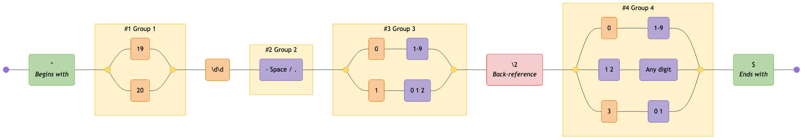
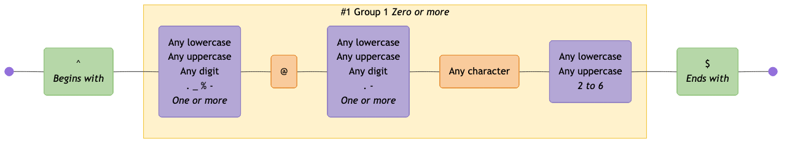

# Examples

Here are some common regular expressions, showing how they are visualized as mermaid diagrams:

> [!TIP]
> If you are viewing this page somewhere that does not render embedded Mermaid diagrams, you can click the "view as image" links below, or view the diagrams by copy/pasting the code blocks below into the [Mermaid Live Editor](https://mermaid.live).

<!-- CONTENT:START -->

## Table of Contents

- [All Possible Tokens](#all-possible-tokens)
- [Comprehensive RegExp Features](#comprehensive-regexp-features)
- [Conventional Commits](#conventional-commits)
- [Cron Schedule](#cron-schedule)
- [Date (ISO 8601)](#date-iso-8601)
- [DateTime (RFC3339)](#datetime-rfc3339)
- [Email Address](#email-address)
- [Email (RFC2822)](#email-rfc2822)
- [HTML Tags](#html-tags)
- [Complex Password Requirements](#complex-password-requirements)
- [Phone Number](#phone-number)
- [Semver](#semver)
- [Stocks](#stocks)
- [URL (RFC3987)](#url-rfc3987)
- [URL](#url)
- [UUID](#uuid)

## All Possible Tokens

An example of all possible token types

### Pattern

```regex
^(?<protocol>https?):\/\/(?:www\.)?([a-z0-9\-]+)\.(?:com|org|net)(?:\/[^\s]*)?(?=query)\1\d{3,5}\w+\s*\S+[^abc](?!neg)(?<!back)$|alt\b\B.
```

### Diagram

[View in Mermaid Live Editor](https://mermaid.live/edit#pako:H4sIAAAAAAACA6VXW1PbOBT-K2poZ0jBENu52bCkwQl96dCddmd2ZglkfBGJF2NlZWezLPDfK8nyRZKdml0_OJZ0zqejc9H58tzxUQA7dmeF3c0afPm2iAFwff-3MI2gDRadb3AF_7HB3eHkfINRinwUXazTdJNMuvaCPKfsdTixd7sd_TzpTg5vXO3fnmbRoXZ71GXTRMJHjy8Ir15imHbJkCne3NGf5PYjUZv88tcW4icmr9NX8GweD17p1-6IiX2k7-9HN3eu598eTt7FcEWQzt95rv_Qff_iRikV8Ojr8mTR4WeZwcTH9CyfYQyxm8IA7MJ0DTA9mpYi7RHiRzcMPukn-kmPqlHFDx_ANXFNQr-T1MXpp2eQrN0N8cq95ofYB69ndO0-jBtWgjD5cxv7aYjipQdXYbzUbduuzLbQg3HQUstNEoiZjn646Nyde_jiPLy4pPsm7Lznp-HFotMlYIUoU4zClHglYmo0spkMnxUkDCKRcOCvGwrgRiVqnYZJNGyWJKfNQn0ixLLnRJXx1y5e-hGxmNk3jZ9AhHYQ-24CqSV0IghXYUoHJN1y62IIEAaPCMPSQIqlMSxh-wHHpcuuT-ZUK9RIGv8pku20csOGxDBSM82OGxEBUlDNAmMiQKqtWcAiArWxIZVFC2Up-Z_UIPfwHxAj1cVcTWtwtd4jGKzI1R1pDS8xvIcYxj7ku5GLIE9ksqwVy-WOnjAv54zBY1ukCEEyQYrAoDEtKtom194hHJTp8YYUq2D1c6w1OXOycX2415HNQDRdr1GqArUxqCas1EUu8IDfLoI6S6k9OadTQBoVVaS8oqjMe273PA5aXlA0HvSO3wNssrTxOPTvNHAe2saBi5-a4Evl_tuVK44c1t8jgiN5Y_m-9Vi_zZoLH4DYfaShcTfpFpMCADeLzoEO8q676NxS6Yo7xKFBh-SSyTYpQcm5MsgwXmWg1yjWiimg3OXSNv16XNISqWMCbqcBPmO03QCj0K_eHG1MMxTTCqia61ddYPeraPpQHI7E4biNVebbHWZlw7obtH7HDUrCNPwbLiOEHtw1dLlTf-Xz4Es-r-ZAr-EQdPMayGs-vw9SbwHpwXUY12FmCyqomJ2kBObBqsKtgKZpdXypiUcx-QrjkRkQWy82F28RYc0QCY6wZopURljriwyGrVUjrZAXQXsgEpCG0xtN3EPAGoqcQcFiddEKaSSSi_-BNBZZSEskNivgWCJZYWt1ddVIWcQ86ElkhK3KvKOWjMjxNRSiIUuYCpmQJfoKRZAlBkrvb_KA0djdRQ9IpSD5x5AauVRlhtzEa-O6v2bLXi61dmkvU-7r0npfbt2y74ZKe25pLZtlsuSfXaVlp09RdmHxP4ZshnYpug3dYQbvq0BEPYrsg6urmTUcHicpRg-QDHXHMI1j0s8Rtg967DkTIIozcYDL4Ww0HRcAlun0R7N9ANyn-f6Wc2k5hfp8aOnmeJ96yVdyA_rT0aw8wXg-chxzH4JKITnSfGqRp0ByHKq7D0kk9_mJ-g55yhP1huRRUHikMlZSFyrGtnhbz6Fn1nw6M9_g61hgBhmIczU3rkqQIQGdX-4DyalUkTFXRuV8P8-YnD9oRbMvjjMz5tZbI1eH1M7nTUgZKcihnPnAmf0sIXn4pptN9MSD6FDsrASzpJL5shDRs4qcSIGPJd55LDM-IagVnArlzT8rq7UsTg1N1a46kqaGoEmj4GA1vj7rvP4AhKsrqNoTAAA=)

<details>
  <summary>Click to view as image</summary>
  <p align="center">
    
  </p>
</details>


---

## Comprehensive RegExp Features

Demonstrates MDN JavaScript RegExp syntax cheatsheet features including character classes (\d \D \w \W \s \S .), assertions (^ $ \b \B), lookahead/lookbehind ((?=) (?!) (?<=) (?<!)), groups (capturing, named, non-capturing), backreferences (\1 \k<name>), quantifiers (? * + {n} {n,} {n,m}), character classes ([abc] [a-z] [^xyz]), and alternation (|)

### Pattern

```regex
^(?<named>[A-Z]\w{2,5}):\s+(a|b|cd)(?:https?:\/\/)?(?<domain>[a-z0-9.-]+)(?=\.com)(?!\.org)(?<=example)(?<!test)[a-z]{1,3}\.com(?:\/\S+)?(?:\?[a-zA-Z0-9&=]+)?(?<digit>\d+)\k<digit>\1\b\B\d+\D+\w+\W+\s+\S+[^xyz]+\t\r\n|alt$
```

### Diagram

[View in Mermaid Live Editor](https://mermaid.live/edit#pako:H4sIAAAAAAACA61Y63ObOBD_V1Sn7SQTk5qHH7h51AGnXzq5m_ZmOnOx68Gg2FwIMEAuSdP876cXD0lAcXL-QEDa_e1Ku1r9Nk89N_Jgb9rbJE68BV--LkIAHNf9y88COAWL3le4gQ9T8GP_7Dh0bqF3ejVT_l4u0O_-SesPnw-m-D093Hd-rX-53sH-2XSbZXF6RsY_kMfBGdL2olvHD0-vHOXnQDGPlOUhkj3B80dudIve35D3KNmg9-MT-ODcxgHE728ymGYHWHH5pPb151xnv2Lj2yE2Qr7PsCRyEll5f7I8pMb9jZ-d4lnv8AD_uakMqfixxo9zKoGfNnnek-f3Q7pGaujqx8PjzyX5yPAjwY_wlxNkbxc9tn02TN0Eb99nGMLEyaAH7v1sCxK8m0oWKbcwQdvhfVKP1KMBVsOK796BSxSNFL-nmZNkn55AunViFIhrxfUTFzx_xHPXftgw4_npP3ehm_lRuFrDjR-u1Ol0WhntoAdDr6OWk6YwITrq_qL343idnB77p-fYbkrWe_zBP130DhBYIUoU3a2TrNwADRLNWfgI7uIYJq6TQiqPJRQiISpoTOE-Sjwy7rgZTJhtDWQRGJZmBZjAR6JOQIxOqQQbEq3ouZUtmk9jx4XMwh8hBFECbqMENpqRo6C9KArdtPJF4Y1x5EXl03hF6-ZpA027XvP8EM3jg90sMUISab5LMXbYCcotqtMYkzDgA_yhNRgGC0YQ3dMcwVbwADnD-OMIKDvEJ7c_Qbi0lDT7aFIZVJaaZdQBEmIFq0UKZx0uZa1rHdatFa1LxZmt_z6ztQ5rUnUi1L7pOJyXUfayE1BYMoils1ZL46bwFjVBivd7cLKDNxVbE2arQOoIsXbcm1UCr2ECQxeSAlK9RvLSh6SUQqoEW3PjdYAaA1R3RyqrMAVZM4jvuECuo7vQc5LHpkpcKuu7K1f21XzhvlZvggHLOOdVKGrb_bArmFa49L_AvepWqQIZrzmcIdxgRrISbuEH8Ah-tsEwPaXprA9JBmWEEYUt1QdXFsSWZIkyGfH63jJf5qHXxiYYcfp2tyYUlpIn9gEIZV25TpzdJejUgqtFb0-lo4veEovy-yqNaHgE3cXUToGL2Bk-GR6D1MDnJLqLgVaA1lAAeYLc8XS4uMT5T53_NOq9CREWXaMfbqhLl1GoFENAupGXPO6Q_xzxn-MGq9zeamQjdEBpft3mNjgfR6mf-f_CVRBFN84WOmxT_2Tj4Es-Lrk9aXAM52kN4iUbb0E0O_i4hls_rHOSTkiY6qCDm1VQzs8mULVLKmi7p4KqS4EbdTGlv8CUIZnqlGrE1J5Bb4m6TOPzAhWHubepdFVAUZS6TqmpgyLylV5H7H3IfLWKSOValNCkpoZIFBvD10tRW5ealYYVaU3dCGdN47sICYtUqU5IOt9wvALJ4HuTjkhklMMZ8j0MNzfiuxdubsz3KWIEDKlD4bQnfJfBzZl8d8HHfSC0FfyskBZSXgylXoLX14ROgZ_VhRZBRB9JDQKvbwjEX9QfS7RflJhIZJ1IiNS7lo_XSWq1RFs4zZrIoYV5XaTJotemRIWlejCQqa4kIxcNua5oMj-VZHSZdEoyhswniUwdMWxkjHz0hwIVrD2x7RW25IcCXRQiYohcsaMtMkpkr_0qccweA3o5sH-_kRF0f5E9wmu14XUVCKkHwXTv4sI2R6N-miXRDUSfqqXpWt-NgiiZ7g3I7yMHUXjMAM5H9ng2KQBM3TLGdhtAybtzBGM2tksXJvOxZeltCGxP8xWY1rlpFerzkanqkzZ1vvnMUQwL_UqUwQj92lDkNoIhzWcm-hVIloV1JSQWKUq460JFyAKjIbmTtjmf2foOe50T_CLYF1plkb8PdsgxIQpiXcy1i9KJEXJqft4GktNOpSCyxXJsbW7uEPica0pIO0eP84mS0yJ8tmqXUJY2Pp8NOjvFQV1Y86Fl_y4zWSbM4jh4ZPlgYWx6mmlmCQ1gX2ha-iKz5JKndLfa8OWvlVmhAesLLLwvUmUuOyo4tb2QnAVVy3W9jhztJhtF21ET1iYrhU5N_D72nv8DC6sC-lIaAAA=)

<details>
  <summary>Click to view as image</summary>
  <p align="center">
    
  </p>
</details>


---

## Conventional Commits

Validates a RFC3339 DateTime format

### Pattern

```regex
\A(?:(?:^(?P<type>feat|fix|ci|chore|docs|test|style|refactor|build|perf|revert)(?:\((?P<scope>[\w-]+)\))?(?P<breaking>!)?:\s(?P<subject>\b[\w#<> ./\t\\-]{3,}(?:\b|\.))$)(?:(?:(?P<BLANK_LINE>\n^$\n)(?P<body>(?:^.{3,}(?:\b|\.)$\n?){1,3}))?(?P<BLANK_LINE2>\n^$\n)(?:(?P<breaking_change>^BREAKING\sCHANGE:\s[\s\w]+(?:\b|\.)$)\n)?(?:(?P<footer>^\w+:\s[\w#-]+(?:\b|\.))))?\n?|)\Z
```

### Diagram

[View in Mermaid Live Editor](https://mermaid.live/edit#pako:H4sIAAAAAAACA-VajW-bOBT_V1iySY2WdMHmM6vSpUnamzb1TttJJ21pK0JIy5ZCBPS6qun_frYhgJ-BQCKdTrpo2rD93u99-mHz9tyy_YXTGrRuA2t9J33-MvMkybLtP91o5QykWeuLc-v8Ig_kNzo6HZA_10enf5xET2tnuHSsaLN0f21sd2Pf-YGzWfh2uImcMNqE0dPK2QTO0rIjP9jMH9zVYrN2giWZ-9sJog5BoqBHFC20fQL3nY4fe1dvO_Sh0zmlS_PAsX663u3wVSdmCBnDw_yHY0dDOjGP-donQ-n4HX2MZsmvd_WMuy-JoPmG_n3c6bzuxHZQnLPPo8tPN58_Xk4ZlHf9mv3TYZL9xdOQ2ntcgBLTnXae5S5-SVTNwBBEG-RNubHvLO_WGV6ffZmOPn28vGBmjX8bXV5MYxOZRSEz6-otlNyJQU8T1KXvR04wvGbUb3P8j-2ewEx-p7HmGwbzbdZKAj5xQjugAb9wPCewImchPbrRnRTQ-Pciv3fvBPeWu_ggH8vHfcpGGd-8kS5J_oT0OYysIPrwLIV31pqkzrJnu4Etvbyna0vXK1lZuUR7a3UjHxHM2WjW6gwGg2SSESzc8MeDZ0eu793MnVvXu5EJRW62BDjP53iLmlxWGJLkpDxUoWsSs-GJOzyjckPmkJN37jBWMiUtURPtpWY9rq3XEFGS7kLRbVsKTCncX-UECiGw3fJ1la7TzV1OohESuvPLKXRCQctCOYVBKFjNKCcxCcm2oJRTyX1CxspNBQ0NLi1GFSSISaOlqoIIs6w9EinIFg9u7BXJkSSzH2kq9ZJ8-t1zJD-Q7olXs3yiLD3GwstQGH-nQgsaolcV6zQ-g0odqbEj70l6vCPr4dqynUKdst2BmFLzxJ6__GAhzf0Hb2EFT2U7JCcOZy5pSyfSUPpKRUrH0jvyoonYy0ba-grv9JS49fBeWw83rBC4uQ_SkOiJw6kpJKGdgoTOBNEMeJ2ImXqL6kKUiqA76tJ5XLmeUwWuNqtzGaO2l1ZmPa30ZlrlckuBnj0gj5S98khpmEfG_nmE-k3yyNwnYkjOIrYtX2tKZa0y1qKyg1C9ULOCvVcGsjLe3CBcUy_UTK8Un2ZgerSrqrpqvaqbAlP67TGxClerh5vj0FkKhtTYpC7XfEuJe0bda8-oTU9nBxRfpDXZNPJe1RfpNZNM3bvQGdsoU9thtWtywkDGzvOB2Tij2K5O3_G9g1JK2yultKYppR2QUubulEpP5P09CyqOT5LfIEVyEfv6MGeX-PgylgzorYxaQO4_0vdZqy1LF4H_sJbkWeuK0hVeXMQFdjOJp1OT-SHmhwo_VPmhxg91fmjwQ5Mfyn0wlsGYKUYUjh0jOgIxR6DEESh1RD55iyE84gnbWkcPAb3FY4pz6Xu9dEoSQplAZ7KBrsBrsrJDdyazjRPdcanA7GpQxxJFsKQiO3BxdiTTudMx0ETfYRpToq0kpimpBkBVKAYJwcN1TEblJmc7pjh4IAsAEa7QOrMVWgFzWBOsQpBlV6qozJ9q4k9VTA0DIqpwAmxT2azjWaNJMinFyST4B5QE1K-jiV64QWUp8iXM7RZgABSuC8EQ9AM1Csk7gqOx4GhJcLRqTYBVdUzX9qhNajMVcpzaDmtZINp6Yq0upCISkntb5PNnfcBTa5vL_SbZqBZno7AvYNlGuxzA9kTbSBxglIS7wGj4zlWEVARvVqQKFGIt0QU5Sh1nmvWTqtiwzB9A6Vo5LaMmsdSKY6kJpoMih8wdsWReaJtJLM0yk8WUFiMD3WAIFKZ4NKlV-mS53FfFimb21cFX__36Aok0QKQ3yTyQ2PUdI1DVOirK_4XTBjgA_X-iA2fVspohF9cM8ObB_A4kN6_p4jbXApN6vV52ZuK_frK1AsFlnS5Gn6sh8MpagofKWlKcboi_wgpY7NJXCwnz99QDkBS-N3UAksp3sQ5A0vhm1wFIOt8UOwDJ4JtnByCZfI_tACS5Dxpxh2CBjSMfgoVAZ68mFpvlkTBo_7HV_NtZ-AzG8yugtcevqqCtx69qoKkHZSOhqQeqB4I9PIiAhT5dSX3BZX03IBHDjlmh56vRsg8IoINWE4vNAr0U2GDjJRmgkQa4VdhBA-sabJTx6CZoiAFuHXbCYJQUoeNVEiWlrKsFJBqwH1Xo2Wq07GYO-lM1sdgs0MuE7StekgzaVPwqeLnBvZDUqvwEpBBetkACBl0lyI-EfhLPr4CuEYyzKrSLeH4VNIcgvya0hSCFLrSBSjJJLev1QJux0KYpjH81XnatBm2bmlhsFmqmCG0dXpYO2jeQXxUaN9CbhtCg4SUYoOkC-U2h6SK8Xfpil6UkYlpZKwXapQldkEIvV-Nll2fQFamJxWb5E2Uf9EwKkarPzbup2SwvVwYtF7a6dL1cn4X-L6Uw97_f2Ay909HY0LBMnOUWgbCuVoP2uTk-M8fdMAr8n86gPdVMGRtd21_5waDdZ7_3HHtOyy3E-cTUtBTiXB4jjKog0pgmAGfaRB8ZKYCJx4o-qQLI-nJbBGWkTzIVjKk-HmMBIfFM_H2kyDXbO1tq2DkajxsY5nHfHWKQ8fkUneMURJuY0-lZmWqj9Xr1lCg4pqhxOGNTswt5N7uLZ484e1SyRzV71LJHPXs0urkPSNvHzCx4ze-CGz0YIzA2wFgHY60LL95gwoQEUIIsgwkVEvBhed96-QchPWNzWywAAA==)

<details>
  <summary>Click to view as image</summary>
  <p align="center">
    
  </p>
</details>


---

## Cron Schedule

Validates CRON pattern (Quartz) and supports groups

### Pattern

```regex
^\s*($|#|\w+\s*=|(?<SECOND>(?:\?|\*|(?:(?<START_SEC>[0-5]?\d)(?:(?<DELIMITER_SEC>\-|\/|\,)(?<END_SEC>[0-6]?\d))*)))\s+(?<MINUTE>(?:\?|\*|(?:(?<START_MIN>[0-5]?\d)(?:(?<DELIMITER_MIN>\-|\/|\,)(?<END_MIN>[0-6]?\d))*)))\s+(?<HOUR>(?:\?|\*|(?:(?<START_HR>[0-2]?\d)(?:(?<DELIMITER_HR>\-|\/|\,)(?<END_HR>[0-2]?\d))*)))\s+(?<DAYOFMONTH>\?|\*|(?:(?<START_DOM>L|W|LW|[1-3]?\dW?)(?:(?<DELIMITER_DOM>\-|\/|\,)(?<END_DOM>[1-3]?\d?W?))*))\s+(?<MONTH>\*|(?:(?<START_MON>[1-9]|1[012]|JAN|FEB|MAR|APR|MAY|JUN|JUL|AUG|SEP|OCT|NOV|DEC)(?:(?<DELIMITER_MON>\-|\/|\,)(?<END_MON>[1-9]|1[012]|JAN|FEB|MAR|APR|MAY|JUN|JUL|AUG|SEP|OCT|NOV|DEC))*))\s+(?<DAYOFWEEK>\?|\*|(?:(?<START_DOW>[1-7]|SUN|MON|TUE|WED|THU|FRI|SAT)(?:(?:(?:(?<DELIMITER_DOW>\/|\,|\#)(?<END_DOW>[1-7]|SUN|MON|TUE|WED|THU|FRI|SAT))*)L?)*))(?:|\s)+(?<YEAR>(?:\*|(?:(?<START_YR>\b(?:[1-2](?:9|0)\d\d)\b)(?:(?<DELIMITER_YR>\-|\/|\,)(?<END_YR>\b(?:[1-9]|[1-9][0-9]|1[0-8][0-9]|19[0-2])\b|\b(?:[1-2](?:9|0)\d\d)\b))*))))$
```

### Diagram

[View in Mermaid Live Editor](https://mermaid.live/edit#pako:H4sIAAAAAAACA-VdC3PUOBL-K65kqSIs2bVkWbYDGy5kJjwuJFQem8oRlhqSAXIXktQk1B61s__9bGle_lqy2zYL1C1VhFiWvm61Wq2nP_5YOr06Gy6tLb0fDa4_BNt7J5dBMDg9PTi_vRiuBSdLe8P3w_-uBb-d5H9u7t39Ybw8Ln79_Ueb8Mv47qOH-_3N3Z3e-t1Ha0XiI5PhXv5irXh3sLF38CbPsf4qXI1fPyrena3Yd73-9rMXzw76e-Z98WbVlP3Z_Lyf53rY3-lNC-tp4ZV7KysrRvyPeY4Xz3YOD_pVwvMclcKL917hk8Ie4U93D_eqRD_dKwpLn-T8tVcwFC3L7W0c72692N05eLruE93bfbG-PT4abx-NX4nVaIJz9IgoUWT0alG8XCj-KC9faDK3_kwHsPnuTlEuez0Wr0IhX4-fb-yMt_qPxy829sYbL_fyf4_Hzw938r_b443DJ-P9_svx7ubBeGf313Gvv0kbabeqkbpKK9XJGPeo3_9nhW2PCnnJ6_F-DppLHx8c9sdH_d744OnheGvv2Xh_48BWYY2a-2h9oQrm5_Lc3BzgXNvtR4XKObYpf7NS6H3c35g5Y1nfY-tnb_O0HF2-zv_NxqGp8Zl1L_OaGP24wj_LmLnpzc_cZW0rrKbT3zPjxlbCmKWG8fWVH06WJsGoN7w5HRXB6Mnwcjga3A7Pgt_Pbz8EoyI2rd5erX4cjj4Ozs_-IX4SP4VFsaLgnTvBTh7bborfb24Ho9t__BHcfBhc52Ht3erp-eg0-PNB8e7d-aXnzeDmZji6Pb-6fCPuniz99vDtaP3h-frj4fvzyxujwcOfz9dPllbW1tZmWU3B0w-D0ZvTizzRlNy4_Bz8_uH8dnhzPTgdTmD-NRxdBVej4OPVaDjHKUqumpIG6Oz85t-fLk-NDm8LuW9Enmkh1aP5Yrnh5Rmz1Ly-Mtf6h4mi_cuz6tpe5DUbDS5MVZdthkkSGkNOjXE1OjPpg9M830TO7uWw1h4LWFEnw051LjT6hepM7S5b2Z1XaqpMUaU84FB1phmUyXCv0sZFnnywmxr1upA7uOBYNJ5Y9Oz8_fkt0x2jVmaJGpklNrVe9ZtFmww_-zMkJsP9SrtpYzfdwm5Jrd0WMqc-t-W4P7W_amV_1cj-aZ1bZgy3zFq7pQhb-GXcyi5xI7sYxSodU4g6zxSS4ZoGpp1vCtnEOUX0Zb1Tt2oF3awVaqOm4IRNYeOmbGPjNoEzaWWapJlpaiOnqA2dghM7hW5vvEbRU3zh8Jm2aoW0WSvUxk_hDaBU46yVxlkjjWUR2Lb9-soiHh1VvC-CzvZRtcsUdc4Xli1cRtYPCDNNiuBw5JVRbWoRtptrh82Mreo6qYzrOqnUjE5qWq2lxUujCBdgpl3CboRFmV94LBItV06iWWum_K4s2q0pmMUWTalMy2fVrWQ6ZHWTFI4YBiKQlUhR0T-fb-z4_TUqXHGr_7giR-FxLzb2KnIY_3hZlUMZjOOKHEWFnh9WaapNjopgGJkB7PBJRY7CJ_b7LytyFLbf3TyoWPkVNt3Z_bUiR2HTXn-T5Xntlm2i2bpNybrIpqK6yKaUL7I5atVuMcQsttgPNKM_qbi-PyWs_qR0XX9SSV1_Umldf1JZXX-Kw7r-FIu6_hTLuv4UR3X9KVZ1_SmO6_pTrOv6U5z4-tNiC37h-ahot24VzRauce2MNG4wIxXtVnnMYovGtlPGpLKz6MJJ96tcUBdO-mK3KkfhpAeH_YocZl7Z71XkKJz04OlhRY7CSbf2nlXkKJx0f-OA1QrtFpSi2YpSJ3UBW6e-gD3LYX1rmVWrdgs0ZrHF3eSQ4VtJrW8ltb6V1PpWUutbSa1vJbW-lXh9a5ajaOvttmundutUZrHFhqMHLMxYK9st72Sz5V3iXRDMT1vsLOjtxNRHxeHI26tPl2eD0WfGCZOZKotVya12u3WQbLYOSopOnvmdKy26Ulg5tkZRk50hM9mvzj03uGpucIchWx4JNTsTSkXdJDqVdTE5jfiTaNluacAsNm-C-Is0QbsZv2w84zcLRd-MfzGfZuZL2FtYqapdR5gFZria1krN-FJNhbPqk8bQ7vrWdDbdvKXnhZNOoVGJZqGx3exbNpt9p7omNCa1oVE1OtVRUYPQmHZprYx_bWByQ2P_01tz88ze0pg8BJeDj8OzN6eD69tPo-EbGbw6WVqOgtlVspOl10X2ciVJSlyk5O1jZXmwI4OtgtJVtBm-47ybvjAH2jZ5tnwqP-ryY8JRTBnF4mByAc5VZU1SfMi5lhb3_PK9rfLO1eXqLClw3pqYCAR7uRIVR6wkYj0iZDO5AVaPo4z4mspgovQ5l3Q7lyy7D_ia4niTqe-yDOxNza9fV7A-R2VtVE6C2R1OVxfISIoIOeCJAU-D0iXQim4fu1sG-rmVvXj8D8-So1tqdMuCye1TV7WnwKWDfo7f6y59P3ElphyxMbe76WZy0bE0Rxn1NZXBxNjnYcrtYarsQWn5MeP4kzH-sg7sRemvX1ewPitchUZnIYLpNWpnL6BjvmAN-sKGQyGDxavYFd0_cTdOAt0bwwGM-4I18As73RFRYG-BO2tOh37BGvuzLv1_GnVQX47glNvppjGULxo9LOPok3xlfTAx9bmadrsauhJMAgSrW2XWs8Kg-Gzhm9QXGoHVH-xMWMTB7LuGip6auc2Xlc0lYaCWMFBLSfsXnWoQlIhVHxuPhQ5Kn2BU1GnaJPSiCciHwUJCPJKapZ-deIkkmHz_4QpAkk5AJExTJSsgCdEpIsXOVNY0wI4xrBCgmsomE17WjFfYxWju8PPPe_5ilUhq6HPC1O2DMCER-MyaoQg75RVZMPt4qKo7eJZJgnZa0iMcnRg6SQSdKoLQEOFqDCJxBCIjxIdIHsEkIgILRhC6FOineK5lQ78Mg9IXVVVW9ux04MijwB4K37NGJmknfFIEk8-5qjTzTJUd00EJxlYxzQL2V1gE30P7KGifGNonBv-JwV4xbh2B_8TgPzHoF_PCbKdNn-nYh23Gksze95nGDr5sEr14A7Bd_OdBpzLCfiFtSKp392cakekNRAhiKatH2WWEjGbTpqOqPuWZdjoWGhIcXoPDa1BXg8NrcHgNDq9x85Q1a5F27JSqNKuqrLJnUSegw2t8hgCgWUOctLNYGU9mVZWaecbaaXrp2gJsLeMzNEYCjZFAYyTQGAk0RsKbWiVdoo10bjlK1iaz0OyN3QoppM_yYmz8V9XarQ9JxWMGntbs7TAp_1q90ZqsbjXZ2JbB7KPt70h7kqq8Xd6zwYxbSjEEn5i12SFSp2eSK4r-iORZVjsWxZFgHQZVzApcV1Y8ByMY3WBoSlkzFFl1GARa0-o6kiKaxJsE25W3nJ55HO_V6IH1sKkL94owgaeGnR_JxdOR46rdUek7t4LBJoXmSvE96-hOqkau41ksSLpYiOjiIKLTH1yvpQ4gxziNnkllKZ6z6ka194QVXPSmMHSkrKFDxuyOQ-2o6A6Son1JsWb00u4fSHtm5u82qko3rJvXpp6FsSS9LcYEjQkJJrBO02SnxZxMvpRtsBFYuodNg607yGHk_Po1JXl5Fw-y_-_6k1TvhqL07GrjrnrCW-7aXfU8PBYsOH8Lk6Jjuc10czsoLm-dTa6AiODJ6OrTdSC-izsgZHvl2x9NI2b8XRySIWj2LQ4F8LTiW2yb4Vbe977Uw-WqM2_69wxWBNc75_LtjOL0CRYUjkNKOjOHzVWSgU7mBV3gObbmJM0FU6Q7d4L-2fsFgrJgdXV1kXQMScjM-0WphFTB5HDYz_eVDkiUSANG8IzZK9Fmxi9TXLRAWrQc-RYQc0TksntJG1n-1r2FNo4ZjO8aeUlyVP7S2ymZh6TK3-u2QFpcWZFb4pgjJvxgHjtEPm6wkvZx-QNTp_Y8JF3-nLADUlL-ZomJZFLRWprwiWGOhPCGMVvQpCJaSojFPK2jfMxhJUuk5U8QnJrxkLIyNVgLpMX7vYRGjMTAkPKFeSwR-7jCynErBJIvZw2YWBAERRcsCcRhTCyTSqxGhw46ukhKJsZsTZNK8CJKN-ZpKe3jEytbJAIiMKd2TCwFlGEtsEpXUym_GMkTUyIxjz0SH4lYuQ4xsH8568DE0sAT1gUrAUYxJpZJJVbTlHyM5EkoyxizPU0qwUspD5mnpVIf0VjZIikwhDm1Y2JlwCXWAstxj9JHP1aeVYXAG-aUzcQSwDHWBQume7IFVunuJ2UvIzPUkNKUlXWKgJmMqZNJ9c3rQy91WVm2Asox9_yXixYDPVk3NA1UZlw0m0zaQVDeM5KHLifKM22ZAIEZs0-ZVCItotRmvvb0LkHKayuZAumY22Y1aK6rlV6qMlIrRVnG3FrUYM7vZgIdGZEYUz6yThKjEGjLuqEJoDjrhiaBDq0bGixCo25oCmjWuqHFQMnWDU0DfVs3tASo3rqhpUAL1w0tAwq5TmgqBLq5bmgCqOm4aDbZF50iL51dWboEGjq3dC5aBJR13dBgE0dx0WyyzzLKS4lHoqimbHZuHWow53eqgfaOSEwo7103iRro8bqhJUCl1w0tBdq9bmgZUPR1QotDoPPrhiaA-q8bmgSawG5oEVAKdkNTQD_YDQ02QuNuaBpoDbuhJUCByEWzydxZqE0mcSKl7Iq-eBd7-RPL9UmB99CtIRctA47EVmiuy_deZkVio4ySIrq1qMGc394H9sRuaAKYFruhSWBl7IYWAYNjNzQFbI_d0GJghuyGBgckmotmk31emniZJ8vSE2CMdEvnoqXALtkNLQMmSi6aTfZZJvWyV5JTypAST7p1qMGcf_ABDJXd0ASwWXZDk8B82Q0tApbMbmgKGDW7ocXAvtkNTQNTJxfNJpex4Igz4Y5ZNtnn8ZmX9tONX5O_9P0AZfjkYtpk32l96OUBLVssBf5O9yltDdrCJXwk-yQ1lpTR01cH4SX1LNchAzJOdx2YaGkI1J1cNJtM6kuvalCbKMrvCXZVyOnps5n3SkR5zyIVwLvpriUXTQJHZze0CPg8uWg22WeZyMsBCraOkbzTh6i8RJ2khWPKsemuVQNMTfk4SZ6EcnG2kjv_AAToOonElPJ1kjwZ5ersplUMdJ7k_k9I6Ty5Em0y-IhG2k83GtvnEmQCJTUQlO7T55exl_GzbDUNTJ3uOnDREuD15KLZZFJfSWlASZ6Ikn-CXVMk_OS2k03mjoY2mXnPzqSCnhlyi5r3784XyUNvP1_Y65OT_-vVpBSfVBQ2KKrfG76bQ-SFLy7Wlh_rXrKR3r-5HV39Z7i2nEWbKundP726uBqtLYfmz4MSwJwrdYqgNpKeniGk_WRzM6pCWKjrBGJrq5fpOcSW2JSRrIKYeNG0eLb5ONucFe_rTEQpKT6xjL3x7zKNuX87-RJlOIHuZf2NXtTAPJelD5EsyOZWX27NQXQO2n9cBTL9TGFmni25uVlnnkn9Nq6vLz5ParlZAFqfsC0GV4zvw5cN8KzgWcCzhucEnlN4jhEvxASUIFDFDDMQHYkQ1FJgNQXqKVCKJIpiVSUqKlGKRE0lVlaippJIQU3zuFjy2gcLTV3-FOU-3ESHZwHPGp5jeFbwnMFzCs8JykOBhS_Alw-YQHQmoKi1QLUF6i1QUYlSJGoqEUOiWIliJTE_qW1WjhwLDbnwzdL01wdLf_4PkIlzP6uAAAA=)

<details>
  <summary>Click to view as image</summary>
  <p align="center">
    
  </p>
</details>

```mermaid
graph LR
  accTitle: "Regex: ^\\s*($|#|\\w+\\s*=|(?<SECOND>(?:\\?|\\*|(?:(?<START_SEC>[0-5]?\\d)(?:(?<DELIMITER_SEC>\\-|\\/|\\,)(?<END_SEC>[0-6]?\\d))*)))\\s+(?<MINUTE>(?:\\?|\\*|(?:(?<START_MIN>[0-5]?\\d)(?:(?<DELIMITER_MIN>\\-|\\/|\\,)(?<END_MIN>[0-6]?\\d))*)))\\s+(?<HOUR>(?:\\?|\\*|(?:(?<START_HR>[0-2]?\\d)(?:(?<DELIMITER_HR>\\-|\\/|\\,)(?<END_HR>[0-2]?\\d))*)))\\s+(?<DAYOFMONTH>\\?|\\*|(?:(?<START_DOM>L|W|LW|[1-3]?\\dW?)(?:(?<DELIMITER_DOM>\\-|\\/|\\,)(?<END_DOM>[1-3]?\\d?W?))*))\\s+(?<MONTH>\\*|(?:(?<START_MON>[1-9]|1[012]|JAN|FEB|MAR|APR|MAY|JUN|JUL|AUG|SEP|OCT|NOV|DEC)(?:(?<DELIMITER_MON>\\-|\\/|\\,)(?<END_MON>[1-9]|1[012]|JAN|FEB|MAR|APR|MAY|JUN|JUL|AUG|SEP|OCT|NOV|DEC))*))\\s+(?<DAYOFWEEK>\\?|\\*|(?:(?<START_DOW>[1-7]|SUN|MON|TUE|WED|THU|FRI|SAT)(?:(?:(?:(?<DELIMITER_DOW>\\/|\\,|\\#)(?<END_DOW>[1-7]|SUN|MON|TUE|WED|THU|FRI|SAT))*)L?)*))(?:|\\s)+(?<YEAR>(?:\\*|(?:(?<START_YR>\\b(?:[1-2](?:9|0)\\d\\d)\\b)(?:(?<DELIMITER_YR>\\-|\\/|\\,)(?<END_YR>\\b(?:[1-9]|[1-9][0-9]|1[0-8][0-9]|19[0-2])\\b|\\b(?:[1-2](?:9|0)\\d\\d)\\b))*))))$"
  accDescr: "Generated with regex-to-mermaid@1.1.0"

  %% Nodes
  start@{ shape: f-circ };
  fin@{ shape: f-circ };
  assertion_1("^<br><i>Begins with</i>"):::assertion;
  char_class_1("Any whitespace<br><i>Zero or more</i>"):::char-class;
  disjunction_begin_1:::disjunction@{ shape: f-circ };
  disjunction_end_1:::disjunction@{ shape: f-circ };
  assertion_2("$<br><i>Ends with</i>"):::assertion;
  literal_1("#"):::literal;
  char_class_2("Any word character<br><i>One or more</i>"):::char-class;
  char_class_3("Any whitespace<br><i>Zero or more</i>"):::char-class;
  literal_2("="):::literal;
  disjunction_begin_2:::disjunction@{ shape: f-circ };
  disjunction_end_2:::disjunction@{ shape: f-circ };
  literal_3("\?"):::literal;
  literal_4("\*"):::literal;
  char_class_4("0-5<br><i>Optional</i>"):::char-class;
  char_class_5("Any digit"):::char-class;
  disjunction_begin_3:::disjunction@{ shape: f-circ };
  disjunction_end_3:::disjunction@{ shape: f-circ };
  literal_5("\-"):::literal;
  literal_6("\/"):::literal;
  literal_7("\,"):::literal;
  char_class_6("0-6<br><i>Optional</i>"):::char-class;
  char_class_7("Any digit"):::char-class;
  char_class_8("Any whitespace<br><i>One or more</i>"):::char-class;
  disjunction_begin_4:::disjunction@{ shape: f-circ };
  disjunction_end_4:::disjunction@{ shape: f-circ };
  literal_8("\?"):::literal;
  literal_9("\*"):::literal;
  char_class_9("0-5<br><i>Optional</i>"):::char-class;
  char_class_10("Any digit"):::char-class;
  disjunction_begin_5:::disjunction@{ shape: f-circ };
  disjunction_end_5:::disjunction@{ shape: f-circ };
  literal_10("\-"):::literal;
  literal_11("\/"):::literal;
  literal_12("\,"):::literal;
  char_class_11("0-6<br><i>Optional</i>"):::char-class;
  char_class_12("Any digit"):::char-class;
  char_class_13("Any whitespace<br><i>One or more</i>"):::char-class;
  disjunction_begin_6:::disjunction@{ shape: f-circ };
  disjunction_end_6:::disjunction@{ shape: f-circ };
  literal_13("\?"):::literal;
  literal_14("\*"):::literal;
  char_class_14("0-2<br><i>Optional</i>"):::char-class;
  char_class_15("Any digit"):::char-class;
  disjunction_begin_7:::disjunction@{ shape: f-circ };
  disjunction_end_7:::disjunction@{ shape: f-circ };
  literal_15("\-"):::literal;
  literal_16("\/"):::literal;
  literal_17("\,"):::literal;
  char_class_16("0-2<br><i>Optional</i>"):::char-class;
  char_class_17("Any digit"):::char-class;
  char_class_18("Any whitespace<br><i>One or more</i>"):::char-class;
  disjunction_begin_8:::disjunction@{ shape: f-circ };
  disjunction_end_8:::disjunction@{ shape: f-circ };
  literal_18("\?"):::literal;
  literal_19("\*"):::literal;
  disjunction_begin_9:::disjunction@{ shape: f-circ };
  disjunction_end_9:::disjunction@{ shape: f-circ };
  literal_20("L"):::literal;
  literal_21("W"):::literal;
  literal_22("LW"):::literal;
  char_class_19("1-3<br><i>Optional</i>"):::char-class;
  char_class_20("Any digit"):::char-class;
  literal_23("W<br><i>Optional</i>"):::literal;
  disjunction_begin_10:::disjunction@{ shape: f-circ };
  disjunction_end_10:::disjunction@{ shape: f-circ };
  literal_24("\-"):::literal;
  literal_25("\/"):::literal;
  literal_26("\,"):::literal;
  char_class_21("1-3<br><i>Optional</i>"):::char-class;
  char_class_22("Any digit<br><i>Optional</i>"):::char-class;
  literal_27("W<br><i>Optional</i>"):::literal;
  char_class_23("Any whitespace<br><i>One or more</i>"):::char-class;
  disjunction_begin_11:::disjunction@{ shape: f-circ };
  disjunction_end_11:::disjunction@{ shape: f-circ };
  literal_28("\*"):::literal;
  disjunction_begin_12:::disjunction@{ shape: f-circ };
  disjunction_end_12:::disjunction@{ shape: f-circ };
  char_class_24("1-9"):::char-class;
  literal_29("1"):::literal;
  char_class_25("0 1 2"):::char-class;
  literal_30("JAN"):::literal;
  literal_31("FEB"):::literal;
  literal_32("MAR"):::literal;
  literal_33("APR"):::literal;
  literal_34("MAY"):::literal;
  literal_35("JUN"):::literal;
  literal_36("JUL"):::literal;
  literal_37("AUG"):::literal;
  literal_38("SEP"):::literal;
  literal_39("OCT"):::literal;
  literal_40("NOV"):::literal;
  literal_41("DEC"):::literal;
  disjunction_begin_13:::disjunction@{ shape: f-circ };
  disjunction_end_13:::disjunction@{ shape: f-circ };
  literal_42("\-"):::literal;
  literal_43("\/"):::literal;
  literal_44("\,"):::literal;
  disjunction_begin_14:::disjunction@{ shape: f-circ };
  disjunction_end_14:::disjunction@{ shape: f-circ };
  char_class_26("1-9"):::char-class;
  literal_45("1"):::literal;
  char_class_27("0 1 2"):::char-class;
  literal_46("JAN"):::literal;
  literal_47("FEB"):::literal;
  literal_48("MAR"):::literal;
  literal_49("APR"):::literal;
  literal_50("MAY"):::literal;
  literal_51("JUN"):::literal;
  literal_52("JUL"):::literal;
  literal_53("AUG"):::literal;
  literal_54("SEP"):::literal;
  literal_55("OCT"):::literal;
  literal_56("NOV"):::literal;
  literal_57("DEC"):::literal;
  char_class_28("Any whitespace<br><i>One or more</i>"):::char-class;
  disjunction_begin_15:::disjunction@{ shape: f-circ };
  disjunction_end_15:::disjunction@{ shape: f-circ };
  literal_58("\?"):::literal;
  literal_59("\*"):::literal;
  disjunction_begin_16:::disjunction@{ shape: f-circ };
  disjunction_end_16:::disjunction@{ shape: f-circ };
  char_class_29("1-7"):::char-class;
  literal_60("SUN"):::literal;
  literal_61("MON"):::literal;
  literal_62("TUE"):::literal;
  literal_63("WED"):::literal;
  literal_64("THU"):::literal;
  literal_65("FRI"):::literal;
  literal_66("SAT"):::literal;
  disjunction_begin_17:::disjunction@{ shape: f-circ };
  disjunction_end_17:::disjunction@{ shape: f-circ };
  literal_67("\/"):::literal;
  literal_68("\,"):::literal;
  literal_69("\#"):::literal;
  disjunction_begin_18:::disjunction@{ shape: f-circ };
  disjunction_end_18:::disjunction@{ shape: f-circ };
  char_class_30("1-7"):::char-class;
  literal_70("SUN"):::literal;
  literal_71("MON"):::literal;
  literal_72("TUE"):::literal;
  literal_73("WED"):::literal;
  literal_74("THU"):::literal;
  literal_75("FRI"):::literal;
  literal_76("SAT"):::literal;
  literal_77("L<br><i>Optional</i>"):::literal;
  disjunction_begin_19:::disjunction@{ shape: f-circ };
  disjunction_end_19:::disjunction@{ shape: f-circ };
  char_class_31("Any whitespace"):::char-class;
  disjunction_begin_20:::disjunction@{ shape: f-circ };
  disjunction_end_20:::disjunction@{ shape: f-circ };
  literal_78("\*"):::literal;
  assertion_3("\b<br><i>Word boundary</i>"):::assertion;
  char_class_32("1-2"):::char-class;
  disjunction_begin_21:::disjunction@{ shape: f-circ };
  disjunction_end_21:::disjunction@{ shape: f-circ };
  literal_79("9"):::literal;
  literal_80("0"):::literal;
  char_class_33("Any digit"):::char-class;
  char_class_34("Any digit"):::char-class;
  assertion_4("\b<br><i>Word boundary</i>"):::assertion;
  disjunction_begin_22:::disjunction@{ shape: f-circ };
  disjunction_end_22:::disjunction@{ shape: f-circ };
  literal_81("\-"):::literal;
  literal_82("\/"):::literal;
  literal_83("\,"):::literal;
  disjunction_begin_23:::disjunction@{ shape: f-circ };
  disjunction_end_23:::disjunction@{ shape: f-circ };
  assertion_5("\b<br><i>Word boundary</i>"):::assertion;
  disjunction_begin_24:::disjunction@{ shape: f-circ };
  disjunction_end_24:::disjunction@{ shape: f-circ };
  char_class_35("1-9"):::char-class;
  char_class_36("1-9"):::char-class;
  char_class_37("Any digit"):::char-class;
  literal_84("1"):::literal;
  char_class_38("0-8"):::char-class;
  char_class_39("Any digit"):::char-class;
  literal_85("19"):::literal;
  char_class_40("0-2"):::char-class;
  assertion_6("\b<br><i>Word boundary</i>"):::assertion;
  assertion_7("\b<br><i>Word boundary</i>"):::assertion;
  char_class_41("1-2"):::char-class;
  disjunction_begin_25:::disjunction@{ shape: f-circ };
  disjunction_end_25:::disjunction@{ shape: f-circ };
  literal_86("9"):::literal;
  literal_87("0"):::literal;
  char_class_42("Any digit"):::char-class;
  char_class_43("Any digit"):::char-class;
  assertion_8("\b<br><i>Word boundary</i>"):::assertion;
  assertion_9("$<br><i>Ends with</i>"):::assertion;

  %% Subgraphs
  subgraph named_capture_2 ["#3 START_SEC"]
    char_class_4
    char_class_5
  end

  subgraph named_capture_3 ["#4 DELIMITER_SEC"]
    disjunction_begin_3
    disjunction_end_3
    literal_5
    literal_6
    literal_7
  end

  subgraph named_capture_4 ["#5 END_SEC"]
    char_class_6
    char_class_7
  end

  subgraph non_capturing_3 ["Non-capturing <i>Zero or more</i>"]
    named_capture_3
    named_capture_4
  end

  subgraph non_capturing_2 ["Non-capturing"]
    named_capture_2
    named_capture_3
    named_capture_4
    non_capturing_3
  end

  subgraph non_capturing_1 ["Non-capturing"]
    named_capture_2
    named_capture_3
    named_capture_4
    non_capturing_3
    non_capturing_2
    disjunction_begin_2
    disjunction_end_2
    literal_3
    literal_4
  end

  subgraph named_capture_1 ["#2 SECOND"]
    named_capture_2
    named_capture_3
    named_capture_4
    non_capturing_3
    non_capturing_2
    non_capturing_1
  end

  subgraph named_capture_6 ["#7 START_MIN"]
    char_class_9
    char_class_10
  end

  subgraph named_capture_7 ["#8 DELIMITER_MIN"]
    disjunction_begin_5
    disjunction_end_5
    literal_10
    literal_11
    literal_12
  end

  subgraph named_capture_8 ["#9 END_MIN"]
    char_class_11
    char_class_12
  end

  subgraph non_capturing_6 ["Non-capturing <i>Zero or more</i>"]
    named_capture_7
    named_capture_8
  end

  subgraph non_capturing_5 ["Non-capturing"]
    named_capture_6
    named_capture_7
    named_capture_8
    non_capturing_6
  end

  subgraph non_capturing_4 ["Non-capturing"]
    named_capture_6
    named_capture_7
    named_capture_8
    non_capturing_6
    non_capturing_5
    disjunction_begin_4
    disjunction_end_4
    literal_8
    literal_9
  end

  subgraph named_capture_5 ["#6 MINUTE"]
    named_capture_6
    named_capture_7
    named_capture_8
    non_capturing_6
    non_capturing_5
    non_capturing_4
  end

  subgraph named_capture_10 ["#11 START_HR"]
    char_class_14
    char_class_15
  end

  subgraph named_capture_11 ["#12 DELIMITER_HR"]
    disjunction_begin_7
    disjunction_end_7
    literal_15
    literal_16
    literal_17
  end

  subgraph named_capture_12 ["#13 END_HR"]
    char_class_16
    char_class_17
  end

  subgraph non_capturing_9 ["Non-capturing <i>Zero or more</i>"]
    named_capture_11
    named_capture_12
  end

  subgraph non_capturing_8 ["Non-capturing"]
    named_capture_10
    named_capture_11
    named_capture_12
    non_capturing_9
  end

  subgraph non_capturing_7 ["Non-capturing"]
    named_capture_10
    named_capture_11
    named_capture_12
    non_capturing_9
    non_capturing_8
    disjunction_begin_6
    disjunction_end_6
    literal_13
    literal_14
  end

  subgraph named_capture_9 ["#10 HOUR"]
    named_capture_10
    named_capture_11
    named_capture_12
    non_capturing_9
    non_capturing_8
    non_capturing_7
  end

  subgraph named_capture_14 ["#15 START_DOM"]
    disjunction_begin_9
    disjunction_end_9
    literal_20
    literal_21
    literal_22
    char_class_19
    char_class_20
    literal_23
  end

  subgraph named_capture_15 ["#16 DELIMITER_DOM"]
    disjunction_begin_10
    disjunction_end_10
    literal_24
    literal_25
    literal_26
  end

  subgraph named_capture_16 ["#17 END_DOM"]
    char_class_21
    char_class_22
    literal_27
  end

  subgraph non_capturing_11 ["Non-capturing <i>Zero or more</i>"]
    named_capture_15
    named_capture_16
  end

  subgraph non_capturing_10 ["Non-capturing"]
    named_capture_14
    named_capture_15
    named_capture_16
    non_capturing_11
  end

  subgraph named_capture_13 ["#14 DAYOFMONTH"]
    named_capture_14
    named_capture_15
    named_capture_16
    non_capturing_11
    non_capturing_10
    disjunction_begin_8
    disjunction_end_8
    literal_18
    literal_19
  end

  subgraph named_capture_18 ["#19 START_MON"]
    disjunction_begin_12
    disjunction_end_12
    char_class_24
    literal_29
    char_class_25
    literal_30
    literal_31
    literal_32
    literal_33
    literal_34
    literal_35
    literal_36
    literal_37
    literal_38
    literal_39
    literal_40
    literal_41
  end

  subgraph named_capture_19 ["#20 DELIMITER_MON"]
    disjunction_begin_13
    disjunction_end_13
    literal_42
    literal_43
    literal_44
  end

  subgraph named_capture_20 ["#21 END_MON"]
    disjunction_begin_14
    disjunction_end_14
    char_class_26
    literal_45
    char_class_27
    literal_46
    literal_47
    literal_48
    literal_49
    literal_50
    literal_51
    literal_52
    literal_53
    literal_54
    literal_55
    literal_56
    literal_57
  end

  subgraph non_capturing_13 ["Non-capturing <i>Zero or more</i>"]
    named_capture_19
    named_capture_20
  end

  subgraph non_capturing_12 ["Non-capturing"]
    named_capture_18
    named_capture_19
    named_capture_20
    non_capturing_13
  end

  subgraph named_capture_17 ["#18 MONTH"]
    named_capture_18
    named_capture_19
    named_capture_20
    non_capturing_13
    non_capturing_12
    disjunction_begin_11
    disjunction_end_11
    literal_28
  end

  subgraph named_capture_22 ["#23 START_DOW"]
    disjunction_begin_16
    disjunction_end_16
    char_class_29
    literal_60
    literal_61
    literal_62
    literal_63
    literal_64
    literal_65
    literal_66
  end

  subgraph named_capture_23 ["#24 DELIMITER_DOW"]
    disjunction_begin_17
    disjunction_end_17
    literal_67
    literal_68
    literal_69
  end

  subgraph named_capture_24 ["#25 END_DOW"]
    disjunction_begin_18
    disjunction_end_18
    char_class_30
    literal_70
    literal_71
    literal_72
    literal_73
    literal_74
    literal_75
    literal_76
  end

  subgraph non_capturing_17 ["Non-capturing <i>Zero or more</i>"]
    named_capture_23
    named_capture_24
  end

  subgraph non_capturing_16 ["Non-capturing"]
    named_capture_23
    named_capture_24
    non_capturing_17
  end

  subgraph non_capturing_15 ["Non-capturing <i>Zero or more</i>"]
    named_capture_23
    named_capture_24
    non_capturing_17
    non_capturing_16
    literal_77
  end

  subgraph non_capturing_14 ["Non-capturing"]
    named_capture_22
    named_capture_23
    named_capture_24
    non_capturing_17
    non_capturing_16
    non_capturing_15
  end

  subgraph named_capture_21 ["#22 DAYOFWEEK"]
    named_capture_22
    named_capture_23
    named_capture_24
    non_capturing_17
    non_capturing_16
    non_capturing_15
    non_capturing_14
    disjunction_begin_15
    disjunction_end_15
    literal_58
    literal_59
  end

  subgraph non_capturing_18 ["Non-capturing <i>One or more</i>"]
    disjunction_begin_19
    disjunction_end_19
    char_class_31
  end

  subgraph non_capturing_22 ["Non-capturing"]
    disjunction_begin_21
    disjunction_end_21
    literal_79
    literal_80
  end

  subgraph non_capturing_21 ["Non-capturing"]
    non_capturing_22
    char_class_32
    char_class_33
    char_class_34
  end

  subgraph named_capture_26 ["#27 START_YR"]
    non_capturing_22
    non_capturing_21
    assertion_3
    assertion_4
  end

  subgraph named_capture_27 ["#28 DELIMITER_YR"]
    disjunction_begin_22
    disjunction_end_22
    literal_81
    literal_82
    literal_83
  end

  subgraph non_capturing_24 ["Non-capturing"]
    disjunction_begin_24
    disjunction_end_24
    char_class_35
    char_class_36
    char_class_37
    literal_84
    char_class_38
    char_class_39
    literal_85
    char_class_40
  end

  subgraph non_capturing_26 ["Non-capturing"]
    disjunction_begin_25
    disjunction_end_25
    literal_86
    literal_87
  end

  subgraph non_capturing_25 ["Non-capturing"]
    non_capturing_26
    char_class_41
    char_class_42
    char_class_43
  end

  subgraph named_capture_28 ["#29 END_YR"]
    non_capturing_24
    non_capturing_26
    non_capturing_25
    disjunction_begin_23
    disjunction_end_23
    assertion_5
    assertion_6
    assertion_7
    assertion_8
  end

  subgraph non_capturing_23 ["Non-capturing <i>Zero or more</i>"]
    named_capture_27
    non_capturing_24
    non_capturing_26
    non_capturing_25
    named_capture_28
  end

  subgraph non_capturing_20 ["Non-capturing"]
    non_capturing_22
    non_capturing_21
    named_capture_26
    named_capture_27
    non_capturing_24
    non_capturing_26
    non_capturing_25
    named_capture_28
    non_capturing_23
  end

  subgraph non_capturing_19 ["Non-capturing"]
    non_capturing_22
    non_capturing_21
    named_capture_26
    named_capture_27
    non_capturing_24
    non_capturing_26
    non_capturing_25
    named_capture_28
    non_capturing_23
    non_capturing_20
    disjunction_begin_20
    disjunction_end_20
    literal_78
  end

  subgraph named_capture_25 ["#26 YEAR"]
    non_capturing_22
    non_capturing_21
    named_capture_26
    named_capture_27
    non_capturing_24
    non_capturing_26
    non_capturing_25
    named_capture_28
    non_capturing_23
    non_capturing_20
    non_capturing_19
  end

  subgraph standard_1 ["#1 Group 1"]
    named_capture_2
    named_capture_3
    named_capture_4
    non_capturing_3
    non_capturing_2
    non_capturing_1
    named_capture_1
    named_capture_6
    named_capture_7
    named_capture_8
    non_capturing_6
    non_capturing_5
    non_capturing_4
    named_capture_5
    named_capture_10
    named_capture_11
    named_capture_12
    non_capturing_9
    non_capturing_8
    non_capturing_7
    named_capture_9
    named_capture_14
    named_capture_15
    named_capture_16
    non_capturing_11
    non_capturing_10
    named_capture_13
    named_capture_18
    named_capture_19
    named_capture_20
    non_capturing_13
    non_capturing_12
    named_capture_17
    named_capture_22
    named_capture_23
    named_capture_24
    non_capturing_17
    non_capturing_16
    non_capturing_15
    non_capturing_14
    named_capture_21
    non_capturing_18
    non_capturing_22
    non_capturing_21
    named_capture_26
    named_capture_27
    non_capturing_24
    non_capturing_26
    non_capturing_25
    named_capture_28
    non_capturing_23
    non_capturing_20
    non_capturing_19
    named_capture_25
    disjunction_begin_1
    disjunction_end_1
    assertion_2
    literal_1
    char_class_2
    char_class_3
    literal_2
    char_class_8
    char_class_13
    char_class_18
    char_class_23
    char_class_28
  end

  %% Edges
  start --- assertion_1;
  assertion_1 --- char_class_1;
  char_class_1 --- disjunction_begin_1;
  disjunction_begin_1 --- assertion_2;
  assertion_2 --- disjunction_end_1;
  disjunction_begin_1 --- literal_1;
  literal_1 --- disjunction_end_1;
  disjunction_begin_1 --- char_class_2;
  char_class_2 --- char_class_3;
  char_class_3 --- literal_2;
  literal_2 --- disjunction_end_1;
  disjunction_begin_1 --- disjunction_begin_2;
  disjunction_begin_2 --- literal_3;
  literal_3 --- disjunction_end_2;
  disjunction_begin_2 --- literal_4;
  literal_4 --- disjunction_end_2;
  disjunction_begin_2 --- char_class_4;
  char_class_4 --- char_class_5;
  char_class_5 --- disjunction_begin_3;
  disjunction_begin_3 --- literal_5;
  literal_5 --- disjunction_end_3;
  disjunction_begin_3 --- literal_6;
  literal_6 --- disjunction_end_3;
  disjunction_begin_3 --- literal_7;
  literal_7 --- disjunction_end_3;
  disjunction_end_3 --- char_class_6;
  char_class_6 --- char_class_7;
  char_class_7 --- disjunction_end_2;
  disjunction_end_2 --- char_class_8;
  char_class_8 --- disjunction_begin_4;
  disjunction_begin_4 --- literal_8;
  literal_8 --- disjunction_end_4;
  disjunction_begin_4 --- literal_9;
  literal_9 --- disjunction_end_4;
  disjunction_begin_4 --- char_class_9;
  char_class_9 --- char_class_10;
  char_class_10 --- disjunction_begin_5;
  disjunction_begin_5 --- literal_10;
  literal_10 --- disjunction_end_5;
  disjunction_begin_5 --- literal_11;
  literal_11 --- disjunction_end_5;
  disjunction_begin_5 --- literal_12;
  literal_12 --- disjunction_end_5;
  disjunction_end_5 --- char_class_11;
  char_class_11 --- char_class_12;
  char_class_12 --- disjunction_end_4;
  disjunction_end_4 --- char_class_13;
  char_class_13 --- disjunction_begin_6;
  disjunction_begin_6 --- literal_13;
  literal_13 --- disjunction_end_6;
  disjunction_begin_6 --- literal_14;
  literal_14 --- disjunction_end_6;
  disjunction_begin_6 --- char_class_14;
  char_class_14 --- char_class_15;
  char_class_15 --- disjunction_begin_7;
  disjunction_begin_7 --- literal_15;
  literal_15 --- disjunction_end_7;
  disjunction_begin_7 --- literal_16;
  literal_16 --- disjunction_end_7;
  disjunction_begin_7 --- literal_17;
  literal_17 --- disjunction_end_7;
  disjunction_end_7 --- char_class_16;
  char_class_16 --- char_class_17;
  char_class_17 --- disjunction_end_6;
  disjunction_end_6 --- char_class_18;
  char_class_18 --- disjunction_begin_8;
  disjunction_begin_8 --- literal_18;
  literal_18 --- disjunction_end_8;
  disjunction_begin_8 --- literal_19;
  literal_19 --- disjunction_end_8;
  disjunction_begin_8 --- disjunction_begin_9;
  disjunction_begin_9 --- literal_20;
  literal_20 --- disjunction_end_9;
  disjunction_begin_9 --- literal_21;
  literal_21 --- disjunction_end_9;
  disjunction_begin_9 --- literal_22;
  literal_22 --- disjunction_end_9;
  disjunction_begin_9 --- char_class_19;
  char_class_19 --- char_class_20;
  char_class_20 --- literal_23;
  literal_23 --- disjunction_end_9;
  disjunction_end_9 --- disjunction_begin_10;
  disjunction_begin_10 --- literal_24;
  literal_24 --- disjunction_end_10;
  disjunction_begin_10 --- literal_25;
  literal_25 --- disjunction_end_10;
  disjunction_begin_10 --- literal_26;
  literal_26 --- disjunction_end_10;
  disjunction_end_10 --- char_class_21;
  char_class_21 --- char_class_22;
  char_class_22 --- literal_27;
  literal_27 --- disjunction_end_8;
  disjunction_end_8 --- char_class_23;
  char_class_23 --- disjunction_begin_11;
  disjunction_begin_11 --- literal_28;
  literal_28 --- disjunction_end_11;
  disjunction_begin_11 --- disjunction_begin_12;
  disjunction_begin_12 --- char_class_24;
  char_class_24 --- disjunction_end_12;
  disjunction_begin_12 --- literal_29;
  literal_29 --- char_class_25;
  char_class_25 --- disjunction_end_12;
  disjunction_begin_12 --- literal_30;
  literal_30 --- disjunction_end_12;
  disjunction_begin_12 --- literal_31;
  literal_31 --- disjunction_end_12;
  disjunction_begin_12 --- literal_32;
  literal_32 --- disjunction_end_12;
  disjunction_begin_12 --- literal_33;
  literal_33 --- disjunction_end_12;
  disjunction_begin_12 --- literal_34;
  literal_34 --- disjunction_end_12;
  disjunction_begin_12 --- literal_35;
  literal_35 --- disjunction_end_12;
  disjunction_begin_12 --- literal_36;
  literal_36 --- disjunction_end_12;
  disjunction_begin_12 --- literal_37;
  literal_37 --- disjunction_end_12;
  disjunction_begin_12 --- literal_38;
  literal_38 --- disjunction_end_12;
  disjunction_begin_12 --- literal_39;
  literal_39 --- disjunction_end_12;
  disjunction_begin_12 --- literal_40;
  literal_40 --- disjunction_end_12;
  disjunction_begin_12 --- literal_41;
  literal_41 --- disjunction_end_12;
  disjunction_end_12 --- disjunction_begin_13;
  disjunction_begin_13 --- literal_42;
  literal_42 --- disjunction_end_13;
  disjunction_begin_13 --- literal_43;
  literal_43 --- disjunction_end_13;
  disjunction_begin_13 --- literal_44;
  literal_44 --- disjunction_end_13;
  disjunction_end_13 --- disjunction_begin_14;
  disjunction_begin_14 --- char_class_26;
  char_class_26 --- disjunction_end_14;
  disjunction_begin_14 --- literal_45;
  literal_45 --- char_class_27;
  char_class_27 --- disjunction_end_14;
  disjunction_begin_14 --- literal_46;
  literal_46 --- disjunction_end_14;
  disjunction_begin_14 --- literal_47;
  literal_47 --- disjunction_end_14;
  disjunction_begin_14 --- literal_48;
  literal_48 --- disjunction_end_14;
  disjunction_begin_14 --- literal_49;
  literal_49 --- disjunction_end_14;
  disjunction_begin_14 --- literal_50;
  literal_50 --- disjunction_end_14;
  disjunction_begin_14 --- literal_51;
  literal_51 --- disjunction_end_14;
  disjunction_begin_14 --- literal_52;
  literal_52 --- disjunction_end_14;
  disjunction_begin_14 --- literal_53;
  literal_53 --- disjunction_end_14;
  disjunction_begin_14 --- literal_54;
  literal_54 --- disjunction_end_14;
  disjunction_begin_14 --- literal_55;
  literal_55 --- disjunction_end_14;
  disjunction_begin_14 --- literal_56;
  literal_56 --- disjunction_end_14;
  disjunction_begin_14 --- literal_57;
  literal_57 --- disjunction_end_14;
  disjunction_end_14 --- disjunction_end_11;
  disjunction_end_11 --- char_class_28;
  char_class_28 --- disjunction_begin_15;
  disjunction_begin_15 --- literal_58;
  literal_58 --- disjunction_end_15;
  disjunction_begin_15 --- literal_59;
  literal_59 --- disjunction_end_15;
  disjunction_begin_15 --- disjunction_begin_16;
  disjunction_begin_16 --- char_class_29;
  char_class_29 --- disjunction_end_16;
  disjunction_begin_16 --- literal_60;
  literal_60 --- disjunction_end_16;
  disjunction_begin_16 --- literal_61;
  literal_61 --- disjunction_end_16;
  disjunction_begin_16 --- literal_62;
  literal_62 --- disjunction_end_16;
  disjunction_begin_16 --- literal_63;
  literal_63 --- disjunction_end_16;
  disjunction_begin_16 --- literal_64;
  literal_64 --- disjunction_end_16;
  disjunction_begin_16 --- literal_65;
  literal_65 --- disjunction_end_16;
  disjunction_begin_16 --- literal_66;
  literal_66 --- disjunction_end_16;
  disjunction_end_16 --- disjunction_begin_17;
  disjunction_begin_17 --- literal_67;
  literal_67 --- disjunction_end_17;
  disjunction_begin_17 --- literal_68;
  literal_68 --- disjunction_end_17;
  disjunction_begin_17 --- literal_69;
  literal_69 --- disjunction_end_17;
  disjunction_end_17 --- disjunction_begin_18;
  disjunction_begin_18 --- char_class_30;
  char_class_30 --- disjunction_end_18;
  disjunction_begin_18 --- literal_70;
  literal_70 --- disjunction_end_18;
  disjunction_begin_18 --- literal_71;
  literal_71 --- disjunction_end_18;
  disjunction_begin_18 --- literal_72;
  literal_72 --- disjunction_end_18;
  disjunction_begin_18 --- literal_73;
  literal_73 --- disjunction_end_18;
  disjunction_begin_18 --- literal_74;
  literal_74 --- disjunction_end_18;
  disjunction_begin_18 --- literal_75;
  literal_75 --- disjunction_end_18;
  disjunction_begin_18 --- literal_76;
  literal_76 --- disjunction_end_18;
  disjunction_end_18 --- literal_77;
  literal_77 --- disjunction_end_15;
  disjunction_end_15 --- disjunction_begin_19;
  disjunction_begin_19 --- disjunction_end_19;
  disjunction_begin_19 --- char_class_31;
  char_class_31 --- disjunction_end_19;
  disjunction_end_19 --- disjunction_begin_20;
  disjunction_begin_20 --- literal_78;
  literal_78 --- disjunction_end_20;
  disjunction_begin_20 --- assertion_3;
  assertion_3 --- char_class_32;
  char_class_32 --- disjunction_begin_21;
  disjunction_begin_21 --- literal_79;
  literal_79 --- disjunction_end_21;
  disjunction_begin_21 --- literal_80;
  literal_80 --- disjunction_end_21;
  disjunction_end_21 --- char_class_33;
  char_class_33 --- char_class_34;
  char_class_34 --- assertion_4;
  assertion_4 --- disjunction_begin_22;
  disjunction_begin_22 --- literal_81;
  literal_81 --- disjunction_end_22;
  disjunction_begin_22 --- literal_82;
  literal_82 --- disjunction_end_22;
  disjunction_begin_22 --- literal_83;
  literal_83 --- disjunction_end_22;
  disjunction_end_22 --- disjunction_begin_23;
  disjunction_begin_23 --- assertion_5;
  assertion_5 --- disjunction_begin_24;
  disjunction_begin_24 --- char_class_35;
  char_class_35 --- disjunction_end_24;
  disjunction_begin_24 --- char_class_36;
  char_class_36 --- char_class_37;
  char_class_37 --- disjunction_end_24;
  disjunction_begin_24 --- literal_84;
  literal_84 --- char_class_38;
  char_class_38 --- char_class_39;
  char_class_39 --- disjunction_end_24;
  disjunction_begin_24 --- literal_85;
  literal_85 --- char_class_40;
  char_class_40 --- disjunction_end_24;
  disjunction_end_24 --- assertion_6;
  assertion_6 --- disjunction_end_23;
  disjunction_begin_23 --- assertion_7;
  assertion_7 --- char_class_41;
  char_class_41 --- disjunction_begin_25;
  disjunction_begin_25 --- literal_86;
  literal_86 --- disjunction_end_25;
  disjunction_begin_25 --- literal_87;
  literal_87 --- disjunction_end_25;
  disjunction_end_25 --- char_class_42;
  char_class_42 --- char_class_43;
  char_class_43 --- assertion_8;
  assertion_8 --- disjunction_end_23;
  disjunction_end_23 --- disjunction_end_20;
  disjunction_end_20 --- disjunction_end_1;
  disjunction_end_1 --- assertion_9;
  assertion_9 --- fin;

  %% Styles
  %% Node Styling
  classDef assertion fill:#B6D7A8,stroke:#93C47D,color:#000000;
  classDef char-class fill:#B4A7D6,stroke:#8E7CC3,color:#000000;
  classDef disjunction fill:#FFD966,stroke:#F1C232,color:#000000;
  classDef literal fill:#F9CB9C,stroke:#E69138,color:#000000;

  %% Group Styling
  classDef named-capture fill:#D9EAD3,stroke:#93C47D,color:#000000;
  classDef non-capturing fill:#CFE2F3,stroke:#6D9EEB,color:#000000;
  classDef standard fill:#FFF2CC,stroke:#F1C232,color:#000000;

  %% Apply Group Classes
  class named_capture_2,named_capture_3,named_capture_4,named_capture_1,named_capture_6,named_capture_7,named_capture_8,named_capture_5,named_capture_10,named_capture_11,named_capture_12,named_capture_9,named_capture_14,named_capture_15,named_capture_16,named_capture_13,named_capture_18,named_capture_19,named_capture_20,named_capture_17,named_capture_22,named_capture_23,named_capture_24,named_capture_21,named_capture_26,named_capture_27,named_capture_28,named_capture_25 named-capture;
  class non_capturing_3,non_capturing_2,non_capturing_1,non_capturing_6,non_capturing_5,non_capturing_4,non_capturing_9,non_capturing_8,non_capturing_7,non_capturing_11,non_capturing_10,non_capturing_13,non_capturing_12,non_capturing_17,non_capturing_16,non_capturing_15,non_capturing_14,non_capturing_18,non_capturing_22,non_capturing_21,non_capturing_24,non_capturing_26,non_capturing_25,non_capturing_23,non_capturing_20,non_capturing_19 non-capturing;
  class standard_1 standard;
```

---

## Date (ISO 8601)

A date in YYYY-MM-DD format

### Pattern

```regex
^(19|20)\d\d([- /.])(0[1-9]|1[012])\2(0[1-9]|[12][0-9]|3[01])$
```

### Diagram

[View in Mermaid Live Editor](https://mermaid.live/edit#pako:H4sIAAAAAAACA51WXXOiMBT9KxlsZ3RGLCSIQjudWtS-7OxDu29qHYSobFl0gM5up-1_3yR8hgDa8sDAvSfnnlySHN4l5-BiyZR2oX3cgx-PywAA23F-ebGPTbCUHvEO_zPBc1c1PqDSW5LLZbfuQgZXg1WvqyxU2Vh9qAtFhSsGgFlsQSILhT4hkl31LpZSyj_FkRNS_gcc4NCOsQv-evEehLScHB_kPzj8Y3vunTpQBwodRgdeXoKfRG5En6PYDuO7dxDt7SNRupUdL3TA5zXNbb2gIWNHEQ5j7xCs1e5Ser7ZhLc33u093nlBxBTcXHm3S6lnmmYOZQNdL_r9Gjhs6IbC1yrBlKINBcvjcOCeOcr3YtIVn4lUjURPGuPykOShIuadvR2uHZ9MgVFMgjciZOfFCZJmZZatguFXwIiAZfB0tB0MrsCgFi62DX6rbfBLbaPK2rui0cbKRq3mjIVhWlmGtA5QAazl2djOyzrEWxziwMHsQ7DdkS06kpbzdLHuNly8oYvoW11EX-ri8GQX9ZYulmAjCmtoUgk2Prn4MmW0LmpVZiRfppalOAPocr9IP8cscNtOgPT4eXrdsJMyOYLSF3oWBa4dkt0NFkupo4KH8PB6pOVXFFd7eogJdjwk4Xz_86-QvhJYIkcsD1l5mJaHefnypj1BgRgFSilQywxg_QwgLxkJCjQeoAmA4QmJGpOopRK1FomoXiLiFQwFBboQGQmRMU8iDjG4aZC1M3N3JesCsiyX7ahqTyxfs26a3Ijh83XDu4jAxZbaWUyQ95szmViUYctOJFhTFQEFP6oikGBCDX2CTfbDzQ7xtlGtpgm2UTv_82ppvLlUaw0FczmzFosybNVwal2ooV-oyWi4OQx5g6jOQRcMonYO7bXKu05wkipiLJjINyrme5g3mWotQzCZM2uxaGW_w6oVsTz5cS15TfzmJwdG-t_LIl6wYzKogineFhRksO-bnXt9OpqM-1EcHl6w2TGQpY2mfefgH0Kzo7DrmiMoKU0p5vOpoes5xVy1IIJtFGnLsuGGdW9Y-fCZbqho3Da88OdsDtpkNC0EjGcjy0JtDPw_U6ZDs8hV6FB0cgksaX8TM6lrcOY7eXPmsMTa0JyUdXI8-m8pt0UJk--ZzLX4a-gXDl48on7J8bLHa-nzP3TehmSzDQAA)

<details>
  <summary>Click to view as image</summary>
  <p align="center">
    
  </p>
</details>


---

## DateTime (RFC3339)

Validates a RFC3339 DateTime format

### Pattern

```regex
/^((?:(\d{4}-\d{2}-\d{2})T(\d{2}:\d{2}:\d{2}(?:\.\d+)?))(Z|[\+-]\d{2}:\d{2})?)$/gm
```

### Diagram

[View in Mermaid Live Editor](https://mermaid.live/edit#pako:H4sIAAAAAAACA6VWXVOjMBT9KxmqM-1YtAQKBR3dSltfdtwZ1ydFOwixZZdCJ9BZHdf_vkn4DGmps-UpJPecnHtJ7uFD8mIfSZa0wO56Cb7fOREArufdB2mILOBId2iB3ixw9tztXlldhzz-h_YpZwNYDXr33WJoCQMCpcNT9n7Su-r1ug9_H-nbifwkRJP1o7PFypFyLROUeJhquUERwm6KfPAnSJcAU2lyGssrhFdu4H9TTpXTAYVR4PExuCWpJXScpC5Ov32AZOmuSVavshdgD3ye07XXINqx4iYJwmkQR3Ol60jPFy_48iK4vEaLIEqYgouz4NKRepZllaEM6C1dPPdCMsmQ4-gd-MEiSHOG6ZvrpeE70Co8RcgMwQjCICWJhgwtZxH5VJMftvDDvfxwL796ED9F37fyawfxU7TVyj88iH-4l18_iL9A02WCQbh1L2PLXj8iBGIMVjFGO3fzg-TXJvLYSX6hp3eukKDa7I7zX8ehyP8iqsiNqn1ozWdEIkgHAPJW1bVA86Aij_Z-RGXwXxtU_YHeo6MCF_lt3SFvTT83L6zjZu0pf6F9KvJd7M8heHSkDgQ3ON6sAXSkJxrHi85mylYhBEA-AAoBKp0hHzYTVYqISEKeu043OIgWmZLbOJLLKUCP3Zqm44ZZjk_8Trqwk7F9pzJdlaWr5umqJWNDisCr8RtrQsCQDxgKAfpXaqAINSgVVl-sRXGVJy9H3VMWjZVFy8ui7Sz8lgsuLrAbzO9vCOUYCTMmDxEDlMGeLFj1OkqehXJY6RofphGkcVLINZv6i9ofAJBlue7qTZdn6_XUhEbBIsorx3t1Ew0Fr-bQkHfiJloVnJhDq7zPNtGa4LMcWuNdtIkeCi7KoYe8RzbRuuCRHFrnHbCJNgTXYxFbjvgub-N2M3hPErjYrWhlqt8OwcGaEaZgXZyaEW9MwnkbiM70RcVstnG-YdOl2Dr5363ZUPoeZhck_11mM7TBUR1UwgS9VhQEHIZW51qfGONRP0lx_BtZHVO1NWPS9-IwxlZnwJ5zjqAyzoJBGxsTvWQYTQ3bVtsY8prl8JlpX5t2CZ_qpqKO2uC1UhUUs4mpVwpmig1VKFDklcla17bSFK2nZJ1B297HWsNHnLNmJPZsCmdqSaJPzOn0epe08XpNflIygTZlzT5nVuyqxfarRloNtX6tSRfDSl-zI_ebrsiJP5c-_wHCYXuyTQ4AAA==)

<details>
  <summary>Click to view as image</summary>
  <p align="center">
    
  </p>
</details>


---

## Email Address

Standard email address

### Pattern

```regex
^([a-zA-Z0-9._%-]+@[a-zA-Z0-9.-]+\.[a-zA-Z]{2,6})*$
```

### Diagram

[View in Mermaid Live Editor](https://mermaid.live/edit#pako:H4sIAAAAAAACA51TXW_aMBT9K1YoUrthRpyKj4AQNEBfpk3q9tSGIjcxwVqII8eoY4j_vtgxIR8DTc2TfXzPuce-JwfDYz4xbCPgON6Ar09uBAD2vJ9UhMQGrvFEAvLbBq-3Lxj-mcLnDhy0V024_DwpAOnWTb-2hpYH1Ooe7z7duIaWm5HE41LukUSEY0F88E7FBnCpDgWDW8K3mPoTs222O5Imic0m-Ja6S-Q6EZiLyQEkGxynxtbQo9wDx6E8W9PowglOEsIFZdHKvHWN19EbH4_o-IEENEqUg9EXOnaNO9u281JF9DaYr7wwBRVzGu1ByN4J93BCpIoEdnFcBnwaUCE3bbACTQB1u-8RAYyDLePk3E42gKqB6hdSkb5LqJpNsgoNVe2gj9j5iJVTI3mMvRS7asv6L1upBQQEA92L3c8Tk_1vNGke-dfmpcPyY_emYpwFRm9kciIfc39lghfXaJjgkbNdDEyQ6j4TzsoPspTc8vwzJJ9QrQCVC1CtwJIIifzc6NwPCqkGEMJiUqvJVedFQ7WEqorcYDlQVTaqBarERuUMVNlWbe4V96g6RXWe_qGFMYl9mF1f_-AKoVGgpKXqjKzPEik5DO3GQ3fWm_ZbieDsF7EbA8u5781aHgsZtxsd9Q1LAudgnRTup71ZN1foz3uOY11T0K-g6YuB8zBwcvq8OzCtfo2ur5Vl7F_3OsXxpLpYIOesujAdZKFLqtM4Dvda25GC2TNmlyzk_LQcGse_upQp1eEFAAA=)

<details>
  <summary>Click to view as image</summary>
  <p align="center">
    
  </p>
</details>


---

## Email (RFC2822)

Email address compliant with RFC2822

### Pattern

```regex
^([^\x00-\x20\x22\x28\x29\x2c\x2e\x3a-\x3c\x3e\x40\x5b-\x5d\x7f-\xff]+|\x22([^\x0d\x22\x5c\x80-\xff]|\x5c[\x00-\x7f])*\x22)(\x2e([^\x00-\x20\x22\x28\x29\x2c\x2e\x3a-\x3c\x3e\x40\x5b-\x5d\x7f-\xff]+|\x22([^\x0d\x22\x5c\x80-\xff]|\x5c[\x00-\x7f])*\x22))*\x40([^\x00-\x20\x22\x28\x29\x2c\x2e\x3a-\x3c\x3e\x40\x5b-\x5d\x7f-\xff]+|\x5b([^\x0d\x5b-\x5d\x80-\xff]|\x5c[\x00-\x7f])*\x5d)(\x2e([^\x00-\x20\x22\x28\x29\x2c\x2e\x3a-\x3c\x3e\x40\x5b-\x5d\x7f-\xff]+|\x5b([^\x0d\x5b-\x5d\x80-\xff]|\x5c[\x00-\x7f])*\x5d))*$
```

### Diagram

[View in Mermaid Live Editor](https://mermaid.live/edit#pako:H4sIAAAAAAACA92ZbW_bNhDHv4rgtEDSxZ0kknpwgqCJ7PTNsAHdXi1OAluSHW2OHMgO2qLtd590pB5I6SRZCFBkeWFJFHn88c-jeMd8G_nbIBxNRutk8fSg_fZpHmvawvf_ivabcKLNR5_Cdfhlot0d39zN078vuj6Gq6nzi8kvDr-4_OLzSwgXsuAtCC8lvJTy9mzJX7IALvaKP65Wt798Fx0UPQfVHhm35uhFg--i_EbitFe3J-9Ew5NjwfW_GIy4o_rPGg1bKqNRWhwwHBb89Ll52dGcvHszH4m1NA13fpKtpY9hHCaLfRhon6P9g5ZkS2u8344fw-RxEQUfjPfGez1rljV8-1b7PV2au-x-t18k-w_ftN3D4ildlauxHyW-9uMse7eKYuTNYrcLk320je-N4_no7nyZXJxHF1fhOop3QHD-a3QxH51MJpOiKjQMot0_z7EPTZdZ9XsjrVMpRTqstgvjoGerOFxnmtz7D4vk3t-kKMCbK5s6QEaez286u-IR5ifVWjzCjKazIx5NUwN3gV8Xfn34DTXwDQ1cQ2jyRxxq20R73CZhqYngGmdcY-AC3E20TydxkzOmfgm1RTGinzlIP3OofiZnA5ctJdEDrRAm_eL0GaQwlNeuDhKbLnvF6yIWCS5bXoWKKmEfZckgZclQZckr8Ex2iGfSQfrRofrRl_JMq5dnmgd4pt3tmQ6vkm4pPZRlg5RlQ5Vlr8AzXTFpyz76WYP0s4bqlzuUrFDNUfvtDXov7yQHeKchPrIswN3TMA_5ctqD9LWH6mu_hj2dHOKgziABnaECOi_poLSXg9JDHJThDlpGopmHvhEzNIuDtjhUBMF_Pi8hN-WBsHjIIuI4WCRpjKTdzEdHpvYx2T4_aaaW2v07TLby1N9mbRvjsvoLCLx4cVNkxd8U8RF_rMZCWUlqg_PXeQ3gNQSvUbCVA8JYjWZWA2U1ZFblkXSAMgBlApQdKCxthqUoLJXprJqwZgcvBV4qeGldWIaxkmZWgrISmZXJj3YHKAFQIkBJq7AqfDlauU_a0acNfdqiT_vAybSaBbJQgSzF8_TabHZ5nwXAlgC26oLYGCxrhmUorDJ9rsLeuaB1vqL1fEnrB6rrNAM7KLCjENKaul3u4AKyK4jdurr5jDVEDc20NkprK7TK4jFYB6sDrI5gdfotl5y_HLHSq_w1SbeZWbCunLVo4_G4en6inqfA-4ZPNHZ8AvWbPtHoCUitB_jWt9ovBifvywiriR1VYKwmetrQyNpuv9hA5eMGeFfTp1MXs_n4ROqJyMcQPfWFUskOlc8qEHUJdlyBqUvQE4dG0nb7xc4knwsgrBQ7GsBYKZrdN7K22y92fDm9Vz3BrKX2PfuCUqknW077e-oLpZIdRz4bQNRl2PEApi5DM_xG0nb7xa4m5-EIq4Wl4hirhWbTjazt9stwQUmmVV8gtUS6Z29QKvelfCyNnhpDqWzJVHJxRGMbS8cxjW00o25kbbdfbsNK4ovQOljui9E6aPraSNtuvwxxlOxV9Qhay1x79galcl9MSWt7qgylStxgqtkvvF9F1fR2_3XDAw_xDx8oieI1DCgbyzRclSbSxpvN5OjKmtqXzulun2z_DSdHLvGoPT31t5ttMjnS4e9MMlAhFSaur6euZRUmrg3PJGabifqRgrA0u3TTv8KS52Vt2ywJbXMQ17tyvaL5zHIN4rQ1rwFc0Ut7Wg7FmdmeR2oWhMY8jmwSOQ8WC4GuTc_rEkhYvXx62nwVtr3MIJ9TTlnm9qdlhFresvKWlrekvLXLW6tiQS_v3dNKvJzfno1-_AdTRJMe3x8AAA==)

<details>
  <summary>Click to view as image</summary>
  <p align="center">
    
  </p>
</details>


---

## HTML Tags

Naive html tags

### Pattern

```regex
<\/?[\w\s]*>|<.+[\W]>
```

### Diagram

[View in Mermaid Live Editor](https://mermaid.live/edit#pako:H4sIAAAAAAACA41T207jMBD9FSuo0l5IIUkpNERZIC28IJC6SEiQqjKOm3rXtSvbCBDLv2N7A42bttQPuczMOT6eM371EC-wF3ulgPMpuBzmDACI0A1RFMcg94a4xM8xSHK99n7dm9eTecjRj_Rf0v5pI7ejNPcqZB9LJAzyAjMsoMIFeCJqCoQh8hX3Z1jMIClOgnbQ3jcwA2y1wJUWIs23VFCok1cgp3CuNUx8RAQCb8cmNyFsTaYg8s8jQ4pwNn7AJWHjII7jWnQLHGbFlihKlD4cHQffci_Jve8aVIWcdKjTum_Jg0gTkl7PDSOkyR5Jmxg0hWKMKJTSsuo-G5judIW-w4IDLsCMC7xgMCjfopyNI82QrtfVWS27JsEoP2UvNgSRLvk4A8NfiqjRRPYktxu1HqzSWg3FoChrQwF8319l9LoBsPWfVrnGObnQdc3m6n40DHLQkdv6hko7Vltp7LguLesIGy4tV0QNAxz-A7fxWyq1UVurr9_Cm9_qhf43p7q9NkJYaSWY3ft4UifScErjnfPzfq_b3ZVK8L9Y_wZZGIW7iFMu4p19u44dikrvB7yXnfWyT_ig2wuio03wxdhVDGed08P-QsDR4DDLoiUG7-0dZw2PcRsFAAA=)

<details>
  <summary>Click to view as image</summary>
  <p align="center">
    
  </p>
</details>


---

## Complex Password Requirements

Should have 1 lowercase letter, 1 uppercase letter, 1 number, 1 special character and be at least 8 characters long

### Pattern

```regex
(?=(.*[0-9]))(?=.*[\!@#$%^&*()\\[\]{}\-_+=~`|:;"'<>,./?])(?=.*[a-z])(?=(.*[A-Z]))(?=(.*)).{8,}
```

### Diagram

[View in Mermaid Live Editor](https://mermaid.live/edit#pako:H4sIAAAAAAACA61VXVejMBD9K7NgtVWoBfpJa223tb549uxx90mpFSG2HJFgoOu6tf72JZB-SPCUh_KSZJi5cyfMXBaChW0k6MKUmP4Mrq4ND8C0rN9O6CIdDOEaTdFfHYrnZ8Xy8W1Fbo1LpegQ7Y3o-dYTDwp3h8fFksGe2DxeLOkiT07OPu7f9Xa0F446Xal8ej5m0ab8L95S1L58k6BGh1KpvGhKS0NgRIYosAglcok8RMwQ2fDqhDMglJccYvkZkWfTsXtKWSlXaBgNLBTgR1RXQPdBaJKwt4BgZvpRSY-y5RALlm367tHxvnhjzUwysVwzCCZK0RD63ltsMq0Qkc4D6Xac7g0iGDCBZ0xQ59TpGkJJ13XqJceBaRyV4djO1Al3OWt7SlqNcKLvBD0Q4QAKcAeHcAxFKAH9QnAbLWNYwDJaZZjACZzBB9zDO-jQBvFljsM2HEEHuiBBGU7hfFfC2p6I1xmOi18RscwA7Qpo7Clxk-HMfT9f4taeEiuVL4CaO1BYx_-aP8RTnHQ9O9D292yT2BMFbg1BVOCS4LkPiiGMqd9nBpxFpRbk2UmSNaiPAyd0_qCJi_GTOUMmg__J7HC1sq_TbHjkhlR3QG6PC2ep5k6j5U9T4yz17DTrauMaRJXdupoF2uAszdzcq3lvXd3BM74EUWM8tSyerdysanlZaZ8gox6-sKdbqg2yLH_qT25k0h4qJ7ppD41T2rRHldPQtEeNE720R52Ts7RHg9OvtEeTU6a0R4uTIu7GKrzKxD7Rn29LOcI3N7l29uOMLY43jWNp2BA9wkZzomjX1cXv1X5jWJeCkOAnpIvNi8ZgoEkWdjHRxUr8bHIkjZWFu-oGhjoajdTBYI06UgaqpnKoW_GrBpTXDciQhq2hetHKya_v--4bYzmg0MmFJPVuxEvaTJS0NTyr7YZZpkZKWSqXZdSyjFUpc9b4-tvC8j-yWWVv2QkAAA==)

<details>
  <summary>Click to view as image</summary>
  <p align="center">
    
  </p>
</details>


---

## Phone Number

US and International phone numbers

### Pattern

```regex
^(\+\d{1,2}\s)?\(?\d{3}\)?[\s.-]\d{3}[\s.-]\d{4}$
```

### Diagram

[View in Mermaid Live Editor](https://mermaid.live/edit#pako:H4sIAAAAAAACA51U7W-iMBj_VxrcEs2JNwoTRaNT1H253CW7-zY200HF5hiQtstmjP_7aAF5Uy87Pmh5-vxeKL-HveJGHlYsxaco3oIfD04IAHLdP4QH2AKO8oB9_GGB57aTXN_Ej7fXuvAgVqwzFX_taVrWZbEzfZR7PfUpL9cKxuHKUTKdBWYuFTr3OMQUceyBd8K3gApZlUfqK6aviHh3Wk_r3QiYAF5fg5-JbSbWjCPK7_aAbVGcON6oLqEuOIzE3oaEZ3YQY5hyEoVrre0oz-MXOhmTyRz7JGTSwfg7mThKx7KsY6sEBoQnPgMJEwciW7KibHC3iK7dIEHJnlm4Ax7xCc8kNMAjAAt20a7K9joaZuj3bcLOYuTik4jcEJSG2pnMr1g4RkEhdMajfsLj8gO5PNgB_azNXFSXop2vihoSxgSsB9R_HcTtf1ksEfS_JGdekDPOyhWBEi_iKseF3qU4ZVn-_fYixy_Nc3Yjgh16iHprDTw6SksD9zR6i4EGGif9JHClaKa35SA2KlBUcOgdPSw9vzRPQFXV8ozUZ0buH_WqgyH3yuKNsah3wEb0K_ywmvM6Wm9EuoLWq4Gto41GNusdt4081jv6jcDVO8xGyGonDOshkvvJ96uUEr4L0leUff5khYS-pBasC7wpKBJwEFiteX9hzgZdxmn0F1utoW4b5qLrRkFErdaNvEYVguykMvhqaM-H9hG-7A81fXAJXoxFbsCYmYv-kWGwNG1bbzBkj5VG_NRz5dOQ-1qtoF34Wmk21OE51lkcJ7ObctuCMD3G1GVpzPLlSDl8ApsKURgYBwAA)

<details>
  <summary>Click to view as image</summary>
  <p align="center">
    
  </p>
</details>


---

## Semver

Semantic versioning v2.0.0

### Pattern

```regex
^(?<major>0|[1-9]\d*)\.(?<minor>0|[1-9]\d*)\.(?<patch>0|[1-9]\d*)(?:-(?<prerelease>(?:0|[1-9]\d*|\d*[a-zA-Z-][0-9a-zA-Z-]*)(?:\.(?:0|[1-9]\d*|\d*[a-zA-Z-][0-9a-zA-Z-]*))*))?(?:\+(?<buildmetadata>[0-9a-zA-Z-]+(?:\.[0-9a-zA-Z-]+)*))?$
```

### Diagram

[View in Mermaid Live Editor](https://mermaid.live/edit#pako:H4sIAAAAAAACA71Y227bOBD9FcJpgWRrZS1RVydw6vjSl6IFuvvUOA0UiXHUlSWDltFm2_57RUq2RY4k0052jQCOhsPDM4dUOCc_OkEakk6_M6f-8hG9_zRLEPKD4O8oi0kfzTqfyJx876Mvp1eXC_9rSge9nze65t3O8k_4xxn7OmdjUdI4tvSz4FEaO73qa2yIEkpi4q_III8IKT-Lrxtf-3eofdZub3qat_mdzy_hD5l1lv9clVPf5Mvfr6M4XJDMD_3MH1Rz32wWEIJ8_qtZpxRpTFYBZSK9IwmhfkZC9C3KHhFlmmlZqi0IXfhR-FY_1897bBqb-Po1-pBrvmK_rzKfZm9_oNWjv8zlftCCiAbo1wUbe4iShhF_tSI0i9LkTj-ddb5c3tPBZTS4JvMoWXEGl39Gg1nnrN_vb1P5xDBafV0nAZ96z9Lv9DynEm1YsDqPJKHirDjKclViTrJX0ClDfDh49OldEOcMeUa-h0UOi2s8LqcZedowecrpzKOsrPozoSlKKVqklOzKljA2TDYAbNgP8hhkBSUyjpLIOEgivFcirCaR-VyJzGMkwkdJhA-SyNorkaUmkf1ciRiApiKLeZQs5kGyOHtlcdRkcY-VpYLhvQCG3itB4vQboUF-NTAgFlgvl7uAthdHl8kogB5zHNxj3hjrqKNhHXQ0vP1_dw21s6Hjl9hY8yVArBc6Hfb_dDr4cc67jfZ9cI5n8zEh6mT0_We1Ssv9b2nt-hh2Dl-VMydJ2NbFlC3UX-t73rIWbVT5gBJ_QcK7wF9ma0rudHQz65zoiDeus84tS61tguAA73KK8Fa84rGqD4gYLJLPLWg20DI4LQPxnrmFllFPyxBpYUACRkwVWpjTwoi36y20cD0tLNKyAAkYsRto5YgFqSiZF2p9SBNtG2rhZtZzM0VuDmACIy6IeHD_ezCkq9RkHlKTVV-TJdZUw86AIXg0dBOG4E7pSluFQVmo9s9lWaqkiViPq3JkuY4nJtrZyAZwo2VFqQaVQvXaQj8u2eb4cUuRB_JAcr2iRkqbYh-2KburAh4CpT2x-J5YSPDWDXLYcA1HpSbrWP3tOlWlN6l4q7cU8rtmEs4rdh1pmla14LIl5-M1l0yTA-f528XF-xpg8XupFakqJrjQ5QwDWGzFFXlUYG6ITrtBBaPJZAtYWDTHtZzakarXIbDScoYJXLTiijwqMDdFM92gAm7y0QKWJfrfWk7tSNXbF7hlOcMGRllxRR4VmNuiX25QwWyyzQKWI9rdWk7tSNV7HphjOcMFvvh5K3rAI4O3tActMMiBr7KuyItHBUVd0b427I7V5FwFLE90nLWc2pGEjgUaVJCDoTl95qomdKogx4JGFOTY0GQqMuNR8R7oSS4SrOZAEykiSFcJvB1c6Peku82QbRoff4iqPix7iovLsfy_No-wjpZhM9gxedhB5JPjuH9ybY-dodtdZTT9h_RPPDwynXE3SOOU9k96_HMhAFTUKiGm07Fn21uIqT4ysNEGUSqxme6Nrr3RdvrE9nTstk3feddNDebQGe8IuBNnNMIAoVTmHU3Xy1ppeC9SNjKkhB57k-EYHyBPIvRCBchoOjGmOxA7B51cN_EbLpfxU8lyxFCLPS3qlVx1V7Kz0jOWns2u3CAKJV9U1hF75a7UJkvPWHrWpWe7KzeNgkoXnV-_ASYdh5j9GgAA)

<details>
  <summary>Click to view as image</summary>
  <p align="center">
    
  </p>
</details>


---

## Stocks

undefined

### Pattern

```regex
/(\W|^)stock\s{0,3}tip(s){0,1}(\W|$)/gim
```

### Diagram

[View in Mermaid Live Editor](https://mermaid.live/edit#pako:H4sIAAAAAAACA51VXU_bMBT9K1YKUis10NiopaGqKGnhZWISm7SHZVTGMa1HSCLbiCHW_z7bcdN8tKUjL4mv7z0-9-M47w5JI-r4zoLjbAm-3IUJAJiQ70zG1Aehc0cX9I8PTtuhen78ve8ImZInvRDvvS5aSZa1RUd9eivrctQ5XbDn0LFIUyoI10g3NKEcSxqBVyaXgGtgV6buM-XPmEWX3ol30tNhOvD4GNwqYkJ_C4m5vHwHYokzxenRJYwTsLrQe48s2bETMfH7JSGSpcn8gS5YMvd83y9ZD4ijSXRgFFliPicxFmLutUPnNpUAg9eUR2YHE0l56HQUlF66xtHEqTfl5iwddj964OMRG19pvsLUaXTKxnlk4WoCY6YgcWzC8pYYJ2uuc4LKa5K8gdel2hcZJtSe1AMyBWhzSI3e-hQdrzrdPGPtgDSN5nazCfBTTYD_2wT0uSboPI9saWZJtK8Fdkq_vTwY6eSTahd6ZJMIczU94GfotDxww9OXDHih80v7bZ3O5oYZv9xcnq_cUpocbVC-OacmB2g4QMsBApXb10xH4jhPzXIqevkBHjJ4yOKhPTnB7TnBRk6onhOscFB1nkWL0m0AXNfdVsNdyjf-5Ro2RNtANMXfi1fqQF3LB6IZq_Et5FwVd503bAi7Eg2roq3soaped1QQ7pJtnQlqKG5rzvvxSv2uC_FANGM1vupPUFKlfIvzcbE_EmNhycKQ1nyn9LEMpMLj2G9dX0-H_X5XSJ4-UbX0Aohgl6Rxyv1WzzwXFYjNTWIRrs4mg-kG4Xw2CAK0D6HIeQ3Qnw4m5wXAEAVng-k-ANvSdQbD4GoYFOGz_tBD541wW5lcwdtKsxZ7UZdrGAQf1cWiTrIsfrPYgQbMO5FXaXMzdjcXVLd0t6w_L5zVP0p_uRydCAAA)

<details>
  <summary>Click to view as image</summary>
  <p align="center">
    
  </p>
</details>


---

## URL (RFC3987)

Absolute IRIs (internationalized)

### Pattern

```regex
/^(?:(?:(?:https?|ftp):)?\/\/)(?:\S+(?::\S*)?@)?(?:(?!(?:10|127)(?:\.\d{1,3}){3})(?!(?:169\.254|192\.168)(?:\.\d{1,3}){2})(?!172\.(?:1[6-9]|2\d|3[0-1])(?:\.\d{1,3}){2})(?:[1-9]\d?|1\d\d|2[01]\d|22[0-3])(?:\.(?:1?\d{1,2}|2[0-4]\d|25[0-5])){2}(?:\.(?:[1-9]\d?|1\d\d|2[0-4]\d|25[0-4]))|(?:(?:[a-z0-9\u00a1-\uffff][a-z0-9\u00a1-\uffff_-]{0,62})?[a-z0-9\u00a1-\uffff]\.)+(?:[a-z\u00a1-\uffff]{2,}\.?))(?::\d{2,5})?(?:[/?#]\S*)?$/i
```

### Diagram

[View in Mermaid Live Editor](https://mermaid.live/edit#pako:H4sIAAAAAAACA61abXPbNgz-K5rT3tVr1IikXt1e3cZx-qXX3bX7tCTNqbaSaHNtn6yszZL895GUbIsAKVNOfVsmkQAeEADf9Oy-N1lMs96gd12kyxvn4-fzueOkk8mfeTnLBs5573N2nf0cOEdfXwwH1T83ZblcDR-uymV_0B-e89-R_NPnfeLhy0v-UD393h--6w-l2m_8L_EeCI3Wcq_En-k9OWSP_Xv-by0TJrKTBv4DSah8JmGsVaJSiUSVlFA-C93k4kG-Tx_YmeeSC7Pm4Ixwadk8fCDyv5UiPfPIRf3In122NSJAhmtL9FGIuv5aNuAvwUVfmG_It6Coqj5XfahifJa6_3mujMSt56XElU9X_Hdh7rp0L-69w5CPbdiiL93qv6xBdBL39PBRSg37_XUqp7wxeJS5PDsaHlys0_vsKD_v1TVzkq0mhaiZD9k8K9Iymzo_8vLGKUQJueXC_Z4V39N8-o68Iq88oSYUnz93PvESXInnVZkW5bt7Z3WTLnn1XbmTvJg4j69F31U-N_Skq1VWlPlifklenPe-vvlWvH2Tvz3OrvP5Snrw5ih_e97rDwaDjahUnOarv2_nE6n6TYhfEi7TaDUANvWy-dRSa5aXPCoz6aSYQ5VHdasiQbnEqh7GH0thMp1tx6DTYFzjqs2kzwUG5u6Ad8t5fIRlJjdpcTmZ8dBJ1z8tSufHDe9fLdNJtvZynjmLwvm-KLKto0LRlYoKVqh3pQFDTTB_ZcXCGifiVt5hHJx0ulfSu2tVaGwvNNapxGI-dOKZ052IfhqZBYjHJd7P72RW0glvbE0Yq6Wn-XVe1rkiTrlwmDFLODD-XoHxu809UcFyixEbTMv4RQnK7UdsPi1yrFOc_O5x2iAJXbnVvbKp6WCvYAbdgilWDdI6YCHBt-T2kYkFgbaaCZtxazcmZj1rNSYk-MGg3UzcKa_xr6j_cK-U2Wk1fJVz35CS5lLvacaENyNT_JKdpSGnYntSm9LUugSot7Oe5LT1HLIT1bdHFcOhO2ADWXqs3RDdXXq4eKK9iifqNN-piBqxOpc0Bx2aJgfdWUbU353Kajr7O1MZ26dSpIkG7bCJhA3aDYX7pDLeK5Vx13VAThOLhYCSpywENNq5EFDaZSGgzD6P8c7qkQVmUT2yJCxRk93VIwvDBjaqYWeLH1kxSVfyIKwkY3t9k5e3nRbjrhZF06Xj1on3xMQNzTO3CZX8Euc3V5yOR1JPh64ZGx8Utb5TMAKd6HZNozvvPkw33aiIemATdIlw5Aydg52S7Em3rO2lWyA-q1XH82nblbu-73-5_SY_N1V3_vrFmXNbk3RZ3hb5_PqSOWfCvbm7aTrvXQh57bUdd8h7edW8OZSor1R9ZeKVa1VeGryiyCsHJb_2EgxHBfNtwIg5BFrjwFUVMbBBDOyHt7nNV6_NeW-D5O8byADhgbRGNvBRl-pi-uoCKY3V18TGjVgbhfFPvrLM7taXBxBwfq-HETCVbnadlvm_2eVssfgnvcnSaV1Sdbvzcd1uiHWka4xtBpZ0ia-vj68Pxg1ns1WdEa81xFQfYoZC7FuHmHYKcaJrrFK8c2ikS5ADfZADMHI8vaAEnvAhkIiQhNWcJHSfVMUILLZOFeuUqnUBQq-BQ3ZLe6ftLdTnDmciwYujB9zTiBDcBAZF8ZqjmSMEzFiqMWy1DZGgS3QifXQi4IzGX1C41MciuJYJWOipZkeyWvyJ36HeYYCAD3ZrYaddL9aHFc83TXFQeNTCYaQUN4EdlWqwcIoojAWucBpahSe0PW8RWFt29hP7M49yB8RNVnsw0Z8uEFWjH6Imigk4MFvtUtQzR1W5rgHjxMa4dcbMJxlHe0zquFVrjdDum4huj9LKs7ZVAS4zbSUMp0BbLcDy0t46PNN6QvXridXKRUn3iwnDC4xdUVG61zzV4akHc37zHU-vG0y347puk72GbLbs19x2TeS1lN_s9OoHeaWPql-sEI68PFuhMPX7hqUl2arY8VW2WukLVKpa9jV3W_RtVtEOVfIZalP02UrRjlRK2ZARamKWDfLMxA0r2LHK6Wpja2cpUdlfS0uyVa0pD7DEMJoMfWUyRMA3kcAqHihiovXc0hYFDK-lLdmqWmKAA4ZR8BHvq-r7gNk1xCgwcbuqtQCQstCbAJGy2pFbooWAu4VoIeJun4IWAXIXokWI3LVEk60qVgwYYIgVI9bXkLfQRPBCiwniZtHa5mFeVjvCdszt7Q-wtAgPL6YEyVBMzj7BJ-oB9hbhMUzfIhkfU7dP8YkAbhfhBZjbtcSTrSoa2I5Nu0Zk4n5VawyQtsj3EFO0Wt8t8XxA2SK8CHO2SCbGfO1TfAoAoYvwEkzoWuLJVhUtBKyvIX-xifBFZxIPk7VIhmCiVjuCdtTtDR3QtggPH5QokmGYrX2KTzGgcxGej_lcJBNgLvcpPiWA7EV4ISZ7LfFkq1a2_XypfCzAFDKSiTEpjGQSzOaq534PkLPoJOhhRla1QACzajly2apaooBkRb4QzLIiGYqpVCSDj7cM3OEoJEdl_1XeZD_Lu1l1Caz_12fZIr5dCNvC7El2tTXBlWezwcFxeBK9jw9XZbH4JxscJGzkRyeHk8VsUQwOPPl7rRhoxKw2cXp6koThxsQpGVFG20zUEV2rJ6PjZLRRH4cJYXGb-pYxXo_Bfx-dbB2Ix9FoxJCFOjIfisXtUhuauXI1r0yPTsf0lG1MhyfJeHzc5tz6U4u7-dSyHqY_4r_tML2Q_0xOvl8uZ3e1qyNhukpsNWhA0h6CzwzgnYD3ALz74D0C7zF4T6B9DzZARIJcgj4T6BSBXhHoFglhA3IMek6hp9AEhZ7zrUgpiteNJGi-7h3qvtYdagkiXCave4__A7lD52E1MwAA)

<details>
  <summary>Click to view as image</summary>
  <p align="center">
    
  </p>
</details>


---

## URL

A simplified URL

### Pattern

```regex
^(?<protocol>https?:\/\/)?(?<domain>[a-zA-Z0-9.-]+\.[a-zA-Z]{2,})(?<path>\/.*)?$
```

### Diagram

[View in Mermaid Live Editor](https://mermaid.live/edit#pako:H4sIAAAAAAACA41UW2_aMBT-K1ZopbJh2iRcSoqgacL6Mm1St6c2LXITF6yFOHKMug7x32c75uKkhfKAsI-_yzk6Hysrpgm2PGvGUD4H3--iDAAUx78JT7EHIusOz_BfDzydjYc5o5zGNB3NOc-LsReJz7n6ao5FOaELRLLRA4L_fHh_AQdt-PhVltv66nHltNZNSYT4fKSA7S_N8UlkadEQFzGTorc4wwxxnIBXwueASQ-QU7jATGgk13bbbl9ImASenoIfoodC_i44Yvx6BYo5yoX9FxgTFoP1lay9kOyDCioKzDih2dQ-i6yn4TMbDcnoBs9IVigHw3Myiqym53nbpwqYEi58pgomh1K-0bfGC0e8KDTxz1wSoHTH-h7CFQhPDfi8_iieIzaNU-FGafvZG0jpK2YxKrBUkRfLPDcvEjIjXB7aAG6sZBhQBhaU4Z0bSQ4VuWGoo4VkGcXi7qAt51O2hAXn0wa6gvLYNNyqSa1yjxk9KrTbA-n-REMnWXJoC_QK_lo-qwiVa6gPIEMLnExjlPMlw1MbPERWwwabIIHaMjxK9N5emUfHPLryiLOk9PCBpqM0HVCmc6uwv0Ama6f2wPmMjqt0XCCzfbSvbk3D7EXMc5LM9iINIIT7Ma3GVtW3UzOzadQcM5VGzTXzp2r7c6olz0B3zLBU0U4tIAa6a256Fe3W9rwyEae6wKou_vL2NpS_peVI9T-muiHZTFFL1hC_7CgEOE29xk0v7PuXrYIz-gd7jYEbdPphSywvZV7jQn2uDALdg4Z_GwQ3g2ALn_QGtnt5CL6L5MZAx--HvS3D5aQfBG6NQbd1y-gyf7cvta1Qb6umDgcTP3SP9aap_TxP37RAIFnLWZZWKzlvVTLYqmbFcHNlrf8DZ_jK44cHAAA=)

<details>
  <summary>Click to view as image</summary>
  <p align="center">
    
  </p>
</details>


---

## UUID

Universal Unique Identifier

### Pattern

```regex
[0-9a-fA-F]{8}-[0-9a-fA-F]{4}-[0-9a-fA-F]{4}-[0-9a-fA-F]{4}-[0-9a-fA-F]{12}
```

### Diagram

[View in Mermaid Live Editor](https://mermaid.live/edit#pako:H4sIAAAAAAACA62TW2vCMBSA_0qoCBsszl7UNop438vYg9vbOiRL0xoWW0kDU8T_vqYWNS2iA_uS5vLlO5xzsjNIElADGZHA6yV4nfsxAJiQDyY5RcA35jSiGwQ-m9DDMBzC2dfO3cPzqfOfqWntfaNwTGhKhHK80JgKLGkAfplcAqGUUCZwRcUKs2BgNsxGU2EKrNfBWxZyqv5TiYUc7EC6xOss2hASJgjYd9VeyOILO2SJxYJwnKYL88E3hvEWBCxisvct-lmcashiVUOP9acbTCTfArf3zPq-8YgQUjzM-fw6zmQWPc_vgocTxVLZZt1sc67arKs2-442-6rNuaPNuWpr3WwzrQu6opemQXTWSwBCqPVHpWHyE8eS6w1Qpq1KA2i0pRe0TNuVgmq0rReoTDuVAmm0oye8TLcqCc9PZG_qlLl3ueWH1BVPMl9hcZSjiprQEJxyntGco9rIGXYm7adUiuSHopo77YzH9hNJeCJQrZl_Xe2GIsgCn3njkTc-4tO2Z9puCTf2fxQaTJfXBAAA)

<details>
  <summary>Click to view as image</summary>
  <p align="center">
    
  </p>
</details>


<!-- CONTENT:END -->
