# regex-to-mermaid

[](https://www.npmjs.com/package/regex-to-mermaid)
[](https://github.com/tayles/regex-to-mermaid/actions/workflows/ci.yml)
[](https://opensource.org/licenses/MIT)
[](https://bun.sh)

A TypeScript library and CLI tool to visualize regular expressions as Mermaid flowchart diagrams.

## Features

✨ **Visual Regex Understanding** - Convert complex regex patterns into intuitive flowcharts  
🎨 **Multiple Themes** - Choose from default, neutral, dark, forest, or no styling  
📦 **CLI & Library** - Use as a command-line tool or integrate into your projects  
🔍 **Comprehensive Support** - Handles capture groups, lookaheads, lookbehinds, and more  
⚡ **Fast & Modern** - Built with Bun and TypeScript for optimal performance

## Quick Start

For example, visualise this:

```regex
/^(?<protocol>https?:\/\/)?(?<domain>[a-zA-Z0-9.-]+\.[a-zA-Z]{2,})(?<path>\/.*)?$/
```

as this:

```mermaid
graph LR
    %% Nodes
    start@{ shape: f-circ, label: "Start" };
    fin@{ shape: f-circ, label: "End" };

    start_of_line("^<br>Begins with");
    http["http"];
    s["s (Optional)"];
    colon_slash_slash["://"];
    domain_name["Lowercase letter<br>Uppercase letter<br>Digit<br>'.', '-'<br><i><small>One or more</small></i>"];
    dot["."];
    tld["Lowercase letter<br>Uppercase letter<br><i><small>Two or more</small></i>"];
    slash["/"];
    any_char["Any character<br><i><small>Zero or more</small></i>"];
    end_of_line("$<br>Ends with");

    %% Subgraphs
    subgraph protocol_group ["#protocol (Optional)"];
        http
        s
        colon_slash_slash
    end

    subgraph domain_group ["#domain"];
        domain_name
        dot
        tld;
    end

    subgraph path_group ["#path (Optional)"];
        slash
        any_char
    end

    %% Edges
    start --> start_of_line;
    start_of_line --> http;
    http --> s;
    s --> colon_slash_slash;
    colon_slash_slash --> domain_name;
    domain_name --> dot;
    dot --> tld;
    tld --> slash;
    slash --> any_char;
    any_char --> end_of_line;
    end_of_line --> fin;

    %% Styling Definitions
    %% Node Styling
    classDef zeroOrMore fill:#FFE599,stroke:#333,stroke-width:2px,color:black;
    classDef oneOrMore fill:#B6D7A8,stroke:#333,stroke-width:2px,color:black;
    classDef range fill:#76A5AF,stroke:#333,stroke-width:2px,color:black;
    classDef oneOf fill:#F6B26B,stroke:#333,stroke-width:2px,color:black;
    classDef noneOf fill:#E06666,stroke:#333,stroke-width:2px,color:black;
    classDef start fill:#B4A7D6,stroke:#333,stroke-width:2px,color:black;
    classDef fin fill:#B4A7D6,stroke:#333,stroke-width:2px,color:black;
    classDef literal fill:#F9CB9C,stroke:#333,stroke-width:2px,color:black;
    classDef terminator fill:#CCCCCC,stroke:#333,stroke-width:2px,color:black;

    %% Group Styling
    classDef captureGroup fill:#FFF2CC,stroke:#333,stroke-width:2px,color:black;
    classDef namedCaptureGroup fill:#D9EAD3,stroke:#333,stroke-width:2px,color:black;
    classDef nonCapturingGroup fill:#CFE2F3,stroke:#333,stroke-width:2px,color:black;
    classDef positiveLookahead fill:#D5A6BD,stroke:#333,stroke-width:2px,color:black;
    classDef negativeLookahead fill:#A4C2F4,stroke:#333,stroke-width:2px,color:black;
    classDef positiveLookbehind fill:#B7B7B7,stroke:#333,stroke-width:2px,color:black;
    classDef negativeLookbehind fill:#EAD1DC,stroke:#333,stroke-width:2px,color:black;
    classDef optional fill:#D9D2E9,stroke:#333,stroke-width:2px,color:black;

    %% Apply Styling Classes
    %% Node Classes
    class start start;
    class start_of_line terminator;
    class http literal;
    class s literal;
    class colon_slash_slash literal;
    class domain_name oneOrMore;
    class dot literal;
    class tld twoOrMore;
    class slash literal;
    class any_char zeroOrMore;
    class end_of_line terminator;
    class fin fin;

    %% Group Classes
    class protocol_group namedCaptureGroup;
    class domain_group namedCaptureGroup;
    class path_group namedCaptureGroup;
```




Using [regexp-tree-cli](https://github.com/dtinth/regexp-tree-cli) to output the AST as JSON with location data:

```shell
regexp-tree-cli --expression '/^(?<protocol>https?:\/\/)?(?<domain>[a-zA-Z0-9.-]+\.[a-zA-Z]{2,})(?<path>\/.*)?$/' --loc
```

## Installation

### Using Bun (Recommended)

```bash
bun install -g regex-to-mermaid
```

### Using npm

```bash
npm install -g regex-to-mermaid
```

### Using npx (No Installation)

```bash
npx regex-to-mermaid 'your-regex-here'
```

## Usage

### Command Line

Basic usage:

```bash
regex-to-mermaid 'foo|bar'
```

With options:

```bash
# Use a different theme
regex-to-mermaid 'foo|bar' --theme dark

# Change diagram direction
regex-to-mermaid 'foo|bar' --direction TD

# Specify regex flavor
regex-to-mermaid '\d+' --flavor pcre

# Output to file
regex-to-mermaid 'foo|bar' --output diagram.mermaid

# Combine options
regex-to-mermaid 'https?://.*' --theme dark --direction TD --flavor auto

# Show help
regex-to-mermaid --help
```

#### CLI Options

- `-d, --direction <direction>` - Diagram direction: `LR` (left-right) or `TD` (top-down). Default: `LR`
- `-f, --flavor <flavor>` - Regex flavor: `regexp` (JavaScript), `pcre` (PCRE), or `auto` (detect automatically). Default: `auto`
- `-t, --theme <theme>` - Mermaid theme: `default`, `neutral`, `dark`, `forest`, or `none`. Default: `default`
- `-o, --output <file>` - Output file (if not specified, outputs to stdout)

### As a Library

```typescript
import { regexToMermaid } from 'regex-to-mermaid';

// Basic usage
const diagram = regexToMermaid(/^foo|bar$/);
console.log(diagram);

// With options
const diagram2 = regexToMermaid('https?://.*', {
  direction: 'TD', // 'LR' (left-right) or 'TD' (top-down)
  theme: 'dark', // 'default', 'neutral', 'dark', 'forest', or 'none'
  flavor: 'regexp', // 'regexp' (JavaScript), 'pcre', or 'auto'
});
console.log(diagram2);
```

#### API

```typescript
function regexToMermaid(
  pattern: string | RegExp,
  options?: {
    direction?: 'LR' | 'TD'; // Default: 'LR'
    flavor?: 'regexp' | 'pcre' | 'auto'; // Default: 'auto'
    theme?: 'default' | 'neutral' | 'dark' | 'forest' | 'none'; // Default: 'default'
  },
): string;
```

## Examples

See more [examples](./EXAMPLES.md).

## Themes

See available [themes](./THEMES.md).

## Contributing

We welcome contributions! Please see our [Contributing Guide](CONTRIBUTING.md) for details on:

- 📋 How to report bugs
- 💡 How to suggest features
- 🔧 How to set up your development environment
- ✅ How to submit pull requests

Please read our [Code of Conduct](CODE_OF_CONDUCT.md) before contributing.

## Development

This project uses **Bun** (not Node.js). Make sure you have [Bun installed](https://bun.sh).

### Setup

```bash
# Clone the repository
git clone https://github.com/tayles/regex-to-mermaid.git
cd regex-to-mermaid

# Install dependencies
bun install

# Run tests
bun test

# Format code
bun run format
```

### Version Management

This project uses [Changesets](https://github.com/changesets/changesets) for version management and changelog generation.

Quick reference:

- **Add a changeset**: `bun run changeset`
- **Update versions**: `bun run version`
- **Publish**: `bun run release`

### Generating Examples

The `EXAMPLES.md` file is automatically generated from the regex files in the `diagrams/` directory. Each `.regex` file should include YAML frontmatter with a `name` and optional `description`:

```yaml
---
name: URL
description: A simplified URL pattern
---
/^(?<protocol>https?:\/\/)?(?<domain>[a-zA-Z0-9.-]+\.[a-zA-Z]{2,})(?<path>\/.*)?$/
```

To regenerate the examples documentation:

```bash
bun run generate-examples
```

This script will:

1. Read all `.regex` files from the `diagrams/` directory
2. Parse the frontmatter and regex pattern
3. Generate Mermaid diagrams for each pattern
4. Update the `EXAMPLES.md` file with a table of contents and all examples

### Generating Theme Previews

The `THEMES.md` file is automatically generated to showcase all available themes using the URL pattern from `diagrams/example-1.regex`.

To regenerate the theme documentation:

```bash
bun run generate-themes
```

This script will:

1. Read the regex pattern from `diagrams/example-1.regex`
2. Generate diagrams for each theme (default, neutral, dark, forest, none)
3. Include the command to recreate each theme (using `/foo|bar/` as the example)
4. Update the `THEMES.md` file with previews of all themes

## License

[MIT](LICENSE) © David Taylor

## Acknowledgments

Built with:

- [regexp-tree](https://github.com/DmitrySoshnikov/regexp-tree) - Regex parsing
- [Mermaid](https://mermaid.js.org/) - Diagram generation
- [Bun](https://bun.sh) - Fast JavaScript runtime

## Support

- 📖 [Documentation](https://github.com/tayles/regex-to-mermaid#readme)
- 🐛 [Report a Bug](https://github.com/tayles/regex-to-mermaid/issues/new?template=bug_report.yml)
- 💡 [Request a Feature](https://github.com/tayles/regex-to-mermaid/issues/new?template=feature_request.yml)
- 💬 [Discussions](https://github.com/tayles/regex-to-mermaid/discussions)

## Related

- [Regular Expressions (xkcd)](https://xkcd.com/208/)
- [Perl Problems (xkcd)](https://xkcd.com/1171/)
- [Regex Golf (xkcd)](https://xkcd.com/1313/)
- [Backslashes (xkcd)](https://xkcd.com/1638/)
