# regex-to-mermaid

A TypeScript library and CLI tool to visualize regular expressions as Mermaid flowchart diagrams.

For example, visualise this:

```regex
/^(?<protocol>https?:\/\/)?(?<domain>[a-zA-Z0-9.-]+\.[a-zA-Z]{2,})(?<path>\/.*)?$/
```

as this:

```mermaid
graph LR
    %% Nodes
    start@{ shape: f-circ, label: "Start" };
    fin@{ shape: f-circ, label: "End" };

    start_of_line("^<br>Begins with");
    http["http"];
    s["s (Optional)"];
    colon_slash_slash["://"];
    domain_name["Lowercase letter<br>Uppercase letter<br>Digit<br>'.', '-'<br><i><small>One or more</small></i>"];
    dot["."];
    tld["Lowercase letter<br>Uppercase letter<br><i><small>Two or more</small></i>"];
    slash["/"];
    any_char["Any character<br><i><small>Zero or more</small></i>"];
    end_of_line("$<br>Ends with");

    %% Subgraphs
    subgraph protocol_group ["#protocol (Optional)"];
        http
        s
        colon_slash_slash
    end

    subgraph domain_group ["#domain"];
        domain_name
        dot
        tld;
    end

    subgraph path_group ["#path (Optional)"];
        slash
        any_char
    end

    %% Edges
    start --> start_of_line;
    start_of_line --> http;
    http --> s;
    s --> colon_slash_slash;
    colon_slash_slash --> domain_name;
    domain_name --> dot;
    dot --> tld;
    tld --> slash;
    slash --> any_char;
    any_char --> end_of_line;
    end_of_line --> fin;

    %% Styling Definitions
    %% Node Styling
    classDef zeroOrMore fill:#FFE599,stroke:#333,stroke-width:2px,color:black;
    classDef oneOrMore fill:#B6D7A8,stroke:#333,stroke-width:2px,color:black;
    classDef range fill:#76A5AF,stroke:#333,stroke-width:2px,color:black;
    classDef oneOf fill:#F6B26B,stroke:#333,stroke-width:2px,color:black;
    classDef noneOf fill:#E06666,stroke:#333,stroke-width:2px,color:black;
    classDef start fill:#B4A7D6,stroke:#333,stroke-width:2px,color:black;
    classDef fin fill:#B4A7D6,stroke:#333,stroke-width:2px,color:black;
    classDef literal fill:#F9CB9C,stroke:#333,stroke-width:2px,color:black;
    classDef terminator fill:#CCCCCC,stroke:#333,stroke-width:2px,color:black;

    %% Group Styling
    classDef captureGroup fill:#FFF2CC,stroke:#333,stroke-width:2px,color:black;
    classDef namedCaptureGroup fill:#D9EAD3,stroke:#333,stroke-width:2px,color:black;
    classDef nonCapturingGroup fill:#CFE2F3,stroke:#333,stroke-width:2px,color:black;
    classDef positiveLookahead fill:#D5A6BD,stroke:#333,stroke-width:2px,color:black;
    classDef negativeLookahead fill:#A4C2F4,stroke:#333,stroke-width:2px,color:black;
    classDef positiveLookbehind fill:#B7B7B7,stroke:#333,stroke-width:2px,color:black;
    classDef negativeLookbehind fill:#EAD1DC,stroke:#333,stroke-width:2px,color:black;
    classDef optional fill:#D9D2E9,stroke:#333,stroke-width:2px,color:black;

    %% Apply Styling Classes
    %% Node Classes
    class start start;
    class start_of_line terminator;
    class http literal;
    class s literal;
    class colon_slash_slash literal;
    class domain_name oneOrMore;
    class dot literal;
    class tld twoOrMore;
    class slash literal;
    class any_char zeroOrMore;
    class end_of_line terminator;
    class fin fin;

    %% Group Classes
    class protocol_group namedCaptureGroup;
    class domain_group namedCaptureGroup;
    class path_group namedCaptureGroup;
```



Using [regexp-tree-cli](https://github.com/dtinth/regexp-tree-cli) to output the AST as JSON with location data:

```shell
regexp-tree-cli --expression '/^(?<protocol>https?:\/\/)?(?<domain>[a-zA-Z0-9.-]+\.[a-zA-Z]{2,})(?<path>\/.*)?$/' --loc
```

## Examples

See more [examples](./EXAMPLES.md).

## CLI

Call like so:

```shell
regex-to-mermaid 'foo|bar'
```

## Development

### Generating Examples

The `EXAMPLES.md` file is automatically generated from the regex files in the `diagrams/` directory. Each `.regex` file should include YAML frontmatter with a `name` and optional `description`:

```yaml
---
name: URL
description: A simplified URL pattern
---
/^(?<protocol>https?:\/\/)?(?<domain>[a-zA-Z0-9.-]+\.[a-zA-Z]{2,})(?<path>\/.*)?$/
```

To regenerate the examples documentation:

```bash
bun run generate-examples
```

This script will:

1. Read all `.regex` files from the `diagrams/` directory
2. Parse the frontmatter and regex pattern
3. Generate Mermaid diagrams for each pattern
4. Update the `EXAMPLES.md` file with a table of contents and all examples

### Generating Theme Previews

The `THEMES.md` file is automatically generated to showcase all available themes using the URL pattern from `diagrams/example-1.regex`.

To regenerate the theme documentation:

```bash
bun run generate-themes
```

This script will:

1. Read the regex pattern from `diagrams/example-1.regex`
2. Generate diagrams for each theme (default, neutral, dark, forest, none)
3. Include the command to recreate each theme (using `/foo|bar/` as the example)
4. Update the `THEMES.md` file with previews of all themes

## xkcd

- [Regular Expressions](https://xkcd.com/208/)
- [Perl Problems](https://xkcd.com/1171/)
- [Regex Golf](https://xkcd.com/1313/)
- [Backslashes](https://xkcd.com/1638/)
