# regex-to-mermaid

Visualize regular expressions as Mermaid flowchart diagrams.

For example, visualise this:

```regex
^(?<protocol>https?:\/\/)?(?<domain>[a-zA-Z0-9.-]+\.[a-zA-Z]{2,})(?<path>\/.*)?$
```

as this:

```mermaid
graph LR
    %% Nodes
    start@{ shape: f-circ, label: "Start" };
    fin@{ shape: f-circ, label: "End" };

    start_of_line("^<br>Begins with");
    http["http"];
    s["s (Optional)"];
    colon_slash_slash["://"];
    domain_name["Lowercase letter<br>Uppercase letter<br>Digit<br>'.', '-'<br><i><small>One or more</small></i>"];
    dot["."];
    tld["Lowercase letter<br>Uppercase letter<br><i><small>Two or more</small></i>"];
    slash["/"];
    any_char["Any character<br><i><small>Zero or more</small></i>"];
    end_of_line("$<br>Ends with");

    %% Subgraphs
    subgraph protocol_group ["#protocol (Optional)"];
        http
        s
        colon_slash_slash
    end

    subgraph domain_group ["#domain"];
        domain_name
        dot
        tld;
    end

    subgraph path_group ["#path (Optional)"];
        slash
        any_char
    end

    %% Edges
    start --> start_of_line;
    start_of_line --> http;
    http --> s;
    s --> colon_slash_slash;
    colon_slash_slash --> domain_name;
    domain_name --> dot;
    dot --> tld;
    tld --> slash;
    slash --> any_char;
    any_char --> end_of_line;
    end_of_line --> fin;

    %% Styling Definitions
    %% Node Styling
    classDef zeroOrMore fill:#FFE599,stroke:#333,stroke-width:2px,color:black;
    classDef oneOrMore fill:#B6D7A8,stroke:#333,stroke-width:2px,color:black;
    classDef range fill:#76A5AF,stroke:#333,stroke-width:2px,color:black;
    classDef oneOf fill:#F6B26B,stroke:#333,stroke-width:2px,color:black;
    classDef noneOf fill:#E06666,stroke:#333,stroke-width:2px,color:black;
    classDef start fill:#B4A7D6,stroke:#333,stroke-width:2px,color:black;
    classDef fin fill:#B4A7D6,stroke:#333,stroke-width:2px,color:black;
    classDef literal fill:#F9CB9C,stroke:#333,stroke-width:2px,color:black;
    classDef terminator fill:#CCCCCC,stroke:#333,stroke-width:2px,color:black;

    %% Group Styling
    classDef captureGroup fill:#FFF2CC,stroke:#333,stroke-width:2px,color:black;
    classDef namedCaptureGroup fill:#D9EAD3,stroke:#333,stroke-width:2px,color:black;
    classDef nonCapturingGroup fill:#CFE2F3,stroke:#333,stroke-width:2px,color:black;
    classDef positiveLookahead fill:#D5A6BD,stroke:#333,stroke-width:2px,color:black;
    classDef negativeLookahead fill:#A4C2F4,stroke:#333,stroke-width:2px,color:black;
    classDef positiveLookbehind fill:#B7B7B7,stroke:#333,stroke-width:2px,color:black;
    classDef negativeLookbehind fill:#EAD1DC,stroke:#333,stroke-width:2px,color:black;
    classDef optional fill:#D9D2E9,stroke:#333,stroke-width:2px,color:black;

    %% Apply Styling Classes
    %% Node Classes
    class start start;
    class start_of_line terminator;
    class http literal;
    class s literal;
    class colon_slash_slash literal;
    class domain_name oneOrMore;
    class dot literal;
    class tld twoOrMore;
    class slash literal;
    class any_char zeroOrMore;
    class end_of_line terminator;
    class fin fin;

    %% Group Classes
    class protocol_group namedCaptureGroup;
    class domain_group namedCaptureGroup;
    class path_group namedCaptureGroup;
```


<details>
<summary>Generated Mermaid Diagram</summary>



</details>

## Installation

```shell
bun install -g regex-to-mermaid

pnpm install -g regex-to-mermaid

npm install -g regex-to-mermaid

yarn global add regex-to-mermaid
```

## CLI Usage

```shell
regex-to-mermaid 'foo|bar'

# all options
regex-to-mermaid 'foo|bar' \
  --theme dark \
  --direction TD \
  --flavor pcre \
  --output diagram.mmd
```

### Options

| Option              | Description                                                                          | Default   |
| ------------------- | ------------------------------------------------------------------------------------ | --------- |
| `-d`, `--direction` | Diagram direction: `LR` (left-right) or `TD` (top-down)                              | `LR`      |
| `-f`, `--flavor`    | Regex flavor: `regexp` (JavaScript), `pcre` (PCRE), or `auto` (detect automatically) | `auto`    |
| `-t`, `--theme`     | Mermaid theme: `default`, `neutral`, `dark`, `forest`, or `none`                     | `default` |
| `-o`, `--output`    | Output file (if not specified, outputs to stdout)                                    | `stdout`  |

## Library Usage

```typescript
import { regexToMermaid } from 'regex-to-mermaid';

const diagram = regexToMermaid('foo|bar');

console.log(diagram);
```

### API

```typescript
function regexToMermaid(
  pattern: string | RegExp,
  options?: {
    direction?: 'LR' | 'TD'; // Default: 'LR'
    flavor?: 'regexp' | 'pcre' | 'auto'; // Default: 'auto'
    theme?: 'default' | 'neutral' | 'dark' | 'forest' | 'none'; // Default: 'default'
  },
): string;
```

## Examples

See more [EXAMPLES.md](./EXAMPLES.md).

## Themes

See available [THEMES.md](./THEMES.md).

## Local Development

This project uses [Bun](https://bun.sh).

### Setup

```bash
# Clone the repository
git clone https://github.com/tayles/regex-to-mermaid.git
cd regex-to-mermaid

# Install dependencies
bun install

# Run tests
bun test

# Check types
bun run type-check

# Format/lint code
bun run lint
```

## Tech Stack

| Project                                                                                                                                                                   | Description               |
| ------------------------------------------------------------------------------------------------------------------------------------------------------------------------- | ------------------------- |
| [](https://www.typescriptlang.org)                | Typesafe JavaScript       |
| [](https://bun.sh)                                                     | Fast JavaScript runtime   |
| [](https://mermaid.js.org)                                 | Diagram generation        |
| [](https://www.npmjs.com/package/regexp-tree) | Regex parsing to AST      |
| [](https://biomejs.dev)                                          | Code formatting & linting |
| [](https://bunup.dev)                                            | Bundling                  |
| [](https://www.npmjs.com/package/bbump)                       | Automated versioning      |
| [](https://www.npmjs.com/package/commander)          | CLI framework             |

---

## Support

- 📖 [Documentation](https://github.com/tayles/regex-to-mermaid#readme)
- 🐛 [Report a Bug](https://github.com/tayles/regex-to-mermaid/issues/new?template=bug_report.yml)
- 💡 [Request a Feature](https://github.com/tayles/regex-to-mermaid/issues/new?template=feature_request.yml)
- 💬 [Discussions](https://github.com/tayles/regex-to-mermaid/discussions)

## Related

- [Regular Expressions (xkcd)](https://xkcd.com/208/)
- [Perl Problems (xkcd)](https://xkcd.com/1171/)
- [Regex Golf (xkcd)](https://xkcd.com/1313/)
- [Backslashes (xkcd)](https://xkcd.com/1638/)

---

## Features

- ✨ **Visual Regex Understanding** - Convert complex regex patterns into intuitive flowcharts
- 🎨 **Multiple Themes** - Choose from default, neutral, dark, forest, or no styling
- 📦 **CLI & Library** - Use as a command-line tool or integrate into your projects
- 🔍 **Comprehensive Support** - Handles capture groups, lookaheads, lookbehinds, and more
- ⚡ **Fast & Modern** - Built with Bun and TypeScript for optimal performance
