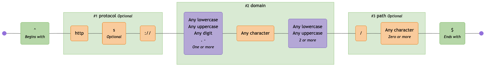

# regex-to-mermaid

A TypeScript library and CLI tool to visualize regular expressions as Mermaid flowchart diagrams.

For example, visualise this:

```regex
^(?<protocol>https?:\/\/)?(?<domain>[a-zA-Z0-9.-]+\.[a-zA-Z]{2,})(?<path>\/.*)?$
```

as this:



**[View this in the Mermaid Live Editor](https://mermaid.live/edit#pako:eNqVVttu2zgQ_RWCaYFmK8mWZOvCGk4d27svvQDtW6o0YCXaFlYmBYpGmxr-9yUpxhblJJsKfhBnOOccjmdG3MOcFQQi-Po1-ELW5BcC399cTWrOBMtZNd0IUTdXKMsG8nd5JV0F2-KSTr9h9_fMvRm6qefevs0yzxhu94FzuFQQWGymMsj76_LqVUYzuua43oAPXzIKgGT7JHkb9d4IzMX7PWg2uCYIrNy85Dk4vFO-VUmf8OCmIVyUjN75bzL4ffKDTyfldNJscVVNr8m6pA34WYrNZNCaJoNymsFLhNAxUuNUpSAcVxpFHbbdY6zWjkDuaGyez7XCwdU5yWMAoQRAg8H5hnyD-V1eSWFaxozeg4r9JDzHDVGEyrCra9tQlOtSqIUH3J4qSgDjYMs4ORemuFzNZWkbGV7lxrm0PasyeJHKk6Lgj_WMJcPg6VRGfbk23w3h7GnKLuCpjNSZXtkwS1q8pIhMQX_d_dAl3ha1WQCKt6S4y3Etdpzc-eBbBg36hf8ACx7aDRiXlHAqLSnH7MvgrcLuFK29DOxlqJaEFq3CJxQFXUXBUVHb5UfCboXaJKOzDcFLaMMubXhKhBwaf5qEsb2MLHr5vyyLdWfQANd1u8OjP0y0_5hfe0RYvsAeDpYvtPte-7opPOt6K3pkd2Y_OjjrRit6bPeR5YvsJurlIuh3hPbLEdypcXFftck0E1xbSrrWkpSaBVmdIGRwVaGL62gRzxKnEZz9S9BFGs5H8cKR9c44uhjq550FYBSa8L_T-XU6P4Yvo9QPk-fCTzPlQcBoFi-iI0KyjOfz8AzBHOsfznb1o-fSJeyaEjbQi3Q5W4T_dzYDPavr6t4QzBVqm8tWam9SOL0-dfoNZKnRHEo8oTJzghR6bgGuPumuYO6WcNnQxXvfG3pD6MA1LwuIBN8RBxqfvATslZoMig3ZEvmtkq8FWeFdJTKY0YMMqzG9YWz7ECkPst5AtMJVI1e7upDMixLLht8erVz2IuFztqMCIt9PNAhEe_gLoij0kmGSxtEwTIIwiH0H3kMUxIGXhmkaJdFwPBqHwcGBvzXr0EviUSqfJE6TkZ-EsQNJUQrGP7a3GH2ZOfwH-p7mkQ)**

## Features

- 🎓 **Visual Regex Understanding** - Convert complex regex patterns into intuitive flowcharts
- 🌐 **Wide Support** - Mermaid diagrams are embeddable in various tools like GitHub, GitLab, VS Code, Notion, Obsidian, Docusaurus and more
- 🔗 **Easy Sharing** - Share visual regex diagrams in documentation, presentations, or code reviews
- 📦 **CLI & Library** - Use as a command-line tool or integrate into your projects
- 🔍 **Comprehensive Support** - Handles capture groups, lookaheads, lookbehinds, and more
- 🥗 **Multiple Flavors** - Supports JavaScript (RegExp) and PCRE regex flavors
- 🎨 **Multiple Themes** - Choose from default, neutral, dark, forest, or no styling
- ⚡ **Fast & Modern** - Built with Bun and TypeScript as an ESM library for optimal performance

## Installation

```shell
bun install -g regex-to-mermaid
```

```shell
pnpm install -g regex-to-mermaid
```

```shell
npm install -g regex-to-mermaid
```

```shell
yarn global add regex-to-mermaid
```

## CLI Usage

Basic:

```shell
regex-to-mermaid 'foo|bar'
```

All options:

```shell
regex-to-mermaid 'foo|bar' \
  --theme dark \
  --direction TD \
  --flavor pcre \
  --output diagram.mmd
```

### Options

| Short | Argument      | Description                                                                          | Default   |
| ----- | ------------- | ------------------------------------------------------------------------------------ | --------- |
| `-d`  | `--direction` | Diagram direction: `LR` (left-right) or `TD` (top-down)                              | `LR`      |
| `-f`  | `--flavor`    | Regex flavor: `regexp` (JavaScript), `pcre` (PCRE), or `auto` (detect automatically) | `auto`    |
| `-t`  | `--theme`     | Mermaid theme: `default`, `neutral`, `dark`, `forest`, or `none`                     | `default` |
| `-o`  | `--output`    | Output file (if not specified, outputs to stdout)                                    | `stdout`  |

### Image Generation

Pipe to [@mermaid-js/mermaid-cli](https://www.npmjs.com/package/@mermaid-js/mermaid-cli) to output an SVG or PNG image:

```shell
regex-to-mermaid 'foo|bar' | npx @mermaid-js/mermaid-cli --input - --output diagram.png
```

## Library Usage

```typescript
import { regexToMermaid } from 'regex-to-mermaid';

const diagram = regexToMermaid('foo|bar');

console.log(diagram);
```

### API

```typescript
function regexToMermaid(
  pattern: string | RegExp,
  options?: {
    direction?: 'LR' | 'TD'; // Default: 'LR'
    flavor?: 'regexp' | 'pcre' | 'auto'; // Default: 'auto'
    theme?: 'default' | 'neutral' | 'dark' | 'forest' | 'none'; // Default: 'default'
  },
): string;
```

## Examples

See more [EXAMPLES.md](./EXAMPLES.md).

## Themes

See available [THEMES.md](./THEMES.md).

## Local Development

This project uses [Bun](https://bun.sh).

### Setup

```bash
# Clone the repository
git clone https://github.com/tayles/regex-to-mermaid.git
cd regex-to-mermaid

# Install dependencies
bun install

# Run tests
bun test

# Check types
bun run type-check

# Format/lint code
bun run lint
```

## Tech Stack

| Project                                                                                                                                                                   | Description               |
| ------------------------------------------------------------------------------------------------------------------------------------------------------------------------- | ------------------------- |
| [](https://www.typescriptlang.org)                | Typesafe JavaScript       |
| [](https://bun.sh)                                                     | Fast JavaScript runtime   |
| [](https://mermaid.js.org)                                 | Diagram generation        |
| [](https://biomejs.dev)                                          | Code formatting & linting |
| [](https://www.npmjs.com/package/regexp-tree) | Regex parsing to AST      |

## xkcd References

- [Regular Expressions](https://xkcd.com/208/)
- [Perl Problems](https://xkcd.com/1171/)
- [Regex Golf](https://xkcd.com/1313/)
- [Backslashes](https://xkcd.com/1638/)
