# Test Cases

Generated from [eslint-community/regexpp](https://github.com/eslint-community/regexpp/tree/main/test/fixtures) test fixtures.

> [!WARNING]  
> This page may take a long time to render

> [!TIP]
> If you are viewing this page somewhere that does not render embedded Mermaid diagrams, you can click the "view as image" links below, or view the diagrams by copy/pasting the code blocks below into the [Mermaid Live Editor](https://mermaid.live).

<!-- CONTENT:START -->

> **Snapshot Date:** 2025-11-02T15:18:25.838Z

## Table of Contents

- [basic-valid](#basic-valid) (216 patterns)
- [class-set-expression-escape-valid-2024](#class-set-expression-escape-valid-2024) (2 patterns)
- [class-set-expression-intersection-valid-2024](#class-set-expression-intersection-valid-2024) (22 patterns)
- [class-set-expression-proposal-regexp-v-flag-2024](#class-set-expression-proposal-regexp-v-flag-2024) (15 patterns)
- [class-set-expression-subtraction-valid-2024](#class-set-expression-subtraction-valid-2024) (17 patterns)
- [class-set-expression-valid-2024](#class-set-expression-valid-2024) (12 patterns)
- [duplicate-named-capturing-group-valid-2025](#duplicate-named-capturing-group-valid-2025) (3 patterns)
- [flags-2015](#flags-2015) (2 patterns)
- [flags-2018](#flags-2018) (1 patterns)
- [flags-2022](#flags-2022) (1 patterns)
- [flags-2024](#flags-2024) (1 patterns)
- [flags](#flags) (6 patterns)
- [lookbehind-assertion-valid-2018](#lookbehind-assertion-valid-2018) (16 patterns)
- [modifiers-valid-2025](#modifiers-valid-2025) (4 patterns)
- [named-backreferences-valid-2023](#named-backreferences-valid-2023) (2 patterns)
- [named-capturing-group-valid-2017](#named-capturing-group-valid-2017) (2 patterns)
- [named-capturing-group-valid-2018](#named-capturing-group-valid-2018) (25 patterns)
- [unicode-group-names-valid](#unicode-group-names-valid) (6 patterns)
- [unicode-property-escape-valid-2017](#unicode-property-escape-valid-2017) (4 patterns)
- [unicode-property-escape-valid-2018](#unicode-property-escape-valid-2018) (10 patterns)
- [unicode-property-escape-valid-2024](#unicode-property-escape-valid-2024) (1 patterns)

---

## basic-valid

Source: [basic-valid.json](https://github.com/eslint-community/regexpp/tree/main/test/fixtures/parser/literal/basic-valid.json)

### `/foo/`

```regex
regex-to-mermaid '/foo/'
```

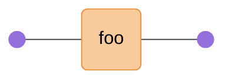

### `/foo|bar/`

```regex
regex-to-mermaid '/foo|bar/'
```

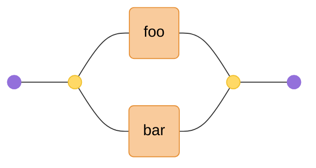

### `/||||/`

```regex
regex-to-mermaid '/||||/'
```

```mermaid
graph LR
  accTitle: "Regex: /||||/"
  accDescr: "Generated with regex-to-mermaid@2.0.0"

  %% Nodes
  start@{ shape: f-circ };
  fin@{ shape: f-circ };
  disjunction_begin_1:::disjunction@{ shape: f-circ };
  disjunction_end_1:::disjunction@{ shape: f-circ };

  %% Edges
  start --- disjunction_begin_1;
  disjunction_begin_1 --- disjunction_end_1;
  disjunction_begin_1 --- disjunction_end_1;
  disjunction_begin_1 --- disjunction_end_1;
  disjunction_begin_1 --- disjunction_end_1;
  disjunction_begin_1 --- disjunction_end_1;
  disjunction_end_1 --- fin;

  %% Styles
  %% Node Styling
  classDef disjunction fill:#FFD966,stroke:#F1C232,color:#000000;
```

### `/^|$|\b|\B/`

```regex
regex-to-mermaid '/^|$|\b|\B/'
```

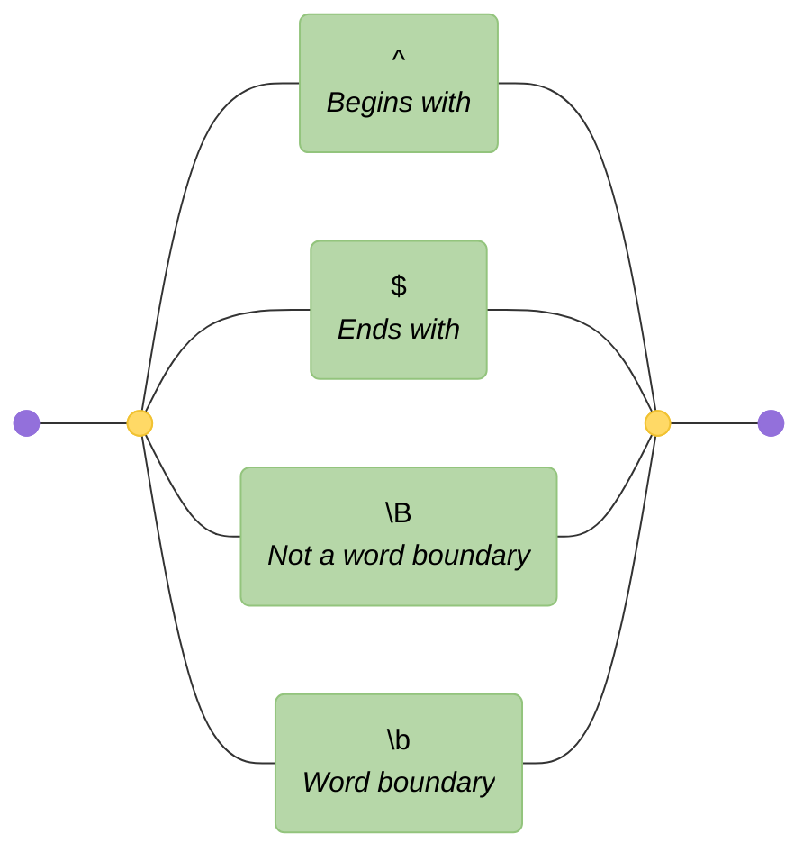

### `/(?=)/`

```regex
regex-to-mermaid '/(?=)/'
```

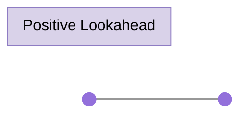

### `/(?=foo)/`

```regex
regex-to-mermaid '/(?=foo)/'
```

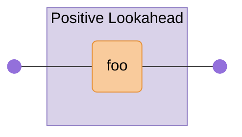

### `/(?!)/`

```regex
regex-to-mermaid '/(?!)/'
```

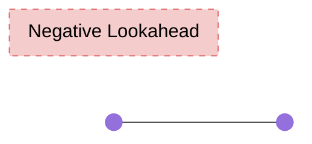

### `/(?!foo)/`

```regex
regex-to-mermaid '/(?!foo)/'
```

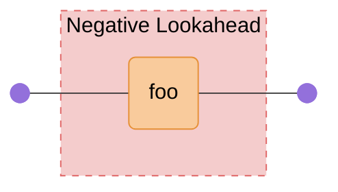

### `/(?=a)*/`

```regex
regex-to-mermaid '/(?=a)*/'
```


### `/(?=a)+/`

```regex
regex-to-mermaid '/(?=a)+/'
```

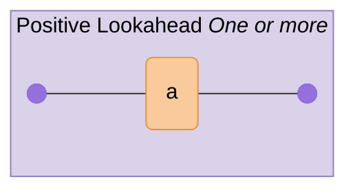

### `/(?=a)?/`

```regex
regex-to-mermaid '/(?=a)?/'
```

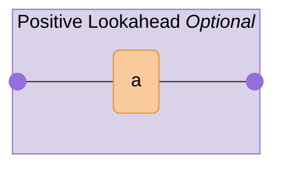

### `/(?=a){/`

```regex
regex-to-mermaid '/(?=a){/'
```

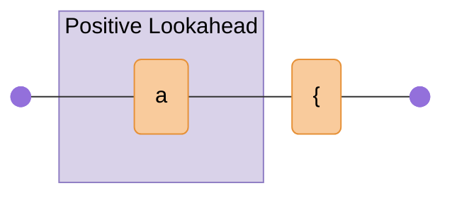

### `/(?=a){}/`

```regex
regex-to-mermaid '/(?=a){}/'
```

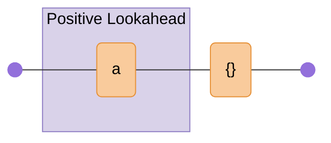

### `/(?=a){a}/`

```regex
regex-to-mermaid '/(?=a){a}/'
```

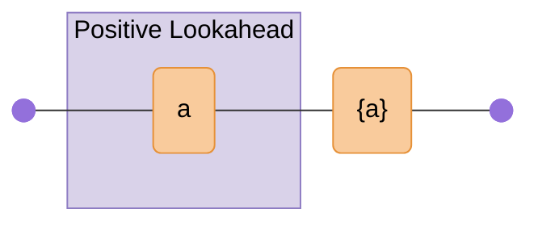

### `/(?=a){1}/`

```regex
regex-to-mermaid '/(?=a){1}/'
```

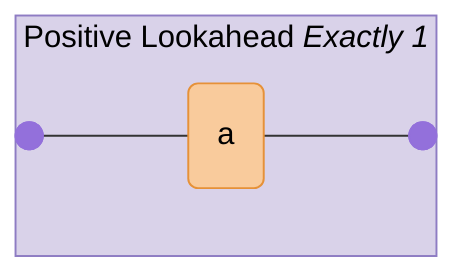

### `/(?=a){1,}/`

```regex
regex-to-mermaid '/(?=a){1,}/'
```


### `/(?=a){1,2}/`

```regex
regex-to-mermaid '/(?=a){1,2}/'
```

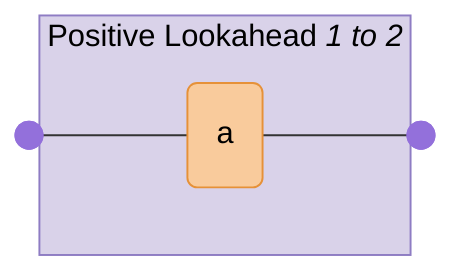

### `/a*/`

```regex
regex-to-mermaid '/a*/'
```

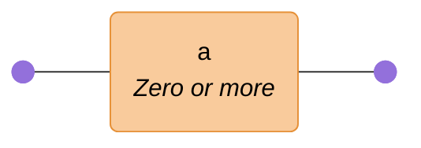

### `/a+/`

```regex
regex-to-mermaid '/a+/'
```

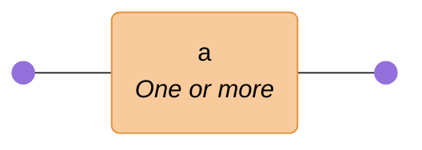

### `/a?/`

```regex
regex-to-mermaid '/a?/'
```

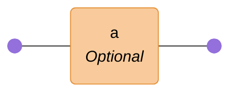

### `/a{/`

```regex
regex-to-mermaid '/a{/'
```

```mermaid
graph LR
  accTitle: "Regex: /a{/"
  accDescr: "Generated with regex-to-mermaid@2.0.0"

  %% Nodes
  start@{ shape: f-circ };
  fin@{ shape: f-circ };
  literal_1("a{"):::literal;

  %% Edges
  start --- literal_1;
  literal_1 --- fin;

  %% Styles
  %% Node Styling
  classDef literal fill:#F9CB9C,stroke:#E69138,color:#000000;
```

### `/a{}/`

```regex
regex-to-mermaid '/a{}/'
```

```mermaid
graph LR
  accTitle: "Regex: /a{}/"
  accDescr: "Generated with regex-to-mermaid@2.0.0"

  %% Nodes
  start@{ shape: f-circ };
  fin@{ shape: f-circ };
  literal_1("a{}"):::literal;

  %% Edges
  start --- literal_1;
  literal_1 --- fin;

  %% Styles
  %% Node Styling
  classDef literal fill:#F9CB9C,stroke:#E69138,color:#000000;
```

### `/a{a}/`

```regex
regex-to-mermaid '/a{a}/'
```

```mermaid
graph LR
  accTitle: "Regex: /a{a}/"
  accDescr: "Generated with regex-to-mermaid@2.0.0"

  %% Nodes
  start@{ shape: f-circ };
  fin@{ shape: f-circ };
  literal_1("a{a}"):::literal;

  %% Edges
  start --- literal_1;
  literal_1 --- fin;

  %% Styles
  %% Node Styling
  classDef literal fill:#F9CB9C,stroke:#E69138,color:#000000;
```

### `/a{1}/`

```regex
regex-to-mermaid '/a{1}/'
```

```mermaid
graph LR
  accTitle: "Regex: /a{1}/"
  accDescr: "Generated with regex-to-mermaid@2.0.0"

  %% Nodes
  start@{ shape: f-circ };
  fin@{ shape: f-circ };
  literal_1("a<br><i>Exactly 1</i>"):::literal;

  %% Edges
  start --- literal_1;
  literal_1 --- fin;

  %% Styles
  %% Node Styling
  classDef literal fill:#F9CB9C,stroke:#E69138,color:#000000;
```

### `/a{1/`

```regex
regex-to-mermaid '/a{1/'
```

```mermaid
graph LR
  accTitle: "Regex: /a{1/"
  accDescr: "Generated with regex-to-mermaid@2.0.0"

  %% Nodes
  start@{ shape: f-circ };
  fin@{ shape: f-circ };
  literal_1("a{1"):::literal;

  %% Edges
  start --- literal_1;
  literal_1 --- fin;

  %% Styles
  %% Node Styling
  classDef literal fill:#F9CB9C,stroke:#E69138,color:#000000;
```

### `/a{1,}/`

```regex
regex-to-mermaid '/a{1,}/'
```

```mermaid
graph LR
  accTitle: "Regex: /a{1,}/"
  accDescr: "Generated with regex-to-mermaid@2.0.0"

  %% Nodes
  start@{ shape: f-circ };
  fin@{ shape: f-circ };
  literal_1("a<br><i>One or more</i>"):::literal;

  %% Edges
  start --- literal_1;
  literal_1 --- fin;

  %% Styles
  %% Node Styling
  classDef literal fill:#F9CB9C,stroke:#E69138,color:#000000;
```

### `/a{1,/`

```regex
regex-to-mermaid '/a{1,/'
```

```mermaid
graph LR
  accTitle: "Regex: /a{1,/"
  accDescr: "Generated with regex-to-mermaid@2.0.0"

  %% Nodes
  start@{ shape: f-circ };
  fin@{ shape: f-circ };
  literal_1("a{1,"):::literal;

  %% Edges
  start --- literal_1;
  literal_1 --- fin;

  %% Styles
  %% Node Styling
  classDef literal fill:#F9CB9C,stroke:#E69138,color:#000000;
```

### `/a{1,2}/`

```regex
regex-to-mermaid '/a{1,2}/'
```

```mermaid
graph LR
  accTitle: "Regex: /a{1,2}/"
  accDescr: "Generated with regex-to-mermaid@2.0.0"

  %% Nodes
  start@{ shape: f-circ };
  fin@{ shape: f-circ };
  literal_1("a<br><i>1 to 2</i>"):::literal;

  %% Edges
  start --- literal_1;
  literal_1 --- fin;

  %% Styles
  %% Node Styling
  classDef literal fill:#F9CB9C,stroke:#E69138,color:#000000;
```

### `/a{1,2/`

```regex
regex-to-mermaid '/a{1,2/'
```

```mermaid
graph LR
  accTitle: "Regex: /a{1,2/"
  accDescr: "Generated with regex-to-mermaid@2.0.0"

  %% Nodes
  start@{ shape: f-circ };
  fin@{ shape: f-circ };
  literal_1("a{1,2"):::literal;

  %% Edges
  start --- literal_1;
  literal_1 --- fin;

  %% Styles
  %% Node Styling
  classDef literal fill:#F9CB9C,stroke:#E69138,color:#000000;
```

### `/a{2,1/`

```regex
regex-to-mermaid '/a{2,1/'
```

```mermaid
graph LR
  accTitle: "Regex: /a{2,1/"
  accDescr: "Generated with regex-to-mermaid@2.0.0"

  %% Nodes
  start@{ shape: f-circ };
  fin@{ shape: f-circ };
  literal_1("a{2,1"):::literal;

  %% Edges
  start --- literal_1;
  literal_1 --- fin;

  %% Styles
  %% Node Styling
  classDef literal fill:#F9CB9C,stroke:#E69138,color:#000000;
```

### `/a*?/`

```regex
regex-to-mermaid '/a*?/'
```

```mermaid
graph LR
  accTitle: "Regex: /a*?/"
  accDescr: "Generated with regex-to-mermaid@2.0.0"

  %% Nodes
  start@{ shape: f-circ };
  fin@{ shape: f-circ };
  literal_1("a<br><i>Zero or more (non-greedy)</i>"):::literal;

  %% Edges
  start --- literal_1;
  literal_1 --- fin;

  %% Styles
  %% Node Styling
  classDef literal fill:#F9CB9C,stroke:#E69138,color:#000000;
```

### `/a+?/`

```regex
regex-to-mermaid '/a+?/'
```

```mermaid
graph LR
  accTitle: "Regex: /a+?/"
  accDescr: "Generated with regex-to-mermaid@2.0.0"

  %% Nodes
  start@{ shape: f-circ };
  fin@{ shape: f-circ };
  literal_1("a<br><i>One or more (non-greedy)</i>"):::literal;

  %% Edges
  start --- literal_1;
  literal_1 --- fin;

  %% Styles
  %% Node Styling
  classDef literal fill:#F9CB9C,stroke:#E69138,color:#000000;
```

### `/a??/`

```regex
regex-to-mermaid '/a??/'
```

```mermaid
graph LR
  accTitle: "Regex: /a??/"
  accDescr: "Generated with regex-to-mermaid@2.0.0"

  %% Nodes
  start@{ shape: f-circ };
  fin@{ shape: f-circ };
  literal_1("a<br><i>Optional (non-greedy)</i>"):::literal;

  %% Edges
  start --- literal_1;
  literal_1 --- fin;

  %% Styles
  %% Node Styling
  classDef literal fill:#F9CB9C,stroke:#E69138,color:#000000;
```

### `/a{?/`

```regex
regex-to-mermaid '/a{?/'
```

```mermaid
graph LR
  accTitle: "Regex: /a{?/"
  accDescr: "Generated with regex-to-mermaid@2.0.0"

  %% Nodes
  start@{ shape: f-circ };
  fin@{ shape: f-circ };
  literal_1("a"):::literal;
  literal_2("{<br><i>Optional</i>"):::literal;

  %% Edges
  start --- literal_1;
  literal_1 --- literal_2;
  literal_2 --- fin;

  %% Styles
  %% Node Styling
  classDef literal fill:#F9CB9C,stroke:#E69138,color:#000000;
```

### `/a{}?/`

```regex
regex-to-mermaid '/a{}?/'
```

```mermaid
graph LR
  accTitle: "Regex: /a{}?/"
  accDescr: "Generated with regex-to-mermaid@2.0.0"

  %% Nodes
  start@{ shape: f-circ };
  fin@{ shape: f-circ };
  literal_1("a{"):::literal;
  literal_2("}<br><i>Optional</i>"):::literal;

  %% Edges
  start --- literal_1;
  literal_1 --- literal_2;
  literal_2 --- fin;

  %% Styles
  %% Node Styling
  classDef literal fill:#F9CB9C,stroke:#E69138,color:#000000;
```

### `/a{a}?/`

```regex
regex-to-mermaid '/a{a}?/'
```

```mermaid
graph LR
  accTitle: "Regex: /a{a}?/"
  accDescr: "Generated with regex-to-mermaid@2.0.0"

  %% Nodes
  start@{ shape: f-circ };
  fin@{ shape: f-circ };
  literal_1("a{a"):::literal;
  literal_2("}<br><i>Optional</i>"):::literal;

  %% Edges
  start --- literal_1;
  literal_1 --- literal_2;
  literal_2 --- fin;

  %% Styles
  %% Node Styling
  classDef literal fill:#F9CB9C,stroke:#E69138,color:#000000;
```

### `/a{1}?/`

```regex
regex-to-mermaid '/a{1}?/'
```

```mermaid
graph LR
  accTitle: "Regex: /a{1}?/"
  accDescr: "Generated with regex-to-mermaid@2.0.0"

  %% Nodes
  start@{ shape: f-circ };
  fin@{ shape: f-circ };
  literal_1("a<br><i>Exactly 1 (non-greedy)</i>"):::literal;

  %% Edges
  start --- literal_1;
  literal_1 --- fin;

  %% Styles
  %% Node Styling
  classDef literal fill:#F9CB9C,stroke:#E69138,color:#000000;
```

### `/a{1?/`

```regex
regex-to-mermaid '/a{1?/'
```

```mermaid
graph LR
  accTitle: "Regex: /a{1?/"
  accDescr: "Generated with regex-to-mermaid@2.0.0"

  %% Nodes
  start@{ shape: f-circ };
  fin@{ shape: f-circ };
  literal_1("a{"):::literal;
  literal_2("1<br><i>Optional</i>"):::literal;

  %% Edges
  start --- literal_1;
  literal_1 --- literal_2;
  literal_2 --- fin;

  %% Styles
  %% Node Styling
  classDef literal fill:#F9CB9C,stroke:#E69138,color:#000000;
```

### `/a{1,}?/`

```regex
regex-to-mermaid '/a{1,}?/'
```

```mermaid
graph LR
  accTitle: "Regex: /a{1,}?/"
  accDescr: "Generated with regex-to-mermaid@2.0.0"

  %% Nodes
  start@{ shape: f-circ };
  fin@{ shape: f-circ };
  literal_1("a<br><i>One or more (non-greedy)</i>"):::literal;

  %% Edges
  start --- literal_1;
  literal_1 --- fin;

  %% Styles
  %% Node Styling
  classDef literal fill:#F9CB9C,stroke:#E69138,color:#000000;
```

### `/a{1,?/`

```regex
regex-to-mermaid '/a{1,?/'
```

```mermaid
graph LR
  accTitle: "Regex: /a{1,?/"
  accDescr: "Generated with regex-to-mermaid@2.0.0"

  %% Nodes
  start@{ shape: f-circ };
  fin@{ shape: f-circ };
  literal_1("a{1"):::literal;
  literal_2(",<br><i>Optional</i>"):::literal;

  %% Edges
  start --- literal_1;
  literal_1 --- literal_2;
  literal_2 --- fin;

  %% Styles
  %% Node Styling
  classDef literal fill:#F9CB9C,stroke:#E69138,color:#000000;
```

### `/a{1,2}?/`

```regex
regex-to-mermaid '/a{1,2}?/'
```

```mermaid
graph LR
  accTitle: "Regex: /a{1,2}?/"
  accDescr: "Generated with regex-to-mermaid@2.0.0"

  %% Nodes
  start@{ shape: f-circ };
  fin@{ shape: f-circ };
  literal_1("a<br><i>1 to 2 (non-greedy)</i>"):::literal;

  %% Edges
  start --- literal_1;
  literal_1 --- fin;

  %% Styles
  %% Node Styling
  classDef literal fill:#F9CB9C,stroke:#E69138,color:#000000;
```

### `/a{1,2?/`

```regex
regex-to-mermaid '/a{1,2?/'
```

```mermaid
graph LR
  accTitle: "Regex: /a{1,2?/"
  accDescr: "Generated with regex-to-mermaid@2.0.0"

  %% Nodes
  start@{ shape: f-circ };
  fin@{ shape: f-circ };
  literal_1("a{1,"):::literal;
  literal_2("2<br><i>Optional</i>"):::literal;

  %% Edges
  start --- literal_1;
  literal_1 --- literal_2;
  literal_2 --- fin;

  %% Styles
  %% Node Styling
  classDef literal fill:#F9CB9C,stroke:#E69138,color:#000000;
```

### `/a{2,1?/`

```regex
regex-to-mermaid '/a{2,1?/'
```

```mermaid
graph LR
  accTitle: "Regex: /a{2,1?/"
  accDescr: "Generated with regex-to-mermaid@2.0.0"

  %% Nodes
  start@{ shape: f-circ };
  fin@{ shape: f-circ };
  literal_1("a{2,"):::literal;
  literal_2("1<br><i>Optional</i>"):::literal;

  %% Edges
  start --- literal_1;
  literal_1 --- literal_2;
  literal_2 --- fin;

  %% Styles
  %% Node Styling
  classDef literal fill:#F9CB9C,stroke:#E69138,color:#000000;
```

### `/👍🚀❇️/`

```regex
regex-to-mermaid '/👍🚀❇️/'
```

```mermaid
graph LR
  accTitle: "Regex: /👍🚀❇️/"
  accDescr: "Generated with regex-to-mermaid@2.0.0"

  %% Nodes
  start@{ shape: f-circ };
  fin@{ shape: f-circ };
  literal_1("👍🚀❇️"):::literal;

  %% Edges
  start --- literal_1;
  literal_1 --- fin;

  %% Styles
  %% Node Styling
  classDef literal fill:#F9CB9C,stroke:#E69138,color:#000000;
```

### `/^/`

```regex
regex-to-mermaid '/^/'
```

```mermaid
graph LR
  accTitle: "Regex: /^/"
  accDescr: "Generated with regex-to-mermaid@2.0.0"

  %% Nodes
  start@{ shape: f-circ };
  fin@{ shape: f-circ };
  assertion_1("^<br><i>Begins with</i>"):::assertion;

  %% Edges
  start --- assertion_1;
  assertion_1 --- fin;

  %% Styles
  %% Node Styling
  classDef assertion fill:#B6D7A8,stroke:#93C47D,color:#000000;
```

### `/$/`

```regex
regex-to-mermaid '/$/'
```

```mermaid
graph LR
  accTitle: "Regex: /$/"
  accDescr: "Generated with regex-to-mermaid@2.0.0"

  %% Nodes
  start@{ shape: f-circ };
  fin@{ shape: f-circ };
  assertion_1("$<br><i>Ends with</i>"):::assertion;

  %% Edges
  start --- assertion_1;
  assertion_1 --- fin;

  %% Styles
  %% Node Styling
  classDef assertion fill:#B6D7A8,stroke:#93C47D,color:#000000;
```

### `/./`

```regex
regex-to-mermaid '/./'
```

```mermaid
graph LR
  accTitle: "Regex: /./"
  accDescr: "Generated with regex-to-mermaid@2.0.0"

  %% Nodes
  start@{ shape: f-circ };
  fin@{ shape: f-circ };
  char_set_1("Any character"):::char-set;

  %% Edges
  start --- char_set_1;
  char_set_1 --- fin;

  %% Styles
  %% Node Styling
  classDef char-set fill:#9FA8DA,stroke:#5C6BC0,color:#000000;
```

### `/]/`

```regex
regex-to-mermaid '/]/'
```

```mermaid
graph LR
  accTitle: "Regex: /]/"
  accDescr: "Generated with regex-to-mermaid@2.0.0"

  %% Nodes
  start@{ shape: f-circ };
  fin@{ shape: f-circ };
  literal_1("]"):::literal;

  %% Edges
  start --- literal_1;
  literal_1 --- fin;

  %% Styles
  %% Node Styling
  classDef literal fill:#F9CB9C,stroke:#E69138,color:#000000;
```

### `/{/`

```regex
regex-to-mermaid '/{/'
```

```mermaid
graph LR
  accTitle: "Regex: /{/"
  accDescr: "Generated with regex-to-mermaid@2.0.0"

  %% Nodes
  start@{ shape: f-circ };
  fin@{ shape: f-circ };
  literal_1("{"):::literal;

  %% Edges
  start --- literal_1;
  literal_1 --- fin;

  %% Styles
  %% Node Styling
  classDef literal fill:#F9CB9C,stroke:#E69138,color:#000000;
```

### `/}/`

```regex
regex-to-mermaid '/}/'
```

```mermaid
graph LR
  accTitle: "Regex: /}/"
  accDescr: "Generated with regex-to-mermaid@2.0.0"

  %% Nodes
  start@{ shape: f-circ };
  fin@{ shape: f-circ };
  literal_1("}"):::literal;

  %% Edges
  start --- literal_1;
  literal_1 --- fin;

  %% Styles
  %% Node Styling
  classDef literal fill:#F9CB9C,stroke:#E69138,color:#000000;
```

### `/|/`

```regex
regex-to-mermaid '/|/'
```

```mermaid
graph LR
  accTitle: "Regex: /|/"
  accDescr: "Generated with regex-to-mermaid@2.0.0"

  %% Nodes
  start@{ shape: f-circ };
  fin@{ shape: f-circ };
  disjunction_begin_1:::disjunction@{ shape: f-circ };
  disjunction_end_1:::disjunction@{ shape: f-circ };

  %% Edges
  start --- disjunction_begin_1;
  disjunction_begin_1 --- disjunction_end_1;
  disjunction_begin_1 --- disjunction_end_1;
  disjunction_end_1 --- fin;

  %% Styles
  %% Node Styling
  classDef disjunction fill:#FFD966,stroke:#F1C232,color:#000000;
```

### `/${1,2/`

```regex
regex-to-mermaid '/${1,2/'
```

```mermaid
graph LR
  accTitle: "Regex: /${1,2/"
  accDescr: "Generated with regex-to-mermaid@2.0.0"

  %% Nodes
  start@{ shape: f-circ };
  fin@{ shape: f-circ };
  assertion_1("$<br><i>Ends with</i>"):::assertion;
  literal_1("{1,2"):::literal;

  %% Edges
  start --- assertion_1;
  assertion_1 --- literal_1;
  literal_1 --- fin;

  %% Styles
  %% Node Styling
  classDef assertion fill:#B6D7A8,stroke:#93C47D,color:#000000;
  classDef literal fill:#F9CB9C,stroke:#E69138,color:#000000;
```

### `/\1/`

```regex
regex-to-mermaid '/\1/'
```

```mermaid
graph LR
  accTitle: "Regex: /\\1/"
  accDescr: "Generated with regex-to-mermaid@2.0.0"

  %% Nodes
  start@{ shape: f-circ };
  fin@{ shape: f-circ };
  literal_1("\1"):::literal;

  %% Edges
  start --- literal_1;
  literal_1 --- fin;

  %% Styles
  %% Node Styling
  classDef literal fill:#F9CB9C,stroke:#E69138,color:#000000;
```

### `/(a)\1/`

```regex
regex-to-mermaid '/(a)\1/'
```

```mermaid
graph LR
  accTitle: "Regex: /(a)\\1/"
  accDescr: "Generated with regex-to-mermaid@2.0.0"

  %% Nodes
  start@{ shape: f-circ };
  fin@{ shape: f-circ };
  literal_1("a"):::literal;
  back_reference_1("\\1<br><i>Back-reference</i>"):::back-reference;

  %% Subgraphs
  subgraph standard_1 ["Group #1"]
    literal_1
  end

  %% Edges
  start --- literal_1;
  literal_1 --- back_reference_1;
  back_reference_1 --- fin;

  %% Styles
  %% Node Styling
  classDef literal fill:#F9CB9C,stroke:#E69138,color:#000000;
  classDef back-reference fill:#F4CCCC,stroke:#E06666,color:#000000;

  %% Group Styling
  classDef standard fill:#FFF2CC,stroke:#F1C232,color:#000000;

  %% Apply Group Classes
  class standard_1 standard;
```

### `/\1(a)/`

```regex
regex-to-mermaid '/\1(a)/'
```

```mermaid
graph LR
  accTitle: "Regex: /\\1(a)/"
  accDescr: "Generated with regex-to-mermaid@2.0.0"

  %% Nodes
  start@{ shape: f-circ };
  fin@{ shape: f-circ };
  back_reference_1("\\1<br><i>Back-reference</i>"):::back-reference;
  literal_1("a"):::literal;

  %% Subgraphs
  subgraph standard_1 ["Group #1"]
    literal_1
  end

  %% Edges
  start --- back_reference_1;
  back_reference_1 --- literal_1;
  literal_1 --- fin;

  %% Styles
  %% Node Styling
  classDef back-reference fill:#F4CCCC,stroke:#E06666,color:#000000;
  classDef literal fill:#F9CB9C,stroke:#E69138,color:#000000;

  %% Group Styling
  classDef standard fill:#FFF2CC,stroke:#F1C232,color:#000000;

  %% Apply Group Classes
  class standard_1 standard;
```

### `/(?:a)\1/`

```regex
regex-to-mermaid '/(?:a)\1/'
```

```mermaid
graph LR
  accTitle: "Regex: /(?:a)\\1/"
  accDescr: "Generated with regex-to-mermaid@2.0.0"

  %% Nodes
  start@{ shape: f-circ };
  fin@{ shape: f-circ };
  literal_1("a"):::literal;
  literal_2("\1"):::literal;

  %% Subgraphs
  subgraph non_capturing_1 ["Non-capturing"]
    literal_1
  end

  %% Edges
  start --- literal_1;
  literal_1 --- literal_2;
  literal_2 --- fin;

  %% Styles
  %% Node Styling
  classDef literal fill:#F9CB9C,stroke:#E69138,color:#000000;

  %% Group Styling
  classDef non-capturing fill:#CFE2F3,stroke:#6D9EEB,color:#000000;

  %% Apply Group Classes
  class non_capturing_1 non-capturing;
```

### `/(a)\2/`

```regex
regex-to-mermaid '/(a)\2/'
```

```mermaid
graph LR
  accTitle: "Regex: /(a)\\2/"
  accDescr: "Generated with regex-to-mermaid@2.0.0"

  %% Nodes
  start@{ shape: f-circ };
  fin@{ shape: f-circ };
  literal_1("a"):::literal;
  literal_2("\2"):::literal;

  %% Subgraphs
  subgraph standard_1 ["Group #1"]
    literal_1
  end

  %% Edges
  start --- literal_1;
  literal_1 --- literal_2;
  literal_2 --- fin;

  %% Styles
  %% Node Styling
  classDef literal fill:#F9CB9C,stroke:#E69138,color:#000000;

  %% Group Styling
  classDef standard fill:#FFF2CC,stroke:#F1C232,color:#000000;

  %% Apply Group Classes
  class standard_1 standard;
```

### `/(?:a)\2/`

```regex
regex-to-mermaid '/(?:a)\2/'
```

```mermaid
graph LR
  accTitle: "Regex: /(?:a)\\2/"
  accDescr: "Generated with regex-to-mermaid@2.0.0"

  %% Nodes
  start@{ shape: f-circ };
  fin@{ shape: f-circ };
  literal_1("a"):::literal;
  literal_2("\2"):::literal;

  %% Subgraphs
  subgraph non_capturing_1 ["Non-capturing"]
    literal_1
  end

  %% Edges
  start --- literal_1;
  literal_1 --- literal_2;
  literal_2 --- fin;

  %% Styles
  %% Node Styling
  classDef literal fill:#F9CB9C,stroke:#E69138,color:#000000;

  %% Group Styling
  classDef non-capturing fill:#CFE2F3,stroke:#6D9EEB,color:#000000;

  %% Apply Group Classes
  class non_capturing_1 non-capturing;
```

### `/(a)(a)(a)(a)(a)(a)(a)(a)(a)(a)\10/`

```regex
regex-to-mermaid '/(a)(a)(a)(a)(a)(a)(a)(a)(a)(a)\10/'
```

```mermaid
graph LR
  accTitle: "Regex: /(a)(a)(a)(a)(a)(a)(a)(a)(a)(a)\\10/"
  accDescr: "Generated with regex-to-mermaid@2.0.0"

  %% Nodes
  start@{ shape: f-circ };
  fin@{ shape: f-circ };
  literal_1("a"):::literal;
  literal_2("a"):::literal;
  literal_3("a"):::literal;
  literal_4("a"):::literal;
  literal_5("a"):::literal;
  literal_6("a"):::literal;
  literal_7("a"):::literal;
  literal_8("a"):::literal;
  literal_9("a"):::literal;
  literal_10("a"):::literal;
  back_reference_1("\\10<br><i>Back-reference</i>"):::back-reference;

  %% Subgraphs
  subgraph standard_1 ["Group #1"]
    literal_1
  end

  subgraph standard_2 ["Group #2"]
    literal_2
  end

  subgraph standard_3 ["Group #3"]
    literal_3
  end

  subgraph standard_4 ["Group #4"]
    literal_4
  end

  subgraph standard_5 ["Group #5"]
    literal_5
  end

  subgraph standard_6 ["Group #6"]
    literal_6
  end

  subgraph standard_7 ["Group #7"]
    literal_7
  end

  subgraph standard_8 ["Group #8"]
    literal_8
  end

  subgraph standard_9 ["Group #9"]
    literal_9
  end

  subgraph standard_10 ["Group #10"]
    literal_10
  end

  %% Edges
  start --- literal_1;
  literal_1 --- literal_2;
  literal_2 --- literal_3;
  literal_3 --- literal_4;
  literal_4 --- literal_5;
  literal_5 --- literal_6;
  literal_6 --- literal_7;
  literal_7 --- literal_8;
  literal_8 --- literal_9;
  literal_9 --- literal_10;
  literal_10 --- back_reference_1;
  back_reference_1 --- fin;

  %% Styles
  %% Node Styling
  classDef literal fill:#F9CB9C,stroke:#E69138,color:#000000;
  classDef back-reference fill:#F4CCCC,stroke:#E06666,color:#000000;

  %% Group Styling
  classDef standard fill:#FFF2CC,stroke:#F1C232,color:#000000;

  %% Apply Group Classes
  class standard_1,standard_2,standard_3,standard_4,standard_5,standard_6,standard_7,standard_8,standard_9,standard_10 standard;
```

### `/(a)(a)(a)(a)(a)(a)(a)(a)(a)(a)\11/`

```regex
regex-to-mermaid '/(a)(a)(a)(a)(a)(a)(a)(a)(a)(a)\11/'
```

```mermaid
graph LR
  accTitle: "Regex: /(a)(a)(a)(a)(a)(a)(a)(a)(a)(a)\\11/"
  accDescr: "Generated with regex-to-mermaid@2.0.0"

  %% Nodes
  start@{ shape: f-circ };
  fin@{ shape: f-circ };
  literal_1("a"):::literal;
  literal_2("a"):::literal;
  literal_3("a"):::literal;
  literal_4("a"):::literal;
  literal_5("a"):::literal;
  literal_6("a"):::literal;
  literal_7("a"):::literal;
  literal_8("a"):::literal;
  literal_9("a"):::literal;
  literal_10("a"):::literal;
  literal_11("\11"):::literal;

  %% Subgraphs
  subgraph standard_1 ["Group #1"]
    literal_1
  end

  subgraph standard_2 ["Group #2"]
    literal_2
  end

  subgraph standard_3 ["Group #3"]
    literal_3
  end

  subgraph standard_4 ["Group #4"]
    literal_4
  end

  subgraph standard_5 ["Group #5"]
    literal_5
  end

  subgraph standard_6 ["Group #6"]
    literal_6
  end

  subgraph standard_7 ["Group #7"]
    literal_7
  end

  subgraph standard_8 ["Group #8"]
    literal_8
  end

  subgraph standard_9 ["Group #9"]
    literal_9
  end

  subgraph standard_10 ["Group #10"]
    literal_10
  end

  %% Edges
  start --- literal_1;
  literal_1 --- literal_2;
  literal_2 --- literal_3;
  literal_3 --- literal_4;
  literal_4 --- literal_5;
  literal_5 --- literal_6;
  literal_6 --- literal_7;
  literal_7 --- literal_8;
  literal_8 --- literal_9;
  literal_9 --- literal_10;
  literal_10 --- literal_11;
  literal_11 --- fin;

  %% Styles
  %% Node Styling
  classDef literal fill:#F9CB9C,stroke:#E69138,color:#000000;

  %% Group Styling
  classDef standard fill:#FFF2CC,stroke:#F1C232,color:#000000;

  %% Apply Group Classes
  class standard_1,standard_2,standard_3,standard_4,standard_5,standard_6,standard_7,standard_8,standard_9,standard_10 standard;
```

### `/(a)(a)(a)(a)(a)(a)(a)(a)(a)(a)(a)\11/`

```regex
regex-to-mermaid '/(a)(a)(a)(a)(a)(a)(a)(a)(a)(a)(a)\11/'
```

```mermaid
graph LR
  accTitle: "Regex: /(a)(a)(a)(a)(a)(a)(a)(a)(a)(a)(a)\\11/"
  accDescr: "Generated with regex-to-mermaid@2.0.0"

  %% Nodes
  start@{ shape: f-circ };
  fin@{ shape: f-circ };
  literal_1("a"):::literal;
  literal_2("a"):::literal;
  literal_3("a"):::literal;
  literal_4("a"):::literal;
  literal_5("a"):::literal;
  literal_6("a"):::literal;
  literal_7("a"):::literal;
  literal_8("a"):::literal;
  literal_9("a"):::literal;
  literal_10("a"):::literal;
  literal_11("a"):::literal;
  back_reference_1("\\11<br><i>Back-reference</i>"):::back-reference;

  %% Subgraphs
  subgraph standard_1 ["Group #1"]
    literal_1
  end

  subgraph standard_2 ["Group #2"]
    literal_2
  end

  subgraph standard_3 ["Group #3"]
    literal_3
  end

  subgraph standard_4 ["Group #4"]
    literal_4
  end

  subgraph standard_5 ["Group #5"]
    literal_5
  end

  subgraph standard_6 ["Group #6"]
    literal_6
  end

  subgraph standard_7 ["Group #7"]
    literal_7
  end

  subgraph standard_8 ["Group #8"]
    literal_8
  end

  subgraph standard_9 ["Group #9"]
    literal_9
  end

  subgraph standard_10 ["Group #10"]
    literal_10
  end

  subgraph standard_11 ["Group #11"]
    literal_11
  end

  %% Edges
  start --- literal_1;
  literal_1 --- literal_2;
  literal_2 --- literal_3;
  literal_3 --- literal_4;
  literal_4 --- literal_5;
  literal_5 --- literal_6;
  literal_6 --- literal_7;
  literal_7 --- literal_8;
  literal_8 --- literal_9;
  literal_9 --- literal_10;
  literal_10 --- literal_11;
  literal_11 --- back_reference_1;
  back_reference_1 --- fin;

  %% Styles
  %% Node Styling
  classDef literal fill:#F9CB9C,stroke:#E69138,color:#000000;
  classDef back-reference fill:#F4CCCC,stroke:#E06666,color:#000000;

  %% Group Styling
  classDef standard fill:#FFF2CC,stroke:#F1C232,color:#000000;

  %% Apply Group Classes
  class standard_1,standard_2,standard_3,standard_4,standard_5,standard_6,standard_7,standard_8,standard_9,standard_10,standard_11 standard;
```

### `/(?:a)/`

```regex
regex-to-mermaid '/(?:a)/'
```

```mermaid
graph LR
  accTitle: "Regex: /(?:a)/"
  accDescr: "Generated with regex-to-mermaid@2.0.0"

  %% Nodes
  start@{ shape: f-circ };
  fin@{ shape: f-circ };
  literal_1("a"):::literal;

  %% Subgraphs
  subgraph non_capturing_1 ["Non-capturing"]
    literal_1
  end

  %% Edges
  start --- literal_1;
  literal_1 --- fin;

  %% Styles
  %% Node Styling
  classDef literal fill:#F9CB9C,stroke:#E69138,color:#000000;

  %% Group Styling
  classDef non-capturing fill:#CFE2F3,stroke:#6D9EEB,color:#000000;

  %% Apply Group Classes
  class non_capturing_1 non-capturing;
```

### `/\d/`

```regex
regex-to-mermaid '/\d/'
```

```mermaid
graph LR
  accTitle: "Regex: /\\d/"
  accDescr: "Generated with regex-to-mermaid@2.0.0"

  %% Nodes
  start@{ shape: f-circ };
  fin@{ shape: f-circ };
  char_set_1("Any digit"):::char-set;

  %% Edges
  start --- char_set_1;
  char_set_1 --- fin;

  %% Styles
  %% Node Styling
  classDef char-set fill:#9FA8DA,stroke:#5C6BC0,color:#000000;
```

### `/\D/`

```regex
regex-to-mermaid '/\D/'
```

```mermaid
graph LR
  accTitle: "Regex: /\\D/"
  accDescr: "Generated with regex-to-mermaid@2.0.0"

  %% Nodes
  start@{ shape: f-circ };
  fin@{ shape: f-circ };
  char_set_1("Not a digit"):::negated-char-set;

  %% Edges
  start --- char_set_1;
  char_set_1 --- fin;

  %% Styles
  %% Node Styling
  classDef negated-char-set fill:#EF9A9A,stroke:#E53935,color:#000000,stroke-dasharray: 5 5;
```

### `/\s/`

```regex
regex-to-mermaid '/\s/'
```

```mermaid
graph LR
  accTitle: "Regex: /\\s/"
  accDescr: "Generated with regex-to-mermaid@2.0.0"

  %% Nodes
  start@{ shape: f-circ };
  fin@{ shape: f-circ };
  char_set_1("Any whitespace"):::char-set;

  %% Edges
  start --- char_set_1;
  char_set_1 --- fin;

  %% Styles
  %% Node Styling
  classDef char-set fill:#9FA8DA,stroke:#5C6BC0,color:#000000;
```

### `/\S/`

```regex
regex-to-mermaid '/\S/'
```

```mermaid
graph LR
  accTitle: "Regex: /\\S/"
  accDescr: "Generated with regex-to-mermaid@2.0.0"

  %% Nodes
  start@{ shape: f-circ };
  fin@{ shape: f-circ };
  char_set_1("Not whitespace"):::negated-char-set;

  %% Edges
  start --- char_set_1;
  char_set_1 --- fin;

  %% Styles
  %% Node Styling
  classDef negated-char-set fill:#EF9A9A,stroke:#E53935,color:#000000,stroke-dasharray: 5 5;
```

### `/\w/`

```regex
regex-to-mermaid '/\w/'
```

```mermaid
graph LR
  accTitle: "Regex: /\\w/"
  accDescr: "Generated with regex-to-mermaid@2.0.0"

  %% Nodes
  start@{ shape: f-circ };
  fin@{ shape: f-circ };
  char_set_1("Any word character"):::char-set;

  %% Edges
  start --- char_set_1;
  char_set_1 --- fin;

  %% Styles
  %% Node Styling
  classDef char-set fill:#9FA8DA,stroke:#5C6BC0,color:#000000;
```

### `/\W/`

```regex
regex-to-mermaid '/\W/'
```

```mermaid
graph LR
  accTitle: "Regex: /\\W/"
  accDescr: "Generated with regex-to-mermaid@2.0.0"

  %% Nodes
  start@{ shape: f-circ };
  fin@{ shape: f-circ };
  char_set_1("Not a word character"):::negated-char-set;

  %% Edges
  start --- char_set_1;
  char_set_1 --- fin;

  %% Styles
  %% Node Styling
  classDef negated-char-set fill:#EF9A9A,stroke:#E53935,color:#000000,stroke-dasharray: 5 5;
```

### `/\f/`

```regex
regex-to-mermaid '/\f/'
```

```mermaid
graph LR
  accTitle: "Regex: /\\f/"
  accDescr: "Generated with regex-to-mermaid@2.0.0"

  %% Nodes
  start@{ shape: f-circ };
  fin@{ shape: f-circ };
  literal_1("Form feed"):::literal;

  %% Edges
  start --- literal_1;
  literal_1 --- fin;

  %% Styles
  %% Node Styling
  classDef literal fill:#F9CB9C,stroke:#E69138,color:#000000;
```

### `/\n/`

```regex
regex-to-mermaid '/\n/'
```

```mermaid
graph LR
  accTitle: "Regex: /\\n/"
  accDescr: "Generated with regex-to-mermaid@2.0.0"

  %% Nodes
  start@{ shape: f-circ };
  fin@{ shape: f-circ };
  literal_1("Newline"):::literal;

  %% Edges
  start --- literal_1;
  literal_1 --- fin;

  %% Styles
  %% Node Styling
  classDef literal fill:#F9CB9C,stroke:#E69138,color:#000000;
```

### `/\r/`

```regex
regex-to-mermaid '/\r/'
```

```mermaid
graph LR
  accTitle: "Regex: /\\r/"
  accDescr: "Generated with regex-to-mermaid@2.0.0"

  %% Nodes
  start@{ shape: f-circ };
  fin@{ shape: f-circ };
  literal_1("Return"):::literal;

  %% Edges
  start --- literal_1;
  literal_1 --- fin;

  %% Styles
  %% Node Styling
  classDef literal fill:#F9CB9C,stroke:#E69138,color:#000000;
```

### `/\t/`

```regex
regex-to-mermaid '/\t/'
```

```mermaid
graph LR
  accTitle: "Regex: /\\t/"
  accDescr: "Generated with regex-to-mermaid@2.0.0"

  %% Nodes
  start@{ shape: f-circ };
  fin@{ shape: f-circ };
  literal_1("Tab"):::literal;

  %% Edges
  start --- literal_1;
  literal_1 --- fin;

  %% Styles
  %% Node Styling
  classDef literal fill:#F9CB9C,stroke:#E69138,color:#000000;
```

### `/\v/`

```regex
regex-to-mermaid '/\v/'
```

```mermaid
graph LR
  accTitle: "Regex: /\\v/"
  accDescr: "Generated with regex-to-mermaid@2.0.0"

  %% Nodes
  start@{ shape: f-circ };
  fin@{ shape: f-circ };
  literal_1("Vertical tab"):::literal;

  %% Edges
  start --- literal_1;
  literal_1 --- fin;

  %% Styles
  %% Node Styling
  classDef literal fill:#F9CB9C,stroke:#E69138,color:#000000;
```

### `/\cA/`

```regex
regex-to-mermaid '/\cA/'
```

```mermaid
graph LR
  accTitle: "Regex: /\\cA/"
  accDescr: "Generated with regex-to-mermaid@2.0.0"

  %% Nodes
  start@{ shape: f-circ };
  fin@{ shape: f-circ };
  literal_1("\cA"):::literal;

  %% Edges
  start --- literal_1;
  literal_1 --- fin;

  %% Styles
  %% Node Styling
  classDef literal fill:#F9CB9C,stroke:#E69138,color:#000000;
```

### `/\cz/`

```regex
regex-to-mermaid '/\cz/'
```

```mermaid
graph LR
  accTitle: "Regex: /\\cz/"
  accDescr: "Generated with regex-to-mermaid@2.0.0"

  %% Nodes
  start@{ shape: f-circ };
  fin@{ shape: f-circ };
  literal_1("\cz"):::literal;

  %% Edges
  start --- literal_1;
  literal_1 --- fin;

  %% Styles
  %% Node Styling
  classDef literal fill:#F9CB9C,stroke:#E69138,color:#000000;
```

### `/\c1/`

```regex
regex-to-mermaid '/\c1/'
```

```mermaid
graph LR
  accTitle: "Regex: /\\c1/"
  accDescr: "Generated with regex-to-mermaid@2.0.0"

  %% Nodes
  start@{ shape: f-circ };
  fin@{ shape: f-circ };
  literal_1("\c1"):::literal;

  %% Edges
  start --- literal_1;
  literal_1 --- fin;

  %% Styles
  %% Node Styling
  classDef literal fill:#F9CB9C,stroke:#E69138,color:#000000;
```

### `/\c/`

```regex
regex-to-mermaid '/\c/'
```

```mermaid
graph LR
  accTitle: "Regex: /\\c/"
  accDescr: "Generated with regex-to-mermaid@2.0.0"

  %% Nodes
  start@{ shape: f-circ };
  fin@{ shape: f-circ };
  literal_1("\c"):::literal;

  %% Edges
  start --- literal_1;
  literal_1 --- fin;

  %% Styles
  %% Node Styling
  classDef literal fill:#F9CB9C,stroke:#E69138,color:#000000;
```

### `/\0/`

```regex
regex-to-mermaid '/\0/'
```

```mermaid
graph LR
  accTitle: "Regex: /\\0/"
  accDescr: "Generated with regex-to-mermaid@2.0.0"

  %% Nodes
  start@{ shape: f-circ };
  fin@{ shape: f-circ };
  literal_1("\0"):::literal;

  %% Edges
  start --- literal_1;
  literal_1 --- fin;

  %% Styles
  %% Node Styling
  classDef literal fill:#F9CB9C,stroke:#E69138,color:#000000;
```

### `/\u/`

```regex
regex-to-mermaid '/\u/'
```

```mermaid
graph LR
  accTitle: "Regex: /\\u/"
  accDescr: "Generated with regex-to-mermaid@2.0.0"

  %% Nodes
  start@{ shape: f-circ };
  fin@{ shape: f-circ };
  literal_1("\u"):::literal;

  %% Edges
  start --- literal_1;
  literal_1 --- fin;

  %% Styles
  %% Node Styling
  classDef literal fill:#F9CB9C,stroke:#E69138,color:#000000;
```

### `/\u1/`

```regex
regex-to-mermaid '/\u1/'
```

```mermaid
graph LR
  accTitle: "Regex: /\\u1/"
  accDescr: "Generated with regex-to-mermaid@2.0.0"

  %% Nodes
  start@{ shape: f-circ };
  fin@{ shape: f-circ };
  literal_1("\u1"):::literal;

  %% Edges
  start --- literal_1;
  literal_1 --- fin;

  %% Styles
  %% Node Styling
  classDef literal fill:#F9CB9C,stroke:#E69138,color:#000000;
```

### `/\u12/`

```regex
regex-to-mermaid '/\u12/'
```

```mermaid
graph LR
  accTitle: "Regex: /\\u12/"
  accDescr: "Generated with regex-to-mermaid@2.0.0"

  %% Nodes
  start@{ shape: f-circ };
  fin@{ shape: f-circ };
  literal_1("\u12"):::literal;

  %% Edges
  start --- literal_1;
  literal_1 --- fin;

  %% Styles
  %% Node Styling
  classDef literal fill:#F9CB9C,stroke:#E69138,color:#000000;
```

### `/\u123/`

```regex
regex-to-mermaid '/\u123/'
```

```mermaid
graph LR
  accTitle: "Regex: /\\u123/"
  accDescr: "Generated with regex-to-mermaid@2.0.0"

  %% Nodes
  start@{ shape: f-circ };
  fin@{ shape: f-circ };
  literal_1("\u123"):::literal;

  %% Edges
  start --- literal_1;
  literal_1 --- fin;

  %% Styles
  %% Node Styling
  classDef literal fill:#F9CB9C,stroke:#E69138,color:#000000;
```

### `/\u1234/`

```regex
regex-to-mermaid '/\u1234/'
```

```mermaid
graph LR
  accTitle: "Regex: /\\u1234/"
  accDescr: "Generated with regex-to-mermaid@2.0.0"

  %% Nodes
  start@{ shape: f-circ };
  fin@{ shape: f-circ };
  literal_1("\u1234"):::literal;

  %% Edges
  start --- literal_1;
  literal_1 --- fin;

  %% Styles
  %% Node Styling
  classDef literal fill:#F9CB9C,stroke:#E69138,color:#000000;
```

### `/\u12345/`

```regex
regex-to-mermaid '/\u12345/'
```

```mermaid
graph LR
  accTitle: "Regex: /\\u12345/"
  accDescr: "Generated with regex-to-mermaid@2.0.0"

  %% Nodes
  start@{ shape: f-circ };
  fin@{ shape: f-circ };
  literal_1("\u12345"):::literal;

  %% Edges
  start --- literal_1;
  literal_1 --- fin;

  %% Styles
  %% Node Styling
  classDef literal fill:#F9CB9C,stroke:#E69138,color:#000000;
```

### `/\u{/`

```regex
regex-to-mermaid '/\u{/'
```

```mermaid
graph LR
  accTitle: "Regex: /\\u{/"
  accDescr: "Generated with regex-to-mermaid@2.0.0"

  %% Nodes
  start@{ shape: f-circ };
  fin@{ shape: f-circ };
  literal_1("\u{"):::literal;

  %% Edges
  start --- literal_1;
  literal_1 --- fin;

  %% Styles
  %% Node Styling
  classDef literal fill:#F9CB9C,stroke:#E69138,color:#000000;
```

### `/\u{z/`

```regex
regex-to-mermaid '/\u{z/'
```

```mermaid
graph LR
  accTitle: "Regex: /\\u{z/"
  accDescr: "Generated with regex-to-mermaid@2.0.0"

  %% Nodes
  start@{ shape: f-circ };
  fin@{ shape: f-circ };
  literal_1("\u{z"):::literal;

  %% Edges
  start --- literal_1;
  literal_1 --- fin;

  %% Styles
  %% Node Styling
  classDef literal fill:#F9CB9C,stroke:#E69138,color:#000000;
```

### `/\u{a}/`

```regex
regex-to-mermaid '/\u{a}/'
```

```mermaid
graph LR
  accTitle: "Regex: /\\u{a}/"
  accDescr: "Generated with regex-to-mermaid@2.0.0"

  %% Nodes
  start@{ shape: f-circ };
  fin@{ shape: f-circ };
  literal_1("\u{a}"):::literal;

  %% Edges
  start --- literal_1;
  literal_1 --- fin;

  %% Styles
  %% Node Styling
  classDef literal fill:#F9CB9C,stroke:#E69138,color:#000000;
```

### `/\u{20/`

```regex
regex-to-mermaid '/\u{20/'
```

```mermaid
graph LR
  accTitle: "Regex: /\\u{20/"
  accDescr: "Generated with regex-to-mermaid@2.0.0"

  %% Nodes
  start@{ shape: f-circ };
  fin@{ shape: f-circ };
  literal_1("\u{20"):::literal;

  %% Edges
  start --- literal_1;
  literal_1 --- fin;

  %% Styles
  %% Node Styling
  classDef literal fill:#F9CB9C,stroke:#E69138,color:#000000;
```

### `/\u{20}/`

```regex
regex-to-mermaid '/\u{20}/'
```

```mermaid
graph LR
  accTitle: "Regex: /\\u{20}/"
  accDescr: "Generated with regex-to-mermaid@2.0.0"

  %% Nodes
  start@{ shape: f-circ };
  fin@{ shape: f-circ };
  literal_1("\u<br><i>Exactly 20</i>"):::literal;

  %% Edges
  start --- literal_1;
  literal_1 --- fin;

  %% Styles
  %% Node Styling
  classDef literal fill:#F9CB9C,stroke:#E69138,color:#000000;
```

### `/\u{10FFFF}/`

```regex
regex-to-mermaid '/\u{10FFFF}/'
```

```mermaid
graph LR
  accTitle: "Regex: /\\u{10FFFF}/"
  accDescr: "Generated with regex-to-mermaid@2.0.0"

  %% Nodes
  start@{ shape: f-circ };
  fin@{ shape: f-circ };
  literal_1("\u{10FFFF}"):::literal;

  %% Edges
  start --- literal_1;
  literal_1 --- fin;

  %% Styles
  %% Node Styling
  classDef literal fill:#F9CB9C,stroke:#E69138,color:#000000;
```

### `/\u{110000}/`

```regex
regex-to-mermaid '/\u{110000}/'
```

```mermaid
graph LR
  accTitle: "Regex: /\\u{110000}/"
  accDescr: "Generated with regex-to-mermaid@2.0.0"

  %% Nodes
  start@{ shape: f-circ };
  fin@{ shape: f-circ };
  literal_1("\u<br><i>Exactly 110000</i>"):::literal;

  %% Edges
  start --- literal_1;
  literal_1 --- fin;

  %% Styles
  %% Node Styling
  classDef literal fill:#F9CB9C,stroke:#E69138,color:#000000;
```

### `/\u{00000001}/`

```regex
regex-to-mermaid '/\u{00000001}/'
```

```mermaid
graph LR
  accTitle: "Regex: /\\u{00000001}/"
  accDescr: "Generated with regex-to-mermaid@2.0.0"

  %% Nodes
  start@{ shape: f-circ };
  fin@{ shape: f-circ };
  literal_1("\u<br><i>Exactly 1</i>"):::literal;

  %% Edges
  start --- literal_1;
  literal_1 --- fin;

  %% Styles
  %% Node Styling
  classDef literal fill:#F9CB9C,stroke:#E69138,color:#000000;
```

### `/\377/`

```regex
regex-to-mermaid '/\377/'
```

```mermaid
graph LR
  accTitle: "Regex: /\\377/"
  accDescr: "Generated with regex-to-mermaid@2.0.0"

  %% Nodes
  start@{ shape: f-circ };
  fin@{ shape: f-circ };
  literal_1("\377"):::literal;

  %% Edges
  start --- literal_1;
  literal_1 --- fin;

  %% Styles
  %% Node Styling
  classDef literal fill:#F9CB9C,stroke:#E69138,color:#000000;
```

### `/\400/`

```regex
regex-to-mermaid '/\400/'
```

```mermaid
graph LR
  accTitle: "Regex: /\\400/"
  accDescr: "Generated with regex-to-mermaid@2.0.0"

  %% Nodes
  start@{ shape: f-circ };
  fin@{ shape: f-circ };
  literal_1("\400"):::literal;

  %% Edges
  start --- literal_1;
  literal_1 --- fin;

  %% Styles
  %% Node Styling
  classDef literal fill:#F9CB9C,stroke:#E69138,color:#000000;
```

### `/\^/`

```regex
regex-to-mermaid '/\^/'
```

```mermaid
graph LR
  accTitle: "Regex: /\\^/"
  accDescr: "Generated with regex-to-mermaid@2.0.0"

  %% Nodes
  start@{ shape: f-circ };
  fin@{ shape: f-circ };
  literal_1("\^"):::literal;

  %% Edges
  start --- literal_1;
  literal_1 --- fin;

  %% Styles
  %% Node Styling
  classDef literal fill:#F9CB9C,stroke:#E69138,color:#000000;
```

### `/\$/`

```regex
regex-to-mermaid '/\$/'
```

```mermaid
graph LR
  accTitle: "Regex: /\\$/"
  accDescr: "Generated with regex-to-mermaid@2.0.0"

  %% Nodes
  start@{ shape: f-circ };
  fin@{ shape: f-circ };
  literal_1("\$"):::literal;

  %% Edges
  start --- literal_1;
  literal_1 --- fin;

  %% Styles
  %% Node Styling
  classDef literal fill:#F9CB9C,stroke:#E69138,color:#000000;
```

### `/\./`

```regex
regex-to-mermaid '/\./'
```

```mermaid
graph LR
  accTitle: "Regex: /\\./"
  accDescr: "Generated with regex-to-mermaid@2.0.0"

  %% Nodes
  start@{ shape: f-circ };
  fin@{ shape: f-circ };
  literal_1("Any character"):::literal;

  %% Edges
  start --- literal_1;
  literal_1 --- fin;

  %% Styles
  %% Node Styling
  classDef literal fill:#F9CB9C,stroke:#E69138,color:#000000;
```

### `/\+/`

```regex
regex-to-mermaid '/\+/'
```

```mermaid
graph LR
  accTitle: "Regex: /\\+/"
  accDescr: "Generated with regex-to-mermaid@2.0.0"

  %% Nodes
  start@{ shape: f-circ };
  fin@{ shape: f-circ };
  literal_1("\+"):::literal;

  %% Edges
  start --- literal_1;
  literal_1 --- fin;

  %% Styles
  %% Node Styling
  classDef literal fill:#F9CB9C,stroke:#E69138,color:#000000;
```

### `/\?/`

```regex
regex-to-mermaid '/\?/'
```

```mermaid
graph LR
  accTitle: "Regex: /\\?/"
  accDescr: "Generated with regex-to-mermaid@2.0.0"

  %% Nodes
  start@{ shape: f-circ };
  fin@{ shape: f-circ };
  literal_1("\?"):::literal;

  %% Edges
  start --- literal_1;
  literal_1 --- fin;

  %% Styles
  %% Node Styling
  classDef literal fill:#F9CB9C,stroke:#E69138,color:#000000;
```

### `/\(/`

```regex
regex-to-mermaid '/\(/'
```

```mermaid
graph LR
  accTitle: "Regex: /\\(/"
  accDescr: "Generated with regex-to-mermaid@2.0.0"

  %% Nodes
  start@{ shape: f-circ };
  fin@{ shape: f-circ };
  literal_1("\("):::literal;

  %% Edges
  start --- literal_1;
  literal_1 --- fin;

  %% Styles
  %% Node Styling
  classDef literal fill:#F9CB9C,stroke:#E69138,color:#000000;
```

### `/\)/`

```regex
regex-to-mermaid '/\)/'
```

```mermaid
graph LR
  accTitle: "Regex: /\\)/"
  accDescr: "Generated with regex-to-mermaid@2.0.0"

  %% Nodes
  start@{ shape: f-circ };
  fin@{ shape: f-circ };
  literal_1("\)"):::literal;

  %% Edges
  start --- literal_1;
  literal_1 --- fin;

  %% Styles
  %% Node Styling
  classDef literal fill:#F9CB9C,stroke:#E69138,color:#000000;
```

### `/\[/`

```regex
regex-to-mermaid '/\[/'
```

```mermaid
graph LR
  accTitle: "Regex: /\\[/"
  accDescr: "Generated with regex-to-mermaid@2.0.0"

  %% Nodes
  start@{ shape: f-circ };
  fin@{ shape: f-circ };
  literal_1("\["):::literal;

  %% Edges
  start --- literal_1;
  literal_1 --- fin;

  %% Styles
  %% Node Styling
  classDef literal fill:#F9CB9C,stroke:#E69138,color:#000000;
```

### `/\]/`

```regex
regex-to-mermaid '/\]/'
```

```mermaid
graph LR
  accTitle: "Regex: /\\]/"
  accDescr: "Generated with regex-to-mermaid@2.0.0"

  %% Nodes
  start@{ shape: f-circ };
  fin@{ shape: f-circ };
  literal_1("\]"):::literal;

  %% Edges
  start --- literal_1;
  literal_1 --- fin;

  %% Styles
  %% Node Styling
  classDef literal fill:#F9CB9C,stroke:#E69138,color:#000000;
```

### `/\{/`

```regex
regex-to-mermaid '/\{/'
```

```mermaid
graph LR
  accTitle: "Regex: /\\{/"
  accDescr: "Generated with regex-to-mermaid@2.0.0"

  %% Nodes
  start@{ shape: f-circ };
  fin@{ shape: f-circ };
  literal_1("\{"):::literal;

  %% Edges
  start --- literal_1;
  literal_1 --- fin;

  %% Styles
  %% Node Styling
  classDef literal fill:#F9CB9C,stroke:#E69138,color:#000000;
```

### `/\}/`

```regex
regex-to-mermaid '/\}/'
```

```mermaid
graph LR
  accTitle: "Regex: /\\}/"
  accDescr: "Generated with regex-to-mermaid@2.0.0"

  %% Nodes
  start@{ shape: f-circ };
  fin@{ shape: f-circ };
  literal_1("\}"):::literal;

  %% Edges
  start --- literal_1;
  literal_1 --- fin;

  %% Styles
  %% Node Styling
  classDef literal fill:#F9CB9C,stroke:#E69138,color:#000000;
```

### `/\|/`

```regex
regex-to-mermaid '/\|/'
```

```mermaid
graph LR
  accTitle: "Regex: /\\|/"
  accDescr: "Generated with regex-to-mermaid@2.0.0"

  %% Nodes
  start@{ shape: f-circ };
  fin@{ shape: f-circ };
  literal_1("\|"):::literal;

  %% Edges
  start --- literal_1;
  literal_1 --- fin;

  %% Styles
  %% Node Styling
  classDef literal fill:#F9CB9C,stroke:#E69138,color:#000000;
```

### `/\//`

```regex
regex-to-mermaid '/\//'
```

```mermaid
graph LR
  accTitle: "Regex: /\\//"
  accDescr: "Generated with regex-to-mermaid@2.0.0"

  %% Nodes
  start@{ shape: f-circ };
  fin@{ shape: f-circ };
  literal_1("\/"):::literal;

  %% Edges
  start --- literal_1;
  literal_1 --- fin;

  %% Styles
  %% Node Styling
  classDef literal fill:#F9CB9C,stroke:#E69138,color:#000000;
```

### `/\a/`

```regex
regex-to-mermaid '/\a/'
```

```mermaid
graph LR
  accTitle: "Regex: /\\a/"
  accDescr: "Generated with regex-to-mermaid@2.0.0"

  %% Nodes
  start@{ shape: f-circ };
  fin@{ shape: f-circ };
  literal_1("\a"):::literal;

  %% Edges
  start --- literal_1;
  literal_1 --- fin;

  %% Styles
  %% Node Styling
  classDef literal fill:#F9CB9C,stroke:#E69138,color:#000000;
```

### `/[]/`

```regex
regex-to-mermaid '/[]/'
```

```mermaid
graph LR
  accTitle: "Regex: /[]/"
  accDescr: "Generated with regex-to-mermaid@2.0.0"

  %% Nodes
  start@{ shape: f-circ };
  fin@{ shape: f-circ };
  char_class_1("[]"):::char-class;

  %% Edges
  start --- char_class_1;
  char_class_1 --- fin;

  %% Styles
  %% Node Styling
  classDef char-class fill:#B4A7D6,stroke:#8E7CC3,color:#000000;
```

### `/[^-a-b-]/`

```regex
regex-to-mermaid '/[^-a-b-]/'
```

```mermaid
graph LR
  accTitle: "Regex: /[^-a-b-]/"
  accDescr: "Generated with regex-to-mermaid@2.0.0"

  %% Nodes
  start@{ shape: f-circ };
  fin@{ shape: f-circ };
  char_class_1("a-b<br>- -"):::negated-char-class;

  %% Edges
  start --- char_class_1;
  char_class_1 --- fin;

  %% Styles
  %% Node Styling
  classDef negated-char-class fill:#EA9999,stroke:#CC0000,color:#000000,stroke-dasharray: 5 5;
```

### `/[-]/`

```regex
regex-to-mermaid '/[-]/'
```

```mermaid
graph LR
  accTitle: "Regex: /[-]/"
  accDescr: "Generated with regex-to-mermaid@2.0.0"

  %% Nodes
  start@{ shape: f-circ };
  fin@{ shape: f-circ };
  char_class_1("-"):::char-class;

  %% Edges
  start --- char_class_1;
  char_class_1 --- fin;

  %% Styles
  %% Node Styling
  classDef char-class fill:#B4A7D6,stroke:#8E7CC3,color:#000000;
```

### `/[a]/`

```regex
regex-to-mermaid '/[a]/'
```

```mermaid
graph LR
  accTitle: "Regex: /[a]/"
  accDescr: "Generated with regex-to-mermaid@2.0.0"

  %% Nodes
  start@{ shape: f-circ };
  fin@{ shape: f-circ };
  char_class_1("a"):::char-class;

  %% Edges
  start --- char_class_1;
  char_class_1 --- fin;

  %% Styles
  %% Node Styling
  classDef char-class fill:#B4A7D6,stroke:#8E7CC3,color:#000000;
```

### `/[--]/`

```regex
regex-to-mermaid '/[--]/'
```

```mermaid
graph LR
  accTitle: "Regex: /[--]/"
  accDescr: "Generated with regex-to-mermaid@2.0.0"

  %% Nodes
  start@{ shape: f-circ };
  fin@{ shape: f-circ };
  char_class_1("- -"):::char-class;

  %% Edges
  start --- char_class_1;
  char_class_1 --- fin;

  %% Styles
  %% Node Styling
  classDef char-class fill:#B4A7D6,stroke:#8E7CC3,color:#000000;
```

### `/[-a]/`

```regex
regex-to-mermaid '/[-a]/'
```

```mermaid
graph LR
  accTitle: "Regex: /[-a]/"
  accDescr: "Generated with regex-to-mermaid@2.0.0"

  %% Nodes
  start@{ shape: f-circ };
  fin@{ shape: f-circ };
  char_class_1("- a"):::char-class;

  %% Edges
  start --- char_class_1;
  char_class_1 --- fin;

  %% Styles
  %% Node Styling
  classDef char-class fill:#B4A7D6,stroke:#8E7CC3,color:#000000;
```

### `/[-a-]/`

```regex
regex-to-mermaid '/[-a-]/'
```

```mermaid
graph LR
  accTitle: "Regex: /[-a-]/"
  accDescr: "Generated with regex-to-mermaid@2.0.0"

  %% Nodes
  start@{ shape: f-circ };
  fin@{ shape: f-circ };
  char_class_1("- a -"):::char-class;

  %% Edges
  start --- char_class_1;
  char_class_1 --- fin;

  %% Styles
  %% Node Styling
  classDef char-class fill:#B4A7D6,stroke:#8E7CC3,color:#000000;
```

### `/[a-]/`

```regex
regex-to-mermaid '/[a-]/'
```

```mermaid
graph LR
  accTitle: "Regex: /[a-]/"
  accDescr: "Generated with regex-to-mermaid@2.0.0"

  %% Nodes
  start@{ shape: f-circ };
  fin@{ shape: f-circ };
  char_class_1("a -"):::char-class;

  %% Edges
  start --- char_class_1;
  char_class_1 --- fin;

  %% Styles
  %% Node Styling
  classDef char-class fill:#B4A7D6,stroke:#8E7CC3,color:#000000;
```

### `/[a-b]/`

```regex
regex-to-mermaid '/[a-b]/'
```

```mermaid
graph LR
  accTitle: "Regex: /[a-b]/"
  accDescr: "Generated with regex-to-mermaid@2.0.0"

  %% Nodes
  start@{ shape: f-circ };
  fin@{ shape: f-circ };
  char_class_1("a-b"):::char-class;

  %% Edges
  start --- char_class_1;
  char_class_1 --- fin;

  %% Styles
  %% Node Styling
  classDef char-class fill:#B4A7D6,stroke:#8E7CC3,color:#000000;
```

### `/[-a-b-]/`

```regex
regex-to-mermaid '/[-a-b-]/'
```

```mermaid
graph LR
  accTitle: "Regex: /[-a-b-]/"
  accDescr: "Generated with regex-to-mermaid@2.0.0"

  %% Nodes
  start@{ shape: f-circ };
  fin@{ shape: f-circ };
  char_class_1("a-b<br>- -"):::char-class;

  %% Edges
  start --- char_class_1;
  char_class_1 --- fin;

  %% Styles
  %% Node Styling
  classDef char-class fill:#B4A7D6,stroke:#8E7CC3,color:#000000;
```

### `/[---]/`

```regex
regex-to-mermaid '/[---]/'
```

```mermaid
graph LR
  accTitle: "Regex: /[---]/"
  accDescr: "Generated with regex-to-mermaid@2.0.0"

  %% Nodes
  start@{ shape: f-circ };
  fin@{ shape: f-circ };
  char_class_1("---"):::char-class;

  %% Edges
  start --- char_class_1;
  char_class_1 --- fin;

  %% Styles
  %% Node Styling
  classDef char-class fill:#B4A7D6,stroke:#8E7CC3,color:#000000;
```

### `/[a-b--/]/`

```regex
regex-to-mermaid '/[a-b--/]/'
```

```mermaid
graph LR
  accTitle: "Regex: /[a-b--/]/"
  accDescr: "Generated with regex-to-mermaid@2.0.0"

  %% Nodes
  start@{ shape: f-circ };
  fin@{ shape: f-circ };
  char_class_1("a-b<br>--/"):::char-class;

  %% Edges
  start --- char_class_1;
  char_class_1 --- fin;

  %% Styles
  %% Node Styling
  classDef char-class fill:#B4A7D6,stroke:#8E7CC3,color:#000000;
```

### `/[\b-\n]/`

```regex
regex-to-mermaid '/[\b-\n]/'
```

```mermaid
graph LR
  accTitle: "Regex: /[\\b-\\n]/"
  accDescr: "Generated with regex-to-mermaid@2.0.0"

  %% Nodes
  start@{ shape: f-circ };
  fin@{ shape: f-circ };
  char_class_1("\b-\n"):::char-class;

  %% Edges
  start --- char_class_1;
  char_class_1 --- fin;

  %% Styles
  %% Node Styling
  classDef char-class fill:#B4A7D6,stroke:#8E7CC3,color:#000000;
```

### `/[b\-a]/`

```regex
regex-to-mermaid '/[b\-a]/'
```

```mermaid
graph LR
  accTitle: "Regex: /[b\\-a]/"
  accDescr: "Generated with regex-to-mermaid@2.0.0"

  %% Nodes
  start@{ shape: f-circ };
  fin@{ shape: f-circ };
  char_class_1("b \- a"):::char-class;

  %% Edges
  start --- char_class_1;
  char_class_1 --- fin;

  %% Styles
  %% Node Styling
  classDef char-class fill:#B4A7D6,stroke:#8E7CC3,color:#000000;
```

### `/[\d]/`

```regex
regex-to-mermaid '/[\d]/'
```

```mermaid
graph LR
  accTitle: "Regex: /[\\d]/"
  accDescr: "Generated with regex-to-mermaid@2.0.0"

  %% Nodes
  start@{ shape: f-circ };
  fin@{ shape: f-circ };
  char_class_1("Any digit"):::char-class;

  %% Edges
  start --- char_class_1;
  char_class_1 --- fin;

  %% Styles
  %% Node Styling
  classDef char-class fill:#B4A7D6,stroke:#8E7CC3,color:#000000;
```

### `/[\D]/`

```regex
regex-to-mermaid '/[\D]/'
```

```mermaid
graph LR
  accTitle: "Regex: /[\\D]/"
  accDescr: "Generated with regex-to-mermaid@2.0.0"

  %% Nodes
  start@{ shape: f-circ };
  fin@{ shape: f-circ };
  char_class_1("Not a digit"):::char-class;

  %% Edges
  start --- char_class_1;
  char_class_1 --- fin;

  %% Styles
  %% Node Styling
  classDef char-class fill:#B4A7D6,stroke:#8E7CC3,color:#000000;
```

### `/[\s]/`

```regex
regex-to-mermaid '/[\s]/'
```

```mermaid
graph LR
  accTitle: "Regex: /[\\s]/"
  accDescr: "Generated with regex-to-mermaid@2.0.0"

  %% Nodes
  start@{ shape: f-circ };
  fin@{ shape: f-circ };
  char_class_1("Any whitespace"):::char-class;

  %% Edges
  start --- char_class_1;
  char_class_1 --- fin;

  %% Styles
  %% Node Styling
  classDef char-class fill:#B4A7D6,stroke:#8E7CC3,color:#000000;
```

### `/[\S]/`

```regex
regex-to-mermaid '/[\S]/'
```

```mermaid
graph LR
  accTitle: "Regex: /[\\S]/"
  accDescr: "Generated with regex-to-mermaid@2.0.0"

  %% Nodes
  start@{ shape: f-circ };
  fin@{ shape: f-circ };
  char_class_1("Not whitespace"):::char-class;

  %% Edges
  start --- char_class_1;
  char_class_1 --- fin;

  %% Styles
  %% Node Styling
  classDef char-class fill:#B4A7D6,stroke:#8E7CC3,color:#000000;
```

### `/[\w]/`

```regex
regex-to-mermaid '/[\w]/'
```

```mermaid
graph LR
  accTitle: "Regex: /[\\w]/"
  accDescr: "Generated with regex-to-mermaid@2.0.0"

  %% Nodes
  start@{ shape: f-circ };
  fin@{ shape: f-circ };
  char_class_1("Any word character"):::char-class;

  %% Edges
  start --- char_class_1;
  char_class_1 --- fin;

  %% Styles
  %% Node Styling
  classDef char-class fill:#B4A7D6,stroke:#8E7CC3,color:#000000;
```

### `/[\W]/`

```regex
regex-to-mermaid '/[\W]/'
```

```mermaid
graph LR
  accTitle: "Regex: /[\\W]/"
  accDescr: "Generated with regex-to-mermaid@2.0.0"

  %% Nodes
  start@{ shape: f-circ };
  fin@{ shape: f-circ };
  char_class_1("Not a word character"):::char-class;

  %% Edges
  start --- char_class_1;
  char_class_1 --- fin;

  %% Styles
  %% Node Styling
  classDef char-class fill:#B4A7D6,stroke:#8E7CC3,color:#000000;
```

### `/[\f]/`

```regex
regex-to-mermaid '/[\f]/'
```

```mermaid
graph LR
  accTitle: "Regex: /[\\f]/"
  accDescr: "Generated with regex-to-mermaid@2.0.0"

  %% Nodes
  start@{ shape: f-circ };
  fin@{ shape: f-circ };
  char_class_1("\f"):::char-class;

  %% Edges
  start --- char_class_1;
  char_class_1 --- fin;

  %% Styles
  %% Node Styling
  classDef char-class fill:#B4A7D6,stroke:#8E7CC3,color:#000000;
```

### `/[\n]/`

```regex
regex-to-mermaid '/[\n]/'
```

```mermaid
graph LR
  accTitle: "Regex: /[\\n]/"
  accDescr: "Generated with regex-to-mermaid@2.0.0"

  %% Nodes
  start@{ shape: f-circ };
  fin@{ shape: f-circ };
  char_class_1("\n"):::char-class;

  %% Edges
  start --- char_class_1;
  char_class_1 --- fin;

  %% Styles
  %% Node Styling
  classDef char-class fill:#B4A7D6,stroke:#8E7CC3,color:#000000;
```

### `/[\r]/`

```regex
regex-to-mermaid '/[\r]/'
```

```mermaid
graph LR
  accTitle: "Regex: /[\\r]/"
  accDescr: "Generated with regex-to-mermaid@2.0.0"

  %% Nodes
  start@{ shape: f-circ };
  fin@{ shape: f-circ };
  char_class_1("\r"):::char-class;

  %% Edges
  start --- char_class_1;
  char_class_1 --- fin;

  %% Styles
  %% Node Styling
  classDef char-class fill:#B4A7D6,stroke:#8E7CC3,color:#000000;
```

### `/[\t]/`

```regex
regex-to-mermaid '/[\t]/'
```

```mermaid
graph LR
  accTitle: "Regex: /[\\t]/"
  accDescr: "Generated with regex-to-mermaid@2.0.0"

  %% Nodes
  start@{ shape: f-circ };
  fin@{ shape: f-circ };
  char_class_1("\t"):::char-class;

  %% Edges
  start --- char_class_1;
  char_class_1 --- fin;

  %% Styles
  %% Node Styling
  classDef char-class fill:#B4A7D6,stroke:#8E7CC3,color:#000000;
```

### `/[\v]/`

```regex
regex-to-mermaid '/[\v]/'
```

```mermaid
graph LR
  accTitle: "Regex: /[\\v]/"
  accDescr: "Generated with regex-to-mermaid@2.0.0"

  %% Nodes
  start@{ shape: f-circ };
  fin@{ shape: f-circ };
  char_class_1("\v"):::char-class;

  %% Edges
  start --- char_class_1;
  char_class_1 --- fin;

  %% Styles
  %% Node Styling
  classDef char-class fill:#B4A7D6,stroke:#8E7CC3,color:#000000;
```

### `/[\cA]/`

```regex
regex-to-mermaid '/[\cA]/'
```

```mermaid
graph LR
  accTitle: "Regex: /[\\cA]/"
  accDescr: "Generated with regex-to-mermaid@2.0.0"

  %% Nodes
  start@{ shape: f-circ };
  fin@{ shape: f-circ };
  char_class_1("\cA"):::char-class;

  %% Edges
  start --- char_class_1;
  char_class_1 --- fin;

  %% Styles
  %% Node Styling
  classDef char-class fill:#B4A7D6,stroke:#8E7CC3,color:#000000;
```

### `/[\cz]/`

```regex
regex-to-mermaid '/[\cz]/'
```

```mermaid
graph LR
  accTitle: "Regex: /[\\cz]/"
  accDescr: "Generated with regex-to-mermaid@2.0.0"

  %% Nodes
  start@{ shape: f-circ };
  fin@{ shape: f-circ };
  char_class_1("\cz"):::char-class;

  %% Edges
  start --- char_class_1;
  char_class_1 --- fin;

  %% Styles
  %% Node Styling
  classDef char-class fill:#B4A7D6,stroke:#8E7CC3,color:#000000;
```

### `/[\c1]/`

```regex
regex-to-mermaid '/[\c1]/'
```

```mermaid
graph LR
  accTitle: "Regex: /[\\c1]/"
  accDescr: "Generated with regex-to-mermaid@2.0.0"

  %% Nodes
  start@{ shape: f-circ };
  fin@{ shape: f-circ };
  char_class_1("\c1"):::char-class;

  %% Edges
  start --- char_class_1;
  char_class_1 --- fin;

  %% Styles
  %% Node Styling
  classDef char-class fill:#B4A7D6,stroke:#8E7CC3,color:#000000;
```

### `/[\c]/`

```regex
regex-to-mermaid '/[\c]/'
```

```mermaid
graph LR
  accTitle: "Regex: /[\\c]/"
  accDescr: "Generated with regex-to-mermaid@2.0.0"

  %% Nodes
  start@{ shape: f-circ };
  fin@{ shape: f-circ };
  char_class_1("\ c"):::char-class;

  %% Edges
  start --- char_class_1;
  char_class_1 --- fin;

  %% Styles
  %% Node Styling
  classDef char-class fill:#B4A7D6,stroke:#8E7CC3,color:#000000;
```

### `/[\0]/`

```regex
regex-to-mermaid '/[\0]/'
```

```mermaid
graph LR
  accTitle: "Regex: /[\\0]/"
  accDescr: "Generated with regex-to-mermaid@2.0.0"

  %% Nodes
  start@{ shape: f-circ };
  fin@{ shape: f-circ };
  char_class_1("\0"):::char-class;

  %% Edges
  start --- char_class_1;
  char_class_1 --- fin;

  %% Styles
  %% Node Styling
  classDef char-class fill:#B4A7D6,stroke:#8E7CC3,color:#000000;
```

### `/[\x]/`

```regex
regex-to-mermaid '/[\x]/'
```

```mermaid
graph LR
  accTitle: "Regex: /[\\x]/"
  accDescr: "Generated with regex-to-mermaid@2.0.0"

  %% Nodes
  start@{ shape: f-circ };
  fin@{ shape: f-circ };
  char_class_1("\x"):::char-class;

  %% Edges
  start --- char_class_1;
  char_class_1 --- fin;

  %% Styles
  %% Node Styling
  classDef char-class fill:#B4A7D6,stroke:#8E7CC3,color:#000000;
```

### `/[\xz]/`

```regex
regex-to-mermaid '/[\xz]/'
```

```mermaid
graph LR
  accTitle: "Regex: /[\\xz]/"
  accDescr: "Generated with regex-to-mermaid@2.0.0"

  %% Nodes
  start@{ shape: f-circ };
  fin@{ shape: f-circ };
  char_class_1("\x z"):::char-class;

  %% Edges
  start --- char_class_1;
  char_class_1 --- fin;

  %% Styles
  %% Node Styling
  classDef char-class fill:#B4A7D6,stroke:#8E7CC3,color:#000000;
```

### `/[\x1]/`

```regex
regex-to-mermaid '/[\x1]/'
```

```mermaid
graph LR
  accTitle: "Regex: /[\\x1]/"
  accDescr: "Generated with regex-to-mermaid@2.0.0"

  %% Nodes
  start@{ shape: f-circ };
  fin@{ shape: f-circ };
  char_class_1("\x 1"):::char-class;

  %% Edges
  start --- char_class_1;
  char_class_1 --- fin;

  %% Styles
  %% Node Styling
  classDef char-class fill:#B4A7D6,stroke:#8E7CC3,color:#000000;
```

### `/[\x12]/`

```regex
regex-to-mermaid '/[\x12]/'
```

```mermaid
graph LR
  accTitle: "Regex: /[\\x12]/"
  accDescr: "Generated with regex-to-mermaid@2.0.0"

  %% Nodes
  start@{ shape: f-circ };
  fin@{ shape: f-circ };
  char_class_1("\x12"):::char-class;

  %% Edges
  start --- char_class_1;
  char_class_1 --- fin;

  %% Styles
  %% Node Styling
  classDef char-class fill:#B4A7D6,stroke:#8E7CC3,color:#000000;
```

### `/[\x123]/`

```regex
regex-to-mermaid '/[\x123]/'
```

```mermaid
graph LR
  accTitle: "Regex: /[\\x123]/"
  accDescr: "Generated with regex-to-mermaid@2.0.0"

  %% Nodes
  start@{ shape: f-circ };
  fin@{ shape: f-circ };
  char_class_1("\x12 3"):::char-class;

  %% Edges
  start --- char_class_1;
  char_class_1 --- fin;

  %% Styles
  %% Node Styling
  classDef char-class fill:#B4A7D6,stroke:#8E7CC3,color:#000000;
```

### `/[\u]/`

```regex
regex-to-mermaid '/[\u]/'
```

```mermaid
graph LR
  accTitle: "Regex: /[\\u]/"
  accDescr: "Generated with regex-to-mermaid@2.0.0"

  %% Nodes
  start@{ shape: f-circ };
  fin@{ shape: f-circ };
  char_class_1("\u"):::char-class;

  %% Edges
  start --- char_class_1;
  char_class_1 --- fin;

  %% Styles
  %% Node Styling
  classDef char-class fill:#B4A7D6,stroke:#8E7CC3,color:#000000;
```

### `/[\u1]/`

```regex
regex-to-mermaid '/[\u1]/'
```

```mermaid
graph LR
  accTitle: "Regex: /[\\u1]/"
  accDescr: "Generated with regex-to-mermaid@2.0.0"

  %% Nodes
  start@{ shape: f-circ };
  fin@{ shape: f-circ };
  char_class_1("\u 1"):::char-class;

  %% Edges
  start --- char_class_1;
  char_class_1 --- fin;

  %% Styles
  %% Node Styling
  classDef char-class fill:#B4A7D6,stroke:#8E7CC3,color:#000000;
```

### `/[\u12]/`

```regex
regex-to-mermaid '/[\u12]/'
```

```mermaid
graph LR
  accTitle: "Regex: /[\\u12]/"
  accDescr: "Generated with regex-to-mermaid@2.0.0"

  %% Nodes
  start@{ shape: f-circ };
  fin@{ shape: f-circ };
  char_class_1("\u 1 2"):::char-class;

  %% Edges
  start --- char_class_1;
  char_class_1 --- fin;

  %% Styles
  %% Node Styling
  classDef char-class fill:#B4A7D6,stroke:#8E7CC3,color:#000000;
```

### `/[\u123]/`

```regex
regex-to-mermaid '/[\u123]/'
```

```mermaid
graph LR
  accTitle: "Regex: /[\\u123]/"
  accDescr: "Generated with regex-to-mermaid@2.0.0"

  %% Nodes
  start@{ shape: f-circ };
  fin@{ shape: f-circ };
  char_class_1("\u 1 2 3"):::char-class;

  %% Edges
  start --- char_class_1;
  char_class_1 --- fin;

  %% Styles
  %% Node Styling
  classDef char-class fill:#B4A7D6,stroke:#8E7CC3,color:#000000;
```

### `/[\u1234]/`

```regex
regex-to-mermaid '/[\u1234]/'
```

```mermaid
graph LR
  accTitle: "Regex: /[\\u1234]/"
  accDescr: "Generated with regex-to-mermaid@2.0.0"

  %% Nodes
  start@{ shape: f-circ };
  fin@{ shape: f-circ };
  char_class_1("\u1234"):::char-class;

  %% Edges
  start --- char_class_1;
  char_class_1 --- fin;

  %% Styles
  %% Node Styling
  classDef char-class fill:#B4A7D6,stroke:#8E7CC3,color:#000000;
```

### `/[\u12345]/`

```regex
regex-to-mermaid '/[\u12345]/'
```

```mermaid
graph LR
  accTitle: "Regex: /[\\u12345]/"
  accDescr: "Generated with regex-to-mermaid@2.0.0"

  %% Nodes
  start@{ shape: f-circ };
  fin@{ shape: f-circ };
  char_class_1("\u1234 5"):::char-class;

  %% Edges
  start --- char_class_1;
  char_class_1 --- fin;

  %% Styles
  %% Node Styling
  classDef char-class fill:#B4A7D6,stroke:#8E7CC3,color:#000000;
```

### `/[\u{]/`

```regex
regex-to-mermaid '/[\u{]/'
```

```mermaid
graph LR
  accTitle: "Regex: /[\\u{]/"
  accDescr: "Generated with regex-to-mermaid@2.0.0"

  %% Nodes
  start@{ shape: f-circ };
  fin@{ shape: f-circ };
  char_class_1("\u {"):::char-class;

  %% Edges
  start --- char_class_1;
  char_class_1 --- fin;

  %% Styles
  %% Node Styling
  classDef char-class fill:#B4A7D6,stroke:#8E7CC3,color:#000000;
```

### `/[\u{z]/`

```regex
regex-to-mermaid '/[\u{z]/'
```

```mermaid
graph LR
  accTitle: "Regex: /[\\u{z]/"
  accDescr: "Generated with regex-to-mermaid@2.0.0"

  %% Nodes
  start@{ shape: f-circ };
  fin@{ shape: f-circ };
  char_class_1("\u { z"):::char-class;

  %% Edges
  start --- char_class_1;
  char_class_1 --- fin;

  %% Styles
  %% Node Styling
  classDef char-class fill:#B4A7D6,stroke:#8E7CC3,color:#000000;
```

### `/[\u{a}]/`

```regex
regex-to-mermaid '/[\u{a}]/'
```

```mermaid
graph LR
  accTitle: "Regex: /[\\u{a}]/"
  accDescr: "Generated with regex-to-mermaid@2.0.0"

  %% Nodes
  start@{ shape: f-circ };
  fin@{ shape: f-circ };
  char_class_1("\u { a }"):::char-class;

  %% Edges
  start --- char_class_1;
  char_class_1 --- fin;

  %% Styles
  %% Node Styling
  classDef char-class fill:#B4A7D6,stroke:#8E7CC3,color:#000000;
```

### `/[\u{20]/`

```regex
regex-to-mermaid '/[\u{20]/'
```

```mermaid
graph LR
  accTitle: "Regex: /[\\u{20]/"
  accDescr: "Generated with regex-to-mermaid@2.0.0"

  %% Nodes
  start@{ shape: f-circ };
  fin@{ shape: f-circ };
  char_class_1("\u { 2 0"):::char-class;

  %% Edges
  start --- char_class_1;
  char_class_1 --- fin;

  %% Styles
  %% Node Styling
  classDef char-class fill:#B4A7D6,stroke:#8E7CC3,color:#000000;
```

### `/[\u{20}]/`

```regex
regex-to-mermaid '/[\u{20}]/'
```

```mermaid
graph LR
  accTitle: "Regex: /[\\u{20}]/"
  accDescr: "Generated with regex-to-mermaid@2.0.0"

  %% Nodes
  start@{ shape: f-circ };
  fin@{ shape: f-circ };
  char_class_1("\u { 2 0 }"):::char-class;

  %% Edges
  start --- char_class_1;
  char_class_1 --- fin;

  %% Styles
  %% Node Styling
  classDef char-class fill:#B4A7D6,stroke:#8E7CC3,color:#000000;
```

### `/[\u{10FFFF}]/`

```regex
regex-to-mermaid '/[\u{10FFFF}]/'
```

```mermaid
graph LR
  accTitle: "Regex: /[\\u{10FFFF}]/"
  accDescr: "Generated with regex-to-mermaid@2.0.0"

  %% Nodes
  start@{ shape: f-circ };
  fin@{ shape: f-circ };
  char_class_1("\u { 1 0 F F F F }"):::char-class;

  %% Edges
  start --- char_class_1;
  char_class_1 --- fin;

  %% Styles
  %% Node Styling
  classDef char-class fill:#B4A7D6,stroke:#8E7CC3,color:#000000;
```

### `/[\u{110000}]/`

```regex
regex-to-mermaid '/[\u{110000}]/'
```

```mermaid
graph LR
  accTitle: "Regex: /[\\u{110000}]/"
  accDescr: "Generated with regex-to-mermaid@2.0.0"

  %% Nodes
  start@{ shape: f-circ };
  fin@{ shape: f-circ };
  char_class_1("\u { 1 1 0 0 0 0 }"):::char-class;

  %% Edges
  start --- char_class_1;
  char_class_1 --- fin;

  %% Styles
  %% Node Styling
  classDef char-class fill:#B4A7D6,stroke:#8E7CC3,color:#000000;
```

### `/[\u{00000001}]/`

```regex
regex-to-mermaid '/[\u{00000001}]/'
```

```mermaid
graph LR
  accTitle: "Regex: /[\\u{00000001}]/"
  accDescr: "Generated with regex-to-mermaid@2.0.0"

  %% Nodes
  start@{ shape: f-circ };
  fin@{ shape: f-circ };
  char_class_1("\u { 0 0 0 0 0 0 0 1 }"):::char-class;

  %% Edges
  start --- char_class_1;
  char_class_1 --- fin;

  %% Styles
  %% Node Styling
  classDef char-class fill:#B4A7D6,stroke:#8E7CC3,color:#000000;
```

### `/[\77]/`

```regex
regex-to-mermaid '/[\77]/'
```

```mermaid
graph LR
  accTitle: "Regex: /[\\77]/"
  accDescr: "Generated with regex-to-mermaid@2.0.0"

  %% Nodes
  start@{ shape: f-circ };
  fin@{ shape: f-circ };
  char_class_1("\77"):::char-class;

  %% Edges
  start --- char_class_1;
  char_class_1 --- fin;

  %% Styles
  %% Node Styling
  classDef char-class fill:#B4A7D6,stroke:#8E7CC3,color:#000000;
```

### `/[\377]/`

```regex
regex-to-mermaid '/[\377]/'
```

```mermaid
graph LR
  accTitle: "Regex: /[\\377]/"
  accDescr: "Generated with regex-to-mermaid@2.0.0"

  %% Nodes
  start@{ shape: f-circ };
  fin@{ shape: f-circ };
  char_class_1("\377"):::char-class;

  %% Edges
  start --- char_class_1;
  char_class_1 --- fin;

  %% Styles
  %% Node Styling
  classDef char-class fill:#B4A7D6,stroke:#8E7CC3,color:#000000;
```

### `/[\400]/`

```regex
regex-to-mermaid '/[\400]/'
```

```mermaid
graph LR
  accTitle: "Regex: /[\\400]/"
  accDescr: "Generated with regex-to-mermaid@2.0.0"

  %% Nodes
  start@{ shape: f-circ };
  fin@{ shape: f-circ };
  char_class_1("\40 0"):::char-class;

  %% Edges
  start --- char_class_1;
  char_class_1 --- fin;

  %% Styles
  %% Node Styling
  classDef char-class fill:#B4A7D6,stroke:#8E7CC3,color:#000000;
```

### `/[\^]/`

```regex
regex-to-mermaid '/[\^]/'
```

```mermaid
graph LR
  accTitle: "Regex: /[\\^]/"
  accDescr: "Generated with regex-to-mermaid@2.0.0"

  %% Nodes
  start@{ shape: f-circ };
  fin@{ shape: f-circ };
  char_class_1("\^"):::char-class;

  %% Edges
  start --- char_class_1;
  char_class_1 --- fin;

  %% Styles
  %% Node Styling
  classDef char-class fill:#B4A7D6,stroke:#8E7CC3,color:#000000;
```

### `/[\$]/`

```regex
regex-to-mermaid '/[\$]/'
```

```mermaid
graph LR
  accTitle: "Regex: /[\\$]/"
  accDescr: "Generated with regex-to-mermaid@2.0.0"

  %% Nodes
  start@{ shape: f-circ };
  fin@{ shape: f-circ };
  char_class_1("\$"):::char-class;

  %% Edges
  start --- char_class_1;
  char_class_1 --- fin;

  %% Styles
  %% Node Styling
  classDef char-class fill:#B4A7D6,stroke:#8E7CC3,color:#000000;
```

### `/[\.]/`

```regex
regex-to-mermaid '/[\.]/'
```

```mermaid
graph LR
  accTitle: "Regex: /[\\.]/"
  accDescr: "Generated with regex-to-mermaid@2.0.0"

  %% Nodes
  start@{ shape: f-circ };
  fin@{ shape: f-circ };
  char_class_1("\."):::char-class;

  %% Edges
  start --- char_class_1;
  char_class_1 --- fin;

  %% Styles
  %% Node Styling
  classDef char-class fill:#B4A7D6,stroke:#8E7CC3,color:#000000;
```

### `/[\+]/`

```regex
regex-to-mermaid '/[\+]/'
```

```mermaid
graph LR
  accTitle: "Regex: /[\\+]/"
  accDescr: "Generated with regex-to-mermaid@2.0.0"

  %% Nodes
  start@{ shape: f-circ };
  fin@{ shape: f-circ };
  char_class_1("\+"):::char-class;

  %% Edges
  start --- char_class_1;
  char_class_1 --- fin;

  %% Styles
  %% Node Styling
  classDef char-class fill:#B4A7D6,stroke:#8E7CC3,color:#000000;
```

### `/[\?]/`

```regex
regex-to-mermaid '/[\?]/'
```

```mermaid
graph LR
  accTitle: "Regex: /[\\?]/"
  accDescr: "Generated with regex-to-mermaid@2.0.0"

  %% Nodes
  start@{ shape: f-circ };
  fin@{ shape: f-circ };
  char_class_1("\?"):::char-class;

  %% Edges
  start --- char_class_1;
  char_class_1 --- fin;

  %% Styles
  %% Node Styling
  classDef char-class fill:#B4A7D6,stroke:#8E7CC3,color:#000000;
```

### `/[\(]/`

```regex
regex-to-mermaid '/[\(]/'
```

```mermaid
graph LR
  accTitle: "Regex: /[\\(]/"
  accDescr: "Generated with regex-to-mermaid@2.0.0"

  %% Nodes
  start@{ shape: f-circ };
  fin@{ shape: f-circ };
  char_class_1("\("):::char-class;

  %% Edges
  start --- char_class_1;
  char_class_1 --- fin;

  %% Styles
  %% Node Styling
  classDef char-class fill:#B4A7D6,stroke:#8E7CC3,color:#000000;
```

### `/[\)]/`

```regex
regex-to-mermaid '/[\)]/'
```

```mermaid
graph LR
  accTitle: "Regex: /[\\)]/"
  accDescr: "Generated with regex-to-mermaid@2.0.0"

  %% Nodes
  start@{ shape: f-circ };
  fin@{ shape: f-circ };
  char_class_1("\)"):::char-class;

  %% Edges
  start --- char_class_1;
  char_class_1 --- fin;

  %% Styles
  %% Node Styling
  classDef char-class fill:#B4A7D6,stroke:#8E7CC3,color:#000000;
```

### `/[\[]/`

```regex
regex-to-mermaid '/[\[]/'
```

```mermaid
graph LR
  accTitle: "Regex: /[\\[]/"
  accDescr: "Generated with regex-to-mermaid@2.0.0"

  %% Nodes
  start@{ shape: f-circ };
  fin@{ shape: f-circ };
  char_class_1("\["):::char-class;

  %% Edges
  start --- char_class_1;
  char_class_1 --- fin;

  %% Styles
  %% Node Styling
  classDef char-class fill:#B4A7D6,stroke:#8E7CC3,color:#000000;
```

### `/[\]]/`

```regex
regex-to-mermaid '/[\]]/'
```

```mermaid
graph LR
  accTitle: "Regex: /[\\]]/"
  accDescr: "Generated with regex-to-mermaid@2.0.0"

  %% Nodes
  start@{ shape: f-circ };
  fin@{ shape: f-circ };
  char_class_1("\]"):::char-class;

  %% Edges
  start --- char_class_1;
  char_class_1 --- fin;

  %% Styles
  %% Node Styling
  classDef char-class fill:#B4A7D6,stroke:#8E7CC3,color:#000000;
```

### `/[\{]/`

```regex
regex-to-mermaid '/[\{]/'
```

```mermaid
graph LR
  accTitle: "Regex: /[\\{]/"
  accDescr: "Generated with regex-to-mermaid@2.0.0"

  %% Nodes
  start@{ shape: f-circ };
  fin@{ shape: f-circ };
  char_class_1("\{"):::char-class;

  %% Edges
  start --- char_class_1;
  char_class_1 --- fin;

  %% Styles
  %% Node Styling
  classDef char-class fill:#B4A7D6,stroke:#8E7CC3,color:#000000;
```

### `/[\}]/`

```regex
regex-to-mermaid '/[\}]/'
```

```mermaid
graph LR
  accTitle: "Regex: /[\\}]/"
  accDescr: "Generated with regex-to-mermaid@2.0.0"

  %% Nodes
  start@{ shape: f-circ };
  fin@{ shape: f-circ };
  char_class_1("\}"):::char-class;

  %% Edges
  start --- char_class_1;
  char_class_1 --- fin;

  %% Styles
  %% Node Styling
  classDef char-class fill:#B4A7D6,stroke:#8E7CC3,color:#000000;
```

### `/[\|]/`

```regex
regex-to-mermaid '/[\|]/'
```

```mermaid
graph LR
  accTitle: "Regex: /[\\|]/"
  accDescr: "Generated with regex-to-mermaid@2.0.0"

  %% Nodes
  start@{ shape: f-circ };
  fin@{ shape: f-circ };
  char_class_1("\|"):::char-class;

  %% Edges
  start --- char_class_1;
  char_class_1 --- fin;

  %% Styles
  %% Node Styling
  classDef char-class fill:#B4A7D6,stroke:#8E7CC3,color:#000000;
```

### `/[\/]/`

```regex
regex-to-mermaid '/[\/]/'
```

```mermaid
graph LR
  accTitle: "Regex: /[\\/]/"
  accDescr: "Generated with regex-to-mermaid@2.0.0"

  %% Nodes
  start@{ shape: f-circ };
  fin@{ shape: f-circ };
  char_class_1("\/"):::char-class;

  %% Edges
  start --- char_class_1;
  char_class_1 --- fin;

  %% Styles
  %% Node Styling
  classDef char-class fill:#B4A7D6,stroke:#8E7CC3,color:#000000;
```

### `/[\a]/`

```regex
regex-to-mermaid '/[\a]/'
```

```mermaid
graph LR
  accTitle: "Regex: /[\\a]/"
  accDescr: "Generated with regex-to-mermaid@2.0.0"

  %% Nodes
  start@{ shape: f-circ };
  fin@{ shape: f-circ };
  char_class_1("\a"):::char-class;

  %% Edges
  start --- char_class_1;
  char_class_1 --- fin;

  %% Styles
  %% Node Styling
  classDef char-class fill:#B4A7D6,stroke:#8E7CC3,color:#000000;
```

### `/[\d-\uFFFF]/`

```regex
regex-to-mermaid '/[\d-\uFFFF]/'
```

```mermaid
graph LR
  accTitle: "Regex: /[\\d-\\uFFFF]/"
  accDescr: "Generated with regex-to-mermaid@2.0.0"

  %% Nodes
  start@{ shape: f-circ };
  fin@{ shape: f-circ };
  char_class_1("Any digit<br>- \uFFFF"):::char-class;

  %% Edges
  start --- char_class_1;
  char_class_1 --- fin;

  %% Styles
  %% Node Styling
  classDef char-class fill:#B4A7D6,stroke:#8E7CC3,color:#000000;
```

### `/[\D-\uFFFF]/`

```regex
regex-to-mermaid '/[\D-\uFFFF]/'
```

```mermaid
graph LR
  accTitle: "Regex: /[\\D-\\uFFFF]/"
  accDescr: "Generated with regex-to-mermaid@2.0.0"

  %% Nodes
  start@{ shape: f-circ };
  fin@{ shape: f-circ };
  char_class_1("Not a digit<br>- \uFFFF"):::char-class;

  %% Edges
  start --- char_class_1;
  char_class_1 --- fin;

  %% Styles
  %% Node Styling
  classDef char-class fill:#B4A7D6,stroke:#8E7CC3,color:#000000;
```

### `/[\s-\uFFFF]/`

```regex
regex-to-mermaid '/[\s-\uFFFF]/'
```

```mermaid
graph LR
  accTitle: "Regex: /[\\s-\\uFFFF]/"
  accDescr: "Generated with regex-to-mermaid@2.0.0"

  %% Nodes
  start@{ shape: f-circ };
  fin@{ shape: f-circ };
  char_class_1("Any whitespace<br>- \uFFFF"):::char-class;

  %% Edges
  start --- char_class_1;
  char_class_1 --- fin;

  %% Styles
  %% Node Styling
  classDef char-class fill:#B4A7D6,stroke:#8E7CC3,color:#000000;
```

### `/[\S-\uFFFF]/`

```regex
regex-to-mermaid '/[\S-\uFFFF]/'
```

```mermaid
graph LR
  accTitle: "Regex: /[\\S-\\uFFFF]/"
  accDescr: "Generated with regex-to-mermaid@2.0.0"

  %% Nodes
  start@{ shape: f-circ };
  fin@{ shape: f-circ };
  char_class_1("Not whitespace<br>- \uFFFF"):::char-class;

  %% Edges
  start --- char_class_1;
  char_class_1 --- fin;

  %% Styles
  %% Node Styling
  classDef char-class fill:#B4A7D6,stroke:#8E7CC3,color:#000000;
```

### `/[\w-\uFFFF]/`

```regex
regex-to-mermaid '/[\w-\uFFFF]/'
```

```mermaid
graph LR
  accTitle: "Regex: /[\\w-\\uFFFF]/"
  accDescr: "Generated with regex-to-mermaid@2.0.0"

  %% Nodes
  start@{ shape: f-circ };
  fin@{ shape: f-circ };
  char_class_1("Any word character<br>- \uFFFF"):::char-class;

  %% Edges
  start --- char_class_1;
  char_class_1 --- fin;

  %% Styles
  %% Node Styling
  classDef char-class fill:#B4A7D6,stroke:#8E7CC3,color:#000000;
```

### `/[\W-\uFFFF]/`

```regex
regex-to-mermaid '/[\W-\uFFFF]/'
```

```mermaid
graph LR
  accTitle: "Regex: /[\\W-\\uFFFF]/"
  accDescr: "Generated with regex-to-mermaid@2.0.0"

  %% Nodes
  start@{ shape: f-circ };
  fin@{ shape: f-circ };
  char_class_1("Not a word character<br>- \uFFFF"):::char-class;

  %% Edges
  start --- char_class_1;
  char_class_1 --- fin;

  %% Styles
  %% Node Styling
  classDef char-class fill:#B4A7D6,stroke:#8E7CC3,color:#000000;
```

### `/[\u0000-\d]/`

```regex
regex-to-mermaid '/[\u0000-\d]/'
```

```mermaid
graph LR
  accTitle: "Regex: /[\\u0000-\\d]/"
  accDescr: "Generated with regex-to-mermaid@2.0.0"

  %% Nodes
  start@{ shape: f-circ };
  fin@{ shape: f-circ };
  char_class_1("Any digit<br>\u0000 -"):::char-class;

  %% Edges
  start --- char_class_1;
  char_class_1 --- fin;

  %% Styles
  %% Node Styling
  classDef char-class fill:#B4A7D6,stroke:#8E7CC3,color:#000000;
```

### `/[\u0000-\D]/`

```regex
regex-to-mermaid '/[\u0000-\D]/'
```

```mermaid
graph LR
  accTitle: "Regex: /[\\u0000-\\D]/"
  accDescr: "Generated with regex-to-mermaid@2.0.0"

  %% Nodes
  start@{ shape: f-circ };
  fin@{ shape: f-circ };
  char_class_1("Not a digit<br>\u0000 -"):::char-class;

  %% Edges
  start --- char_class_1;
  char_class_1 --- fin;

  %% Styles
  %% Node Styling
  classDef char-class fill:#B4A7D6,stroke:#8E7CC3,color:#000000;
```

### `/[\u0000-\s]/`

```regex
regex-to-mermaid '/[\u0000-\s]/'
```

```mermaid
graph LR
  accTitle: "Regex: /[\\u0000-\\s]/"
  accDescr: "Generated with regex-to-mermaid@2.0.0"

  %% Nodes
  start@{ shape: f-circ };
  fin@{ shape: f-circ };
  char_class_1("Any whitespace<br>\u0000 -"):::char-class;

  %% Edges
  start --- char_class_1;
  char_class_1 --- fin;

  %% Styles
  %% Node Styling
  classDef char-class fill:#B4A7D6,stroke:#8E7CC3,color:#000000;
```

### `/[\u0000-\S]/`

```regex
regex-to-mermaid '/[\u0000-\S]/'
```

```mermaid
graph LR
  accTitle: "Regex: /[\\u0000-\\S]/"
  accDescr: "Generated with regex-to-mermaid@2.0.0"

  %% Nodes
  start@{ shape: f-circ };
  fin@{ shape: f-circ };
  char_class_1("Not whitespace<br>\u0000 -"):::char-class;

  %% Edges
  start --- char_class_1;
  char_class_1 --- fin;

  %% Styles
  %% Node Styling
  classDef char-class fill:#B4A7D6,stroke:#8E7CC3,color:#000000;
```

### `/[\u0000-\w]/`

```regex
regex-to-mermaid '/[\u0000-\w]/'
```

```mermaid
graph LR
  accTitle: "Regex: /[\\u0000-\\w]/"
  accDescr: "Generated with regex-to-mermaid@2.0.0"

  %% Nodes
  start@{ shape: f-circ };
  fin@{ shape: f-circ };
  char_class_1("Any word character<br>\u0000 -"):::char-class;

  %% Edges
  start --- char_class_1;
  char_class_1 --- fin;

  %% Styles
  %% Node Styling
  classDef char-class fill:#B4A7D6,stroke:#8E7CC3,color:#000000;
```

### `/[\u0000-\W]/`

```regex
regex-to-mermaid '/[\u0000-\W]/'
```

```mermaid
graph LR
  accTitle: "Regex: /[\\u0000-\\W]/"
  accDescr: "Generated with regex-to-mermaid@2.0.0"

  %% Nodes
  start@{ shape: f-circ };
  fin@{ shape: f-circ };
  char_class_1("Not a word character<br>\u0000 -"):::char-class;

  %% Edges
  start --- char_class_1;
  char_class_1 --- fin;

  %% Styles
  %% Node Styling
  classDef char-class fill:#B4A7D6,stroke:#8E7CC3,color:#000000;
```

### `/[\u0000-\u0001]/`

```regex
regex-to-mermaid '/[\u0000-\u0001]/'
```

```mermaid
graph LR
  accTitle: "Regex: /[\\u0000-\\u0001]/"
  accDescr: "Generated with regex-to-mermaid@2.0.0"

  %% Nodes
  start@{ shape: f-circ };
  fin@{ shape: f-circ };
  char_class_1("\u0000-\u0001"):::char-class;

  %% Edges
  start --- char_class_1;
  char_class_1 --- fin;

  %% Styles
  %% Node Styling
  classDef char-class fill:#B4A7D6,stroke:#8E7CC3,color:#000000;
```

### `/[\u{2-\u{1}]/`

```regex
regex-to-mermaid '/[\u{2-\u{1}]/'
```

```mermaid
graph LR
  accTitle: "Regex: /[\\u{2-\\u{1}]/"
  accDescr: "Generated with regex-to-mermaid@2.0.0"

  %% Nodes
  start@{ shape: f-circ };
  fin@{ shape: f-circ };
  char_class_1("2-\u<br>\u { { 1 }"):::char-class;

  %% Edges
  start --- char_class_1;
  char_class_1 --- fin;

  %% Styles
  %% Node Styling
  classDef char-class fill:#B4A7D6,stroke:#8E7CC3,color:#000000;
```

### `/[\a-\z]/`

```regex
regex-to-mermaid '/[\a-\z]/'
```

```mermaid
graph LR
  accTitle: "Regex: /[\\a-\\z]/"
  accDescr: "Generated with regex-to-mermaid@2.0.0"

  %% Nodes
  start@{ shape: f-circ };
  fin@{ shape: f-circ };
  char_class_1("\a-\z"):::char-class;

  %% Edges
  start --- char_class_1;
  char_class_1 --- fin;

  %% Styles
  %% Node Styling
  classDef char-class fill:#B4A7D6,stroke:#8E7CC3,color:#000000;
```

### `/[0-9--/]/`

```regex
regex-to-mermaid '/[0-9--/]/'
```

```mermaid
graph LR
  accTitle: "Regex: /[0-9--/]/"
  accDescr: "Generated with regex-to-mermaid@2.0.0"

  %% Nodes
  start@{ shape: f-circ };
  fin@{ shape: f-circ };
  char_class_1("Any digit<br>--/"):::char-class;

  %% Edges
  start --- char_class_1;
  char_class_1 --- fin;

  %% Styles
  %% Node Styling
  classDef char-class fill:#B4A7D6,stroke:#8E7CC3,color:#000000;
```

### `/[\c0-]/`

```regex
regex-to-mermaid '/[\c0-]/'
```

```mermaid
graph LR
  accTitle: "Regex: /[\\c0-]/"
  accDescr: "Generated with regex-to-mermaid@2.0.0"

  %% Nodes
  start@{ shape: f-circ };
  fin@{ shape: f-circ };
  char_class_1("\c0-"):::char-class;

  %% Edges
  start --- char_class_1;
  char_class_1 --- fin;

  %% Styles
  %% Node Styling
  classDef char-class fill:#B4A7D6,stroke:#8E7CC3,color:#000000;
```

### `/[\c_]/`

```regex
regex-to-mermaid '/[\c_]/'
```

```mermaid
graph LR
  accTitle: "Regex: /[\\c_]/"
  accDescr: "Generated with regex-to-mermaid@2.0.0"

  %% Nodes
  start@{ shape: f-circ };
  fin@{ shape: f-circ };
  char_class_1("\c_"):::char-class;

  %% Edges
  start --- char_class_1;
  char_class_1 --- fin;

  %% Styles
  %% Node Styling
  classDef char-class fill:#B4A7D6,stroke:#8E7CC3,color:#000000;
```

### `/^[0-9]*$/`

```regex
regex-to-mermaid '/^[0-9]*$/'
```

```mermaid
graph LR
  accTitle: "Regex: /^[0-9]*$/"
  accDescr: "Generated with regex-to-mermaid@2.0.0"

  %% Nodes
  start@{ shape: f-circ };
  fin@{ shape: f-circ };
  assertion_1("^<br><i>Begins with</i>"):::assertion;
  char_class_1("Any digit<br><i>Zero or more</i>"):::char-class;
  assertion_2("$<br><i>Ends with</i>"):::assertion;

  %% Edges
  start --- assertion_1;
  assertion_1 --- char_class_1;
  char_class_1 --- assertion_2;
  assertion_2 --- fin;

  %% Styles
  %% Node Styling
  classDef assertion fill:#B6D7A8,stroke:#93C47D,color:#000000;
  classDef char-class fill:#B4A7D6,stroke:#8E7CC3,color:#000000;
```

### `/^[0-9]+$/`

```regex
regex-to-mermaid '/^[0-9]+$/'
```

```mermaid
graph LR
  accTitle: "Regex: /^[0-9]+$/"
  accDescr: "Generated with regex-to-mermaid@2.0.0"

  %% Nodes
  start@{ shape: f-circ };
  fin@{ shape: f-circ };
  assertion_1("^<br><i>Begins with</i>"):::assertion;
  char_class_1("Any digit<br><i>One or more</i>"):::char-class;
  assertion_2("$<br><i>Ends with</i>"):::assertion;

  %% Edges
  start --- assertion_1;
  assertion_1 --- char_class_1;
  char_class_1 --- assertion_2;
  assertion_2 --- fin;

  %% Styles
  %% Node Styling
  classDef assertion fill:#B6D7A8,stroke:#93C47D,color:#000000;
  classDef char-class fill:#B4A7D6,stroke:#8E7CC3,color:#000000;
```

### `/^[a-zA-Z]*$/`

```regex
regex-to-mermaid '/^[a-zA-Z]*$/'
```

```mermaid
graph LR
  accTitle: "Regex: /^[a-zA-Z]*$/"
  accDescr: "Generated with regex-to-mermaid@2.0.0"

  %% Nodes
  start@{ shape: f-circ };
  fin@{ shape: f-circ };
  assertion_1("^<br><i>Begins with</i>"):::assertion;
  char_class_1("Any lowercase<br>Any uppercase<br><i>Zero or more</i>"):::char-class;
  assertion_2("$<br><i>Ends with</i>"):::assertion;

  %% Edges
  start --- assertion_1;
  assertion_1 --- char_class_1;
  char_class_1 --- assertion_2;
  assertion_2 --- fin;

  %% Styles
  %% Node Styling
  classDef assertion fill:#B6D7A8,stroke:#93C47D,color:#000000;
  classDef char-class fill:#B4A7D6,stroke:#8E7CC3,color:#000000;
```

### `/^[a-zA-Z]+$/`

```regex
regex-to-mermaid '/^[a-zA-Z]+$/'
```

```mermaid
graph LR
  accTitle: "Regex: /^[a-zA-Z]+$/"
  accDescr: "Generated with regex-to-mermaid@2.0.0"

  %% Nodes
  start@{ shape: f-circ };
  fin@{ shape: f-circ };
  assertion_1("^<br><i>Begins with</i>"):::assertion;
  char_class_1("Any lowercase<br>Any uppercase<br><i>One or more</i>"):::char-class;
  assertion_2("$<br><i>Ends with</i>"):::assertion;

  %% Edges
  start --- assertion_1;
  assertion_1 --- char_class_1;
  char_class_1 --- assertion_2;
  assertion_2 --- fin;

  %% Styles
  %% Node Styling
  classDef assertion fill:#B6D7A8,stroke:#93C47D,color:#000000;
  classDef char-class fill:#B4A7D6,stroke:#8E7CC3,color:#000000;
```

### `/^[0-9a-zA-Z]*$/`

```regex
regex-to-mermaid '/^[0-9a-zA-Z]*$/'
```

```mermaid
graph LR
  accTitle: "Regex: /^[0-9a-zA-Z]*$/"
  accDescr: "Generated with regex-to-mermaid@2.0.0"

  %% Nodes
  start@{ shape: f-circ };
  fin@{ shape: f-circ };
  assertion_1("^<br><i>Begins with</i>"):::assertion;
  char_class_1("Any digit<br>Any lowercase<br>Any uppercase<br><i>Zero or more</i>"):::char-class;
  assertion_2("$<br><i>Ends with</i>"):::assertion;

  %% Edges
  start --- assertion_1;
  assertion_1 --- char_class_1;
  char_class_1 --- assertion_2;
  assertion_2 --- fin;

  %% Styles
  %% Node Styling
  classDef assertion fill:#B6D7A8,stroke:#93C47D,color:#000000;
  classDef char-class fill:#B4A7D6,stroke:#8E7CC3,color:#000000;
```

### `/^[a-zA-Z0-9!-/:-@\[-`{-~]*$/`

```regex
regex-to-mermaid '/^[a-zA-Z0-9!-/:-@\[-`{-~]*$/'
```

```mermaid
graph LR
  accTitle: "Regex: /^[a-zA-Z0-9!-/:-@\\[-`{-~]*$/"
  accDescr: "Generated with regex-to-mermaid@2.0.0"

  %% Nodes
  start@{ shape: f-circ };
  fin@{ shape: f-circ };
  assertion_1("^<br><i>Begins with</i>"):::assertion;
  char_class_1("Any lowercase<br>Any uppercase<br>Any digit<br>!-/<br>:-@<br>\[-`<br>{-~<br><i>Zero or more</i>"):::char-class;
  assertion_2("$<br><i>Ends with</i>"):::assertion;

  %% Edges
  start --- assertion_1;
  assertion_1 --- char_class_1;
  char_class_1 --- assertion_2;
  assertion_2 --- fin;

  %% Styles
  %% Node Styling
  classDef assertion fill:#B6D7A8,stroke:#93C47D,color:#000000;
  classDef char-class fill:#B4A7D6,stroke:#8E7CC3,color:#000000;
```

### `/^([a-zA-Z0-9]{8,})$/`

```regex
regex-to-mermaid '/^([a-zA-Z0-9]{8,})$/'
```

```mermaid
graph LR
  accTitle: "Regex: /^([a-zA-Z0-9]{8,})$/"
  accDescr: "Generated with regex-to-mermaid@2.0.0"

  %% Nodes
  start@{ shape: f-circ };
  fin@{ shape: f-circ };
  assertion_1("^<br><i>Begins with</i>"):::assertion;
  char_class_1("Any lowercase<br>Any uppercase<br>Any digit<br><i>8 or more</i>"):::char-class;
  assertion_2("$<br><i>Ends with</i>"):::assertion;

  %% Subgraphs
  subgraph standard_1 ["Group #1"]
    char_class_1
  end

  %% Edges
  start --- assertion_1;
  assertion_1 --- char_class_1;
  char_class_1 --- assertion_2;
  assertion_2 --- fin;

  %% Styles
  %% Node Styling
  classDef assertion fill:#B6D7A8,stroke:#93C47D,color:#000000;
  classDef char-class fill:#B4A7D6,stroke:#8E7CC3,color:#000000;

  %% Group Styling
  classDef standard fill:#FFF2CC,stroke:#F1C232,color:#000000;

  %% Apply Group Classes
  class standard_1 standard;
```

### `/^([a-zA-Z0-9]{6,8})$/`

```regex
regex-to-mermaid '/^([a-zA-Z0-9]{6,8})$/'
```

```mermaid
graph LR
  accTitle: "Regex: /^([a-zA-Z0-9]{6,8})$/"
  accDescr: "Generated with regex-to-mermaid@2.0.0"

  %% Nodes
  start@{ shape: f-circ };
  fin@{ shape: f-circ };
  assertion_1("^<br><i>Begins with</i>"):::assertion;
  char_class_1("Any lowercase<br>Any uppercase<br>Any digit<br><i>6 to 8</i>"):::char-class;
  assertion_2("$<br><i>Ends with</i>"):::assertion;

  %% Subgraphs
  subgraph standard_1 ["Group #1"]
    char_class_1
  end

  %% Edges
  start --- assertion_1;
  assertion_1 --- char_class_1;
  char_class_1 --- assertion_2;
  assertion_2 --- fin;

  %% Styles
  %% Node Styling
  classDef assertion fill:#B6D7A8,stroke:#93C47D,color:#000000;
  classDef char-class fill:#B4A7D6,stroke:#8E7CC3,color:#000000;

  %% Group Styling
  classDef standard fill:#FFF2CC,stroke:#F1C232,color:#000000;

  %% Apply Group Classes
  class standard_1 standard;
```

### `/^([0-9]{0,8})$/`

```regex
regex-to-mermaid '/^([0-9]{0,8})$/'
```

```mermaid
graph LR
  accTitle: "Regex: /^([0-9]{0,8})$/"
  accDescr: "Generated with regex-to-mermaid@2.0.0"

  %% Nodes
  start@{ shape: f-circ };
  fin@{ shape: f-circ };
  assertion_1("^<br><i>Begins with</i>"):::assertion;
  char_class_1("Any digit<br><i>0 to 8</i>"):::char-class;
  assertion_2("$<br><i>Ends with</i>"):::assertion;

  %% Subgraphs
  subgraph standard_1 ["Group #1"]
    char_class_1
  end

  %% Edges
  start --- assertion_1;
  assertion_1 --- char_class_1;
  char_class_1 --- assertion_2;
  assertion_2 --- fin;

  %% Styles
  %% Node Styling
  classDef assertion fill:#B6D7A8,stroke:#93C47D,color:#000000;
  classDef char-class fill:#B4A7D6,stroke:#8E7CC3,color:#000000;

  %% Group Styling
  classDef standard fill:#FFF2CC,stroke:#F1C232,color:#000000;

  %% Apply Group Classes
  class standard_1 standard;
```

### `/^[0-9]{8}$/`

```regex
regex-to-mermaid '/^[0-9]{8}$/'
```

```mermaid
graph LR
  accTitle: "Regex: /^[0-9]{8}$/"
  accDescr: "Generated with regex-to-mermaid@2.0.0"

  %% Nodes
  start@{ shape: f-circ };
  fin@{ shape: f-circ };
  assertion_1("^<br><i>Begins with</i>"):::assertion;
  char_class_1("Any digit<br><i>Exactly 8</i>"):::char-class;
  assertion_2("$<br><i>Ends with</i>"):::assertion;

  %% Edges
  start --- assertion_1;
  assertion_1 --- char_class_1;
  char_class_1 --- assertion_2;
  assertion_2 --- fin;

  %% Styles
  %% Node Styling
  classDef assertion fill:#B6D7A8,stroke:#93C47D,color:#000000;
  classDef char-class fill:#B4A7D6,stroke:#8E7CC3,color:#000000;
```

### `/^https?:\/\//`

```regex
regex-to-mermaid '/^https?:\/\//'
```

```mermaid
graph LR
  accTitle: "Regex: /^https?:\\/\\//"
  accDescr: "Generated with regex-to-mermaid@2.0.0"

  %% Nodes
  start@{ shape: f-circ };
  fin@{ shape: f-circ };
  assertion_1("^<br><i>Begins with</i>"):::assertion;
  literal_1("http"):::literal;
  literal_2("s<br><i>Optional</i>"):::literal;
  literal_3(":\/\/"):::literal;

  %% Edges
  start --- assertion_1;
  assertion_1 --- literal_1;
  literal_1 --- literal_2;
  literal_2 --- literal_3;
  literal_3 --- fin;

  %% Styles
  %% Node Styling
  classDef assertion fill:#B6D7A8,stroke:#93C47D,color:#000000;
  classDef literal fill:#F9CB9C,stroke:#E69138,color:#000000;
```

### `/^\d{3}-\d{4}$/`

```regex
regex-to-mermaid '/^\d{3}-\d{4}$/'
```

```mermaid
graph LR
  accTitle: "Regex: /^\\d{3}-\\d{4}$/"
  accDescr: "Generated with regex-to-mermaid@2.0.0"

  %% Nodes
  start@{ shape: f-circ };
  fin@{ shape: f-circ };
  assertion_1("^<br><i>Begins with</i>"):::assertion;
  char_set_1("Any digit<br><i>Exactly 3</i>"):::char-set;
  literal_1("-"):::literal;
  char_set_2("Any digit<br><i>Exactly 4</i>"):::char-set;
  assertion_2("$<br><i>Ends with</i>"):::assertion;

  %% Edges
  start --- assertion_1;
  assertion_1 --- char_set_1;
  char_set_1 --- literal_1;
  literal_1 --- char_set_2;
  char_set_2 --- assertion_2;
  assertion_2 --- fin;

  %% Styles
  %% Node Styling
  classDef assertion fill:#B6D7A8,stroke:#93C47D,color:#000000;
  classDef char-set fill:#9FA8DA,stroke:#5C6BC0,color:#000000;
  classDef literal fill:#F9CB9C,stroke:#E69138,color:#000000;
```

### `/^\d{1,3}(.\d{1,3}){3}$/`

```regex
regex-to-mermaid '/^\d{1,3}(.\d{1,3}){3}$/'
```

```mermaid
graph LR
  accTitle: "Regex: /^\\d{1,3}(.\\d{1,3}){3}$/"
  accDescr: "Generated with regex-to-mermaid@2.0.0"

  %% Nodes
  start@{ shape: f-circ };
  fin@{ shape: f-circ };
  assertion_1("^<br><i>Begins with</i>"):::assertion;
  char_set_1("Any digit<br><i>1 to 3</i>"):::char-set;
  char_set_2("Any character"):::char-set;
  char_set_3("Any digit<br><i>1 to 3</i>"):::char-set;
  assertion_2("$<br><i>Ends with</i>"):::assertion;

  %% Subgraphs
  subgraph standard_1 ["Group #1 <i>Exactly 3</i>"]
    char_set_2
    char_set_3
  end

  %% Edges
  start --- assertion_1;
  assertion_1 --- char_set_1;
  char_set_1 --- char_set_2;
  char_set_2 --- char_set_3;
  char_set_3 --- assertion_2;
  assertion_2 --- fin;

  %% Styles
  %% Node Styling
  classDef assertion fill:#B6D7A8,stroke:#93C47D,color:#000000;
  classDef char-set fill:#9FA8DA,stroke:#5C6BC0,color:#000000;

  %% Group Styling
  classDef standard fill:#FFF2CC,stroke:#F1C232,color:#000000;

  %% Apply Group Classes
  class standard_1 standard;
```

### `/^([1-9][0-9]*|0)(\.[0-9]+)?$/`

```regex
regex-to-mermaid '/^([1-9][0-9]*|0)(\.[0-9]+)?$/'
```

```mermaid
graph LR
  accTitle: "Regex: /^([1-9][0-9]*|0)(\\.[0-9]+)?$/"
  accDescr: "Generated with regex-to-mermaid@2.0.0"

  %% Nodes
  start@{ shape: f-circ };
  fin@{ shape: f-circ };
  assertion_1("^<br><i>Begins with</i>"):::assertion;
  disjunction_begin_1:::disjunction@{ shape: f-circ };
  disjunction_end_1:::disjunction@{ shape: f-circ };
  char_class_1("1-9"):::char-class;
  char_class_2("Any digit<br><i>Zero or more</i>"):::char-class;
  literal_1("0"):::literal;
  literal_2("Any character"):::literal;
  char_class_3("Any digit<br><i>One or more</i>"):::char-class;
  assertion_2("$<br><i>Ends with</i>"):::assertion;

  %% Subgraphs
  subgraph standard_1 ["Group #1"]
    disjunction_begin_1
    disjunction_end_1
    char_class_1
    char_class_2
    literal_1
  end

  subgraph standard_2 ["Group #2 <i>Optional</i>"]
    literal_2
    char_class_3
  end

  %% Edges
  start --- assertion_1;
  assertion_1 --- disjunction_begin_1;
  disjunction_begin_1 --- char_class_1;
  char_class_1 --- char_class_2;
  char_class_2 --- disjunction_end_1;
  disjunction_begin_1 --- literal_1;
  literal_1 --- disjunction_end_1;
  disjunction_end_1 --- literal_2;
  literal_2 --- char_class_3;
  char_class_3 --- assertion_2;
  assertion_2 --- fin;

  %% Styles
  %% Node Styling
  classDef assertion fill:#B6D7A8,stroke:#93C47D,color:#000000;
  classDef disjunction fill:#FFD966,stroke:#F1C232,color:#000000;
  classDef char-class fill:#B4A7D6,stroke:#8E7CC3,color:#000000;
  classDef literal fill:#F9CB9C,stroke:#E69138,color:#000000;

  %% Group Styling
  classDef standard fill:#FFF2CC,stroke:#F1C232,color:#000000;

  %% Apply Group Classes
  class standard_1,standard_2 standard;
```

### `/^-?([1-9][0-9]*|0)(\.[0-9]+)?$/`

```regex
regex-to-mermaid '/^-?([1-9][0-9]*|0)(\.[0-9]+)?$/'
```

```mermaid
graph LR
  accTitle: "Regex: /^-?([1-9][0-9]*|0)(\\.[0-9]+)?$/"
  accDescr: "Generated with regex-to-mermaid@2.0.0"

  %% Nodes
  start@{ shape: f-circ };
  fin@{ shape: f-circ };
  assertion_1("^<br><i>Begins with</i>"):::assertion;
  literal_1("-<br><i>Optional</i>"):::literal;
  disjunction_begin_1:::disjunction@{ shape: f-circ };
  disjunction_end_1:::disjunction@{ shape: f-circ };
  char_class_1("1-9"):::char-class;
  char_class_2("Any digit<br><i>Zero or more</i>"):::char-class;
  literal_2("0"):::literal;
  literal_3("Any character"):::literal;
  char_class_3("Any digit<br><i>One or more</i>"):::char-class;
  assertion_2("$<br><i>Ends with</i>"):::assertion;

  %% Subgraphs
  subgraph standard_1 ["Group #1"]
    disjunction_begin_1
    disjunction_end_1
    char_class_1
    char_class_2
    literal_2
  end

  subgraph standard_2 ["Group #2 <i>Optional</i>"]
    literal_3
    char_class_3
  end

  %% Edges
  start --- assertion_1;
  assertion_1 --- literal_1;
  literal_1 --- disjunction_begin_1;
  disjunction_begin_1 --- char_class_1;
  char_class_1 --- char_class_2;
  char_class_2 --- disjunction_end_1;
  disjunction_begin_1 --- literal_2;
  literal_2 --- disjunction_end_1;
  disjunction_end_1 --- literal_3;
  literal_3 --- char_class_3;
  char_class_3 --- assertion_2;
  assertion_2 --- fin;

  %% Styles
  %% Node Styling
  classDef assertion fill:#B6D7A8,stroke:#93C47D,color:#000000;
  classDef literal fill:#F9CB9C,stroke:#E69138,color:#000000;
  classDef disjunction fill:#FFD966,stroke:#F1C232,color:#000000;
  classDef char-class fill:#B4A7D6,stroke:#8E7CC3,color:#000000;

  %% Group Styling
  classDef standard fill:#FFF2CC,stroke:#F1C232,color:#000000;

  %% Apply Group Classes
  class standard_1,standard_2 standard;
```

### `/^[ぁ-んー]*$/`

```regex
regex-to-mermaid '/^[ぁ-んー]*$/'
```

```mermaid
graph LR
  accTitle: "Regex: /^[ぁ-んー]*$/"
  accDescr: "Generated with regex-to-mermaid@2.0.0"

  %% Nodes
  start@{ shape: f-circ };
  fin@{ shape: f-circ };
  assertion_1("^<br><i>Begins with</i>"):::assertion;
  char_class_1("ぁ-ん<br>ー<br><i>Zero or more</i>"):::char-class;
  assertion_2("$<br><i>Ends with</i>"):::assertion;

  %% Edges
  start --- assertion_1;
  assertion_1 --- char_class_1;
  char_class_1 --- assertion_2;
  assertion_2 --- fin;

  %% Styles
  %% Node Styling
  classDef assertion fill:#B6D7A8,stroke:#93C47D,color:#000000;
  classDef char-class fill:#B4A7D6,stroke:#8E7CC3,color:#000000;
```

### `/^[ァ-ンヴー]*$/`

```regex
regex-to-mermaid '/^[ァ-ンヴー]*$/'
```

```mermaid
graph LR
  accTitle: "Regex: /^[ァ-ンヴー]*$/"
  accDescr: "Generated with regex-to-mermaid@2.0.0"

  %% Nodes
  start@{ shape: f-circ };
  fin@{ shape: f-circ };
  assertion_1("^<br><i>Begins with</i>"):::assertion;
  char_class_1("ァ-ン<br>ヴ ー<br><i>Zero or more</i>"):::char-class;
  assertion_2("$<br><i>Ends with</i>"):::assertion;

  %% Edges
  start --- assertion_1;
  assertion_1 --- char_class_1;
  char_class_1 --- assertion_2;
  assertion_2 --- fin;

  %% Styles
  %% Node Styling
  classDef assertion fill:#B6D7A8,stroke:#93C47D,color:#000000;
  classDef char-class fill:#B4A7D6,stroke:#8E7CC3,color:#000000;
```

### `/^[ｧ-ﾝﾞﾟ\-]*$/`

```regex
regex-to-mermaid '/^[ｧ-ﾝﾞﾟ\-]*$/'
```

```mermaid
graph LR
  accTitle: "Regex: /^[ｧ-ﾝﾞﾟ\\-]*$/"
  accDescr: "Generated with regex-to-mermaid@2.0.0"

  %% Nodes
  start@{ shape: f-circ };
  fin@{ shape: f-circ };
  assertion_1("^<br><i>Begins with</i>"):::assertion;
  char_class_1("ｧ-ﾝ<br>ﾞ ﾟ \-<br><i>Zero or more</i>"):::char-class;
  assertion_2("$<br><i>Ends with</i>"):::assertion;

  %% Edges
  start --- assertion_1;
  assertion_1 --- char_class_1;
  char_class_1 --- assertion_2;
  assertion_2 --- fin;

  %% Styles
  %% Node Styling
  classDef assertion fill:#B6D7A8,stroke:#93C47D,color:#000000;
  classDef char-class fill:#B4A7D6,stroke:#8E7CC3,color:#000000;
```

### `/^[^\x20-\x7e]*$/`

```regex
regex-to-mermaid '/^[^\x20-\x7e]*$/'
```

```mermaid
graph LR
  accTitle: "Regex: /^[^\\x20-\\x7e]*$/"
  accDescr: "Generated with regex-to-mermaid@2.0.0"

  %% Nodes
  start@{ shape: f-circ };
  fin@{ shape: f-circ };
  assertion_1("^<br><i>Begins with</i>"):::assertion;
  char_class_1("\x20-\x7e<br><i>Zero or more</i>"):::negated-char-class;
  assertion_2("$<br><i>Ends with</i>"):::assertion;

  %% Edges
  start --- assertion_1;
  assertion_1 --- char_class_1;
  char_class_1 --- assertion_2;
  assertion_2 --- fin;

  %% Styles
  %% Node Styling
  classDef assertion fill:#B6D7A8,stroke:#93C47D,color:#000000;
  classDef negated-char-class fill:#EA9999,stroke:#CC0000,color:#000000,stroke-dasharray: 5 5;
```

### `/^[a-zA-Z0-9.!#$%&'*+/=?^_`{|}~-]+@[a-zA-Z0-9-]+(?:\.[a-zA-Z0-9-]+)*$/`

```regex
regex-to-mermaid '/^[a-zA-Z0-9.!#$%&'*+/=?^_`{|}~-]+@[a-zA-Z0-9-]+(?:\.[a-zA-Z0-9-]+)*$/'
```

```mermaid
graph LR
  accTitle: "Regex: /^[a-zA-Z0-9.!#$%&'*+/=?^_`{|}~-]+@[a-zA-Z0-9-]+(?:\\.[a-zA-Z0-9-]+)*$/"
  accDescr: "Generated with regex-to-mermaid@2.0.0"

  %% Nodes
  start@{ shape: f-circ };
  fin@{ shape: f-circ };
  assertion_1("^<br><i>Begins with</i>"):::assertion;
  char_class_1("Any lowercase<br>Any uppercase<br>Any digit<br>. ! # $ % & ' * + / = ? ^ _ ` { | } ~ -<br><i>One or more</i>"):::char-class;
  literal_1("@"):::literal;
  char_class_2("Any lowercase<br>Any uppercase<br>Any digit<br>-<br><i>One or more</i>"):::char-class;
  literal_2("Any character"):::literal;
  char_class_3("Any lowercase<br>Any uppercase<br>Any digit<br>-<br><i>One or more</i>"):::char-class;
  assertion_2("$<br><i>Ends with</i>"):::assertion;

  %% Subgraphs
  subgraph non_capturing_1 ["Non-capturing <i>Zero or more</i>"]
    literal_2
    char_class_3
  end

  %% Edges
  start --- assertion_1;
  assertion_1 --- char_class_1;
  char_class_1 --- literal_1;
  literal_1 --- char_class_2;
  char_class_2 --- literal_2;
  literal_2 --- char_class_3;
  char_class_3 --- assertion_2;
  assertion_2 --- fin;

  %% Styles
  %% Node Styling
  classDef assertion fill:#B6D7A8,stroke:#93C47D,color:#000000;
  classDef char-class fill:#B4A7D6,stroke:#8E7CC3,color:#000000;
  classDef literal fill:#F9CB9C,stroke:#E69138,color:#000000;

  %% Group Styling
  classDef non-capturing fill:#CFE2F3,stroke:#6D9EEB,color:#000000;

  %% Apply Group Classes
  class non_capturing_1 non-capturing;
```

### `/^((4\d{3})|(5[1-5]\d{2})|(6011))([- ])?\d{4}([- ])?\d{4}([- ])?\d{4}|3[4,7]\d{13}$/`

```regex
regex-to-mermaid '/^((4\d{3})|(5[1-5]\d{2})|(6011))([- ])?\d{4}([- ])?\d{4}([- ])?\d{4}|3[4,7]\d{13}$/'
```

```mermaid
graph LR
  accTitle: "Regex: /^((4\\d{3})|(5[1-5]\\d{2})|(6011))([- ])?\\d{4}([- ])?\\d{4}([- ])?\\d{4}|3[4,7]\\d{13}$/"
  accDescr: "Generated with regex-to-mermaid@2.0.0"

  %% Nodes
  start@{ shape: f-circ };
  fin@{ shape: f-circ };
  disjunction_begin_1:::disjunction@{ shape: f-circ };
  disjunction_end_1:::disjunction@{ shape: f-circ };
  assertion_1("^<br><i>Begins with</i>"):::assertion;
  disjunction_begin_2:::disjunction@{ shape: f-circ };
  disjunction_end_2:::disjunction@{ shape: f-circ };
  literal_1("4"):::literal;
  char_set_1("Any digit<br><i>Exactly 3</i>"):::char-set;
  literal_2("5"):::literal;
  char_class_1("1-5"):::char-class;
  char_set_2("Any digit<br><i>Exactly 2</i>"):::char-set;
  literal_3("6011"):::literal;
  char_class_2("- Space"):::char-class;
  char_set_3("Any digit<br><i>Exactly 4</i>"):::char-set;
  char_class_3("- Space"):::char-class;
  char_set_4("Any digit<br><i>Exactly 4</i>"):::char-set;
  char_class_4("- Space"):::char-class;
  char_set_5("Any digit<br><i>Exactly 4</i>"):::char-set;
  literal_4("3"):::literal;
  char_class_5("4 , 7"):::char-class;
  char_set_6("Any digit<br><i>Exactly 13</i>"):::char-set;
  assertion_2("$<br><i>Ends with</i>"):::assertion;

  %% Subgraphs
  subgraph standard_2 ["Group #2"]
    literal_1
    char_set_1
  end

  subgraph standard_3 ["Group #3"]
    literal_2
    char_class_1
    char_set_2
  end

  subgraph standard_4 ["Group #4"]
    literal_3
  end

  subgraph standard_1 ["Group #1"]
    standard_2
    standard_3
    standard_4
    disjunction_begin_2
    disjunction_end_2
  end

  subgraph standard_5 ["Group #5 <i>Optional</i>"]
    char_class_2
  end

  subgraph standard_6 ["Group #6 <i>Optional</i>"]
    char_class_3
  end

  subgraph standard_7 ["Group #7 <i>Optional</i>"]
    char_class_4
  end

  %% Edges
  start --- disjunction_begin_1;
  disjunction_begin_1 --- assertion_1;
  assertion_1 --- disjunction_begin_2;
  disjunction_begin_2 --- literal_1;
  literal_1 --- char_set_1;
  char_set_1 --- disjunction_end_2;
  disjunction_begin_2 --- literal_2;
  literal_2 --- char_class_1;
  char_class_1 --- char_set_2;
  char_set_2 --- disjunction_end_2;
  disjunction_begin_2 --- literal_3;
  literal_3 --- disjunction_end_2;
  disjunction_end_2 --- char_class_2;
  char_class_2 --- char_set_3;
  char_set_3 --- char_class_3;
  char_class_3 --- char_set_4;
  char_set_4 --- char_class_4;
  char_class_4 --- char_set_5;
  char_set_5 --- disjunction_end_1;
  disjunction_begin_1 --- literal_4;
  literal_4 --- char_class_5;
  char_class_5 --- char_set_6;
  char_set_6 --- assertion_2;
  assertion_2 --- disjunction_end_1;
  disjunction_end_1 --- fin;

  %% Styles
  %% Node Styling
  classDef disjunction fill:#FFD966,stroke:#F1C232,color:#000000;
  classDef assertion fill:#B6D7A8,stroke:#93C47D,color:#000000;
  classDef literal fill:#F9CB9C,stroke:#E69138,color:#000000;
  classDef char-set fill:#9FA8DA,stroke:#5C6BC0,color:#000000;
  classDef char-class fill:#B4A7D6,stroke:#8E7CC3,color:#000000;

  %% Group Styling
  classDef standard fill:#FFF2CC,stroke:#F1C232,color:#000000;

  %% Apply Group Classes
  class standard_2,standard_3,standard_4,standard_1,standard_5,standard_6,standard_7 standard;
```

### `/^\s*|\s*$/`

```regex
regex-to-mermaid '/^\s*|\s*$/'
```

```mermaid
graph LR
  accTitle: "Regex: /^\\s*|\\s*$/"
  accDescr: "Generated with regex-to-mermaid@2.0.0"

  %% Nodes
  start@{ shape: f-circ };
  fin@{ shape: f-circ };
  disjunction_begin_1:::disjunction@{ shape: f-circ };
  disjunction_end_1:::disjunction@{ shape: f-circ };
  assertion_1("^<br><i>Begins with</i>"):::assertion;
  char_set_1("Any whitespace<br><i>Zero or more</i>"):::char-set;
  char_set_2("Any whitespace<br><i>Zero or more</i>"):::char-set;
  assertion_2("$<br><i>Ends with</i>"):::assertion;

  %% Edges
  start --- disjunction_begin_1;
  disjunction_begin_1 --- assertion_1;
  assertion_1 --- char_set_1;
  char_set_1 --- disjunction_end_1;
  disjunction_begin_1 --- char_set_2;
  char_set_2 --- assertion_2;
  assertion_2 --- disjunction_end_1;
  disjunction_end_1 --- fin;

  %% Styles
  %% Node Styling
  classDef disjunction fill:#FFD966,stroke:#F1C232,color:#000000;
  classDef assertion fill:#B6D7A8,stroke:#93C47D,color:#000000;
  classDef char-set fill:#9FA8DA,stroke:#5C6BC0,color:#000000;
```

### `/[\d][\12-\14]{1,}[^\d]/`

```regex
regex-to-mermaid '/[\d][\12-\14]{1,}[^\d]/'
```

```mermaid
graph LR
  accTitle: "Regex: /[\\d][\\12-\\14]{1,}[^\\d]/"
  accDescr: "Generated with regex-to-mermaid@2.0.0"

  %% Nodes
  start@{ shape: f-circ };
  fin@{ shape: f-circ };
  char_class_1("Any digit"):::char-class;
  char_class_2("\12-\14<br><i>One or more</i>"):::char-class;
  char_class_3("Any digit"):::negated-char-class;

  %% Edges
  start --- char_class_1;
  char_class_1 --- char_class_2;
  char_class_2 --- char_class_3;
  char_class_3 --- fin;

  %% Styles
  %% Node Styling
  classDef char-class fill:#B4A7D6,stroke:#8E7CC3,color:#000000;
  classDef negated-char-class fill:#EA9999,stroke:#CC0000,color:#000000,stroke-dasharray: 5 5;
```

### `/([a ]\b)*\b/`

```regex
regex-to-mermaid '/([a ]\b)*\b/'
```

```mermaid
graph LR
  accTitle: "Regex: /([a ]\\b)*\\b/"
  accDescr: "Generated with regex-to-mermaid@2.0.0"

  %% Nodes
  start@{ shape: f-circ };
  fin@{ shape: f-circ };
  char_class_1("a Space"):::char-class;
  assertion_1("\B<br><i>Not a word boundary</i>"):::assertion;
  assertion_2("\B<br><i>Not a word boundary</i>"):::assertion;

  %% Subgraphs
  subgraph standard_1 ["Group #1 <i>Zero or more</i>"]
    char_class_1
    assertion_1
  end

  %% Edges
  start --- char_class_1;
  char_class_1 --- assertion_1;
  assertion_1 --- assertion_2;
  assertion_2 --- fin;

  %% Styles
  %% Node Styling
  classDef char-class fill:#B4A7D6,stroke:#8E7CC3,color:#000000;
  classDef assertion fill:#B6D7A8,stroke:#93C47D,color:#000000;

  %% Group Styling
  classDef standard fill:#FFF2CC,stroke:#F1C232,color:#000000;

  %% Apply Group Classes
  class standard_1 standard;
```

---

## class-set-expression-escape-valid-2024

Source: [class-set-expression-escape-valid-2024.json](https://github.com/eslint-community/regexpp/tree/main/test/fixtures/parser/literal/class-set-expression-escape-valid-2024.json)

### `/[\&\-\!\#\%\,\:\;\<\=\>\@\`\~]/v`

```regex
regex-to-mermaid '/[\&\-\!\#\%\,\:\;\<\=\>\@\`\~]/v'
```

```mermaid
graph LR
  accTitle: "Regex: /[\\&\\-\\!\\#\\%\\,\\:\\;\\<\\=\\>\\@\\`\\~]/v"
  accDescr: "Generated with regex-to-mermaid@2.0.0"

  %% Nodes
  start@{ shape: f-circ };
  fin@{ shape: f-circ };
  char_class_1("\& \- \! \# \% \, \: \; \< \= \> \@ \` \~"):::char-class;

  %% Edges
  start --- char_class_1;
  char_class_1 --- fin;

  %% Styles
  %% Node Styling
  classDef char-class fill:#B4A7D6,stroke:#8E7CC3,color:#000000;
```

### `/[\b]/v`

```regex
regex-to-mermaid '/[\b]/v'
```

```mermaid
graph LR
  accTitle: "Regex: /[\\b]/v"
  accDescr: "Generated with regex-to-mermaid@2.0.0"

  %% Nodes
  start@{ shape: f-circ };
  fin@{ shape: f-circ };
  char_class_1("\b"):::char-class;

  %% Edges
  start --- char_class_1;
  char_class_1 --- fin;

  %% Styles
  %% Node Styling
  classDef char-class fill:#B4A7D6,stroke:#8E7CC3,color:#000000;
```

---

## class-set-expression-intersection-valid-2024

Source: [class-set-expression-intersection-valid-2024.json](https://github.com/eslint-community/regexpp/tree/main/test/fixtures/parser/literal/class-set-expression-intersection-valid-2024.json)

### `/[A&&B]/v`

```regex
regex-to-mermaid '/[A&&B]/v'
```

```mermaid
graph LR
  accTitle: "Regex: /[A&&B]/v"
  accDescr: "Generated with regex-to-mermaid@2.0.0"

  %% Nodes
  start@{ shape: f-circ };
  fin@{ shape: f-circ };
  char_class_1("A<br><i>AND</i><br>B"):::char-class;

  %% Edges
  start --- char_class_1;
  char_class_1 --- fin;

  %% Styles
  %% Node Styling
  classDef char-class fill:#B4A7D6,stroke:#8E7CC3,color:#000000;
```

### `/[A&&B&&C]/v`

```regex
regex-to-mermaid '/[A&&B&&C]/v'
```

```mermaid
graph LR
  accTitle: "Regex: /[A&&B&&C]/v"
  accDescr: "Generated with regex-to-mermaid@2.0.0"

  %% Nodes
  start@{ shape: f-circ };
  fin@{ shape: f-circ };
  char_class_1("A<br><i>AND</i><br>B<br><i>AND</i><br>C"):::char-class;

  %% Edges
  start --- char_class_1;
  char_class_1 --- fin;

  %% Styles
  %% Node Styling
  classDef char-class fill:#B4A7D6,stroke:#8E7CC3,color:#000000;
```

### `/[^A&&B]/v`

```regex
regex-to-mermaid '/[^A&&B]/v'
```

```mermaid
graph LR
  accTitle: "Regex: /[^A&&B]/v"
  accDescr: "Generated with regex-to-mermaid@2.0.0"

  %% Nodes
  start@{ shape: f-circ };
  fin@{ shape: f-circ };
  char_class_1("A<br><i>AND</i><br>B"):::negated-char-class;

  %% Edges
  start --- char_class_1;
  char_class_1 --- fin;

  %% Styles
  %% Node Styling
  classDef negated-char-class fill:#EA9999,stroke:#CC0000,color:#000000,stroke-dasharray: 5 5;
```

### `/[A&&B]?/v`

```regex
regex-to-mermaid '/[A&&B]?/v'
```

```mermaid
graph LR
  accTitle: "Regex: /[A&&B]?/v"
  accDescr: "Generated with regex-to-mermaid@2.0.0"

  %% Nodes
  start@{ shape: f-circ };
  fin@{ shape: f-circ };
  char_class_1("A<br><i>AND</i><br>B<br><i>Optional</i>"):::char-class;

  %% Edges
  start --- char_class_1;
  char_class_1 --- fin;

  %% Styles
  %% Node Styling
  classDef char-class fill:#B4A7D6,stroke:#8E7CC3,color:#000000;
```

### `/[\w&&[\(\)]]/v`

```regex
regex-to-mermaid '/[\w&&[\(\)]]/v'
```

```mermaid
graph LR
  accTitle: "Regex: /[\\w&&[\\(\\)]]/v"
  accDescr: "Generated with regex-to-mermaid@2.0.0"

  %% Nodes
  start@{ shape: f-circ };
  fin@{ shape: f-circ };
  char_class_1("Any word character<br><i>AND</i><br>\( \)"):::char-class;

  %% Edges
  start --- char_class_1;
  char_class_1 --- fin;

  %% Styles
  %% Node Styling
  classDef char-class fill:#B4A7D6,stroke:#8E7CC3,color:#000000;
```

### `/[[A&&B]&&C]/v`

```regex
regex-to-mermaid '/[[A&&B]&&C]/v'
```

```mermaid
graph LR
  accTitle: "Regex: /[[A&&B]&&C]/v"
  accDescr: "Generated with regex-to-mermaid@2.0.0"

  %% Nodes
  start@{ shape: f-circ };
  fin@{ shape: f-circ };
  char_class_1("A<br><i>AND</i><br>B<br><i>AND</i><br>C"):::char-class;

  %% Edges
  start --- char_class_1;
  char_class_1 --- fin;

  %% Styles
  %% Node Styling
  classDef char-class fill:#B4A7D6,stroke:#8E7CC3,color:#000000;
```

### `/[[A--B]&&C]/v`

```regex
regex-to-mermaid '/[[A--B]&&C]/v'
```

```mermaid
graph LR
  accTitle: "Regex: /[[A--B]&&C]/v"
  accDescr: "Generated with regex-to-mermaid@2.0.0"

  %% Nodes
  start@{ shape: f-circ };
  fin@{ shape: f-circ };
  char_class_1("A<br><i>EXCEPT</i><br>B<br><i>AND</i><br>C"):::char-class;

  %% Edges
  start --- char_class_1;
  char_class_1 --- fin;

  %% Styles
  %% Node Styling
  classDef char-class fill:#B4A7D6,stroke:#8E7CC3,color:#000000;
```

### `/[[A&&B]--C]/v`

```regex
regex-to-mermaid '/[[A&&B]--C]/v'
```

```mermaid
graph LR
  accTitle: "Regex: /[[A&&B]--C]/v"
  accDescr: "Generated with regex-to-mermaid@2.0.0"

  %% Nodes
  start@{ shape: f-circ };
  fin@{ shape: f-circ };
  char_class_1("A<br><i>AND</i><br>B<br><i>EXCEPT</i><br>C"):::char-class;

  %% Edges
  start --- char_class_1;
  char_class_1 --- fin;

  %% Styles
  %% Node Styling
  classDef char-class fill:#B4A7D6,stroke:#8E7CC3,color:#000000;
```

### `/[A&&[B&&C]]/v`

```regex
regex-to-mermaid '/[A&&[B&&C]]/v'
```

```mermaid
graph LR
  accTitle: "Regex: /[A&&[B&&C]]/v"
  accDescr: "Generated with regex-to-mermaid@2.0.0"

  %% Nodes
  start@{ shape: f-circ };
  fin@{ shape: f-circ };
  char_class_1("A<br><i>AND</i><br>B<br><i>AND</i><br>C"):::char-class;

  %% Edges
  start --- char_class_1;
  char_class_1 --- fin;

  %% Styles
  %% Node Styling
  classDef char-class fill:#B4A7D6,stroke:#8E7CC3,color:#000000;
```

### `/[A&&[B--C]]/v`

```regex
regex-to-mermaid '/[A&&[B--C]]/v'
```

```mermaid
graph LR
  accTitle: "Regex: /[A&&[B--C]]/v"
  accDescr: "Generated with regex-to-mermaid@2.0.0"

  %% Nodes
  start@{ shape: f-circ };
  fin@{ shape: f-circ };
  char_class_1("A<br><i>AND</i><br>B<br><i>EXCEPT</i><br>C"):::char-class;

  %% Edges
  start --- char_class_1;
  char_class_1 --- fin;

  %% Styles
  %% Node Styling
  classDef char-class fill:#B4A7D6,stroke:#8E7CC3,color:#000000;
```

### `/[\q{abc|def|ghi}&&\q{def}]/v`

```regex
regex-to-mermaid '/[\q{abc|def|ghi}&&\q{def}]/v'
```

```mermaid
graph LR
  accTitle: "Regex: /[\\q{abc|def|ghi}&&\\q{def}]/v"
  accDescr: "Generated with regex-to-mermaid@2.0.0"

  %% Nodes
  start@{ shape: f-circ };
  fin@{ shape: f-circ };
  char_class_1("\q{abc|def|ghi}<br><i>AND</i><br>\q{def}"):::char-class;

  %% Edges
  start --- char_class_1;
  char_class_1 --- fin;

  %% Styles
  %% Node Styling
  classDef char-class fill:#B4A7D6,stroke:#8E7CC3,color:#000000;
```

### `/[^[\q{a|b|c}&&\q{b}]]/v`

```regex
regex-to-mermaid '/[^[\q{a|b|c}&&\q{b}]]/v'
```

```mermaid
graph LR
  accTitle: "Regex: /[^[\\q{a|b|c}&&\\q{b}]]/v"
  accDescr: "Generated with regex-to-mermaid@2.0.0"

  %% Nodes
  start@{ shape: f-circ };
  fin@{ shape: f-circ };
  char_class_1("\q{a|b|c}<br><i>AND</i><br>\q{b}"):::negated-char-class;

  %% Edges
  start --- char_class_1;
  char_class_1 --- fin;

  %% Styles
  %% Node Styling
  classDef negated-char-class fill:#EA9999,stroke:#CC0000,color:#000000,stroke-dasharray: 5 5;
```

### `/[^[\q{abc|d|e|f}&&\q{d|e|f}]]/v`

```regex
regex-to-mermaid '/[^[\q{abc|d|e|f}&&\q{d|e|f}]]/v'
```

```mermaid
graph LR
  accTitle: "Regex: /[^[\\q{abc|d|e|f}&&\\q{d|e|f}]]/v"
  accDescr: "Generated with regex-to-mermaid@2.0.0"

  %% Nodes
  start@{ shape: f-circ };
  fin@{ shape: f-circ };
  char_class_1("\q{abc|d|e|f}<br><i>AND</i><br>\q{d|e|f}"):::negated-char-class;

  %% Edges
  start --- char_class_1;
  char_class_1 --- fin;

  %% Styles
  %% Node Styling
  classDef negated-char-class fill:#EA9999,stroke:#CC0000,color:#000000,stroke-dasharray: 5 5;
```

### `/[^[\q{a|b|c}&&\q{def}]]/v`

```regex
regex-to-mermaid '/[^[\q{a|b|c}&&\q{def}]]/v'
```

```mermaid
graph LR
  accTitle: "Regex: /[^[\\q{a|b|c}&&\\q{def}]]/v"
  accDescr: "Generated with regex-to-mermaid@2.0.0"

  %% Nodes
  start@{ shape: f-circ };
  fin@{ shape: f-circ };
  char_class_1("\q{a|b|c}<br><i>AND</i><br>\q{def}"):::negated-char-class;

  %% Edges
  start --- char_class_1;
  char_class_1 --- fin;

  %% Styles
  %% Node Styling
  classDef negated-char-class fill:#EA9999,stroke:#CC0000,color:#000000,stroke-dasharray: 5 5;
```

### `/[^[\q{a|b|c}&&\q{}]]/v`

```regex
regex-to-mermaid '/[^[\q{a|b|c}&&\q{}]]/v'
```

```mermaid
graph LR
  accTitle: "Regex: /[^[\\q{a|b|c}&&\\q{}]]/v"
  accDescr: "Generated with regex-to-mermaid@2.0.0"

  %% Nodes
  start@{ shape: f-circ };
  fin@{ shape: f-circ };
  char_class_1("\q{a|b|c}<br><i>AND</i><br>\q{}"):::negated-char-class;

  %% Edges
  start --- char_class_1;
  char_class_1 --- fin;

  %% Styles
  %% Node Styling
  classDef negated-char-class fill:#EA9999,stroke:#CC0000,color:#000000,stroke-dasharray: 5 5;
```

### `/[^[\q{}&&\q{d|e|f}]]/v`

```regex
regex-to-mermaid '/[^[\q{}&&\q{d|e|f}]]/v'
```

```mermaid
graph LR
  accTitle: "Regex: /[^[\\q{}&&\\q{d|e|f}]]/v"
  accDescr: "Generated with regex-to-mermaid@2.0.0"

  %% Nodes
  start@{ shape: f-circ };
  fin@{ shape: f-circ };
  char_class_1("\q{}<br><i>AND</i><br>\q{d|e|f}"):::negated-char-class;

  %% Edges
  start --- char_class_1;
  char_class_1 --- fin;

  %% Styles
  %% Node Styling
  classDef negated-char-class fill:#EA9999,stroke:#CC0000,color:#000000,stroke-dasharray: 5 5;
```

### `/[a&&b&&[c]]/v`

```regex
regex-to-mermaid '/[a&&b&&[c]]/v'
```

```mermaid
graph LR
  accTitle: "Regex: /[a&&b&&[c]]/v"
  accDescr: "Generated with regex-to-mermaid@2.0.0"

  %% Nodes
  start@{ shape: f-circ };
  fin@{ shape: f-circ };
  char_class_1("a<br><i>AND</i><br>b<br><i>AND</i><br>c"):::char-class;

  %% Edges
  start --- char_class_1;
  char_class_1 --- fin;

  %% Styles
  %% Node Styling
  classDef char-class fill:#B4A7D6,stroke:#8E7CC3,color:#000000;
```

### `/[a&&b&&[^c]]/v`

```regex
regex-to-mermaid '/[a&&b&&[^c]]/v'
```

```mermaid
graph LR
  accTitle: "Regex: /[a&&b&&[^c]]/v"
  accDescr: "Generated with regex-to-mermaid@2.0.0"

  %% Nodes
  start@{ shape: f-circ };
  fin@{ shape: f-circ };
  char_class_1("a<br><i>AND</i><br>b<br><i>AND</i><br>c"):::char-class;

  %% Edges
  start --- char_class_1;
  char_class_1 --- fin;

  %% Styles
  %% Node Styling
  classDef char-class fill:#B4A7D6,stroke:#8E7CC3,color:#000000;
```

### `/[a--b--[c]]/v`

```regex
regex-to-mermaid '/[a--b--[c]]/v'
```

```mermaid
graph LR
  accTitle: "Regex: /[a--b--[c]]/v"
  accDescr: "Generated with regex-to-mermaid@2.0.0"

  %% Nodes
  start@{ shape: f-circ };
  fin@{ shape: f-circ };
  char_class_1("a<br><i>EXCEPT</i><br>b<br><i>EXCEPT</i><br>c"):::char-class;

  %% Edges
  start --- char_class_1;
  char_class_1 --- fin;

  %% Styles
  %% Node Styling
  classDef char-class fill:#B4A7D6,stroke:#8E7CC3,color:#000000;
```

### `/[a--b--[^c]]/v`

```regex
regex-to-mermaid '/[a--b--[^c]]/v'
```

```mermaid
graph LR
  accTitle: "Regex: /[a--b--[^c]]/v"
  accDescr: "Generated with regex-to-mermaid@2.0.0"

  %% Nodes
  start@{ shape: f-circ };
  fin@{ shape: f-circ };
  char_class_1("a<br><i>EXCEPT</i><br>b<br><i>EXCEPT</i><br>c"):::char-class;

  %% Edges
  start --- char_class_1;
  char_class_1 --- fin;

  %% Styles
  %% Node Styling
  classDef char-class fill:#B4A7D6,stroke:#8E7CC3,color:#000000;
```

### `/[a&&b&&[c&&d&&e]]/v`

```regex
regex-to-mermaid '/[a&&b&&[c&&d&&e]]/v'
```

```mermaid
graph LR
  accTitle: "Regex: /[a&&b&&[c&&d&&e]]/v"
  accDescr: "Generated with regex-to-mermaid@2.0.0"

  %% Nodes
  start@{ shape: f-circ };
  fin@{ shape: f-circ };
  char_class_1("a<br><i>AND</i><br>b<br><i>AND</i><br>c<br><i>AND</i><br>d<br><i>AND</i><br>e"):::char-class;

  %% Edges
  start --- char_class_1;
  char_class_1 --- fin;

  %% Styles
  %% Node Styling
  classDef char-class fill:#B4A7D6,stroke:#8E7CC3,color:#000000;
```

### `/[a&&b&&[c--d--[e&&f&&g]]]/v`

```regex
regex-to-mermaid '/[a&&b&&[c--d--[e&&f&&g]]]/v'
```

```mermaid
graph LR
  accTitle: "Regex: /[a&&b&&[c--d--[e&&f&&g]]]/v"
  accDescr: "Generated with regex-to-mermaid@2.0.0"

  %% Nodes
  start@{ shape: f-circ };
  fin@{ shape: f-circ };
  char_class_1("a<br><i>AND</i><br>b<br><i>AND</i><br>c<br><i>EXCEPT</i><br>d<br><i>EXCEPT</i><br>e<br><i>AND</i><br>f<br><i>AND</i><br>g"):::char-class;

  %% Edges
  start --- char_class_1;
  char_class_1 --- fin;

  %% Styles
  %% Node Styling
  classDef char-class fill:#B4A7D6,stroke:#8E7CC3,color:#000000;
```

---

## class-set-expression-proposal-regexp-v-flag-2024

Source: [class-set-expression-proposal-regexp-v-flag-2024.json](https://github.com/eslint-community/regexpp/tree/main/test/fixtures/parser/literal/class-set-expression-proposal-regexp-v-flag-2024.json)

### `/[A&&B]/v`

```regex
regex-to-mermaid '/[A&&B]/v'
```

```mermaid
graph LR
  accTitle: "Regex: /[A&&B]/v"
  accDescr: "Generated with regex-to-mermaid@2.0.0"

  %% Nodes
  start@{ shape: f-circ };
  fin@{ shape: f-circ };
  char_class_1("A<br><i>AND</i><br>B"):::char-class;

  %% Edges
  start --- char_class_1;
  char_class_1 --- fin;

  %% Styles
  %% Node Styling
  classDef char-class fill:#B4A7D6,stroke:#8E7CC3,color:#000000;
```

### `/[A--[0-9]]/v`

```regex
regex-to-mermaid '/[A--[0-9]]/v'
```

```mermaid
graph LR
  accTitle: "Regex: /[A--[0-9]]/v"
  accDescr: "Generated with regex-to-mermaid@2.0.0"

  %% Nodes
  start@{ shape: f-circ };
  fin@{ shape: f-circ };
  char_class_1("A<br><i>EXCEPT</i><br>Any digit"):::char-class;

  %% Edges
  start --- char_class_1;
  char_class_1 --- fin;

  %% Styles
  %% Node Styling
  classDef char-class fill:#B4A7D6,stroke:#8E7CC3,color:#000000;
```

### `/[\p{Decimal_Number}--[0-9]]/v`

```regex
regex-to-mermaid '/[\p{Decimal_Number}--[0-9]]/v'
```

```mermaid
graph LR
  accTitle: "Regex: /[\\p{Decimal_Number}--[0-9]]/v"
  accDescr: "Generated with regex-to-mermaid@2.0.0"

  %% Nodes
  start@{ shape: f-circ };
  fin@{ shape: f-circ };
  char_class_1("Decimal_Number<br><i>EXCEPT</i><br>Any digit"):::char-class;

  %% Edges
  start --- char_class_1;
  char_class_1 --- fin;

  %% Styles
  %% Node Styling
  classDef char-class fill:#B4A7D6,stroke:#8E7CC3,color:#000000;
```

### `/[\p{Script=Khmer}&&[\p{Letter}\p{Mark}\p{Number}]]/v`

```regex
regex-to-mermaid '/[\p{Script=Khmer}&&[\p{Letter}\p{Mark}\p{Number}]]/v'
```

```mermaid
graph LR
  accTitle: "Regex: /[\\p{Script=Khmer}&&[\\p{Letter}\\p{Mark}\\p{Number}]]/v"
  accDescr: "Generated with regex-to-mermaid@2.0.0"

  %% Nodes
  start@{ shape: f-circ };
  fin@{ shape: f-circ };
  char_class_1("Script=Khmer<br><i>AND</i><br>Letter<br>Mark<br>Number"):::char-class;

  %% Edges
  start --- char_class_1;
  char_class_1 --- fin;

  %% Styles
  %% Node Styling
  classDef char-class fill:#B4A7D6,stroke:#8E7CC3,color:#000000;
```

### `/[\p{Emoji}--[#*0-9]]/v`

```regex
regex-to-mermaid '/[\p{Emoji}--[#*0-9]]/v'
```

```mermaid
graph LR
  accTitle: "Regex: /[\\p{Emoji}--[#*0-9]]/v"
  accDescr: "Generated with regex-to-mermaid@2.0.0"

  %% Nodes
  start@{ shape: f-circ };
  fin@{ shape: f-circ };
  char_class_1("Emoji<br><i>EXCEPT</i><br>Any digit<br># *"):::char-class;

  %% Edges
  start --- char_class_1;
  char_class_1 --- fin;

  %% Styles
  %% Node Styling
  classDef char-class fill:#B4A7D6,stroke:#8E7CC3,color:#000000;
```

### `/[\p{Emoji}--\p{ASCII}]/v`

```regex
regex-to-mermaid '/[\p{Emoji}--\p{ASCII}]/v'
```

```mermaid
graph LR
  accTitle: "Regex: /[\\p{Emoji}--\\p{ASCII}]/v"
  accDescr: "Generated with regex-to-mermaid@2.0.0"

  %% Nodes
  start@{ shape: f-circ };
  fin@{ shape: f-circ };
  char_class_1("Emoji<br><i>EXCEPT</i><br>ASCII"):::char-class;

  %% Edges
  start --- char_class_1;
  char_class_1 --- fin;

  %% Styles
  %% Node Styling
  classDef char-class fill:#B4A7D6,stroke:#8E7CC3,color:#000000;
```

### `/[\p{Nonspacing_Mark}&&[\p{Script=Inherited}\p{Script=Common}]]/v`

```regex
regex-to-mermaid '/[\p{Nonspacing_Mark}&&[\p{Script=Inherited}\p{Script=Common}]]/v'
```

```mermaid
graph LR
  accTitle: "Regex: /[\\p{Nonspacing_Mark}&&[\\p{Script=Inherited}\\p{Script=Common}]]/v"
  accDescr: "Generated with regex-to-mermaid@2.0.0"

  %% Nodes
  start@{ shape: f-circ };
  fin@{ shape: f-circ };
  char_class_1("Nonspacing_Mark<br><i>AND</i><br>Script=Inherited<br>Script=Common"):::char-class;

  %% Edges
  start --- char_class_1;
  char_class_1 --- fin;

  %% Styles
  %% Node Styling
  classDef char-class fill:#B4A7D6,stroke:#8E7CC3,color:#000000;
```

### `/[[\p{Other}\p{Separator}\p{White_Space}\p{Default_Ignorable_Code_Point}]--\x20]/v`

```regex
regex-to-mermaid '/[[\p{Other}\p{Separator}\p{White_Space}\p{Default_Ignorable_Code_Point}]--\x20]/v'
```

```mermaid
graph LR
  accTitle: "Regex: /[[\\p{Other}\\p{Separator}\\p{White_Space}\\p{Default_Ignorable_Code_Point}]--\\x20]/v"
  accDescr: "Generated with regex-to-mermaid@2.0.0"

  %% Nodes
  start@{ shape: f-circ };
  fin@{ shape: f-circ };
  char_class_1("Other<br>Separator<br>White_Space<br>Default_Ignorable_Code_Point<br><i>EXCEPT</i><br>\x20"):::char-class;

  %% Edges
  start --- char_class_1;
  char_class_1 --- fin;

  %% Styles
  %% Node Styling
  classDef char-class fill:#B4A7D6,stroke:#8E7CC3,color:#000000;
```

### `/[\p{Script_Extensions=Greek}&&[\p{Letter}\p{Mark}\p{Decimal_Number}]]/v`

```regex
regex-to-mermaid '/[\p{Script_Extensions=Greek}&&[\p{Letter}\p{Mark}\p{Decimal_Number}]]/v'
```

```mermaid
graph LR
  accTitle: "Regex: /[\\p{Script_Extensions=Greek}&&[\\p{Letter}\\p{Mark}\\p{Decimal_Number}]]/v"
  accDescr: "Generated with regex-to-mermaid@2.0.0"

  %% Nodes
  start@{ shape: f-circ };
  fin@{ shape: f-circ };
  char_class_1("Script_Extensions=Greek<br><i>AND</i><br>Letter<br>Mark<br>Decimal_Number"):::char-class;

  %% Edges
  start --- char_class_1;
  char_class_1 --- fin;

  %% Styles
  %% Node Styling
  classDef char-class fill:#B4A7D6,stroke:#8E7CC3,color:#000000;
```

### `/[[\p{Any}--\p{Other}]\p{Control}]/v`

```regex
regex-to-mermaid '/[[\p{Any}--\p{Other}]\p{Control}]/v'
```

```mermaid
graph LR
  accTitle: "Regex: /[[\\p{Any}--\\p{Other}]\\p{Control}]/v"
  accDescr: "Generated with regex-to-mermaid@2.0.0"

  %% Nodes
  start@{ shape: f-circ };
  fin@{ shape: f-circ };
  char_class_1("Any<br><i>EXCEPT</i><br>Other<br>Control"):::char-class;

  %% Edges
  start --- char_class_1;
  char_class_1 --- fin;

  %% Styles
  %% Node Styling
  classDef char-class fill:#B4A7D6,stroke:#8E7CC3,color:#000000;
```

### `/[\p{Assigned}--\p{Separator}]/v`

```regex
regex-to-mermaid '/[\p{Assigned}--\p{Separator}]/v'
```

```mermaid
graph LR
  accTitle: "Regex: /[\\p{Assigned}--\\p{Separator}]/v"
  accDescr: "Generated with regex-to-mermaid@2.0.0"

  %% Nodes
  start@{ shape: f-circ };
  fin@{ shape: f-circ };
  char_class_1("Assigned<br><i>EXCEPT</i><br>Separator"):::char-class;

  %% Edges
  start --- char_class_1;
  char_class_1 --- fin;

  %% Styles
  %% Node Styling
  classDef char-class fill:#B4A7D6,stroke:#8E7CC3,color:#000000;
```

### `/[\p{Other}--\p{Format}--\p{Control}]/v`

```regex
regex-to-mermaid '/[\p{Other}--\p{Format}--\p{Control}]/v'
```

```mermaid
graph LR
  accTitle: "Regex: /[\\p{Other}--\\p{Format}--\\p{Control}]/v"
  accDescr: "Generated with regex-to-mermaid@2.0.0"

  %% Nodes
  start@{ shape: f-circ };
  fin@{ shape: f-circ };
  char_class_1("Other<br><i>EXCEPT</i><br>Format<br><i>EXCEPT</i><br>Control"):::char-class;

  %% Edges
  start --- char_class_1;
  char_class_1 --- fin;

  %% Styles
  %% Node Styling
  classDef char-class fill:#B4A7D6,stroke:#8E7CC3,color:#000000;
```

### `/[\p{RGI_Emoji}--\q{🇧🇪}]/v`

```regex
regex-to-mermaid '/[\p{RGI_Emoji}--\q{🇧🇪}]/v'
```

```mermaid
graph LR
  accTitle: "Regex: /[\\p{RGI_Emoji}--\\q{🇧🇪}]/v"
  accDescr: "Generated with regex-to-mermaid@2.0.0"

  %% Nodes
  start@{ shape: f-circ };
  fin@{ shape: f-circ };
  char_class_1("RGI_Emoji<br><i>EXCEPT</i><br>\q{🇧🇪}"):::char-class;

  %% Edges
  start --- char_class_1;
  char_class_1 --- fin;

  %% Styles
  %% Node Styling
  classDef char-class fill:#B4A7D6,stroke:#8E7CC3,color:#000000;
```

### `/[\p{RGI_Emoji_ZWJ_Sequence}--\q{🇧🇪}]/v`

```regex
regex-to-mermaid '/[\p{RGI_Emoji_ZWJ_Sequence}--\q{🇧🇪}]/v'
```

```mermaid
graph LR
  accTitle: "Regex: /[\\p{RGI_Emoji_ZWJ_Sequence}--\\q{🇧🇪}]/v"
  accDescr: "Generated with regex-to-mermaid@2.0.0"

  %% Nodes
  start@{ shape: f-circ };
  fin@{ shape: f-circ };
  char_class_1("RGI_Emoji_ZWJ_Sequence<br><i>EXCEPT</i><br>\q{🇧🇪}"):::char-class;

  %% Edges
  start --- char_class_1;
  char_class_1 --- fin;

  %% Styles
  %% Node Styling
  classDef char-class fill:#B4A7D6,stroke:#8E7CC3,color:#000000;
```

### `/[a-c\q{W|xy|xyz}]/v`

```regex
regex-to-mermaid '/[a-c\q{W|xy|xyz}]/v'
```

```mermaid
graph LR
  accTitle: "Regex: /[a-c\\q{W|xy|xyz}]/v"
  accDescr: "Generated with regex-to-mermaid@2.0.0"

  %% Nodes
  start@{ shape: f-circ };
  fin@{ shape: f-circ };
  char_class_1("a-c<br>\q{W|xy|xyz}"):::char-class;

  %% Edges
  start --- char_class_1;
  char_class_1 --- fin;

  %% Styles
  %% Node Styling
  classDef char-class fill:#B4A7D6,stroke:#8E7CC3,color:#000000;
```

---

## class-set-expression-subtraction-valid-2024

Source: [class-set-expression-subtraction-valid-2024.json](https://github.com/eslint-community/regexpp/tree/main/test/fixtures/parser/literal/class-set-expression-subtraction-valid-2024.json)

### `/[A--B]/v`

```regex
regex-to-mermaid '/[A--B]/v'
```

```mermaid
graph LR
  accTitle: "Regex: /[A--B]/v"
  accDescr: "Generated with regex-to-mermaid@2.0.0"

  %% Nodes
  start@{ shape: f-circ };
  fin@{ shape: f-circ };
  char_class_1("A<br><i>EXCEPT</i><br>B"):::char-class;

  %% Edges
  start --- char_class_1;
  char_class_1 --- fin;

  %% Styles
  %% Node Styling
  classDef char-class fill:#B4A7D6,stroke:#8E7CC3,color:#000000;
```

### `/[A--B--C]/v`

```regex
regex-to-mermaid '/[A--B--C]/v'
```

```mermaid
graph LR
  accTitle: "Regex: /[A--B--C]/v"
  accDescr: "Generated with regex-to-mermaid@2.0.0"

  %% Nodes
  start@{ shape: f-circ };
  fin@{ shape: f-circ };
  char_class_1("A<br><i>EXCEPT</i><br>B<br><i>EXCEPT</i><br>C"):::char-class;

  %% Edges
  start --- char_class_1;
  char_class_1 --- fin;

  %% Styles
  %% Node Styling
  classDef char-class fill:#B4A7D6,stroke:#8E7CC3,color:#000000;
```

### `/[^A--B]/v`

```regex
regex-to-mermaid '/[^A--B]/v'
```

```mermaid
graph LR
  accTitle: "Regex: /[^A--B]/v"
  accDescr: "Generated with regex-to-mermaid@2.0.0"

  %% Nodes
  start@{ shape: f-circ };
  fin@{ shape: f-circ };
  char_class_1("A<br><i>EXCEPT</i><br>B"):::negated-char-class;

  %% Edges
  start --- char_class_1;
  char_class_1 --- fin;

  %% Styles
  %% Node Styling
  classDef negated-char-class fill:#EA9999,stroke:#CC0000,color:#000000,stroke-dasharray: 5 5;
```

### `/[A--B]?/v`

```regex
regex-to-mermaid '/[A--B]?/v'
```

```mermaid
graph LR
  accTitle: "Regex: /[A--B]?/v"
  accDescr: "Generated with regex-to-mermaid@2.0.0"

  %% Nodes
  start@{ shape: f-circ };
  fin@{ shape: f-circ };
  char_class_1("A<br><i>EXCEPT</i><br>B<br><i>Optional</i>"):::char-class;

  %% Edges
  start --- char_class_1;
  char_class_1 --- fin;

  %% Styles
  %% Node Styling
  classDef char-class fill:#B4A7D6,stroke:#8E7CC3,color:#000000;
```

### `/[\w--[0-9]]/v`

```regex
regex-to-mermaid '/[\w--[0-9]]/v'
```

```mermaid
graph LR
  accTitle: "Regex: /[\\w--[0-9]]/v"
  accDescr: "Generated with regex-to-mermaid@2.0.0"

  %% Nodes
  start@{ shape: f-circ };
  fin@{ shape: f-circ };
  char_class_1("Any word character<br><i>EXCEPT</i><br>Any digit"):::char-class;

  %% Edges
  start --- char_class_1;
  char_class_1 --- fin;

  %% Styles
  %% Node Styling
  classDef char-class fill:#B4A7D6,stroke:#8E7CC3,color:#000000;
```

### `/[[A--B]--C]/v`

```regex
regex-to-mermaid '/[[A--B]--C]/v'
```

```mermaid
graph LR
  accTitle: "Regex: /[[A--B]--C]/v"
  accDescr: "Generated with regex-to-mermaid@2.0.0"

  %% Nodes
  start@{ shape: f-circ };
  fin@{ shape: f-circ };
  char_class_1("A<br><i>EXCEPT</i><br>B<br><i>EXCEPT</i><br>C"):::char-class;

  %% Edges
  start --- char_class_1;
  char_class_1 --- fin;

  %% Styles
  %% Node Styling
  classDef char-class fill:#B4A7D6,stroke:#8E7CC3,color:#000000;
```

### `/[[A&&B]--C]/v`

```regex
regex-to-mermaid '/[[A&&B]--C]/v'
```

```mermaid
graph LR
  accTitle: "Regex: /[[A&&B]--C]/v"
  accDescr: "Generated with regex-to-mermaid@2.0.0"

  %% Nodes
  start@{ shape: f-circ };
  fin@{ shape: f-circ };
  char_class_1("A<br><i>AND</i><br>B<br><i>EXCEPT</i><br>C"):::char-class;

  %% Edges
  start --- char_class_1;
  char_class_1 --- fin;

  %% Styles
  %% Node Styling
  classDef char-class fill:#B4A7D6,stroke:#8E7CC3,color:#000000;
```

### `/[[A--B]&&C]/v`

```regex
regex-to-mermaid '/[[A--B]&&C]/v'
```

```mermaid
graph LR
  accTitle: "Regex: /[[A--B]&&C]/v"
  accDescr: "Generated with regex-to-mermaid@2.0.0"

  %% Nodes
  start@{ shape: f-circ };
  fin@{ shape: f-circ };
  char_class_1("A<br><i>EXCEPT</i><br>B<br><i>AND</i><br>C"):::char-class;

  %% Edges
  start --- char_class_1;
  char_class_1 --- fin;

  %% Styles
  %% Node Styling
  classDef char-class fill:#B4A7D6,stroke:#8E7CC3,color:#000000;
```

### `/[A--[B--C]]/v`

```regex
regex-to-mermaid '/[A--[B--C]]/v'
```

```mermaid
graph LR
  accTitle: "Regex: /[A--[B--C]]/v"
  accDescr: "Generated with regex-to-mermaid@2.0.0"

  %% Nodes
  start@{ shape: f-circ };
  fin@{ shape: f-circ };
  char_class_1("A<br><i>EXCEPT</i><br>B<br><i>EXCEPT</i><br>C"):::char-class;

  %% Edges
  start --- char_class_1;
  char_class_1 --- fin;

  %% Styles
  %% Node Styling
  classDef char-class fill:#B4A7D6,stroke:#8E7CC3,color:#000000;
```

### `/[A--[B&&C]]/v`

```regex
regex-to-mermaid '/[A--[B&&C]]/v'
```

```mermaid
graph LR
  accTitle: "Regex: /[A--[B&&C]]/v"
  accDescr: "Generated with regex-to-mermaid@2.0.0"

  %% Nodes
  start@{ shape: f-circ };
  fin@{ shape: f-circ };
  char_class_1("A<br><i>EXCEPT</i><br>B<br><i>AND</i><br>C"):::char-class;

  %% Edges
  start --- char_class_1;
  char_class_1 --- fin;

  %% Styles
  %% Node Styling
  classDef char-class fill:#B4A7D6,stroke:#8E7CC3,color:#000000;
```

### `/[\q{abc|def|ghi}--\q{def}]/v`

```regex
regex-to-mermaid '/[\q{abc|def|ghi}--\q{def}]/v'
```

```mermaid
graph LR
  accTitle: "Regex: /[\\q{abc|def|ghi}--\\q{def}]/v"
  accDescr: "Generated with regex-to-mermaid@2.0.0"

  %% Nodes
  start@{ shape: f-circ };
  fin@{ shape: f-circ };
  char_class_1("\q{abc|def|ghi}<br><i>EXCEPT</i><br>\q{def}"):::char-class;

  %% Edges
  start --- char_class_1;
  char_class_1 --- fin;

  %% Styles
  %% Node Styling
  classDef char-class fill:#B4A7D6,stroke:#8E7CC3,color:#000000;
```

### `/[^[\q{a|b|c}--\q{b}]]/v`

```regex
regex-to-mermaid '/[^[\q{a|b|c}--\q{b}]]/v'
```

```mermaid
graph LR
  accTitle: "Regex: /[^[\\q{a|b|c}--\\q{b}]]/v"
  accDescr: "Generated with regex-to-mermaid@2.0.0"

  %% Nodes
  start@{ shape: f-circ };
  fin@{ shape: f-circ };
  char_class_1("\q{a|b|c}<br><i>EXCEPT</i><br>\q{b}"):::negated-char-class;

  %% Edges
  start --- char_class_1;
  char_class_1 --- fin;

  %% Styles
  %% Node Styling
  classDef negated-char-class fill:#EA9999,stroke:#CC0000,color:#000000,stroke-dasharray: 5 5;
```

### `/[^[\q{a|b|c}--\q{def}]]/v`

```regex
regex-to-mermaid '/[^[\q{a|b|c}--\q{def}]]/v'
```

```mermaid
graph LR
  accTitle: "Regex: /[^[\\q{a|b|c}--\\q{def}]]/v"
  accDescr: "Generated with regex-to-mermaid@2.0.0"

  %% Nodes
  start@{ shape: f-circ };
  fin@{ shape: f-circ };
  char_class_1("\q{a|b|c}<br><i>EXCEPT</i><br>\q{def}"):::negated-char-class;

  %% Edges
  start --- char_class_1;
  char_class_1 --- fin;

  %% Styles
  %% Node Styling
  classDef negated-char-class fill:#EA9999,stroke:#CC0000,color:#000000,stroke-dasharray: 5 5;
```

### `/[^[\q{a|b|c}--\q{}]]/v`

```regex
regex-to-mermaid '/[^[\q{a|b|c}--\q{}]]/v'
```

```mermaid
graph LR
  accTitle: "Regex: /[^[\\q{a|b|c}--\\q{}]]/v"
  accDescr: "Generated with regex-to-mermaid@2.0.0"

  %% Nodes
  start@{ shape: f-circ };
  fin@{ shape: f-circ };
  char_class_1("\q{a|b|c}<br><i>EXCEPT</i><br>\q{}"):::negated-char-class;

  %% Edges
  start --- char_class_1;
  char_class_1 --- fin;

  %% Styles
  %% Node Styling
  classDef negated-char-class fill:#EA9999,stroke:#CC0000,color:#000000,stroke-dasharray: 5 5;
```

### `/[A--&]/v`

```regex
regex-to-mermaid '/[A--&]/v'
```

```mermaid
graph LR
  accTitle: "Regex: /[A--&]/v"
  accDescr: "Generated with regex-to-mermaid@2.0.0"

  %% Nodes
  start@{ shape: f-circ };
  fin@{ shape: f-circ };
  char_class_1("A<br><i>EXCEPT</i><br>&"):::char-class;

  %% Edges
  start --- char_class_1;
  char_class_1 --- fin;

  %% Styles
  %% Node Styling
  classDef char-class fill:#B4A7D6,stroke:#8E7CC3,color:#000000;
```

### `/[a--b--[c--d--e]]/v`

```regex
regex-to-mermaid '/[a--b--[c--d--e]]/v'
```

```mermaid
graph LR
  accTitle: "Regex: /[a--b--[c--d--e]]/v"
  accDescr: "Generated with regex-to-mermaid@2.0.0"

  %% Nodes
  start@{ shape: f-circ };
  fin@{ shape: f-circ };
  char_class_1("a<br><i>EXCEPT</i><br>b<br><i>EXCEPT</i><br>c<br><i>EXCEPT</i><br>d<br><i>EXCEPT</i><br>e"):::char-class;

  %% Edges
  start --- char_class_1;
  char_class_1 --- fin;

  %% Styles
  %% Node Styling
  classDef char-class fill:#B4A7D6,stroke:#8E7CC3,color:#000000;
```

### `/[a--b--[c&&d&&[e--f--g]]]/v`

```regex
regex-to-mermaid '/[a--b--[c&&d&&[e--f--g]]]/v'
```

```mermaid
graph LR
  accTitle: "Regex: /[a--b--[c&&d&&[e--f--g]]]/v"
  accDescr: "Generated with regex-to-mermaid@2.0.0"

  %% Nodes
  start@{ shape: f-circ };
  fin@{ shape: f-circ };
  char_class_1("a<br><i>EXCEPT</i><br>b<br><i>EXCEPT</i><br>c<br><i>AND</i><br>d<br><i>AND</i><br>e<br><i>EXCEPT</i><br>f<br><i>EXCEPT</i><br>g"):::char-class;

  %% Edges
  start --- char_class_1;
  char_class_1 --- fin;

  %% Styles
  %% Node Styling
  classDef char-class fill:#B4A7D6,stroke:#8E7CC3,color:#000000;
```

---

## class-set-expression-valid-2024

Source: [class-set-expression-valid-2024.json](https://github.com/eslint-community/regexpp/tree/main/test/fixtures/parser/literal/class-set-expression-valid-2024.json)

### `/[\p{Basic_Emoji}][^a]/v`

```regex
regex-to-mermaid '/[\p{Basic_Emoji}][^a]/v'
```

```mermaid
graph LR
  accTitle: "Regex: /[\\p{Basic_Emoji}][^a]/v"
  accDescr: "Generated with regex-to-mermaid@2.0.0"

  %% Nodes
  start@{ shape: f-circ };
  fin@{ shape: f-circ };
  char_class_1("Basic_Emoji"):::char-class;
  char_class_2("a"):::negated-char-class;

  %% Edges
  start --- char_class_1;
  char_class_1 --- char_class_2;
  char_class_2 --- fin;

  %% Styles
  %% Node Styling
  classDef char-class fill:#B4A7D6,stroke:#8E7CC3,color:#000000;
  classDef negated-char-class fill:#EA9999,stroke:#CC0000,color:#000000,stroke-dasharray: 5 5;
```

### `/[A&&[&B]]/v`

```regex
regex-to-mermaid '/[A&&[&B]]/v'
```

```mermaid
graph LR
  accTitle: "Regex: /[A&&[&B]]/v"
  accDescr: "Generated with regex-to-mermaid@2.0.0"

  %% Nodes
  start@{ shape: f-circ };
  fin@{ shape: f-circ };
  char_class_1("A<br><i>AND</i><br>& B"):::char-class;

  %% Edges
  start --- char_class_1;
  char_class_1 --- fin;

  %% Styles
  %% Node Styling
  classDef char-class fill:#B4A7D6,stroke:#8E7CC3,color:#000000;
```

### `/[A&&\&]/v`

```regex
regex-to-mermaid '/[A&&\&]/v'
```

```mermaid
graph LR
  accTitle: "Regex: /[A&&\\&]/v"
  accDescr: "Generated with regex-to-mermaid@2.0.0"

  %% Nodes
  start@{ shape: f-circ };
  fin@{ shape: f-circ };
  char_class_1("A<br><i>AND</i><br>\&"):::char-class;

  %% Edges
  start --- char_class_1;
  char_class_1 --- fin;

  %% Styles
  %% Node Styling
  classDef char-class fill:#B4A7D6,stroke:#8E7CC3,color:#000000;
```

### `/[a-bc-d]/v`

```regex
regex-to-mermaid '/[a-bc-d]/v'
```

```mermaid
graph LR
  accTitle: "Regex: /[a-bc-d]/v"
  accDescr: "Generated with regex-to-mermaid@2.0.0"

  %% Nodes
  start@{ shape: f-circ };
  fin@{ shape: f-circ };
  char_class_1("a-b<br>c-d"):::char-class;

  %% Edges
  start --- char_class_1;
  char_class_1 --- fin;

  %% Styles
  %% Node Styling
  classDef char-class fill:#B4A7D6,stroke:#8E7CC3,color:#000000;
```

### `/[]/v`

```regex
regex-to-mermaid '/[]/v'
```

```mermaid
graph LR
  accTitle: "Regex: /[]/v"
  accDescr: "Generated with regex-to-mermaid@2.0.0"

  %% Nodes
  start@{ shape: f-circ };
  fin@{ shape: f-circ };
  char_class_1("[]"):::char-class;

  %% Edges
  start --- char_class_1;
  char_class_1 --- fin;

  %% Styles
  %% Node Styling
  classDef char-class fill:#B4A7D6,stroke:#8E7CC3,color:#000000;
```

### `/[^]/v`

```regex
regex-to-mermaid '/[^]/v'
```

```mermaid
graph LR
  accTitle: "Regex: /[^]/v"
  accDescr: "Generated with regex-to-mermaid@2.0.0"

  %% Nodes
  start@{ shape: f-circ };
  fin@{ shape: f-circ };
  char_class_1("[]"):::negated-char-class;

  %% Edges
  start --- char_class_1;
  char_class_1 --- fin;

  %% Styles
  %% Node Styling
  classDef negated-char-class fill:#EA9999,stroke:#CC0000,color:#000000,stroke-dasharray: 5 5;
```

### `/[^\q{a}]/v`

```regex
regex-to-mermaid '/[^\q{a}]/v'
```

```mermaid
graph LR
  accTitle: "Regex: /[^\\q{a}]/v"
  accDescr: "Generated with regex-to-mermaid@2.0.0"

  %% Nodes
  start@{ shape: f-circ };
  fin@{ shape: f-circ };
  char_class_1("\q{a}"):::negated-char-class;

  %% Edges
  start --- char_class_1;
  char_class_1 --- fin;

  %% Styles
  %% Node Styling
  classDef negated-char-class fill:#EA9999,stroke:#CC0000,color:#000000,stroke-dasharray: 5 5;
```

### `/[^\q{a|b}]/v`

```regex
regex-to-mermaid '/[^\q{a|b}]/v'
```

```mermaid
graph LR
  accTitle: "Regex: /[^\\q{a|b}]/v"
  accDescr: "Generated with regex-to-mermaid@2.0.0"

  %% Nodes
  start@{ shape: f-circ };
  fin@{ shape: f-circ };
  char_class_1("\q{a|b}"):::negated-char-class;

  %% Edges
  start --- char_class_1;
  char_class_1 --- fin;

  %% Styles
  %% Node Styling
  classDef negated-char-class fill:#EA9999,stroke:#CC0000,color:#000000,stroke-dasharray: 5 5;
```

### `/[\q{0|1\uFE0F\u20E3|2|3\uFE0F\u20E3}]/v`

```regex
regex-to-mermaid '/[\q{0|1\uFE0F\u20E3|2|3\uFE0F\u20E3}]/v'
```

```mermaid
graph LR
  accTitle: "Regex: /[\\q{0|1\\uFE0F\\u20E3|2|3\\uFE0F\\u20E3}]/v"
  accDescr: "Generated with regex-to-mermaid@2.0.0"

  %% Nodes
  start@{ shape: f-circ };
  fin@{ shape: f-circ };
  char_class_1("\q{0|1\uFE0F\u20E3|2|3\uFE0F\u20E3}"):::char-class;

  %% Edges
  start --- char_class_1;
  char_class_1 --- fin;

  %% Styles
  %% Node Styling
  classDef char-class fill:#B4A7D6,stroke:#8E7CC3,color:#000000;
```

### `/[[a][b]]/v`

```regex
regex-to-mermaid '/[[a][b]]/v'
```

```mermaid
graph LR
  accTitle: "Regex: /[[a][b]]/v"
  accDescr: "Generated with regex-to-mermaid@2.0.0"

  %% Nodes
  start@{ shape: f-circ };
  fin@{ shape: f-circ };
  char_class_1("a<br>b"):::char-class;

  %% Edges
  start --- char_class_1;
  char_class_1 --- fin;

  %% Styles
  %% Node Styling
  classDef char-class fill:#B4A7D6,stroke:#8E7CC3,color:#000000;
```

### `/[[\q{ab}][^c]]/v`

```regex
regex-to-mermaid '/[[\q{ab}][^c]]/v'
```

```mermaid
graph LR
  accTitle: "Regex: /[[\\q{ab}][^c]]/v"
  accDescr: "Generated with regex-to-mermaid@2.0.0"

  %% Nodes
  start@{ shape: f-circ };
  fin@{ shape: f-circ };
  char_class_1("\q{ab}<br>c"):::char-class;

  %% Edges
  start --- char_class_1;
  char_class_1 --- fin;

  %% Styles
  %% Node Styling
  classDef char-class fill:#B4A7D6,stroke:#8E7CC3,color:#000000;
```

### `/[[\q{ab}][^]]/v`

```regex
regex-to-mermaid '/[[\q{ab}][^]]/v'
```

```mermaid
graph LR
  accTitle: "Regex: /[[\\q{ab}][^]]/v"
  accDescr: "Generated with regex-to-mermaid@2.0.0"

  %% Nodes
  start@{ shape: f-circ };
  fin@{ shape: f-circ };
  char_class_1("\q{ab}<br>[]"):::char-class;

  %% Edges
  start --- char_class_1;
  char_class_1 --- fin;

  %% Styles
  %% Node Styling
  classDef char-class fill:#B4A7D6,stroke:#8E7CC3,color:#000000;
```

---

## duplicate-named-capturing-group-valid-2025

Source: [duplicate-named-capturing-group-valid-2025.json](https://github.com/eslint-community/regexpp/tree/main/test/fixtures/parser/literal/duplicate-named-capturing-group-valid-2025.json)

### `/(?<year>[0-9]{4})-[0-9]{2}|[0-9]{2}-(?<year>[0-9]{4})/`

```regex
regex-to-mermaid '/(?<year>[0-9]{4})-[0-9]{2}|[0-9]{2}-(?<year>[0-9]{4})/'
```

```mermaid
graph LR
  accTitle: "Regex: /(?<year>[0-9]{4})-[0-9]{2}|[0-9]{2}-(?<year>[0-9]{4})/"
  accDescr: "Generated with regex-to-mermaid@2.0.0"

  %% Nodes
  start@{ shape: f-circ };
  fin@{ shape: f-circ };
  disjunction_begin_1:::disjunction@{ shape: f-circ };
  disjunction_end_1:::disjunction@{ shape: f-circ };
  char_class_1("Any digit<br><i>Exactly 4</i>"):::char-class;
  literal_1("-"):::literal;
  char_class_2("Any digit<br><i>Exactly 2</i>"):::char-class;
  char_class_3("Any digit<br><i>Exactly 2</i>"):::char-class;
  literal_2("-"):::literal;
  char_class_4("Any digit<br><i>Exactly 4</i>"):::char-class;

  %% Subgraphs
  subgraph named_capture_1 ["year #1"]
    char_class_1
  end

  subgraph named_capture_2 ["year #2"]
    char_class_4
  end

  %% Edges
  start --- disjunction_begin_1;
  disjunction_begin_1 --- char_class_1;
  char_class_1 --- literal_1;
  literal_1 --- char_class_2;
  char_class_2 --- disjunction_end_1;
  disjunction_begin_1 --- char_class_3;
  char_class_3 --- literal_2;
  literal_2 --- char_class_4;
  char_class_4 --- disjunction_end_1;
  disjunction_end_1 --- fin;

  %% Styles
  %% Node Styling
  classDef disjunction fill:#FFD966,stroke:#F1C232,color:#000000;
  classDef char-class fill:#B4A7D6,stroke:#8E7CC3,color:#000000;
  classDef literal fill:#F9CB9C,stroke:#E69138,color:#000000;

  %% Group Styling
  classDef named-capture fill:#D9EAD3,stroke:#93C47D,color:#000000;

  %% Apply Group Classes
  class named_capture_1,named_capture_2 named-capture;
```

### `/(?:(?:(?<x>a)\k<x>|(?<x>b)\k<x>)|(?:))\k<x>/`

```regex
regex-to-mermaid '/(?:(?:(?<x>a)\k<x>|(?<x>b)\k<x>)|(?:))\k<x>/'
```

```mermaid
graph LR
  accTitle: "Regex: /(?:(?:(?<x>a)\\k<x>|(?<x>b)\\k<x>)|(?:))\\k<x>/"
  accDescr: "Generated with regex-to-mermaid@2.0.0"

  %% Nodes
  start@{ shape: f-circ };
  fin@{ shape: f-circ };
  disjunction_begin_1:::disjunction@{ shape: f-circ };
  disjunction_end_1:::disjunction@{ shape: f-circ };
  disjunction_begin_2:::disjunction@{ shape: f-circ };
  disjunction_end_2:::disjunction@{ shape: f-circ };
  literal_1("a"):::literal;
  back_reference_1("\\k<x><br><i>Back-reference</i>"):::back-reference;
  literal_2("b"):::literal;
  back_reference_2("\\k<x><br><i>Back-reference</i>"):::back-reference;
  back_reference_3("\\k<x><br><i>Back-reference</i>"):::back-reference;

  %% Subgraphs
  subgraph named_capture_1 ["x #1"]
    literal_1
  end

  subgraph named_capture_2 ["x #2"]
    literal_2
  end

  subgraph non_capturing_2 ["Non-capturing"]
    named_capture_1
    named_capture_2
    disjunction_begin_2
    disjunction_end_2
    back_reference_1
    back_reference_2
  end

  subgraph non_capturing_3 ["Non-capturing"]
    
  end

  subgraph non_capturing_1 ["Non-capturing"]
    named_capture_1
    named_capture_2
    non_capturing_2
    non_capturing_3
    disjunction_begin_1
    disjunction_end_1
  end

  %% Edges
  start --- disjunction_begin_1;
  disjunction_begin_1 --- disjunction_begin_2;
  disjunction_begin_2 --- literal_1;
  literal_1 --- back_reference_1;
  back_reference_1 --- disjunction_end_2;
  disjunction_begin_2 --- literal_2;
  literal_2 --- back_reference_2;
  back_reference_2 --- disjunction_end_2;
  disjunction_end_2 --- disjunction_end_1;
  disjunction_begin_1 --- disjunction_end_1;
  disjunction_end_1 --- back_reference_3;
  back_reference_3 --- fin;

  %% Styles
  %% Node Styling
  classDef disjunction fill:#FFD966,stroke:#F1C232,color:#000000;
  classDef literal fill:#F9CB9C,stroke:#E69138,color:#000000;
  classDef back-reference fill:#F4CCCC,stroke:#E06666,color:#000000;

  %% Group Styling
  classDef named-capture fill:#D9EAD3,stroke:#93C47D,color:#000000;
  classDef non-capturing fill:#CFE2F3,stroke:#6D9EEB,color:#000000;

  %% Apply Group Classes
  class named_capture_1,named_capture_2 named-capture;
  class non_capturing_2,non_capturing_3,non_capturing_1 non-capturing;
```

### `/(?:(?:(?<x>a\k<x>)|(?<x>b\k<x>))|(?:))\k<x>/`

```regex
regex-to-mermaid '/(?:(?:(?<x>a\k<x>)|(?<x>b\k<x>))|(?:))\k<x>/'
```

```mermaid
graph LR
  accTitle: "Regex: /(?:(?:(?<x>a\\k<x>)|(?<x>b\\k<x>))|(?:))\\k<x>/"
  accDescr: "Generated with regex-to-mermaid@2.0.0"

  %% Nodes
  start@{ shape: f-circ };
  fin@{ shape: f-circ };
  disjunction_begin_1:::disjunction@{ shape: f-circ };
  disjunction_end_1:::disjunction@{ shape: f-circ };
  disjunction_begin_2:::disjunction@{ shape: f-circ };
  disjunction_end_2:::disjunction@{ shape: f-circ };
  literal_1("a"):::literal;
  back_reference_1("\\k<x><br><i>Back-reference</i>"):::back-reference;
  literal_2("b"):::literal;
  back_reference_2("\\k<x><br><i>Back-reference</i>"):::back-reference;
  back_reference_3("\\k<x><br><i>Back-reference</i>"):::back-reference;

  %% Subgraphs
  subgraph named_capture_1 ["x #1"]
    literal_1
    back_reference_1
  end

  subgraph named_capture_2 ["x #2"]
    literal_2
    back_reference_2
  end

  subgraph non_capturing_2 ["Non-capturing"]
    named_capture_1
    named_capture_2
    disjunction_begin_2
    disjunction_end_2
  end

  subgraph non_capturing_3 ["Non-capturing"]
    
  end

  subgraph non_capturing_1 ["Non-capturing"]
    named_capture_1
    named_capture_2
    non_capturing_2
    non_capturing_3
    disjunction_begin_1
    disjunction_end_1
  end

  %% Edges
  start --- disjunction_begin_1;
  disjunction_begin_1 --- disjunction_begin_2;
  disjunction_begin_2 --- literal_1;
  literal_1 --- back_reference_1;
  back_reference_1 --- disjunction_end_2;
  disjunction_begin_2 --- literal_2;
  literal_2 --- back_reference_2;
  back_reference_2 --- disjunction_end_2;
  disjunction_end_2 --- disjunction_end_1;
  disjunction_begin_1 --- disjunction_end_1;
  disjunction_end_1 --- back_reference_3;
  back_reference_3 --- fin;

  %% Styles
  %% Node Styling
  classDef disjunction fill:#FFD966,stroke:#F1C232,color:#000000;
  classDef literal fill:#F9CB9C,stroke:#E69138,color:#000000;
  classDef back-reference fill:#F4CCCC,stroke:#E06666,color:#000000;

  %% Group Styling
  classDef named-capture fill:#D9EAD3,stroke:#93C47D,color:#000000;
  classDef non-capturing fill:#CFE2F3,stroke:#6D9EEB,color:#000000;

  %% Apply Group Classes
  class named_capture_1,named_capture_2 named-capture;
  class non_capturing_2,non_capturing_3,non_capturing_1 non-capturing;
```

---

## flags-2015

Source: [flags-2015.json](https://github.com/eslint-community/regexpp/tree/main/test/fixtures/parser/literal/flags-2015.json)

### `/./u`

```regex
regex-to-mermaid '/./u'
```

```mermaid
graph LR
  accTitle: "Regex: /./u"
  accDescr: "Generated with regex-to-mermaid@2.0.0"

  %% Nodes
  start@{ shape: f-circ };
  fin@{ shape: f-circ };
  char_set_1("Any character"):::char-set;

  %% Edges
  start --- char_set_1;
  char_set_1 --- fin;

  %% Styles
  %% Node Styling
  classDef char-set fill:#9FA8DA,stroke:#5C6BC0,color:#000000;
```

### `/./y`

```regex
regex-to-mermaid '/./y'
```

```mermaid
graph LR
  accTitle: "Regex: /./y"
  accDescr: "Generated with regex-to-mermaid@2.0.0"

  %% Nodes
  start@{ shape: f-circ };
  fin@{ shape: f-circ };
  char_set_1("Any character"):::char-set;

  %% Edges
  start --- char_set_1;
  char_set_1 --- fin;

  %% Styles
  %% Node Styling
  classDef char-set fill:#9FA8DA,stroke:#5C6BC0,color:#000000;
```

---

## flags-2018

Source: [flags-2018.json](https://github.com/eslint-community/regexpp/tree/main/test/fixtures/parser/literal/flags-2018.json)

### `/./s`

```regex
regex-to-mermaid '/./s'
```

```mermaid
graph LR
  accTitle: "Regex: /./s"
  accDescr: "Generated with regex-to-mermaid@2.0.0"

  %% Nodes
  start@{ shape: f-circ };
  fin@{ shape: f-circ };
  char_set_1("Any character"):::char-set;

  %% Edges
  start --- char_set_1;
  char_set_1 --- fin;

  %% Styles
  %% Node Styling
  classDef char-set fill:#9FA8DA,stroke:#5C6BC0,color:#000000;
```

---

## flags-2022

Source: [flags-2022.json](https://github.com/eslint-community/regexpp/tree/main/test/fixtures/parser/literal/flags-2022.json)

### `/./d`

```regex
regex-to-mermaid '/./d'
```

```mermaid
graph LR
  accTitle: "Regex: /./d"
  accDescr: "Generated with regex-to-mermaid@2.0.0"

  %% Nodes
  start@{ shape: f-circ };
  fin@{ shape: f-circ };
  char_set_1("Any character"):::char-set;

  %% Edges
  start --- char_set_1;
  char_set_1 --- fin;

  %% Styles
  %% Node Styling
  classDef char-set fill:#9FA8DA,stroke:#5C6BC0,color:#000000;
```

---

## flags-2024

Source: [flags-2024.json](https://github.com/eslint-community/regexpp/tree/main/test/fixtures/parser/literal/flags-2024.json)

### `/./v`

```regex
regex-to-mermaid '/./v'
```

```mermaid
graph LR
  accTitle: "Regex: /./v"
  accDescr: "Generated with regex-to-mermaid@2.0.0"

  %% Nodes
  start@{ shape: f-circ };
  fin@{ shape: f-circ };
  char_set_1("Any character"):::char-set;

  %% Edges
  start --- char_set_1;
  char_set_1 --- fin;

  %% Styles
  %% Node Styling
  classDef char-set fill:#9FA8DA,stroke:#5C6BC0,color:#000000;
```

---

## flags

Source: [flags.json](https://github.com/eslint-community/regexpp/tree/main/test/fixtures/parser/literal/flags.json)

### `/(?:)/g`

```regex
regex-to-mermaid '/(?:)/g'
```

```mermaid
graph LR
  accTitle: "Regex: /(?:)/g"
  accDescr: "Generated with regex-to-mermaid@2.0.0"

  %% Nodes
  start@{ shape: f-circ };
  fin@{ shape: f-circ };

  %% Subgraphs
  subgraph non_capturing_1 ["Non-capturing"]
    
  end

  %% Edges
  start --- fin;

  %% Styles
  %% Group Styling
  classDef non-capturing fill:#CFE2F3,stroke:#6D9EEB,color:#000000;

  %% Apply Group Classes
  class non_capturing_1 non-capturing;
```

### `/(?:)/i`

```regex
regex-to-mermaid '/(?:)/i'
```

```mermaid
graph LR
  accTitle: "Regex: /(?:)/i"
  accDescr: "Generated with regex-to-mermaid@2.0.0"

  %% Nodes
  start@{ shape: f-circ };
  fin@{ shape: f-circ };

  %% Subgraphs
  subgraph non_capturing_1 ["Non-capturing"]
    
  end

  %% Edges
  start --- fin;

  %% Styles
  %% Group Styling
  classDef non-capturing fill:#CFE2F3,stroke:#6D9EEB,color:#000000;

  %% Apply Group Classes
  class non_capturing_1 non-capturing;
```

### `/(?:)/m`

```regex
regex-to-mermaid '/(?:)/m'
```

```mermaid
graph LR
  accTitle: "Regex: /(?:)/m"
  accDescr: "Generated with regex-to-mermaid@2.0.0"

  %% Nodes
  start@{ shape: f-circ };
  fin@{ shape: f-circ };

  %% Subgraphs
  subgraph non_capturing_1 ["Non-capturing"]
    
  end

  %% Edges
  start --- fin;

  %% Styles
  %% Group Styling
  classDef non-capturing fill:#CFE2F3,stroke:#6D9EEB,color:#000000;

  %% Apply Group Classes
  class non_capturing_1 non-capturing;
```

### `/(?:)/gi`

```regex
regex-to-mermaid '/(?:)/gi'
```

```mermaid
graph LR
  accTitle: "Regex: /(?:)/gi"
  accDescr: "Generated with regex-to-mermaid@2.0.0"

  %% Nodes
  start@{ shape: f-circ };
  fin@{ shape: f-circ };

  %% Subgraphs
  subgraph non_capturing_1 ["Non-capturing"]
    
  end

  %% Edges
  start --- fin;

  %% Styles
  %% Group Styling
  classDef non-capturing fill:#CFE2F3,stroke:#6D9EEB,color:#000000;

  %% Apply Group Classes
  class non_capturing_1 non-capturing;
```

### `/(?:)/mg`

```regex
regex-to-mermaid '/(?:)/mg'
```

```mermaid
graph LR
  accTitle: "Regex: /(?:)/mg"
  accDescr: "Generated with regex-to-mermaid@2.0.0"

  %% Nodes
  start@{ shape: f-circ };
  fin@{ shape: f-circ };

  %% Subgraphs
  subgraph non_capturing_1 ["Non-capturing"]
    
  end

  %% Edges
  start --- fin;

  %% Styles
  %% Group Styling
  classDef non-capturing fill:#CFE2F3,stroke:#6D9EEB,color:#000000;

  %% Apply Group Classes
  class non_capturing_1 non-capturing;
```

### `/(?:)/mig`

```regex
regex-to-mermaid '/(?:)/mig'
```

```mermaid
graph LR
  accTitle: "Regex: /(?:)/mig"
  accDescr: "Generated with regex-to-mermaid@2.0.0"

  %% Nodes
  start@{ shape: f-circ };
  fin@{ shape: f-circ };

  %% Subgraphs
  subgraph non_capturing_1 ["Non-capturing"]
    
  end

  %% Edges
  start --- fin;

  %% Styles
  %% Group Styling
  classDef non-capturing fill:#CFE2F3,stroke:#6D9EEB,color:#000000;

  %% Apply Group Classes
  class non_capturing_1 non-capturing;
```

---

## lookbehind-assertion-valid-2018

Source: [lookbehind-assertion-valid-2018.json](https://github.com/eslint-community/regexpp/tree/main/test/fixtures/parser/literal/lookbehind-assertion-valid-2018.json)

### `/(?<=a)/`

```regex
regex-to-mermaid '/(?<=a)/'
```

```mermaid
graph LR
  accTitle: "Regex: /(?<=a)/"
  accDescr: "Generated with regex-to-mermaid@2.0.0"

  %% Nodes
  start@{ shape: f-circ };
  fin@{ shape: f-circ };
  literal_1("a"):::literal;

  %% Subgraphs
  subgraph positive_lookbehind_1 ["Positive Lookbehind"]
    literal_1
  end

  %% Edges
  start --- literal_1;
  literal_1 --- fin;

  %% Styles
  %% Node Styling
  classDef literal fill:#F9CB9C,stroke:#E69138,color:#000000;

  %% Group Styling
  classDef positive-lookbehind fill:#EAD1DC,stroke:#C27BA0,color:#000000;

  %% Apply Group Classes
  class positive_lookbehind_1 positive-lookbehind;
```

### `/(?<=a)/u`

```regex
regex-to-mermaid '/(?<=a)/u'
```

```mermaid
graph LR
  accTitle: "Regex: /(?<=a)/u"
  accDescr: "Generated with regex-to-mermaid@2.0.0"

  %% Nodes
  start@{ shape: f-circ };
  fin@{ shape: f-circ };
  literal_1("a"):::literal;

  %% Subgraphs
  subgraph positive_lookbehind_1 ["Positive Lookbehind"]
    literal_1
  end

  %% Edges
  start --- literal_1;
  literal_1 --- fin;

  %% Styles
  %% Node Styling
  classDef literal fill:#F9CB9C,stroke:#E69138,color:#000000;

  %% Group Styling
  classDef positive-lookbehind fill:#EAD1DC,stroke:#C27BA0,color:#000000;

  %% Apply Group Classes
  class positive_lookbehind_1 positive-lookbehind;
```

### `/(?<!a)/`

```regex
regex-to-mermaid '/(?<!a)/'
```

```mermaid
graph LR
  accTitle: "Regex: /(?<!a)/"
  accDescr: "Generated with regex-to-mermaid@2.0.0"

  %% Nodes
  start@{ shape: f-circ };
  fin@{ shape: f-circ };
  literal_1("a"):::literal;

  %% Subgraphs
  subgraph negative_lookbehind_1 ["Negative Lookbehind"]
    literal_1
  end

  %% Edges
  start --- literal_1;
  literal_1 --- fin;

  %% Styles
  %% Node Styling
  classDef literal fill:#F9CB9C,stroke:#E69138,color:#000000;

  %% Group Styling
  classDef negative-lookbehind fill:#FCE5CD,stroke:#E69138,color:#000000,stroke-dasharray: 5 5;

  %% Apply Group Classes
  class negative_lookbehind_1 negative-lookbehind;
```

### `/(?<!a)/u`

```regex
regex-to-mermaid '/(?<!a)/u'
```

```mermaid
graph LR
  accTitle: "Regex: /(?<!a)/u"
  accDescr: "Generated with regex-to-mermaid@2.0.0"

  %% Nodes
  start@{ shape: f-circ };
  fin@{ shape: f-circ };
  literal_1("a"):::literal;

  %% Subgraphs
  subgraph negative_lookbehind_1 ["Negative Lookbehind"]
    literal_1
  end

  %% Edges
  start --- literal_1;
  literal_1 --- fin;

  %% Styles
  %% Node Styling
  classDef literal fill:#F9CB9C,stroke:#E69138,color:#000000;

  %% Group Styling
  classDef negative-lookbehind fill:#FCE5CD,stroke:#E69138,color:#000000,stroke-dasharray: 5 5;

  %% Apply Group Classes
  class negative_lookbehind_1 negative-lookbehind;
```

### `/(?<=(?<a>\w){3})f/u`

```regex
regex-to-mermaid '/(?<=(?<a>\w){3})f/u'
```

```mermaid
graph LR
  accTitle: "Regex: /(?<=(?<a>\\w){3})f/u"
  accDescr: "Generated with regex-to-mermaid@2.0.0"

  %% Nodes
  start@{ shape: f-circ };
  fin@{ shape: f-circ };
  char_set_1("Any word character"):::char-set;
  literal_1("f"):::literal;

  %% Subgraphs
  subgraph named_capture_1 ["a #1 <i>Exactly 3</i>"]
    char_set_1
  end

  subgraph positive_lookbehind_1 ["Positive Lookbehind"]
    named_capture_1
  end

  %% Edges
  start --- char_set_1;
  char_set_1 --- literal_1;
  literal_1 --- fin;

  %% Styles
  %% Node Styling
  classDef char-set fill:#9FA8DA,stroke:#5C6BC0,color:#000000;
  classDef literal fill:#F9CB9C,stroke:#E69138,color:#000000;

  %% Group Styling
  classDef named-capture fill:#D9EAD3,stroke:#93C47D,color:#000000;
  classDef positive-lookbehind fill:#EAD1DC,stroke:#C27BA0,color:#000000;

  %% Apply Group Classes
  class named_capture_1 named-capture;
  class positive_lookbehind_1 positive-lookbehind;
```

### `/((?<=\w{3}))f/u`

```regex
regex-to-mermaid '/((?<=\w{3}))f/u'
```

```mermaid
graph LR
  accTitle: "Regex: /((?<=\\w{3}))f/u"
  accDescr: "Generated with regex-to-mermaid@2.0.0"

  %% Nodes
  start@{ shape: f-circ };
  fin@{ shape: f-circ };
  char_set_1("Any word character<br><i>Exactly 3</i>"):::char-set;
  literal_1("f"):::literal;

  %% Subgraphs
  subgraph positive_lookbehind_1 ["Positive Lookbehind"]
    char_set_1
  end

  subgraph standard_1 ["Group #1"]
    positive_lookbehind_1
  end

  %% Edges
  start --- char_set_1;
  char_set_1 --- literal_1;
  literal_1 --- fin;

  %% Styles
  %% Node Styling
  classDef char-set fill:#9FA8DA,stroke:#5C6BC0,color:#000000;
  classDef literal fill:#F9CB9C,stroke:#E69138,color:#000000;

  %% Group Styling
  classDef positive-lookbehind fill:#EAD1DC,stroke:#C27BA0,color:#000000;
  classDef standard fill:#FFF2CC,stroke:#F1C232,color:#000000;

  %% Apply Group Classes
  class positive_lookbehind_1 positive-lookbehind;
  class standard_1 standard;
```

### `/(?<a>(?<=\w{3}))f/u`

```regex
regex-to-mermaid '/(?<a>(?<=\w{3}))f/u'
```

```mermaid
graph LR
  accTitle: "Regex: /(?<a>(?<=\\w{3}))f/u"
  accDescr: "Generated with regex-to-mermaid@2.0.0"

  %% Nodes
  start@{ shape: f-circ };
  fin@{ shape: f-circ };
  char_set_1("Any word character<br><i>Exactly 3</i>"):::char-set;
  literal_1("f"):::literal;

  %% Subgraphs
  subgraph positive_lookbehind_1 ["Positive Lookbehind"]
    char_set_1
  end

  subgraph named_capture_1 ["a #1"]
    positive_lookbehind_1
  end

  %% Edges
  start --- char_set_1;
  char_set_1 --- literal_1;
  literal_1 --- fin;

  %% Styles
  %% Node Styling
  classDef char-set fill:#9FA8DA,stroke:#5C6BC0,color:#000000;
  classDef literal fill:#F9CB9C,stroke:#E69138,color:#000000;

  %% Group Styling
  classDef positive-lookbehind fill:#EAD1DC,stroke:#C27BA0,color:#000000;
  classDef named-capture fill:#D9EAD3,stroke:#93C47D,color:#000000;

  %% Apply Group Classes
  class positive_lookbehind_1 positive-lookbehind;
  class named_capture_1 named-capture;
```

### `/(?<!(?<a>\d){3})f/u`

```regex
regex-to-mermaid '/(?<!(?<a>\d){3})f/u'
```

```mermaid
graph LR
  accTitle: "Regex: /(?<!(?<a>\\d){3})f/u"
  accDescr: "Generated with regex-to-mermaid@2.0.0"

  %% Nodes
  start@{ shape: f-circ };
  fin@{ shape: f-circ };
  char_set_1("Any digit"):::char-set;
  literal_1("f"):::literal;

  %% Subgraphs
  subgraph named_capture_1 ["a #1 <i>Exactly 3</i>"]
    char_set_1
  end

  subgraph negative_lookbehind_1 ["Negative Lookbehind"]
    named_capture_1
  end

  %% Edges
  start --- char_set_1;
  char_set_1 --- literal_1;
  literal_1 --- fin;

  %% Styles
  %% Node Styling
  classDef char-set fill:#9FA8DA,stroke:#5C6BC0,color:#000000;
  classDef literal fill:#F9CB9C,stroke:#E69138,color:#000000;

  %% Group Styling
  classDef named-capture fill:#D9EAD3,stroke:#93C47D,color:#000000;
  classDef negative-lookbehind fill:#FCE5CD,stroke:#E69138,color:#000000,stroke-dasharray: 5 5;

  %% Apply Group Classes
  class named_capture_1 named-capture;
  class negative_lookbehind_1 negative-lookbehind;
```

### `/(?<!(?<a>\D){3})f|f/u`

```regex
regex-to-mermaid '/(?<!(?<a>\D){3})f|f/u'
```

```mermaid
graph LR
  accTitle: "Regex: /(?<!(?<a>\\D){3})f|f/u"
  accDescr: "Generated with regex-to-mermaid@2.0.0"

  %% Nodes
  start@{ shape: f-circ };
  fin@{ shape: f-circ };
  disjunction_begin_1:::disjunction@{ shape: f-circ };
  disjunction_end_1:::disjunction@{ shape: f-circ };
  char_set_1("Not a digit"):::negated-char-set;
  literal_1("f"):::literal;
  literal_2("f"):::literal;

  %% Subgraphs
  subgraph named_capture_1 ["a #1 <i>Exactly 3</i>"]
    char_set_1
  end

  subgraph negative_lookbehind_1 ["Negative Lookbehind"]
    named_capture_1
  end

  %% Edges
  start --- disjunction_begin_1;
  disjunction_begin_1 --- char_set_1;
  char_set_1 --- literal_1;
  literal_1 --- disjunction_end_1;
  disjunction_begin_1 --- literal_2;
  literal_2 --- disjunction_end_1;
  disjunction_end_1 --- fin;

  %% Styles
  %% Node Styling
  classDef disjunction fill:#FFD966,stroke:#F1C232,color:#000000;
  classDef negated-char-set fill:#EF9A9A,stroke:#E53935,color:#000000,stroke-dasharray: 5 5;
  classDef literal fill:#F9CB9C,stroke:#E69138,color:#000000;

  %% Group Styling
  classDef named-capture fill:#D9EAD3,stroke:#93C47D,color:#000000;
  classDef negative-lookbehind fill:#FCE5CD,stroke:#E69138,color:#000000,stroke-dasharray: 5 5;

  %% Apply Group Classes
  class named_capture_1 named-capture;
  class negative_lookbehind_1 negative-lookbehind;
```

### `/(?<a>(?<!\D{3}))f|f/u`

```regex
regex-to-mermaid '/(?<a>(?<!\D{3}))f|f/u'
```

```mermaid
graph LR
  accTitle: "Regex: /(?<a>(?<!\\D{3}))f|f/u"
  accDescr: "Generated with regex-to-mermaid@2.0.0"

  %% Nodes
  start@{ shape: f-circ };
  fin@{ shape: f-circ };
  disjunction_begin_1:::disjunction@{ shape: f-circ };
  disjunction_end_1:::disjunction@{ shape: f-circ };
  char_set_1("Not a digit<br><i>Exactly 3</i>"):::negated-char-set;
  literal_1("f"):::literal;
  literal_2("f"):::literal;

  %% Subgraphs
  subgraph negative_lookbehind_1 ["Negative Lookbehind"]
    char_set_1
  end

  subgraph named_capture_1 ["a #1"]
    negative_lookbehind_1
  end

  %% Edges
  start --- disjunction_begin_1;
  disjunction_begin_1 --- char_set_1;
  char_set_1 --- literal_1;
  literal_1 --- disjunction_end_1;
  disjunction_begin_1 --- literal_2;
  literal_2 --- disjunction_end_1;
  disjunction_end_1 --- fin;

  %% Styles
  %% Node Styling
  classDef disjunction fill:#FFD966,stroke:#F1C232,color:#000000;
  classDef negated-char-set fill:#EF9A9A,stroke:#E53935,color:#000000,stroke-dasharray: 5 5;
  classDef literal fill:#F9CB9C,stroke:#E69138,color:#000000;

  %% Group Styling
  classDef negative-lookbehind fill:#FCE5CD,stroke:#E69138,color:#000000,stroke-dasharray: 5 5;
  classDef named-capture fill:#D9EAD3,stroke:#93C47D,color:#000000;

  %% Apply Group Classes
  class negative_lookbehind_1 negative-lookbehind;
  class named_capture_1 named-capture;
```

### `/(?<=(?<a>\w){3})f/`

```regex
regex-to-mermaid '/(?<=(?<a>\w){3})f/'
```

```mermaid
graph LR
  accTitle: "Regex: /(?<=(?<a>\\w){3})f/"
  accDescr: "Generated with regex-to-mermaid@2.0.0"

  %% Nodes
  start@{ shape: f-circ };
  fin@{ shape: f-circ };
  char_set_1("Any word character"):::char-set;
  literal_1("f"):::literal;

  %% Subgraphs
  subgraph named_capture_1 ["a #1 <i>Exactly 3</i>"]
    char_set_1
  end

  subgraph positive_lookbehind_1 ["Positive Lookbehind"]
    named_capture_1
  end

  %% Edges
  start --- char_set_1;
  char_set_1 --- literal_1;
  literal_1 --- fin;

  %% Styles
  %% Node Styling
  classDef char-set fill:#9FA8DA,stroke:#5C6BC0,color:#000000;
  classDef literal fill:#F9CB9C,stroke:#E69138,color:#000000;

  %% Group Styling
  classDef named-capture fill:#D9EAD3,stroke:#93C47D,color:#000000;
  classDef positive-lookbehind fill:#EAD1DC,stroke:#C27BA0,color:#000000;

  %% Apply Group Classes
  class named_capture_1 named-capture;
  class positive_lookbehind_1 positive-lookbehind;
```

### `/((?<=\w{3}))f/`

```regex
regex-to-mermaid '/((?<=\w{3}))f/'
```

```mermaid
graph LR
  accTitle: "Regex: /((?<=\\w{3}))f/"
  accDescr: "Generated with regex-to-mermaid@2.0.0"

  %% Nodes
  start@{ shape: f-circ };
  fin@{ shape: f-circ };
  char_set_1("Any word character<br><i>Exactly 3</i>"):::char-set;
  literal_1("f"):::literal;

  %% Subgraphs
  subgraph positive_lookbehind_1 ["Positive Lookbehind"]
    char_set_1
  end

  subgraph standard_1 ["Group #1"]
    positive_lookbehind_1
  end

  %% Edges
  start --- char_set_1;
  char_set_1 --- literal_1;
  literal_1 --- fin;

  %% Styles
  %% Node Styling
  classDef char-set fill:#9FA8DA,stroke:#5C6BC0,color:#000000;
  classDef literal fill:#F9CB9C,stroke:#E69138,color:#000000;

  %% Group Styling
  classDef positive-lookbehind fill:#EAD1DC,stroke:#C27BA0,color:#000000;
  classDef standard fill:#FFF2CC,stroke:#F1C232,color:#000000;

  %% Apply Group Classes
  class positive_lookbehind_1 positive-lookbehind;
  class standard_1 standard;
```

### `/(?<a>(?<=\w{3}))f/`

```regex
regex-to-mermaid '/(?<a>(?<=\w{3}))f/'
```

```mermaid
graph LR
  accTitle: "Regex: /(?<a>(?<=\\w{3}))f/"
  accDescr: "Generated with regex-to-mermaid@2.0.0"

  %% Nodes
  start@{ shape: f-circ };
  fin@{ shape: f-circ };
  char_set_1("Any word character<br><i>Exactly 3</i>"):::char-set;
  literal_1("f"):::literal;

  %% Subgraphs
  subgraph positive_lookbehind_1 ["Positive Lookbehind"]
    char_set_1
  end

  subgraph named_capture_1 ["a #1"]
    positive_lookbehind_1
  end

  %% Edges
  start --- char_set_1;
  char_set_1 --- literal_1;
  literal_1 --- fin;

  %% Styles
  %% Node Styling
  classDef char-set fill:#9FA8DA,stroke:#5C6BC0,color:#000000;
  classDef literal fill:#F9CB9C,stroke:#E69138,color:#000000;

  %% Group Styling
  classDef positive-lookbehind fill:#EAD1DC,stroke:#C27BA0,color:#000000;
  classDef named-capture fill:#D9EAD3,stroke:#93C47D,color:#000000;

  %% Apply Group Classes
  class positive_lookbehind_1 positive-lookbehind;
  class named_capture_1 named-capture;
```

### `/(?<!(?<a>\d){3})f/`

```regex
regex-to-mermaid '/(?<!(?<a>\d){3})f/'
```

```mermaid
graph LR
  accTitle: "Regex: /(?<!(?<a>\\d){3})f/"
  accDescr: "Generated with regex-to-mermaid@2.0.0"

  %% Nodes
  start@{ shape: f-circ };
  fin@{ shape: f-circ };
  char_set_1("Any digit"):::char-set;
  literal_1("f"):::literal;

  %% Subgraphs
  subgraph named_capture_1 ["a #1 <i>Exactly 3</i>"]
    char_set_1
  end

  subgraph negative_lookbehind_1 ["Negative Lookbehind"]
    named_capture_1
  end

  %% Edges
  start --- char_set_1;
  char_set_1 --- literal_1;
  literal_1 --- fin;

  %% Styles
  %% Node Styling
  classDef char-set fill:#9FA8DA,stroke:#5C6BC0,color:#000000;
  classDef literal fill:#F9CB9C,stroke:#E69138,color:#000000;

  %% Group Styling
  classDef named-capture fill:#D9EAD3,stroke:#93C47D,color:#000000;
  classDef negative-lookbehind fill:#FCE5CD,stroke:#E69138,color:#000000,stroke-dasharray: 5 5;

  %% Apply Group Classes
  class named_capture_1 named-capture;
  class negative_lookbehind_1 negative-lookbehind;
```

### `/(?<a>(?<!\D{3}))f|f/`

```regex
regex-to-mermaid '/(?<a>(?<!\D{3}))f|f/'
```

```mermaid
graph LR
  accTitle: "Regex: /(?<a>(?<!\\D{3}))f|f/"
  accDescr: "Generated with regex-to-mermaid@2.0.0"

  %% Nodes
  start@{ shape: f-circ };
  fin@{ shape: f-circ };
  disjunction_begin_1:::disjunction@{ shape: f-circ };
  disjunction_end_1:::disjunction@{ shape: f-circ };
  char_set_1("Not a digit<br><i>Exactly 3</i>"):::negated-char-set;
  literal_1("f"):::literal;
  literal_2("f"):::literal;

  %% Subgraphs
  subgraph negative_lookbehind_1 ["Negative Lookbehind"]
    char_set_1
  end

  subgraph named_capture_1 ["a #1"]
    negative_lookbehind_1
  end

  %% Edges
  start --- disjunction_begin_1;
  disjunction_begin_1 --- char_set_1;
  char_set_1 --- literal_1;
  literal_1 --- disjunction_end_1;
  disjunction_begin_1 --- literal_2;
  literal_2 --- disjunction_end_1;
  disjunction_end_1 --- fin;

  %% Styles
  %% Node Styling
  classDef disjunction fill:#FFD966,stroke:#F1C232,color:#000000;
  classDef negated-char-set fill:#EF9A9A,stroke:#E53935,color:#000000,stroke-dasharray: 5 5;
  classDef literal fill:#F9CB9C,stroke:#E69138,color:#000000;

  %% Group Styling
  classDef negative-lookbehind fill:#FCE5CD,stroke:#E69138,color:#000000,stroke-dasharray: 5 5;
  classDef named-capture fill:#D9EAD3,stroke:#93C47D,color:#000000;

  %% Apply Group Classes
  class negative_lookbehind_1 negative-lookbehind;
  class named_capture_1 named-capture;
```

### `/(?<=(?<fst>.)|(?<snd>.))/u`

```regex
regex-to-mermaid '/(?<=(?<fst>.)|(?<snd>.))/u'
```

```mermaid
graph LR
  accTitle: "Regex: /(?<=(?<fst>.)|(?<snd>.))/u"
  accDescr: "Generated with regex-to-mermaid@2.0.0"

  %% Nodes
  start@{ shape: f-circ };
  fin@{ shape: f-circ };
  disjunction_begin_1:::disjunction@{ shape: f-circ };
  disjunction_end_1:::disjunction@{ shape: f-circ };
  char_set_1("Any character"):::char-set;
  char_set_2("Any character"):::char-set;

  %% Subgraphs
  subgraph named_capture_1 ["fst #1"]
    char_set_1
  end

  subgraph named_capture_2 ["snd #2"]
    char_set_2
  end

  subgraph positive_lookbehind_1 ["Positive Lookbehind"]
    named_capture_1
    named_capture_2
    disjunction_begin_1
    disjunction_end_1
  end

  %% Edges
  start --- disjunction_begin_1;
  disjunction_begin_1 --- char_set_1;
  char_set_1 --- disjunction_end_1;
  disjunction_begin_1 --- char_set_2;
  char_set_2 --- disjunction_end_1;
  disjunction_end_1 --- fin;

  %% Styles
  %% Node Styling
  classDef disjunction fill:#FFD966,stroke:#F1C232,color:#000000;
  classDef char-set fill:#9FA8DA,stroke:#5C6BC0,color:#000000;

  %% Group Styling
  classDef named-capture fill:#D9EAD3,stroke:#93C47D,color:#000000;
  classDef positive-lookbehind fill:#EAD1DC,stroke:#C27BA0,color:#000000;

  %% Apply Group Classes
  class named_capture_1,named_capture_2 named-capture;
  class positive_lookbehind_1 positive-lookbehind;
```

---

## modifiers-valid-2025

Source: [modifiers-valid-2025.json](https://github.com/eslint-community/regexpp/tree/main/test/fixtures/parser/literal/modifiers-valid-2025.json)

### `/(?i-m:p)/`

```regex
regex-to-mermaid '/(?i-m:p)/'
```

```mermaid
graph LR
  accTitle: "Regex: /(?i-m:p)/"
  accDescr: "Generated with regex-to-mermaid@2.0.0"

  %% Nodes
  start@{ shape: f-circ };
  fin@{ shape: f-circ };
  literal_1("p"):::literal;

  %% Subgraphs
  subgraph modifier_1 ["Modifiers: +i -m"]
    literal_1
  end

  %% Edges
  start --- literal_1;
  literal_1 --- fin;

  %% Styles
  %% Node Styling
  classDef literal fill:#F9CB9C,stroke:#E69138,color:#000000;

  %% Group Styling
  classDef modifier fill:#A2C4C9,stroke:#6D9EEB,color:#000000;

  %% Apply Group Classes
  class modifier_1 modifier;
```

### `/(?ims:p)/u`

```regex
regex-to-mermaid '/(?ims:p)/u'
```

```mermaid
graph LR
  accTitle: "Regex: /(?ims:p)/u"
  accDescr: "Generated with regex-to-mermaid@2.0.0"

  %% Nodes
  start@{ shape: f-circ };
  fin@{ shape: f-circ };
  literal_1("p"):::literal;

  %% Subgraphs
  subgraph modifier_1 ["Modifiers: +ims"]
    literal_1
  end

  %% Edges
  start --- literal_1;
  literal_1 --- fin;

  %% Styles
  %% Node Styling
  classDef literal fill:#F9CB9C,stroke:#E69138,color:#000000;

  %% Group Styling
  classDef modifier fill:#A2C4C9,stroke:#6D9EEB,color:#000000;

  %% Apply Group Classes
  class modifier_1 modifier;
```

### `/(?-ims:p)?/`

```regex
regex-to-mermaid '/(?-ims:p)?/'
```

```mermaid
graph LR
  accTitle: "Regex: /(?-ims:p)?/"
  accDescr: "Generated with regex-to-mermaid@2.0.0"

  %% Nodes
  start@{ shape: f-circ };
  fin@{ shape: f-circ };
  literal_1("p"):::literal;

  %% Subgraphs
  subgraph modifier_1 ["Modifiers: -ims <i>Optional</i>"]
    literal_1
  end

  %% Edges
  start --- literal_1;
  literal_1 --- fin;

  %% Styles
  %% Node Styling
  classDef literal fill:#F9CB9C,stroke:#E69138,color:#000000;

  %% Group Styling
  classDef modifier fill:#A2C4C9,stroke:#6D9EEB,color:#000000;

  %% Apply Group Classes
  class modifier_1 modifier;
```

### `/(?:no-modifiers)?/`

```regex
regex-to-mermaid '/(?:no-modifiers)?/'
```

```mermaid
graph LR
  accTitle: "Regex: /(?:no-modifiers)?/"
  accDescr: "Generated with regex-to-mermaid@2.0.0"

  %% Nodes
  start@{ shape: f-circ };
  fin@{ shape: f-circ };
  literal_1("no-modifiers"):::literal;

  %% Subgraphs
  subgraph non_capturing_1 ["Non-capturing <i>Optional</i>"]
    literal_1
  end

  %% Edges
  start --- literal_1;
  literal_1 --- fin;

  %% Styles
  %% Node Styling
  classDef literal fill:#F9CB9C,stroke:#E69138,color:#000000;

  %% Group Styling
  classDef non-capturing fill:#CFE2F3,stroke:#6D9EEB,color:#000000;

  %% Apply Group Classes
  class non_capturing_1 non-capturing;
```

---

## named-backreferences-valid-2023

Source: [named-backreferences-valid-2023.json](https://github.com/eslint-community/regexpp/tree/main/test/fixtures/parser/literal/named-backreferences-valid-2023.json)

### `/(?<foo>A)\k<foo>/`

```regex
regex-to-mermaid '/(?<foo>A)\k<foo>/'
```

```mermaid
graph LR
  accTitle: "Regex: /(?<foo>A)\\k<foo>/"
  accDescr: "Generated with regex-to-mermaid@2.0.0"

  %% Nodes
  start@{ shape: f-circ };
  fin@{ shape: f-circ };
  literal_1("A"):::literal;
  back_reference_1("\\k<foo><br><i>Back-reference</i>"):::back-reference;

  %% Subgraphs
  subgraph named_capture_1 ["foo #1"]
    literal_1
  end

  %% Edges
  start --- literal_1;
  literal_1 --- back_reference_1;
  back_reference_1 --- fin;

  %% Styles
  %% Node Styling
  classDef literal fill:#F9CB9C,stroke:#E69138,color:#000000;
  classDef back-reference fill:#F4CCCC,stroke:#E06666,color:#000000;

  %% Group Styling
  classDef named-capture fill:#D9EAD3,stroke:#93C47D,color:#000000;

  %% Apply Group Classes
  class named_capture_1 named-capture;
```

### `/(?<foo>A)\k<foo>/u`

```regex
regex-to-mermaid '/(?<foo>A)\k<foo>/u'
```

```mermaid
graph LR
  accTitle: "Regex: /(?<foo>A)\\k<foo>/u"
  accDescr: "Generated with regex-to-mermaid@2.0.0"

  %% Nodes
  start@{ shape: f-circ };
  fin@{ shape: f-circ };
  literal_1("A"):::literal;
  back_reference_1("\\k<foo><br><i>Back-reference</i>"):::back-reference;

  %% Subgraphs
  subgraph named_capture_1 ["foo #1"]
    literal_1
  end

  %% Edges
  start --- literal_1;
  literal_1 --- back_reference_1;
  back_reference_1 --- fin;

  %% Styles
  %% Node Styling
  classDef literal fill:#F9CB9C,stroke:#E69138,color:#000000;
  classDef back-reference fill:#F4CCCC,stroke:#E06666,color:#000000;

  %% Group Styling
  classDef named-capture fill:#D9EAD3,stroke:#93C47D,color:#000000;

  %% Apply Group Classes
  class named_capture_1 named-capture;
```

---

## named-capturing-group-valid-2017

Source: [named-capturing-group-valid-2017.json](https://github.com/eslint-community/regexpp/tree/main/test/fixtures/parser/literal/named-capturing-group-valid-2017.json)

### `/\k/`

```regex
regex-to-mermaid '/\k/'
```

```mermaid
graph LR
  accTitle: "Regex: /\\k/"
  accDescr: "Generated with regex-to-mermaid@2.0.0"

  %% Nodes
  start@{ shape: f-circ };
  fin@{ shape: f-circ };
  literal_1("\k"):::literal;

  %% Edges
  start --- literal_1;
  literal_1 --- fin;

  %% Styles
  %% Node Styling
  classDef literal fill:#F9CB9C,stroke:#E69138,color:#000000;
```

### `/\k<a>/`

```regex
regex-to-mermaid '/\k<a>/'
```

```mermaid
graph LR
  accTitle: "Regex: /\\k<a>/"
  accDescr: "Generated with regex-to-mermaid@2.0.0"

  %% Nodes
  start@{ shape: f-circ };
  fin@{ shape: f-circ };
  literal_1("\k<a>"):::literal;

  %% Edges
  start --- literal_1;
  literal_1 --- fin;

  %% Styles
  %% Node Styling
  classDef literal fill:#F9CB9C,stroke:#E69138,color:#000000;
```

---

## named-capturing-group-valid-2018

Source: [named-capturing-group-valid-2018.json](https://github.com/eslint-community/regexpp/tree/main/test/fixtures/parser/literal/named-capturing-group-valid-2018.json)

### `/(a)/`

```regex
regex-to-mermaid '/(a)/'
```

```mermaid
graph LR
  accTitle: "Regex: /(a)/"
  accDescr: "Generated with regex-to-mermaid@2.0.0"

  %% Nodes
  start@{ shape: f-circ };
  fin@{ shape: f-circ };
  literal_1("a"):::literal;

  %% Subgraphs
  subgraph standard_1 ["Group #1"]
    literal_1
  end

  %% Edges
  start --- literal_1;
  literal_1 --- fin;

  %% Styles
  %% Node Styling
  classDef literal fill:#F9CB9C,stroke:#E69138,color:#000000;

  %% Group Styling
  classDef standard fill:#FFF2CC,stroke:#F1C232,color:#000000;

  %% Apply Group Classes
  class standard_1 standard;
```

### `/(?:a)/`

```regex
regex-to-mermaid '/(?:a)/'
```

```mermaid
graph LR
  accTitle: "Regex: /(?:a)/"
  accDescr: "Generated with regex-to-mermaid@2.0.0"

  %% Nodes
  start@{ shape: f-circ };
  fin@{ shape: f-circ };
  literal_1("a"):::literal;

  %% Subgraphs
  subgraph non_capturing_1 ["Non-capturing"]
    literal_1
  end

  %% Edges
  start --- literal_1;
  literal_1 --- fin;

  %% Styles
  %% Node Styling
  classDef literal fill:#F9CB9C,stroke:#E69138,color:#000000;

  %% Group Styling
  classDef non-capturing fill:#CFE2F3,stroke:#6D9EEB,color:#000000;

  %% Apply Group Classes
  class non_capturing_1 non-capturing;
```

### `/(?<a>)/`

```regex
regex-to-mermaid '/(?<a>)/'
```

```mermaid
graph LR
  accTitle: "Regex: /(?<a>)/"
  accDescr: "Generated with regex-to-mermaid@2.0.0"

  %% Nodes
  start@{ shape: f-circ };
  fin@{ shape: f-circ };

  %% Subgraphs
  subgraph named_capture_1 ["a #1"]
    
  end

  %% Edges
  start --- fin;

  %% Styles
  %% Group Styling
  classDef named-capture fill:#D9EAD3,stroke:#93C47D,color:#000000;

  %% Apply Group Classes
  class named_capture_1 named-capture;
```

### `/\k/`

```regex
regex-to-mermaid '/\k/'
```

```mermaid
graph LR
  accTitle: "Regex: /\\k/"
  accDescr: "Generated with regex-to-mermaid@2.0.0"

  %% Nodes
  start@{ shape: f-circ };
  fin@{ shape: f-circ };
  literal_1("\k"):::literal;

  %% Edges
  start --- literal_1;
  literal_1 --- fin;

  %% Styles
  %% Node Styling
  classDef literal fill:#F9CB9C,stroke:#E69138,color:#000000;
```

### `/\k<a>/`

```regex
regex-to-mermaid '/\k<a>/'
```

```mermaid
graph LR
  accTitle: "Regex: /\\k<a>/"
  accDescr: "Generated with regex-to-mermaid@2.0.0"

  %% Nodes
  start@{ shape: f-circ };
  fin@{ shape: f-circ };
  literal_1("\k<a>"):::literal;

  %% Edges
  start --- literal_1;
  literal_1 --- fin;

  %% Styles
  %% Node Styling
  classDef literal fill:#F9CB9C,stroke:#E69138,color:#000000;
```

### `/(?<a>a)\k<a>/`

```regex
regex-to-mermaid '/(?<a>a)\k<a>/'
```

```mermaid
graph LR
  accTitle: "Regex: /(?<a>a)\\k<a>/"
  accDescr: "Generated with regex-to-mermaid@2.0.0"

  %% Nodes
  start@{ shape: f-circ };
  fin@{ shape: f-circ };
  literal_1("a"):::literal;
  back_reference_1("\\k<a><br><i>Back-reference</i>"):::back-reference;

  %% Subgraphs
  subgraph named_capture_1 ["a #1"]
    literal_1
  end

  %% Edges
  start --- literal_1;
  literal_1 --- back_reference_1;
  back_reference_1 --- fin;

  %% Styles
  %% Node Styling
  classDef literal fill:#F9CB9C,stroke:#E69138,color:#000000;
  classDef back-reference fill:#F4CCCC,stroke:#E06666,color:#000000;

  %% Group Styling
  classDef named-capture fill:#D9EAD3,stroke:#93C47D,color:#000000;

  %% Apply Group Classes
  class named_capture_1 named-capture;
```

### `/(?<a>a)\k<a>/u`

```regex
regex-to-mermaid '/(?<a>a)\k<a>/u'
```

```mermaid
graph LR
  accTitle: "Regex: /(?<a>a)\\k<a>/u"
  accDescr: "Generated with regex-to-mermaid@2.0.0"

  %% Nodes
  start@{ shape: f-circ };
  fin@{ shape: f-circ };
  literal_1("a"):::literal;
  back_reference_1("\\k<a><br><i>Back-reference</i>"):::back-reference;

  %% Subgraphs
  subgraph named_capture_1 ["a #1"]
    literal_1
  end

  %% Edges
  start --- literal_1;
  literal_1 --- back_reference_1;
  back_reference_1 --- fin;

  %% Styles
  %% Node Styling
  classDef literal fill:#F9CB9C,stroke:#E69138,color:#000000;
  classDef back-reference fill:#F4CCCC,stroke:#E06666,color:#000000;

  %% Group Styling
  classDef named-capture fill:#D9EAD3,stroke:#93C47D,color:#000000;

  %% Apply Group Classes
  class named_capture_1 named-capture;
```

### `/(?<a>a)\1/`

```regex
regex-to-mermaid '/(?<a>a)\1/'
```

```mermaid
graph LR
  accTitle: "Regex: /(?<a>a)\\1/"
  accDescr: "Generated with regex-to-mermaid@2.0.0"

  %% Nodes
  start@{ shape: f-circ };
  fin@{ shape: f-circ };
  literal_1("a"):::literal;
  back_reference_1("\\1<br><i>Back-reference</i>"):::back-reference;

  %% Subgraphs
  subgraph named_capture_1 ["a #1"]
    literal_1
  end

  %% Edges
  start --- literal_1;
  literal_1 --- back_reference_1;
  back_reference_1 --- fin;

  %% Styles
  %% Node Styling
  classDef literal fill:#F9CB9C,stroke:#E69138,color:#000000;
  classDef back-reference fill:#F4CCCC,stroke:#E06666,color:#000000;

  %% Group Styling
  classDef named-capture fill:#D9EAD3,stroke:#93C47D,color:#000000;

  %% Apply Group Classes
  class named_capture_1 named-capture;
```

### `/(?<a>a)\1/u`

```regex
regex-to-mermaid '/(?<a>a)\1/u'
```

```mermaid
graph LR
  accTitle: "Regex: /(?<a>a)\\1/u"
  accDescr: "Generated with regex-to-mermaid@2.0.0"

  %% Nodes
  start@{ shape: f-circ };
  fin@{ shape: f-circ };
  literal_1("a"):::literal;
  back_reference_1("\\1<br><i>Back-reference</i>"):::back-reference;

  %% Subgraphs
  subgraph named_capture_1 ["a #1"]
    literal_1
  end

  %% Edges
  start --- literal_1;
  literal_1 --- back_reference_1;
  back_reference_1 --- fin;

  %% Styles
  %% Node Styling
  classDef literal fill:#F9CB9C,stroke:#E69138,color:#000000;
  classDef back-reference fill:#F4CCCC,stroke:#E06666,color:#000000;

  %% Group Styling
  classDef named-capture fill:#D9EAD3,stroke:#93C47D,color:#000000;

  %% Apply Group Classes
  class named_capture_1 named-capture;
```

### `/(?<a>a)\2/`

```regex
regex-to-mermaid '/(?<a>a)\2/'
```

```mermaid
graph LR
  accTitle: "Regex: /(?<a>a)\\2/"
  accDescr: "Generated with regex-to-mermaid@2.0.0"

  %% Nodes
  start@{ shape: f-circ };
  fin@{ shape: f-circ };
  literal_1("a"):::literal;
  literal_2("\2"):::literal;

  %% Subgraphs
  subgraph named_capture_1 ["a #1"]
    literal_1
  end

  %% Edges
  start --- literal_1;
  literal_1 --- literal_2;
  literal_2 --- fin;

  %% Styles
  %% Node Styling
  classDef literal fill:#F9CB9C,stroke:#E69138,color:#000000;

  %% Group Styling
  classDef named-capture fill:#D9EAD3,stroke:#93C47D,color:#000000;

  %% Apply Group Classes
  class named_capture_1 named-capture;
```

### `/(?<a>a)(?<b>a)/`

```regex
regex-to-mermaid '/(?<a>a)(?<b>a)/'
```

```mermaid
graph LR
  accTitle: "Regex: /(?<a>a)(?<b>a)/"
  accDescr: "Generated with regex-to-mermaid@2.0.0"

  %% Nodes
  start@{ shape: f-circ };
  fin@{ shape: f-circ };
  literal_1("a"):::literal;
  literal_2("a"):::literal;

  %% Subgraphs
  subgraph named_capture_1 ["a #1"]
    literal_1
  end

  subgraph named_capture_2 ["b #2"]
    literal_2
  end

  %% Edges
  start --- literal_1;
  literal_1 --- literal_2;
  literal_2 --- fin;

  %% Styles
  %% Node Styling
  classDef literal fill:#F9CB9C,stroke:#E69138,color:#000000;

  %% Group Styling
  classDef named-capture fill:#D9EAD3,stroke:#93C47D,color:#000000;

  %% Apply Group Classes
  class named_capture_1,named_capture_2 named-capture;
```

### `/(?<a>a)(?<b>a)/u`

```regex
regex-to-mermaid '/(?<a>a)(?<b>a)/u'
```

```mermaid
graph LR
  accTitle: "Regex: /(?<a>a)(?<b>a)/u"
  accDescr: "Generated with regex-to-mermaid@2.0.0"

  %% Nodes
  start@{ shape: f-circ };
  fin@{ shape: f-circ };
  literal_1("a"):::literal;
  literal_2("a"):::literal;

  %% Subgraphs
  subgraph named_capture_1 ["a #1"]
    literal_1
  end

  subgraph named_capture_2 ["b #2"]
    literal_2
  end

  %% Edges
  start --- literal_1;
  literal_1 --- literal_2;
  literal_2 --- fin;

  %% Styles
  %% Node Styling
  classDef literal fill:#F9CB9C,stroke:#E69138,color:#000000;

  %% Group Styling
  classDef named-capture fill:#D9EAD3,stroke:#93C47D,color:#000000;

  %% Apply Group Classes
  class named_capture_1,named_capture_2 named-capture;
```

### `/\k<a>(?<a>a)/`

```regex
regex-to-mermaid '/\k<a>(?<a>a)/'
```

```mermaid
graph LR
  accTitle: "Regex: /\\k<a>(?<a>a)/"
  accDescr: "Generated with regex-to-mermaid@2.0.0"

  %% Nodes
  start@{ shape: f-circ };
  fin@{ shape: f-circ };
  back_reference_1("\\k<a><br><i>Back-reference</i>"):::back-reference;
  literal_1("a"):::literal;

  %% Subgraphs
  subgraph named_capture_1 ["a #1"]
    literal_1
  end

  %% Edges
  start --- back_reference_1;
  back_reference_1 --- literal_1;
  literal_1 --- fin;

  %% Styles
  %% Node Styling
  classDef back-reference fill:#F4CCCC,stroke:#E06666,color:#000000;
  classDef literal fill:#F9CB9C,stroke:#E69138,color:#000000;

  %% Group Styling
  classDef named-capture fill:#D9EAD3,stroke:#93C47D,color:#000000;

  %% Apply Group Classes
  class named_capture_1 named-capture;
```

### `/\k<a>(?<a>a)/u`

```regex
regex-to-mermaid '/\k<a>(?<a>a)/u'
```

```mermaid
graph LR
  accTitle: "Regex: /\\k<a>(?<a>a)/u"
  accDescr: "Generated with regex-to-mermaid@2.0.0"

  %% Nodes
  start@{ shape: f-circ };
  fin@{ shape: f-circ };
  back_reference_1("\\k<a><br><i>Back-reference</i>"):::back-reference;
  literal_1("a"):::literal;

  %% Subgraphs
  subgraph named_capture_1 ["a #1"]
    literal_1
  end

  %% Edges
  start --- back_reference_1;
  back_reference_1 --- literal_1;
  literal_1 --- fin;

  %% Styles
  %% Node Styling
  classDef back-reference fill:#F4CCCC,stroke:#E06666,color:#000000;
  classDef literal fill:#F9CB9C,stroke:#E69138,color:#000000;

  %% Group Styling
  classDef named-capture fill:#D9EAD3,stroke:#93C47D,color:#000000;

  %% Apply Group Classes
  class named_capture_1 named-capture;
```

### `/\1(?<a>a)/`

```regex
regex-to-mermaid '/\1(?<a>a)/'
```

```mermaid
graph LR
  accTitle: "Regex: /\\1(?<a>a)/"
  accDescr: "Generated with regex-to-mermaid@2.0.0"

  %% Nodes
  start@{ shape: f-circ };
  fin@{ shape: f-circ };
  back_reference_1("\\1<br><i>Back-reference</i>"):::back-reference;
  literal_1("a"):::literal;

  %% Subgraphs
  subgraph named_capture_1 ["a #1"]
    literal_1
  end

  %% Edges
  start --- back_reference_1;
  back_reference_1 --- literal_1;
  literal_1 --- fin;

  %% Styles
  %% Node Styling
  classDef back-reference fill:#F4CCCC,stroke:#E06666,color:#000000;
  classDef literal fill:#F9CB9C,stroke:#E69138,color:#000000;

  %% Group Styling
  classDef named-capture fill:#D9EAD3,stroke:#93C47D,color:#000000;

  %% Apply Group Classes
  class named_capture_1 named-capture;
```

### `/\1(?<a>a)/u`

```regex
regex-to-mermaid '/\1(?<a>a)/u'
```

```mermaid
graph LR
  accTitle: "Regex: /\\1(?<a>a)/u"
  accDescr: "Generated with regex-to-mermaid@2.0.0"

  %% Nodes
  start@{ shape: f-circ };
  fin@{ shape: f-circ };
  back_reference_1("\\1<br><i>Back-reference</i>"):::back-reference;
  literal_1("a"):::literal;

  %% Subgraphs
  subgraph named_capture_1 ["a #1"]
    literal_1
  end

  %% Edges
  start --- back_reference_1;
  back_reference_1 --- literal_1;
  literal_1 --- fin;

  %% Styles
  %% Node Styling
  classDef back-reference fill:#F4CCCC,stroke:#E06666,color:#000000;
  classDef literal fill:#F9CB9C,stroke:#E69138,color:#000000;

  %% Group Styling
  classDef named-capture fill:#D9EAD3,stroke:#93C47D,color:#000000;

  %% Apply Group Classes
  class named_capture_1 named-capture;
```

### `/(?<$abc>a)\k<$abc>/u`

```regex
regex-to-mermaid '/(?<$abc>a)\k<$abc>/u'
```

```mermaid
graph LR
  accTitle: "Regex: /(?<$abc>a)\\k<$abc>/u"
  accDescr: "Generated with regex-to-mermaid@2.0.0"

  %% Nodes
  start@{ shape: f-circ };
  fin@{ shape: f-circ };
  literal_1("a"):::literal;
  back_reference_1("\\k<$abc><br><i>Back-reference</i>"):::back-reference;

  %% Subgraphs
  subgraph named_capture_1 ["$abc #1"]
    literal_1
  end

  %% Edges
  start --- literal_1;
  literal_1 --- back_reference_1;
  back_reference_1 --- fin;

  %% Styles
  %% Node Styling
  classDef literal fill:#F9CB9C,stroke:#E69138,color:#000000;
  classDef back-reference fill:#F4CCCC,stroke:#E06666,color:#000000;

  %% Group Styling
  classDef named-capture fill:#D9EAD3,stroke:#93C47D,color:#000000;

  %% Apply Group Classes
  class named_capture_1 named-capture;
```

### `/(?<あ>a)\k<あ>/u`

```regex
regex-to-mermaid '/(?<あ>a)\k<あ>/u'
```

```mermaid
graph LR
  accTitle: "Regex: /(?<あ>a)\\k<あ>/u"
  accDescr: "Generated with regex-to-mermaid@2.0.0"

  %% Nodes
  start@{ shape: f-circ };
  fin@{ shape: f-circ };
  literal_1("a"):::literal;
  back_reference_1("\\k<あ><br><i>Back-reference</i>"):::back-reference;

  %% Subgraphs
  subgraph named_capture_1 ["あ #1"]
    literal_1
  end

  %% Edges
  start --- literal_1;
  literal_1 --- back_reference_1;
  back_reference_1 --- fin;

  %% Styles
  %% Node Styling
  classDef literal fill:#F9CB9C,stroke:#E69138,color:#000000;
  classDef back-reference fill:#F4CCCC,stroke:#E06666,color:#000000;

  %% Group Styling
  classDef named-capture fill:#D9EAD3,stroke:#93C47D,color:#000000;

  %% Apply Group Classes
  class named_capture_1 named-capture;
```

### `/(?<𠮷>a)\k<\u{20bb7}>/u`

```regex
regex-to-mermaid '/(?<𠮷>a)\k<\u{20bb7}>/u'
```

```mermaid
graph LR
  accTitle: "Regex: /(?<𠮷>a)\\k<\\u{20bb7}>/u"
  accDescr: "Generated with regex-to-mermaid@2.0.0"

  %% Nodes
  start@{ shape: f-circ };
  fin@{ shape: f-circ };
  literal_1("a"):::literal;
  back_reference_1("\\k<\u{20bb7}><br><i>Back-reference</i>"):::back-reference;

  %% Subgraphs
  subgraph named_capture_1 ["𠮷 #1"]
    literal_1
  end

  %% Edges
  start --- literal_1;
  literal_1 --- back_reference_1;
  back_reference_1 --- fin;

  %% Styles
  %% Node Styling
  classDef literal fill:#F9CB9C,stroke:#E69138,color:#000000;
  classDef back-reference fill:#F4CCCC,stroke:#E06666,color:#000000;

  %% Group Styling
  classDef named-capture fill:#D9EAD3,stroke:#93C47D,color:#000000;

  %% Apply Group Classes
  class named_capture_1 named-capture;
```

### `/(?<\uD842\uDFB7>a)\k<\u{20bb7}>/u`

```regex
regex-to-mermaid '/(?<\uD842\uDFB7>a)\k<\u{20bb7}>/u'
```

```mermaid
graph LR
  accTitle: "Regex: /(?<\\uD842\\uDFB7>a)\\k<\\u{20bb7}>/u"
  accDescr: "Generated with regex-to-mermaid@2.0.0"

  %% Nodes
  start@{ shape: f-circ };
  fin@{ shape: f-circ };
  literal_1("a"):::literal;
  back_reference_1("\\k<\u{20bb7}><br><i>Back-reference</i>"):::back-reference;

  %% Subgraphs
  subgraph named_capture_1 ["𠮷 #1"]
    literal_1
  end

  %% Edges
  start --- literal_1;
  literal_1 --- back_reference_1;
  back_reference_1 --- fin;

  %% Styles
  %% Node Styling
  classDef literal fill:#F9CB9C,stroke:#E69138,color:#000000;
  classDef back-reference fill:#F4CCCC,stroke:#E06666,color:#000000;

  %% Group Styling
  classDef named-capture fill:#D9EAD3,stroke:#93C47D,color:#000000;

  %% Apply Group Classes
  class named_capture_1 named-capture;
```

### `/(?<\u{20bb7}>a)\k<\uD842\uDFB7>/u`

```regex
regex-to-mermaid '/(?<\u{20bb7}>a)\k<\uD842\uDFB7>/u'
```

```mermaid
graph LR
  accTitle: "Regex: /(?<\\u{20bb7}>a)\\k<\\uD842\\uDFB7>/u"
  accDescr: "Generated with regex-to-mermaid@2.0.0"

  %% Nodes
  start@{ shape: f-circ };
  fin@{ shape: f-circ };
  literal_1("a"):::literal;
  back_reference_1("\\k<\uD842\uDFB7><br><i>Back-reference</i>"):::back-reference;

  %% Subgraphs
  subgraph named_capture_1 ["𠮷 #1"]
    literal_1
  end

  %% Edges
  start --- literal_1;
  literal_1 --- back_reference_1;
  back_reference_1 --- fin;

  %% Styles
  %% Node Styling
  classDef literal fill:#F9CB9C,stroke:#E69138,color:#000000;
  classDef back-reference fill:#F4CCCC,stroke:#E06666,color:#000000;

  %% Group Styling
  classDef named-capture fill:#D9EAD3,stroke:#93C47D,color:#000000;

  %% Apply Group Classes
  class named_capture_1 named-capture;
```

### `/(?<abc>a)\k<\u0061\u0062\u0063>/u`

```regex
regex-to-mermaid '/(?<abc>a)\k<\u0061\u0062\u0063>/u'
```

```mermaid
graph LR
  accTitle: "Regex: /(?<abc>a)\\k<\\u0061\\u0062\\u0063>/u"
  accDescr: "Generated with regex-to-mermaid@2.0.0"

  %% Nodes
  start@{ shape: f-circ };
  fin@{ shape: f-circ };
  literal_1("a"):::literal;
  back_reference_1("\\k<\u0061\u0062\u0063><br><i>Back-reference</i>"):::back-reference;

  %% Subgraphs
  subgraph named_capture_1 ["abc #1"]
    literal_1
  end

  %% Edges
  start --- literal_1;
  literal_1 --- back_reference_1;
  back_reference_1 --- fin;

  %% Styles
  %% Node Styling
  classDef literal fill:#F9CB9C,stroke:#E69138,color:#000000;
  classDef back-reference fill:#F4CCCC,stroke:#E06666,color:#000000;

  %% Group Styling
  classDef named-capture fill:#D9EAD3,stroke:#93C47D,color:#000000;

  %% Apply Group Classes
  class named_capture_1 named-capture;
```

### `/(?<\u0061\u0062\u0063>a)\k<abc>/u`

```regex
regex-to-mermaid '/(?<\u0061\u0062\u0063>a)\k<abc>/u'
```

```mermaid
graph LR
  accTitle: "Regex: /(?<\\u0061\\u0062\\u0063>a)\\k<abc>/u"
  accDescr: "Generated with regex-to-mermaid@2.0.0"

  %% Nodes
  start@{ shape: f-circ };
  fin@{ shape: f-circ };
  literal_1("a"):::literal;
  back_reference_1("\\k<abc><br><i>Back-reference</i>"):::back-reference;

  %% Subgraphs
  subgraph named_capture_1 ["abc #1"]
    literal_1
  end

  %% Edges
  start --- literal_1;
  literal_1 --- back_reference_1;
  back_reference_1 --- fin;

  %% Styles
  %% Node Styling
  classDef literal fill:#F9CB9C,stroke:#E69138,color:#000000;
  classDef back-reference fill:#F4CCCC,stroke:#E06666,color:#000000;

  %% Group Styling
  classDef named-capture fill:#D9EAD3,stroke:#93C47D,color:#000000;

  %% Apply Group Classes
  class named_capture_1 named-capture;
```

### `/(?<\u0061\u0062\u0063>a)\k<\u{61}\u{62}\u{63}>/u`

```regex
regex-to-mermaid '/(?<\u0061\u0062\u0063>a)\k<\u{61}\u{62}\u{63}>/u'
```

```mermaid
graph LR
  accTitle: "Regex: /(?<\\u0061\\u0062\\u0063>a)\\k<\\u{61}\\u{62}\\u{63}>/u"
  accDescr: "Generated with regex-to-mermaid@2.0.0"

  %% Nodes
  start@{ shape: f-circ };
  fin@{ shape: f-circ };
  literal_1("a"):::literal;
  back_reference_1("\\k<\u{61}\u{62}\u{63}><br><i>Back-reference</i>"):::back-reference;

  %% Subgraphs
  subgraph named_capture_1 ["abc #1"]
    literal_1
  end

  %% Edges
  start --- literal_1;
  literal_1 --- back_reference_1;
  back_reference_1 --- fin;

  %% Styles
  %% Node Styling
  classDef literal fill:#F9CB9C,stroke:#E69138,color:#000000;
  classDef back-reference fill:#F4CCCC,stroke:#E06666,color:#000000;

  %% Group Styling
  classDef named-capture fill:#D9EAD3,stroke:#93C47D,color:#000000;

  %% Apply Group Classes
  class named_capture_1 named-capture;
```

### `/(?<a1>a)\k<a1>/u`

```regex
regex-to-mermaid '/(?<a1>a)\k<a1>/u'
```

```mermaid
graph LR
  accTitle: "Regex: /(?<a1>a)\\k<a1>/u"
  accDescr: "Generated with regex-to-mermaid@2.0.0"

  %% Nodes
  start@{ shape: f-circ };
  fin@{ shape: f-circ };
  literal_1("a"):::literal;
  back_reference_1("\\k<a1><br><i>Back-reference</i>"):::back-reference;

  %% Subgraphs
  subgraph named_capture_1 ["a1 #1"]
    literal_1
  end

  %% Edges
  start --- literal_1;
  literal_1 --- back_reference_1;
  back_reference_1 --- fin;

  %% Styles
  %% Node Styling
  classDef literal fill:#F9CB9C,stroke:#E69138,color:#000000;
  classDef back-reference fill:#F4CCCC,stroke:#E06666,color:#000000;

  %% Group Styling
  classDef named-capture fill:#D9EAD3,stroke:#93C47D,color:#000000;

  %% Apply Group Classes
  class named_capture_1 named-capture;
```

---

## unicode-group-names-valid

Source: [unicode-group-names-valid.json](https://github.com/eslint-community/regexpp/tree/main/test/fixtures/parser/literal/unicode-group-names-valid.json)

### `/(?<\ud835\udc9c>.)/`

```regex
regex-to-mermaid '/(?<\ud835\udc9c>.)/'
```

```mermaid
graph LR
  accTitle: "Regex: /(?<\\ud835\\udc9c>.)/"
  accDescr: "Generated with regex-to-mermaid@2.0.0"

  %% Nodes
  start@{ shape: f-circ };
  fin@{ shape: f-circ };
  char_set_1("Any character"):::char-set;

  %% Subgraphs
  subgraph named_capture_1 ["𝒜 #1"]
    char_set_1
  end

  %% Edges
  start --- char_set_1;
  char_set_1 --- fin;

  %% Styles
  %% Node Styling
  classDef char-set fill:#9FA8DA,stroke:#5C6BC0,color:#000000;

  %% Group Styling
  classDef named-capture fill:#D9EAD3,stroke:#93C47D,color:#000000;

  %% Apply Group Classes
  class named_capture_1 named-capture;
```

### `/(?<\ud835\udc9c>.)/u`

```regex
regex-to-mermaid '/(?<\ud835\udc9c>.)/u'
```

```mermaid
graph LR
  accTitle: "Regex: /(?<\\ud835\\udc9c>.)/u"
  accDescr: "Generated with regex-to-mermaid@2.0.0"

  %% Nodes
  start@{ shape: f-circ };
  fin@{ shape: f-circ };
  char_set_1("Any character"):::char-set;

  %% Subgraphs
  subgraph named_capture_1 ["𝒜 #1"]
    char_set_1
  end

  %% Edges
  start --- char_set_1;
  char_set_1 --- fin;

  %% Styles
  %% Node Styling
  classDef char-set fill:#9FA8DA,stroke:#5C6BC0,color:#000000;

  %% Group Styling
  classDef named-capture fill:#D9EAD3,stroke:#93C47D,color:#000000;

  %% Apply Group Classes
  class named_capture_1 named-capture;
```

### `/(?<\u{1d49c}>.)/`

```regex
regex-to-mermaid '/(?<\u{1d49c}>.)/'
```

```mermaid
graph LR
  accTitle: "Regex: /(?<\\u{1d49c}>.)/"
  accDescr: "Generated with regex-to-mermaid@2.0.0"

  %% Nodes
  start@{ shape: f-circ };
  fin@{ shape: f-circ };
  char_set_1("Any character"):::char-set;

  %% Subgraphs
  subgraph named_capture_1 ["𝒜 #1"]
    char_set_1
  end

  %% Edges
  start --- char_set_1;
  char_set_1 --- fin;

  %% Styles
  %% Node Styling
  classDef char-set fill:#9FA8DA,stroke:#5C6BC0,color:#000000;

  %% Group Styling
  classDef named-capture fill:#D9EAD3,stroke:#93C47D,color:#000000;

  %% Apply Group Classes
  class named_capture_1 named-capture;
```

### `/(?<\u{1d49c}>.)/u`

```regex
regex-to-mermaid '/(?<\u{1d49c}>.)/u'
```

```mermaid
graph LR
  accTitle: "Regex: /(?<\\u{1d49c}>.)/u"
  accDescr: "Generated with regex-to-mermaid@2.0.0"

  %% Nodes
  start@{ shape: f-circ };
  fin@{ shape: f-circ };
  char_set_1("Any character"):::char-set;

  %% Subgraphs
  subgraph named_capture_1 ["𝒜 #1"]
    char_set_1
  end

  %% Edges
  start --- char_set_1;
  char_set_1 --- fin;

  %% Styles
  %% Node Styling
  classDef char-set fill:#9FA8DA,stroke:#5C6BC0,color:#000000;

  %% Group Styling
  classDef named-capture fill:#D9EAD3,stroke:#93C47D,color:#000000;

  %% Apply Group Classes
  class named_capture_1 named-capture;
```

### `/(?<𝒜>.)/`

```regex
regex-to-mermaid '/(?<𝒜>.)/'
```

```mermaid
graph LR
  accTitle: "Regex: /(?<𝒜>.)/"
  accDescr: "Generated with regex-to-mermaid@2.0.0"

  %% Nodes
  start@{ shape: f-circ };
  fin@{ shape: f-circ };
  char_set_1("Any character"):::char-set;

  %% Subgraphs
  subgraph named_capture_1 ["𝒜 #1"]
    char_set_1
  end

  %% Edges
  start --- char_set_1;
  char_set_1 --- fin;

  %% Styles
  %% Node Styling
  classDef char-set fill:#9FA8DA,stroke:#5C6BC0,color:#000000;

  %% Group Styling
  classDef named-capture fill:#D9EAD3,stroke:#93C47D,color:#000000;

  %% Apply Group Classes
  class named_capture_1 named-capture;
```

### `/(?<𝒜>.)/u`

```regex
regex-to-mermaid '/(?<𝒜>.)/u'
```

```mermaid
graph LR
  accTitle: "Regex: /(?<𝒜>.)/u"
  accDescr: "Generated with regex-to-mermaid@2.0.0"

  %% Nodes
  start@{ shape: f-circ };
  fin@{ shape: f-circ };
  char_set_1("Any character"):::char-set;

  %% Subgraphs
  subgraph named_capture_1 ["𝒜 #1"]
    char_set_1
  end

  %% Edges
  start --- char_set_1;
  char_set_1 --- fin;

  %% Styles
  %% Node Styling
  classDef char-set fill:#9FA8DA,stroke:#5C6BC0,color:#000000;

  %% Group Styling
  classDef named-capture fill:#D9EAD3,stroke:#93C47D,color:#000000;

  %% Apply Group Classes
  class named_capture_1 named-capture;
```

---

## unicode-property-escape-valid-2017

Source: [unicode-property-escape-valid-2017.json](https://github.com/eslint-community/regexpp/tree/main/test/fixtures/parser/literal/unicode-property-escape-valid-2017.json)

### `/\p/`

```regex
regex-to-mermaid '/\p/'
```

```mermaid
graph LR
  accTitle: "Regex: /\\p/"
  accDescr: "Generated with regex-to-mermaid@2.0.0"

  %% Nodes
  start@{ shape: f-circ };
  fin@{ shape: f-circ };
  literal_1("\p"):::literal;

  %% Edges
  start --- literal_1;
  literal_1 --- fin;

  %% Styles
  %% Node Styling
  classDef literal fill:#F9CB9C,stroke:#E69138,color:#000000;
```

### `/\p{/`

```regex
regex-to-mermaid '/\p{/'
```

```mermaid
graph LR
  accTitle: "Regex: /\\p{/"
  accDescr: "Generated with regex-to-mermaid@2.0.0"

  %% Nodes
  start@{ shape: f-circ };
  fin@{ shape: f-circ };
  literal_1("\p{"):::literal;

  %% Edges
  start --- literal_1;
  literal_1 --- fin;

  %% Styles
  %% Node Styling
  classDef literal fill:#F9CB9C,stroke:#E69138,color:#000000;
```

### `/\p{ASCII/`

```regex
regex-to-mermaid '/\p{ASCII/'
```

```mermaid
graph LR
  accTitle: "Regex: /\\p{ASCII/"
  accDescr: "Generated with regex-to-mermaid@2.0.0"

  %% Nodes
  start@{ shape: f-circ };
  fin@{ shape: f-circ };
  literal_1("\p{ASCII"):::literal;

  %% Edges
  start --- literal_1;
  literal_1 --- fin;

  %% Styles
  %% Node Styling
  classDef literal fill:#F9CB9C,stroke:#E69138,color:#000000;
```

### `/\p{ASCII}/`

```regex
regex-to-mermaid '/\p{ASCII}/'
```

```mermaid
graph LR
  accTitle: "Regex: /\\p{ASCII}/"
  accDescr: "Generated with regex-to-mermaid@2.0.0"

  %% Nodes
  start@{ shape: f-circ };
  fin@{ shape: f-circ };
  literal_1("\p{ASCII}"):::literal;

  %% Edges
  start --- literal_1;
  literal_1 --- fin;

  %% Styles
  %% Node Styling
  classDef literal fill:#F9CB9C,stroke:#E69138,color:#000000;
```

---

## unicode-property-escape-valid-2018

Source: [unicode-property-escape-valid-2018.json](https://github.com/eslint-community/regexpp/tree/main/test/fixtures/parser/literal/unicode-property-escape-valid-2018.json)

### `/\p/`

```regex
regex-to-mermaid '/\p/'
```

```mermaid
graph LR
  accTitle: "Regex: /\\p/"
  accDescr: "Generated with regex-to-mermaid@2.0.0"

  %% Nodes
  start@{ shape: f-circ };
  fin@{ shape: f-circ };
  literal_1("\p"):::literal;

  %% Edges
  start --- literal_1;
  literal_1 --- fin;

  %% Styles
  %% Node Styling
  classDef literal fill:#F9CB9C,stroke:#E69138,color:#000000;
```

### `/\p{/`

```regex
regex-to-mermaid '/\p{/'
```

```mermaid
graph LR
  accTitle: "Regex: /\\p{/"
  accDescr: "Generated with regex-to-mermaid@2.0.0"

  %% Nodes
  start@{ shape: f-circ };
  fin@{ shape: f-circ };
  literal_1("\p{"):::literal;

  %% Edges
  start --- literal_1;
  literal_1 --- fin;

  %% Styles
  %% Node Styling
  classDef literal fill:#F9CB9C,stroke:#E69138,color:#000000;
```

### `/\p{ASCII/`

```regex
regex-to-mermaid '/\p{ASCII/'
```

```mermaid
graph LR
  accTitle: "Regex: /\\p{ASCII/"
  accDescr: "Generated with regex-to-mermaid@2.0.0"

  %% Nodes
  start@{ shape: f-circ };
  fin@{ shape: f-circ };
  literal_1("\p{ASCII"):::literal;

  %% Edges
  start --- literal_1;
  literal_1 --- fin;

  %% Styles
  %% Node Styling
  classDef literal fill:#F9CB9C,stroke:#E69138,color:#000000;
```

### `/\p{ASCII}/`

```regex
regex-to-mermaid '/\p{ASCII}/'
```

```mermaid
graph LR
  accTitle: "Regex: /\\p{ASCII}/"
  accDescr: "Generated with regex-to-mermaid@2.0.0"

  %% Nodes
  start@{ shape: f-circ };
  fin@{ shape: f-circ };
  literal_1("\p{ASCII}"):::literal;

  %% Edges
  start --- literal_1;
  literal_1 --- fin;

  %% Styles
  %% Node Styling
  classDef literal fill:#F9CB9C,stroke:#E69138,color:#000000;
```

### `/\p{ASCII}/u`

```regex
regex-to-mermaid '/\p{ASCII}/u'
```

```mermaid
graph LR
  accTitle: "Regex: /\\p{ASCII}/u"
  accDescr: "Generated with regex-to-mermaid@2.0.0"

  %% Nodes
  start@{ shape: f-circ };
  fin@{ shape: f-circ };
  char_set_1("ASCII"):::char-set;

  %% Edges
  start --- char_set_1;
  char_set_1 --- fin;

  %% Styles
  %% Node Styling
  classDef char-set fill:#9FA8DA,stroke:#5C6BC0,color:#000000;
```

### `/\p{Emoji}/u`

```regex
regex-to-mermaid '/\p{Emoji}/u'
```

```mermaid
graph LR
  accTitle: "Regex: /\\p{Emoji}/u"
  accDescr: "Generated with regex-to-mermaid@2.0.0"

  %% Nodes
  start@{ shape: f-circ };
  fin@{ shape: f-circ };
  char_set_1("Emoji"):::char-set;

  %% Edges
  start --- char_set_1;
  char_set_1 --- fin;

  %% Styles
  %% Node Styling
  classDef char-set fill:#9FA8DA,stroke:#5C6BC0,color:#000000;
```

### `/\p{General_Category=Letter}/u`

```regex
regex-to-mermaid '/\p{General_Category=Letter}/u'
```

```mermaid
graph LR
  accTitle: "Regex: /\\p{General_Category=Letter}/u"
  accDescr: "Generated with regex-to-mermaid@2.0.0"

  %% Nodes
  start@{ shape: f-circ };
  fin@{ shape: f-circ };
  char_set_1("Letter"):::char-set;

  %% Edges
  start --- char_set_1;
  char_set_1 --- fin;

  %% Styles
  %% Node Styling
  classDef char-set fill:#9FA8DA,stroke:#5C6BC0,color:#000000;
```

### `/\p{Script=Hiragana}/u`

```regex
regex-to-mermaid '/\p{Script=Hiragana}/u'
```

```mermaid
graph LR
  accTitle: "Regex: /\\p{Script=Hiragana}/u"
  accDescr: "Generated with regex-to-mermaid@2.0.0"

  %% Nodes
  start@{ shape: f-circ };
  fin@{ shape: f-circ };
  char_set_1("Script=Hiragana"):::char-set;

  %% Edges
  start --- char_set_1;
  char_set_1 --- fin;

  %% Styles
  %% Node Styling
  classDef char-set fill:#9FA8DA,stroke:#5C6BC0,color:#000000;
```

### `/[\p{Script=Hiragana}\-\p{Script=Katakana}]/u`

```regex
regex-to-mermaid '/[\p{Script=Hiragana}\-\p{Script=Katakana}]/u'
```

```mermaid
graph LR
  accTitle: "Regex: /[\\p{Script=Hiragana}\\-\\p{Script=Katakana}]/u"
  accDescr: "Generated with regex-to-mermaid@2.0.0"

  %% Nodes
  start@{ shape: f-circ };
  fin@{ shape: f-circ };
  char_class_1("Script=Hiragana<br>Script=Katakana<br>\-"):::char-class;

  %% Edges
  start --- char_class_1;
  char_class_1 --- fin;

  %% Styles
  %% Node Styling
  classDef char-class fill:#B4A7D6,stroke:#8E7CC3,color:#000000;
```

### `/\P{Letter}/u`

```regex
regex-to-mermaid '/\P{Letter}/u'
```

```mermaid
graph LR
  accTitle: "Regex: /\\P{Letter}/u"
  accDescr: "Generated with regex-to-mermaid@2.0.0"

  %% Nodes
  start@{ shape: f-circ };
  fin@{ shape: f-circ };
  char_set_1("Not Letter"):::negated-char-set;

  %% Edges
  start --- char_set_1;
  char_set_1 --- fin;

  %% Styles
  %% Node Styling
  classDef negated-char-set fill:#EF9A9A,stroke:#E53935,color:#000000,stroke-dasharray: 5 5;
```

---

## unicode-property-escape-valid-2024

Source: [unicode-property-escape-valid-2024.json](https://github.com/eslint-community/regexpp/tree/main/test/fixtures/parser/literal/unicode-property-escape-valid-2024.json)

### `/\p{Basic_Emoji}/v`

```regex
regex-to-mermaid '/\p{Basic_Emoji}/v'
```

```mermaid
graph LR
  accTitle: "Regex: /\\p{Basic_Emoji}/v"
  accDescr: "Generated with regex-to-mermaid@2.0.0"

  %% Nodes
  start@{ shape: f-circ };
  fin@{ shape: f-circ };
  char_set_1("Basic_Emoji"):::char-set;

  %% Edges
  start --- char_set_1;
  char_set_1 --- fin;

  %% Styles
  %% Node Styling
  classDef char-set fill:#9FA8DA,stroke:#5C6BC0,color:#000000;
```

<!-- CONTENT:END -->
