```mermaid
%% Regex: ^(?<protocol>https?:\/\/)?(?<domain>[a-zA-Z0-9.-]+\.[a-zA-Z]{2,})(?<path>\/.*)?$

graph LR
  %% Nodes
  start@{ shape: f-circ };
  fin@{ shape: f-circ };
  assertion_1("^<br><i><small>Begins with</small></i>"):::assertion;
  literal_1("http"):::literal;
  literal_2("s<br><i><small>Optional</small></i>"):::literal;
  literal_3("://"):::literal;
  char_class_1("Any lowercase<br>Any uppercase<br>Any digit<br>. -<br><i><small>One or more</small></i>"):::char-class;
  literal_4("Any character"):::literal;
  char_class_2("Any lowercase<br>Any uppercase<br><i><small>2 or more</small></i>"):::char-class;
  literal_5("/"):::literal;
  literal_6("Any character<br><i><small>Zero or more</small></i>"):::literal;
  assertion_2("$<br><i><small>Ends with</small></i>"):::assertion;

  %% Subgraphs
  subgraph named_capture_1 ["<small>#1</small> protocol <small><i>Optional</i></small>"]
    literal_1
    literal_2
    literal_3
  end

  subgraph named_capture_2 ["<small>#2</small> domain"]
    char_class_1
    literal_4
    char_class_2
  end

  subgraph named_capture_3 ["<small>#3</small> path <small><i>Optional</i></small>"]
    literal_5
    literal_6
  end

  %% Edges
  start --- assertion_1;
  assertion_1 --- literal_1;
  literal_1 --- literal_2;
  literal_2 --- literal_3;
  literal_3 --- char_class_1;
  char_class_1 --- literal_4;
  literal_4 --- char_class_2;
  char_class_2 --- literal_5;
  literal_5 --- literal_6;
  literal_6 --- assertion_2;
  assertion_2 --- fin;

  %% Styles
  %% Node Styling
  classDef assertion fill:#B6D7A8,stroke:#93C47D,color:#000000;
  classDef literal fill:#F9CB9C,stroke:#E69138,color:#000000;
  classDef char-class fill:#B4A7D6,stroke:#8E7CC3,color:#000000;

  %% Group Styling
  classDef named-capture fill:#D9EAD3,stroke:#93C47D,color:#000000;

  %% Apply Group Classes
  class named_capture_1,named_capture_2,named_capture_3 named-capture;

%% Generated with regex-to-mermaid@1.0.0
```

```mermaid
%% Regex: ^(?<protocol>https?:\/\/)?(?<domain>[a-zA-Z0-9.-]+\.[a-zA-Z]{2,})(?<path>\/.*)?$

graph LR
  %% Nodes
  start@{ shape: f-circ };
  fin@{ shape: f-circ };
  assertion_1("^<br><i><small>Begins with</small></i>"):::assertion;
  literal_1("http"):::literal;
  literal_2("s<br><i><small>Optional</small></i>"):::literal;
  literal_3("://"):::literal;
  char_class_1("Any lowercase<br>Any uppercase<br>Any digit<br>. -<br><i><small>One or more</small></i>"):::char-class;
  literal_4("Any character"):::literal;
  char_class_2("Any lowercase<br>Any uppercase<br><i><small>2 or more</small></i>"):::char-class;
  literal_5("/"):::literal;
  literal_6("Any character<br><i><small>Zero or more</small></i>"):::literal;
  assertion_2("$<br><i><small>Ends with</small></i>"):::assertion;

  %% Subgraphs
  subgraph named_capture_1 ["<small>#1</small> protocol <small><i>Optional</i></small>"]
    literal_1
    literal_2
    literal_3
  end

  subgraph named_capture_2 ["<small>#2</small> domain"]
    char_class_1
    literal_4
    char_class_2
  end

  subgraph named_capture_3 ["<small>#3</small> path <small><i>Optional</i></small>"]
    literal_5
    literal_6
  end

  %% Edges
  start --- assertion_1;
  assertion_1 --- literal_1;
  literal_1 --- literal_2;
  literal_2 --- literal_3;
  literal_3 --- char_class_1;
  char_class_1 --- literal_4;
  literal_4 --- char_class_2;
  char_class_2 --- literal_5;
  literal_5 --- literal_6;
  literal_6 --- assertion_2;
  assertion_2 --- fin;

  %% Styles
  %% Node Styling
  classDef assertion fill:#E0E0E0,stroke:#909090;
  classDef literal fill:#E8E8E8,stroke:#999999;
  classDef char-class fill:#D0D0D0,stroke:#808080;

  %% Group Styling
  classDef named-capture fill:#ECECEC,stroke:#A8A8A8;

  %% Apply Group Classes
  class named_capture_1,named_capture_2,named_capture_3 named-capture;

%% Generated with regex-to-mermaid@1.0.0
```

```mermaid
%% Regex: ^(?<protocol>https?:\/\/)?(?<domain>[a-zA-Z0-9.-]+\.[a-zA-Z]{2,})(?<path>\/.*)?$

graph LR
  %% Nodes
  start@{ shape: f-circ };
  fin@{ shape: f-circ };
  assertion_1("^<br><i><small>Begins with</small></i>"):::assertion;
  literal_1("http"):::literal;
  literal_2("s<br><i><small>Optional</small></i>"):::literal;
  literal_3("://"):::literal;
  char_class_1("Any lowercase<br>Any uppercase<br>Any digit<br>. -<br><i><small>One or more</small></i>"):::char-class;
  literal_4("Any character"):::literal;
  char_class_2("Any lowercase<br>Any uppercase<br><i><small>2 or more</small></i>"):::char-class;
  literal_5("/"):::literal;
  literal_6("Any character<br><i><small>Zero or more</small></i>"):::literal;
  assertion_2("$<br><i><small>Ends with</small></i>"):::assertion;

  %% Subgraphs
  subgraph named_capture_1 ["<small>#1</small> protocol <small><i>Optional</i></small>"]
    literal_1
    literal_2
    literal_3
  end

  subgraph named_capture_2 ["<small>#2</small> domain"]
    char_class_1
    literal_4
    char_class_2
  end

  subgraph named_capture_3 ["<small>#3</small> path <small><i>Optional</i></small>"]
    literal_5
    literal_6
  end

  %% Edges
  start --- assertion_1;
  assertion_1 --- literal_1;
  literal_1 --- literal_2;
  literal_2 --- literal_3;
  literal_3 --- char_class_1;
  char_class_1 --- literal_4;
  literal_4 --- char_class_2;
  char_class_2 --- literal_5;
  literal_5 --- literal_6;
  literal_6 --- assertion_2;
  assertion_2 --- fin;

  %% Styles
  %% Node Styling
  classDef assertion fill:#2D3A2D,stroke:#66BB6A,color:#FFFFFF;
  classDef literal fill:#3D3D3D,stroke:#FFA726,color:#FFFFFF;
  classDef char-class fill:#2E2E2E,stroke:#AB47BC,color:#FFFFFF;

  %% Group Styling
  classDef named-capture fill:#2E4A2E,stroke:#8BC34A;

  %% Apply Group Classes
  class named_capture_1,named_capture_2,named_capture_3 named-capture;

%% Generated with regex-to-mermaid@1.0.0
```

```mermaid
%% Regex: ^(?<protocol>https?:\/\/)?(?<domain>[a-zA-Z0-9.-]+\.[a-zA-Z]{2,})(?<path>\/.*)?$

graph LR
  %% Nodes
  start@{ shape: f-circ };
  fin@{ shape: f-circ };
  assertion_1("^<br><i><small>Begins with</small></i>"):::assertion;
  literal_1("http"):::literal;
  literal_2("s<br><i><small>Optional</small></i>"):::literal;
  literal_3("://"):::literal;
  char_class_1("Any lowercase<br>Any uppercase<br>Any digit<br>. -<br><i><small>One or more</small></i>"):::char-class;
  literal_4("Any character"):::literal;
  char_class_2("Any lowercase<br>Any uppercase<br><i><small>2 or more</small></i>"):::char-class;
  literal_5("/"):::literal;
  literal_6("Any character<br><i><small>Zero or more</small></i>"):::literal;
  assertion_2("$<br><i><small>Ends with</small></i>"):::assertion;

  %% Subgraphs
  subgraph named_capture_1 ["<small>#1</small> protocol <small><i>Optional</i></small>"]
    literal_1
    literal_2
    literal_3
  end

  subgraph named_capture_2 ["<small>#2</small> domain"]
    char_class_1
    literal_4
    char_class_2
  end

  subgraph named_capture_3 ["<small>#3</small> path <small><i>Optional</i></small>"]
    literal_5
    literal_6
  end

  %% Edges
  start --- assertion_1;
  assertion_1 --- literal_1;
  literal_1 --- literal_2;
  literal_2 --- literal_3;
  literal_3 --- char_class_1;
  char_class_1 --- literal_4;
  literal_4 --- char_class_2;
  char_class_2 --- literal_5;
  literal_5 --- literal_6;
  literal_6 --- assertion_2;
  assertion_2 --- fin;

  %% Styles
  %% Node Styling
  classDef assertion fill:#AED581,stroke:#9CCC65;
  classDef literal fill:#C5E1A5,stroke:#7CB342;
  classDef char-class fill:#A5D6A7,stroke:#66BB6A;

  %% Group Styling
  classDef named-capture fill:#C8E6C9,stroke:#4CAF50;

  %% Apply Group Classes
  class named_capture_1,named_capture_2,named_capture_3 named-capture;

%% Generated with regex-to-mermaid@1.0.0
```

```mermaid
%% Regex: ^(?<protocol>https?:\/\/)?(?<domain>[a-zA-Z0-9.-]+\.[a-zA-Z]{2,})(?<path>\/.*)?$

graph LR
  %% Nodes
  start@{ shape: f-circ };
  fin@{ shape: f-circ };
  assertion_1("^<br><i><small>Begins with</small></i>"):::assertion;
  literal_1("http"):::literal;
  literal_2("s<br><i><small>Optional</small></i>"):::literal;
  literal_3("://"):::literal;
  char_class_1("Any lowercase<br>Any uppercase<br>Any digit<br>. -<br><i><small>One or more</small></i>"):::char-class;
  literal_4("Any character"):::literal;
  char_class_2("Any lowercase<br>Any uppercase<br><i><small>2 or more</small></i>"):::char-class;
  literal_5("/"):::literal;
  literal_6("Any character<br><i><small>Zero or more</small></i>"):::literal;
  assertion_2("$<br><i><small>Ends with</small></i>"):::assertion;

  %% Subgraphs
  subgraph named_capture_1 ["<small>#1</small> protocol <small><i>Optional</i></small>"]
    literal_1
    literal_2
    literal_3
  end

  subgraph named_capture_2 ["<small>#2</small> domain"]
    char_class_1
    literal_4
    char_class_2
  end

  subgraph named_capture_3 ["<small>#3</small> path <small><i>Optional</i></small>"]
    literal_5
    literal_6
  end

  %% Edges
  start --- assertion_1;
  assertion_1 --- literal_1;
  literal_1 --- literal_2;
  literal_2 --- literal_3;
  literal_3 --- char_class_1;
  char_class_1 --- literal_4;
  literal_4 --- char_class_2;
  char_class_2 --- literal_5;
  literal_5 --- literal_6;
  literal_6 --- assertion_2;
  assertion_2 --- fin;

%% Generated with regex-to-mermaid@1.0.0
```

# Themes

These are the available themes:

<!-- CONTENT:START -->

## Default

The default theme provides a colorful and vibrant color scheme.

**Command:**

```bash
regex-to-mermaid 'foo|bar' --theme default
```

**Preview:**



---

## Neutral

The neutral theme provides a muted and professional color scheme.

**Command:**

```bash
regex-to-mermaid 'foo|bar' --theme neutral
```

**Preview:**



---

## Dark

The dark theme provides a dark mode friendly color scheme.

**Command:**

```bash
regex-to-mermaid 'foo|bar' --theme dark
```

**Preview:**



---

## Forest

The forest theme provides a nature-inspired green and brown color scheme.

**Command:**

```bash
regex-to-mermaid 'foo|bar' --theme forest
```

**Preview:**



---

## None

No styling applied - uses default Mermaid colors.

**Command:**

```bash
regex-to-mermaid 'foo|bar' --theme none
```

**Preview:**



---

<!-- CONTENT:END -->
