```mermaid
graph LR
  accTitle: "Regex: ^(?<protocol>https?:\\/\\/)?(?<domain>[a-zA-Z0-9.-]+\\.[a-zA-Z]{2,})(?<path>\\/.*)?$"
  accDescr: "Generated with regex-to-mermaid@1.1.0"

  %% Nodes
  start@{ shape: f-circ };
  fin@{ shape: f-circ };
  assertion_1("^<br><i>Begins with</i>"):::assertion;
  literal_1("http"):::literal;
  literal_2("s<br><i>Optional</i>"):::literal;
  literal_3(":\/\/"):::literal;
  char_class_1("Any lowercase<br>Any uppercase<br>Any digit<br>. -<br><i>One or more</i>"):::char-class;
  literal_4("Any character"):::literal;
  char_class_2("Any lowercase<br>Any uppercase<br><i>2 or more</i>"):::char-class;
  literal_5("\/"):::literal;
  char_set_1("Any character<br><i>Zero or more</i>"):::char-set;
  assertion_2("$<br><i>Ends with</i>"):::assertion;

  %% Subgraphs
  subgraph named_capture_1 ["protocol #1 <i>Optional</i>"]
    literal_1
    literal_2
    literal_3
  end

  subgraph named_capture_2 ["domain #2"]
    char_class_1
    literal_4
    char_class_2
  end

  subgraph named_capture_3 ["path #3 <i>Optional</i>"]
    literal_5
    char_set_1
  end

  %% Edges
  start --- assertion_1;
  assertion_1 --- literal_1;
  literal_1 --- literal_2;
  literal_2 --- literal_3;
  literal_3 --- char_class_1;
  char_class_1 --- literal_4;
  literal_4 --- char_class_2;
  char_class_2 --- literal_5;
  literal_5 --- char_set_1;
  char_set_1 --- assertion_2;
  assertion_2 --- fin;

  %% Styles
  %% Node Styling
  classDef assertion fill:#B6D7A8,stroke:#93C47D,color:#000000;
  classDef literal fill:#F9CB9C,stroke:#E69138,color:#000000;
  classDef char-class fill:#B4A7D6,stroke:#8E7CC3,color:#000000;
  classDef char-set fill:#9FA8DA,stroke:#5C6BC0,color:#000000;

  %% Group Styling
  classDef named-capture fill:#D9EAD3,stroke:#93C47D,color:#000000;

  %% Apply Group Classes
  class named_capture_1,named_capture_2,named_capture_3 named-capture;
```

```mermaid
---
config:
  theme: neutral
---

graph LR
  accTitle: "Regex: ^(?<protocol>https?:\\/\\/)?(?<domain>[a-zA-Z0-9.-]+\\.[a-zA-Z]{2,})(?<path>\\/.*)?$"
  accDescr: "Generated with regex-to-mermaid@1.1.0"

  %% Nodes
  start@{ shape: f-circ };
  fin@{ shape: f-circ };
  assertion_1("^<br><i>Begins with</i>"):::assertion;
  literal_1("http"):::literal;
  literal_2("s<br><i>Optional</i>"):::literal;
  literal_3(":\/\/"):::literal;
  char_class_1("Any lowercase<br>Any uppercase<br>Any digit<br>. -<br><i>One or more</i>"):::char-class;
  literal_4("Any character"):::literal;
  char_class_2("Any lowercase<br>Any uppercase<br><i>2 or more</i>"):::char-class;
  literal_5("\/"):::literal;
  char_set_1("Any character<br><i>Zero or more</i>"):::char-set;
  assertion_2("$<br><i>Ends with</i>"):::assertion;

  %% Subgraphs
  subgraph named_capture_1 ["protocol #1 <i>Optional</i>"]
    literal_1
    literal_2
    literal_3
  end

  subgraph named_capture_2 ["domain #2"]
    char_class_1
    literal_4
    char_class_2
  end

  subgraph named_capture_3 ["path #3 <i>Optional</i>"]
    literal_5
    char_set_1
  end

  %% Edges
  start --- assertion_1;
  assertion_1 --- literal_1;
  literal_1 --- literal_2;
  literal_2 --- literal_3;
  literal_3 --- char_class_1;
  char_class_1 --- literal_4;
  literal_4 --- char_class_2;
  char_class_2 --- literal_5;
  literal_5 --- char_set_1;
  char_set_1 --- assertion_2;
  assertion_2 --- fin;

  %% Styles
  %% Node Styling
  classDef assertion fill:#E0E0E0,stroke:#909090;
  classDef literal fill:#E8E8E8,stroke:#999999;
  classDef char-class fill:#D0D0D0,stroke:#808080;
  classDef char-set fill:#C0C0C0,stroke:#787878;

  %% Group Styling
  classDef named-capture fill:#ECECEC,stroke:#A8A8A8;

  %% Apply Group Classes
  class named_capture_1,named_capture_2,named_capture_3 named-capture;
```

```mermaid
---
config:
  theme: dark
---

graph LR
  accTitle: "Regex: ^(?<protocol>https?:\\/\\/)?(?<domain>[a-zA-Z0-9.-]+\\.[a-zA-Z]{2,})(?<path>\\/.*)?$"
  accDescr: "Generated with regex-to-mermaid@1.1.0"

  %% Nodes
  start@{ shape: f-circ };
  fin@{ shape: f-circ };
  assertion_1("^<br><i>Begins with</i>"):::assertion;
  literal_1("http"):::literal;
  literal_2("s<br><i>Optional</i>"):::literal;
  literal_3(":\/\/"):::literal;
  char_class_1("Any lowercase<br>Any uppercase<br>Any digit<br>. -<br><i>One or more</i>"):::char-class;
  literal_4("Any character"):::literal;
  char_class_2("Any lowercase<br>Any uppercase<br><i>2 or more</i>"):::char-class;
  literal_5("\/"):::literal;
  char_set_1("Any character<br><i>Zero or more</i>"):::char-set;
  assertion_2("$<br><i>Ends with</i>"):::assertion;

  %% Subgraphs
  subgraph named_capture_1 ["protocol #1 <i>Optional</i>"]
    literal_1
    literal_2
    literal_3
  end

  subgraph named_capture_2 ["domain #2"]
    char_class_1
    literal_4
    char_class_2
  end

  subgraph named_capture_3 ["path #3 <i>Optional</i>"]
    literal_5
    char_set_1
  end

  %% Edges
  start --- assertion_1;
  assertion_1 --- literal_1;
  literal_1 --- literal_2;
  literal_2 --- literal_3;
  literal_3 --- char_class_1;
  char_class_1 --- literal_4;
  literal_4 --- char_class_2;
  char_class_2 --- literal_5;
  literal_5 --- char_set_1;
  char_set_1 --- assertion_2;
  assertion_2 --- fin;

  %% Styles
  %% Node Styling
  classDef assertion fill:#2D3A2D,stroke:#66BB6A,color:#FFFFFF;
  classDef literal fill:#3D3D3D,stroke:#FFA726,color:#FFFFFF;
  classDef char-class fill:#2E2E2E,stroke:#AB47BC,color:#FFFFFF;
  classDef char-set fill:#2E2E3A,stroke:#5C6BC0,color:#FFFFFF;

  %% Group Styling
  classDef named-capture fill:#2E4A2E,stroke:#8BC34A,color:#FFFFFF;

  %% Apply Group Classes
  class named_capture_1,named_capture_2,named_capture_3 named-capture;
```

```mermaid
---
config:
  theme: forest
---

graph LR
  accTitle: "Regex: ^(?<protocol>https?:\\/\\/)?(?<domain>[a-zA-Z0-9.-]+\\.[a-zA-Z]{2,})(?<path>\\/.*)?$"
  accDescr: "Generated with regex-to-mermaid@1.1.0"

  %% Nodes
  start@{ shape: f-circ };
  fin@{ shape: f-circ };
  assertion_1("^<br><i>Begins with</i>"):::assertion;
  literal_1("http"):::literal;
  literal_2("s<br><i>Optional</i>"):::literal;
  literal_3(":\/\/"):::literal;
  char_class_1("Any lowercase<br>Any uppercase<br>Any digit<br>. -<br><i>One or more</i>"):::char-class;
  literal_4("Any character"):::literal;
  char_class_2("Any lowercase<br>Any uppercase<br><i>2 or more</i>"):::char-class;
  literal_5("\/"):::literal;
  char_set_1("Any character<br><i>Zero or more</i>"):::char-set;
  assertion_2("$<br><i>Ends with</i>"):::assertion;

  %% Subgraphs
  subgraph named_capture_1 ["protocol #1 <i>Optional</i>"]
    literal_1
    literal_2
    literal_3
  end

  subgraph named_capture_2 ["domain #2"]
    char_class_1
    literal_4
    char_class_2
  end

  subgraph named_capture_3 ["path #3 <i>Optional</i>"]
    literal_5
    char_set_1
  end

  %% Edges
  start --- assertion_1;
  assertion_1 --- literal_1;
  literal_1 --- literal_2;
  literal_2 --- literal_3;
  literal_3 --- char_class_1;
  char_class_1 --- literal_4;
  literal_4 --- char_class_2;
  char_class_2 --- literal_5;
  literal_5 --- char_set_1;
  char_set_1 --- assertion_2;
  assertion_2 --- fin;

  %% Styles
  %% Node Styling
  classDef assertion fill:#AED581,stroke:#9CCC65;
  classDef literal fill:#C5E1A5,stroke:#7CB342;
  classDef char-class fill:#A5D6A7,stroke:#66BB6A;
  classDef char-set fill:#90CAF9,stroke:#42A5F5;

  %% Group Styling
  classDef named-capture fill:#C8E6C9,stroke:#4CAF50;

  %% Apply Group Classes
  class named_capture_1,named_capture_2,named_capture_3 named-capture;
```

# Themes

These are the available themes. You can specify a theme using the `--theme` option in the CLI or the `theme` option in the library API.

Theme colors are defined in [`theme.ts`](./src/theme.ts).

See [mermaid theme configuration](https://mermaid.js.org/config/theming.html) for customising further.

> [!TIP]
> If you are viewing this page somewhere that does not render embedded Mermaid diagrams, you can click the "view as image" links below, or view the diagrams by copy/pasting the code blocks below into the [Mermaid Live Editor](https://mermaid.live).

<!-- CONTENT:START -->

## Table of Contents

- [Default](#default)
- [Neutral](#neutral)
- [Dark](#dark)
- [Forest](#forest)
- [None](#none)

## Default

Closely matches the default Mermaid theme with additional node and subgraph colors

### Command

```shell
regex-to-mermaid 'foo|bar' --theme default
```

### Preview

[View in Mermaid Live Editor](https://mermaid.live/edit#pako:H4sIAAAAAAACA41U7W-iMBj_VxrcknknTsE3mNEhuH253CW7-7SxmQ46bQ4pKTXbbtn_fm3pkOLU8cHYPv299OH58WZEJEaGaywpzFbgx02YAgCj6A9mCXJBaNygJXpxwcPZdJxRwkhEksmKsSyfuiF_zuVPc8rLMVlDnE7uoPnPM287ptM277-Lcltt3b9ZrfemIIJsNZHA9rfm9CQ0lGiA8ogK0WuUIgoZisEzZitAhQeTEXONKNeIL612p90RMAE8PQU_-R1y8T9nkLLLN5CvYMbtP5kRphF4vxC1J5zuqcA8R5Rhki66Z6HxMH6kkzGezNASp7l0MD7Hk9Bouq5bHpXABDPuM5Ew0ZTijNrVTlj8RK6If2WCACZb1s8QNke4ssHnu4eiFaSLKOFupLaXvoKEPCMawRwJFbGxyTJ9I8ZLzMSiDcwPKykChII1oWjrRpCbklwz1FNCogwjvnfQlvUlW9yC9WUDfU65vxs5YmUvSotK4xZRskeGw2ozIJyfKOA8jQ9NgBq_35tHGZ9iBNUCpHCN4kUEM7ahaNEFd6HxkSDQ6IKdQbgX6MpM6UtLX9piidK48LBH0xKaRSxBwyoVqsOjs_Z2Dlhf0bHl3XioQcM-eq9-RUO-M02Bd3MeLythBqZpVgNaD6yslz3TU6nVLD2PWs3Wkydr1S7tZE5D9_SY1NHWTjQ0dF-f8S1aNqc237VuWPXRlXX-oavMJntNinaq76TcwelSEgs_AXraUnBwkriN2SAYeqNWzij5i9yGY_u9YdDik0uo2-jI50IjUP4V_MrxZ45fwucDp2uPDsG3if8w0POGwaBkGM2Hvm8fZeA9UnjnyhsFXonv-4OZ39nBq7ZcU7LJPu2LnHNTzbmiDpy5F9jHeqOovSxLXpWAL1iLd1FctfaFaNXS26qnTHNzYbz_B7Jd6Hu9BwAA)

<details>
  <summary>Click to view as image</summary>
  <p align="center">
    
  </p>
</details>



### Styles


| Node/Group Type        | Fill       | Border     | Text       |
| ---------------------- | ---------- | ---------- | ---------- |
| literal | `#F9CB9C` | `#E69138` | `#000000` |
| char-class | `#B4A7D6` | `#8E7CC3` | `#000000` |
| negated-char-class | `#EA9999` | `#CC0000` | `#000000` |
| char-set | `#9FA8DA` | `#5C6BC0` | `#000000` |
| negated-char-set | `#EF9A9A` | `#E53935` | `#000000` |
| disjunction | `#FFD966` | `#F1C232` | `#000000` |
| assertion | `#B6D7A8` | `#93C47D` | `#000000` |
| back-reference | `#F4CCCC` | `#E06666` | `#000000` |
| standard | `#FFF2CC` | `#F1C232` | `#000000` |
| named-capture | `#D9EAD3` | `#93C47D` | `#000000` |
| non-capturing | `#CFE2F3` | `#6D9EEB` | `#000000` |
| positive-lookahead | `#D9D2E9` | `#8E7CC3` | `#000000` |
| negative-lookahead | `#F4CCCC` | `#E06666` | `#000000` |
| positive-lookbehind | `#EAD1DC` | `#C27BA0` | `#000000` |
| negative-lookbehind | `#FCE5CD` | `#E69138` | `#000000` |
| modifier | `#A2C4C9` | `#6D9EEB` | `#000000` |

---

## Neutral

A muted, professional color scheme

### Command

```shell
regex-to-mermaid 'foo|bar' --theme neutral
```

### Preview

[View in Mermaid Live Editor](https://mermaid.live/edit#pako:H4sIAAAAAAACA41UYU_bMBD9K1YKEt3qElLQSqhaOkB8mTaJ7RMEKpO4ibXUjhxXjCH--3yOm8QpZeSkKvbdu3t3vZcXLxYJ9UIPYxzxWPAlS8OII6QyuqIh4nStJMkjbvwRTyUpMvTtBkJIHP9iKtdRkXdDU_onRA8Hs0khhRKxyKeZUkU5CyP9HJqf_ky7E7EijE_vCP47x7c-Ph3i-8_gHtqr-5dg8NqHRERlUwMcfurP9iLPFr2kZSyh6DXlVBJFE_TEVIYkcMBK4BWVukZyHgz9oQ8wAO7vo--61RLeS0WkOn9BZUYKTX-JYyZj9HoGviXjOzykLKlUTPDF0UHkPUwe5XTCpl9pynhpGEwO2TTy-mEY1qEGmDOleeYGBkOpYuytExHoiNIm_lFAApI3Wd9CjDQiNAM-3A6KMyIXca7ZmNpz_oxy8URlTEoKVeBiXRTuRcJSpuAwRHhDhVMkJFoJSRs2kByb5A6hY1sI3CTWd-_SCj5ES1MIPkzgRKfcPY2SqnoWNUVb45ZKsaOMhnV2AJjvWeAVT97bALt-P9ePRj7VCtoD4mRFk0VMCrWWdHGE7iJvoyDUO0Jbi3AP6NZOucfAPY7gSHlScdhRM4CalSxRL6grtJfHzXq8FRB8pM7I9KZFjXqj__Z10qph_jOngp7mVZK2xIz096kt0K5gjb-ematKxxe4enR8I1d5xtee0pbmHPSxK5MuOtiShoM-cXe8QZvhdPa7M42gu7rGrz90rd1Uz3k1TvudNDeMpyYx8LmkyyaFBud52LvywQalkuI3DXunPtiZA7GMN4AxWAMwjwtoVG0xlz5YjRn7YG9gdOcWceGD1YgvY7Cm12sp1sWb_Zl9xXZfN5QvwOpk8zFYk2xeFPmzTXkBeaopVg10tD3o6G7Q1YdT_8x7_Qcb5RsDngcAAA==)

<details>
  <summary>Click to view as image</summary>
  <p align="center">
    
  </p>
</details>



### Styles


| Node/Group Type        | Fill       | Border     | Text       |
| ---------------------- | ---------- | ---------- | ---------- |
| literal | `#E8E8E8` | `#999999` | - |
| char-class | `#D0D0D0` | `#808080` | - |
| negated-char-class | `#C8C8C8` | `#707070` | - |
| char-set | `#C0C0C0` | `#787878` | - |
| negated-char-set | `#B8B8B8` | `#686868` | - |
| disjunction | `#F0F0F0` | `#A0A0A0` | - |
| assertion | `#E0E0E0` | `#909090` | - |
| back-reference | `#D8D8D8` | `#888888` | - |
| standard | `#F5F5F5` | `#B0B0B0` | - |
| named-capture | `#ECECEC` | `#A8A8A8` | - |
| non-capturing | `#E4E4E4` | `#9C9C9C` | - |
| positive-lookahead | `#DADADA` | `#949494` | - |
| negative-lookahead | `#D2D2D2` | `#8C8C8C` | - |
| positive-lookbehind | `#CECECE` | `#848484` | - |
| negative-lookbehind | `#C6C6C6` | `#7C7C7C` | - |
| modifier | `#DCDCDC` | `#8C8C8C` | - |

---

## Dark

A dark mode friendly color scheme

### Command

```shell
regex-to-mermaid 'foo|bar' --theme dark
```

### Preview

[View in Mermaid Live Editor](https://mermaid.live/edit#pako:H4sIAAAAAAACA41UXU_bMBT9K1YKEt2aUpy2bKFqST_gZdokticIVCZxE4vUjhxXjCH--2zHpHFKgUSqat97zj2-ucfPTsRi7PiO67ohjRhdkcQPKQAixWvsgxjxh5DqYEgTjvIU_LhScRRFf4jIZEroXOEE__XB3dFklHMmWMSycSpEXkz8UD7H-qc9keGYrRGh4xvk_gvc6577veveflXhrtm6fYadl7YiQiIda2D3S3tyEDqm6BwXEVdFLzHFHAkcg0ciUsCVBlcwd425rBGfw26v21MwBTw8BD_lOQv1vxCIi_NnUKQol_JXbkR4BF7OVGxF6J4IKgrMBWF0eXIUOnejez4ekfEUJ4QWWsHomIxDp-37fpWqgRkRUmemYaopZY7ZtTKgzCgM8a9cEaBsy_oWwpMIXzf4eDcpShFfRplUo2sH9Alk7BHzCBVYVVEbmzy3N2KSEKEWXeC-SqEYMA7WjOOtGkXuanJLUN8UUmEUyb13ZcFPyZIS4KcFDCTl_m4UWFS9qCSaGteYsz1lJKwxA0r5gQEuaPzeBJjx-7251_YpR9AsAEVrHC8jlIsNx8sTcBM6rw4CrROwMwi3Cl2bKXsJ7aWnlpjGpYY9NaGqWdoStGBVoT48Nmt_JwF-po6nzyZNDVreh-ca1Grob2ZVkN1cxEnNzEDeT3WDNg2r41XPbFdaMWj70Yp5tvN0rN6lHc9Z6L5tkyYa7ljDQg_sGd-idXMa893oBmyOro7Li642m-IpK9tp7km9Q2iiiZWeOV5tKSQ4y_wWnHsBnHcKwdkD9lvD4XQ6DDpychn3Wxf6ObMIjH4D9-bqreAXF8EpHL4H3zr-VcBCvRVDMO2fTmcfMsge1fBeUOEHs-F01tvBm7ZccrbJ3-yLnnPXzHlF3Q9q0r5NZ14_2Ecd5Hn2ZArMFGv5LcqjNm6ITsO9nabLLDVnzst_nCt2XOEHAAA=)

<details>
  <summary>Click to view as image</summary>
  <p align="center">
    
  </p>
</details>



### Styles


| Node/Group Type        | Fill       | Border     | Text       |
| ---------------------- | ---------- | ---------- | ---------- |
| literal | `#3D3D3D` | `#FFA726` | `#FFFFFF` |
| char-class | `#2E2E2E` | `#AB47BC` | `#FFFFFF` |
| negated-char-class | `#3A2828` | `#EF5350` | `#FFFFFF` |
| char-set | `#2E2E3A` | `#5C6BC0` | `#FFFFFF` |
| negated-char-set | `#3A2828` | `#F44336` | `#FFFFFF` |
| disjunction | `#3E3A28` | `#FFEE58` | `#FFFFFF` |
| assertion | `#2D3A2D` | `#66BB6A` | `#FFFFFF` |
| back-reference | `#3A2D2D` | `#EF5350` | `#FFFFFF` |
| standard | `#4A4A2E` | `#FFEB3B` | `#FFFFFF` |
| named-capture | `#2E4A2E` | `#8BC34A` | `#FFFFFF` |
| non-capturing | `#2E3A4A` | `#2196F3` | `#FFFFFF` |
| positive-lookahead | `#3A2E4A` | `#9C27B0` | `#FFFFFF` |
| negative-lookahead | `#4A2E2E` | `#F44336` | `#FFFFFF` |
| positive-lookbehind | `#4A2E3A` | `#E91E63` | `#FFFFFF` |
| negative-lookbehind | `#4A3A2E` | `#FF9800` | `#FFFFFF` |
| modifier | `#2A3A3E` | `#42A5F5` | `#FFFFFF` |

---

## Forest

A nature-inspired green and brown color scheme

### Command

```shell
regex-to-mermaid 'foo|bar' --theme forest
```

### Preview

[View in Mermaid Live Editor](https://mermaid.live/edit#pako:H4sIAAAAAAACA41UYW_aMBD9K1ZopbIRCoHQkiJoCLRfpk3q9qlNi9zEJNaCEzlGHav632c7JolD6coHhH337r077vnVCNIQGY5hmqZPgpSsceT4BAAWow1ywDqlKGc-kWGfRBRmMfh2JzJgEPzCLOFJvnGHIvTHAU9ns0lGU5YGaTKNGcvymePzz7n8as94OEw3EJPpAzT_uuZ9zxx3zcevItxVV4-vVuetLQpBFk8lsPulPTvxDUW6QHlABektIohChkLwglkMqNBgstTcIMo5wmur2-v2BEwAT0_Bd95pLn7nDFJ2_QryGGaiRzPANABvVyK2xuRIBOY5ogynZNU_842nyTOdTvB0jiJMcqlgco6nvtF2HKdMlcAEM64zkTAxlCJH3WoZFs_IVeEfmSgAk6rqe4gBRzhywOeHSUEM6SpIuBrJ7ZIdSNIXRAOYI8EiLrZZpl-EOMJMHLrA3EshCKQUbPguVGpEcVMW1wQNFZEIw4DffSjL-pQsLsH6tACblzw-jRyxchalRMVxj2h6hIbDGjsglJ8o4JKEH22AWr-f22dpn2IF1QEQuEHhKoAZ21K06oMH39g7CLT64GARHgW6tlP60dKPA3FEJCw0HOG0BGdhS9CySob68uhVhwcJ1md4BrI3bmrQGvy3L7vGIf8zjYFPcxlGNTMD_j7VDdo0rIyXM9NdqcUs3Y9abKA7T8bqUzrwnIYe6jZpoq0Da2hoW9_xCi2H09jvxjSs5urKOH_oarvJdkkxTvVOyhtMIllY6FmgdVWCg5PEabnLhX3Z7-SMpr-R0xp7njcqhJYQpVgBPHvZd-0ScOHNB0NLB1Su3pPYi5F7UWJGo_l85L6D4Z0rxLjnuTfjEjG0XPvGrnq9pek2e7c_ua-m2te95MvlyKsV46XtXlXMzbJkp0p6ok4xxaKBhrc7Dd91mv7Q-K-Mt3-Ppie2nQcAAA==)

<details>
  <summary>Click to view as image</summary>
  <p align="center">
    
  </p>
</details>



### Styles


| Node/Group Type        | Fill       | Border     | Text       |
| ---------------------- | ---------- | ---------- | ---------- |
| literal | `#C5E1A5` | `#7CB342` | - |
| char-class | `#A5D6A7` | `#66BB6A` | - |
| negated-char-class | `#FFAB91` | `#FF7043` | - |
| char-set | `#90CAF9` | `#42A5F5` | - |
| negated-char-set | `#FFCC80` | `#FB8C00` | - |
| disjunction | `#FFF59D` | `#FBC02D` | - |
| assertion | `#AED581` | `#9CCC65` | - |
| back-reference | `#FFCCBC` | `#FF8A65` | - |
| standard | `#E8F5E9` | `#66BB6A` | - |
| named-capture | `#C8E6C9` | `#4CAF50` | - |
| non-capturing | `#DCEDC8` | `#8BC34A` | - |
| positive-lookahead | `#F0F4C3` | `#CDDC39` | - |
| negative-lookahead | `#FFECB3` | `#FFC107` | - |
| positive-lookbehind | `#FFE0B2` | `#FF9800` | - |
| negative-lookbehind | `#FFCCBC` | `#FF5722` | - |
| modifier | `#81C784` | `#4CAF50` | - |

---

## None

No styling applied - uses default Mermaid colors

### Command

```shell
regex-to-mermaid 'foo|bar' --theme none
```

### Preview

[View in Mermaid Live Editor](https://mermaid.live/edit#pako:H4sIAAAAAAACA41UUW_aMBD-K6fQSqWbAxh4WIpCO63ay7RJ7Z7aUOQ6LrEU7Mg26jbEf59tUojD6OAh4nz33ff5cl_WEZU5i5JooUhVwLe7TAAQSn9yU7IEsuiOLdivBJ4uppNKSSOpLNPCmEpPk8z-ev7Rndp0LpeEi_SRoD836KGPPsVo9sGl4_potsYfN13XiJgi9cD4sjs9y6Ka9AvTVDnSr0wwRQzL4ZWbApTTgIxES6YsR36N437cdzAHPD-H7_YO2v3XhihzvQZdkMrKf0GUKwqbK5d74eJIhmjNlOFSzAcXWfQ0eVbphKef2YIL7RVMejzNom6SJLtSDyy5sTpLD3ND2dbUp0EFthW6bvyjcg1Iue_6L8TQIhI_4N5hES2ImtPSqvHcN-I3lPKVKUo0cyzuYFVV4UHOF9y4IAb0JkUwkAqWUrG9Gtcc-eaBoFFN5NKE2rN3ZeGTZFkJ-GQBY9vy-DQ0M7tZ7CTWHA9MySM0FtbaAaf8rAbeivy9DajX73717O2zXcE6AEGWLJ9TUpmVYvMBPGbRm4OgM4CDRZg5dGOnwhCH4dCFTORbDUc4sePc2hI6eMfQXJ6w6-igAJ_CM_R3s6aGzvC_9xo3OPw7CxjsNG_zRcPMgBBqGrRtWJ_fzSx0ZZDDoR-D3DB0ns81p3TguQA9Cm3SRuMDawTocbjje7QfTmu_W9PA7dX1efuhu4o2fwFFbknO2gUAAA==)

<details>
  <summary>Click to view as image</summary>
  <p align="center">
    
  </p>
</details>


<!-- CONTENT:END -->
