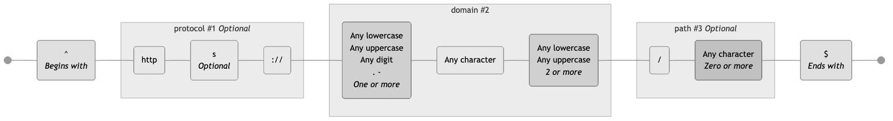
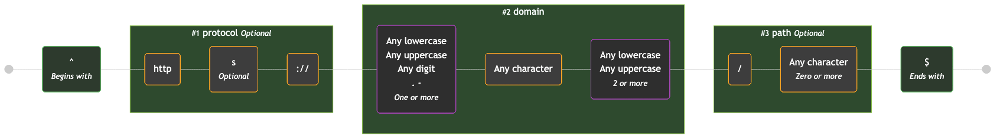
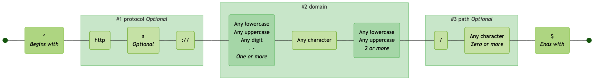
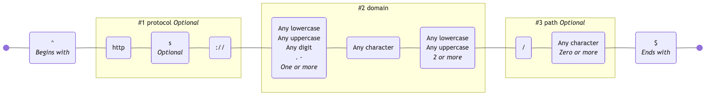

```mermaid
graph LR
  accTitle: "Regex: ^(?<protocol>https?:\\/\\/)?(?<domain>[a-zA-Z0-9.-]+\\.[a-zA-Z]{2,})(?<path>\\/.*)?$"
  accDescr: "Generated with regex-to-mermaid@1.0.4"

  %% Nodes
  start@{ shape: f-circ };
  fin@{ shape: f-circ };
  assertion_1("^<br><i>Begins with</i>"):::assertion;
  literal_1("http"):::literal;
  literal_2("s<br><i>Optional</i>"):::literal;
  literal_3("://"):::literal;
  char_class_1("Any lowercase<br>Any uppercase<br>Any digit<br>. -<br><i>One or more</i>"):::char-class;
  literal_4("Any character"):::literal;
  char_class_2("Any lowercase<br>Any uppercase<br><i>2 or more</i>"):::char-class;
  literal_5("/"):::literal;
  literal_6("Any character<br><i>Zero or more</i>"):::literal;
  assertion_2("$<br><i>Ends with</i>"):::assertion;

  %% Subgraphs
  subgraph named_capture_1 ["#1 protocol <i>Optional</i>"]
    literal_1
    literal_2
    literal_3
  end

  subgraph named_capture_2 ["#2 domain"]
    char_class_1
    literal_4
    char_class_2
  end

  subgraph named_capture_3 ["#3 path <i>Optional</i>"]
    literal_5
    literal_6
  end

  %% Edges
  start --- assertion_1;
  assertion_1 --- literal_1;
  literal_1 --- literal_2;
  literal_2 --- literal_3;
  literal_3 --- char_class_1;
  char_class_1 --- literal_4;
  literal_4 --- char_class_2;
  char_class_2 --- literal_5;
  literal_5 --- literal_6;
  literal_6 --- assertion_2;
  assertion_2 --- fin;

  %% Styles
  %% Node Styling
  classDef assertion fill:#B6D7A8,stroke:#93C47D,color:#000000;
  classDef literal fill:#F9CB9C,stroke:#E69138,color:#000000;
  classDef char-class fill:#B4A7D6,stroke:#8E7CC3,color:#000000;

  %% Group Styling
  classDef named-capture fill:#D9EAD3,stroke:#93C47D,color:#000000;

  %% Apply Group Classes
  class named_capture_1,named_capture_2,named_capture_3 named-capture;
```

```mermaid
---
config:
  theme: neutral
---

graph LR
  accTitle: "Regex: ^(?<protocol>https?:\\/\\/)?(?<domain>[a-zA-Z0-9.-]+\\.[a-zA-Z]{2,})(?<path>\\/.*)?$"
  accDescr: "Generated with regex-to-mermaid@1.0.4"

  %% Nodes
  start@{ shape: f-circ };
  fin@{ shape: f-circ };
  assertion_1("^<br><i>Begins with</i>"):::assertion;
  literal_1("http"):::literal;
  literal_2("s<br><i>Optional</i>"):::literal;
  literal_3("://"):::literal;
  char_class_1("Any lowercase<br>Any uppercase<br>Any digit<br>. -<br><i>One or more</i>"):::char-class;
  literal_4("Any character"):::literal;
  char_class_2("Any lowercase<br>Any uppercase<br><i>2 or more</i>"):::char-class;
  literal_5("/"):::literal;
  literal_6("Any character<br><i>Zero or more</i>"):::literal;
  assertion_2("$<br><i>Ends with</i>"):::assertion;

  %% Subgraphs
  subgraph named_capture_1 ["#1 protocol <i>Optional</i>"]
    literal_1
    literal_2
    literal_3
  end

  subgraph named_capture_2 ["#2 domain"]
    char_class_1
    literal_4
    char_class_2
  end

  subgraph named_capture_3 ["#3 path <i>Optional</i>"]
    literal_5
    literal_6
  end

  %% Edges
  start --- assertion_1;
  assertion_1 --- literal_1;
  literal_1 --- literal_2;
  literal_2 --- literal_3;
  literal_3 --- char_class_1;
  char_class_1 --- literal_4;
  literal_4 --- char_class_2;
  char_class_2 --- literal_5;
  literal_5 --- literal_6;
  literal_6 --- assertion_2;
  assertion_2 --- fin;

  %% Styles
  %% Node Styling
  classDef assertion fill:#E0E0E0,stroke:#909090;
  classDef literal fill:#E8E8E8,stroke:#999999;
  classDef char-class fill:#D0D0D0,stroke:#808080;

  %% Group Styling
  classDef named-capture fill:#ECECEC,stroke:#A8A8A8;

  %% Apply Group Classes
  class named_capture_1,named_capture_2,named_capture_3 named-capture;
```

```mermaid
---
config:
  theme: dark
---

graph LR
  accTitle: "Regex: ^(?<protocol>https?:\\/\\/)?(?<domain>[a-zA-Z0-9.-]+\\.[a-zA-Z]{2,})(?<path>\\/.*)?$"
  accDescr: "Generated with regex-to-mermaid@1.0.4"

  %% Nodes
  start@{ shape: f-circ };
  fin@{ shape: f-circ };
  assertion_1("^<br><i>Begins with</i>"):::assertion;
  literal_1("http"):::literal;
  literal_2("s<br><i>Optional</i>"):::literal;
  literal_3("://"):::literal;
  char_class_1("Any lowercase<br>Any uppercase<br>Any digit<br>. -<br><i>One or more</i>"):::char-class;
  literal_4("Any character"):::literal;
  char_class_2("Any lowercase<br>Any uppercase<br><i>2 or more</i>"):::char-class;
  literal_5("/"):::literal;
  literal_6("Any character<br><i>Zero or more</i>"):::literal;
  assertion_2("$<br><i>Ends with</i>"):::assertion;

  %% Subgraphs
  subgraph named_capture_1 ["#1 protocol <i>Optional</i>"]
    literal_1
    literal_2
    literal_3
  end

  subgraph named_capture_2 ["#2 domain"]
    char_class_1
    literal_4
    char_class_2
  end

  subgraph named_capture_3 ["#3 path <i>Optional</i>"]
    literal_5
    literal_6
  end

  %% Edges
  start --- assertion_1;
  assertion_1 --- literal_1;
  literal_1 --- literal_2;
  literal_2 --- literal_3;
  literal_3 --- char_class_1;
  char_class_1 --- literal_4;
  literal_4 --- char_class_2;
  char_class_2 --- literal_5;
  literal_5 --- literal_6;
  literal_6 --- assertion_2;
  assertion_2 --- fin;

  %% Styles
  %% Node Styling
  classDef assertion fill:#2D3A2D,stroke:#66BB6A,color:#FFFFFF;
  classDef literal fill:#3D3D3D,stroke:#FFA726,color:#FFFFFF;
  classDef char-class fill:#2E2E2E,stroke:#AB47BC,color:#FFFFFF;

  %% Group Styling
  classDef named-capture fill:#2E4A2E,stroke:#8BC34A;

  %% Apply Group Classes
  class named_capture_1,named_capture_2,named_capture_3 named-capture;
```

```mermaid
---
config:
  theme: forest
---

graph LR
  accTitle: "Regex: ^(?<protocol>https?:\\/\\/)?(?<domain>[a-zA-Z0-9.-]+\\.[a-zA-Z]{2,})(?<path>\\/.*)?$"
  accDescr: "Generated with regex-to-mermaid@1.0.4"

  %% Nodes
  start@{ shape: f-circ };
  fin@{ shape: f-circ };
  assertion_1("^<br><i>Begins with</i>"):::assertion;
  literal_1("http"):::literal;
  literal_2("s<br><i>Optional</i>"):::literal;
  literal_3("://"):::literal;
  char_class_1("Any lowercase<br>Any uppercase<br>Any digit<br>. -<br><i>One or more</i>"):::char-class;
  literal_4("Any character"):::literal;
  char_class_2("Any lowercase<br>Any uppercase<br><i>2 or more</i>"):::char-class;
  literal_5("/"):::literal;
  literal_6("Any character<br><i>Zero or more</i>"):::literal;
  assertion_2("$<br><i>Ends with</i>"):::assertion;

  %% Subgraphs
  subgraph named_capture_1 ["#1 protocol <i>Optional</i>"]
    literal_1
    literal_2
    literal_3
  end

  subgraph named_capture_2 ["#2 domain"]
    char_class_1
    literal_4
    char_class_2
  end

  subgraph named_capture_3 ["#3 path <i>Optional</i>"]
    literal_5
    literal_6
  end

  %% Edges
  start --- assertion_1;
  assertion_1 --- literal_1;
  literal_1 --- literal_2;
  literal_2 --- literal_3;
  literal_3 --- char_class_1;
  char_class_1 --- literal_4;
  literal_4 --- char_class_2;
  char_class_2 --- literal_5;
  literal_5 --- literal_6;
  literal_6 --- assertion_2;
  assertion_2 --- fin;

  %% Styles
  %% Node Styling
  classDef assertion fill:#AED581,stroke:#9CCC65;
  classDef literal fill:#C5E1A5,stroke:#7CB342;
  classDef char-class fill:#A5D6A7,stroke:#66BB6A;

  %% Group Styling
  classDef named-capture fill:#C8E6C9,stroke:#4CAF50;

  %% Apply Group Classes
  class named_capture_1,named_capture_2,named_capture_3 named-capture;
```

```mermaid
graph LR
  accTitle: "Regex: ^(?<protocol>https?:\\/\\/)?(?<domain>[a-zA-Z0-9.-]+\\.[a-zA-Z]{2,})(?<path>\\/.*)?$"
  accDescr: "Generated with regex-to-mermaid@1.0.4"

  %% Nodes
  start@{ shape: f-circ };
  fin@{ shape: f-circ };
  assertion_1("^<br><i>Begins with</i>"):::assertion;
  literal_1("http"):::literal;
  literal_2("s<br><i>Optional</i>"):::literal;
  literal_3("://"):::literal;
  char_class_1("Any lowercase<br>Any uppercase<br>Any digit<br>. -<br><i>One or more</i>"):::char-class;
  literal_4("Any character"):::literal;
  char_class_2("Any lowercase<br>Any uppercase<br><i>2 or more</i>"):::char-class;
  literal_5("/"):::literal;
  literal_6("Any character<br><i>Zero or more</i>"):::literal;
  assertion_2("$<br><i>Ends with</i>"):::assertion;

  %% Subgraphs
  subgraph named_capture_1 ["#1 protocol <i>Optional</i>"]
    literal_1
    literal_2
    literal_3
  end

  subgraph named_capture_2 ["#2 domain"]
    char_class_1
    literal_4
    char_class_2
  end

  subgraph named_capture_3 ["#3 path <i>Optional</i>"]
    literal_5
    literal_6
  end

  %% Edges
  start --- assertion_1;
  assertion_1 --- literal_1;
  literal_1 --- literal_2;
  literal_2 --- literal_3;
  literal_3 --- char_class_1;
  char_class_1 --- literal_4;
  literal_4 --- char_class_2;
  char_class_2 --- literal_5;
  literal_5 --- literal_6;
  literal_6 --- assertion_2;
  assertion_2 --- fin;
```

# Themes

These are the available themes. You can specify a theme using the `--theme` option in the CLI or the `theme` option in the library API.

See [mermaid theme configuration](https://mermaid.js.org/config/theming.html) for customising further.

> [!TIP]
> If you are viewing this page somewhere that does not render embedded Mermaid diagrams, you can click the "view as image" links below, or view the diagrams by copy/pasting the code blocks below into the [Mermaid Live Editor](https://mermaid.live).

<!-- CONTENT:START -->

## Table of Contents

- [Default](#default)
- [Neutral](#neutral)
- [Dark](#dark)
- [Forest](#forest)
- [None](#none)

## Default

Closely matches the default Mermaid theme with additional node and subgraph colors

### Command

```shell
regex-to-mermaid 'foo|bar' --theme default
```

### Preview

[View in Mermaid Live Editor](https://mermaid.live/edit#pako:H4sIAAAAAAACA41UW2_aMBT-K1ZopbJhLgmFkiIoJawv0yZ1e2rTIjcxibUQR45Rx1D_-2zHhTgpbfOAsI-_i0_Ol50V0BBbrhUxlMXg-62fAoCC4DfhCXaBb93iCP91wePZdJwxymlAk0nMeZZPXV88HfXTnIpySNeIpJN7BP_N4F0Xjtrw4asst_XWw85uvTQlEeLxRAHbX5rTE9_Soh7OAyZFb3CKGeI4BM-Ex4BJD5BTuMZMaIRXvXa33ZcwCTw9BT_EHXL5P-eI8asdyGOUCfsrGBAWgJdLWVuR9EgF5TlmnNB02TvzrcfxE5uMyeQaRyTNlYNxh0x8q-m67v6oAiaEC5-JgsmmFGf0rnHCFidyTfwzkwQoObC-hXAEwu106geCGLFlkAgnSneWbkFCnzELUI6lgtzYZJm5EZKIcLloA_hqI8WAMrCmDB-cSHKoyA0zfS0kyygQe-_asj9lS1iwP23gXFB2jjdrUPWnBe4wo3WNMsPh3UvXJxq3SMP33rweu1-bJxWbYvT0AqRojcNlgDK-YXjZA_e-1eiB1_CA2gA8SHRplsylbS4ducRpWHg4omkrTRsUidwrlAfHZO3XDtif0XGUjgNknj-817m5HBgCopmLMCplGEAIy7ms5lTV9y0zw2jUbDOGRs0xA6dq5SbV4mag-2ZCqmi7lgoDfW6Ot1EbmLNd6YVdnVtVF1-30mDybVI0U38c1Q5JI2VJuvHw6kAhwEniNq4H3nB20co5o3-w2xg58_7Qa4mZpcxtdNVzaRBohxr-bTS_Hs338MVg1HMu3oMfov5qoD8beoM9w8ViOJ87NQZ9rRtGN9mb91JDCvWQampvtJh5zkd309SzLEu2WmAuWYteFlYr8W5VoteqRsRwc2m9_AfWit-ucgcAAA==)

<details>
  <summary>Click to view as image</summary>
  <p align="center">
    
  </p>
</details>



---

## Neutral

A muted, professional color scheme

### Command

```shell
regex-to-mermaid 'foo|bar' --theme neutral
```

### Preview

[View in Mermaid Live Editor](https://mermaid.live/edit#pako:H4sIAAAAAAACA41U70_bMBD9V6wAEt3q_kgLglC1dAPxZdoktk8QqIzjJtZSO3JcMYb43-dz3CZOgRFLVe27d-_lcs_PAZUJC6IAYxwLKsWSp1EsENIZW7EICbbWiuSxsPFYpIoUGfp2DSmE0l9c5yYrDq5Zyv5E6P5wNimU1JLKfJppXZSzKDZP3_50ZiacyBXhYnpL8N85vhng0x6--wzhnju6ew67Lx0oRHQ2tcDep85sPw4c6QUrqQLSKyaYIpol6JHrDCnQgLXEK6YMR3I-7A16Y4AB8OAAfTevWsL_UhOlz59RmZHCyF9iyhVFL2cQW3LxRoSUJVOaS7EYHsbB_eRBTSd8-oWlXJRWwaTPp3HQiaJom2qBOddGZ25h0JQqx516GaHJKF3hHwUUIHld9TXEyCCifn83gWZELWhulFjeuXhCuXxkipKSAQMcrIvCP0h4yjVseghvZAiGpEIrqVitBIpjW9wTM3ZEECbUnL0rK_yQLCMh_LCAI1Oy_3azjtv6HMENU3KXo1mh_vaget_hLkXy3pd3Y_dz_WBtU42e2yBBVixZUFLotWKLIbqNg70h2pgH7QzAHaAbs-RvQ387gi0TSaXhDc7QcoaocuSWoTk4ftXxTkL4EZ6R5Rkh8PN_3-vI3x57BKaZl0na8DAy11LTl22f2vi2Zb4ZvVjo29CLjXzD2VizSTt289Bj3yFtdLjjCg995I-3Fzv2Z7vVi7A9tzZubrfGYOqnvGqmuxztCReplQRqLtiyLmHAeR7tXQ5gdUut5G8W7Z0OYJ15EKdpAziBVQPs4wNqOzvMxQDWFnMygFUrv1JyXbyq1o4edqO3EfAV1rbY_ARWXWxeFPmTK_kV6lQ9qeS0bNptWajbHnWP_yx4-QeLC7bkYQcAAA==)

<details>
  <summary>Click to view as image</summary>
  <p align="center">
    
  </p>
</details>



---

## Dark

A dark mode friendly color scheme

### Command

```shell
regex-to-mermaid 'foo|bar' --theme dark
```

### Preview

[View in Mermaid Live Editor](https://mermaid.live/edit#pako:H4sIAAAAAAACA41UXU_bMBT9K1YKEt2adnVC2ELVklLgZdokticIVCZxE4vUjhxXjCH--2zHtHECjESqal-fj9zckycnYSl2Qsd13ZgmjK5IFsYUAJHjNQ5Bivh9THUxphlHZQ6-X6o6SpLfRBTySOxc4gz_CcHtwWxSciZYwoppLkRZzcJYXiP905_JcsrWiNDpNXL_Ru7VF_fb0L35rMpDs3XzBAfPfUWERD7VwOGn_mwvdozoAlcJV6IXmGKOBE7BAxE54MqDK5i7xlxqpCfj4Zehr2AKuL8PfsjnrNT_SiAuTp5AlaNS2l-5CeEJeD5WtRWhb1RQVWEuCKPL8UHs3E7u-HRCpnOcEVppB5MRmcZOPwzD7VENLIiQPgsNU02pz5hd6wSUJypD_LNUBKjYsb6G8CQiHI26B5Ic8WVSSCdaN6KPoGAPmCeowkpBbWzK0t5ISUaEWgyB-2KDYsA4WDOOd04UuavJLTO-EVJllMi9d23BD9mSFuCHDRxKytHbzQra_ozAFeasq9Fk2L175XrP4M5o-t6bN2P3a3OnY1OPnlkAitY4XSaoFBuOl2NwHTu9MXgJD-gMwI1CN2bJXkJ76aklpmnt4Q1NqDUhqBO5VWgOjs3qdw7Aj-h4WscDKs__fa5DexlYArKZZ2nWyDCQn6VmLts51fVty-wwWjVox9CqeXbgdK3ZpE7cLLRvJ6SNhp1UWOhDe7ytWmDPdqsXsD23ui6_bo3BFI9F3UzzcdQ7hGbaknKzwKsdhQQXRdiDCy-Ci0ElOLvHYS8I5vMgGsiZZTzsnevr2CIwDg3cW6h7Cz8_j45g8B58F_UXA2fq3jJEc_9oftphMI91wdmmfPW59JC6Zki31H7UoP46P_X8aEcWlWXxaChPFU_dvdpcK9CDVtgG7VBY-sfO8z8JN04viAcAAA==)

<details>
  <summary>Click to view as image</summary>
  <p align="center">
    
  </p>
</details>



---

## Forest

A nature-inspired green and brown color scheme

### Command

```shell
regex-to-mermaid 'foo|bar' --theme forest
```

### Preview

[View in Mermaid Live Editor](https://mermaid.live/edit#pako:H4sIAAAAAAACA41UXU_bMBT9K1YAiW5NS9MmQKha0rTjZdokticIVCZxU2upHTmugCH--2zHTeIUGH2oat97PnJ7T16smCbI8i3btiMSU7LCqR8RAPgabZAPVpShgkdElSOSMpivwfdr2QHj-DfmmWiKrGuUoicf3B9PxzmjnMY0m6w5z4upH4lPX311pqKc0A3EZHIL7b-BfXNin_fsu6-y3NNXdy9O97UjiSBfTxSw96UzPYwsLTpHRcyk6BUiiEGOEvCI-Row6cHm1N4gJjSSy0HvpDeSMAk8OgI_xJMW8nfBIeOXL6BYw1w-ox1jFoPXC1lbYfJOBRYFYhxTshwcR9b9-IFNxngyQykmhXIw7uNJZHV8369aFTDDXPjMFEwOpezRt0aHIzoKTfwzlwQwq1nfQgwFwu_39xviNWTLOBNOlG5AnkFGHxGLYYGkgrzY5rl5keAUc3noAXtngyBAGdiIPaidSHJbkRtmRlpIlmEs7j605XzKlrDgfNqAKyj77w_La_vTAjeI0X2NJkP930vXhxq3IMlH_7xeu1_bBxWbcvX0ARC4QckyhjnfMrQcgNvIOhiAXXjA3gLcSXRjl8yjYx6H8ohIUnp4R9NRmg4oE1kpNBfHZB3tNTif0RkqnSGQef7vc7nm0TMExDAXSdrIMBCvpWYu2zlV9WpkZhiNmmPG0KgNzcCpWnNIe3Ez0CMzIW20s5cKA-2a623UPHO3W7Nw2nur6uLt1lhM_pyVw9QvR3WDSaosSTdztKopBDjL_INgMXfPBt2CM_oH-QfnYRh6pc0Koj1pQOguBoFbAU7D2XDkmIA6zjsRd-4FpxXG82YzL6idXzG6zd90q1bP1qu3M3C28MLzimwUBt_ck5osyPPsWVOGkqecSWmnFdNuK0Ld9qob-hfW6z9Ey8xRYAcAAA==)

<details>
  <summary>Click to view as image</summary>
  <p align="center">
    
  </p>
</details>



---

## None

No styling applied - uses default Mermaid colors

### Command

```shell
regex-to-mermaid 'foo|bar' --theme none
```

### Preview

[View in Mermaid Live Editor](https://mermaid.live/edit#pako:H4sIAAAAAAACA41UXW_aMBT9K1dZK5VuDsUBpKUotNOqvUyr1O2pDUWu4yaWgh05Ru2G-O-zTQoxGR08IO7Huefk5h5WAZUZC-IgV6Qq4PtdKgAIpb-4LlkMaXDHcvYaw-PZdFIpqSWVZVJoXdXTODWfvvvqTU05kwvCRfJA0J9rdH-BPodo9tGWwyY1W-FP654dRHSROGB43puepEFD-pXVVFnSb0wwRTTL4IXrApTVgLREC6YMR3Y1CC_CoYVZ4Okp_DDPUNvftSZKX62gLkhl5D8jyhWF9aWtPXNxoELqminNpZgPztLgcfKkkglPvrCci9opmPR5kga9OI63rQ5Ycm10lg5ml7LpabJeBzYddTP4trIDSLmb-i9EZBBxv99toAVRc1oaJY73WvyGUr4wRUnNLINNLKvKT2Q859oGIaA3GYKBVLCQiu2U2OHIDffEDBsiWybU5N6VhY-SZSTgowWMzMj-4WWN9_U1BPdMyS5He8Lu3VvVJw3uRmTvvfnm7H4un5xtNqfXBCDIgmVzSiq9VGw-gIc0-DCAN_NA5wBmFt26JT_EfhjZkIlso-EAJ3acGDaO3DK0D8efOuw04GN4IscTgfXzf59r5Idjj8As8ybLWx4GhFDbl_s-dfXtynwzejXs29CrRb7hXK29pI7dPPTQd8g-Gndc4aFH_nl7tbF_23u7wPt36-rm3-0yWP8FvRfVdc8FAAA=)

<details>
  <summary>Click to view as image</summary>
  <p align="center">
    
  </p>
</details>



<!-- CONTENT:END -->
