```mermaid
graph LR
  accTitle: "Regex: ^(?<protocol>https?:\\/\\/)?(?<domain>[a-zA-Z0-9.-]+\\.[a-zA-Z]{2,})(?<path>\\/.*)?$"
  accDescr: "Generated with regex-to-mermaid@1.1.0"

  %% Nodes
  start@{ shape: f-circ };
  fin@{ shape: f-circ };
  assertion_1("^<br><i>Begins with</i>"):::assertion;
  literal_1("http"):::literal;
  literal_2("s<br><i>Optional</i>"):::literal;
  literal_3(":\/\/"):::literal;
  char_class_1("Any lowercase<br>Any uppercase<br>Any digit<br>. -<br><i>One or more</i>"):::char-class;
  literal_4("Any character"):::literal;
  char_class_2("Any lowercase<br>Any uppercase<br><i>2 or more</i>"):::char-class;
  literal_5("\/"):::literal;
  char_set_1("Any character<br><i>Zero or more</i>"):::char-set;
  assertion_2("$<br><i>Ends with</i>"):::assertion;

  %% Subgraphs
  subgraph named_capture_1 ["protocol #1 <i>Optional</i>"]
    literal_1
    literal_2
    literal_3
  end

  subgraph named_capture_2 ["domain #2"]
    char_class_1
    literal_4
    char_class_2
  end

  subgraph named_capture_3 ["path #3 <i>Optional</i>"]
    literal_5
    char_set_1
  end

  %% Edges
  start --- assertion_1;
  assertion_1 --- literal_1;
  literal_1 --- literal_2;
  literal_2 --- literal_3;
  literal_3 --- char_class_1;
  char_class_1 --- literal_4;
  literal_4 --- char_class_2;
  char_class_2 --- literal_5;
  literal_5 --- char_set_1;
  char_set_1 --- assertion_2;
  assertion_2 --- fin;

  %% Styles
  %% Node Styling
  classDef assertion fill:#B6D7A8,stroke:#93C47D,color:#000000;
  classDef literal fill:#F9CB9C,stroke:#E69138,color:#000000;
  classDef char-class fill:#B4A7D6,stroke:#8E7CC3,color:#000000;
  classDef char-set fill:#9FA8DA,stroke:#5C6BC0,color:#000000;

  %% Group Styling
  classDef named-capture fill:#D9EAD3,stroke:#93C47D,color:#000000;

  %% Apply Group Classes
  class named_capture_1,named_capture_2,named_capture_3 named-capture;
```

```mermaid
---
config:
  theme: neutral
---

graph LR
  accTitle: "Regex: ^(?<protocol>https?:\\/\\/)?(?<domain>[a-zA-Z0-9.-]+\\.[a-zA-Z]{2,})(?<path>\\/.*)?$"
  accDescr: "Generated with regex-to-mermaid@1.1.0"

  %% Nodes
  start@{ shape: f-circ };
  fin@{ shape: f-circ };
  assertion_1("^<br><i>Begins with</i>"):::assertion;
  literal_1("http"):::literal;
  literal_2("s<br><i>Optional</i>"):::literal;
  literal_3(":\/\/"):::literal;
  char_class_1("Any lowercase<br>Any uppercase<br>Any digit<br>. -<br><i>One or more</i>"):::char-class;
  literal_4("Any character"):::literal;
  char_class_2("Any lowercase<br>Any uppercase<br><i>2 or more</i>"):::char-class;
  literal_5("\/"):::literal;
  char_set_1("Any character<br><i>Zero or more</i>"):::char-set;
  assertion_2("$<br><i>Ends with</i>"):::assertion;

  %% Subgraphs
  subgraph named_capture_1 ["protocol #1 <i>Optional</i>"]
    literal_1
    literal_2
    literal_3
  end

  subgraph named_capture_2 ["domain #2"]
    char_class_1
    literal_4
    char_class_2
  end

  subgraph named_capture_3 ["path #3 <i>Optional</i>"]
    literal_5
    char_set_1
  end

  %% Edges
  start --- assertion_1;
  assertion_1 --- literal_1;
  literal_1 --- literal_2;
  literal_2 --- literal_3;
  literal_3 --- char_class_1;
  char_class_1 --- literal_4;
  literal_4 --- char_class_2;
  char_class_2 --- literal_5;
  literal_5 --- char_set_1;
  char_set_1 --- assertion_2;
  assertion_2 --- fin;

  %% Styles
  %% Node Styling
  classDef assertion fill:#E0E0E0,stroke:#909090;
  classDef literal fill:#E8E8E8,stroke:#999999;
  classDef char-class fill:#D0D0D0,stroke:#808080;
  classDef char-set fill:#C0C0C0,stroke:#787878;

  %% Group Styling
  classDef named-capture fill:#ECECEC,stroke:#A8A8A8;

  %% Apply Group Classes
  class named_capture_1,named_capture_2,named_capture_3 named-capture;
```

```mermaid
---
config:
  theme: dark
---

graph LR
  accTitle: "Regex: ^(?<protocol>https?:\\/\\/)?(?<domain>[a-zA-Z0-9.-]+\\.[a-zA-Z]{2,})(?<path>\\/.*)?$"
  accDescr: "Generated with regex-to-mermaid@1.1.0"

  %% Nodes
  start@{ shape: f-circ };
  fin@{ shape: f-circ };
  assertion_1("^<br><i>Begins with</i>"):::assertion;
  literal_1("http"):::literal;
  literal_2("s<br><i>Optional</i>"):::literal;
  literal_3(":\/\/"):::literal;
  char_class_1("Any lowercase<br>Any uppercase<br>Any digit<br>. -<br><i>One or more</i>"):::char-class;
  literal_4("Any character"):::literal;
  char_class_2("Any lowercase<br>Any uppercase<br><i>2 or more</i>"):::char-class;
  literal_5("\/"):::literal;
  char_set_1("Any character<br><i>Zero or more</i>"):::char-set;
  assertion_2("$<br><i>Ends with</i>"):::assertion;

  %% Subgraphs
  subgraph named_capture_1 ["protocol #1 <i>Optional</i>"]
    literal_1
    literal_2
    literal_3
  end

  subgraph named_capture_2 ["domain #2"]
    char_class_1
    literal_4
    char_class_2
  end

  subgraph named_capture_3 ["path #3 <i>Optional</i>"]
    literal_5
    char_set_1
  end

  %% Edges
  start --- assertion_1;
  assertion_1 --- literal_1;
  literal_1 --- literal_2;
  literal_2 --- literal_3;
  literal_3 --- char_class_1;
  char_class_1 --- literal_4;
  literal_4 --- char_class_2;
  char_class_2 --- literal_5;
  literal_5 --- char_set_1;
  char_set_1 --- assertion_2;
  assertion_2 --- fin;

  %% Styles
  %% Node Styling
  classDef assertion fill:#2D3A2D,stroke:#66BB6A,color:#FFFFFF;
  classDef literal fill:#3D3D3D,stroke:#FFA726,color:#FFFFFF;
  classDef char-class fill:#2E2E2E,stroke:#AB47BC,color:#FFFFFF;
  classDef char-set fill:#2E2E3A,stroke:#5C6BC0,color:#FFFFFF;

  %% Group Styling
  classDef named-capture fill:#2E4A2E,stroke:#8BC34A,color:#FFFFFF;

  %% Apply Group Classes
  class named_capture_1,named_capture_2,named_capture_3 named-capture;
```

```mermaid
---
config:
  theme: forest
---

graph LR
  accTitle: "Regex: ^(?<protocol>https?:\\/\\/)?(?<domain>[a-zA-Z0-9.-]+\\.[a-zA-Z]{2,})(?<path>\\/.*)?$"
  accDescr: "Generated with regex-to-mermaid@1.1.0"

  %% Nodes
  start@{ shape: f-circ };
  fin@{ shape: f-circ };
  assertion_1("^<br><i>Begins with</i>"):::assertion;
  literal_1("http"):::literal;
  literal_2("s<br><i>Optional</i>"):::literal;
  literal_3(":\/\/"):::literal;
  char_class_1("Any lowercase<br>Any uppercase<br>Any digit<br>. -<br><i>One or more</i>"):::char-class;
  literal_4("Any character"):::literal;
  char_class_2("Any lowercase<br>Any uppercase<br><i>2 or more</i>"):::char-class;
  literal_5("\/"):::literal;
  char_set_1("Any character<br><i>Zero or more</i>"):::char-set;
  assertion_2("$<br><i>Ends with</i>"):::assertion;

  %% Subgraphs
  subgraph named_capture_1 ["protocol #1 <i>Optional</i>"]
    literal_1
    literal_2
    literal_3
  end

  subgraph named_capture_2 ["domain #2"]
    char_class_1
    literal_4
    char_class_2
  end

  subgraph named_capture_3 ["path #3 <i>Optional</i>"]
    literal_5
    char_set_1
  end

  %% Edges
  start --- assertion_1;
  assertion_1 --- literal_1;
  literal_1 --- literal_2;
  literal_2 --- literal_3;
  literal_3 --- char_class_1;
  char_class_1 --- literal_4;
  literal_4 --- char_class_2;
  char_class_2 --- literal_5;
  literal_5 --- char_set_1;
  char_set_1 --- assertion_2;
  assertion_2 --- fin;

  %% Styles
  %% Node Styling
  classDef assertion fill:#AED581,stroke:#9CCC65;
  classDef literal fill:#C5E1A5,stroke:#7CB342;
  classDef char-class fill:#A5D6A7,stroke:#66BB6A;
  classDef char-set fill:#90CAF9,stroke:#42A5F5;

  %% Group Styling
  classDef named-capture fill:#C8E6C9,stroke:#4CAF50;

  %% Apply Group Classes
  class named_capture_1,named_capture_2,named_capture_3 named-capture;
```

# Themes

These are the available themes. You can specify a theme using the `--theme` option in the CLI or the `theme` option in the library API.

Theme colors are defined in [`theme.ts`](./src/theme.ts).

See [mermaid theme configuration](https://mermaid.js.org/config/theming.html) for customising further.

> [!TIP]
> If you are viewing this page somewhere that does not render embedded Mermaid diagrams, you can click the "view as image" links below, or view the diagrams by copy/pasting the code blocks below into the [Mermaid Live Editor](https://mermaid.live).

<!-- CONTENT:START -->

## Table of Contents

- [Default](#default)
- [Neutral](#neutral)
- [Dark](#dark)
- [Forest](#forest)
- [None](#none)

## Default

Closely matches the default Mermaid theme with additional node and subgraph colors

### Command

```shell
regex-to-mermaid 'foo|bar' --theme default
```

### Preview

[View in Mermaid Live Editor](https://mermaid.live/edit#pako:H4sIAAAAAAACA41U7W-iMBj_VxrcknknTsE3mNEhuH253CW7-7SxmQ46bQ4pKTXbbtn_fm3pkOLU8cHYPv299OH58WZEJEaGaywpzFbgx02YAgCj6A9mCXJBaNygJXpxwcPZdJxRwkhEksmKsSyfuiF_zuVPc8rLMVlDnE7uoPnPM287ptM277-Lcltt3b9ZrfemIIJsNZHA9rfm9CQ0lGiA8ogK0WuUIgoZisEzZitAhQeTEXONKNeIL7vtbrsjYAJ4egp-8jvk4n_OIGWXbyBfwYzbfzIjTCPwfiFqTzjdU4F5jijDJF10z0LjYfxIJ2M8maElTnPpYHyOJ6HRdF23PCqBCWbcZyJhoinFGbWrnbD4iVwR_8oEAUy2rJ8hbI5wZYPPdw9FK0gXUcLdSG0vfQUJeUY0gjkSKmJjk2X6RoyXmIlFG5gfVlIECAVrQtHWjSA3JblmqKeERBlGfO-gLetLtrgF68sG-pxyfzdyxMpelBaVxi2iZI8Mh9VmQDg_UcB5Gh-aADV-vzePMj7FCKoFSOEaxYsIZmxD0aIL7kLjI0Gg0QU7g3Av0JWZ0peWvrTFEqVx4WGPpiU0i1iChlUqVIdHZ-3tHLC-omPLu_FQg4Z99F79ioZ8Z5oC7-Y8XlbCDEzTrAa0HlhZL3ump1KrWXoetZqtJ0_Wql3ayZyG7ukxqaOtnWho6L4-41u0bE5tvmvdsOqjK-v8Q1eZTfaaFO1U30m5g9OlJBZ-AvS0peDgJHEbs0Ew9EatnFHyF7kNx_Z7w6DFJ5dQt9GRz4VGoPwr-JXjzxy_hM8HTtceHYJvE_9hoOcNg0HJMJoPfd8-ysB7pPDOlTcKvBLf9wczv7ODV225pmSTfdoXOeemmnNFHThzL7CP9UZRe1mWvCoBX7AW76K4au0L0aqlt1VPmebmwnj_DzbSd9q9BwAA)

<details>
  <summary>Click to view as image</summary>
  <p align="center">
    
  </p>
</details>



### Styles


| Node/Group Type        | Fill       | Border     | Text       |
| ---------------------- | ---------- | ---------- | ---------- |
| literal | `#F9CB9C` | `#E69138` | `#000000` |
| char-class | `#B4A7D6` | `#8E7CC3` | `#000000` |
| negated-char-class | `#EA9999` | `#CC0000` | `#000000` |
| char-set | `#9FA8DA` | `#5C6BC0` | `#000000` |
| negated-char-set | `#EF9A9A` | `#E53935` | `#000000` |
| disjunction | `#FFD966` | `#F1C232` | `#000000` |
| assertion | `#B6D7A8` | `#93C47D` | `#000000` |
| back-reference | `#F4CCCC` | `#E06666` | `#000000` |
| standard | `#FFF2CC` | `#F1C232` | `#000000` |
| named-capture | `#D9EAD3` | `#93C47D` | `#000000` |
| non-capturing | `#CFE2F3` | `#6D9EEB` | `#000000` |
| positive-lookahead | `#D9D2E9` | `#8E7CC3` | `#000000` |
| negative-lookahead | `#F4CCCC` | `#E06666` | `#000000` |
| positive-lookbehind | `#EAD1DC` | `#C27BA0` | `#000000` |
| negative-lookbehind | `#FCE5CD` | `#E69138` | `#000000` |
| modifier | `#A2C4C9` | `#6D9EEB` | `#000000` |

---

## Neutral

A muted, professional color scheme

### Command

```shell
regex-to-mermaid 'foo|bar' --theme neutral
```

### Preview

[View in Mermaid Live Editor](https://mermaid.live/edit#pako:H4sIAAAAAAACA41UYU_bMBD9K1YKEt2akqaglVC1dBTxZdoktk8QqEziJtZSO3JcMVbx3-dz3CROW0ZOqmLfvbt313vZOBGPiRM4ruuGLOJsSZMgZAjJlKxIgBhZS4GzkGl_yBKB8xR9u4MQHEW_qMxUVOjckYT8CdDTyXScCy55xLNJKmVeTINQPaf6pztV7pivMGWTB-z-nbn3nnvRdx8_g7tvrh43fu-tC4mwTCca2P_UnR6Fjik6J0UkoOgtYURgSWL0QmWKBHBwJXdXRKga8dWgP-h7AAPg8TH6rlot4L2QWMirDSpSnCv6SzeiIkJvl-BbUnbAg4uCCEk5WwxOQudp_CwmYzr5ShLKCs1gfEonodMNgqAK1cCMSsUz0zAYShljbq0IX0UUJvGPHBLgrM66DzFUiEAP-HQ3KEqxWESZYqNrz9gryvgLEREuCFSBi3We2xcxTaiEQx-5WyqMIC7QigtSs4Hkrk5uETozhcCNI3X3Li3_Q7QUBf_DBM5VysPTKIisZlFRNDXuieAHyihYaweA-ZEB3rD4vQ0w6_dz_azlU66gOSCGVyReRDiXa0EWA_QQOlsFoc4A7SzCI6AbO2Ufffs4hCNhccnhQE0fapayRB2_qtBcHjvr2U6A_5E6Q92bEjXqDP_b13mjhv7PrApqmjdx0hAzUt-npkDbgtX-ama2Ki2fb-vR8g1t5Wlfc0o7mrPQZ7ZM2mh_RxoW-tze8Rqth9Pa79Y0_Pbqar_60DV2U75m5TjNd1LfUJboxMBnTpZ1CgXOsqBz44H1Cin4bxJ0LjywSwtiGG8BI7AaoB8bUKvaYOYeWIUZeWB7MKpzg7j2wCrElxFY3eut4Ot8b396X12zr1vK12BVstkIrE42y_Ps1aS8hjzlFMsGWtrutXTXa-vDqn_pvP0D2sqFCp4HAAA=)

<details>
  <summary>Click to view as image</summary>
  <p align="center">
    
  </p>
</details>



### Styles


| Node/Group Type        | Fill       | Border     | Text       |
| ---------------------- | ---------- | ---------- | ---------- |
| literal | `#E8E8E8` | `#999999` | - |
| char-class | `#D0D0D0` | `#808080` | - |
| negated-char-class | `#C8C8C8` | `#707070` | - |
| char-set | `#C0C0C0` | `#787878` | - |
| negated-char-set | `#B8B8B8` | `#686868` | - |
| disjunction | `#F0F0F0` | `#A0A0A0` | - |
| assertion | `#E0E0E0` | `#909090` | - |
| back-reference | `#D8D8D8` | `#888888` | - |
| standard | `#F5F5F5` | `#B0B0B0` | - |
| named-capture | `#ECECEC` | `#A8A8A8` | - |
| non-capturing | `#E4E4E4` | `#9C9C9C` | - |
| positive-lookahead | `#DADADA` | `#949494` | - |
| negative-lookahead | `#D2D2D2` | `#8C8C8C` | - |
| positive-lookbehind | `#CECECE` | `#848484` | - |
| negative-lookbehind | `#C6C6C6` | `#7C7C7C` | - |
| modifier | `#DCDCDC` | `#8C8C8C` | - |

---

## Dark

A dark mode friendly color scheme

### Command

```shell
regex-to-mermaid 'foo|bar' --theme dark
```

### Preview

[View in Mermaid Live Editor](https://mermaid.live/edit#pako:H4sIAAAAAAACA41UXU_bMBT9K1YKEt2aQp22bKFqST_gZdokticIVCZxE4vUjhxXjCH--2zHpHFKgUSqat97zj2-ucfPTsRi7PiO67ohjRhdkcQPKQAixWvsgxjxh5DqYEgTjvIU_LhScRRFf4jIZEroXOEE__XB3dFklHMmWMSycSpEXkz8UD7H-qc9keGYrRGh4xvk_gvc6xP3e9e9_arCXbN1-ww7L21FhEQ61sDul_bkIHRM0TkuIq6KXmKKORI4Bo9EpIArDa5g7hpzWSM-73V73RMFU8DDQ_BTnrNQ_wuBuDh_BkWKcil_5UaER-DlTMVWhO6JoKLAXBBGl72j0Lkb3fPxiIynOCG00ApGx2QcOm3f96tUDcyIkDozDVNNKXPMrpUBZUZhiH_ligBlW9a3EJ5E-LrBx7tJUYr4MsqkGl07oE8gY4-YR6jAqora2OS5vRGThAi16AL3VQrFgHGwZhxv1ShyV5NbgvqmkAqjSO69Kwt-SpaUAD8tYCAp93ejwKLqRSXR1LjGnO0pI2GNGVDKDwxwQeP3JsCM3-_NvbZPOYJmASha43gZoVxsOF72wE3ovDoItHpgZxBuFbo2U_YS2ktPLTGNSw17akJVs7QlaMGqQn14bNb-TgL8TB1Pn02aGrS8D881qNXQ38yqILu5iJOamYG8n-oGbRpWx6ue2a60YtD2oxXzbOfpWL1LO56z0H3bJk003LGGhR7YM75F6-Y05rvRDdgcXR2XF11tNsVTVrbT3JN6h9BEEys9c7zaUkhwlvktOPcCOO8UgrMH7LeGw-l0GHTk5DLuty70c2YRGP0G7s3VW8EvLoJTOHwPvnX8q4CFeiuGYNo_nc4-ZJA9quG9oMIPZsPp7GQHb9pyydkmf7Mves5dM-cVdT-oSfs2nXn9YB91kOfZkykwU6zltyiP2rghOg33dpous9ScOS__ARik6f3hBwAA)

<details>
  <summary>Click to view as image</summary>
  <p align="center">
    
  </p>
</details>



### Styles


| Node/Group Type        | Fill       | Border     | Text       |
| ---------------------- | ---------- | ---------- | ---------- |
| literal | `#3D3D3D` | `#FFA726` | `#FFFFFF` |
| char-class | `#2E2E2E` | `#AB47BC` | `#FFFFFF` |
| negated-char-class | `#3A2828` | `#EF5350` | `#FFFFFF` |
| char-set | `#2E2E3A` | `#5C6BC0` | `#FFFFFF` |
| negated-char-set | `#3A2828` | `#F44336` | `#FFFFFF` |
| disjunction | `#3E3A28` | `#FFEE58` | `#FFFFFF` |
| assertion | `#2D3A2D` | `#66BB6A` | `#FFFFFF` |
| back-reference | `#3A2D2D` | `#EF5350` | `#FFFFFF` |
| standard | `#4A4A2E` | `#FFEB3B` | `#FFFFFF` |
| named-capture | `#2E4A2E` | `#8BC34A` | `#FFFFFF` |
| non-capturing | `#2E3A4A` | `#2196F3` | `#FFFFFF` |
| positive-lookahead | `#3A2E4A` | `#9C27B0` | `#FFFFFF` |
| negative-lookahead | `#4A2E2E` | `#F44336` | `#FFFFFF` |
| positive-lookbehind | `#4A2E3A` | `#E91E63` | `#FFFFFF` |
| negative-lookbehind | `#4A3A2E` | `#FF9800` | `#FFFFFF` |
| modifier | `#2A3A3E` | `#42A5F5` | `#FFFFFF` |

---

## Forest

A nature-inspired green and brown color scheme

### Command

```shell
regex-to-mermaid 'foo|bar' --theme forest
```

### Preview

[View in Mermaid Live Editor](https://mermaid.live/edit#pako:H4sIAAAAAAACA41UYW_aMBD9K1ZopbIRCoHQkiJoCLRfpk3q9qlNi9zEJNGCHTlGHav632c7JolD6coHhH337r077vnVCEiIDMcwTdPHAcHrJHJ8DACL0QY5YE0oypmPZdjHEYVZDL7diQwYBL8SlvIk37hDEfrjgKez2SSjhJGApNOYsSyfOT7_nMuv9oyHQ7KBCZ4-QPOva973zHHXfPwqwl119fhqdd7aohBk8VQCu1_asxPfUKQLlAdUkN4ijChkKAQvCYsBFRpMRswNopwjvO53-92egAng6Sn4zjvNxe-cQcquX0Eew0z0aAYJDcDblYitE3wkAvMcUZYQvOqf-cbT5JlOJ8l0jqIE51LB5DyZ-kbbcZwyVQLThHGdqYSJoRQ56lbLsHhGrgr_yEQBmFZV30MMOMKRAz4_TApiSFdBytVIbhfvQEpeEA1gjgSLuNhmmX4RJlHCxKELzL0UjAChYMN3oVIjipuyuCZoqIhEGAb87kNZ1qdkcQnWpwXYvOTxaeSIlbMoJSqOe0TJERoOa-yAUH6igEscfrQBav1-bp-lfYoVVAeA4QaFqwBmbEvRqg8efGPvINDqg4NFeBTo2k7pR0s_DsQR4bDQcITTEpyFLUHLKhnqy6NXHR4kWJ_hGcjeuKlBa_Dfvuwah_zPNAY-zWUY1cwM-PtUN2jTsDJezkx3pRazdD9qsYHuPBmrT-nAcxp6qNukibYOrKGhbX3HK7QcTmO_G9Owmqsr4_yhq-0m26XFONU7KW8SHMnCQs8CrasSHJymTstdLuzLfidnlPxGTmvsed6oEFpClGIF8Oxl37VLwIU3HwwtHVC5ek9iL0buRYkZjebzkfsOhneuEOOe596MS8TQcu0bu-r1lpJt9m5_cl9Nta97yZfLkVcrxkvbvaqYm2XpTpX0RJ1iikUDDW93Gr7rNP2h8V8Zb_8ATom5v50HAAA=)

<details>
  <summary>Click to view as image</summary>
  <p align="center">
    
  </p>
</details>



### Styles


| Node/Group Type        | Fill       | Border     | Text       |
| ---------------------- | ---------- | ---------- | ---------- |
| literal | `#C5E1A5` | `#7CB342` | - |
| char-class | `#A5D6A7` | `#66BB6A` | - |
| negated-char-class | `#FFAB91` | `#FF7043` | - |
| char-set | `#90CAF9` | `#42A5F5` | - |
| negated-char-set | `#FFCC80` | `#FB8C00` | - |
| disjunction | `#FFF59D` | `#FBC02D` | - |
| assertion | `#AED581` | `#9CCC65` | - |
| back-reference | `#FFCCBC` | `#FF8A65` | - |
| standard | `#E8F5E9` | `#66BB6A` | - |
| named-capture | `#C8E6C9` | `#4CAF50` | - |
| non-capturing | `#DCEDC8` | `#8BC34A` | - |
| positive-lookahead | `#F0F4C3` | `#CDDC39` | - |
| negative-lookahead | `#FFECB3` | `#FFC107` | - |
| positive-lookbehind | `#FFE0B2` | `#FF9800` | - |
| negative-lookbehind | `#FFCCBC` | `#FF5722` | - |
| modifier | `#81C784` | `#4CAF50` | - |

---

## None

No styling applied - uses default Mermaid colors

### Command

```shell
regex-to-mermaid 'foo|bar' --theme none
```

### Preview

[View in Mermaid Live Editor](https://mermaid.live/edit#pako:H4sIAAAAAAACA41UUW_aMBD-K6fQSmWbQ3HgYSkK7bRqL9MmdXtqQ5HruMRSsCPbqNsQ_322SSEOo4OHiPPdd9_ny31ZR1QWLEqjhSJ1CV_vcgFAKP3JTcVSyKM7tmC_Uni8mE5qJY2ksspKY2o9TXP7G_hHf2rThVwSLrIHgv7coPtL9DFGs_cuHTdHszX-sOm7RsSUmQfG7_rTszxqSD8zTZUj_cIEU8SwAl64KUE5DchItGTKchTXw3gYXzqYA56fwzd7B-3-a0OUuV6DLklt5T8jyhWFzZXLPXNxJEO0ZspwKebDizx6nDypbMKzT2zBhfYKJgOe5VE_TdNdqQdW3FidlYe5oWxrmtOgAtsK3TT-XrsGpNp3_RcisYjUD3hwWERLoua0smo89434DZV8YYoSzRyLO1jVdXhQ8AU3LogBvUoRDKSCpVRsr8Y1R755IGjUELk0ofbsTVn4JFlWAj5ZwNi2PD4NzcxuFjuJDcc9U_IIjYV1dsApP2uAt6J4awOa9fuxevL22a5gE4AgS1bMKanNSrH5EB7y6NVB0BvCwSLMHLq1U2GIwzBxIRPFVsMRTuw4t7aEHt4xtJcn7Do6KMCn8CT-btbU0Ev-e69xi8O_s4DBTvO2WLTMDAihtkG7hvX53cxCVwY5HPoxyCWh83yuPaUDzwXoUWiTLhofWCNAj8Md36P9cDr73ZkG7q6uz9sP3VW0-QvFnFe-2gUAAA==)

<details>
  <summary>Click to view as image</summary>
  <p align="center">
    
  </p>
</details>


<!-- CONTENT:END -->
