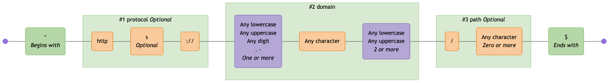

# Themes

These are the available themes. You can specify a theme using the `--theme` option in the CLI or the `theme` option in the library API.

Theme colors are defined in [`theme.ts`](./src/theme.ts).

See [mermaid theme configuration](https://mermaid.js.org/config/theming.html) for customising further.

> [!TIP]
> If you are viewing this page somewhere that does not render embedded Mermaid diagrams, you can click the "view as image" links below, or view the diagrams by copy/pasting the code blocks below into the [Mermaid Live Editor](https://mermaid.live).

<!-- CONTENT:START -->

## Table of Contents

- [Default](#default)
- [Neutral](#neutral)
- [Dark](#dark)
- [Forest](#forest)
- [None](#none)

## Default

Closely matches the default Mermaid theme with additional node and subgraph colors

### Command

```shell
regex-to-mermaid 'foo|bar' --theme default
```

### Preview

[View in Mermaid Live Editor](https://mermaid.live/edit#pako:H4sIAAAAAAACA41UW2_aMBT-K1ZopbJh2iRcSoqgacL6Mm1St6c2LXITF6yFOHKMug7x32c75uKkhfKAsI-_yzk6Hysrpgm2PGvGUD4H3--iDAAUx78JT7EHIusOz_BfDzydjYc5o5zGNB3NOc-LsReJz7n6ao5FOaELRLLRA4L_fHh_AQdt-PhVltv66nHltNZNSYT4fKSA7S_N8UlkadEQFzGTorc4wwxxnIBXwueASQ-QU7jATGgk13bbbl9ImASenoIfoodC_i44Yvx6BYo5yoX9FxgTFoP1lay9kOyDCioKzDih2dQ-i6yn4TMbDcnoBs9IVigHw3Myiqym53nbpwqYEi58pgomh1K-0bfGC0e8KDTxz1wSoHTH-h7CFQhPDfi8_iieIzaNU-FGafvZG0jpK2YxKrBUkRfLPDcvEjIjXB7aAG6sZBhQBhaU4Z0bSQ4VuWGoo4VkGcXi7qAt51O2hAXn0wa6gvLYNNyqSa1yjxk9KrTbA-n-REMnWXJoC_QK_lo-qwiVa6gPIEMLnExjlPMlw1MbPERWwwabIIHaMjxK9N5emUfHPLryiLOk9PCBpqM0HVCmc6uwv0Ama6f2wPmMjqt0XCCzfbSvbk3D7EXMc5LM9iINIIT7Ma3GVtW3UzOzadQcM5VGzTXzp2r7c6olz0B3zLBU0U4tIAa6a256Fe3W9rwyEae6wKou_vL2NpS_peVI9T-muiHZTFFL1hC_7CgEOE29xk0v7PuXrYIz-gd7jYEbdPphSywvZV7jQn2uDALdg4Z_GwQ3g2ALn_QGtnt5CL6L5MZAx--HvS3D5aQfBG6NQbd1y-gyf7cvta1Qb6umDgcTP3SP9aap_TxP37RAIFnLWZZWKzlvVTLYqmbFcHNlrf8DZ_jK44cHAAA=)

<details>
  <summary>Click to view as image</summary>
  <p align="center">
    
  </p>
</details>


---

## Neutral

A muted, professional color scheme

### Command

```shell
regex-to-mermaid 'foo|bar' --theme neutral
```

### Preview

[View in Mermaid Live Editor](https://mermaid.live/edit#pako:H4sIAAAAAAACA41U70_bMBD9V6wAEt3q0iYgQahaOkB8mTaJ7RMEKuO4ibXUjhxXjCH-9_kct6kTfuWkqvbde_dyupfngMqUBXGAMU4ElWLBszgRCOmcLVmMBFtpRYpE2HwiMkXKHH2_hhJC6W-uC1OVBNcsY39jdL8_HZdKakllMcm1LqtpnJjnwP70piadyiXhYnJL8L8ZvhnikwG--wrpgbu6ew77Lz0gIjqfWODgS2-6mwSu6QWrqIKmV0wwRTRL0SPXOVKgAWuJl0yZHunZaDAaDAEGwL099MO8agX_K02UPntGVU5KI3-BKVcUvZxCbsHFGxlSVUxpLsV8tJ8E9-MHNRnzyTeWcVFZBeMDPkmCXhzHm1ILLLg2OgsLg6HUNe7WqwhNReWIf5ZAQIqG9TVEZBCxHfBBt4jmRM1pYdTY3jPxhAr5yBQlFYMucLEqS_8i5RnXcBggvJYiGJIKLaVijRogx5bcE3ToGkGaUHP3rqzwU7KMhPDTAo4M5UfTiNoiXZcbpuSHjZo9APW7Dnop0ve2wK3gr9WDtVC9hu6ABFmydE5JqVeKzUfoNgl2RmhtJNRZhjtAb-2Vfwz9YwRHJtJawxs9Q9szRLU7Nx22F8hnPewUhJ_pE9k-EQJvf_heR50e_ruYeV6m2ZalkflKbdu0bVub30zN96aXC31XernI95_Nbc-p4zwPfeibpY0OOwbx0Ef-prfRUWfPWxMJ2wts8-aTt7Wh-qmoR-q-mPaGi8xSA-sFWzQUBlwU8c7lEKJfaSX_sHjnZAhx6kGc6jXgGKIB2McHNLZzmIshxAZzPIRolF8puSpfVWt3ELsdXAs4h9iQzY4hGrJZWRZPjvIceOqZ1HJafu23vNRv77zX_zR4-Q_ZPpXndgcAAA==)

<details>
  <summary>Click to view as image</summary>
  <p align="center">
    
  </p>
</details>


---

## Dark

A dark mode friendly color scheme

### Command

```shell
regex-to-mermaid 'foo|bar' --theme dark
```

### Preview

[View in Mermaid Live Editor](https://mermaid.live/edit#pako:H4sIAAAAAAACA41U7U7bMBR9FSsFiW5NoU4pW6haUgr8mTaJ7RcEKuO4iUVqR44rxhDvPtsxbZzwlUhV7evz4at78uRhnhAv9HzfjxnmbEnTMGYAyIysSAgSJO5jZooxSwUqMvDjUtcRxn-ozNWR2LskKfkbgtu96bgQXHLM80kmZVFOw1g9--anO1XlhK8QZZNr5P-L_KsD_3vfv_mqy327dfMEe89dTYRkNjHA_pfudCf2rOiclFho0QvCiECSJOCBygwI7cGX3F8RoTSSk0F_0D_QMA3c3QU_1T1L_b-USMiTJ1BmqFD2lz6mAoPnY11bUvZGBZUlEZJythjsxd7t-E5MxnQyIyllpXEw3qeT2OuGYbg5aoA5lcpnbmC6KdUZu-ucgOpEaYl_FZoA5VvW1xCBQoSmwfvtQzhDYoFz5cZoR-wR5PyBCIxKolX0xroo3I2EplTqRR_4L1YYAVyAFRdk60aT-4bcMTS0QrqMsNp71xb8lC1lAX7awKGi_KgbQdOkVbkign8otJ0D7X7HQs9Y8t4U2BH8vb4zEarG0C4AQyuSLDAq5FqQxQBcx15nAF6CBFrDcKPRtblyl9BdBnpJWFJ5eEMTGk0IqnRuFOoD5LIOWwfgZ3QCoxMAne0P73XY0nDvovp5lqS1SAP1larHtBlbU990zc2mU4NuKp1a4ObP1Op9aiXPQQ_dsDTRsBUQB33oTnoTHbTmvNER2BxgU1efvNqEyse8aqn9YpodylJDrVnnZLmlUOA8DztwHkRw3iul4Pck7IxGs9ko6qnh5SLsnJvn2CGwd7DwYK7fDfz8PDqCo_fg20i-GDjT74Yhmg2PZqctBnutC8HXxav3MtPq22ndUA-jGvW32WkwjLZkUVHkj5byVPNU3avMNZLda6Su10yHo3_sPf8H5ypGWJ0HAAA=)

<details>
  <summary>Click to view as image</summary>
  <p align="center">
    
  </p>
</details>


---

## Forest

A nature-inspired green and brown color scheme

### Command

```shell
regex-to-mermaid 'foo|bar' --theme forest
```

### Preview

[View in Mermaid Live Editor](https://mermaid.live/edit#pako:H4sIAAAAAAACA41UW2-bMBT-KxZtpWYLaYGQtjRKSkjWl2mTuj21tJELDlgjBhlHXVb1v882DsTQWx-i2ud8Fx-dj2cjymNkeIZpmiGJcrLCiRcSAFiK1sgDq5yikoVElkOSUFik4PuN6IBR9BuzjDeFxg1K0F8PPBxPxwXNWR7l2SRlrCinXsj_TuRPb8rLcb6GmEzuoPnPN29PzYuBef9VlAfq6v7Z7r_0BBFk6UQCB19608PQUKJzVEZUiF4jgihkKAZPmKWACg8my801olwjvrIG1uBUwATw6Aj84C8txf8lg5RdPYMyhYV4oxlhGoGXS1FbYfJGBZYlogznZGkdh8bD-JFOxngyQwkmpXQwPsGT0Oh5nle3SmCGGfeZSZgYStWjbrUOm3eUivhnIQhg1rC-hnA4wpMDPuk2RSmkyyjjbqS2T7Ygy58QjWCJhIq42BSFfhHjBDNxGABzZ4UgkFOw5rvQuBHkpiTXDA2VkCjDiN-9a8v-lC1uwf60AZdTfjQNp21Sqdwimn8o1OyBcH-ooAsSv7cFagV_bR5lhKo1VAdA4BrFywgWbEPR0gJ3oXFggV2QQGcZ7gV6b6_0o60fHXFEJK48vKFpS00bVOmsFfYXSGcddhrsz-g4UscBItsfvsvtaOhv4fNcxMlepAH_Su3HtB1bWa-npmdTq9l6KrWao-dP1vbn1Emehh7qYWmj7U5ANLSrb3ob7XT2vDURu73Ass4_eXsbyrZZNVL1xZQ3mCSSWrDO0aqh4OAs8w78xdw9t_olo_kf5B1cBEEwqszWEOVaAQJ3YfluDTgLZs7Q1gFN7HYi7nzkn9WY0Wg2G_mN82uab4pX3codNNUO7gycL0bBRU02DPxv7mlD5hdFtlWUgeCpZlLZaeW138pSv73zmv6l8fIfgadJ6nUHAAA=)

<details>
  <summary>Click to view as image</summary>
  <p align="center">
    
  </p>
</details>


---

## None

No styling applied - uses default Mermaid colors

### Command

```shell
regex-to-mermaid 'foo|bar' --theme none
```

### Preview

[View in Mermaid Live Editor](https://mermaid.live/edit#pako:H4sIAAAAAAACA41UXW_aMBT9K1dZK5VuDsWBh6UotNOqvUyb1O6pDUWu4yaWgh05Rt2G-O-zTQpxshZ4QNyPc8_x1T2sAyozFsRBrkhVwPfbVAAQSn9xXbIY0uCW5ex3DI9ns2mlpJZUlkmhdVXP4tR8hu5rMDPlTC4JF8kDQX-v0f0F-hyi-UdbDpvUfI0_bQZ2ENFF4oDh-WB2kgYN6VdWU2VJvzHBFNEsgxeuC1BWA9ISLZkyHNnVKByFFxZmgaen8MO8oba_a02UvlpDXZDKyH9GlCsKm0tbe-bijQqpa6Y0l2IxOkuDx-mTSqY8-cJyLmqnYDrkSRoM4jjetTpgybXRWTqYXcq2p8l6Hdh01M3gn5UdQMr91P8hIoOI3YKH_SZaELWgpVHjuK_FHyjlC1OU1Myy2MSqqvxExnOubRACepUiGEgFS6nYXo0djtxwT9C4IbJlQk3uXVn4KFlGAj5awMSMPLSNqCuyYblnSh4k2t-BVX_SQG9E9t4VNCd4t3pyFtqeYROAIEuWLSip9EqxxQge0uDDCF6NBL1jmFt06678EPthZEMmsq2GNzix48SwdeeOoX1A_tRxrwEfwxM5ngistw--a9Lj8N9i9nmT5S1LA0KobdOubV19tzXfm14N-670apHvP1dr76nnPA899s3SReOeQTz0xL_0Ljrq3XlnI7h7wK5u_vIug80_CIAM--QFAAA=)

<details>
  <summary>Click to view as image</summary>
  <p align="center">
    
  </p>
</details>


<!-- CONTENT:END -->
